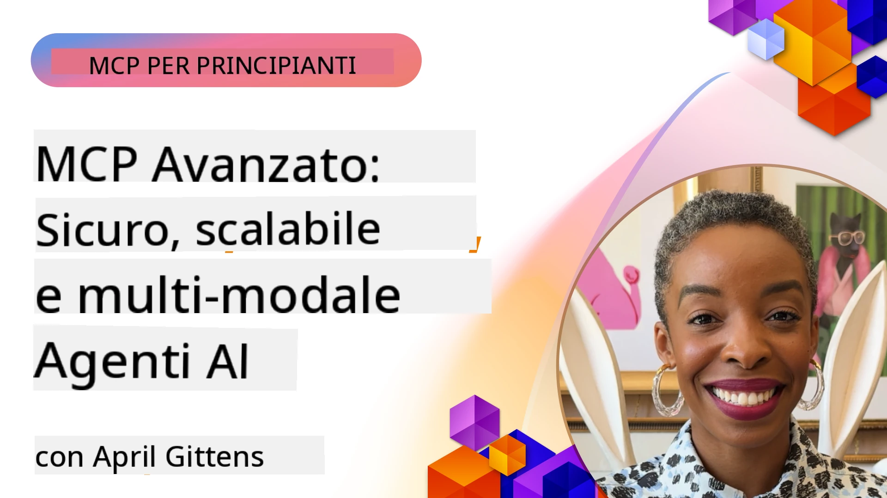

# Argomenti Avanzati in MCP

_(Clicca sull'immagine sopra per vedere il video di questa lezione)_

Questo capitolo tratta una serie di argomenti avanzati nell'implementazione del Model Context Protocol (MCP), inclusa l'integrazione multi-modale, la scalabilità, le migliori pratiche di sicurezza e l'integrazione aziendale. Questi argomenti sono cruciali per costruire applicazioni MCP robuste e pronte per la produzione che possono soddisfare le esigenze dei moderni sistemi di IA.

## Panoramica

Questa lezione esplora concetti avanzati nell'implementazione del Model Context Protocol, focalizzandosi su integrazione multi-modale, scalabilità, migliori pratiche di sicurezza e integrazione aziendale. Questi argomenti sono essenziali per costruire applicazioni MCP di livello produttivo capaci di gestire requisiti complessi in ambienti aziendali.

> **Nota sulla specifica attuale:** MCP `2026-07-28` depreca le primitive Roots e
> Sampling trattate nelle lezioni 5.4 e 5.6. Sposta inoltre la
> funzione sperimentale Tasks riferita in Protocol Features (5.16) a una
> estensione dedicata Tasks. Quelle lezioni sono mantenute per implementazioni
> legacy `2025-11-25` e includono indicazioni per la migrazione. Vedi
> [Che cosa è cambiato in MCP: la specifica 2026-07-28](../01-CoreConcepts/mcp-2026-07-28.md).

## Obiettivi di apprendimento

Al termine di questa lezione, sarai in grado di:

- Implementare capacità multi-modali all'interno dei framework MCP
- Progettare architetture MCP scalabili per scenari ad alta domanda
- Applicare le migliori pratiche di sicurezza allineate ai principi di sicurezza MCP
- Integrare MCP con sistemi e framework IA aziendali
- Ottimizzare performance e affidabilità in ambienti di produzione

## Lezioni e progetti di esempio

| Link | Titolo | Descrizione |
|------|-------|-------------|
| [5.1 Integration with Azure](./mcp-integration/README.md) | Integrazione con Azure | Impara come integrare il tuo server MCP su Azure |
| [5.2 Multi modal sample](./mcp-multi-modality/README.md) | Esempi multi-modali MCP | Esempi per risposte audio, immagini e multi-modali |
| [5.3 MCP OAuth2 sample](../../../05-AdvancedTopics/mcp-oauth2-demo) | Demo MCP OAuth2 | Applicazione Spring Boot minimale che mostra OAuth2 con MCP, sia come Authorization che Resource Server. Dimostra emissione sicura di token, endpoint protetti, deployment su Azure Container Apps e integrazione con API Management. |
| [5.4 Root Contexts](./mcp-root-contexts/README.md) | Contesti radice | Impara la primitiva Roots legacy `2025-11-25` e le opzioni di migrazione attuali (deprecate in `2026-07-28`) |
| [5.5 Routing](./mcp-routing/README.md) | Instradamento | Impara i diversi tipi di instradamento |
| [5.6 Sampling](./mcp-sampling/README.md) | Campionamento | Impara la primitiva Sampling legacy `2025-11-25` e le opzioni di migrazione attuali (deprecate in `2026-07-28`) |
| [5.7 Scaling](./mcp-scaling/README.md) | Scalabilità | Impara la scalabilità |
| [5.8 Security](./mcp-security/README.md) | Sicurezza | Proteggi il tuo server MCP |
| [5.9 Web Search sample](./web-search-mcp/README.md) | Ricerca Web MCP | Server e client MCP Python che si integrano con SerpAPI per ricerca web, notizie, prodotti e Q&A in tempo reale. Dimostra orchestrazione multi-strumento, integrazione API esterna e robusta gestione degli errori. |
| [5.10 Realtime Streaming](./mcp-realtimestreaming/README.md) | Streaming | Lo streaming dati in tempo reale è diventato essenziale nel mondo attuale guidato dai dati, dove aziende e applicazioni necessitano accesso immediato alle informazioni per prendere decisioni tempestive. |
| [5.11 Realtime Web Search](./mcp-realtimesearch/README.md) | Ricerca Web | Come MCP trasforma la ricerca web in tempo reale fornendo un approccio standardizzato alla gestione del contesto tra modelli IA, motori di ricerca e applicazioni. | 
| [5.12  Entra ID Authentication for Model Context Protocol Servers](./mcp-security-entra/README.md) | Autenticazione Entra ID | Microsoft Entra ID fornisce una solida soluzione cloud-based di gestione identità e accesso, aiutando a garantire che solo utenti e applicazioni autorizzati possano interagire con il tuo server MCP.|
| [5.13 Microsoft Foundry Agent Integration](./mcp-foundry-agent-integration/README.md) | Integrazione Microsoft Foundry | Impara come integrare i server Model Context Protocol con gli agenti Microsoft Foundry, abilitando una potente orchestrazione di strumenti e capacità IA aziendali con connessioni standardizzate a sorgenti dati esterne.|
| [5.14 Context Engineering](./mcp-contextengineering/README.md) | Ingegneria del Contesto | Opportunità futura delle tecniche di ingegneria del contesto per i server MCP, inclusa l'ottimizzazione del contesto, gestione dinamica del contesto e strategie per efficace prompt engineering all’interno dei framework MCP.|
| [5.15 MCP Custom Transport](./mcp-transport/README.md) | Trasporto Personalizzato | Impara come implementare meccanismi di trasporto personalizzati per scenari di comunicazione MCP specializzati.|
| [5.16 Protocol Features Deep Dive](./mcp-protocol-features/README.md) | Funzionalità del Protocollo | Padroneggia funzionalità avanzate del protocollo tra cui notifiche di progresso, cancellazione di richieste, template di risorse e modelli di gestione degli errori.|
| [5.17 Adversarial Multi-Agent Reasoning](./mcp-adversarial-agents/README.md) | Agenti Avversari | Usa due agenti con posizioni opposte, condividendo un singolo set di strumenti MCP, per rilevare allucinazioni, evidenziare casi limite e produrre output meglio calibrati attraverso un dibattito strutturato.|

> **Nota storica `2025-11-25`:** quella revisione ha introdotto Tasks sperimentali
> e ampliato diverse funzionalità del protocollo. Nel `2026-07-28`, Tasks sono passate a
> un'estensione ufficiale e Roots è diventato deprecato. Non usare lo
> stato delle funzionalità `2025-11-25` come guida corrente; vedi il
> [changelog 2026-07-28](https://modelcontextprotocol.io/specification/2026-07-28/changelog).

## Riferimenti Aggiuntivi

Per le informazioni più aggiornate sugli argomenti avanzati MCP, consulta:
- [Documentazione MCP](https://modelcontextprotocol.io/)
- [Specifiche MCP (2026-07-28)](https://modelcontextprotocol.io/specification/2026-07-28/)
- [Repository GitHub](https://github.com/modelcontextprotocol)
- [OWASP MCP Top 10](https://microsoft.github.io/mcp-azure-security-guide/mcp/) - Rischi di sicurezza e mitigazioni
- [Workshop Summit Sicurezza MCP (Sherpa)](https://azure-samples.github.io/sherpa/) - Formazione pratica sulla sicurezza

## Punti Chiave

- Le implementazioni MCP multi-modali estendono le capacità di IA oltre l'elaborazione del testo
- La scalabilità è essenziale per le distribuzioni aziendali e può essere affrontata tramite scaling orizzontale e verticale
- Misure di sicurezza complete proteggono i dati e garantiscono un controllo degli accessi appropriato
- L'integrazione aziendale con piattaforme come Azure OpenAI e Microsoft AI Foundry migliora le capacità di MCP
- Le implementazioni MCP avanzate beneficiano di architetture ottimizzate e di una gestione attenta delle risorse

## Esercizio

Progetta un'implementazione MCP di livello aziendale per un caso d'uso specifico:

1. Identifica i requisiti multi-modali per il tuo caso d'uso
2. Delinea i controlli di sicurezza necessari per proteggere i dati sensibili
3. Progetta un'architettura scalabile in grado di gestire carichi variabili
4. Pianifica i punti di integrazione con i sistemi IA aziendali
5. Documenta i potenziali colli di bottiglia delle prestazioni e le strategie di mitigazione

## Risorse aggiuntive

- [Documentazione Azure OpenAI](https://learn.microsoft.com/en-us/azure/ai-services/openai/)
- [Documentazione Microsoft AI Foundry](https://learn.microsoft.com/en-us/ai-services/)

---

## Cosa c'è dopo

Esplora le lezioni in questo modulo iniziando da: [5.1 MCP Integration](./mcp-integration/README.md)

Una volta completato questo modulo, continua con: [Modulo 6: Contributi della comunità](../06-CommunityContributions/README.md)

---

<!-- CO-OP TRANSLATOR DISCLAIMER START -->
**Disclaimer**:
Questo documento è stato tradotto utilizzando il servizio di traduzione AI [Co-op Translator](https://github.com/Azure/co-op-translator). Sebbene ci impegniamo per garantire la precisione, si prega di notare che le traduzioni automatizzate possono contenere errori o imprecisioni. Il documento originale nella sua lingua nativa deve essere considerato la fonte autorevole. Per informazioni critiche, si raccomanda una traduzione professionale effettuata da un essere umano. Non siamo responsabili per eventuali malintesi o interpretazioni errate derivanti dall’uso di questa traduzione.
<!-- CO-OP TRANSLATOR DISCLAIMER END -->