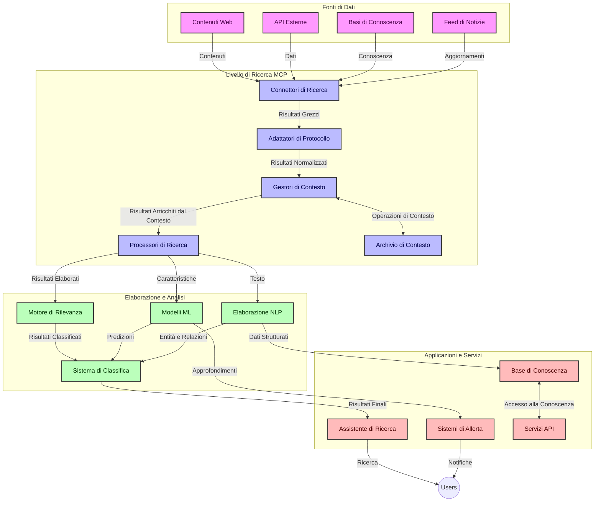
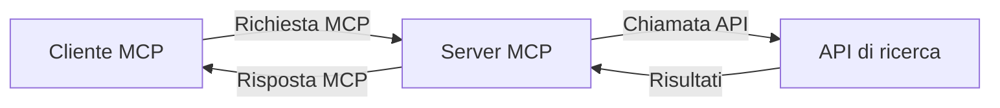
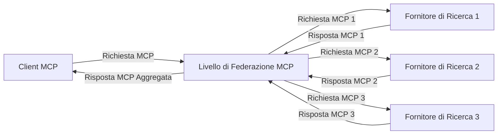
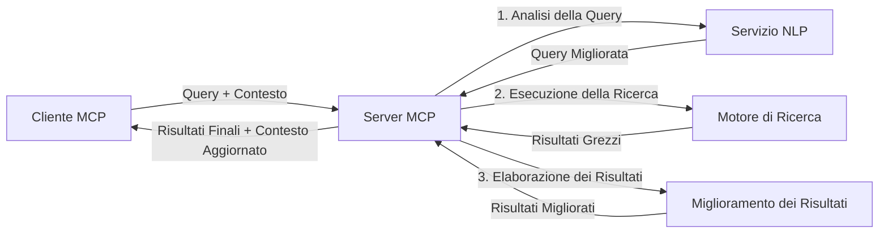

# Model Context Protocol per la Ricerca Web in Tempo Reale

## Panoramica

La ricerca web in tempo reale è diventata essenziale nell'ambiente informativo odierno, dove le applicazioni necessitano di accesso immediato a informazioni aggiornate in tutta internet per fornire risposte rilevanti e tempestive. Il Model Context Protocol (MCP) rappresenta un significativo avanzamento nell'ottimizzazione di questi processi di ricerca in tempo reale, migliorando l'efficienza della ricerca, mantenendo l'integrità contestuale e migliorando le prestazioni complessive del sistema.

Questo modulo esplora come MCP trasforma la ricerca web in tempo reale fornendo un approccio standardizzato alla gestione del contesto tra modelli AI, motori di ricerca e applicazioni.

### Cosa Imparerai

In questa guida completa, scoprirai:

- Come MCP crea un ponte senza soluzione di continuità tra modelli AI e capacità di ricerca web in tempo reale
- Schemi architetturali per implementare soluzioni di ricerca efficienti e scalabili con MCP
- Tecniche per preservare il contesto di ricerca attraverso molteplici query e interazioni
- Implementazioni pratiche di codice in Python e JavaScript per vari scenari di ricerca
- Metodi per bilanciare rilevanza, attualità e prestazioni nei sistemi di ricerca potenziati da MCP

## Introduzione alla Ricerca Web in Tempo Reale

La ricerca web in tempo reale è un approccio tecnologico che consente l'interrogazione continua, l'elaborazione e l'analisi delle informazioni basate sul web mentre vengono pubblicate o aggiornate, permettendo ai sistemi di fornire informazioni fresche e rilevanti con minima latenza. A differenza dei sistemi di ricerca tradizionali che operano su dati indicizzati che possono essere vecchi di ore o giorni, la ricerca in tempo reale elabora dati live dal web, offrendo approfondimenti e informazioni che riflettono lo stato attuale del contenuto online.

### Concetti Fondamentali della Ricerca Web in Tempo Reale:

- **Elaborazione Continua delle Query**: Le query di ricerca sono elaborate contro fonti di dati in costante aggiornamento
- **Prioritizzazione dell'Attualità**: I sistemi sono progettati per privilegiare le informazioni fresche
- **Bilanciamento della Rilevanza**: Mantenere un equilibrio tra rilevanza e attualità
- **Architettura Scalabile**: I sistemi devono gestire carichi variabili di query e volumi di dati
- **Comprensione Contestuale**: Mantenere il contesto utente attraverso iterazioni di ricerca è cruciale per risultati significativi
- **Riformulazione Dinamica delle Query**: Modificare adattivamente le query basandosi sul contesto e sui risultati precedenti
- **Integrazione Multi-Sorgente**: Combinare risultati da più fornitori di ricerca e fonti web
- **Comprensione Semantica**: Elaborare query e contenuti basandosi sul significato piuttosto che sulle sole parole chiave
- **Classifica in Tempo Reale**: Regolare continuamente la classifica dei risultati man mano che nuove informazioni diventano disponibili

### Il Model Context Protocol e la Ricerca Web in Tempo Reale

Il Model Context Protocol (MCP) affronta diverse sfide critiche negli ambienti di ricerca web in tempo reale:

1. **Preservazione del Contesto di Ricerca**: MCP standardizza come il contesto è mantenuto attraverso componenti di ricerca distribuiti, assicurando che modelli AI e nodi di elaborazione abbiano accesso alla storia rilevante delle query e alle preferenze dell'utente.

2. **Gestione Efficiente delle Query**: Fornendo meccanismi strutturati per la trasmissione del contesto, MCP riduce il sovraccarico di ripetere il contesto in ogni iterazione di ricerca.

3. **Interoperabilità**: MCP crea un linguaggio comune per la condivisione del contesto tra diverse tecnologie di ricerca e modelli AI, permettendo architetture più flessibili ed estensibili.

4. **Contesto Ottimizzato per la Ricerca**: Le implementazioni MCP possono prioritizzare quali elementi del contesto sono più rilevanti per una ricerca efficace, ottimizzando sia le prestazioni che la precisione.

5. **Elaborazione di Ricerca Adattativa**: Con una gestione corretta del contesto tramite MCP, i sistemi di ricerca possono adattare dinamicamente l'elaborazione basandosi sulle esigenze in evoluzione degli utenti e del panorama informativo.

Nelle applicazioni moderne che variano dall'aggregazione di notizie agli assistenti di ricerca, l'integrazione di MCP con tecnologie di ricerca web consente ricerche più intelligenti e consapevoli del contesto, che possono fornire risultati sempre più pertinenti man mano che continuano le interazioni degli utenti.

## Obiettivi di Apprendimento

Al termine di questa lezione, sarai in grado di:

- Comprendere le basi della ricerca web in tempo reale e le sue sfide nelle applicazioni moderne
- Spiegare come il Model Context Protocol (MCP) potenzia le capacità di ricerca web in tempo reale
- Implementare soluzioni di ricerca basate su MCP utilizzando framework e API popolari
- Progettare e distribuire architetture di ricerca scalabili ad alte prestazioni con MCP
- Applicare i concetti MCP a vari casi d'uso inclusi ricerca semantica, assistenza alla ricerca e navigazione aumentata da AI
- Valutare le tendenze emergenti e le innovazioni future nelle tecnologie di ricerca basate su MCP
- Sviluppare sistemi di ricerca consapevoli del contesto che apprendono dalle interazioni utente
- Integrare capacità di ricerca web in assistenti AI usando protocolli MCP standardizzati
- Creare pipeline di ricerca a più fasi che raffinano progressivamente i risultati basandosi sul contesto
- Ottimizzare le prestazioni di ricerca mantenendo una consapevolezza completa del contesto

### Definizione e Importanza

La ricerca web in tempo reale comporta l'interrogazione, il recupero e la consegna continua di informazioni basate sul web con minima latenza. A differenza dei motori di ricerca tradizionali che periodicamente eseguono crawling e indicizzazione del web, la ricerca in tempo reale mira a mettere in evidenza le informazioni man mano che diventano disponibili, consentendo l'accesso immediato ai contenuti più aggiornati.

Le caratteristiche chiave della ricerca web in tempo reale includono:

- **Freschezza**: Prioritizzazione di contenuti e aggiornamenti recenti
- **Elaborazione Continua**: Monitoraggio costante per nuove informazioni
- **Adattamento delle Query**: Affinamento delle query di ricerca basato su contesto e feedback
- **Consegna Immediata**: Fornitura dei risultati di ricerca con minimo ritardo
- **Ritenzione del Contesto**: Costruzione sulle query precedenti per una maggiore rilevanza

### Sfide nella Ricerca Web Tradizionale

Gli approcci tradizionali alla ricerca web affrontano diverse limitazioni quando applicati a scenari in tempo reale:

1. **Frammentazione del Contesto**: Difficoltà a mantenere il contesto di ricerca attraverso molteplici query
2. **Freschezza delle Informazioni**: Sfide nell'accesso e prioritizzazione delle informazioni più recenti
3. **Complessità di Integrazione**: Problemi di interoperabilità tra sistemi di ricerca e applicazioni
4. **Problemi di Latenza**: Bilanciare una ricerca completa con i requisiti di tempo di risposta
5. **Regolazione della Rilevanza**: Garantire accuratezza e rilevanza dare priorità all'attualità

## Comprendere il Model Context Protocol (MCP) per la Ricerca

### Cos'è MCP nei Contesti di Ricerca?

Il Model Context Protocol (MCP) è un protocollo di comunicazione standardizzato progettato per facilitare l'interazione efficiente tra modelli AI e applicazioni. Nel contesto della ricerca web in tempo reale, MCP fornisce un quadro per:

- Preservare il contesto di ricerca lungo le sequenze di query
- Standardizzare i formati delle query di ricerca e dei risultati
- Ottimizzare la trasmissione dei parametri di ricerca e dei risultati
- Migliorare la comunicazione modello-motore di ricerca

### Componenti Principali e Architettura

L'architettura MCP per la ricerca web in tempo reale consiste in diversi componenti chiave:

1. **Gestori del Contesto delle Query**: Gestiscono e mantengono il contesto di ricerca attraverso più query
2. **Processori di Ricerca**: Elaborano le richieste di ricerca in ingresso usando tecniche consapevoli del contesto
3. **Adattatori di Protocollo**: Convertire tra diverse API di ricerca preservando il contesto
4. **Archivio del Contesto**: Conservare e recuperare efficientemente la storia della ricerca e le preferenze
5. **Connettori di Ricerca**: Collegarsi a vari motori di ricerca e API web



### Come MCP Migliora la Ricerca Web in Tempo Reale

MCP affronta le sfide della ricerca web tradizionale tramite:

- **Continuità Contestuale**: Mantenere le relazioni tra le query durante l'intera sessione di ricerca
- **Trasmissione Ottimizzata**: Ridurre la ridondanza nei parametri di ricerca tramite una gestione intelligente del contesto
- **Interfacce Standardizzate**: Fornire API coerenti per i componenti di ricerca
- **Riduzione della Latenza**: Minimizzare il sovraccarico di elaborazione tramite una gestione efficiente del contesto
- **Rilevanza Migliorata**: Migliorare la rilevanza della ricerca preservando l'intento dell'utente attraverso query multiple

## Integrazione e Implementazione

I sistemi di ricerca web in tempo reale richiedono una progettazione e un'implementazione architetturale attente per mantenere sia le prestazioni che l'integrità contestuale. Il Model Context Protocol offre un approccio standardizzato per integrare modelli AI e tecnologie di ricerca, consentendo pipeline di ricerca più sofisticate e consapevoli del contesto.

### Panoramica dell'Integrazione MCP nelle Architetture di Ricerca

Implementare MCP negli ambienti di ricerca web in tempo reale comporta diverse considerazioni chiave:

1. **Serializzazione del Contesto di Ricerca**: MCP fornisce meccanismi efficienti per codificare le informazioni contestuali all'interno delle richieste di ricerca, assicurando che il contesto essenziale accompagni la query lungo tutta la pipeline di elaborazione. Ciò include formati di serializzazione standardizzati ottimizzati per i metadati correlati alla ricerca.

2. **Elaborazione di Ricerca Stateful**: MCP consente un'elaborazione stateful più intelligente mantenendo una rappresentazione coerente del contesto attraverso le iterazioni di ricerca. Ciò è particolarmente prezioso nelle pipeline di ricerca a più fasi dove il perfezionamento del contesto migliora i risultati.

3. **Espansione e Perfezionamento delle Query**: Le implementazioni MCP nei sistemi di ricerca possono facilitare sofisticate espansioni e perfezionamenti delle query basati sul contesto accumulato, consentendo risultati via via più pertinenti man mano che la sessione di ricerca procede.

4. **Caching e Prioritizzazione dei Risultati**: Standardizzando la gestione del contesto, MCP aiuta a gestire il caching e la prioritizzazione dei risultati, permettendo ai componenti di adattarsi in base al contesto di ricerca in evoluzione.

5. **Federazione e Aggregazione di Ricerca**: MCP facilita federazioni più sofisticate della ricerca tra molteplici backend fornendo rappresentazioni strutturate del contesto di ricerca, permettendo aggregazioni più significative di risultati provenienti da fonti diverse.

L'implementazione di MCP attraverso varie tecnologie di ricerca crea un approccio unificato alla gestione del contesto, riducendo la necessità di codice di integrazione personalizzato e migliorando la capacità del sistema di mantenere un contesto significativo man mano che le query di ricerca evolvono.

### MCP in Diverse Implementazioni di Ricerca Web

Questi esempi seguono la specifica MCP attuale che si concentra su un protocollo basato su JSON-RPC con distinti meccanismi di trasporto. Il codice dimostra come puoi implementare integrazioni di ricerca personalizzate mantenendo piena compatibilità con il protocollo MCP.


<details>
<summary>Implementazione Python con API di Ricerca Generica</summary>

```python
import asyncio
import json
import aiohttp
from typing import Dict, Any, Optional, List
from contextlib import asynccontextmanager
from collections.abc import AsyncIterator

# Importa le librerie standard MCP
from mcp.client.session import ClientSession
from mcp.client.streamable_http import streamablehttp_client
from mcp.types import TextContent, CreateMessageRequestParams, CreateMessageResult
from mcp.server.fastmcp import FastMCP

# Crea un server FastMCP per la ricerca web
search_server = FastMCP("WebSearch")

# Classe per gestire le operazioni di ricerca web
class WebSearchHandler:
    def __init__(self, api_endpoint: str, api_key: str):
        self.api_endpoint = api_endpoint
        self.api_key = api_key
        self.session = None
        
    async def initialize(self):
        """Initialize the HTTP session"""
        self.session = aiohttp.ClientSession(
            headers={"Authorization": f"Bearer {self.api_key}"}
        )
    
    async def close(self):
        """Close the HTTP session"""
        if self.session:
            await self.session.close()
            
    async def perform_search(self, query: str, max_results: int = 5, 
                           include_domains: List[str] = None, 
                           exclude_domains: List[str] = None,
                           time_period: str = "any") -> Dict[str, Any]:
        """Perform web search using the search API"""
        # Costruisci i parametri di ricerca
        search_params = {
            "q": query,
            "limit": max_results,
            "time": time_period
        }
        
        if include_domains:
            search_params["site"] = ",".join(include_domains)
            
        if exclude_domains:
            search_params["exclude_site"] = ",".join(exclude_domains)
        
        # Esegui la richiesta di ricerca
        try:
            async with self.session.get(
                self.api_endpoint,
                params=search_params
            ) as response:
                if response.status != 200:
                    error_text = await response.text()
                    raise Exception(f"Search API error: {response.status} - {error_text}")
                
                search_data = await response.json()
                
                # Trasforma la risposta specifica dell'API in un formato standard
                results = []
                for item in search_data.get("results", []):
                    results.append({
                        "title": item.get("title", ""),
                        "url": item.get("url", ""),
                        "snippet": item.get("snippet", ""),
                        "date": item.get("published_date", ""),
                        "source": item.get("source", "")
                    })
                
                return {
                    "query": query,
                    "totalResults": len(results),
                    "results": results
                }
        except Exception as e:
            print(f"Search API request error: {e}")
            raise

# Inizializza il gestore di ricerca
search_handler = WebSearchHandler(
    api_endpoint="https://api.search-service.example/search",
    api_key="your-api-key-here"
)

# Configura il lifespan per gestire il gestore di ricerca
@asyncio.asynccontextmanager
async def app_lifespan(server: FastMCP):
    """Manage application lifecycle"""
    await search_handler.initialize()
    try:
        yield {"search_handler": search_handler}
    finally:
        await search_handler.close()

# Imposta il lifespan per il server
search_server = FastMCP("WebSearch", lifespan=app_lifespan)

# Registra uno strumento di ricerca web
@search_server.tool()
async def web_search(query: str, max_results: int = 5, 
                   include_domains: List[str] = None,
                   exclude_domains: List[str] = None,
                   time_period: str = "any") -> Dict[str, Any]:
    """
    Search the web for information
    
    Args:
        query: The search query
        max_results: Maximum number of results to return (default: 5)
        include_domains: List of domains to include in search results
        exclude_domains: List of domains to exclude from search results
        time_period: Time period for results ("day", "week", "month", "any")
        
    Returns:
        Dictionary containing search results
    """
    ctx = search_server.get_context()
    search_handler = ctx.request_context.lifespan_context["search_handler"]
    
    results = await search_handler.perform_search(
        query=query,
        max_results=max_results,
        include_domains=include_domains,
        exclude_domains=exclude_domains,
        time_period=time_period
    )
    
    return results

# Esempio di utilizzo del client
async def client_example():
    # Connetti al server di ricerca usando il trasporto HTTP Streamable
    async with streamablehttp_client("http://localhost:8000/mcp") as (read, write, _):
        async with ClientSession(read, write) as session:
            # Inizializza la connessione
            await session.initialize()
            
            # Chiama lo strumento web_search
            search_results = await session.call_tool(
                "web_search", 
                {
                    "query": "latest developments in AI and Model Context Protocol",
                    "max_results": 5,
                    "time_period": "day",
                    "include_domains": ["github.com", "microsoft.com"]
                }
            )
            
            print(f"Search results: {search_results}")

# Esempio di esecuzione del server
if __name__ == "__main__":
    # Esegui il server con il trasporto HTTP Streamable
    search_server.run(transport="streamable-http")
```
</details> 

<details>
<summary>Implementazione JavaScript con Ricerca Basata su Browser</summary>


```javascript
// Implementazione del server MCP per la ricerca web
import { McpServer, ResourceTemplate } from '@modelcontextprotocol/sdk/server/mcp.js';
import { StreamableHTTPServerTransport } from '@modelcontextprotocol/sdk/server/streamableHttp.js';
import { z } from 'zod';

// Crea un server MCP per la ricerca web
const searchServer = new McpServer({
    name: "BrowserSearch",
    description: "A server that provides web search capabilities"
});

// Classe del servizio di ricerca
class SearchService {
    constructor(searchApiUrl, apiKey) {
        this.searchApiUrl = searchApiUrl;
        this.apiKey = apiKey;
    }

    async performSearch(parameters) {
        const {
            query = '',
            maxResults = 5,
            includeDomains = [],
            excludeDomains = [],
            timePeriod = 'any'
        } = parameters;
        
        // Costruisci l'URL di ricerca con i parametri
        const url = new URL(this.searchApiUrl);
        url.searchParams.append('q', query);
        url.searchParams.append('limit', maxResults);
        url.searchParams.append('time', timePeriod);
        
        if (includeDomains.length > 0) {
            url.searchParams.append('site', includeDomains.join(','));
        }
        
        if (excludeDomains.length > 0) {
            url.searchParams.append('exclude_site', excludeDomains.join(','));
        }
        
        try {
            const response = await fetch(url.toString(), {
                method: 'GET',
                headers: {
                    'Authorization': `Bearer ${this.apiKey}`,
                    'Content-Type': 'application/json'
                }
            });
            
            if (!response.ok) {
                const errorText = await response.text();
                throw new Error(`Search API error: ${response.status} - ${errorText}`);
            }
            
            const searchData = await response.json();
            
            // Trasforma la risposta specifica dell'API in un formato standard
            const results = searchData.results?.map(item => ({
                title: item.title || '',
                url: item.url || '',
                snippet: item.snippet || '',
                date: item.published_date || '',
                source: item.source || ''
            })) || [];
            
            return {
                query,
                totalResults: results.length,
                results
            };
        } catch (error) {
            console.error('Search API request error:', error);
            throw error;
        }
    }
}

// Inizializza il servizio di ricerca
const searchService = new SearchService(
    'https://api.search-service.example/search',
    'your-api-key-here'
);

// Configura il provider di contesto per il server
searchServer.setContextProvider(() => {
    return {
        searchService
    };
});

// Registra lo strumento di ricerca web
searchServer.tool({
    name: 'web_search',
    description: 'Search the web for information',
    parameters: {
        type: 'object',
        properties: {
            query: {
                type: 'string',
                description: 'The search query'
            },
            maxResults: {
                type: 'integer',
                description: 'Maximum number of results to return',
                default: 5
            },
            includeDomains: {
                type: 'array',
                items: { type: 'string' },
                description: 'List of domains to include in search results'
            },
            excludeDomains: {
                type: 'array',
                items: { type: 'string' },
                description: 'List of domains to exclude from search results'
            },
            timePeriod: {
                type: 'string',
                description: 'Time period for results',
                enum: ['day', 'week', 'month', 'any'],
                default: 'any'
            }
        },
        required: ['query']
    },
    handler: async (params, context) => {
        const { searchService } = context;
        return await searchService.performSearch(params);
    }
});

// Esempio di codice client per connettersi al server di ricerca
import { Client } from '@modelcontextprotocol/sdk/client/index.js';
import { StreamableHTTPClientTransport } from '@modelcontextprotocol/sdk/client/streamableHttp.js';

async function connectToSearchServer() {
    // Connetti al server di ricerca
    const transport = new StreamableHTTPClientTransport(
        new URL('http://localhost:8000/mcp')
    );
    
    const client = new Client({
        name: 'search-client',
        version: '1.0.0'
    });
    
    await client.connect(transport);
    
    // Esegui lo strumento di ricerca
    const searchResults = await client.callTool({
        name: 'web_search',
        arguments: {
            query: 'Model Context Protocol implementation examples',
            maxResults: 10,
            timePeriod: 'week',
            includeDomains: ['github.com', 'docs.microsoft.com']
        }
    });
    
    console.log('Search results:', searchResults);
    
    // Pulizia
    await client.disconnect();
}

// Avvia il server
const transport = new StreamableHTTPServerTransport();
await searchServer.connect(transport);
console.log('Search server running at http://localhost:8000/mcp');

// In un processo separato o dopo che il server è stato avviato
// connectToSearchServer().catch(console.error);
```
</details> 


## Disclaimer Sugli Esempi di Codice

> **Nota Importante**: Gli esempi di codice seguenti dimostrano l'integrazione del Model Context Protocol (MCP) con la funzionalità di ricerca web. Pur seguendo i modelli e le strutture degli SDK ufficiali MCP, sono stati semplificati a scopo didattico.
> 
> Questi esempi mostrano:
> 
> 1. **Implementazione Python**: Un'implementazione del server FastMCP che fornisce uno strumento di ricerca web e si collega a un'API di ricerca esterna. Questo esempio dimostra una corretta gestione del ciclo di vita, gestione del contesto e implementazione dello strumento seguendo i modelli dell'[SDK Python MCP ufficiale](https://github.com/modelcontextprotocol/python-sdk). Il server utilizza il trasporto HTTP Streamable raccomandato che ha sostituito il precedente trasporto SSE nelle distribuzioni di produzione.
> 
> 2. **Implementazione JavaScript**: Un'implementazione TypeScript/JavaScript utilizzando il modello FastMCP dall'[SDK TypeScript MCP ufficiale](https://github.com/modelcontextprotocol/typescript-sdk) per creare un server di ricerca con definizioni corrette degli strumenti e connessioni client. Segue i modelli raccomandati più recenti per la gestione della sessione e la conservazione del contesto.
> 
> Questi esempi richiederebbero ulteriori gestioni degli errori, autenticazione e codice specifico di integrazione API per un utilizzo in produzione. Gli endpoint dell'API di ricerca mostrati (`https://api.search-service.example/search`) sono segnaposto e dovrebbero essere sostituiti con endpoint reali di servizi di ricerca.
> 
> Per dettagli completi di implementazione e gli approcci più aggiornati, si prega di fare riferimento alla [specifica MCP ufficiale](https://spec.modelcontextprotocol.io/) e alla documentazione SDK.

## Concetti Principali

### Il Framework Model Context Protocol (MCP)

Alla base, il Model Context Protocol fornisce un modo standardizzato per modelli AI, applicazioni e servizi di scambiare contesto. Nella ricerca web in tempo reale, questo framework è essenziale per creare esperienze di ricerca coerenti e multi-turno. I componenti chiave includono:

1. **Architettura Client-Server**: MCP stabilisce una chiara separazione tra client di ricerca (richiedenti) e server di ricerca (fornitori), consentendo modelli di distribuzione flessibili.

2. **Comunicazione JSON-RPC**: Il protocollo utilizza JSON-RPC per lo scambio di messaggi, rendendolo compatibile con le tecnologie web e facile da implementare su diverse piattaforme.

3. **Gestione del Contesto**: MCP definisce metodi strutturati per mantenere, aggiornare e sfruttare il contesto di ricerca attraverso molteplici interazioni.

4. **Definizioni degli Strumenti**: Le capacità di ricerca sono esposte come strumenti standardizzati con parametri e valori di ritorno ben definiti.

5. **Supporto allo Streaming**: Il protocollo supporta lo streaming dei risultati, essenziale per la ricerca in tempo reale dove i risultati possono arrivare progressivamente.

### Schemi di Integrazione della Ricerca Web

Quando si integra MCP con la ricerca web, emergono diversi schemi:

#### 1. Integrazione Diretta del Fornitore di Ricerca



In questo schema, il server MCP interfaccia direttamente con una o più API di ricerca, traducendo le richieste MCP in chiamate specifiche API e formattando i risultati come risposte MCP.

#### 2. Ricerca Federata con Preservazione del Contesto



Questo schema distribuisce le query di ricerca tra molteplici fornitori di ricerca compatibili con MCP, ciascuno potenzialmente specializzato in diversi tipi di contenuto o capacità di ricerca, mantenendo al contempo un contesto unificato.

#### 3. Catena di Ricerca Arricchita dal Contesto



In questo schema, il processo di ricerca è diviso in più fasi, con il contesto che viene arricchito a ogni passaggio, risultando in risultati progressivamente più rilevanti.

### Componenti del Contesto di Ricerca

Nella ricerca web basata su MCP, il contesto tipicamente include:

- **Storia delle Query**: Query di ricerca precedenti nella sessione
- **Preferenze Utente**: Lingua, regione, impostazioni di ricerca sicura
- **Storia delle Interazioni**: Quali risultati sono stati cliccati, tempo trascorso sui risultati
- **Parametri di Ricerca**: Filtri, ordini di ordinamento e altri modificatori di ricerca
- **Conoscenza del Dominio**: Contesto specifico del soggetto rilevante per la ricerca
- **Contesto Temporale**: Fattori di rilevanza basati sul tempo
- **Preferenze della Sorgente**: Fonti di informazione affidabili o preferite

## Casi d'Uso e Applicazioni

### Ricerca e Raccolta di Informazioni

MCP migliora i flussi di lavoro di ricerca:

- Preservando il contesto di ricerca attraverso le sessioni
- Consentendo query più sofisticate e contestualmente rilevanti
- Supportando la federazione di ricerca multi-sorgente
- Facilitando l'estrazione di conoscenza dai risultati di ricerca

### Monitoraggio in Tempo Reale di Notizie e Tendenze

La ricerca potenziata da MCP offre vantaggi per il monitoraggio delle notizie:

- Scoperta quasi in tempo reale di storie di notizie emergenti
- Filtraggio contestuale delle informazioni rilevanti
- Tracciamento di temi ed entità attraverso molteplici fonti
- Avvisi personalizzati sulle notizie basati sul contesto utente

### Navigazione e Ricerca Aumentata da AI

MCP crea nuove possibilità per la navigazione aumentata da AI:

- Suggerimenti di ricerca contestuali basati sull'attività corrente del browser
- Integrazione fluida della ricerca web con assistenti potenziati da LLM
- Perfezionamento multi-turno della ricerca con contesto mantenuto
- Miglioramento del fact-checking e della verifica delle informazioni

## Tendenze e Innovazioni Future

### Evoluzione di MCP nella Ricerca Web

Guardando avanti, prevediamo che MCP evolverà per affrontare:


- **Ricerca Multimodale**: Integrazione di ricerca testuale, di immagini, audio e video con contesto preservato
- **Ricerca Decentralizzata**: Supporto per ecosistemi di ricerca distribuiti e federati
- **Privacy nella Ricerca**: Meccanismi di ricerca che preservano la privacy e sono consapevoli del contesto
- **Comprensione delle Query**: Analisi semantica profonda delle query di ricerca in linguaggio naturale

### Potenziali Progressi nella Tecnologia

Tecnologie emergenti che modelleranno il futuro della ricerca MCP:

1. **Architetture di Ricerca Neurale**: Sistemi di ricerca basati su embedding ottimizzati per MCP
2. **Contesto di Ricerca Personalizzato**: Apprendimento dei modelli di ricerca individuali degli utenti nel tempo
3. **Integrazione di Knowledge Graph**: Ricerca contestuale potenziata da grafi di conoscenza specifici di dominio
4. **Contesto Cross-Modale**: Mantenimento del contesto attraverso diverse modalità di ricerca

## Esercizi Pratici

### Esercizio 1: Configurare una Pipeline di Ricerca MCP di Base

In questo esercizio imparerai a:
- Configurare un ambiente di ricerca MCP di base
- Implementare gestori di contesto per la ricerca sul web
- Testare e convalidare la preservazione del contesto attraverso iterazioni di ricerca

### Esercizio 2: Costruire un Assistente alla Ricerca con Ricerca MCP

Crea un'applicazione completa che:
- Processa domande di ricerca in linguaggio naturale
- Esegue ricerche web contestuali
- Sintetizza informazioni provenienti da più fonti
- Presenta risultati di ricerca organizzati

### Esercizio 3: Implementare la Federazione di Ricerca Multi-Fonte con MCP

Esercizio avanzato che comprende:
- Invio contestuale di query a più motori di ricerca
- Classifica e aggregazione dei risultati
- Deduplicazione contestuale dei risultati di ricerca
- Gestione di metadati specifici della fonte

## Risorse Aggiuntive

- [Model Context Protocol Specification](https://spec.modelcontextprotocol.io/) - Specifica ufficiale MCP e documentazione dettagliata del protocollo
- [Model Context Protocol Documentation](https://modelcontextprotocol.io/) - Tutorial dettagliati e guide all'implementazione
- [MCP Python SDK](https://github.com/modelcontextprotocol/python-sdk) - Implementazione ufficiale in Python del protocollo MCP
- [MCP TypeScript SDK](https://github.com/modelcontextprotocol/typescript-sdk) - Implementazione ufficiale in TypeScript del protocollo MCP
- [MCP Reference Servers](https://github.com/modelcontextprotocol/servers) - Implementazioni di riferimento di server MCP
- [Bing Web Search API Documentation](https://learn.microsoft.com/en-us/bing/search-apis/bing-web-search/overview) - API di ricerca web di Microsoft
- [Google Custom Search JSON API](https://developers.google.com/custom-search/v1/overview) - Motore di ricerca programmabile di Google
- [SerpAPI Documentation](https://serpapi.com/search-api) - API della pagina di risultati dei motori di ricerca
- [Meilisearch Documentation](https://www.meilisearch.com/docs) - Motore di ricerca open-source
- [Elasticsearch Documentation](https://www.elastic.co/guide/index.html) - Motore di ricerca e analisi distribuito
- [LangChain Documentation](https://python.langchain.com/docs/get_started/introduction) - Costruire applicazioni con LLM

## Obiettivi di Apprendimento

Completando questo modulo, sarai in grado di:

- Comprendere i fondamenti della ricerca web in tempo reale e le sue sfide
- Spiegare come il Model Context Protocol (MCP) potenzia le capacità di ricerca web in tempo reale
- Implementare soluzioni di ricerca basate su MCP utilizzando framework e API popolari
- Progettare e distribuire architetture di ricerca scalabili e ad alte prestazioni con MCP
- Applicare i concetti MCP a vari casi d'uso inclusi ricerca semantica, assistenza alla ricerca e navigazione aumentata dall'IA
- Valutare le tendenze emergenti e le innovazioni future nelle tecnologie di ricerca basate su MCP


### Considerazioni sulla Fiducia e Sicurezza

Nell'implementare soluzioni di ricerca web basate su MCP, ricorda questi principi importanti dalla specifica MCP:

1. **Consenso e Controllo dell'Utente**: Gli utenti devono fornire esplicitamente consenso e comprendere tutte le operazioni e gli accessi ai dati. Questo è particolarmente importante per implementazioni di ricerca web che possono accedere a fonti di dati esterne.

2. **Privacy dei Dati**: Assicurati di gestire correttamente le query di ricerca e i risultati, soprattutto se possono contenere informazioni sensibili. Implementa controlli di accesso appropriati per proteggere i dati degli utenti.

3. **Sicurezza degli Strumenti**: Implementa autorizzazioni e validazioni corrette per gli strumenti di ricerca, poiché rappresentano potenziali rischi di sicurezza tramite esecuzione di codice arbitrario. Le descrizioni del comportamento degli strumenti devono essere considerate non affidabili a meno che non provengano da un server di fiducia.

4. **Documentazione Chiara**: Fornisci documentazione chiara sulle capacità, limitazioni e considerazioni di sicurezza della tua implementazione di ricerca basata su MCP, seguendo le linee guida di implementazione della specifica MCP.

5. **Flussi di Consenso Robusti**: Costruisci flussi di consenso e autorizzazione robusti che spieghino chiaramente cosa fa ogni strumento prima di autorizzarne l'uso, specialmente per strumenti che interagiscono con risorse web esterne.

Per dettagli completi sulla sicurezza MCP e considerazioni di fiducia, riferisciti alla [documentazione ufficiale](https://modelcontextprotocol.io/specification/2025-11-25/basic/security_best_practices).

## Cosa c'è dopo

- [5.12 Autenticazione Entra ID per Server Model Context Protocol](../mcp-security-entra/README.md)

---

<!-- CO-OP TRANSLATOR DISCLAIMER START -->
**Disclaimer**:
Questo documento è stato tradotto utilizzando il servizio di traduzione AI [Co-op Translator](https://github.com/Azure/co-op-translator). Sebbene ci impegniamo per garantire la precisione, si prega di notare che le traduzioni automatizzate possono contenere errori o imprecisioni. Il documento originale nella sua lingua nativa deve essere considerato la fonte autorevole. Per informazioni critiche, si raccomanda una traduzione professionale effettuata da un essere umano. Non siamo responsabili per eventuali malintesi o interpretazioni errate derivanti dall’uso di questa traduzione.
<!-- CO-OP TRANSLATOR DISCLAIMER END -->