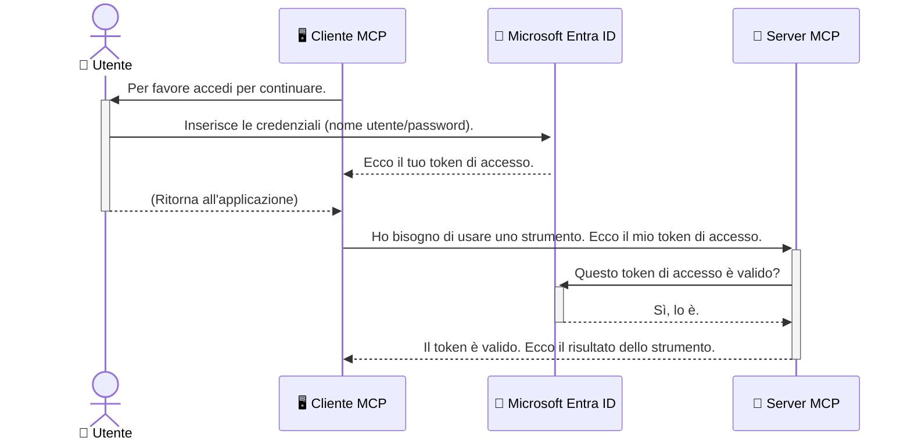

# Mettere in Sicurezza i Flussi di Lavoro AI: Autenticazione Entra ID per i Server del Protocollo Model Context

> [!NOTE]
> Il codice del server remoto in questa lezione protegge gli endpoint legacy `/sse` e `/message`
> e ha come target MCP `2025-11-25`. Mantieni le sue pratiche di verifica dell’identità e del token,
> ma utilizza un trasporto Streamable HTTP compatibile con `2026-07-28` per nuove
> implementazioni.

## Introduzione
Mettere in sicurezza il tuo server Model Context Protocol (MCP) è importante quanto chiudere a chiave la porta di casa tua. Lasciare aperto il server MCP espone i tuoi strumenti e dati ad accessi non autorizzati, che possono portare a violazioni della sicurezza. Microsoft Entra ID offre una robusta soluzione cloud di gestione dell’identità e degli accessi, aiutando a garantire che solo utenti e applicazioni autorizzati possano interagire con il tuo server MCP. In questa sezione imparerai come proteggere i tuoi flussi di lavoro AI utilizzando l’autenticazione Entra ID.

## Obiettivi di Apprendimento
Alla fine di questa sezione sarai in grado di:

- Comprendere l’importanza di mettere in sicurezza i server MCP.
- Spiegare le basi di Microsoft Entra ID e dell’autenticazione OAuth 2.0.
- Riconoscere la differenza tra client pubblici e client riservati.
- Implementare l’autenticazione Entra ID sia in scenari di server MCP locale (client pubblico) sia remoto (client riservato).
- Applicare le migliori pratiche di sicurezza quando si sviluppano flussi di lavoro AI.

## Sicurezza e MCP

Proprio come non lasceresti la porta di casa tua sbloccata, non dovresti lasciare aperto il tuo server MCP per l’accesso di chiunque. Mettere in sicurezza i tuoi flussi di lavoro AI è essenziale per costruire applicazioni robuste, affidabili e sicure. Questo capitolo ti introdurrà all’uso di Microsoft Entra ID per mettere in sicurezza i tuoi server MCP, assicurando che solo utenti e applicazioni autorizzati possano interagire con i tuoi strumenti e dati.

## Perché la Sicurezza è Importante per i Server MCP

Immagina che il tuo server MCP abbia uno strumento che può inviare email o accedere a un database clienti. Un server non sicuro significherebbe che chiunque potrebbe potenzialmente usare quello strumento, causando accessi non autorizzati ai dati, spam o altre attività malevole.

Implementando l’autenticazione, ti assicuri che ogni richiesta al server sia verificata, confermando l’identità dell’utente o dell’applicazione che effettua la richiesta. Questo è il primo e più critico passo per mettere in sicurezza i tuoi flussi di lavoro AI.

## Introduzione a Microsoft Entra ID

[**Microsoft Entra ID**](https://adoption.microsoft.com/microsoft-security/entra/) è un servizio cloud di gestione dell’identità e degli accessi. Pensalo come una guardia di sicurezza universale per le tue applicazioni. Gestisce il processo complesso di verifica delle identità degli utenti (autenticazione) e di determinazione di cosa sono autorizzati a fare (autorizzazione).

Utilizzando Entra ID, puoi:

- Abilitare un accesso sicuro per gli utenti.
- Proteggere API e servizi.
- Gestire le politiche di accesso da un luogo centrale.

Per i server MCP, Entra ID offre una soluzione robusta e ampiamente affidabile per gestire chi può accedere alle capacità del tuo server.

---

## Capire la Magia: Come Funziona l’Autenticazione Entra ID

Entra ID utilizza standard aperti come **OAuth 2.0** per gestire l’autenticazione. Sebbene i dettagli possano essere complessi, il concetto base è semplice e può essere compreso con un’analogia.

### Una Introduzione Gentile a OAuth 2.0: La Chiave del Valletto

Pensa a OAuth 2.0 come a un servizio di valletto per la tua auto. Quando arrivi a un ristorante, non dai al valletto la chiave master. Invece, fornisci una **chiave del valletto** che ha permessi limitati—può avviare l’auto e chiudere le porte, ma non può aprire il bagagliaio o il vano portaoggetti.

In questa analogia:

- **Tu** sei l’**Utente**.
- **La tua auto** è il **Server MCP** con i suoi strumenti e dati preziosi.
- Il **Valletto** è **Microsoft Entra ID**.
- L’**Addetto al Parcheggio** è il **Client MCP** (l’applicazione che tenta di accedere al server).
- La **Chiave del Valletto** è il **Token di Accesso**.

Il token di accesso è una stringa di testo sicura che il client MCP riceve da Entra ID dopo che ti sei autenticato. Il client quindi presenta questo token al server MCP ad ogni richiesta. Il server può verificare il token per assicurarsi che la richiesta sia legittima e che il client abbia i permessi necessari, tutto senza dover mai gestire le tue reali credenziali (come la password).

### Il Flusso di Autenticazione

Ecco come funziona il processo nella pratica:



### Presentazione della Microsoft Authentication Library (MSAL)

Prima di entrare nel codice, è importante presentare un componente chiave che vedrai negli esempi: la **Microsoft Authentication Library (MSAL)**.

MSAL è una libreria sviluppata da Microsoft che rende molto più semplice per gli sviluppatori gestire l’autenticazione. Invece di dover scrivere tutto il codice complesso per gestire i token di sicurezza, gestire l’accesso e rinnovare le sessioni, MSAL si occupa del lavoro pesante.

Usare una libreria come MSAL è altamente raccomandato perché:

- **È Sicura:** implementa protocolli standard del settore e le migliori pratiche di sicurezza, riducendo il rischio di vulnerabilità nel tuo codice.
- **Semplifica lo Sviluppo:** astrae la complessità dei protocolli OAuth 2.0 e OpenID Connect, permettendoti di aggiungere un’autenticazione robusta alla tua applicazione con poche righe di codice.
- **È Mantenuta:** Microsoft mantiene e aggiorna attivamente MSAL per affrontare nuove minacce di sicurezza e cambiamenti di piattaforma.

MSAL supporta numerosi linguaggi e framework applicativi, inclusi .NET, JavaScript/TypeScript, Python, Java, Go e piattaforme mobili come iOS e Android. Questo significa che puoi usare gli stessi schemi di autenticazione coerenti su tutto il tuo stack tecnologico.

Per saperne di più su MSAL, puoi consultare la documentazione ufficiale [Panoramica MSAL](https://learn.microsoft.com/entra/identity-platform/msal-overview).

---

## Mettere in Sicurezza il Tuo Server MCP con Entra ID: Guida Passo-Passo

Ora, vediamo come mettere in sicurezza un server MCP locale (che comunica via `stdio`) usando Entra ID. Questo esempio usa un **client pubblico**, adatto per applicazioni in esecuzione sulla macchina dell’utente, come un’app desktop o un server di sviluppo locale.

### Scenario 1: Mettere in Sicurezza un Server MCP Locale (con un Client Pubblico)

In questo scenario, esamineremo un server MCP che gira localmente, comunica tramite `stdio` e usa Entra ID per autenticare l’utente prima di permettere l’uso dei suoi strumenti. Il server avrà uno strumento che recupera le informazioni del profilo utente dall’API Microsoft Graph.

#### 1. Configurare l’Applicazione in Entra ID

Prima di scrivere codice, devi registrare la tua applicazione in Microsoft Entra ID. Questo informa Entra ID sulla tua applicazione e le concede il permesso di usare il servizio di autenticazione.

1. Naviga al **[portale Microsoft Entra](https://entra.microsoft.com/)**.
2. Vai a **App registrations** e clicca su **New registration**.
3. Dai un nome alla tua applicazione (ad esempio, "Il Mio Server MCP Locale").
4. Per **Supported account types**, seleziona **Accounts in this organizational directory only**.
5. Puoi lasciare vuoto il campo **Redirect URI** per questo esempio.
6. Clicca su **Register**.

Una volta registrata, annota l’**Application (client) ID** e il **Directory (tenant) ID**. Ti serviranno nel tuo codice.

#### 2. Il Codice: Una Spiegazione

Vediamo le parti chiave del codice che gestiscono l’autenticazione. Il codice completo di questo esempio è disponibile nella cartella [Entra ID - Local - WAM](https://github.com/Azure-Samples/mcp-auth-servers/tree/main/src/entra-id-local-wam) del [repository GitHub mcp-auth-servers](https://github.com/Azure-Samples/mcp-auth-servers).

**`AuthenticationService.cs`**

Questa classe si occupa di gestire l’interazione con Entra ID.

- **`CreateAsync`**: Questo metodo inizializza la `PublicClientApplication` dalla MSAL (Microsoft Authentication Library). È configurata con il `clientId` e `tenantId` della tua applicazione.
- **`WithBroker`**: Abilita l’uso di un broker (come il Windows Web Account Manager), che fornisce un’esperienza di single sign-on più sicura e senza interruzioni.
- **`AcquireTokenAsync`**: Questo è il metodo principale. Prova prima ad ottenere un token silenziosamente (cioè senza richiedere all’utente di effettuare il login se ha già una sessione valida). Se non si può acquisire un token silenzioso, verrà richiesto all’utente di autenticarsi interattivamente.

```csharp
// Simplified for clarity
public static async Task<AuthenticationService> CreateAsync(ILogger<AuthenticationService> logger)
{
    var msalClient = PublicClientApplicationBuilder
        .Create(_clientId) // Your Application (client) ID
        .WithAuthority(AadAuthorityAudience.AzureAdMyOrg)
        .WithTenantId(_tenantId) // Your Directory (tenant) ID
        .WithBroker(new BrokerOptions(BrokerOptions.OperatingSystems.Windows))
        .Build();

    // ... cache registration ...

    return new AuthenticationService(logger, msalClient);
}

public async Task<string> AcquireTokenAsync()
{
    try
    {
        // Try silent authentication first
        var accounts = await _msalClient.GetAccountsAsync();
        var account = accounts.FirstOrDefault();

        AuthenticationResult? result = null;

        if (account != null)
        {
            result = await _msalClient.AcquireTokenSilent(_scopes, account).ExecuteAsync();
        }
        else
        {
            // If no account, or silent fails, go interactive
            result = await _msalClient.AcquireTokenInteractive(_scopes).ExecuteAsync();
        }

        return result.AccessToken;
    }
    catch (Exception ex)
    {
        _logger.LogError(ex, "An error occurred while acquiring the token.");
        throw; // Optionally rethrow the exception for higher-level handling
    }
}
```

**`Program.cs`**

Qui viene configurato il server MCP e integrato il servizio di autenticazione.

- **`AddSingleton<AuthenticationService>`**: Registra il `AuthenticationService` nel contenitore di dependency injection, così può essere usato da altre parti dell’applicazione (come il nostro strumento).
- **Strumento `GetUserDetailsFromGraph`**: Questo strumento necessita di un’istanza di `AuthenticationService`. Prima di fare qualsiasi cosa, chiama `authService.AcquireTokenAsync()` per ottenere un token di accesso valido. Se l’autenticazione ha successo, usa il token per chiamare l’API Microsoft Graph e recuperare i dettagli dell’utente.

```csharp
// Simplified for clarity
[McpServerTool(Name = "GetUserDetailsFromGraph")]
public static async Task<string> GetUserDetailsFromGraph(
    AuthenticationService authService)
{
    try
    {
        // This will trigger the authentication flow
        var accessToken = await authService.AcquireTokenAsync();

        // Use the token to create a GraphServiceClient
        var graphClient = new GraphServiceClient(
            new BaseBearerTokenAuthenticationProvider(new TokenProvider(authService)));

        var user = await graphClient.Me.GetAsync();

        return System.Text.Json.JsonSerializer.Serialize(user);
    }
    catch (Exception ex)
    {
        return $"Error: {ex.Message}";
    }
}
```

#### 3. Come Funziona Tutto Insieme

1. Quando il client MCP cerca di usare lo strumento `GetUserDetailsFromGraph`, lo strumento chiama prima `AcquireTokenAsync`.
2. `AcquireTokenAsync` attiva la libreria MSAL per cercare un token valido.
3. Se non si trova un token, MSAL, tramite il broker, richiede all’utente di effettuare il login con il proprio account Entra ID.
4. Una volta che l’utente si autentica, Entra ID emette un token di accesso.
5. Lo strumento riceve il token e lo usa per fare una chiamata sicura all’API Microsoft Graph.
6. I dettagli dell’utente vengono restituiti al client MCP.

Questo processo assicura che solo utenti autenticati possano usare lo strumento, mettendo efficacemente in sicurezza il tuo server MCP locale.

### Scenario 2: Mettere in Sicurezza un Server MCP Remoto (con Client Riservato)

Quando il tuo server MCP gira su una macchina remota (come un server cloud) e comunica su un protocollo come HTTP Streaming, i requisiti di sicurezza sono diversi. In questo caso, dovresti usare un **client riservato** e il **Flusso con Codice di Autorizzazione**. Questo è un metodo più sicuro perché i segreti dell’applicazione non sono mai esposti al browser.

Questo esempio usa un server MCP basato su TypeScript che utilizza Express.js per gestire le richieste HTTP.

#### 1. Configurare l’Applicazione in Entra ID

La configurazione in Entra ID è simile a quella del client pubblico, ma con una differenza chiave: devi creare un **client secret**.

1. Naviga al **[portale Microsoft Entra](https://entra.microsoft.com/)**.
2. Nel tuo app registration, vai alla scheda **Certificates & secrets**.
3. Clicca su **New client secret**, forniscigli una descrizione e clicca su **Add**.
4. **Importante:** Copia immediatamente il valore del secret. Non potrai vederlo di nuovo.
5. Devi anche configurare un **Redirect URI**. Vai alla scheda **Authentication**, clicca su **Add a platform**, seleziona **Web** ed inserisci il redirect URI della tua applicazione (es. `http://localhost:3001/auth/callback`).

> **⚠️ Nota Importante sulla Sicurezza:** Per applicazioni di produzione, Microsoft raccomanda fortemente di usare metodi di autenticazione senza segreti come **Managed Identity** o **Workload Identity Federation** invece dei client secret. I client secret comportano rischi di sicurezza poiché possono essere esposti o compromessi. Le identità gestite offrono un approccio più sicuro eliminando la necessità di memorizzare credenziali nel codice o nella configurazione.
>
> Per ulteriori informazioni sulle identità gestite e come implementarle, vedi la [Panoramica sulle identità gestite per risorse Azure](https://learn.microsoft.com/entra/identity/managed-identities-azure-resources/overview).

#### 2. Il Codice: Una Spiegazione

Questo esempio usa un approccio basato su sessione. Quando l’utente si autentica, il server memorizza il token di accesso e il token di refresh in una sessione e dà all’utente un token di sessione. Questo token di sessione è poi usato per le richieste successive. Il codice completo di questo esempio è disponibile nella cartella [Entra ID - Confidential client](https://github.com/Azure-Samples/mcp-auth-servers/tree/main/src/entra-id-cca-session) del [repository GitHub mcp-auth-servers](https://github.com/Azure-Samples/mcp-auth-servers).

**`Server.ts`**

Questo file configura il server Express e il livello di trasporto MCP.

- **`requireBearerAuth`**: Questo è un middleware che protegge gli endpoint `/sse` e `/message`. Controlla la presenza di un token bearer valido nell’intestazione `Authorization` della richiesta.
- **`EntraIdServerAuthProvider`**: Questa è una classe personalizzata che implementa l’interfaccia `McpServerAuthorizationProvider`. Si occupa di gestire il flusso OAuth 2.0.
- **`/auth/callback`**: Questo endpoint gestisce il redirect da Entra ID dopo che l’utente si è autenticato. Scambia il codice di autorizzazione con un token di accesso e un token di refresh.

```typescript
// Semplificato per chiarezza
const app = express();
const { server } = createServer();
const provider = new EntraIdServerAuthProvider();

// Proteggi il endpoint SSE
app.get("/sse", requireBearerAuth({
  provider,
  requiredScopes: ["User.Read"]
}), async (req, res) => {
  // ... connetti al trasporto ...
});

// Proteggi il endpoint messaggi
app.post("/message", requireBearerAuth({
  provider,
  requiredScopes: ["User.Read"]
}), async (req, res) => {
  // ... gestisci il messaggio ...
});

// Gestisci il callback OAuth 2.0
app.get("/auth/callback", (req, res) => {
  provider.handleCallback(req.query.code, req.query.state)
    .then(result => {
      // ... gestisci successo o fallimento ...
    });
});
```

**`Tools.ts`**

Questo file definisce gli strumenti che il server MCP fornisce. Lo strumento `getUserDetails` è simile a quello dell’esempio precedente, ma prende il token di accesso dalla sessione.

```typescript
// Semplificato per chiarezza
server.setRequestHandler(CallToolRequestSchema, async (request) => {
  const { name } = request.params;
  const context = request.params?.context as { token?: string } | undefined;
  const sessionToken = context?.token;

  if (name === ToolName.GET_USER_DETAILS) {
    if (!sessionToken) {
      throw new AuthenticationError("Authentication token is missing or invalid. Ensure the token is provided in the request context.");
    }

    // Ottieni il token Entra ID dal datastore di sessione
    const tokenData = tokenStore.getToken(sessionToken);
    const entraIdToken = tokenData.accessToken;

    const graphClient = Client.init({
      authProvider: (done) => {
        done(null, entraIdToken);
      }
    });

    const user = await graphClient.api('/me').get();

    // ... restituisci i dettagli dell'utente ...
  }
});
```

**`auth/EntraIdServerAuthProvider.ts`**

Questa classe gestisce la logica per:

- Reindirizzare l’utente alla pagina di accesso di Entra ID.
- Scambiare il codice di autorizzazione per un token di accesso.
- Memorizzare i token nel `tokenStore`.
- Rinnovare il token di accesso quando scade.


#### 3. Come Funziona Tutto Insieme

1. Quando un utente tenta per la prima volta di connettersi al server MCP, il middleware `requireBearerAuth` verificherà che non abbia una sessione valida e lo reindirizzerà alla pagina di accesso di Entra ID.
2. L'utente effettua l'accesso con il proprio account Entra ID.
3. Entra ID reindirizza l'utente di nuovo all'endpoint `/auth/callback` con un codice di autorizzazione.
4. Il server scambia il codice con un token di accesso e un token di aggiornamento, li memorizza e crea un token di sessione che viene inviato al client.
5. Il client può ora utilizzare questo token di sessione nell'intestazione `Authorization` per tutte le richieste future al server MCP.
6. Quando viene chiamato lo strumento `getUserDetails`, esso usa il token di sessione per cercare il token di accesso di Entra ID e quindi lo usa per chiamare l'API Microsoft Graph.

Questo flusso è più complesso rispetto al flusso del client pubblico, ma è necessario per endpoint accessibili da internet. Poiché i server MCP remoti sono accessibili tramite internet pubblico, necessitano di misure di sicurezza più forti per proteggersi da accessi non autorizzati e potenziali attacchi.


## Best Practice di Sicurezza

- **Usa sempre HTTPS**: Cripta le comunicazioni tra client e server per proteggere i token da intercettazioni.
- **Implementa il Controllo degli Accessi Basato sui Ruoli (RBAC)**: Non limitarti a verificare *se* un utente è autenticato; verifica *cosa* è autorizzato a fare. Puoi definire ruoli in Entra ID e verificarli nel tuo server MCP.
- **Monitora e verifica**: Registra tutti gli eventi di autenticazione per poter rilevare e rispondere ad attività sospette.
- **Gestisci il rate limiting e throttling**: Microsoft Graph e altre API implementano limiti di frequenza per prevenire abusi. Implementa una logica di backoff esponenziale e di retry nel tuo server MCP per gestire elegantemente le risposte HTTP 429 (Too Many Requests). Considera la memorizzazione cache dei dati frequentemente richiesti per ridurre le chiamate API.
- **Conservazione sicura dei token**: Conserva i token di accesso e di aggiornamento in modo sicuro. Per le applicazioni locali utilizza i meccanismi di archiviazione sicura del sistema. Per applicazioni server, considera l'uso di archiviazione crittografata o servizi di gestione delle chiavi sicuri come Azure Key Vault.
- **Gestione della scadenza dei token**: I token di accesso hanno una durata limitata. Implementa un aggiornamento automatico dei token usando i token di aggiornamento per mantenere un'esperienza utente fluida senza richiedere la riautenticazione.
- **Considera l'uso di Azure API Management**: Pur implementando la sicurezza direttamente nel tuo server MCP che ti dà un controllo granulare, i gateway API come Azure API Management possono gestire molte di queste problematiche di sicurezza automaticamente, incluse autenticazione, autorizzazione, rate limiting e monitoraggio. Forniscono uno strato di sicurezza centralizzato tra i tuoi client e i tuoi server MCP. Per maggiori dettagli sull'uso dei gateway API con MCP, consulta il nostro [Azure API Management Your Auth Gateway For MCP Servers](https://techcommunity.microsoft.com/blog/integrationsonazureblog/azure-api-management-your-auth-gateway-for-mcp-servers/4402690).


## Principali Punti Chiave

- Mettere in sicurezza il tuo server MCP è fondamentale per proteggere i tuoi dati e strumenti.
- Microsoft Entra ID offre una soluzione robusta e scalabile per autenticazione e autorizzazione.
- Usa un **client pubblico** per applicazioni locali e un **client riservato** per server remoti.
- Il **flusso con codice di autorizzazione** è l'opzione più sicura per applicazioni web.


## Esercizio

1. Pensa a un server MCP che potresti costruire. Sarebbe un server locale o remoto?
2. In base alla tua risposta, useresti un client pubblico o riservato?
3. Quale permesso richiederebbe il tuo server MCP per eseguire azioni contro Microsoft Graph?


## Esercizi Pratici

### Esercizio 1: Registra un'Applicazione in Entra ID
Naviga al portale Microsoft Entra.
Registra una nuova applicazione per il tuo server MCP.
Annota l'ID dell'Applicazione (client) e l'ID della Directory (tenant).

### Esercizio 2: Metti in Sicurezza un Server MCP Locale (Client Pubblico)
- Segui l'esempio di codice per integrare MSAL (Microsoft Authentication Library) per l'autenticazione utente.
- Testa il flusso di autenticazione chiamando lo strumento MCP che recupera i dettagli utente da Microsoft Graph.

### Esercizio 3: Metti in Sicurezza un Server MCP Remoto (Client Riservato)
- Registra un client riservato in Entra ID e crea un segreto client.
- Configura il tuo server MCP Express.js per usare il flusso con codice di autorizzazione.
- Testa gli endpoint protetti e conferma l'accesso basato su token.

### Esercizio 4: Applica le Best Practice di Sicurezza
- Abilita HTTPS per il tuo server locale o remoto.
- Implementa il controllo degli accessi basato sui ruoli (RBAC) nella logica del server.
- Aggiungi la gestione della scadenza dei token e la conservazione sicura dei token.

## Risorse

1. **Documentazione Panoramica MSAL**  
   Scopri come la Microsoft Authentication Library (MSAL) abilita l'acquisizione sicura di token su diverse piattaforme:  
   [MSAL Overview on Microsoft Learn](https://learn.microsoft.com/en-gb/entra/msal/overview)

2. **Repository GitHub Azure-Samples/mcp-auth-servers**  
   Implementazioni di riferimento di server MCP che mostrano flussi di autenticazione:  
   [Azure-Samples/mcp-auth-servers on GitHub](https://github.com/Azure-Samples/mcp-auth-servers)

3. **Panoramica sulle identità gestite per risorse Azure**  
   Comprendi come eliminare le credenziali segrete usando identità gestite assegnate al sistema o all'utente:  
   [Managed Identities Overview on Microsoft Learn](https://learn.microsoft.com/en-us/entra/identity/managed-identities-azure-resources/)

4. **Azure API Management: Il tuo Gateway di Autenticazione per Server MCP**  
   Un approfondimento sull'uso di APIM come gateway OAuth2 sicuro per server MCP:  
   [Azure API Management Your Auth Gateway For MCP Servers](https://techcommunity.microsoft.com/blog/integrationsonazureblog/azure-api-management-your-auth-gateway-for-mcp-servers/4402690)

5. **Riferimento Permessi Microsoft Graph**  
   Elenco completo di permessi delegati e per applicazioni di Microsoft Graph:  
   [Microsoft Graph Permissions Reference](https://learn.microsoft.com/zh-tw/graph/permissions-reference)


## Risultati di Apprendimento
Dopo aver completato questa sezione, sarai in grado di:

- Spiegare perché l'autenticazione è fondamentale per i server MCP e i flussi di lavoro AI.
- Configurare e impostare l'autenticazione Entra ID sia per scenari locali che remoti di server MCP.
- Scegliere il tipo di client appropriato (pubblico o riservato) in base alla distribuzione del server.
- Implementare pratiche di codifica sicura, inclusa la conservazione dei token e l'autorizzazione basata sui ruoli.
- Proteggere con sicurezza il tuo server MCP e i suoi strumenti da accessi non autorizzati.

## Cosa Fare Dopo 

- [5.13 Integrazione Model Context Protocol (MCP) con Microsoft Foundry](../mcp-foundry-agent-integration/README.md)

---

<!-- CO-OP TRANSLATOR DISCLAIMER START -->
**Disclaimer**:
Questo documento è stato tradotto utilizzando il servizio di traduzione AI [Co-op Translator](https://github.com/Azure/co-op-translator). Sebbene ci impegniamo per garantire la precisione, si prega di notare che le traduzioni automatizzate possono contenere errori o imprecisioni. Il documento originale nella sua lingua nativa deve essere considerato la fonte autorevole. Per informazioni critiche, si raccomanda una traduzione professionale effettuata da un essere umano. Non siamo responsabili per eventuali malintesi o interpretazioni errate derivanti dall’uso di questa traduzione.
<!-- CO-OP TRANSLATOR DISCLAIMER END -->