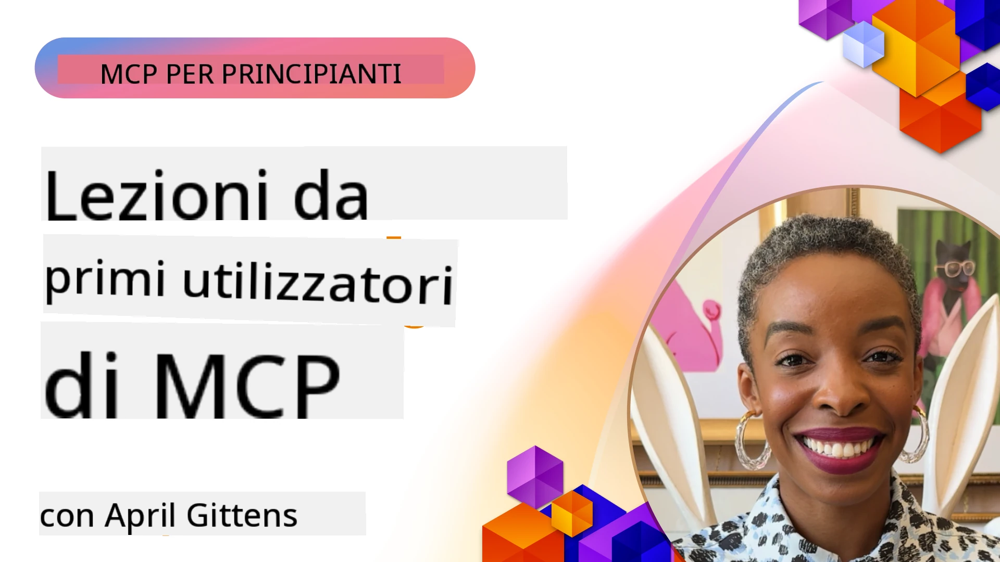

# 🌟 Lezioni dai Primi Utilizzatori

[](https://youtu.be/jds7dSmNptE)

_(Clicca sull'immagine sopra per vedere il video di questa lezione)_

## 🎯 Cosa Copre Questo Modulo

Questo modulo esplora come organizzazioni reali e sviluppatori stanno sfruttando il Model Context Protocol (MCP) per risolvere sfide concrete e guidare l'innovazione. Attraverso studi di caso dettagliati, progetti pratici ed esempi concreti, scoprirai come MCP permette un'integrazione sicura e scalabile dell'IA che collega modelli linguistici, strumenti e dati aziendali.

### 📚 Vedi MCP in Azione

Vuoi vedere questi principi applicati a strumenti pronti per la produzione? Dai un'occhiata ai nostri [**10 server Microsoft MCP che stanno trasformando la produttività degli sviluppatori**](microsoft-mcp-servers.md), che mostrano server MCP Microsoft reali che puoi usare oggi.

## Panoramica

Questa lezione esplora come i primi utilizzatori hanno sfruttato il Model Context Protocol (MCP) per risolvere sfide nel mondo reale e guidare l'innovazione in diversi settori. Attraverso studi di caso dettagliati e progetti pratici, vedrai come MCP consente un'integrazione AI standardizzata, sicura e scalabile—collegando grandi modelli linguistici, strumenti e dati aziendali in un framework unificato. Acquisirai esperienza pratica nella progettazione e costruzione di soluzioni basate su MCP, imparerai da modelli di implementazione consolidati e scoprirai le migliori pratiche per distribuire MCP in ambienti di produzione. La lezione mette anche in luce tendenze emergenti, direzioni future e risorse open-source per aiutarti a rimanere all'avanguardia nella tecnologia MCP e nel suo ecosistema in evoluzione.

## Obiettivi di Apprendimento

- Analizzare implementazioni MCP reali in diversi settori
- Progettare e costruire applicazioni complete basate su MCP
- Esplorare tendenze emergenti e direzioni future nella tecnologia MCP
- Applicare le migliori pratiche in scenari di sviluppo reali

## Implementazioni MCP nel Mondo Reale

### Studio di Caso 1: Automazione del Supporto Clienti Aziendale

Una multinazionale ha implementato una soluzione basata su MCP per standardizzare le interazioni AI nei loro sistemi di supporto clienti. Questo ha permesso loro di:

- Creare un'interfaccia unificata per più fornitori di LLM
- Mantenere una gestione coerente dei prompt tra i dipartimenti
- Implementare controlli robusti di sicurezza e conformità
- Passare facilmente tra diversi modelli AI in base a esigenze specifiche

**Implementazione Tecnica:**

```python
# Implementazione del server MCP Python per l'assistenza clienti
import logging
import asyncio
from modelcontextprotocol import create_server, ServerConfig
from modelcontextprotocol.server import MCPServer
from modelcontextprotocol.transports import create_http_transport
from modelcontextprotocol.resources import ResourceDefinition
from modelcontextprotocol.prompts import PromptDefinition
from modelcontextprotocol.tool import ToolDefinition

# Configura il logging
logging.basicConfig(level=logging.INFO)

async def main():
    # Crea la configurazione del server
    config = ServerConfig(
        name="Enterprise Customer Support Server",
        version="1.0.0",
        description="MCP server for handling customer support inquiries"
    )
    
    # Inizializza il server MCP
    server = create_server(config)
    
    # Registra le risorse della base di conoscenza
    server.resources.register(
        ResourceDefinition(
            name="customer_kb",
            description="Customer knowledge base documentation"
        ),
        lambda params: get_customer_documentation(params)
    )
    
    # Registra i modelli di prompt
    server.prompts.register(
        PromptDefinition(
            name="support_template",
            description="Templates for customer support responses"
        ),
        lambda params: get_support_templates(params)
    )
    
    # Registra gli strumenti di supporto
    server.tools.register(
        ToolDefinition(
            name="ticketing",
            description="Create and update support tickets"
        ),
        handle_ticketing_operations
    )
    
    # Avvia il server con trasporto HTTP
    transport = create_http_transport(port=8080)
    await server.run(transport)

if __name__ == "__main__":
    asyncio.run(main())
```

**Risultati:** Riduzione del 30% dei costi dei modelli, miglioramento del 45% nella coerenza delle risposte e aumento della conformità nelle operazioni globali.

### Studio di Caso 2: Assistente Diagnostico per la Sanità

Un fornitore sanitario ha sviluppato un'infrastruttura MCP per integrare più modelli AI medici specializzati garantendo la protezione dei dati sensibili dei pazienti:

- Commutazione senza soluzione di continuità tra modelli medici generalisti e specialistici
- Controlli rigorosi della privacy e tracciabilità degli audit
- Integrazione con i sistemi esistenti di Electronic Health Record (EHR)
- Ingegneria dei prompt coerente per la terminologia medica

**Implementazione Tecnica:**

```csharp
// C# MCP host application implementation in healthcare application
using Microsoft.Extensions.DependencyInjection;
using ModelContextProtocol.SDK.Client;
using ModelContextProtocol.SDK.Security;
using ModelContextProtocol.SDK.Resources;

public class DiagnosticAssistant
{
    private readonly MCPHostClient _mcpClient;
    private readonly PatientContext _patientContext;
    
    public DiagnosticAssistant(PatientContext patientContext)
    {
        _patientContext = patientContext;
        
        // Configure MCP client with healthcare-specific settings
        var clientOptions = new ClientOptions
        {
            Name = "Healthcare Diagnostic Assistant",
            Version = "1.0.0",
            Security = new SecurityOptions
            {
                Encryption = EncryptionLevel.Medical,
                AuditEnabled = true
            }
        };
        
        _mcpClient = new MCPHostClientBuilder()
            .WithOptions(clientOptions)
            .WithTransport(new HttpTransport("https://healthcare-mcp.example.org"))
            .WithAuthentication(new HIPAACompliantAuthProvider())
            .Build();
    }
    
    public async Task<DiagnosticSuggestion> GetDiagnosticAssistance(
        string symptoms, string patientHistory)
    {
        // Create request with appropriate resources and tool access
        var resourceRequest = new ResourceRequest
        {
            Name = "patient_records",
            Parameters = new Dictionary<string, object>
            {
                ["patientId"] = _patientContext.PatientId,
                ["requestingProvider"] = _patientContext.ProviderId
            }
        };
        
        // Request diagnostic assistance using appropriate prompt
        var response = await _mcpClient.SendPromptRequestAsync(
            promptName: "diagnostic_assistance",
            parameters: new Dictionary<string, object>
            {
                ["symptoms"] = symptoms,
                patientHistory = patientHistory,
                relevantGuidelines = _patientContext.GetRelevantGuidelines()
            });
            
        return DiagnosticSuggestion.FromMCPResponse(response);
    }
}
```

**Risultati:** Miglioramento nei suggerimenti diagnostici per i medici mantenendo la piena conformità HIPAA e significativa riduzione dei cambi di contesto tra sistemi.

### Studio di Caso 3: Analisi del Rischio per i Servizi Finanziari

Un istituto finanziario ha implementato MCP per standardizzare i processi di analisi del rischio tra diversi dipartimenti:

- Creato un'interfaccia unificata per modelli di rischio credito, rilevamento di frodi e rischio di investimento
- Implementati controlli rigorosi di accesso e versioning dei modelli
- Garantita auditabilità di tutte le raccomandazioni AI
- Mantenuto un formato dati coerente tra sistemi diversi

**Implementazione Tecnica:**

```java
// Server MCP Java per la valutazione del rischio finanziario
import org.mcp.server.*;
import org.mcp.security.*;

public class FinancialRiskMCPServer {
    public static void main(String[] args) {
        // Crea server MCP con funzionalità di conformità finanziaria
        MCPServer server = new MCPServerBuilder()
            .withModelProviders(
                new ModelProvider("risk-assessment-primary", new AzureOpenAIProvider()),
                new ModelProvider("risk-assessment-audit", new LocalLlamaProvider())
            )
            .withPromptTemplateDirectory("./compliance/templates")
            .withAccessControls(new SOCCompliantAccessControl())
            .withDataEncryption(EncryptionStandard.FINANCIAL_GRADE)
            .withVersionControl(true)
            .withAuditLogging(new DatabaseAuditLogger())
            .build();
            
        server.addRequestValidator(new FinancialDataValidator());
        server.addResponseFilter(new PII_RedactionFilter());
        
        server.start(9000);
        
        System.out.println("Financial Risk MCP Server running on port 9000");
    }
}
```

**Risultati:** Aumento della conformità normativa, cicli di distribuzione dei modelli il 40% più rapidi e migliorata coerenza nella valutazione del rischio tra i dipartimenti.

### Studio di Caso 4: Microsoft Playwright MCP Server per Automazione Browser

Microsoft ha sviluppato il [Playwright MCP server](https://github.com/microsoft/playwright-mcp) per abilitare un'automazione del browser sicura e standardizzata tramite Model Context Protocol. Questo server pronto per la produzione permette ad agenti AI e LLM di interagire con i browser web in modo controllato, tracciabile ed estensibile—abilitando casi d'uso come test web automatizzati, estrazione dati e flussi di lavoro end-to-end.

> **🎯 Strumento Pronto per la Produzione**
> 
> Questo studio di caso mostra un server MCP reale che puoi utilizzare oggi! Scopri di più su Playwright MCP Server e altri 9 server Microsoft MCP pronti per la produzione nella nostra [**Guida ai Server Microsoft MCP**](microsoft-mcp-servers.md#8--playwright-mcp-server).

**Caratteristiche chiave:**
- Espone capacità di automazione del browser (navigazione, compilazione form, cattura schermate, ecc.) come strumenti MCP
- Implementa rigorosi controlli di accesso e sandboxing per prevenire azioni non autorizzate
- Fornisce log di audit dettagliati per tutte le interazioni browser
- Supporta integrazione con Azure OpenAI e altri fornitori LLM per automazione agent-driven
- Alimenta l'agente di codifica di GitHub Copilot con capacità di navigazione web

**Implementazione Tecnica:**

```typescript
// TypeScript: Registrazione degli strumenti di automazione del browser Playwright in un server MCP
import { createServer, ToolDefinition } from 'modelcontextprotocol';
import { launch } from 'playwright';

const server = createServer({
  name: 'Playwright MCP Server',
  version: '1.0.0',
  description: 'MCP server for browser automation using Playwright'
});

// Registrare uno strumento per navigare a un URL e catturare uno screenshot
server.tools.register(
  new ToolDefinition({
    name: 'navigate_and_screenshot',
    description: 'Navigate to a URL and capture a screenshot',
    parameters: {
      url: { type: 'string', description: 'The URL to visit' }
    }
  }),
  async ({ url }) => {
    const browser = await launch();
    const page = await browser.newPage();
    await page.goto(url);
    const screenshot = await page.screenshot();
    await browser.close();
    return { screenshot };
  }
);

// Avvia il server MCP
server.listen(8080);
```

**Risultati:**

- Abilitata automazione di browser programmatica e sicura per agenti AI e LLM
- Ridotto lo sforzo di testing manuale e migliorata la copertura dei test per applicazioni web
- Fornito un framework riutilizzabile ed estensibile per integrazione di strumenti basati su browser in ambienti aziendali
- Alimenta le capacità di navigazione web di GitHub Copilot

**Riferimenti:**

- [Playwright MCP Server GitHub Repository](https://github.com/microsoft/playwright-mcp)
- [Microsoft AI and Automation Solutions](https://azure.microsoft.com/en-us/products/ai-services/)

### Studio di Caso 5: Azure MCP – Model Context Protocol per Uso Aziendale come Servizio

Azure MCP Server ([https://aka.ms/azmcp](https://aka.ms/azmcp)) è l'implementazione gestita da Microsoft, di livello enterprise, del Model Context Protocol, progettata per fornire capacità di server MCP scalabili, sicure e conformi come servizio cloud. Azure MCP consente alle organizzazioni di distribuire rapidamente, gestire e integrare server MCP con i servizi Azure AI, dati e sicurezza, riducendo il carico operativo e accelerando l'adozione dell'IA.

> **🎯 Strumento Pronto per la Produzione**
> 
> Questo è un server MCP reale che puoi usare oggi! Scopri di più sul Microsoft Foundry MCP Server nella nostra [**Guida ai Server Microsoft MCP**](microsoft-mcp-servers.md).


- Hosting server MCP completamente gestito con scaling, monitoraggio e sicurezza integrati
- Integrazione nativa con Azure OpenAI, Azure AI Search e altri servizi Azure
- Autenticazione e autorizzazione aziendale tramite Microsoft Entra ID
- Supporto per strumenti personalizzati, modelli di prompt e connettori di risorse
- Conformità ai requisiti di sicurezza e regolamentazione aziendali

**Implementazione Tecnica:**

```yaml
# Example: Azure MCP server deployment configuration (YAML)
apiVersion: mcp.microsoft.com/v1
kind: McpServer
metadata:
  name: enterprise-mcp-server
spec:
  modelProviders:
    - name: azure-openai
      type: AzureOpenAI
      endpoint: https://<your-openai-resource>.openai.azure.com/
      apiKeySecret: <your-azure-keyvault-secret>
  tools:
    - name: document_search
      type: AzureAISearch
      endpoint: https://<your-search-resource>.search.windows.net/
      apiKeySecret: <your-azure-keyvault-secret>
  authentication:
    type: EntraID
    tenantId: <your-tenant-id>
  monitoring:
    enabled: true
    logAnalyticsWorkspace: <your-log-analytics-id>
```

**Risultati:**  
- Ridotto il time-to-value per progetti AI aziendali fornendo una piattaforma server MCP pronta all’uso e conforme
- Semplificata l'integrazione di LLM, strumenti e fonti di dati aziendali
- Migliorata la sicurezza, osservabilità ed efficienza operativa per carichi MCP
- Migliorata la qualità del codice con le migliori pratiche Azure SDK e modelli di autenticazione attuali

**Riferimenti:**  
- [Documentazione Azure MCP](https://aka.ms/azmcp)
- [Azure MCP Server GitHub Repository](https://github.com/Azure/azure-mcp)
- [Servizi AI Azure](https://azure.microsoft.com/en-us/products/ai-services/)
- [Microsoft MCP Center](https://mcp.azure.com)

## Studio di Caso 6: NLWeb 
MCP (Model Context Protocol) è un protocollo emergente per chatbot e assistenti AI che interagiscono con strumenti. Ogni istanza NLWeb è anche un server MCP, che supporta un metodo core, ask, utilizzato per porre domande a un sito web in linguaggio naturale. La risposta ritornata sfrutta schema.org, un vocabolario ampiamente usato per descrivere dati web. In termini semplici, MCP è per NLWeb come Http è per HTML. NLWeb combina protocolli, formati Schema.org e codice di esempio per aiutare i siti a creare rapidamente questi endpoint, beneficiando sia gli umani tramite interfacce conversazionali che le macchine attraverso interazioni naturali agente-agente.

Ci sono due componenti distinti in NLWeb.
- Un protocollo, molto semplice all'inizio, per interfacciarsi con un sito in linguaggio naturale e un formato, che usa json e schema.org per la risposta ritornata. Vedi la documentazione sull'API REST per maggiori dettagli.
- Un'implementazione diretta di (1) che sfrutta markup esistente, per siti che possono essere astratti come liste di elementi (prodotti, ricette, attrazioni, recensioni, ecc.). Insieme a un set di widget interfaccia utente, i siti possono facilmente fornire interfacce conversazionali ai loro contenuti. Vedi la documentazione su Life of a chat query per maggiori dettagli su come funziona.
 
**Riferimenti:**  
- [Documentazione Azure MCP](https://aka.ms/azmcp)
- [NLWeb](https://github.com/microsoft/NlWeb)

### Studio di Caso 7: Microsoft Foundry MCP Server – Integrazione Agenti AI Aziendali

I server Microsoft Foundry MCP dimostrano come MCP può essere usato per orchestrare e gestire agenti AI e flussi di lavoro in ambienti aziendali. Integrando MCP con Microsoft Foundry, le organizzazioni possono standardizzare le interazioni degli agenti, sfruttare la gestione dei flussi di lavoro di Foundry e garantire distribuzioni sicure e scalabili.

> **🎯 Strumento Pronto per la Produzione**
> 
> Questo è un server MCP reale che puoi utilizzare oggi! Scopri di più sul Microsoft Foundry MCP Server nella nostra [**Guida ai Server Microsoft MCP**](microsoft-mcp-servers.md#9--microsoft-foundry-mcp-server).

**Caratteristiche chiave:**
- Accesso completo all'ecosistema AI di Azure, includendo cataloghi di modelli e gestione del deployment
- Indicizzazione della conoscenza con Azure AI Search per applicazioni RAG
- Strumenti di valutazione per performance dei modelli AI e assicurazione qualità
- Integrazione con Microsoft Foundry Catalog e Labs per modelli di ricerca all'avanguardia
- Capacità di gestione e valutazione degli agenti per scenari di produzione

**Risultati:**
- Prototipazione rapida e monitoraggio robusto dei flussi di lavoro degli agenti AI
- Integrazione senza soluzione di continuità con i servizi Azure AI per scenari avanzati
- Interfaccia unificata per costruire, distribuire e monitorare pipeline di agenti
- Migliorata sicurezza, conformità ed efficienza operativa per le aziende
- Adozione accelerata dell'AI mantenendo il controllo sui complessi processi agent-driven

**Riferimenti:**
- [Microsoft Foundry MCP Server GitHub Repository](https://github.com/azure-ai-foundry/mcp-foundry)
- [Integrazione degli Agenti Azure AI con MCP (Microsoft Foundry Blog)](https://devblogs.microsoft.com/foundry/integrating-azure-ai-agents-mcp/)

### Studio di Caso 8: Foundry MCP Playground – Sperimentazione e Prototipazione

Il Foundry MCP Playground offre un ambiente pronto all'uso per sperimentare con server MCP e integrazioni Microsoft Foundry. Gli sviluppatori possono rapidamente prototipare, testare e valutare modelli AI e flussi di lavoro degli agenti usando risorse dal Microsoft Foundry Catalog e Labs. Il playground semplifica la configurazione, fornisce progetti di esempio e supporta lo sviluppo collaborativo, rendendo facile esplorare best practice e nuovi scenari con un overhead minimo. È particolarmente utile per team che vogliono validare idee, condividere esperimenti e accelerare l'apprendimento senza infrastrutture complesse. Abbassando la barriera d'ingresso, il playground aiuta a favorire innovazione e contributi comunitari nell'ecosistema MCP e Microsoft Foundry.

**Riferimenti:**

- [Foundry MCP Playground GitHub Repository](https://github.com/azure-ai-foundry/foundry-mcp-playground)

### Studio di Caso 9: Microsoft Learn Docs MCP Server – Accesso alla Documentazione Potenziato da AI

Il Microsoft Learn Docs MCP Server è un servizio cloud-hosted che fornisce assistenti AI con accesso in tempo reale alla documentazione ufficiale Microsoft tramite Model Context Protocol. Questo server pronto per la produzione si connette all'ecosistema completo di Microsoft Learn e abilita una ricerca semantica su tutte le fonti ufficiali Microsoft.

> **🎯 Strumento Pronto per la Produzione**
> 
> Questo è un server MCP reale che puoi utilizzare oggi! Scopri di più sul Microsoft Learn Docs MCP Server nella nostra [**Guida ai Server Microsoft MCP**](microsoft-mcp-servers.md#1--microsoft-learn-docs-mcp-server).

**Caratteristiche chiave:**
- Accesso in tempo reale alla documentazione ufficiale Microsoft, documentazione Azure e Microsoft 365
- Funzionalità di ricerca semantica avanzata che comprendono contesto e intento
- Informazioni sempre aggiornate man mano che i contenuti Microsoft Learn vengono pubblicati
- Copertura completa di Microsoft Learn, documentazione Azure e fonti Microsoft 365
- Restituisce fino a 10 chunk di contenuto di alta qualità con titoli di articoli e URL

**Perché è Critico:**
- Risolve il problema della "conoscenza AI obsoleta" per le tecnologie Microsoft
- Garantisce che gli assistenti AI abbiano accesso alle funzionalità più recenti di .NET, C#, Azure e Microsoft 365
- Fornisce informazioni autorevoli di prima parte per una generazione di codice accurata
- Essenziale per sviluppatori che lavorano con tecnologie Microsoft in rapida evoluzione

**Risultati:**
- Precisione significativamente migliorata del codice generato da AI per tecnologie Microsoft
- Riduzione del tempo speso a cercare documentazione aggiornata e best practice
- Aumento della produttività degli sviluppatori con recupero documentazione contestuale
- Integrazione fluida con workflow di sviluppo senza lasciare l'IDE

**Riferimenti:**
- [Microsoft Learn Docs MCP Server GitHub Repository](https://github.com/MicrosoftDocs/mcp)
- [Documentazione Microsoft Learn](https://learn.microsoft.com/)

## Progetti Pratici

### Progetto 1: Costruire un Server MCP Multi-Provider

**Obiettivo:** Creare un server MCP che possa indirizzare le richieste a più fornitori di modelli AI basandosi su criteri specifici.

**Requisiti:**

- Supportare almeno tre diversi fornitori di modelli (ad es. OpenAI, Anthropic, modelli locali)
- Implementare un meccanismo di routing basato sui metadata della richiesta
- Creare un sistema di configurazione per gestire le credenziali dei fornitori
- Aggiungere caching per ottimizzare prestazioni e costi
- Costruire una dashboard semplice per monitorare l'uso

**Passaggi di Implementazione:**

1. Configurare l'infrastruttura base del server MCP
2. Implementare adattatori fornitori per ogni servizio modello AI
3. Creare la logica di routing basata su attributi della richiesta
4. Aggiungere meccanismi di caching per richieste frequenti
5. Sviluppare la dashboard di monitoraggio
6. Testare con vari pattern di richiesta

**Tecnologie:** Scegli tra Python (.NET/Java/Python in base alla tua preferenza), Redis per caching e un semplice framework web per la dashboard.

### Progetto 2: Sistema di Gestione dei Prompt Aziendale

**Obiettivo:** Sviluppare un sistema basato su MCP per gestire, versionare e distribuire modelli di prompt in tutta un'organizzazione.

**Requisiti:**


- Crea un archivio centralizzato per i template di prompt
- Implementa il versionamento e i workflow di approvazione
- Costruisci funzionalità di test per i template con input di esempio
- Sviluppa controlli di accesso basati sui ruoli
- Crea un'API per il recupero e il deployment dei template

**Passi di Implementazione:**

1. Progetta lo schema del database per l'archiviazione dei template
2. Crea l'API centrale per le operazioni CRUD sui template
3. Implementa il sistema di versionamento
4. Costruisci il workflow di approvazione
5. Sviluppa il framework di testing
6. Crea un'interfaccia web semplice per la gestione
7. Integra con un server MCP

**Tecnologie:** Il framework backend a tua scelta, database SQL o NoSQL e un framework frontend per l'interfaccia di gestione.

### Progetto 3: Piattaforma di Generazione Contenuti Basata su MCP

**Obiettivo:** Costruire una piattaforma di generazione contenuti che sfrutti MCP per fornire risultati coerenti su diversi tipi di contenuti.

**Requisiti:**

- Supportare più formati di contenuto (post su blog, social media, testi di marketing)
- Implementare generazione basata su template con opzioni di personalizzazione
- Creare un sistema di revisione e feedback dei contenuti
- Monitorare le metriche di performance dei contenuti
- Supportare versionamento e iterazione dei contenuti

**Passi di Implementazione:**

1. Imposta l'infrastruttura client MCP
2. Crea template per diversi tipi di contenuto
3. Costruisci la pipeline di generazione contenuti
4. Implementa il sistema di revisione
5. Sviluppa il sistema di tracciamento delle metriche
6. Crea un'interfaccia utente per la gestione dei template e la generazione dei contenuti

**Tecnologie:** Il tuo linguaggio di programmazione preferito, framework web e sistema di database.

## Direzioni Future per la Tecnologia MCP

### Tendenze Emergenti

1. **MCP Multi-Modale**
   - Espansione di MCP per standardizzare le interazioni con modelli di immagini, audio e video
   - Sviluppo di capacità di ragionamento cross-modale
   - Formati di prompt standardizzati per diverse modalità

2. **Infrastruttura Federata MCP**
   - Reti MCP distribuite che possono condividere risorse tra organizzazioni
   - Protocolli standardizzati per la condivisione sicura dei modelli
   - Tecniche di calcolo preservanti la privacy

3. **Marketplace MCP**
   - Ecosistemi per la condivisione e la monetizzazione di template e plugin MCP
   - Processi di assicurazione della qualità e certificazione
   - Integrazione con marketplace di modelli

4. **MCP per Edge Computing**
   - Adattamento degli standard MCP per dispositivi edge con risorse limitate
   - Protocolli ottimizzati per ambienti a bassa banda
   - Implementazioni MCP specializzate per ecosistemi IoT

5. **Quadri Regolatori**
   - Sviluppo di estensioni MCP per la conformità normativa
   - Tracce di audit standardizzate e interfacce di spiegabilità
   - Integrazione con i quadri emergenti di governance dell'IA

### Soluzioni MCP da Microsoft

Microsoft e Azure hanno sviluppato diversi repository open-source per aiutare gli sviluppatori a implementare MCP in vari scenari:

#### Organizzazione Microsoft

1. [playwright-mcp](https://github.com/microsoft/playwright-mcp) - Un server MCP Playwright per automazione e testing del browser
2. [files-mcp-server](https://github.com/microsoft/files-mcp-server) - Una implementazione server MCP OneDrive per test locale e contributo comunitario
3. [NLWeb](https://github.com/microsoft/NlWeb) - NLWeb è una raccolta di protocolli aperti e strumenti open source associati. Il suo focus principale è stabilire un livello fondamentale per il Web AI

#### Organizzazione Azure-Samples

1. [mcp](https://github.com/Azure-Samples/mcp) - Collegamenti a esempi, strumenti e risorse per costruire e integrare server MCP su Azure usando più linguaggi
2. [mcp-auth-servers](https://github.com/Azure-Samples/mcp-auth-servers) - Server MCP di riferimento che dimostrano l'autenticazione con la specifica corrente Model Context Protocol
3. [remote-mcp-functions](https://github.com/Azure-Samples/remote-mcp-functions) - Pagina di atterraggio per implementazioni Remote MCP Server in Azure Functions con link a repo specifici per linguaggio
4. [remote-mcp-functions-python](https://github.com/Azure-Samples/remote-mcp-functions-python) - Template di quickstart per costruire e distribuire server MCP remoti personalizzati usando Azure Functions con Python
5. [remote-mcp-functions-dotnet](https://github.com/Azure-Samples/remote-mcp-functions-dotnet) - Template di quickstart per costruire e distribuire server MCP remoti personalizzati usando Azure Functions con .NET/C#
6. [remote-mcp-functions-typescript](https://github.com/Azure-Samples/remote-mcp-functions-typescript) - Template di quickstart per costruire e distribuire server MCP remoti personalizzati usando Azure Functions con TypeScript
7. [remote-mcp-apim-functions-python](https://github.com/Azure-Samples/remote-mcp-apim-functions-python) - Azure API Management come gateway AI verso server MCP remoti usando Python
8. [AI-Gateway](https://github.com/Azure-Samples/AI-Gateway) - Esperimenti APIM ❤️ AI inclusi capacità MCP, integrazione con Azure OpenAI e AI Foundry

Questi repository offrono varie implementazioni, template e risorse per lavorare con il Model Context Protocol in diversi linguaggi di programmazione e servizi Azure. Coprono un ampio spettro di casi d'uso da implementazioni server base a autenticazione, distribuzione cloud e scenari di integrazione aziendale.

#### Directory delle Risorse MCP

La [directory Risorse MCP](https://github.com/microsoft/mcp/tree/main/Resources) nel repository ufficiale Microsoft MCP offre una raccolta curata di risorse di esempio, template di prompt e definizioni di strumenti da usare con i server Model Context Protocol. Questa directory è pensata per aiutare gli sviluppatori a iniziare rapidamente con MCP offrendo blocchi riutilizzabili e esempi di best practice per:

- **Template di prompt:** Template di prompt pronti all'uso per compiti e scenari comuni di AI, adattabili per le tue implementazioni server MCP.
- **Definizioni di strumenti:** Schemi di esempio e metadati per standardizzare l'integrazione e l'invocazione di strumenti attraverso diversi server MCP.
- **Esempi di risorse:** Definizioni di risorse di esempio per connettersi a fonti dati, API e servizi esterni nel framework MCP.
- **Implementazioni di riferimento:** Esempi pratici che mostrano come strutturare e organizzare risorse, prompt e strumenti in progetti MCP reali.

Queste risorse accelerano lo sviluppo, promuovono la standardizzazione e aiutano a garantire le best practice nella costruzione e distribuzione di soluzioni basate su MCP.

#### Directory delle Risorse MCP

- [Risorse MCP (Prompt di esempio, Strumenti e Definizioni di Risorse)](https://github.com/microsoft/mcp/tree/main/Resources)

### Opportunità di Ricerca

- Tecniche efficienti di ottimizzazione del prompt all'interno di framework MCP
- Modelli di sicurezza per distribuzioni MCP multi-tenant
- Benchmark di performance tra diverse implementazioni MCP
- Metodi di verifica formale per server MCP

## Conclusione

Il Model Context Protocol (MCP) sta rapidamente plasmando il futuro di un’integrazione AI standardizzata, sicura e interoperabile attraverso le industrie. Attraverso gli studi di caso e i progetti pratici di questa lezione, hai visto come i primi adottanti — inclusi Microsoft e Azure — sfruttano MCP per risolvere sfide reali, accelerare l’adozione dell’AI e garantire conformità, sicurezza e scalabilità. L’approccio modulare di MCP consente alle organizzazioni di collegare grandi modelli di linguaggio, strumenti e dati aziendali in un quadro unificato e verificabile. Mano a mano che MCP evolve, rimanere coinvolti nella community, esplorare risorse open-source e applicare le best practice sarà fondamentale per costruire soluzioni AI robuste e pronte per il futuro.

## Risorse Aggiuntive

- [Repository GitHub MCP Foundry](https://github.com/azure-ai-foundry/mcp-foundry)
- [Foundry MCP Playground](https://github.com/azure-ai-foundry/foundry-mcp-playground)
- [Integrazione Azure AI Agents con MCP (Blog Microsoft Foundry)](https://devblogs.microsoft.com/foundry/integrating-azure-ai-agents-mcp/)
- [Repository GitHub MCP (Microsoft)](https://github.com/microsoft/mcp)
- [Directory Risorse MCP (Prompt di esempio, Strumenti e Definizioni di Risorse)](https://github.com/microsoft/mcp/tree/main/Resources)
- [Comunità e Documentazione MCP](https://modelcontextprotocol.io/introduction)
- [Specifiche MCP (2026-07-28)](https://modelcontextprotocol.io/specification/2026-07-28/)
- [Documentazione Azure MCP](https://aka.ms/azmcp)
- [OWASP MCP Top 10](https://microsoft.github.io/mcp-azure-security-guide/mcp/) - Best practice di sicurezza
- [Repository GitHub Playwright MCP Server](https://github.com/microsoft/playwright-mcp)
- [Files MCP Server (OneDrive)](https://github.com/microsoft/files-mcp-server)
- [Azure-Samples MCP](https://github.com/Azure-Samples/mcp)
- [MCP Auth Servers (Azure-Samples)](https://github.com/Azure-Samples/mcp-auth-servers)
- [Remote MCP Functions (Azure-Samples)](https://github.com/Azure-Samples/remote-mcp-functions)
- [Remote MCP Functions Python (Azure-Samples)](https://github.com/Azure-Samples/remote-mcp-functions-python)
- [Remote MCP Functions .NET (Azure-Samples)](https://github.com/Azure-Samples/remote-mcp-functions-dotnet)
- [Remote MCP Functions TypeScript (Azure-Samples)](https://github.com/Azure-Samples/remote-mcp-functions-typescript)
- [Remote MCP APIM Functions Python (Azure-Samples)](https://github.com/Azure-Samples/remote-mcp-apim-functions-python)
- [AI-Gateway (Azure-Samples)](https://github.com/Azure-Samples/AI-Gateway)
- [Soluzioni AI e Automazione Microsoft](https://azure.microsoft.com/en-us/products/ai-services/)

## Esercizi

1. Analizza uno degli studi di caso e proponi un approccio di implementazione alternativo.
2. Scegli una delle idee di progetto e crea una specifica tecnica dettagliata.
3. Ricerca un settore non trattato negli studi di caso e delinea come MCP potrebbe affrontare le sue sfide specifiche.
4. Esplora una delle direzioni future e crea un concetto per una nuova estensione MCP a supporto.

## Cosa Aspettarsi

Esplora di più: [Microsoft MCP Servers](./microsoft-mcp-servers.md)

Continua con: [Modulo 8: Best Practices](../08-BestPractices/README.md)

---

<!-- CO-OP TRANSLATOR DISCLAIMER START -->
**Disclaimer**:
Questo documento è stato tradotto utilizzando il servizio di traduzione AI [Co-op Translator](https://github.com/Azure/co-op-translator). Sebbene ci impegniamo per garantire la precisione, si prega di notare che le traduzioni automatizzate possono contenere errori o imprecisioni. Il documento originale nella sua lingua nativa deve essere considerato la fonte autorevole. Per informazioni critiche, si raccomanda una traduzione professionale effettuata da un essere umano. Non siamo responsabili per eventuali malintesi o interpretazioni errate derivanti dall’uso di questa traduzione.
<!-- CO-OP TRANSLATOR DISCLAIMER END -->