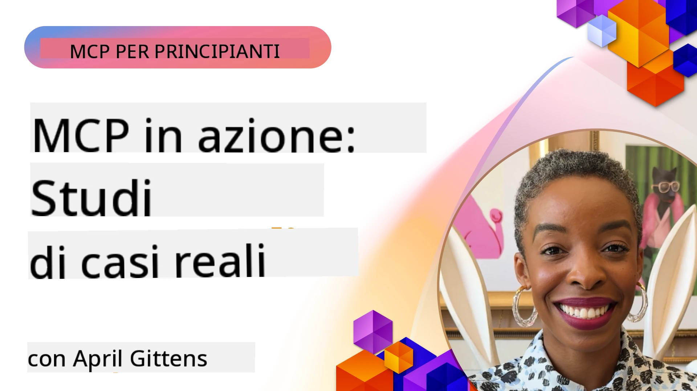

# MCP in Azione: Studi di Caso nel Mondo Reale

_(Clicca sull'immagine sopra per guardare il video di questa lezione)_

Il Model Context Protocol (MCP) sta trasformando il modo in cui le applicazioni AI interagiscono con dati, strumenti e servizi. Questa sezione presenta studi di caso reali che dimostrano applicazioni pratiche di MCP in vari scenari aziendali.

## Panoramica

Questa sezione mostra esempi concreti di implementazioni MCP, evidenziando come le organizzazioni stanno sfruttando questo protocollo per risolvere sfide aziendali complesse. Esaminando questi studi di caso, otterrai approfondimenti sulla versatilità, scalabilità e benefici pratici di MCP in scenari reali.

## Obiettivi Chiave di Apprendimento

Esplorando questi studi di caso, potrai:

- Comprendere come MCP può essere applicato per risolvere problemi aziendali specifici
- Conoscere diversi modelli di integrazione e approcci architetturali
- Riconoscere le best practice per l'implementazione di MCP in ambienti enterprise
- Ottenere insight sulle sfide e soluzioni incontrate nelle implementazioni reali
- Identificare opportunità per applicare modelli simili nei propri progetti

## Studi di Caso Principali

### 1. [Agenti di Viaggio AI su Azure – Implementazione di Riferimento](./travelagentsample.md)

Questo studio di caso esamina la soluzione di riferimento di Microsoft che dimostra come costruire un'applicazione di pianificazione di viaggi multi-agente, alimentata da AI, usando MCP, Azure OpenAI e Azure AI Search. Il progetto mostra:

- Orchestrazione multi-agente tramite MCP
- Integrazione dati aziendali con Azure AI Search
- Architettura sicura e scalabile usando i servizi Azure
- Strumenti estensibili con componenti MCP riutilizzabili
- Esperienza utente conversazionale supportata da Azure OpenAI

L'architettura e i dettagli di implementazione offrono preziosi insight per costruire sistemi multi-agente complessi con MCP come livello di coordinamento.

### 2. [Aggiornamento degli Elementi Azure DevOps dai Dati di YouTube](./UpdateADOItemsFromYT.md)

Questo studio di caso dimostra un'applicazione pratica di MCP per automatizzare processi di workflow. Mostra come gli strumenti MCP possono essere utilizzati per:

- Estrarre dati da piattaforme online (YouTube)
- Aggiornare gli elementi di lavoro nei sistemi Azure DevOps
- Creare workflow di automazione ripetibili
- Integrare dati tra sistemi disparati

Questo esempio illustra come anche implementazioni MCP relativamente semplici possano offrire significativi guadagni di efficienza automatizzando compiti di routine e migliorando la coerenza dei dati tra sistemi.

### 3. [Recupero Documentazione in Tempo Reale con MCP](./docs-mcp/README.md)

Questo studio di caso ti guida nel collegare un client console Python a un server Model Context Protocol (MCP) per recuperare e registrare in tempo reale documentazione Microsoft contestuale e aggiornata. Imparerai come:

- Connettersi a un server MCP usando un client Python e l'SDK ufficiale MCP
- Usare client HTTP in streaming per un recupero dati efficiente e in tempo reale
- Chiamare strumenti di documentazione sul server e registrare risposte direttamente sulla console
- Integrare nella tua attività la documentazione Microsoft aggiornata senza uscire dal terminale

Il capitolo include un esercizio pratico, un campione di codice funzionante minimo e link a risorse aggiuntive per un apprendimento più approfondito. Consulta la guida completa e il codice nel capitolo linkato per capire come MCP può trasformare l'accesso alla documentazione e la produttività degli sviluppatori in ambienti console.

### 4. [Generatore Interattivo di Piani di Studio Web con MCP](./docs-mcp/README.md)

Questo studio di caso dimostra come costruire un'applicazione web interattiva usando Chainlit e il Model Context Protocol (MCP) per generare piani di studio personalizzati su qualunque argomento. Gli utenti possono specificare un soggetto (come “certificazione AI-900”) e una durata di studio (es. 8 settimane), e l’app fornirà una ripartizione settimana per settimana dei contenuti consigliati. Chainlit abilita un'interfaccia chat conversazionale, rendendo l’esperienza coinvolgente e adattativa.

- Applicazione web conversazionale alimentata da Chainlit
- Prompt guidati dall’utente per argomento e durata
- Raccomandazioni di contenuti settimana per settimana usando MCP
- Risposte adattative in tempo reale in un'interfaccia chat

Il progetto illustra come l'AI conversazionale e MCP possano essere combinati per creare strumenti educativi dinamici e guidati dall'utente in un ambiente web moderno.

### 5. [Documentazione in-Editor con Server MCP in VS Code](./docs-mcp/README.md)

Questo studio di caso dimostra come portare la documentazione Microsoft Learn direttamente nel tuo ambiente VS Code usando il server MCP—niente più cambio schede del browser! Vedrai come:

- Cercare e leggere documenti istantaneamente all'interno di VS Code usando il pannello MCP o la palette comandi
- Fare riferimento alla documentazione e inserire link direttamente nei tuoi file README o markdown del corso
- Usare GitHub Copilot e MCP insieme per flussi di lavoro di documentazione e codice senza soluzione di continuità, potenziati da AI
- Validare e migliorare la documentazione con feedback in tempo reale e accuratezza fornita da Microsoft
- Integrare MCP con i workflow GitHub per la validazione continua della documentazione

L’implementazione include:

- Configurazione di esempio `.vscode/mcp.json` per un setup semplice
- Guide passo-passo basate su screenshot dell’esperienza in editor
- Consigli per combinare Copilot e MCP per la massima produttività

Questo scenario è ideale per autori di corsi, redattori di documentazione e sviluppatori che vogliono rimanere concentrati nel loro editor mentre lavorano con documenti, Copilot e strumenti di validazione—tutto alimentato da MCP.

### 6. [Creazione Server MCP con APIM](./apimsample.md)

Questo studio di caso fornisce una guida passo-passo su come creare un server MCP usando Azure API Management (APIM). Copre:

- Configurazione di un server MCP in Azure API Management
- Esposizione delle operazioni API come strumenti MCP
- Configurazione di politiche per limitazione di velocità e sicurezza
- Test del server MCP usando Visual Studio Code e GitHub Copilot

Questo esempio illustra come sfruttare le capacità di Azure per creare un server MCP robusto utilizzabile in svariate applicazioni, migliorando l’integrazione dei sistemi AI con le API enterprise.

### 7. [GitHub MCP Registry — Accelerare l’Integrazione Agentica](https://github.com/mcp)

Questo studio di caso esamina come il GitHub MCP Registry, lanciato a settembre 2025, affronta una sfida critica nell’ecosistema AI: la scoperta e il deployment frammentati dei server Model Context Protocol (MCP).

#### Panoramica
Il **MCP Registry** risolve il problema della dispersione crescente dei server MCP tra repository e registri, che prima rallentava e complicava le integrazioni. Questi server permettono agli agenti AI di interagire con sistemi esterni come API, database e fonti di documentazione.

#### Problema
Gli sviluppatori che costruiscono workflow agentici affrontavano diverse sfide:
- **Scarsa reperibilità** dei server MCP su diverse piattaforme
- **Domande di configurazione ridondanti** sparse tra forum e documentazione
- **Rischi di sicurezza** da fonti non verificate e non affidabili
- **Mancanza di standardizzazione** nella qualità e compatibilità dei server

#### Architettura della Soluzione
Il GitHub MCP Registry centralizza server MCP affidabili con funzionalità chiave:
- **Installazione con un click** tramite VS Code per un setup semplificato
- **Ordinamento segnale-su-rumore** basato su stelle, attività e validazione della community
- **Integrazione diretta** con GitHub Copilot e altri strumenti compatibili MCP
- **Modello di contribuzione aperto** che permette a community e partner enterprise di contribuire

#### Impatto Aziendale
Il registro ha prodotto miglioramenti misurabili:
- **Onboarding più rapido** per sviluppatori usando strumenti come Microsoft Learn MCP Server, che trasmette documentazione ufficiale direttamente agli agenti
- **Produttività migliorata** tramite server specializzati come `github-mcp-server`, abilitando automazioni GitHub in linguaggio naturale (creazione PR, ri-esecuzioni CI, scansione codice)
- **Fiducia più solida nell’ecosistema** attraverso elenchi curati e standard di configurazione trasparenti

#### Valore Strategico
Per i professionisti specializzati nella gestione del ciclo di vita degli agenti e nei workflow riproducibili, l’MCP Registry offre:
- **Capacità modulari di deployment agentico** con componenti standardizzati
- **Pipeline di valutazione supportate dal registro** per test e validazioni consistenti
- **Interoperabilità cross-strumento** per una integrazione fluida tra diverse piattaforme AI

Questo studio di caso dimostra che l’MCP Registry è più di un semplice elenco—è una piattaforma fondamentale per integrazioni modello scalabili e deployment di sistemi agentici nel mondo reale.

### 8. [Pubblicazione su Social Network da un Agente](./publora-social-publishing.md)

Questo studio di caso descrive un **server remoto MCP con capacità di scrittura** — i cui strumenti eseguono azioni irreversibili per conto dell’utente — usando la pubblicazione social come esempio pratico. Un agente redige un post, un umano lo approva, e il server lo programma su più reti.

La parte interessante sono i vincoli di progettazione imposti dalla pubblicazione, validi per qualsiasi server che scrive invece di leggere:

- **Scoperta aperta, esecuzione autenticata** — `tools/list` risposto senza credenziali così registri e client possono ispezionare, mentre ogni `tools/call` richiede un token e altrimenti restituisce `401` con header `WWW-Authenticate`
- **Registrazione OAuth senza passo out-of-band** — registrazione dinamica client oggi, con Client ID Metadata Documents come direzione indicata dalla specifica `2026-07-28`
- **Annotazioni degli strumenti** (`readOnlyHint`, `destructiveHint`, `idempotentHint`) che i client usano per decidere cosa confermare — suggerimenti piuttosto che imposizioni, e qualcosa che ora i registri di connettori si aspettano durante la review
- **Identificatori non inventabili**, così un valore allucinato fallisce rumorosamente invece di agire su uno plausibile
- **Chiavi di idempotenza sugli strumenti di creazione post**, affinché un retry del runtime agente non generi pubblicazioni duplicate
- **Un target no-op descritto nello schema dello strumento** che esercita l’intero percorso di scrittura senza pubblicare nulla, per revisori e CI

Il capitolo si chiude con una breve checklist da applicare a un server che stai costruendo.

## Conclusione

Questi otto studi di caso completi dimostrano l’eccezionale versatilità e le applicazioni pratiche del Model Context Protocol in diversi scenari reali. Dai complessi sistemi multi-agente di pianificazione viaggi e la gestione API enterprise ai workflow di documentazione ottimizzati fino al rivoluzionario GitHub MCP Registry, questi esempi mostrano come MCP offra un modo standardizzato e scalabile per collegare i sistemi AI con gli strumenti, i dati e i servizi necessari a fornire un valore eccezionale.

Gli studi di caso coprono molteplici dimensioni di implementazione MCP:
- **Integrazione Enterprise**: Azure API Management e automazione Azure DevOps
- **Orchestrazione Multi-Agente**: Pianificazione viaggi con agenti AI coordinati
- **Produttività dello Sviluppatore**: Integrazione VS Code e accesso documentazione in tempo reale
- **Sviluppo Ecosistema**: GitHub MCP Registry come piattaforma fondamentale
- **Applicazioni Educative**: Generator di piani di studio interattivi e interfacce conversazionali

Studiando queste implementazioni si ottengono approfondimenti cruciali su:
- **Modelli architetturali** per varie scale e casi d’uso
- **Strategie di implementazione** che bilanciano funzionalità e manutenibilità
- **Considerazioni su sicurezza e scalabilità** per deployment in produzione
- **Best practice** per lo sviluppo di server MCP e integrazione client
- **Pensiero ecosistemico** per costruire soluzioni AI interconnesse

Questi esempi dimostrano collettivamente che MCP non è solo un framework teorico ma un protocollo maturo, pronto per la produzione, che abilita soluzioni pratiche a sfide aziendali complesse. Che tu stia costruendo semplici strumenti di automazione o sofisticati sistemi multi-agente, i modelli e approcci illustrati qui forniscono una solida base per i tuoi progetti MCP.

## Risorse Aggiuntive

- [Repository GitHub Azure AI Travel Agents](https://github.com/Azure-Samples/azure-ai-travel-agents)
- [Strumento MCP Azure DevOps](https://github.com/microsoft/azure-devops-mcp)
- [Strumento MCP Playwright](https://github.com/microsoft/playwright-mcp)
- [Server MCP Microsoft Docs](https://github.com/MicrosoftDocs/mcp)
- [GitHub MCP Registry — Accelerare l’Integrazione Agentica](https://github.com/mcp)
- [Esempi Comunitari MCP](https://github.com/microsoft/mcp)

## Cosa Seguira

- Precedente: [Modulo 8: Best Practices](../08-BestPractices/README.md)
- Successivo: [Modulo 10: Snellire i Workflow AI: Costruire un Server MCP con AI Toolkit](../10-StreamliningAIWorkflowsBuildingAnMCPServerWithAIToolkit/README.md)

---

<!-- CO-OP TRANSLATOR DISCLAIMER START -->
**Disclaimer**:
Questo documento è stato tradotto utilizzando il servizio di traduzione AI [Co-op Translator](https://github.com/Azure/co-op-translator). Sebbene ci impegniamo per garantire la precisione, si prega di notare che le traduzioni automatizzate possono contenere errori o imprecisioni. Il documento originale nella sua lingua nativa deve essere considerato la fonte autorevole. Per informazioni critiche, si raccomanda una traduzione professionale effettuata da un essere umano. Non siamo responsabili per eventuali malintesi o interpretazioni errate derivanti dall’uso di questa traduzione.
<!-- CO-OP TRANSLATOR DISCLAIMER END -->