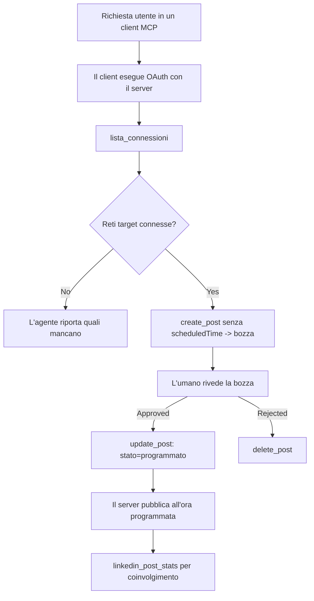

# Caso di studio: Pubblicare sui social network da un agente con un server MCP remoto

> **Avvertenza:** Diversi servizi e progetti open source possono pubblicare sui social network, e un team potrebbe anche integrare direttamente l'API di ogni rete. Lo scenario sottostante è fornito come un esempio pratico di come un **server MCP remoto con capacità di scrittura** possa essere progettato e utilizzato. Publora è un servizio commerciale con un piano gratuito; i modelli descritti qui si applicano a qualsiasi server MCP che esegue azioni irreversibili per conto di un utente.

## Panoramica

Gli agenti sono bravi a redigere contenuti e scarsi a pubblicarli. Un modello può scrivere un annuncio di rilascio in pochi secondi, e poi il lavoro si ferma: pubblicarlo significa un'API per ogni rete, un'app OAuth per ogni rete, e un diverso insieme di regole sui media per ciascuna. La maggior parte dei team risolve questo copiando il testo manualmente in un browser.

Questo caso di studio esamina come questo ultimo passo possa essere chiuso con un singolo server MCP remoto e — più utilmente per chi costruisce uno — le decisioni progettuali che un server **con capacità di scrittura** deve fare bene. Leggere dati è indulgente. Pubblicare no: una chiamata sbagliata allo strumento è visibile a un pubblico e non può essere annullata.

## Scenario

Un piccolo team di relazioni con sviluppatori redige post all'interno di un agente (Claude, VS Code, Cursor — il client non importa). Vogliono che l'agente:

- veda quali account social il team ha collegato,
- rediga un post e lo mantenga come bozza per l'approvazione umana,
- alleghi un'immagine,
- lo programmi su diverse reti a un orario scelto,
- e in seguito riferisca su come è andato.

Fondamentalmente, vogliono che l'agente *non possa* pubblicare accidentalmente mentre stanno ancora sperimentando.

## Strumenti Utilizzati

- [Publora MCP Server](https://github.com/publora/mcp-server) — un server MCP remoto (`streamable-http`) che espone strumenti di pubblicazione, programmazione, media e analisi LinkedIn. Registrato nel registro MCP ufficiale come `com.publora/mcp-server`.

## Flusso di lavoro passo passo

1. **Connettere il server.** I client che usano OAuth completano il flusso di autorizzazione con codice e PKCE contro la propria schermata di consenso del server; i client che non lo fanno, come CLI in modalità headless, usano una chiave API Publora in un'intestazione. Entrambi i percorsi sono supportati, e quale si ottiene dipende dal client, non dal server.
2. **Elencare le connessioni.** L'agente chiama `list_connections` e riceve gli account connessi con i loro identificatori.
3. **Redigere.** L'agente chiama `create_post` *senza* un orario programmato. Il post è conservato come bozza — nulla viene pubblicato.
4. **Allegare media.** Gli URL pubblici delle immagini sono passati nella stessa chiamata; il server li scarica e li convalida.
5. **Programmare.** Dopo l'approvazione umana, `update_post` imposta lo stato su programmato con un orario ISO 8601.
6. **Misurare.** Per LinkedIn, `linkedin_post_stats` restituisce l'engagement una volta che il post è live.

## Esempio di prompt

```text
Which social accounts do I have connected?
Draft a post announcing our new changelog page, attach the screenshot at
https://example.com/changelog.png, and keep it as a draft — do not publish it.
Once I approve, schedule it to LinkedIn and Bluesky for tomorrow at 09:00 UTC.
```

## Diagramma Mermaid



## Implementazione tecnica

Le lezioni sottostanti sono la parte trasferibile di questo caso di studio.

### Scoperta aperta, esecuzione autenticata

`tools/list` è servito senza credenziali; ogni `tools/call` richiede un token
e altrimenti restituisce `401` con un'intestazione `WWW-Authenticate` che punta ai
metadati della risorsa protetta. L'endpoint legacy del server risponde anche a un
`initialize` non autenticato per i client su versioni di protocollo precedenti a
`2026-07-28`; i client attuali non usano questo handshake.

Questa divisione specifica per server permette a registri, cataloghi e client di ispezionare nomi,
schemi e annotazioni degli strumenti senza un segreto, pur impedendo l'esecuzione anonima.
La scoperta aperta è una scelta di deployment, non un requisito MCP; un
deployment protetto può anche richiedere autorizzazione per `tools/list`.

### Registrazione: registrazione client dinamica e cosa la sostituisce

Il server pubblicizza `/.well-known/oauth-protected-resource` e `/.well-known/oauth-authorization-server`, e supporta il flusso di autorizzazione con codice PKCE (`S256`), refresh token, e **registrazione client dinamica**.

La registrazione dinamica ha eliminato il passaggio manuale per i client legacy: senza di essa,
ogni client necessitava di un `client_id` pre-assegnato dal fornitore.

Trattatela come un comportamento di compatibilità piuttosto che come un modello da copiare. La revisione della specifica del `2026-07-28` depreca la registrazione client dinamica in favore dei Documenti Metadata Client ID, dove il client ospita un documento di metadata a un URL HTTPS stabile e quell'URL *è* il `client_id`. DCR funziona ancora per ora, ma un server costruito oggi dovrebbe pianificare per CIMD e mantenere DCR solo per client più vecchi.

### Le annotazioni degli strumenti non sono decorazioni

Ogni strumento porta un `title` e gli indizi applicabili: `readOnlyHint`, `destructiveHint`, `idempotentHint`, `openWorldHint`.

Due ragioni per investirvi. Primo, i client usano gli indizi per decidere cosa confermare con l'utente — un client può eseguire automaticamente una ricerca in sola lettura e fermarsi per l'approvazione prima di un'eliminazione. La specifica è esplicita nel dire che le annotazioni sono indizi non affidabili, non un meccanismo di autorizzazione: modellano ciò che un client offre di fare, non bloccano nulla sul server, e un server deve comunque applicare le proprie regole. Secondo, le principali directory di connettori ora *le richiedono* per la revisione; un server i cui strumenti mancano di titoli e indizi verrà comunque respinto indipendentemente da quanto funzioni bene.

### Rendere gli identificatori non inventabili

Gli identificatori di piattaforma sono stringhe opache restituite da `list_connections`, e la descrizione dello schema dice esplicitamente che devono essere copiati parola per parola e mai indovinati. Il server rifiuta qualsiasi altro.

I modelli sono abili indovinatori. Qualsiasi server con capacità di scrittura dovrebbe assumere che un identificatore sarà alla fine allucinato e far fallire quel percorso in modo annunciato e precoce, piuttosto che agire su un valore apparentemente plausibile.

### Fallire prima di pubblicare, con un messaggio azionabile

Alcune reti rifiutano post solo testuali e richiedono un'immagine o video. Questo è convalidato quando il post viene programmato, e l'errore nomina la piattaforma e il requisito mancante.

Un agente può recuperare da "Instagram richiede media — allega un'immagine o un video" senza un altro viaggio di andata e ritorno. Non può recuperare da un generico `400`.

### Rendere i tentativi di ripetizione sicuri

I due strumenti che creano contenuti, `create_post` e `update_post`, accettano una chiave di idempotenza: riutilizzandola con una richiesta identica riproduce la risposta originale invece di creare un secondo post. I runtime degli agenti ritentano sui timeout; senza idempotenza, una risposta lenta diventa una pubblicazione duplicata. Gli altri strumenti di scrittura — cancellazioni, passaggi media, reazioni e commenti LinkedIn — non la richiedono, quindi un ritentativo non è automaticamente sicuro. Vale la pena sapere quali delle vostre mutazioni sono protette e quali no.

### Fornire un modo per testare senza pubblicare nulla

Il server accetta un target riservato, `publora-playground`, che è convalidato e riconosciuto come una destinazione reale e quindi scartato — nulla raggiunge un account attivo. È descritto nello schema dello strumento stesso, che ogni client può leggere senza credenziali: il campo `platforms` di `create_post` lo documenta come "un target di test di connessione che non richiede connessione reale — il post è riconosciuto e scartato, nulla è pubblicato". Invocalo passando come unica voce: `platforms: ["publora-playground"]`.

Questo si è rivelato uno dei dettagli più utili di tutta l'interfaccia. I revisori delle directory dei connettori, i contributori e CI possono esercitare l'intero percorso di scrittura da un capo all'altro senza rischi per un pubblico reale. Qualsiasi server MCP con azioni irreversibili beneficia di un target no-op documentato.

## Risultati e impatto

- Il passaggio di pubblicazione si è spostato da un browser alla stessa conversazione dove il contenuto viene scritto, e l'abitudine draft-first mantiene un umano nel ciclo. Essere precisi su cosa sia: una bozza è una convenzione, non un confine. La stessa credenziale può programmare o pubblicare, quindi chi necessita di un vero gate di approvazione deve farlo rispettare fuori dalla superficie dello strumento — credenziali separate o uno strato di policy davanti al server.
- Le differenze per rete — requisiti media, threading, controlli delle risposte — sono gestite una volta sola nel server invece che in ogni agente che parla con esso.
- Lo stesso server supporta diversi client MCP senza credenziali pre-assegnate.
    I client attuali possono usare Documenti Metadata Client ID; DCR rimane un fallback
    per client più vecchi.
- I vincoli di design sopra sono stati modellati tanto dalle revisioni delle directory dei connettori quanto dagli utenti: annotazioni, OAuth e un target di test sicuro sono stati richiesti da almeno uno di essi.

## Riferimenti

- [Publora MCP Server (sorgente)](https://github.com/publora/mcp-server)
- [Documentazione API e MCP di Publora](https://docs.publora.com)
- [Voce nel registro MCP: `com.publora/mcp-server`](https://registry.modelcontextprotocol.io/v0/servers?search=com.publora/mcp-server)
- [Specifiche MCP — Autorizzazione](https://modelcontextprotocol.io/specification/2026-07-28/basic/authorization)
- [Specifiche MCP — Annotazioni degli strumenti](https://modelcontextprotocol.io/docs/concepts/tools)

## Prossimi Passi

- Prendi un server MCP che stai costruendo e controlla le tre vittorie più economiche qui: annotazioni su ogni strumento, una chiave di idempotenza su ogni scrittura e un target no-op documentato.
- Prova la divisione open-discovery: chiama `tools/list` contro un server pubblico remoto senza credenziali, poi chiama uno strumento e ispeziona la sfida `401`.
- Considera cosa significa "annulla" per il tuo dominio. La pubblicazione ha bozze e cancellazioni; se le tue azioni non hanno equivalenti, la conferma appartiene al design dello strumento, non al prompt.

---

<!-- CO-OP TRANSLATOR DISCLAIMER START -->
**Disclaimer**:
Questo documento è stato tradotto utilizzando il servizio di traduzione AI [Co-op Translator](https://github.com/Azure/co-op-translator). Sebbene ci impegniamo per garantire la precisione, si prega di notare che le traduzioni automatizzate possono contenere errori o imprecisioni. Il documento originale nella sua lingua nativa deve essere considerato la fonte autorevole. Per informazioni critiche, si raccomanda una traduzione professionale effettuata da un essere umano. Non siamo responsabili per eventuali malintesi o interpretazioni errate derivanti dall’uso di questa traduzione.
<!-- CO-OP TRANSLATOR DISCLAIMER END -->