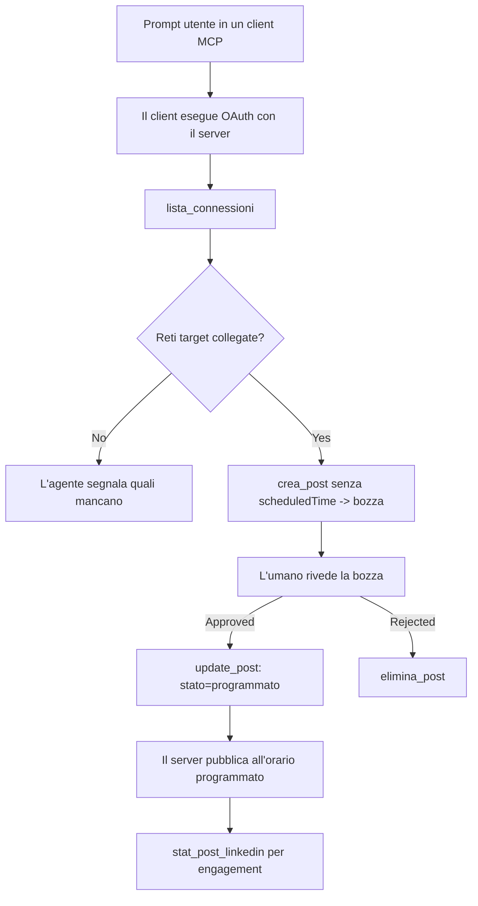

# Studio di caso: Pubblicare sui social network da un agente con un server MCP remoto

> **Avvertenza:** Diversi servizi e progetti open source possono pubblicare sui social network, e un team potrebbe anche integrare direttamente l'API di ciascuna rete. Lo scenario qui sotto è fornito come esempio pratico di come un **server MCP remoto con capacità di scrittura** possa essere progettato e utilizzato. Publora è un servizio commerciale con un piano gratuito; i modelli descritti qui si applicano a qualsiasi server MCP che esegue azioni irreversibili per conto di un utente.

## Panoramica

Gli agenti sono bravi a redigere contenuti e meno a pubblicarli. Un modello può scrivere un annuncio di rilascio in pochi secondi, e poi il lavoro si ferma: pubblicarlo significa usare un'API per ogni rete, un'app OAuth per ogni rete e un diverso set di regole multimediali per ognuna. La maggior parte dei team risolve questo copiando manualmente il testo in un browser.

Questo studio di caso esamina come quest'ultimo passo venga completato con un singolo server MCP remoto e — più utile per chiunque ne costruisca uno — le decisioni di progettazione che un server **con capacità di scrittura** deve prendere correttamente. Leggere dati è indulgente. Pubblicare no: una chiamata errata all'API è visibile a un pubblico e non può essere annullata.

## Scenario

Un piccolo team di developer-relations redige post all’interno di un agente (Claude, VS Code, Cursor — il client non importa). Vogliono che l’agente:

- veda quali account social il team ha collegato,
- rediga un post e lo mantenga come bozza per l'approvazione umana,
- alleghi un'immagine,
- programmi la pubblicazione su più reti a un orario scelto,
- e successivamente riporti come è andato.

Fondamentalmente, vogliono che l'agente *non possa* pubblicare accidentalmente mentre stanno ancora sperimentando.

## Strumenti utilizzati

- [Publora MCP Server](https://github.com/publora/mcp-server) — un server MCP remoto (`streamable-http`) che espone strumenti di pubblicazione, programmazione, media e analisi LinkedIn. Registrato nel registro ufficiale MCP come `com.publora/mcp-server`.

## Flusso di lavoro passo per passo

1. **Connettere il server.** I client che usano OAuth completano il flusso di autorizzazione con codice e PKCE tramite lo schermo di consenso del server; i client che non usano OAuth, come CLI senza testa, usano una chiave API Publora nell’header. Entrambe le strade sono supportate e quale usi dipende dal client, non dal server.
2. **Elencare le connessioni.** L’agente chiama `list_connections` e riceve gli account collegati con i loro identificatori.
3. **Redigere.** L’agente chiama `create_post` *senza* un orario programmato. Il post viene salvato come bozza — nulla è pubblicato.
4. **Allegare media.** Gli URL pubblici delle immagini sono passati nella stessa chiamata; il server li scarica e li convalida.
5. **Programmare.** Dopo l’approvazione umana, `update_post` imposta lo stato su programmato con un orario nel formato ISO 8601.
6. **Misurare.** Per LinkedIn, `linkedin_post_stats` restituisce l’engagement una volta che il post è live.

## Esempio di prompt

```text
Which social accounts do I have connected?
Draft a post announcing our new changelog page, attach the screenshot at
https://example.com/changelog.png, and keep it as a draft — do not publish it.
Once I approve, schedule it to LinkedIn and Bluesky for tomorrow at 09:00 UTC.
```

## Diagramma di flusso Mermaid



## Implementazione tecnica

Le lezioni sotto rappresentano la parte trasferibile di questo studio di caso.

### Scoperta aperta, esecuzione autenticata

`tools/list` è servito senza credenziali; ogni `tools/call` richiede un token, altrimenti restituisce `401` con un header `WWW-Authenticate` che punta ai metadata della risorsa protetta. (Il server risponde anche a una chiamata `initialize` non autenticata, importante solo per client con versioni di protocollo anteriori a `2026-07-28`; quella revisione ha rimosso completamente il handshake.)

Questa divisione è importante in pratica. Registri, cataloghi e client possono ispezionare la superficie degli strumenti — nomi, schemi, annotazioni — senza possedere un segreto, mentre nulla può essere *eseguito* anonimamente. Un server che richiede un token per `initialize` è di fatto invisibile agli strumenti; un server che permette `tools/call` anonimi è un rischio.

### Registrazione: registrazione dinamica dei client e cosa la sostituisce

Il server pubblicizza `/.well-known/oauth-protected-resource` e `/.well-known/oauth-authorization-server` e supporta il flusso di autorizzazione con codice e PKCE (`S256`), token di rinnovo e **registrazione dinamica del client**.

La registrazione dinamica elimina il passaggio manuale: senza di essa ogni client necessita di un `client_id` pre-rilasciato, il che significa una richiesta fuori banda al fornitore per ogni nuovo client.

Considera questo come comportamento di compatibilità piuttosto che un modello da copiare. La revisione `2026-07-28` della specifica depreca la registrazione dinamica in favore dei Documenti Metadata Client ID, dove il client ospita un documento metadata a un URL HTTPS stabile e quell’URL *è* il `client_id`. La DCR funziona ancora, ma un server costruito oggi dovrebbe pianificare per i CIMD e mantenere la DCR solo per i client più vecchi.

### Le annotazioni degli strumenti non sono decorazioni

Ogni strumento porta un `title` e gli indizi applicabili: `readOnlyHint`, `destructiveHint`, `idempotentHint`, `openWorldHint`.

Due ragioni per investire in esse. Primo, i client utilizzano gli indizi per decidere cosa confermare con l’utente — un client può eseguire automaticamente una ricerca in sola lettura e fermarsi per l’approvazione prima di un’eliminazione. La specifica è esplicita: le annotazioni sono indizi non affidabili, non un meccanismo di autorizzazione: influenzano cosa un client offre di fare, non impediscono nulla sul server, e il server deve comunque applicare le proprie regole. Secondo, le maggiori directory di connettori ora *le richiedono* per la revisione; un server i cui strumenti mancano di titoli e indizi verrà comunque respinto a prescindere dal funzionamento.

### Rendi gli identificatori impossibili da inventare

Gli identificatori della piattaforma sono stringhe opache restituite da `list_connections`, e la descrizione dello schema dice esplicitamente che devono essere copiati alla lettera e mai indovinati. Il server rifiuta qualsiasi altra cosa.

I modelli sono indovinatori fluenti. Qualsiasi server con capacità di scrittura dovrebbe assumere che un identificatore sarà prima o poi immaginato e far fallire quella strada rumorosamente e precocemente, invece di agire su un valore apparentemente plausibile.

### Fallire prima di pubblicare, con un messaggio azionabile

Alcune reti rifiutano post solo testo e richiedono un’immagine o un video. Ciò è convalidato quando il post viene programmato e l’errore indica la piattaforma e il requisito mancante.

Un agente può riprendersi da "Instagram richiede media — allega un’immagine o un video" senza un altro giro di chiamate. Non può riprendersi da un generico `400`.

### Rendi sicure le ritentativi

I due strumenti che creano contenuti, `create_post` e `update_post`, accettano una chiave di idempotenza: riutilizzandola con una richiesta identica riproducono la risposta originale invece di creare un secondo post. Gli ambienti degli agenti ritentano in caso di timeout; senza idempotenza, una risposta lenta diventa una pubblicazione duplicata. Gli altri strumenti di scrittura — cancellazioni, passaggi media, reazioni e commenti LinkedIn — non ne accettano, quindi un ritentativo lì non è automaticamente sicuro. Vale la pena sapere quali mutazioni proprie sono protette e quali no.

### Fornisci un modo per testare che non pubblichi nulla

Il server accetta un target riservato, `publora-playground`, che viene convalidato e riconosciuto come una destinazione reale e poi scartato — nulla raggiunge un account reale. È descritto nello schema dello strumento stesso, che ogni client può leggere senza credenziali: il campo `platforms` di `create_post` lo documenta come "un target di test di connessione che non richiede una connessione reale — il post è riconosciuto e scartato, nulla è pubblicato". Invocalo passandolo come unica voce: `platforms: ["publora-playground"]`.

Questo si è rivelato uno dei dettagli più utili di tutta la superficie. I revisori delle directory dei connettori, i contribuenti e la CI possono esercitare l'intero percorso di scrittura end-to-end senza rischi per un pubblico reale. Qualsiasi server MCP con azioni irreversibili trae beneficio da un target no-op documentato.

## Risultati e impatti

- Il passaggio di pubblicazione è passato da browser alla stessa conversazione in cui il contenuto è scritto, e un'abitudine di bozza prima mantiene un umano nel ciclo. Sii preciso su cosa significa: una bozza è una convenzione, non un confine. La stessa credenziale può programmare o pubblicare, quindi chiunque necessiti di una reale approvazione deve applicarla fuori della superficie degli strumenti — credenziali separate o un livello di politica davanti al server.
- Le differenze per rete — requisiti media, threading, controlli delle risposte — sono gestite una sola volta nel server invece che in ogni agente che vi si collega.
- Lo stesso server supporta diversi client MCP senza lavoro per client, perché la scoperta è aperta e la registrazione è dinamica.
- I vincoli di progettazione sopra sono stati modellati tanto dalle recensioni delle directory dei connettori quanto dagli utenti: annotazioni, OAuth e un target di test sicuro sono stati richiesti da almeno uno di essi.

## Riferimenti

- [Publora MCP Server (sorgente)](https://github.com/publora/mcp-server)
- [Documentazione API e MCP di Publora](https://docs.publora.com)
- [Voce del registro MCP: `com.publora/mcp-server`](https://registry.modelcontextprotocol.io/v0/servers?search=com.publora/mcp-server)
- [Specifiche MCP — Autorizzazione](https://modelcontextprotocol.io/specification/draft/basic/authorization)
- [Specifiche MCP — Annotazioni degli strumenti](https://modelcontextprotocol.io/docs/concepts/tools)

## Prossimi passi

- Prendi un server MCP che stai costruendo e controlla i tre miglioramenti più economici qui: annotazioni su ogni strumento, una chiave di idempotenza su ogni scrittura e un target no-op documentato.
- Prova la divisione scoperta-aperta: chiama `tools/list` contro un server remoto pubblico senza credenziali, poi chiama uno strumento e ispeziona la sfida `401`.
- Considera cosa significa "annulla" per il tuo dominio. La pubblicazione ha bozze e cancellazioni; se le tue azioni non hanno equivalenti, la conferma appartiene alla progettazione dello strumento, non al prompt.

---

<!-- CO-OP TRANSLATOR DISCLAIMER START -->
**Disclaimer**:
Questo documento è stato tradotto utilizzando il servizio di traduzione AI [Co-op Translator](https://github.com/Azure/co-op-translator). Sebbene ci impegniamo per garantire la precisione, si prega di notare che le traduzioni automatizzate possono contenere errori o imprecisioni. Il documento originale nella sua lingua nativa deve essere considerato la fonte autorevole. Per informazioni critiche, si raccomanda una traduzione professionale effettuata da un essere umano. Non siamo responsabili per eventuali malintesi o interpretazioni errate derivanti dall’uso di questa traduzione.
<!-- CO-OP TRANSLATOR DISCLAIMER END -->