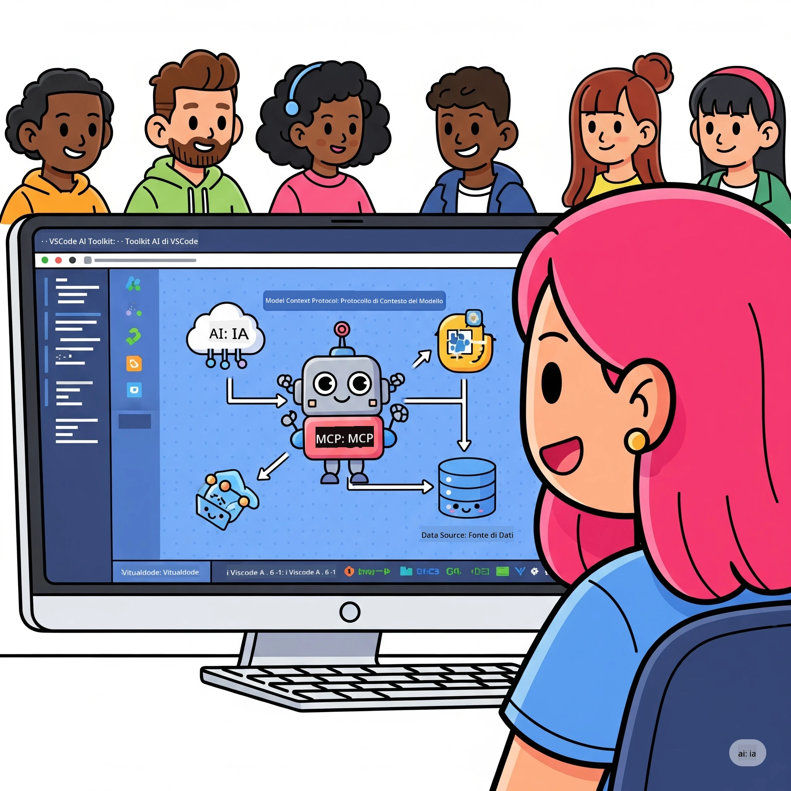
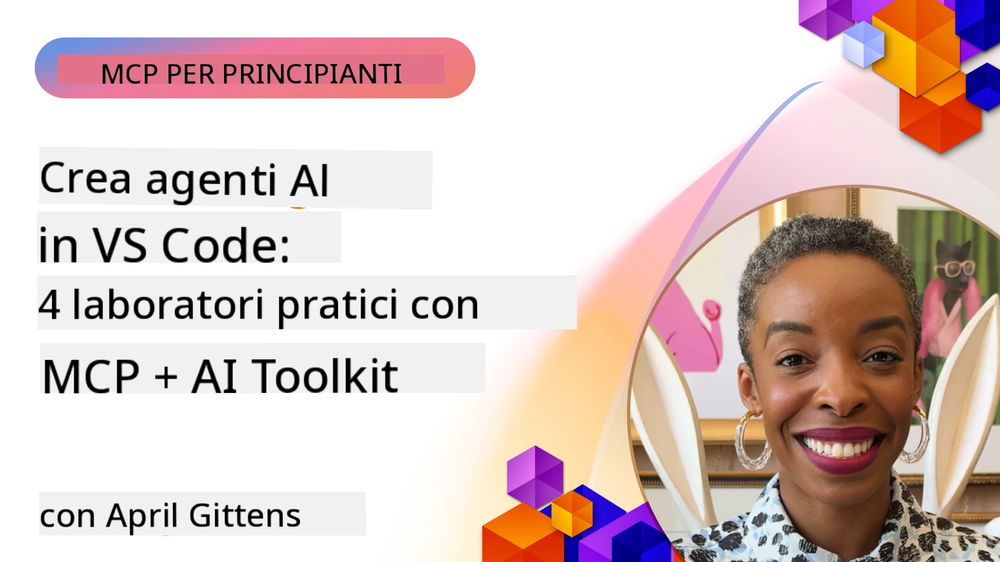

# Snellire i Flussi di Lavoro AI: Costruire un Server MCP con Microsoft Foundry Toolkit

## 🎯 Panoramica

_(Clicca sull’immagine sopra per vedere il video di questa lezione)_

Benvenuto al **Workshop sul Model Context Protocol (MCP)**! Questo workshop pratico completo combina due tecnologie all'avanguardia per rivoluzionare lo sviluppo di applicazioni AI:

> **Nota di compatibilità:** il codice del workshop è stato realizzato e testato con MCP
> `2025-11-25`, come mostrato dal badge sopra. Usa la
> [specifica corrente `2026-07-28`](https://modelcontextprotocol.io/specification/2026-07-28/)
> per nuove implementazioni del protocollo e consulta le note di rilascio dell’SDK
> prima di migrare i laboratori.

- **🔗 Model Context Protocol (MCP)**: Uno standard aperto per l'integrazione fluida degli strumenti AI
- **🛠️ Microsoft Foundry Toolkit Extension per VS Code**: L’estensione potente per lo sviluppo AI di Microsoft

### 🎓 Cosa Imparerai

Al termine di questo workshop, padroneggerai l’arte di costruire applicazioni intelligenti che collegano modelli AI con strumenti e servizi reali. Dal testing automatizzato alle integrazioni API personalizzate, acquisirai competenze pratiche per risolvere sfide aziendali complesse.

## 🏗️ Tecnologia Utilizzata

### 🔌 Model Context Protocol (MCP)

MCP è il **"USB-C per l’AI"** - uno standard universale che connette modelli AI a strumenti esterni e fonti di dati.

**✨ Caratteristiche principali:**

- 🔄 **Integrazione Standardizzata**: Interfaccia universale per connessioni strumento-AI
- 🏛️ **Architettura Flessibile**: Server locali e remoti via trasporto stdio/SSE
- 🧰 **Ecosistema Completo**: Strumenti, prompt e risorse in un unico protocollo
- 🔒 **Pronto per l’Impresa**: Sicurezza e affidabilità integrate

**🎯 Perché MCP è Importante:**
Proprio come USB-C ha eliminato il caos dei cavi, MCP elimina la complessità delle integrazioni AI. Un protocollo, infinite possibilità.

### 🤖 Microsoft Foundry Toolkit Extension per VS Code

L’estensione principale di Microsoft per lo sviluppo AI che trasforma VS Code in una centrale AI.

**🚀 Funzionalità Principali:**

- 📦 **Catalogo Modelli**: Accesso a modelli da Azure AI, GitHub, Hugging Face, Ollama
- ⚡ **Inferenza Locale**: Esecuzione ottimizzata ONNX su CPU/GPU/NPU
- 🏗️ **Costruzione Agenti**: Sviluppo visuale di agenti AI con integrazione MCP
- 🎭 **Multi-Modalità**: Supporto per testo, visione e output strutturati

**💡 Benefici per lo Sviluppo:**

- Deploy di modelli zero-config
- Ingegneria di prompt visiva
- Ambiente di test in tempo reale
- Integrazione fluida con server MCP

## 📚 Percorso di Apprendimento

### [🚀 Modulo 1: Fondamenti di Microsoft Foundry Toolkit](./lab1/README.md)

**Durata**: 15 minuti

- 🛠️ Installa e configura Microsoft Foundry Toolkit per VS Code
- 🗂️ Esplora il Catalogo Modelli (oltre 100 modelli da GitHub, ONNX, OpenAI, Anthropic, Google)
- 🎮 Padroneggia il Playground Interattivo per testare modelli in tempo reale
- 🤖 Costruisci il tuo primo agente AI con Agent Builder
- 📊 Valuta le prestazioni del modello con metriche integrate (F1, rilevanza, similarità, coerenza)
- ⚡ Impara il batch processing e il supporto multi-modale

**🎯 Risultato di Apprendimento**: Crea un agente AI funzionale con comprensione completa delle capacità di Microsoft Foundry Toolkit

### [🌐 Modulo 2: MCP con Fondamenti di Microsoft Foundry Toolkit](./lab2/README.md)

**Durata**: 20 minuti

- 🧠 Padroneggia l’architettura e i concetti del Model Context Protocol (MCP)
- 🌐 Esplora l’ecosistema dei server MCP di Microsoft
- 🤖 Costruisci un agente di automazione browser usando il server MCP Playwright
- 🔧 Integra i server MCP con Microsoft Foundry Toolkit Agent Builder
- 📊 Configura e testa gli strumenti MCP all’interno dei tuoi agenti
- 🚀 Esporta e distribuisci agenti potenziati MCP per uso in produzione

**🎯 Risultato di Apprendimento**: Distribuisci un agente AI potenziato con strumenti esterni tramite MCP

### [🔧 Modulo 3: Sviluppo Avanzato MCP con Microsoft Foundry Toolkit](./lab3/README.md)

**Durata**: 20 minuti

- 💻 Crea server MCP personalizzati usando Microsoft Foundry Toolkit
- 🐍 Configura e usa l’ultimo MCP Python SDK (v1.9.3)
- 🔍 Imposta e utilizza MCP Inspector per il debug
- 🛠️ Costruisci un Weather MCP Server con flussi di lavoro di debug professionali
- 🧪 Debugga server MCP sia in Agent Builder che in Inspector

**🎯 Risultato di Apprendimento**: Sviluppa e fai debug di server MCP personalizzati con strumenti moderni

### [🐙 Modulo 4: Sviluppo Pratico MCP - Server Clone GitHub Personalizzato](./lab4/README.md)

**Durata**: 30 minuti

- 🏗️ Costruisci un server MCP Clone GitHub reale per flussi di lavoro di sviluppo
- 🔄 Implementa clonazione intelligente di repository con validazione e gestione degli errori
- 📁 Crea gestione intelligente delle directory e integrazione VS Code
- 🤖 Usa GitHub Copilot Agent Mode con strumenti MCP personalizzati
- 🛡️ Applica affidabilità pronta per la produzione e compatibilità cross-platform

**🎯 Risultato di Apprendimento**: Distribuisci un server MCP pronto per la produzione che snellisce flussi di lavoro di sviluppo reali

## 💡 Applicazioni e Impatto nel Mondo Reale

### 🏢 Casi d'Uso Aziendali

#### 🔄 Automazione DevOps

Trasforma il tuo flusso di lavoro di sviluppo con automazione intelligente:

- **Gestione Intelligente dei Repository**: Revisione codice e decisioni di merge guidate da AI
- **CI/CD Intelligente**: Ottimizzazione automatica delle pipeline basata sui cambiamenti del codice
- **Triage dei Problemi**: Classificazione e assegnazione automatica dei bug

#### 🧪 Rivoluzione del Quality Assurance

Eleva il testing con automazione potenziata da AI:

- **Generazione Intelligente di Test**: Crea suite di test complete automaticamente
- **Testing di Regressione Visivo**: Rilevamento AI delle modifiche UI
- **Monitoraggio delle Prestazioni**: Identificazione proattiva di problemi e risoluzione

#### 📊 Intelligenza nelle Pipeline Dati

Costruisci flussi di lavoro di elaborazione dati più intelligenti:

- **Processi ETL Adattivi**: Trasformazioni dati auto-ottimizzanti
- **Rilevamento Anomalie**: Monitoraggio qualità dati in tempo reale
- **Routing Intelligente**: Gestione smart del flusso dati

#### 🎧 Miglioramento dell’Esperienza Cliente

Crea interazioni clienti eccezionali:

- **Supporto Context-Aware**: Agenti AI con accesso alla storia cliente
- **Risoluzione Proattiva dei Problemi**: Servizio clienti predittivo
- **Integrazione Multi-Canale**: Esperienza AI unificata su piattaforme

## 🛠️ Prerequisiti e Configurazione

### 💻 Requisiti di Sistema

| Componente | Requisito | Note |
|-----------|-------------|-------|
| **Sistema Operativo** | Windows 10+, macOS 10.15+, Linux | Qualsiasi OS moderno |
| **Visual Studio Code** | Ultima versione stabile | Necessario per Microsoft Foundry Toolkit |
| **Node.js** | v18.0+ e npm | Per sviluppo server MCP |
| **Python** | 3.10+ | Opzionale per server MCP Python |
| **Memoria** | Minimo 8GB RAM | 16GB consigliati per modelli locali |

### 🔧 Ambiente di Sviluppo

#### Estensioni VS Code Consigliate

- **Microsoft Foundry Toolkit** (ms-windows-ai-studio.windows-ai-studio)
- **Python** (ms-python.python)
- **Debugger Python** (ms-python.debugpy)
- **GitHub Copilot** (GitHub.copilot) - Opzionale ma utile

#### Strumenti Opzionali

- **uv**: Gestore pacchetti Python moderno
- **MCP Inspector**: Strumento visivo di debug per server MCP
- **Playwright**: Per esempi di automazione web

## 🎖️ Risultati di Apprendimento e Percorso di Certificazione

### 🏆 Lista di Controllo delle Competenze

Completando questo workshop otterrai competenza in:

#### 🎯 Competenze Base

- [ ] **Padronanza del Protocollo MCP**: Comprensione profonda dell’architettura e modelli di implementazione
- [ ] **Competenza Microsoft Foundry Toolkit**: Uso esperto di Microsoft Foundry Toolkit per sviluppo rapido
- [ ] **Sviluppo Server Personalizzato**: Costruzione, deployment e manutenzione di server MCP di produzione
- [ ] **Eccellenza nell’Integrazione degli Strumenti**: Connessione fluida di AI con flussi di lavoro esistenti
- [ ] **Applicazione nella Risoluzione di Problemi**: Applicare le competenze acquisite a sfide aziendali reali

#### 🔧 Competenze Tecniche

- [ ] Configurare e impostare Microsoft Foundry Toolkit in VS Code
- [ ] Progettare e implementare server MCP personalizzati
- [ ] Integrare modelli GitHub con architettura MCP
- [ ] Costruire flussi di lavoro di testing automatizzato con Playwright
- [ ] Distribuire agenti AI per uso in produzione
- [ ] Debuggare e ottimizzare le prestazioni di server MCP

#### 🚀 Capacità Avanzate

- [ ] Architettare integrazioni AI su scala enterprise
- [ ] Implementare best practice di sicurezza per applicazioni AI
- [ ] Progettare architetture server MCP scalabili
- [ ] Creare catene di strumenti personalizzati per domini specifici
- [ ] Fare da mentore ad altri nello sviluppo AI-native

## 📖 Risorse Aggiuntive

- [Specifiche MCP (2026-07-28)](https://modelcontextprotocol.io/specification/2026-07-28/)
- [Repository GitHub Microsoft Foundry Toolkit](https://github.com/microsoft/vscode-ai-toolkit)
- [Raccolta Esempi Server MCP](https://github.com/modelcontextprotocol/servers)
- [Guida alle Best Practices](https://modelcontextprotocol.io/docs/best-practices)
- [OWASP MCP Top 10](https://microsoft.github.io/mcp-azure-security-guide/mcp/) - Best practice di sicurezza

---

**🚀 Pronto a rivoluzionare il tuo flusso di lavoro di sviluppo AI?**

Costruiamo insieme il futuro delle applicazioni intelligenti con MCP e Microsoft Foundry Toolkit!

## Cosa Fare Dopo

Continua con: [Modulo 11: Laboratori Pratici Server MCP](../11-MCPServerHandsOnLabs/README.md)

---

<!-- CO-OP TRANSLATOR DISCLAIMER START -->
**Disclaimer**:
Questo documento è stato tradotto utilizzando il servizio di traduzione AI [Co-op Translator](https://github.com/Azure/co-op-translator). Sebbene ci impegniamo per garantire la precisione, si prega di notare che le traduzioni automatizzate possono contenere errori o imprecisioni. Il documento originale nella sua lingua nativa deve essere considerato la fonte autorevole. Per informazioni critiche, si raccomanda una traduzione professionale effettuata da un essere umano. Non siamo responsabili per eventuali malintesi o interpretazioni errate derivanti dall’uso di questa traduzione.
<!-- CO-OP TRANSLATOR DISCLAIMER END -->