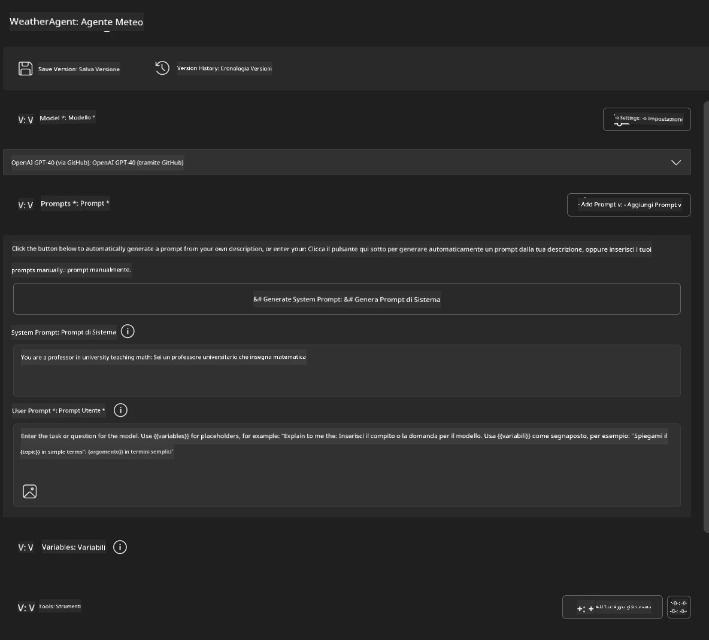
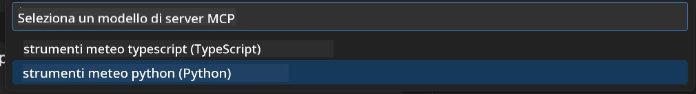
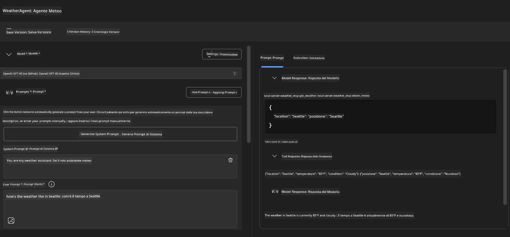
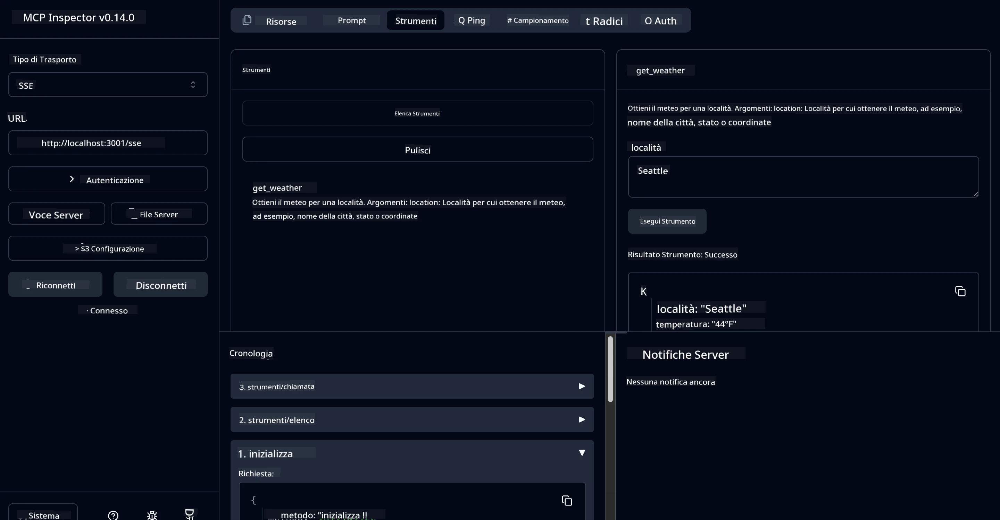

# 🔧 Modulo 3: Sviluppo Avanzato MCP con Microsoft Foundry Toolkit

> [!NOTE]
> Gli URL dell'Inspector in questo laboratorio utilizzano il legacy endpoint `/sse` e puntano alle
> dipendenze MCP SDK `1.9.3` e Inspector `0.14.0` fissate. Non corrispondono agli
> esempi Streamable HTTP `2026-07-28` aggiornati.


## 🎯 Obiettivi di Apprendimento

Al termine di questo laboratorio, sarai in grado di:

- ✅ Creare server MCP personalizzati usando Microsoft Foundry Toolkit
- ✅ Configurare e utilizzare l’ultima MCP Python SDK (v1.9.3)
- ✅ Configurare e usare MCP Inspector per il debugging
- ✅ Debuggare server MCP sia in Agent Builder sia nell’ambiente Inspector
- ✅ Comprendere flussi di lavoro avanzati di sviluppo server MCP

## 📋 Prerequisiti

- Completamento del Laboratorio 2 (Fondamenti MCP)
- VS Code con estensione Microsoft Foundry Toolkit installata
- Ambiente Python 3.10+
- Node.js e npm per configurazione Inspector

## 🏗️ Cosa Costruirai

In questo laboratorio, creerai un **Server MCP Meteo** che dimostra:
- Implementazione personalizzata di server MCP
- Integrazione con Microsoft Foundry Toolkit Agent Builder
- Flussi di lavoro professionali di debugging
- Modelli d’uso moderni del MCP SDK

---

## 🔧 Panoramica Componenti Principali

### 🐍 MCP Python SDK
Il Model Context Protocol Python SDK fornisce la base per costruire server MCP personalizzati. Userai la versione 1.9.3 con capacità di debugging migliorate.

### 🔍 MCP Inspector
Uno strumento di debugging potente che offre:
- Monitoraggio server in tempo reale
- Visualizzazione esecuzione strumenti
- Ispezione richieste/risposte di rete
- Ambiente di test interattivo

---

## 📖 Implementazione Passo per Passo

### Passo 1: Crea un WeatherAgent in Agent Builder

1. **Avvia Agent Builder** in VS Code tramite l’estensione Microsoft Foundry Toolkit
2. **Crea un nuovo agente** con la seguente configurazione:
   - Nome agente: `WeatherAgent`



### Passo 2: Inizializza il progetto MCP Server

1. **Vai in Tools** → **Add Tool** in Agent Builder
2. **Seleziona "MCP Server"** tra le opzioni disponibili
3. **Scegli "Create A new MCP Server"**
4. **Seleziona il template `python-weather`**
5. **Nomina il tuo server:** `weather_mcp`



### Passo 3: Apri ed Esamina il progetto

1. **Apri il progetto generato** in VS Code
2. **Esamina la struttura del progetto:**
   ```
   weather_mcp/
   ├── src/
   │   ├── __init__.py
   │   └── server.py
   ├── inspector/
   │   ├── package.json
   │   └── package-lock.json
   ├── .vscode/
   │   ├── launch.json
   │   └── tasks.json
   ├── pyproject.toml
   └── README.md
   ```

### Passo 4: Aggiorna all’ultima MCP SDK

> **🔍 Perché Aggiornare?** Vogliamo usare l’ultima MCP SDK (v1.9.3) e il servizio Inspector (0.14.0) per funzionalità migliorate e migliori capacità di debugging.

#### 4a. Aggiorna le Dipendenze Python

**Modifica `pyproject.toml`:** aggiorna [./code/weather_mcp/pyproject.toml](../../../../10-StreamliningAIWorkflowsBuildingAnMCPServerWithAIToolkit/lab3/code/weather_mcp/pyproject.toml)


#### 4b. Aggiorna la Configurazione di Inspector

**Modifica `inspector/package.json`:** aggiorna [./code/weather_mcp/inspector/package.json](../../../../10-StreamliningAIWorkflowsBuildingAnMCPServerWithAIToolkit/lab3/code/weather_mcp/inspector/package.json)

#### 4c. Aggiorna le Dipendenze di Inspector

**Modifica `inspector/package-lock.json`:** aggiorna [./code/weather_mcp/inspector/package-lock.json](../../../../10-StreamliningAIWorkflowsBuildingAnMCPServerWithAIToolkit/lab3/code/weather_mcp/inspector/package-lock.json)

> **📝 Nota:** Questo file contiene definizioni estese delle dipendenze. Qui sotto è la struttura essenziale - il contenuto completo assicura una corretta risoluzione delle dipendenze.


> **⚡ Package Lock Completo:** Il file package-lock.json completo contiene ~3000 righe di definizioni di dipendenze. La struttura sopra mostra le parti chiave - usa il file fornito per la risoluzione completa.

### Passo 5: Configura il Debug in VS Code

*Nota: Si prega di copiare il file nel percorso specificato per sostituire il file locale corrispondente*

#### 5a. Aggiorna la Configurazione di Avvio

**Modifica `.vscode/launch.json`:**

```json
{
  "version": "0.2.0",
  "configurations": [
    {
      "name": "Attach to Local MCP",
      "type": "debugpy",
      "request": "attach",
      "connect": {
        "host": "localhost",
        "port": 5678
      },
      "presentation": {
        "hidden": true
      },
      "internalConsoleOptions": "neverOpen",
      "postDebugTask": "Terminate All Tasks"
    },
    {
      "name": "Launch Inspector (Edge)",
      "type": "msedge",
      "request": "launch",
      "url": "http://localhost:6274?timeout=60000&serverUrl=http://localhost:3001/sse#tools",
      "cascadeTerminateToConfigurations": [
        "Attach to Local MCP"
      ],
      "presentation": {
        "hidden": true
      },
      "internalConsoleOptions": "neverOpen"
    },
    {
      "name": "Launch Inspector (Chrome)",
      "type": "chrome",
      "request": "launch",
      "url": "http://localhost:6274?timeout=60000&serverUrl=http://localhost:3001/sse#tools",
      "cascadeTerminateToConfigurations": [
        "Attach to Local MCP"
      ],
      "presentation": {
        "hidden": true
      },
      "internalConsoleOptions": "neverOpen"
    }
  ],
  "compounds": [
    {
      "name": "Debug in Agent Builder",
      "configurations": [
        "Attach to Local MCP"
      ],
      "preLaunchTask": "Open Agent Builder",
    },
    {
      "name": "Debug in Inspector (Edge)",
      "configurations": [
        "Launch Inspector (Edge)",
        "Attach to Local MCP"
      ],
      "preLaunchTask": "Start MCP Inspector",
      "stopAll": true
    },
    {
      "name": "Debug in Inspector (Chrome)",
      "configurations": [
        "Launch Inspector (Chrome)",
        "Attach to Local MCP"
      ],
      "preLaunchTask": "Start MCP Inspector",
      "stopAll": true
    }
  ]
}
```

**Modifica `.vscode/tasks.json`:**

```
{
  "version": "2.0.0",
  "tasks": [
    {
      "label": "Start MCP Server",
      "type": "shell",
      "command": "python -m debugpy --listen 127.0.0.1:5678 src/__init__.py sse",
      "isBackground": true,
      "options": {
        "cwd": "${workspaceFolder}",
        "env": {
          "PORT": "3001"
        }
      },
      "problemMatcher": {
        "pattern": [
          {
            "regexp": "^.*$",
            "file": 0,
            "location": 1,
            "message": 2
          }
        ],
        "background": {
          "activeOnStart": true,
          "beginsPattern": ".*",
          "endsPattern": "Application startup complete|running"
        }
      }
    },
    {
      "label": "Start MCP Inspector",
      "type": "shell",
      "command": "npm run dev:inspector",
      "isBackground": true,
      "options": {
        "cwd": "${workspaceFolder}/inspector",
        "env": {
          "CLIENT_PORT": "6274",
          "SERVER_PORT": "6277",
        }
      },
      "problemMatcher": {
        "pattern": [
          {
            "regexp": "^.*$",
            "file": 0,
            "location": 1,
            "message": 2
          }
        ],
        "background": {
          "activeOnStart": true,
          "beginsPattern": "Starting MCP inspector",
          "endsPattern": "Proxy server listening on port"
        }
      },
      "dependsOn": [
        "Start MCP Server"
      ]
    },
    {
      "label": "Open Agent Builder",
      "type": "shell",
      "command": "echo ${input:openAgentBuilder}",
      "presentation": {
        "reveal": "never"
      },
      "dependsOn": [
        "Start MCP Server"
      ],
    },
    {
      "label": "Terminate All Tasks",
      "command": "echo ${input:terminate}",
      "type": "shell",
      "problemMatcher": []
    }
  ],
  "inputs": [
    {
      "id": "openAgentBuilder",
      "type": "command",
      "command": "ai-mlstudio.agentBuilder",
      "args": {
        "initialMCPs": [ "local-server-weather_mcp" ],
        "triggeredFrom": "vsc-tasks"
      }
    },
    {
      "id": "terminate",
      "type": "command",
      "command": "workbench.action.tasks.terminate",
      "args": "terminateAll"
    }
  ]
}
```


---

## 🚀 Esecuzione e Test del tuo MCP Server

### Passo 6: Installa le dipendenze

Dopo aver apportato le modifiche di configurazione, esegui i seguenti comandi:

**Installa le dipendenze Python:**
```bash
uv sync
```

**Installa le dipendenze dell’Inspector:**
```bash
cd inspector
npm install
```

### Passo 7: Debug con Agent Builder

1. **Premi F5** o usa la configurazione **"Debug in Agent Builder"**
2. **Seleziona la configurazione composta** dal pannello di debug
3. **Attendi l’avvio del server** e l’apertura di Agent Builder
4. **Testa il tuo server MCP meteo** con query in linguaggio naturale

Inserisci un prompt come questo

SYSTEM_PROMPT

```
You are my weather assistant
```

USER_PROMPT

```
How's the weather like in Seattle
```



### Passo 8: Debug con MCP Inspector

1. **Usa la configurazione "Debug in Inspector"** (Edge o Chrome)
2. **Apri l’interfaccia Inspector** a `http://localhost:6274`
3. **Esplora l’ambiente interattivo di test:**
   - Visualizza gli strumenti disponibili
   - Testa l’esecuzione degli strumenti
   - Monitora le richieste di rete
   - Debugga le risposte del server



---

## 🎯 Risultati Chiave di Apprendimento

Completando questo laboratorio, hai:

- [x] **Creato un server MCP personalizzato** usando i template Microsoft Foundry Toolkit
- [x] **Aggiornato all’ultima MCP SDK** (v1.9.3) per funzionalità migliorate
- [x] **Configurato flussi di lavoro professionali di debugging** per Agent Builder e Inspector
- [x] **Configurato MCP Inspector** per test interattivi del server
- [x] **Padroneggiato la configurazione di debugging in VS Code** per sviluppo MCP

## 🔧 Funzionalità Avanzate Esplorate

| Funzionalità | Descrizione | Caso d’Uso |
|---------|-------------|----------|
| **MCP Python SDK v1.9.3** | Implementazione protocollo più recente | Sviluppo server moderno |
| **MCP Inspector 0.14.0** | Strumento di debugging interattivo | Test server in tempo reale |
| **Debugging VS Code** | Ambiente di sviluppo integrato | Flusso di lavoro professionale di debugging |
| **Integrazione Agent Builder** | Connessione diretta Microsoft Foundry Toolkit | Test end-to-end degli agenti |

## 📚 Risorse Aggiuntive

- [Documentazione MCP Python SDK](https://modelcontextprotocol.io/docs/sdk/python)
- [Guida Estensione Microsoft Foundry Toolkit](https://code.visualstudio.com/docs/ai/ai-toolkit)
- [Documentazione Debugging VS Code](https://code.visualstudio.com/docs/editor/debugging)
- [Specifiche Model Context Protocol](https://modelcontextprotocol.io/docs/concepts/architecture)

---

**🎉 Congratulazioni!** Hai completato con successo il Laboratorio 3 e ora puoi creare, debuggar e distribuire server MCP personalizzati usando flussi di lavoro professionali di sviluppo.

### 🔜 Continua al Modulo Successivo

Sei pronto a mettere in pratica le tue competenze MCP in un flusso di lavoro di sviluppo reale? Continua a **[Modulo 4: Sviluppo Pratico MCP - Server Clone GitHub Personalizzato](../lab4/README.md)** dove:
- Costruirai un server MCP pronto per la produzione che automatizza le operazioni su repository GitHub
- Implementerai la funzionalità di clonazione repository GitHub tramite MCP
- Integrerai server MCP personalizzati con VS Code e GitHub Copilot Agent Mode
- Testerai e distribuirai server MCP personalizzati in ambienti di produzione
- Imparerai automazioni pratiche di workflow per sviluppatori

---

<!-- CO-OP TRANSLATOR DISCLAIMER START -->
**Disclaimer**:
Questo documento è stato tradotto utilizzando il servizio di traduzione AI [Co-op Translator](https://github.com/Azure/co-op-translator). Sebbene ci impegniamo per garantire la precisione, si prega di notare che le traduzioni automatizzate possono contenere errori o imprecisioni. Il documento originale nella sua lingua nativa deve essere considerato la fonte autorevole. Per informazioni critiche, si raccomanda una traduzione professionale effettuata da un essere umano. Non siamo responsabili per eventuali malintesi o interpretazioni errate derivanti dall’uso di questa traduzione.
<!-- CO-OP TRANSLATOR DISCLAIMER END -->