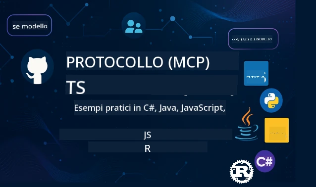

<!--
CO_OP_TRANSLATOR_METADATA:
{
  "original_hash": "35240f904db8c08d6198f6f15767d218",
  "translation_date": "2026-01-15T04:02:02+00:00",
  "source_file": "README.md",
  "language_code": "it"
}
-->
 

[](https://GitHub.com/microsoft/mcp-for-beginners/graphs/contributors)
[](https://GitHub.com/microsoft/mcp-for-beginners/issues)
[](https://GitHub.com/microsoft/mcp-for-beginners/pulls)
[](http://makeapullrequest.com)

[](https://GitHub.com/microsoft/mcp-for-beginners/watchers)
[](https://GitHub.com/microsoft/mcp-for-beginners/fork)
[](https://GitHub.com/microsoft/mcp-for-beginners/stargazers)


[](https://discord.gg/nTYy5BXMWG)

Segui questi passaggi per iniziare a usare queste risorse:
1. **Forka il Repository**: Clicca [](https://GitHub.com/microsoft/mcp-for-beginners/fork)
2. **Clona il Repository**:   `git clone https://github.com/microsoft/mcp-for-beginners.git`
3. **Unisciti al** [](https://discord.gg/nTYy5BXMWG)


### 🌐 Supporto Multi-Lingua

#### Supportato tramite GitHub Action (Automatico e Sempre Aggiornato)

<!-- CO-OP TRANSLATOR LANGUAGES TABLE START -->
[Arabic](../ar/README.md) | [Bengali](../bn/README.md) | [Bulgarian](../bg/README.md) | [Burmese (Myanmar)](../my/README.md) | [Chinese (Simplified)](../zh/README.md) | [Chinese (Traditional, Hong Kong)](../hk/README.md) | [Chinese (Traditional, Macau)](../mo/README.md) | [Chinese (Traditional, Taiwan)](../tw/README.md) | [Croatian](../hr/README.md) | [Czech](../cs/README.md) | [Danish](../da/README.md) | [Dutch](../nl/README.md) | [Estonian](../et/README.md) | [Finnish](../fi/README.md) | [French](../fr/README.md) | [German](../de/README.md) | [Greek](../el/README.md) | [Hebrew](../he/README.md) | [Hindi](../hi/README.md) | [Hungarian](../hu/README.md) | [Indonesian](../id/README.md) | [Italian](./README.md) | [Japanese](../ja/README.md) | [Kannada](../kn/README.md) | [Korean](../ko/README.md) | [Lithuanian](../lt/README.md) | [Malay](../ms/README.md) | [Malayalam](../ml/README.md) | [Marathi](../mr/README.md) | [Nepali](../ne/README.md) | [Nigerian Pidgin](../pcm/README.md) | [Norwegian](../no/README.md) | [Persian (Farsi)](../fa/README.md) | [Polish](../pl/README.md) | [Portuguese (Brazil)](../br/README.md) | [Portuguese (Portugal)](../pt/README.md) | [Punjabi (Gurmukhi)](../pa/README.md) | [Romanian](../ro/README.md) | [Russian](../ru/README.md) | [Serbian (Cyrillic)](../sr/README.md) | [Slovak](../sk/README.md) | [Slovenian](../sl/README.md) | [Spanish](../es/README.md) | [Swahili](../sw/README.md) | [Swedish](../sv/README.md) | [Tagalog (Filipino)](../tl/README.md) | [Tamil](../ta/README.md) | [Telugu](../te/README.md) | [Thai](../th/README.md) | [Turkish](../tr/README.md) | [Ukrainian](../uk/README.md) | [Urdu](../ur/README.md) | [Vietnamese](../vi/README.md)

> **Preferisci Clonare Localmente?**

> Questo repository include oltre 50 traduzioni linguistiche che aumentano significativamente la dimensione del download. Per clonare senza traduzioni, usa lo sparse checkout:
> ```bash
> git clone --filter=blob:none --sparse https://github.com/microsoft/mcp-for-beginners.git
> cd mcp-for-beginners
> git sparse-checkout set --no-cone '/*' '!translations' '!translated_images'
> ```
> Questo ti dà tutto ciò che ti serve per completare il corso con un download molto più veloce.
<!-- CO-OP TRANSLATOR LANGUAGES TABLE END -->

# 🚀 Curriculum del Model Context Protocol (MCP) per Principianti

## **Impara MCP con Esempi Pratici di Codice in C#, Java, JavaScript, Rust, Python e TypeScript**

## 🧠 Panoramica del Curriculum del Model Context Protocol
Benvenuto nel tuo viaggio nel Model Context Protocol! Se ti sei mai chiesto come le applicazioni AI comunicano con diversi strumenti e servizi, stai per scoprire la soluzione elegante che sta trasformando il modo in cui gli sviluppatori costruiscono sistemi intelligenti.

Pensa a MCP come a un traduttore universale per le applicazioni AI — proprio come le porte USB ti permettono di collegare qualsiasi dispositivo al tuo computer, MCP permette ai modelli AI di collegarsi a qualsiasi strumento o servizio in modo standardizzato. Che tu stia costruendo il tuo primo chatbot o lavorando su flussi di lavoro AI complessi, comprendere MCP ti darà il potere di creare applicazioni più capaci e flessibili.

Questo curriculum è progettato con pazienza e cura per il tuo percorso di apprendimento. Inizieremo con concetti semplici che già conosci e costruiremo gradualmente la tua esperienza attraverso la pratica diretta nella tua lingua di programmazione preferita. Ogni passo include spiegazioni chiare, esempi pratici e tanto incoraggiamento lungo il percorso.

Al termine di questo viaggio, avrai la fiducia per costruire i tuoi server MCP, integrarli con piattaforme AI popolari e capire come questa tecnologia stia rimodellando il futuro dello sviluppo AI. Iniziamo questa entusiasmante avventura insieme!

### Documentazione Ufficiale e Specifiche

Queste risorse diventano più preziose man mano che cresce la tua comprensione, ma non sentirti obbligato a leggere tutto subito. Inizia dalle aree che ti interessano di più!
- 📘 [Documentazione MCP](https://modelcontextprotocol.io/) – Questa è la tua risorsa di riferimento per tutorial passo-passo e guide utente. La documentazione è scritta pensando ai principianti, fornendo esempi chiari da seguire al tuo ritmo.
- 📜 [Specifiche MCP](https://modelcontextprotocol.io/docs/) – Considerala come il tuo manuale di riferimento completo. Man mano che lavori nel curriculum, ti ritroverai a tornare qui per consultare dettagli specifici ed esplorare funzionalità avanzate.
- 📜 [Specifiche Originali MCP](https://modelcontextprotocol.io/specification/versioning) – Contiene dettagli tecnici aggiuntivi che possono essere utili per implementazioni avanzate. È a disposizione quando ne hai bisogno, ma non preoccuparti all'inizio.
- 🧑‍💻 [Repository MCP su GitHub](https://github.com/modelcontextprotocol) – Qui troverai SDK, strumenti ed esempi di codice in vari linguaggi di programmazione. È come un tesoro di esempi pratici e componenti pronti all'uso.
- 🌐 [Comunità MCP](https://github.com/orgs/modelcontextprotocol/discussions) – Unisciti ad altri studenti e sviluppatori esperti nelle discussioni su MCP. È una comunità di supporto dove le domande sono benvenute e la conoscenza viene condivisa liberamente.
  
## Obiettivi di Apprendimento

Al termine di questo curriculum, ti sentirai sicuro ed entusiasta delle tue nuove competenze. Ecco cosa otterrai:

• **Comprendere le basi di MCP**: Capirai cos’è il Model Context Protocol e perché sta rivoluzionando il modo in cui le applicazioni AI collaborano, usando analogie ed esempi che hanno senso.

• **Creare il tuo primo server MCP**: Costruirai un server MCP funzionante nel linguaggio di programmazione che preferisci, iniziando con esempi semplici e sviluppando le tue abilità passo dopo passo.

• **Collegare modelli AI a strumenti reali**: Imparerai a colmare il divario tra modelli AI e servizi reali, dando alle tue applicazioni nuove e potenti capacità.

• **Applicare le migliori pratiche di sicurezza**: Capirai come mantenere le tue implementazioni MCP sicure, proteggendo sia le tue applicazioni che gli utenti.

• **Distribuire con fiducia**: Saprai come portare i tuoi progetti MCP dalla fase di sviluppo alla produzione, con strategie pratiche di deployment che funzionano nel mondo reale.

• **Entrare nella comunità MCP**: Farai parte di una comunità in crescita di sviluppatori che stanno plasmando il futuro dello sviluppo di applicazioni AI. 

## Conoscenze di Base Essenziali

Prima di entrare nei dettagli di MCP, assicuriamoci che tu sia a tuo agio con alcuni concetti fondamentali. Non preoccuparti se non sei esperto, spiegheremo tutto ciò che ti serve sapere strada facendo!

### Comprendere i Protocolli (La Base)

Pensa a un protocollo come alle regole di una conversazione. Quando chiami un amico, entrambi sapete di dire "ciao" quando rispondete, alternarvi a parlare e dire "arrivederci" alla fine. I programmi per computer hanno bisogno di regole simili per comunicare efficacemente.

MCP è un protocollo — un insieme di regole concordate che aiutano modelli AI e applicazioni a tenere "conversazioni" produttive con strumenti e servizi. Proprio come avere regole verbali rende più fluida la comunicazione umana, avere MCP rende la comunicazione tra applicazioni AI molto più affidabile e potente.

### Relazioni Client-Server (Come Lavorano Insieme i Programmi)

Usi già ogni giorno relazioni client-server! Quando usi un browser web (il client) per visitare un sito, ti connetti a un server web che ti invia il contenuto della pagina. Il browser sa come chiedere informazioni e il server come rispondere.

In MCP abbiamo una relazione simile: i modelli AI agiscono da client che richiedono informazioni o azioni, mentre i server MCP offrono queste capacità. È come avere un assistente utile (il server) che l’AI può chiedere di svolgere compiti specifici.

### Perché la Standardizzazione è Importante (Far Funzionare le Cose Insieme)

Immagina se ogni casa automobilistica usasse una forma diversa per le pompe di benzina — avresti bisogno di un adattatore diverso per ogni macchina! La standardizzazione significa concordare approcci comuni affinché le cose funzionino insieme senza problemi.

MCP fornisce questa standardizzazione per le applicazioni AI. Invece che ogni modello AI richieda codice personalizzato per lavorare con ogni strumento, MCP crea un modo universale per comunicare. Questo significa che gli sviluppatori possono costruire strumenti una volta sola e farli funzionare con molti sistemi AI diversi.

## 🧭 Panoramica del Tuo Percorso di Apprendimento

Il tuo percorso MCP è strutturato con cura per aumentare progressivamente fiducia e competenze. Ogni fase introduce nuovi concetti mentre rinforza quelli già appresi.

### 🌱 Fase Fondamentale: Comprendere le Basi (Moduli 0-2)

Qui inizia la tua avventura! Ti introdurremo ai concetti MCP usando analogie familiari ed esempi semplici. Capirai cos’è MCP, perché esiste e come si inserisce nel più ampio mondo dello sviluppo AI.

• **Modulo 0 - Introduzione a MCP**: Inizieremo esplorando cos’è MCP e perché è così importante per le applicazioni AI moderne. Vedrai esempi reali di MCP in azione e capirai come risolve problemi comuni per gli sviluppatori.

• **Modulo 1 - Concetti Fondamentali Spiegati**: Qui apprenderai i blocchi costitutivi essenziali di MCP. Useremo molte analogie ed esempi visivi per fare in modo che questi concetti risultino naturali e comprensibili.

• **Modulo 2 - Sicurezza in MCP**: La sicurezza può sembrare intimidatoria, ma ti mostreremo come MCP include funzioni di sicurezza integrate e ti insegneremo le migliori pratiche che proteggono le tue applicazioni fin dall’inizio.

### 🔨 Fase di Costruzione: Creare le Tue Prime Implementazioni (Modulo 3)

Adesso inizia il divertimento vero! Avrai esperienza pratica costruendo server e client MCP reali. Non preoccuparti — inizieremo in modo semplice e ti guideremo passo passo.

Questo modulo include molte guide pratiche che ti permettono di esercitarti nel linguaggio di programmazione che preferisci. Creerai il tuo primo server, costruirai un client per connetterti a esso e integrerai anche strumenti di sviluppo popolari come VS Code.

Ogni guida include esempi di codice completi, suggerimenti per il debug e spiegazioni sul perché di specifiche scelte progettuali. Al termine di questa fase, avrai implementazioni MCP funzionanti di cui andare orgoglioso!
### 🚀 Fase di Crescita: Concetti Avanzati e Applicazione nel Mondo Reale (Moduli 4-5)

Con le basi padroneggiate, sei pronto a esplorare funzionalità MCP più sofisticate. Tratteremo strategie di implementazione pratica, tecniche di debugging e argomenti avanzati come l'integrazione AI multimodale.

Imparerai anche come scalare le tue implementazioni MCP per l'uso in produzione e integrarti con piattaforme cloud come Azure. Questi moduli ti preparano a costruire soluzioni MCP in grado di gestire le esigenze del mondo reale.

### 🌟 Fase di Padronanza: Comunità e Specializzazione (Moduli 6-11)

La fase finale si concentra sull'adesione alla comunità MCP e sulla specializzazione in aree che ti interessano di più. Imparerai come contribuire a progetti MCP open-source, implementare pattern avanzati di autenticazione e costruire soluzioni complete integrate con database.

Il modulo 11 merita una menzione speciale: è un percorso pratico completo con 13 laboratori che insegna a costruire server MCP pronti per la produzione con integrazione PostgreSQL. È come un progetto finale che unisce tutto ciò che hai imparato!

### 📚 Struttura Completa del Curriculum

| Module | Topic | Description | Link |
|--------|-------|-------------|------|
| **Module 1-3: Fundamentals** | | | |
| 00 | Introduction to MCP | Panoramica del Model Context Protocol e la sua importanza nelle pipeline AI | [Read more](./00-Introduction/README.md) |
| 01 | Core Concepts Explained | Esplorazione approfondita dei concetti fondamentali MCP | [Read more](./01-CoreConcepts/README.md) |
| 02 | Security in MCP | Minacce alla sicurezza e best practice | [Read more](./02-Security/README.md) |
| 03 | Getting Started with MCP | Configurazione dell'ambiente, server/client di base, integrazione | [Read more](./03-GettingStarted/README.md) |
| **Module 3: Building Your First Server & Client** | | | |
| 3.1 | First Server | Crea il tuo primo server MCP | [Guide](./03-GettingStarted/01-first-server/README.md) |
| 3.2 | First Client | Sviluppa un client MCP di base | [Guide](./03-GettingStarted/02-client/README.md) |
| 3.3 | Client with LLM | Integra modelli linguistici di grandi dimensioni | [Guide](./03-GettingStarted/03-llm-client/README.md) |
| 3.4 | VS Code Integration | Consuma server MCP in VS Code | [Guide](./03-GettingStarted/04-vscode/README.md) |
| 3.5 | stdio Server | Crea server usando il trasporto stdio | [Guide](./03-GettingStarted/05-stdio-server/README.md) |
| 3.6 | HTTP Streaming | Implementa lo streaming HTTP in MCP | [Guide](./03-GettingStarted/06-http-streaming/README.md) |
| 3.7 | AI Toolkit | Usa AI Toolkit con MCP | [Guide](./03-GettingStarted/07-aitk/README.md) |
| 3.8 | Testing | Testa la tua implementazione server MCP | [Guide](./03-GettingStarted/08-testing/README.md) |
| 3.9 | Deployment | Distribuisci server MCP in produzione | [Guide](./03-GettingStarted/09-deployment/README.md) |
| 3.10 | Advanced server usage | Usa server avanzati per funzionalità avanzate e architettura migliorata | [Guide](./03-GettingStarted/10-advanced/README.md) |
| 3.11 | Simple auth | Un capitolo che mostra l'autenticazione dall'inizio e RBAC | [Guide](./03-GettingStarted/11-simple-auth/README.md) |
| **Module 4-5: Practical & Advanced** | | | |
| 04 | Practical Implementation | SDK, debugging, testing, modelli riutilizzabili di prompt | [Read more](./04-PracticalImplementation/README.md) |
| 05 | Advanced Topics in MCP | AI multimodale, scalabilità, uso aziendale | [Read more](./05-AdvancedTopics/README.md) |
| 5.1 | Azure Integration | Integrazione MCP con Azure | [Guide](./05-AdvancedTopics/mcp-integration/README.md) |
| 5.2 | Multi-modality | Lavorare con molteplici modalità | [Guide](./05-AdvancedTopics/mcp-multi-modality/README.md) |
| 5.3 | OAuth2 Demo | Implementa autenticazione OAuth2 | [Guide](./05-AdvancedTopics/mcp-oauth2-demo/README.md) |
| 5.4 | Root Contexts | Comprendere e implementare root contexts | [Guide](./05-AdvancedTopics/mcp-root-contexts/README.md) |
| 5.5 | Routing | Strategie di routing MCP | [Guide](./05-AdvancedTopics/mcp-routing/README.md) |
| 5.6 | Sampling | Tecniche di campionamento in MCP | [Guide](./05-AdvancedTopics/mcp-sampling/README.md) |
| 5.7 | Scaling | Scala le implementazioni MCP | [Guide](./05-AdvancedTopics/mcp-scaling/README.md) |
| 5.8 | Security | Considerazioni avanzate sulla sicurezza | [Guide](./05-AdvancedTopics/mcp-security/README.md) |
| 5.9 | Web Search | Implementa funzionalità di ricerca web | [Guide](./05-AdvancedTopics/web-search-mcp/README.md) |
| 5.10 | Realtime Streaming | Costruisci funzionalità di streaming in tempo reale | [Guide](./05-AdvancedTopics/mcp-realtimestreaming/README.md) |
| 5.11 | Realtime Search | Implementa ricerca in tempo reale | [Guide](./05-AdvancedTopics/mcp-realtimesearch/README.md) |
| 5.12 | Entra ID Auth | Autenticazione con Microsoft Entra ID | [Guide](./05-AdvancedTopics/mcp-security-entra/README.md) |
| 5.13 | Foundry Integration | Integra con Azure AI Foundry | [Guide](./05-AdvancedTopics/mcp-foundry-agent-integration/README.md) |
| 5.14 | Context Engineering | Tecniche per un’efficace ingegneria del contesto | [Guide](./05-AdvancedTopics/mcp-contextengineering/README.md) |
| 5.15 | MCP Custom Transport | Implementazioni di trasporto personalizzate | [Guide](./05-AdvancedTopics/mcp-transport/README.md) |
| **Module 6-10: Community & Best Practices** | | | |
| 06 | Community Contributions | Come contribuire all'ecosistema MCP | [Guide](./06-CommunityContributions/README.md) |
| 07 | Insights from Early Adoption | Storie di implementazione reale | [Guide](./07-LessonsFromEarlyAdoption/README.md) |
| 08 | Best Practices for MCP | Performance, tolleranza ai guasti, resilienza | [Guide](./08-BestPractices/README.md) |
| 09 | MCP Case Studies | Esempi pratici di implementazione | [Guide](./09-CaseStudy/README.md) |
| 10 | Hands-on Workshop | Costruire un server MCP con AI Toolkit | [Lab](./10-StreamliningAIWorkflowsBuildingAnMCPServerWithAIToolkit/README.md) |
| **Module 11: MCP Server Hands On Lab** | | | |
| 11 | MCP Server Database Integration | Percorso completo pratico con 13 laboratori per integrazione PostgreSQL | [Labs](./11-MCPServerHandsOnLabs/README.md) |
| 11.1 | Introduction | Panoramica MCP con integrazione database e caso d'uso retail analytics | [Lab 00](./11-MCPServerHandsOnLabs/00-Introduction/README.md) |
| 11.2 | Core Architecture | Comprensione dell'architettura server MCP, livelli database e pattern di sicurezza | [Lab 01](./11-MCPServerHandsOnLabs/01-Architecture/README.md) |
| 11.3 | Security & Multi-Tenancy | Sicurezza a livello di riga, autenticazione e accesso dati multi-tenant | [Lab 02](./11-MCPServerHandsOnLabs/02-Security/README.md) |
| 11.4 | Environment Setup | Configurazione ambiente sviluppo, Docker, risorse Azure | [Lab 03](./11-MCPServerHandsOnLabs/03-Setup/README.md) |
| 11.5 | Database Design | Configurazione PostgreSQL, design schema retail e dati di esempio | [Lab 04](./11-MCPServerHandsOnLabs/04-Database/README.md) |
| 11.6 | MCP Server Implementation | Costruzione del server FastMCP con integrazione database | [Lab 05](./11-MCPServerHandsOnLabs/05-MCP-Server/README.md) |
| 11.7 | Tool Development | Creazione strumenti di query database e introspezione schema | [Lab 06](./11-MCPServerHandsOnLabs/06-Tools/README.md) |
| 11.8 | Semantic Search | Implementazione vettori embedding con Azure OpenAI e pgvector | [Lab 07](./11-MCPServerHandsOnLabs/07-Semantic-Search/README.md) |
| 11.9 | Testing & Debugging | Strategie di test, strumenti di debug e metodi di validazione | [Lab 08](./11-MCPServerHandsOnLabs/08-Testing/README.md) |
| 11.10 | VS Code Integration | Configurazione integrazione MCP in VS Code e uso AI Chat | [Lab 09](./11-MCPServerHandsOnLabs/09-VS-Code/README.md) |
| 11.11 | Deployment Strategies | Distribuzione Docker, Azure Container Apps e considerazioni di scalabilità | [Lab 10](./11-MCPServerHandsOnLabs/10-Deployment/README.md) |
| 11.12 | Monitoring | Application Insights, logging, monitoraggio delle prestazioni | [Lab 11](./11-MCPServerHandsOnLabs/11-Monitoring/README.md) |
| 11.13 | Best Practices | Ottimizzazione delle prestazioni, rafforzamento della sicurezza e consigli per la produzione | [Lab 12](./11-MCPServerHandsOnLabs/12-Best-Practices/README.md) |

### 💻 Progetti di Codice di Esempio

Una delle parti più entusiasmanti dell'apprendimento MCP è vedere le tue capacità di programmazione svilupparsi progressivamente. Abbiamo progettato i nostri esempi di codice per partire da semplici ed evolversi in modo più sofisticato all'aumentare della tua comprensione. Ecco come introduciamo i concetti: con codice facile da comprendere ma che dimostra reali principi MCP, capirai non solo cosa fa questo codice, ma perché è strutturato così e come si inserisce in applicazioni MCP più ampie.

#### Esempi Base di Calcolatore MCP

| Language | Description | Link |
|----------|-------------|------|
| C# | Esempio Server MCP | [View Code](./03-GettingStarted/samples/csharp/README.md) |
| Java | Calcolatore MCP | [View Code](./03-GettingStarted/samples/java/calculator/README.md) |
| JavaScript | Demo MCP | [View Code](./03-GettingStarted/samples/javascript/README.md) |
| Python | Server MCP | [View Code](../../03-GettingStarted/samples/python/mcp_calculator_server.py) |
| TypeScript | Esempio MCP | [View Code](./03-GettingStarted/samples/typescript/README.md) |
| Rust | Esempio MCP | [View Code](./03-GettingStarted/samples/rust/README.md) |

#### Implementazioni Avanzate MCP

| Language | Description | Link |
|----------|-------------|------|
| C# | Esempio Avanzato | [View Code](./04-PracticalImplementation/samples/csharp/README.md) |
| Java with Spring | Esempio Container App | [View Code](./04-PracticalImplementation/samples/java/containerapp/README.md) |
| JavaScript | Esempio Avanzato | [View Code](./04-PracticalImplementation/samples/javascript/README.md) |
| Python | Implementazione Complessa | [View Code](../../04-PracticalImplementation/samples/python/READMEmd) |
| TypeScript | Esempio Container | [View Code](./04-PracticalImplementation/samples/typescript/README.md) |


## 🎯 Prerequisiti per l'Apprendimento MCP

Per ottenere il massimo da questo curriculum dovresti avere:

- Conoscenze di base di programmazione in almeno uno dei seguenti linguaggi: C#, Java, JavaScript, Python o TypeScript  
- Comprensione del modello client-server e delle API  
- Familiarità con concetti REST e HTTP  
- (Opzionale) Background in concetti AI/ML

- Partecipazione alle discussioni della nostra comunità per supporto

## 📚 Guida di Studio & Risorse

Questo repository include diverse risorse per aiutarti a navigare e apprendere efficacemente:

### Guida di Studio

È disponibile una completa [Guida di Studio](./study_guide.md) per aiutarti a orientarti efficacemente in questo repository. Questa mappa curriculare visiva mostra come tutti gli argomenti sono collegati e fornisce indicazioni su come utilizzare efficacemente i progetti di esempio. È particolarmente utile se sei un apprendente visivo che ama vedere la visione d’insieme.

La guida include:
- Una mappa curriculare visiva che mostra tutti gli argomenti trattati  
- Dettagliata suddivisione di ogni sezione del repository  
- Indicazioni su come usare i progetti di esempio  
- Percorsi di apprendimento raccomandati per diversi livelli di abilità  
- Risorse aggiuntive per integrare il tuo percorso di apprendimento

### Changelog

Manteniamo un dettagliato [Changelog](./changelog.md) che traccia tutti gli aggiornamenti significativi ai materiali del curriculum, così puoi rimanere aggiornato con le ultime migliorie e aggiunte.
- Nuovi contenuti aggiunti  
- Cambiamenti strutturali  
- Miglioramenti delle funzionalità  
- Aggiornamenti della documentazione

## 🛠️ Come Usare Questo Curriculum in Modo Efficace

Ogni lezione di questa guida include:

1. Spiegazioni chiare dei concetti MCP  
2. Esempi di codice dal vivo in più linguaggi  
3. Esercizi per costruire applicazioni MCP reali  
4. Risorse extra per apprendisti avanzati
## Contenuti On Demand

### [MCP Dev Days luglio 2025](https://developer.microsoft.com/en-us/reactor/series/S-1563/)
#### [➡️Guarda On Demand - MCP Dev Days](https://developer.microsoft.com/en-us/reactor/series/S-1563/)
Preparati a due giorni di approfondimenti tecnici, connessione con la community e apprendimento pratico a MCP Dev Days, un evento virtuale dedicato al Model Context Protocol (MCP) — lo standard emergente che collega i modelli AI e gli strumenti su cui si basano.
Puoi guardare MCP Dev Days registrandoti sulla nostra pagina evento: https://aka.ms/mcpdevdays. 

#### [Giorno 1: Produttività MCP, DevTools e Community:](https://developer.microsoft.com/en-us/reactor/series/S-1563/)

È tutto incentrato sul potenziare gli sviluppatori nell’utilizzo di MCP nei loro flussi di lavoro e nel celebrare l’incredibile community MCP. Saremo affiancati da membri della community e partner come Arcade, Block, Okta e Neon per vedere come collaborano con Microsoft per plasmare un ecosistema MCP aperto ed estensibile. Demo reali su VS Code, Visual Studio, GitHub Copilot e strumenti popolari della community
Flussi di lavoro di sviluppo pratici e contestualizzati
Sessioni e approfondimenti guidati dalla community
Che tu stia iniziando ora con MCP o che tu stia già costruendo con esso, il Giorno 1 preparerà il terreno con ispirazioni e spunti concreti.

#### [Giorno 2: Costruisci server MCP con fiducia](https://developer.microsoft.com/en-us/reactor/series/S-1563/)

È dedicato a chi costruisce MCP. Approfondiremo strategie di implementazione e best practice per creare server MCP e integrare MCP nei tuoi flussi di lavoro AI.

#### Gli argomenti includono:

- Costruzione di server MCP e integrazione in esperienze agenti
- Sviluppo guidato da prompt
- Best practice di sicurezza
- Utilizzo di componenti come Functions, ACA e API Management
- Allineamento e strumenti del registry (1P + 3P)

Se sei uno sviluppatore, un creatore di strumenti o uno stratega di prodotti AI, questa giornata è ricca degli approfondimenti necessari per costruire soluzioni MCP scalabili, sicure e pronte per il futuro.

### MCP Boot Camp agosto 2025
Impara in sessioni video intensive come creare server MCP, integrare con VS Code e distribuire professionalmente su Azure basandoti sul contenuto del curriculum MCP for Beginners. Acquisirai competenze pratiche in una tecnologia che grandi aziende stanno già utilizzando.

#### [➡️Guarda On Demand MCP Bootcamp | Inglese](https://developer.microsoft.com/en-us/reactor/series/s-1568/)
#### [➡️Guarda On Demand MCP Bootcamp | Brasil](https://developer.microsoft.com/en-us/reactor/series/S-1566/)
#### [➡️Guarda On Demand MCP Bootcamp | Spagnolo](https://developer.microsoft.com/en-us/reactor/series/S-1567/)

### Impariamo MCP con C# - Serie Tutorial
Impariamo il Model Context Protocol (MCP), un framework all’avanguardia progettato per standardizzare le interazioni tra modelli AI e applicazioni client. In questa sessione per principianti, ti presenteremo MCP e ti guideremo nella creazione del tuo primo server MCP.
#### C#: [https://aka.ms/letslearnmcp-csharp](https://aka.ms/letslearnmcp-csharp)
#### Java: [https://aka.ms/letslearnmcp-java](https://aka.ms/letslearnmcp-java)
#### JavaScript: [https://aka.ms/letslearnmcp-javascript](https://aka.ms/letslearnmcp-javascript)
#### Python: [https://aka.ms/letslearnmcp-python](https://aka.ms/letslearnmcp-python)

## 🎓 Il tuo percorso MCP inizia qui

Congratulazioni! Hai appena fatto il primo passo in un entusiasmante viaggio che espanderà le tue capacità di programmazione e ti collegherà all’avanguardia dello sviluppo AI.

### Cosa hai già realizzato

Leggendo questa introduzione, hai già iniziato a costruire la tua base di conoscenza MCP. Hai capito cos’è MCP, perché è importante e come questo curriculum supporterà il tuo percorso di apprendimento. È un traguardo significativo e l’inizio della tua esperienza in questa tecnologia importante.

### L’avventura che ti aspetta

Man mano che proseguirai nei moduli, ricorda che ogni esperto è stato una volta un principiante. I concetti che ora potrebbero sembrarti complessi diventeranno secondi natura esercitandoti e mettendoli in pratica. Ogni piccolo passo costruisce capacità potenti che ti accompagneranno durante tutta la carriera di sviluppatore.

### La tua rete di supporto

Ti unisci a una community di apprendenti ed esperti appassionati di MCP e desiderosi di aiutare gli altri a riuscire. Che tu sia bloccato su una sfida di codice o entusiasta di condividere una scoperta, la community è qui per supportarti nel tuo percorso.

Se incontri difficoltà o hai domande sulla costruzione di app AI, unisciti a utenti e sviluppatori esperti nelle discussioni su MCP. È una community di supporto dove le domande sono benvenute e la conoscenza viene condivisa liberamente.

[](https://discord.gg/nTYy5BXMWG)

Se hai feedback sul prodotto o errori durante lo sviluppo visita:

[](https://aka.ms/foundry/forum)

### Pronto a cominciare?

La tua avventura MCP inizia ora! Inizia con il Modulo 0 per immergerti nelle tue prime esperienze pratiche con MCP, o esplora i progetti di esempio per vedere cosa costruirai. Ricorda - ogni esperto ha iniziato esattamente dove sei ora e con pazienza e pratica rimarrai stupito di ciò che potrai realizzare.

Benvenuto nel mondo dello sviluppo Model Context Protocol. Costruiamo insieme qualcosa di straordinario!

## 🤝 Contribuire alla community di apprendimento

Questo curriculum cresce grazie ai contributi di apprendenti come te! Che tu stia correggendo un errore di battitura, suggerendo una spiegazione più chiara o aggiungendo un nuovo esempio, il tuo contributo aiuta altri principianti a riuscire.

Grazie al Microsoft Valued Professional [Shivam Goyal](https://www.linkedin.com/in/shivam2003/) per aver contribuito con esempi di codice.

Il processo di contribuzione è progettato per essere accogliente e di supporto. La maggior parte dei contributi richiede un Contributor License Agreement (CLA), ma gli strumenti automatizzati ti guideranno attraverso il processo senza intoppi.

## 📜 Apprendimento Open Source

Tutto il curriculum è disponibile sotto la licenza MIT [LICENSE](../../LICENSE), il che significa che puoi usarlo, modificarlo e condividerlo liberamente. Questo sostiene la nostra missione di rendere la conoscenza MCP accessibile agli sviluppatori di tutto il mondo.

## 🤝 Linee guida per i contributi

Questo progetto accoglie contributi e suggerimenti. La maggior parte dei contributi richiede che tu accetti un
Contributor License Agreement (CLA) dichiarando di avere il diritto e di concedere effettivamente a noi
i diritti di utilizzare il tuo contributo. Per dettagli, visita <https://cla.opensource.microsoft.com>.

Quando invii una pull request, un bot CLA determinerà automaticamente se devi fornire
un CLA e decorerà opportunamente la PR (ad esempio, verifica dello stato, commento). Segui semplicemente le istruzioni
fornite dal bot. Dovrai farlo solo una volta per tutti i repository che utilizzano il nostro CLA.

Questo progetto ha adottato il [Microsoft Open Source Code of Conduct](https://opensource.microsoft.com/codeofconduct/).
Per maggiori informazioni, consulta le [FAQ sul Codice di Condotta](https://opensource.microsoft.com/codeofconduct/faq/) o
contatta [opencode@microsoft.com](mailto:opencode@microsoft.com) per ulteriori domande o commenti.

---

*Pronto a iniziare il tuo percorso MCP? Parti da [Modulo 00 - Introduzione a MCP](./00-Introduction/README.md) e fai i tuoi primi passi nel mondo dello sviluppo Model Context Protocol!*


## 🎒 Altri corsi
Il nostro team produce altri corsi! Dai un’occhiata:

<!-- CO-OP TRANSLATOR OTHER COURSES START -->
### LangChain
[](https://aka.ms/langchain4j-for-beginners)
[](https://aka.ms/langchainjs-for-beginners?WT.mc_id=m365-94501-dwahlin)

---

### Azure / Edge / MCP / Agenti
[](https://github.com/microsoft/AZD-for-beginners?WT.mc_id=academic-105485-koreyst)
[](https://github.com/microsoft/edgeai-for-beginners?WT.mc_id=academic-105485-koreyst)
[](https://github.com/microsoft/mcp-for-beginners?WT.mc_id=academic-105485-koreyst)
[](https://github.com/microsoft/ai-agents-for-beginners?WT.mc_id=academic-105485-koreyst)

---
 
### Serie AI Generativa
[](https://github.com/microsoft/generative-ai-for-beginners?WT.mc_id=academic-105485-koreyst)
[-9333EA?style=for-the-badge&labelColor=E5E7EB&color=9333EA)](https://github.com/microsoft/Generative-AI-for-beginners-dotnet?WT.mc_id=academic-105485-koreyst)
[-C084FC?style=for-the-badge&labelColor=E5E7EB&color=C084FC)](https://github.com/microsoft/generative-ai-for-beginners-java?WT.mc_id=academic-105485-koreyst)
[-E879F9?style=for-the-badge&labelColor=E5E7EB&color=E879F9)](https://github.com/microsoft/generative-ai-with-javascript?WT.mc_id=academic-105485-koreyst)

---
 
### Apprendimento Core
[](https://aka.ms/ml-beginners?WT.mc_id=academic-105485-koreyst)
[](https://aka.ms/datascience-beginners?WT.mc_id=academic-105485-koreyst)
[](https://aka.ms/ai-beginners?WT.mc_id=academic-105485-koreyst)
[](https://github.com/microsoft/Security-101?WT.mc_id=academic-96948-sayoung)
[](https://aka.ms/webdev-beginners?WT.mc_id=academic-105485-koreyst)
[](https://aka.ms/iot-beginners?WT.mc_id=academic-105485-koreyst)
[](https://github.com/microsoft/xr-development-for-beginners?WT.mc_id=academic-105485-koreyst)

---
 
### Serie Copilot
[](https://aka.ms/GitHubCopilotAI?WT.mc_id=academic-105485-koreyst)
[](https://github.com/microsoft/mastering-github-copilot-for-dotnet-csharp-developers?WT.mc_id=academic-105485-koreyst)
[](https://github.com/microsoft/CopilotAdventures?WT.mc_id=academic-105485-koreyst)
<!-- CO-OP TRANSLATOR OTHER COURSES END -->

---

<!-- CO-OP TRANSLATOR DISCLAIMER START -->
**Disclaimer**:
Questo documento è stato tradotto utilizzando il servizio di traduzione automatica AI [Co-op Translator](https://github.com/Azure/co-op-translator). Pur impegnandoci a garantire la massima accuratezza, si prega di considerare che le traduzioni automatizzate possono contenere errori o imprecisioni. Il documento originale nella sua lingua nativa deve essere considerato la fonte autorevole. Per informazioni critiche, si raccomanda la traduzione professionale umana. Non siamo responsabili per eventuali incomprensioni o interpretazioni errate derivanti dall'uso di questa traduzione.
<!-- CO-OP TRANSLATOR DISCLAIMER END -->