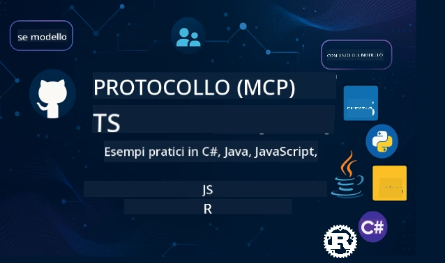

 

[](https://GitHub.com/microsoft/mcp-for-beginners/graphs/contributors)
[](https://GitHub.com/microsoft/mcp-for-beginners/issues)
[](https://GitHub.com/microsoft/mcp-for-beginners/pulls)
[](http://makeapullrequest.com)

[](https://GitHub.com/microsoft/mcp-for-beginners/watchers)
[](https://GitHub.com/microsoft/mcp-for-beginners/fork)
[](https://GitHub.com/microsoft/mcp-for-beginners/stargazers)


[](https://discord.gg/nTYy5BXMWG)

Segui questi passaggi per iniziare a usare queste risorse:
1. **Effettua il fork del repository**: Clicca su [](https://GitHub.com/microsoft/mcp-for-beginners/fork)
2. **Clona il repository**:   `git clone https://github.com/microsoft/mcp-for-beginners.git`
3. **Unisciti al** [](https://discord.gg/nTYy5BXMWG)


### 🌐 Supporto Multilingue

#### Supportato tramite GitHub Action (Automatizzato e Sempre Aggiornato)

<!-- CO-OP TRANSLATOR LANGUAGES TABLE START -->
[Arabic](../ar/README.md) | [Bengali](../bn/README.md) | [Bulgarian](../bg/README.md) | [Burmese (Myanmar)](../my/README.md) | [Chinese (Simplified)](../zh-CN/README.md) | [Chinese (Traditional, Hong Kong)](../zh-HK/README.md) | [Chinese (Traditional, Macau)](../zh-MO/README.md) | [Chinese (Traditional, Taiwan)](../zh-TW/README.md) | [Croatian](../hr/README.md) | [Czech](../cs/README.md) | [Danish](../da/README.md) | [Dutch](../nl/README.md) | [Estonian](../et/README.md) | [Finnish](../fi/README.md) | [French](../fr/README.md) | [German](../de/README.md) | [Greek](../el/README.md) | [Hebrew](../he/README.md) | [Hindi](../hi/README.md) | [Hungarian](../hu/README.md) | [Indonesian](../id/README.md) | [Italian](./README.md) | [Japanese](../ja/README.md) | [Kannada](../kn/README.md) | [Korean](../ko/README.md) | [Lithuanian](../lt/README.md) | [Malay](../ms/README.md) | [Malayalam](../ml/README.md) | [Marathi](../mr/README.md) | [Nepali](../ne/README.md) | [Nigerian Pidgin](../pcm/README.md) | [Norwegian](../no/README.md) | [Persian (Farsi)](../fa/README.md) | [Polish](../pl/README.md) | [Portuguese (Brazil)](../pt-BR/README.md) | [Portuguese (Portugal)](../pt-PT/README.md) | [Punjabi (Gurmukhi)](../pa/README.md) | [Romanian](../ro/README.md) | [Russian](../ru/README.md) | [Serbian (Cyrillic)](../sr/README.md) | [Slovak](../sk/README.md) | [Slovenian](../sl/README.md) | [Spanish](../es/README.md) | [Swahili](../sw/README.md) | [Swedish](../sv/README.md) | [Tagalog (Filipino)](../tl/README.md) | [Tamil](../ta/README.md) | [Telugu](../te/README.md) | [Thai](../th/README.md) | [Turkish](../tr/README.md) | [Ukrainian](../uk/README.md) | [Urdu](../ur/README.md) | [Vietnamese](../vi/README.md)

> **Preferisci clonare localmente?**
>
> Questo repository include oltre 50 traduzioni in lingua che aumentano significativamente la dimensione del download. Per clonare senza le traduzioni, usa lo sparse checkout:
>
> **Bash / macOS / Linux:**
> ```bash
> git clone --filter=blob:none --sparse https://github.com/microsoft/mcp-for-beginners.git
> cd mcp-for-beginners
> git sparse-checkout set --no-cone '/*' '!translations' '!translated_images'
> ```
>
> **CMD (Windows):**
> ```cmd
> git clone --filter=blob:none --sparse https://github.com/microsoft/mcp-for-beginners.git
> cd mcp-for-beginners
> git sparse-checkout set --no-cone "/*" "!translations" "!translated_images"
> ```
>
> Questo ti fornisce tutto il necessario per completare il corso con un download molto più veloce.
<!-- CO-OP TRANSLATOR LANGUAGES TABLE END -->

# 🚀 Curriculum del Model Context Protocol (MCP) per Principianti

## **Impara MCP con esempi pratici di codice in C#, Java, JavaScript, Rust, Python e TypeScript**

## 🧠 Panoramica del Curriculum del Model Context Protocol
Benvenuto nel tuo viaggio nel Model Context Protocol! Se ti sei mai chiesto come le applicazioni di intelligenza artificiale comunicano con diversi strumenti e servizi, stai per scoprire la soluzione elegante che sta trasformando il modo in cui gli sviluppatori costruiscono sistemi intelligenti.

Pensa a MCP come a un traduttore universale per le applicazioni AI - proprio come le porte USB ti permettono di connettere qualsiasi dispositivo al tuo computer, MCP consente ai modelli di AI di connettersi a qualsiasi strumento o servizio in modo standardizzato. Che tu stia costruendo il tuo primo chatbot o lavorando su flussi di lavoro AI complessi, capire MCP ti darà il potere di creare applicazioni più capaci e flessibili.

Questo curriculum è stato progettato con pazienza e cura per il tuo percorso di apprendimento. Inizieremo con concetti semplici che già conosci e costruiremo gradualmente la tua esperienza attraverso la pratica diretta nel tuo linguaggio di programmazione preferito. Ogni passo include spiegazioni chiare, esempi pratici e tanto incoraggiamento lungo il cammino.

Quando completerai questo percorso, avrai la fiducia per costruire i tuoi server MCP, integrarli con piattaforme AI popolari e comprendere come questa tecnologia stia rimodellando il futuro dello sviluppo AI. Iniziamo insieme questa entusiasmante avventura!

### Documentazione e Specifiche Ufficiali

Questo curriculum è allineato con la **Specificazione MCP 2025-11-25** (l'ultima release stabile). La specifica MCP usa una versione basata su data (formato YYYY-MM-DD) per garantire un tracciamento chiaro delle versioni del protocollo.

Queste risorse diventano più preziose man mano che la tua comprensione cresce, ma non sentirti obbligato a leggerle tutte immediatamente. Inizia dagli argomenti che ti interessano di più!
- 📘 [Documentazione MCP](https://modelcontextprotocol.io/) – Questa è la tua risorsa principale per tutorial passo dopo passo e guide per gli utenti. La documentazione è scritta pensando ai principianti, fornendo esempi chiari che puoi seguire al tuo ritmo.
- 📜 [Specificazione MCP](https://modelcontextprotocol.io/specification/2025-11-25) – Considerala come il tuo manuale di riferimento completo. Mentre segui il curriculum, tornerai qui per consultare dettagli specifici ed esplorare funzionalità avanzate.
- 📜 [Versionamento della Specifica MCP](https://modelcontextprotocol.io/specification/versioning) – Contiene informazioni sulla storia delle versioni del protocollo e su come MCP utilizzi il versionamento basato su data (formato YYYY-MM-DD).
- 🧑‍💻 [Repository GitHub MCP](https://github.com/modelcontextprotocol) – Qui troverai SDK, strumenti ed esempi di codice in più linguaggi di programmazione. È come un tesoro di esempi pratici e componenti pronti all’uso.
- 🌐 [Comunità MCP](https://github.com/orgs/modelcontextprotocol/discussions) – Unisciti a colleghi apprendisti e sviluppatori esperti nelle discussioni su MCP. È una comunità di supporto dove domande sono benvenute e la conoscenza viene condivisa liberamente.
  
## Obiettivi di Apprendimento

Al termine di questo curriculum, ti sentirai sicuro ed entusiasta delle tue nuove abilità. Ecco cosa raggiungerai:

• **Comprendere le basi di MCP**: Capirai cos'è il Model Context Protocol e perché sta rivoluzionando il modo in cui le applicazioni AI collaborano, usando analogie ed esempi chiari.

• **Costruire il tuo primo server MCP**: Creerai un server MCP funzionante nel linguaggio di programmazione che preferisci, iniziando con esempi semplici e facendo crescere le tue competenze passo dopo passo.

• **Collegare i modelli AI a strumenti reali**: Imparerai come colmare il divario tra modelli AI e servizi reali, dando alle tue applicazioni nuove capacità potenti.

• **Implementare le migliori pratiche di sicurezza**: Capirai come mantenere sicure le tue implementazioni MCP, proteggendo sia le applicazioni che gli utenti.

• **Distribuire con sicurezza**: Saprai come portare i tuoi progetti MCP dallo sviluppo alla produzione, con strategie pratiche che funzionano nel mondo reale.

• **Unirti alla comunità MCP**: Farai parte di una comunità in crescita di sviluppatori che stanno plasmando il futuro dello sviluppo di applicazioni AI. 

## Fondamenti Essenziali

Prima di immergerci nei dettagli specifici di MCP, assicuriamoci che tu abbia confidenza con alcuni concetti fondamentali. Non preoccuparti se non sei esperto in queste aree - spiegheremo tutto ciò che ti serve strada facendo!

### Comprendere i Protocolli (La Base)

Pensa a un protocollo come alle regole per una conversazione. Quando chiami un amico, sai entrambi di dire "ciao" all'inizio, di alternarti nel parlare e di dire "arrivederci" alla fine. I programmi per computer hanno bisogno di regole simili per comunicare efficacemente.

MCP è un protocollo - un insieme di regole concordate che aiutano i modelli AI e le applicazioni a "conversare" in modo produttivo con strumenti e servizi. Proprio come le regole rendono la comunicazione umana più fluida, avere MCP rende la comunicazione tra applicazioni AI molto più affidabile e potente.

### Relazioni Client-Server (Come Lavorano Insieme i Programmi)

Usi già ogni giorno relazioni client-server! Quando usi un browser web (il client) per visitare un sito, ti connetti a un server web che ti invia il contenuto della pagina. Il browser sa come chiedere informazioni, il server sa come rispondere.

In MCP, abbiamo una relazione simile: i modelli AI agiscono da client che richiedono informazioni o azioni, mentre i server MCP forniscono queste capacità. È come avere un assistente disponibile (il server) che l’AI può interrogare per eseguire compiti specifici.

### Perché la Standardizzazione è Importante (Far Funzionare Tutto Insieme)

Immagina se ogni casa automobilistica usasse pompe di benzina di forma diversa - avresti bisogno di un adattatore diverso per ogni macchina! La standardizzazione significa concordare su approcci comuni così che le cose funzionino insieme senza problemi.

MCP fornisce questa standardizzazione per le applicazioni AI. Invece che ogni modello AI abbia un codice personalizzato per lavorare con ogni strumento, MCP crea un modo universale per comunicare. Questo permette agli sviluppatori di creare strumenti una sola volta e farli funzionare con molti sistemi AI diversi.

## 🧭 Panoramica del Tuo Percorso di Apprendimento

Il tuo viaggio MCP è attentamente strutturato per costruire progressivamente la tua sicurezza e competenza. Ogni fase introduce nuovi concetti rinforzando ciò che hai già imparato.

### 🌱 Fase Fondamentale: Comprendere le Basi (Moduli 0-2)

Qui inizia la tua avventura! Ti presenteremo i concetti MCP usando analogie familiari ed esempi semplici. Capirai cos’è MCP, perché esiste e come si inserisce nel vasto mondo dello sviluppo AI.

• **Modulo 0 - Introduzione a MCP**: Inizieremo esplorando cos’è MCP e perché è così importante per le applicazioni AI moderne. Vedrai esempi reali di MCP in azione e capirai come risolve problemi comuni che gli sviluppatori affrontano.

• **Modulo 1 - Concetti Chiave Spiegati**: Qui imparerai i mattoni essenziali di MCP. Useremo molte analogie e esempi visivi per assicurarti che questi concetti siano naturali e facili da comprendere.

• **Modulo 2 - Sicurezza in MCP**: La sicurezza può sembrare intimidatoria, ma ti mostreremo come MCP include funzionalità di sicurezza integrate e ti insegneremo le migliori pratiche per proteggere le tue applicazioni fin dall’inizio.

### 🔨 Fase di Costruzione: Creare le Tue Prime Implementazioni (Modulo 3)

Ora inizia il vero divertimento! Avrai esperienza pratica nella costruzione di veri server e client MCP. Non preoccuparti - inizieremo con esempi semplici e ti guideremo in ogni passaggio.
Questo modulo include molteplici guide pratiche che ti permettono di esercitarti nel tuo linguaggio di programmazione preferito. Creerai il tuo primo server, costruirai un client per connetterti a esso e integrerai anche strumenti di sviluppo popolari come VS Code.

Ogni guida include esempi di codice completi, suggerimenti per la risoluzione dei problemi e spiegazioni sul motivo per cui facciamo specifiche scelte progettuali. Alla fine di questa fase, avrai implementazioni MCP funzionanti di cui potrai essere orgoglioso!

### 🚀 Fase di Crescita: Concetti Avanzati e Applicazione nel Mondo Reale (Moduli 4-5)

Con le basi padroneggiate, sei pronto a esplorare funzionalità MCP più sofisticate. Tratteremo strategie pratiche di implementazione, tecniche di debugging e argomenti avanzati come l'integrazione AI multimodale.

Imparerai anche come scalare le tue implementazioni MCP per l'uso in produzione e integrare con piattaforme cloud come Azure. Questi moduli ti preparano a costruire soluzioni MCP capaci di affrontare le esigenze del mondo reale.

### 🌟 Fase di Padronanza: Comunità e Specializzazione (Moduli 6-11)

La fase finale si concentra sull'ingresso nella comunità MCP e sulla specializzazione in aree di tuo maggiore interesse. Imparerai come contribuire a progetti MCP open source, implementare pattern avanzati di autenticazione e costruire soluzioni complete integrate con database.

Il modulo 11 merita una menzione speciale - è un percorso di apprendimento completo con 13 laboratori pratici che ti insegna a costruire server MCP pronti per la produzione con integrazione PostgreSQL. È come un progetto finale che riunisce tutto ciò che hai imparato!

### 📚 Struttura Completa del Curriculum

| Modulo | Argomento | Descrizione | Link |
|--------|-------|-------------|------|
| **Modulo 0-3: Fondamenti** | | | |
| 00 | Introduzione a MCP | Panoramica del Model Context Protocol e della sua importanza nelle pipeline AI | [Leggi di più](./00-Introduction/README.md) |
| 01 | Concetti Chiave Spiegati | Esplorazione approfondita dei concetti fondamentali di MCP | [Leggi di più](./01-CoreConcepts/README.md) |
| 02 | Sicurezza in MCP | Minacce di sicurezza e best practice | [Leggi di più](./02-Security/README.md) |
| 03 | Iniziare con MCP | Configurazione dell'ambiente, server/client base, integrazione | [Leggi di più](./03-GettingStarted/README.md) |
| **Modulo 3: Costruire il Primo Server & Client** | | | |
| 3.1 | Primo Server | Crea il tuo primo server MCP | [Guida](./03-GettingStarted/01-first-server/README.md) |
| 3.2 | Primo Client | Sviluppa un client MCP di base | [Guida](./03-GettingStarted/02-client/README.md) |
| 3.3 | Client con LLM | Integra modelli di linguaggio di grandi dimensioni | [Guida](./03-GettingStarted/03-llm-client/README.md) |
| 3.4 | Integrazione VS Code | Consuma server MCP in VS Code | [Guida](./03-GettingStarted/04-vscode/README.md) |
| 3.5 | Server stdio | Crea server usando il trasporto stdio | [Guida](./03-GettingStarted/05-stdio-server/README.md) |
| 3.6 | Streaming HTTP | Implementa streaming HTTP in MCP | [Guida](./03-GettingStarted/06-http-streaming/README.md) |
| 3.7 | AI Toolkit | Usa AI Toolkit con MCP | [Guida](./03-GettingStarted/07-aitk/README.md) |
| 3.8 | Testing | Testa la tua implementazione MCP | [Guida](./03-GettingStarted/08-testing/README.md) |
| 3.9 | Deployment | Distribuisci server MCP in produzione | [Guida](./03-GettingStarted/09-deployment/README.md) |
| 3.10 | Uso avanzato dei server | Usa server avanzati per caratteristiche avanzate e architettura migliorata | [Guida](./03-GettingStarted/10-advanced/README.md) |
| 3.11 | Autenticazione semplice | Un capitolo che ti mostra l'autenticazione sin dall'inizio e RBAC | [Guida](./03-GettingStarted/11-simple-auth/README.md) |
| 3.12 | Host MCP | Configura Claude Desktop, Cursor, Cline e altri host MCP | [Guida](./03-GettingStarted/12-mcp-hosts/README.md) |
| 3.13 | MCP Inspector | Debugga e testa server MCP con lo strumento Inspector | [Guida](./03-GettingStarted/13-mcp-inspector/README.md) |
| 3.14 | Sampling | Usa il campionamento per collaborare con il client | [Guida](./03-GettingStarted/14-sampling/README.md) |
| 3.15 | MCP Apps | Costruisci app MCP | [Guida](./03-GettingStarted/15-mcp-apps/README.md) |
| **Modulo 4-5: Pratico & Avanzato** | | | |
| 04 | Implementazione Pratica | SDK, debugging, testing, template riutilizzabili | [Leggi di più](./04-PracticalImplementation/README.md) |
| 4.1 | Paginazione | Gestisci grandi set di risultati con paginazione basata su cursore | [Guida](./04-PracticalImplementation/pagination/README.md) |
| 05 | Argomenti Avanzati in MCP | AI multimodale, scaling, uso enterprise | [Leggi di più](./05-AdvancedTopics/README.md) |
| 5.1 | Integrazione Azure | Integrazione MCP con Azure | [Guida](./05-AdvancedTopics/mcp-integration/README.md) |
| 5.2 | Multimodalità | Lavorare con più modalità | [Guida](./05-AdvancedTopics/mcp-multi-modality/README.md) |
| 5.3 | Demo OAuth2 | Implementa autenticazione OAuth2 | [Guida](./05-AdvancedTopics/mcp-oauth2-demo/README.md) |
| 5.4 | Root Contexts | Comprendi e implementa root contexts | [Guida](./05-AdvancedTopics/mcp-root-contexts/README.md) |
| 5.5 | Routing | Strategie di routing MCP | [Guida](./05-AdvancedTopics/mcp-routing/README.md) |
| 5.6 | Sampling | Tecniche di campionamento in MCP | [Guida](./05-AdvancedTopics/mcp-sampling/README.md) |
| 5.7 | Scalabilità | Scala le implementazioni MCP | [Guida](./05-AdvancedTopics/mcp-scaling/README.md) |
| 5.8 | Sicurezza | Considerazioni avanzate di sicurezza | [Guida](./05-AdvancedTopics/mcp-security/README.md) |
| 5.9 | Ricerca Web | Implementa funzionalità di ricerca web | [Guida](./05-AdvancedTopics/web-search-mcp/README.md) |
| 5.10 | Streaming Realtime | Costruisci funzionalità di streaming in tempo reale | [Guida](./05-AdvancedTopics/mcp-realtimestreaming/README.md) |
| 5.11 | Ricerca Realtime | Implementa ricerca in tempo reale | [Guida](./05-AdvancedTopics/mcp-realtimesearch/README.md) |
| 5.12 | Autenticazione Entra ID | Autenticazione con Microsoft Entra ID | [Guida](./05-AdvancedTopics/mcp-security-entra/README.md) |
| 5.13 | Integrazione Foundry | Integra con Azure AI Foundry | [Guida](./05-AdvancedTopics/mcp-foundry-agent-integration/README.md) |
| 5.14 | Ingegneria del Contesto | Tecniche per un'efficace ingegneria del contesto | [Guida](./05-AdvancedTopics/mcp-contextengineering/README.md) |
| 5.15 | Trasporto Personalizzato MCP | Implementazioni di trasporto personalizzate | [Guida](./05-AdvancedTopics/mcp-transport/README.md) |
| 5.16 | Caratteristiche del Protocollo | Notifiche di progresso, cancellazione, template di risorse | [Guida](./05-AdvancedTopics/mcp-protocol-features/README.md) |
| **Modulo 6-10: Comunità & Best Practice** | | | |
| 06 | Contributi della Comunità | Come contribuire all’ecosistema MCP | [Guida](./06-CommunityContributions/README.md) |
| 07 | Approfondimenti dalle Prime Adozioni | Storie di implementazione reali | [Guida](./07-LessonsfromEarlyAdoption/README.md) |
| 08 | Best Practice per MCP | Performance, tolleranza ai guasti, resilienza | [Guida](./08-BestPractices/README.md) |
| 09 | Studi di Caso MCP | Esempi pratici di implementazione | [Guida](./09-CaseStudy/README.md) |
| 10 | Workshop Pratico | Costruire un server MCP con AI Toolkit | [Lab](./10-StreamliningAIWorkflowsBuildingAnMCPServerWithAIToolkit/README.md) |
| **Modulo 11: Laboratorio Pratico Server MCP** | | | |
| 11 | Integrazione Database Server MCP | Percorso pratico completo di 13 laboratori per integrazione PostgreSQL | [Labs](./11-MCPServerHandsOnLabs/README.md) |
| 11.1 | Introduzione | Panoramica di MCP con integrazione database e caso d'uso retail analytics | [Lab 00](./11-MCPServerHandsOnLabs/00-Introduction/README.md) |
| 11.2 | Architettura Core | Comprensione dell'architettura server MCP, livelli database e pattern di sicurezza | [Lab 01](./11-MCPServerHandsOnLabs/01-Architecture/README.md) |
| 11.3 | Sicurezza & Multi-Tenancy | Sicurezza a livello di riga, autenticazione e accesso multi-tenant ai dati | [Lab 02](./11-MCPServerHandsOnLabs/02-Security/README.md) |
| 11.4 | Configurazione Ambiente | Configurazione ambiente di sviluppo, Docker, risorse Azure | [Lab 03](./11-MCPServerHandsOnLabs/03-Setup/README.md) |
| 11.5 | Progettazione Database | Setup PostgreSQL, progettazione schema retail e dati di esempio | [Lab 04](./11-MCPServerHandsOnLabs/04-Database/README.md) |
| 11.6 | Implementazione Server MCP | Costruzione del server FastMCP con integrazione database | [Lab 05](./11-MCPServerHandsOnLabs/05-MCP-Server/README.md) |
| 11.7 | Sviluppo Strumenti | Creazione di strumenti per query database e introspezione degli schemi | [Lab 06](./11-MCPServerHandsOnLabs/06-Tools/README.md) |
| 11.8 | Ricerca Semantica | Implementazione di vettori embedding con Azure OpenAI e pgvector | [Lab 07](./11-MCPServerHandsOnLabs/07-Semantic-Search/README.md) |
| 11.9 | Testing & Debugging | Strategie di testing, strumenti di debugging e approcci di validazione | [Lab 08](./11-MCPServerHandsOnLabs/08-Testing/README.md) |
| 11.10 | Integrazione VS Code | Configurazione integrazione MCP in VS Code e uso chatbot AI | [Lab 09](./11-MCPServerHandsOnLabs/09-VS-Code/README.md) |
| 11.11 | Strategie di Deployment | Deployment con Docker, Azure Container Apps e considerazioni di scaling | [Lab 10](./11-MCPServerHandsOnLabs/10-Deployment/README.md) |
| 11.12 | Monitoraggio | Application Insights, logging, monitoraggio performance | [Lab 11](./11-MCPServerHandsOnLabs/11-Monitoring/README.md) |
| 11.13 | Best Practice | Ottimizzazione performance, hardening sicurezza e consigli per la produzione | [Lab 12](./11-MCPServerHandsOnLabs/12-Best-Practices/README.md) |

### 💻 Progetti di Codice di Esempio

Una delle parti più entusiasmanti dell'apprendimento MCP è vedere le tue competenze di codifica svilupparsi progressivamente. Abbiamo progettato i nostri esempi di codice per iniziare in modo semplice e diventare più sofisticati man mano che la tua comprensione si approfondisce. Ecco come introduciamo i concetti - con codice facile da capire ma che dimostra principi reali MCP, capirai non solo cosa fa il codice, ma perché è strutturato in questo modo e come si inserisce in applicazioni MCP più ampie.

#### Esempi Base di Calcolatore MCP

| Linguaggio | Descrizione | Link |
|----------|-------------|------|
| C# | Esempio Server MCP | [Visualizza Codice](./03-GettingStarted/samples/csharp/README.md) |
| Java | Calcolatore MCP | [Visualizza Codice](./03-GettingStarted/samples/java/calculator/README.md) |
| JavaScript | Demo MCP | [Visualizza Codice](./03-GettingStarted/samples/javascript/README.md) |
| Python | Server MCP | [Visualizza Codice](../../03-GettingStarted/samples/python/mcp_calculator_server.py) |
| TypeScript | Esempio MCP | [Visualizza Codice](./03-GettingStarted/samples/typescript/README.md) |
| Rust | Esempio MCP | [Visualizza Codice](./03-GettingStarted/samples/rust/README.md) |

#### Implementazioni Avanzate MCP

| Linguaggio | Descrizione | Link |
|----------|-------------|------|
| C# | Esempio Avanzato | [Visualizza Codice](./04-PracticalImplementation/samples/csharp/README.md) |
| Java con Spring | Esempio Container App | [Visualizza Codice](./04-PracticalImplementation/samples/java/containerapp/README.md) |
| JavaScript | Esempio Avanzato | [Visualizza Codice](./04-PracticalImplementation/samples/javascript/README.md) |
| Python | Implementazione Complessa | [Visualizza Codice](./04-PracticalImplementation/samples/python/README.md) |
| TypeScript | Esempio Container | [Visualizza Codice](./04-PracticalImplementation/samples/typescript/README.md) |


## 🎯 Prerequisiti per Imparare MCP

Per ottenere il massimo da questo curriculum, dovresti avere:
- Conoscenze di base di programmazione in almeno uno dei seguenti linguaggi: C#, Java, JavaScript, Python o TypeScript
- Comprensione del modello client-server e delle API
- Familiarità con i concetti REST e HTTP
- (Opzionale) Background nei concetti di AI/ML

- Partecipare alle discussioni della nostra community per supporto

## 📚 Guida di Studio e Risorse

Questo repository include diverse risorse per aiutarti a navigare e apprendere in modo efficace:

### Guida di Studio

È disponibile una [Guida di Studio](./study_guide.md) completa per aiutarti a navigare efficacemente in questo repository. Questa mappa del curriculum visiva mostra come tutti gli argomenti sono collegati e fornisce indicazioni su come utilizzare efficacemente i progetti di esempio. È particolarmente utile se sei un apprendista visivo che preferisce vedere il quadro generale.

La guida include:
- Una mappa visiva del curriculum che mostra tutti gli argomenti trattati
- Una suddivisione dettagliata di ogni sezione del repository
- Indicazioni su come utilizzare i progetti di esempio
- Percorsi di apprendimento consigliati per diversi livelli di competenza
- Risorse aggiuntive per completare il tuo percorso di apprendimento

### Registro Modifiche

Manteniamo un dettagliato [Registro Modifiche](./changelog.md) che traccia tutti gli aggiornamenti significativi ai materiali del curriculum, così potrai rimanere aggiornato con le ultime migliorie e aggiunte.
- Nuovi contenuti aggiunti
- Cambiamenti strutturali
- Miglioramenti delle funzionalità
- Aggiornamenti della documentazione

## 🛠️ Come Usare Questo Curriculum in Modo Efficace

Ogni lezione in questa guida include:

1. Spiegazioni chiare dei concetti MCP  
2. Esempi di codice live in più linguaggi  
3. Esercizi per creare applicazioni MCP reali  
4. Risorse extra per apprendisti avanzati

### Impariamo MCP con C# - Serie Tutorial
Impariamo il Model Context Protocol (MCP), un framework all’avanguardia progettato per standardizzare le interazioni tra modelli AI e applicazioni client. Attraverso questa sessione adatta ai principianti, ti introdurremo a MCP e ti guideremo nella creazione del tuo primo server MCP.
#### C#: [https://aka.ms/letslearnmcp-csharp](https://aka.ms/letslearnmcp-csharp)
#### Java: [https://aka.ms/letslearnmcp-java](https://aka.ms/letslearnmcp-java)
#### JavaScript: [https://aka.ms/letslearnmcp-javascript](https://aka.ms/letslearnmcp-javascript)
#### Python: [https://aka.ms/letslearnmcp-python](https://aka.ms/letslearnmcp-python)

## 🎓 Il Tuo Viaggio MCP Inizia

Congratulazioni! Hai appena compiuto il primo passo in un entusiasmante viaggio che espanderà le tue capacità di programmazione e ti collegherà all’avanguardia dello sviluppo AI.

### Cosa Hai Già Raggiunto

Leggendo questa introduzione, hai già iniziato a costruire le tue basi di conoscenza MCP. Hai capito cos’è MCP, perché è importante e come questo curriculum sosterrà il tuo percorso di apprendimento. È un traguardo significativo e l’inizio della tua esperienza in questa importante tecnologia.

### L’Avventura che Ti Aspetta

Man mano che progredirai nei moduli, ricorda che ogni esperto è stato una volta un principiante. I concetti che ora possono sembrarti complessi diventeranno naturali mentre li pratichi e li applichi. Ogni piccolo passo costruisce capacità potenti che ti accompagneranno durante tutta la tua carriera di sviluppo.

### La Tua Rete di Supporto

Stai entrando a far parte di una comunità di apprendisti ed esperti appassionati di MCP e desiderosi di aiutare gli altri a riuscire. Che tu sia bloccato su una sfida di codifica o entusiasta di condividere una scoperta, la comunità è qui per supportarti nel tuo percorso.

Se rimani bloccato o hai domande sulla creazione di app AI, unisciti agli altri apprendisti e sviluppatori esperti nelle discussioni su MCP. È una comunità solidale dove le domande sono benvenute e la conoscenza viene condivisa liberamente.

[](https://discord.gg/nTYy5BXMWG)

Se hai feedback sul prodotto o incontri errori durante lo sviluppo visita:

[](https://aka.ms/foundry/forum)

### Pronto a Iniziare?

La tua avventura MCP inizia ora! Inizia dal Modulo 0 per immergerti nelle tue prime esperienze pratiche MCP, oppure esplora i progetti di esempio per vedere cosa costruirai. Ricorda - ogni esperto è partito esattamente da dove sei ora e con pazienza e pratica rimarrai stupito di ciò che puoi raggiungere.

Benvenuto nel mondo dello sviluppo Model Context Protocol. Costruiamo qualcosa di straordinario insieme!

## 🤝 Contribuire alla Comunità di Apprendimento

Questo curriculum si rafforza con contributi di apprendisti come te! Che tu stia correggendo un refuso, suggerendo una spiegazione più chiara o aggiungendo un nuovo esempio, i tuoi contributi aiutano altri principianti a riuscire.

Grazie al Microsoft Valued Professional [Shivam Goyal](https://www.linkedin.com/in/shivam2003/) per aver contribuito con esempi di codice.

Il processo di contributo è progettato per essere accogliente e di supporto. La maggior parte dei contributi richiede un Contributor License Agreement (CLA), ma gli strumenti automatizzati ti guideranno senza problemi.

## 📜 Apprendimento Open Source

Tutto questo curriculum è disponibile sotto la licenza MIT [LICENSE](../../LICENSE), il che significa che puoi usarlo, modificarlo e condividerlo liberamente. Questo supporta la nostra missione di rendere accessibili a tutti i sviluppatori le conoscenze MCP.
## 🤝 Linee Guida per i Contributi

Questo progetto accoglie contributi e suggerimenti. La maggior parte dei contributi richiede di accettare un
Contributor License Agreement (CLA) che dichiara che hai il diritto e concedi effettivamente a noi
i diritti per usare il tuo contributo. Per dettagli, visita <https://cla.opensource.microsoft.com>.

Quando invii una pull request, un bot CLA determinerà automaticamente se devi fornire
un CLA e decorerà la PR in modo appropriato (ad esempio, verifica stato, commento). Segui semplicemente le istruzioni
fornite dal bot. Dovrai farlo solo una volta per tutti i repository che usano il nostro CLA.

Questo progetto ha adottato il [Microsoft Open Source Code of Conduct](https://opensource.microsoft.com/codeofconduct/).
Per ulteriori informazioni consulta le [FAQ sul Codice di Condotta](https://opensource.microsoft.com/codeofconduct/faq/) o
contatta [opencode@microsoft.com](mailto:opencode@microsoft.com) per domande o commenti aggiuntivi.

---

*Pronto per iniziare il tuo percorso con MCP? Inizia con [Modulo 00 - Introduzione a MCP](./00-Introduction/README.md) e fai i tuoi primi passi nel mondo dello sviluppo Model Context Protocol!*


## 🎒 Altri Corsi
Il nostro team produce altri corsi! Dai un’occhiata:

<!-- CO-OP TRANSLATOR OTHER COURSES START -->
### LangChain
[](https://aka.ms/langchain4j-for-beginners)
[](https://aka.ms/langchainjs-for-beginners?WT.mc_id=m365-94501-dwahlin)
[](https://github.com/microsoft/langchain-for-beginners?WT.mc_id=m365-94501-dwahlin)
---

### Azure / Edge / MCP / Agents
[](https://github.com/microsoft/AZD-for-beginners?WT.mc_id=academic-105485-koreyst)
[](https://github.com/microsoft/edgeai-for-beginners?WT.mc_id=academic-105485-koreyst)
[](https://github.com/microsoft/mcp-for-beginners?WT.mc_id=academic-105485-koreyst)
[](https://github.com/microsoft/ai-agents-for-beginners?WT.mc_id=academic-105485-koreyst)

---
 
### Serie Generative AI
[](https://github.com/microsoft/generative-ai-for-beginners?WT.mc_id=academic-105485-koreyst)
[-9333EA?style=for-the-badge&labelColor=E5E7EB&color=9333EA)](https://github.com/microsoft/Generative-AI-for-beginners-dotnet?WT.mc_id=academic-105485-koreyst)
[-C084FC?style=for-the-badge&labelColor=E5E7EB&color=C084FC)](https://github.com/microsoft/generative-ai-for-beginners-java?WT.mc_id=academic-105485-koreyst)
[-E879F9?style=for-the-badge&labelColor=E5E7EB&color=E879F9)](https://github.com/microsoft/generative-ai-with-javascript?WT.mc_id=academic-105485-koreyst)

---
 
### Apprendimento Base
[](https://aka.ms/ml-beginners?WT.mc_id=academic-105485-koreyst)
[](https://aka.ms/datascience-beginners?WT.mc_id=academic-105485-koreyst)
[](https://aka.ms/ai-beginners?WT.mc_id=academic-105485-koreyst)
[](https://github.com/microsoft/Security-101?WT.mc_id=academic-96948-sayoung)
[](https://aka.ms/webdev-beginners?WT.mc_id=academic-105485-koreyst)
[](https://aka.ms/iot-beginners?WT.mc_id=academic-105485-koreyst)
[](https://github.com/microsoft/xr-development-for-beginners?WT.mc_id=academic-105485-koreyst)

---
 
### Serie Copilot
[](https://aka.ms/GitHubCopilotAI?WT.mc_id=academic-105485-koreyst)
[](https://github.com/microsoft/mastering-github-copilot-for-dotnet-csharp-developers?WT.mc_id=academic-105485-koreyst)
[](https://github.com/microsoft/CopilotAdventures?WT.mc_id=academic-105485-koreyst)
<!-- CO-OP TRANSLATOR OTHER COURSES END -->

---

<!-- CO-OP TRANSLATOR DISCLAIMER START -->
**Disclaimer**:  
Questo documento è stato tradotto utilizzando il servizio di traduzione automatica [Co-op Translator](https://github.com/Azure/co-op-translator). Nonostante ci impegniamo per garantire la precisione, si prega di notare che le traduzioni automatizzate possono contenere errori o imprecisioni. Il documento originale nella sua lingua nativa deve essere considerato la fonte autorevole. Per informazioni critiche si raccomanda una traduzione professionale effettuata da un traduttore umano. Non ci assumiamo alcuna responsabilità per eventuali malintesi o interpretazioni errate derivanti dall’uso di questa traduzione.
<!-- CO-OP TRANSLATOR DISCLAIMER END -->