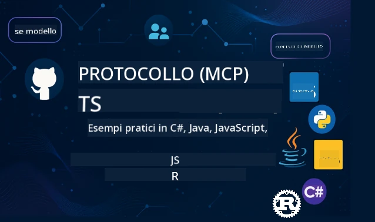

 

[](https://GitHub.com/microsoft/mcp-for-beginners/graphs/contributors)
[](https://GitHub.com/microsoft/mcp-for-beginners/issues)
[](https://GitHub.com/microsoft/mcp-for-beginners/pulls)
[](http://makeapullrequest.com)
[](https://mcptoplist.com/server/mcp.so%2Fmcp-for-beginners%2Fmicrosoft)

[](https://GitHub.com/microsoft/mcp-for-beginners/watchers)
[](https://GitHub.com/microsoft/mcp-for-beginners/fork)
[](https://GitHub.com/microsoft/mcp-for-beginners/stargazers)


[](https://discord.gg/nTYy5BXMWG)

Segui questi passaggi per iniziare a usare queste risorse:
1. **Fork del Repository**: Clicca [](https://GitHub.com/microsoft/mcp-for-beginners/fork)
2. **Clona il Repository**:   `git clone https://github.com/microsoft/mcp-for-beginners.git`
3. **Unisciti al** [](https://discord.gg/nTYy5BXMWG)


### 🌐 Supporto Multilingue

#### Supportato tramite GitHub Action (Automatizzato e Sempre Aggiornato)

<!-- CO-OP TRANSLATOR LANGUAGES TABLE START -->
[Arabo](../ar/README.md) | [Bengalese](../bn/README.md) | [Bulgaro](../bg/README.md) | [Birmano (Myanmar)](../my/README.md) | [Cinese (Semplificato)](../zh-CN/README.md) | [Cinese (Tradizionale, Hong Kong)](../zh-HK/README.md) | [Cinese (Tradizionale, Macao)](../zh-MO/README.md) | [Cinese (Tradizionale, Taiwan)](../zh-TW/README.md) | [Croato](../hr/README.md) | [Ceco](../cs/README.md) | [Danese](../da/README.md) | [Olandese](../nl/README.md) | [Estone](../et/README.md) | [Finlandese](../fi/README.md) | [Francese](../fr/README.md) | [Tedesco](../de/README.md) | [Greco](../el/README.md) | [Ebraico](../he/README.md) | [Hindi](../hi/README.md) | [Ungherese](../hu/README.md) | [Indonesiano](../id/README.md) | [Italiano](./README.md) | [Giapponese](../ja/README.md) | [Kannada](../kn/README.md) | [Khmer](../km/README.md) | [Coreano](../ko/README.md) | [Lituano](../lt/README.md) | [Malese](../ms/README.md) | [Malayalam](../ml/README.md) | [Marathi](../mr/README.md) | [Nepalese](../ne/README.md) | [Pidgin Nigeriano](../pcm/README.md) | [Norvegese](../no/README.md) | [Persiano (Farsi)](../fa/README.md) | [Polacco](../pl/README.md) | [Portoghese (Brasile)](../pt-BR/README.md) | [Portoghese (Portogallo)](../pt-PT/README.md) | [Punjabi (Gurmukhi)](../pa/README.md) | [Rumeno](../ro/README.md) | [Russo](../ru/README.md) | [Serbo (Cirillico)](../sr/README.md) | [Slovacco](../sk/README.md) | [Sloveno](../sl/README.md) | [Spagnolo](../es/README.md) | [Swahili](../sw/README.md) | [Svedese](../sv/README.md) | [Tagalog (Filippino)](../tl/README.md) | [Tamil](../ta/README.md) | [Telugu](../te/README.md) | [Thailandese](../th/README.md) | [Turco](../tr/README.md) | [Ucraino](../uk/README.md) | [Urdu](../ur/README.md) | [Vietnamita](../vi/README.md)

> **Preferisci Clonare Localmente?**
>
> Questo repository include più di 50 traduzioni linguistiche, che aumentano significativamente la dimensione del download. Per clonare senza traduzioni, usa il sparse checkout:
>
> **Bash / macOS / Linux:**
> ```bash
> git clone --filter=blob:none --sparse https://github.com/microsoft/mcp-for-beginners.git
> cd mcp-for-beginners
> git sparse-checkout set --no-cone '/*' '!translations' '!translated_images'
> ```
>
> **CMD (Windows):**
> ```cmd
> git clone --filter=blob:none --sparse https://github.com/microsoft/mcp-for-beginners.git
> cd mcp-for-beginners
> git sparse-checkout set --no-cone "/*" "!translations" "!translated_images"
> ```
>
> Questo ti fornisce tutto il necessario per completare il corso con un download molto più veloce.
<!-- CO-OP TRANSLATOR LANGUAGES TABLE END -->

# 🚀 Curriculum Model Context Protocol (MCP) per Principianti

## **Impara MCP con Esempi Pratici di Codice in C#, Java, JavaScript, Rust, Python e TypeScript**

## 🧠 Panoramica del Curriculum Model Context Protocol
Benvenuto nel tuo viaggio nel Model Context Protocol! Se ti sei mai chiesto come le applicazioni AI comunichino con diversi strumenti e servizi, stai per scoprire la soluzione elegante che sta trasformando il modo in cui gli sviluppatori costruiscono sistemi intelligenti.

Pensa a MCP come a un traduttore universale per applicazioni AI - proprio come le porte USB ti permettono di collegare qualsiasi dispositivo al tuo computer, MCP consente ai modelli AI di connettersi a qualsiasi strumento o servizio in modo standardizzato. Che tu stia costruendo il tuo primo chatbot o lavorando su flussi di lavoro AI complessi, capire MCP ti darà il potere di creare applicazioni più capaci e flessibili.

Questo curriculum è progettato con pazienza e cura per il tuo percorso di apprendimento. Inizieremo con concetti semplici che già conosci e aumenteremo gradualmente la tua competenza attraverso pratica diretta nel tuo linguaggio di programmazione preferito. Ogni passo include spiegazioni chiare, esempi pratici e tanto incoraggiamento lungo il cammino.

Al termine di questo percorso, avrai la fiducia per costruire i tuoi server MCP, integrarli con piattaforme AI popolari e comprendere come questa tecnologia stia rimodellando il futuro dello sviluppo AI. Iniziamo insieme questa emozionante avventura!

### Documentazione Ufficiale e Specifiche

Questo curriculum è allineato con **Specifiche MCP 2025-11-25** (l'ultima release stabile). La specifica MCP usa versionamento basato sulla data (formato YYYY-MM-DD) per garantire un chiaro tracciamento delle versioni del protocollo.

> **Guardando avanti:** è previsto il rilascio di un candidato alla release per la prossima versione della specifica, **2026-07-28**, programmato per il 28 luglio 2026. Questo rende il protocollo senza stato a livello di trasporto, formalizza un framework di Estensioni (App MCP, Task), rafforza l'autorizzazione e depreca Roots, Sampling e Logging. Vedi [Cosa Cambia in MCP: Il Candidato alla Release 2026-07-28](./01-CoreConcepts/mcp-2026-07-28-release-candidate.md) per una spiegazione completa.

Queste risorse diventano più preziose man mano che cresce la tua comprensione, ma non sentirti obbligato a leggere tutto immediatamente. Inizia dalle aree che ti interessano di più!
- 📘 [Documentazione MCP](https://modelcontextprotocol.io/) – Questa è la tua risorsa principale per tutorial passo passo e guide utente. La documentazione è scritta pensando ai principianti, fornendo esempi chiari che puoi seguire al tuo ritmo.
- 📜 [Specifiche MCP](https://modelcontextprotocol.io/specification/2025-11-25) – Consideralo come il tuo manuale di riferimento completo. Mano a mano che procedi con il curriculum, ti ritroverai a consultare qui dettagli specifici ed esplorare funzionalità avanzate.
- 📜 [Versionamento Specifiche MCP](https://modelcontextprotocol.io/specification/versioning) – Contiene informazioni sulla storia del versionamento del protocollo e su come MCP usa il versionamento basato sulla data (formato YYYY-MM-DD).
- 🧑‍💻 [Repository GitHub MCP](https://github.com/modelcontextprotocol) – Qui trovi SDK, strumenti ed esempi di codice in molteplici linguaggi di programmazione. È come un forziere di esempi pratici e componenti pronti all'uso.
- 🌐 [Comunità MCP](https://github.com/orgs/modelcontextprotocol/discussions) – Unisciti ad altri studenti e sviluppatori esperti nelle discussioni su MCP. È una comunità di supporto dove le domande sono benvenute e la conoscenza viene condivisa liberamente.
  
## Obiettivi di Apprendimento

Al termine di questo curriculum, ti sentirai sicuro ed entusiasta delle tue nuove capacità. Ecco cosa otterrai:

• **Comprendere le basi di MCP**: Capirai cos'è il Model Context Protocol e perché sta rivoluzionando il modo in cui le applicazioni AI collaborano, usando analogie ed esempi che hanno senso.

• **Costruire il tuo primo server MCP**: Creerai un server MCP funzionante nel tuo linguaggio di programmazione preferito, partendo da esempi semplici e sviluppando le tue abilità passo dopo passo.

• **Collegare modelli AI a strumenti reali**: Imparerai come colmare il divario tra modelli AI e servizi reali, offrendo alle tue applicazioni nuove potenti capacità.

• **Implementare le migliori pratiche di sicurezza**: Capirai come mantenere sicure le tue implementazioni MCP, proteggendo sia le applicazioni sia gli utenti.

• **Distribuire con fiducia**: Saprai come portare i tuoi progetti MCP dallo sviluppo alla produzione, con strategie pratiche di deployment che funzionano nel mondo reale.

• **Entrare nella comunità MCP**: Diventerai parte di una comunità in crescita di sviluppatori che stanno plasmando il futuro dello sviluppo di applicazioni AI.

## Background Essenziale

Prima di immergerci nei dettagli di MCP, assicuriamoci che ti senta a tuo agio con alcuni concetti fondamentali. Non preoccuparti se non sei un esperto in questi ambiti - spiegheremo tutto quello che ti serve man mano che andiamo avanti!

### Comprendere i Protocolli (La Base)

Pensa a un protocollo come alle regole di una conversazione. Quando chiami un amico, entrambi sapete di dire "ciao" alla risposta, di parlare a turno e di dire "arrivederci" alla fine. I programmi per computer hanno bisogno di regole simili per comunicare efficacemente.

MCP è un protocollo - un insieme di regole concordate che aiutano i modelli AI e le applicazioni ad avere "conversazioni" produttive con strumenti e servizi. Proprio come avere regole per la conversazione rende la comunicazione umana più fluida, avere MCP rende la comunicazione tra applicazioni AI molto più affidabile e potente.

### Relazioni Client-Server (Come i Programmi Collaborano)

Usi già quotidianamente le relazioni client-server! Quando usi un browser web (il client) per visitare un sito, ti connetti a un server web che ti invia il contenuto della pagina. Il browser sa come richiedere informazioni e il server sa come rispondere.

In MCP, abbiamo una relazione simile: i modelli AI agiscono come client che richiedono informazioni o azioni, mentre i server MCP forniscono tali capacità. È come avere un assistente utile (il server) a cui l'AI può chiedere di svolgere compiti specifici.

### Perché la Standardizzazione è Importante (Far Collaborare le Cose)

Immagina se ogni produttore di automobili usasse pompe di benzina di forma diversa - ti servirebbe un adattatore diverso per ogni auto! La standardizzazione significa accordarsi su approcci comuni affinché le cose funzionino insieme senza problemi.

MCP fornisce questa standardizzazione per le applicazioni AI. Invece che ogni modello AI necessiti di codice personalizzato per lavorare con ogni strumento, MCP crea un modo universale per comunicare. Questo significa che gli sviluppatori possono costruire strumenti una volta sola e farli funzionare con molti sistemi AI diversi.

## 🧭 Panoramica del Tuo Percorso di Apprendimento

Il tuo viaggio MCP è strutturato con cura per costruire progressivamente la tua fiducia e le tue capacità. Ogni fase introduce nuovi concetti mentre rafforza ciò che hai già imparato.

### 🌱 Fase Fondamentale: Comprendere le Basi (Moduli 0-2)

Qui inizia la tua avventura! Ti introdurremo ai concetti MCP usando analogie familiari ed esempi semplici. Capirai cos'è MCP, perché esiste e come si inserisce nel più ampio mondo dello sviluppo AI.


• **Modulo 0 - Introduzione a MCP**: Inizieremo esplorando cos'è MCP e perché è così importante per le applicazioni AI moderne. Vedrai esempi reali di MCP in azione e capirai come risolve problemi comuni che gli sviluppatori affrontano.

• **Modulo 1 - Concetti Fondamentali Spiegati**: Qui imparerai i mattoni essenziali di MCP. Useremo molte analogie ed esempi visivi per assicurarci che questi concetti risultino naturali e comprensibili.

• **Modulo 2 - Sicurezza in MCP**: La sicurezza potrebbe sembrare intimidatoria, ma ti mostreremo come MCP include funzionalità di sicurezza integrate e ti insegneremo le migliori pratiche per proteggere le tue applicazioni sin dall'inizio.

### 🔨 Fase di Costruzione: Creare le Tue Prime Implementazioni (Modulo 3)

Ora inizia il vero divertimento! Avrai esperienza pratica costruendo veri server e client MCP. Non preoccuparti - inizieremo con semplicità e ti guideremo in ogni passaggio.

Questo modulo include molte guide pratiche che ti permettono di esercitarti nel linguaggio di programmazione che preferisci. Creerai il tuo primo server, costruirai un client per collegarti, e integrerai persino con strumenti di sviluppo popolari come VS Code.

Ogni guida include esempi di codice completi, consigli per il troubleshooting, e spiegazioni sul perché adottiamo specifiche scelte progettuali. Alla fine di questa fase, avrai implementazioni MCP funzionanti di cui andare fiero!

### 🚀 Fase di Crescita: Concetti Avanzati e Applicazione nel Mondo Reale (Moduli 4-5)

Con le basi consolidate, sei pronto a esplorare funzionalità MCP più sofisticate. Copriremo strategie di implementazione pratica, tecniche di debugging e argomenti avanzati come l'integrazione AI multi-modale.

Imparerai anche come scalare le tue implementazioni MCP per l’uso in produzione e integrarle con piattaforme cloud come Azure. Questi moduli ti preparano a costruire soluzioni MCP capaci di gestire le richieste del mondo reale.

### 🌟 Fase di Perfezionamento: Comunità e Specializzazione (Moduli 6-11)

L'ultima fase si concentra sull'ingresso nella comunità MCP e sulla specializzazione negli ambiti che più ti interessano. Imparerai come contribuire a progetti open-source MCP, implementare modelli avanzati di autenticazione e costruire soluzioni integrate con database complete.

Il modulo 11 merita una menzione speciale - è un completo percorso pratico di 13 laboratori che ti insegna a costruire server MCP pronti per la produzione con integrazione PostgreSQL. È come un progetto finale che mette insieme tutto quello che hai imparato!

### 📚 Struttura Completa del Curriculum

| Modulo | Argomento | Descrizione | Link |
|--------|-------|-------------|------|
| **Modulo 0-3: Fondamenti** | | | |
| 00 | Introduzione a MCP | Panoramica del Model Context Protocol e della sua importanza nelle pipeline AI | [Read more](./00-Introduction/README.md) |
| 01 | Concetti Fondamentali Spiegati | Esplorazione approfondita dei concetti chiave di MCP | [Read more](./01-CoreConcepts/README.md) |
| 1.1 | Cosa Cambia in MCP (2026-07-28 RC) | Protocollo senza stato, framework delle estensioni e deprecazioni delle funzionalità nella prossima versione della specifica | [Guide](./01-CoreConcepts/mcp-2026-07-28-release-candidate.md) |
| 02 | Sicurezza in MCP | Minacce alla sicurezza e migliori pratiche | [Read more](./02-Security/README.md) |
| 03 | Iniziare con MCP | Configurazioni ambiente, server/client base, integrazione | [Read more](./03-GettingStarted/README.md) |
| **Modulo 3: Costruisci il Tuo Primo Server e Client** | | | |
| 3.1 | Primo Server | Crea il tuo primo server MCP | [Guide](./03-GettingStarted/01-first-server/README.md) |
| 3.2 | Primo Client | Sviluppa un client MCP base | [Guide](./03-GettingStarted/02-client/README.md) |
| 3.3 | Client con LLM | Integra modelli linguistici di grandi dimensioni | [Guide](./03-GettingStarted/03-llm-client/README.md) |
| 3.4 | Integrazione VS Code | Consuma server MCP in VS Code | [Guide](./03-GettingStarted/04-vscode/README.md) |
| 3.5 | Server stdio | Crea server usando il trasporto stdio | [Guide](./03-GettingStarted/05-stdio-server/README.md) |
| 3.6 | Streaming HTTP | Implementa lo streaming HTTP in MCP | [Guide](./03-GettingStarted/06-http-streaming/README.md) |
| 3.7 | Microsoft Foundry Toolkit | Usa Microsoft Foundry Toolkit con MCP | [Guide](./03-GettingStarted/07-aitk/README.md) |
| 3.8 | Testing | Testa la tua implementazione server MCP | [Guide](./03-GettingStarted/08-testing/README.md) |
| 3.9 | Deployment | Distribuisci server MCP in produzione | [Guide](./03-GettingStarted/09-deployment/README.md) |
| 3.10 | Uso avanzato server | Usa server avanzati per funzionalità avanzate e architettura migliorata | [Guide](./03-GettingStarted/10-advanced/README.md) |
| 3.11 | Autenticazione semplice | Un capitolo che mostra l'autenticazione dall'inizio e RBAC | [Guide](./03-GettingStarted/11-simple-auth/README.md) |
| 3.12 | Host MCP | Configura Claude Desktop, Cursor, Cline e altri host MCP | [Guide](./03-GettingStarted/12-mcp-hosts/README.md) |
| 3.13 | MCP Inspector | Debug e test dei server MCP con lo strumento Inspector | [Guide](./03-GettingStarted/13-mcp-inspector/README.md) |
| 3.14 | Campionamento | Usa il campionamento per collaborare con il client | [Guide](./03-GettingStarted/14-sampling/README.md) |
| 3.15 | App MCP | Costruisci App MCP | [Guide](./03-GettingStarted/15-mcp-apps/README.md) |
| **Modulo 4-5: Pratico & Avanzato** | | | |
| 04 | Implementazione Pratica | SDK, debugging, testing, template di prompt riutilizzabili | [Read more](./04-PracticalImplementation/README.md) |
| 4.1 | Paginazione | Gestisci grandi set di risultati con paginazione basata su cursore | [Guide](./04-PracticalImplementation/pagination/README.md) |
| 05 | Argomenti Avanzati in MCP | AI multi-modale, scalabilità, uso enterprise | [Read more](./05-AdvancedTopics/README.md) |
| 5.1 | Integrazione Azure | Integrazione MCP con Azure | [Guide](./05-AdvancedTopics/mcp-integration/README.md) |
| 5.2 | Multi-modalità | Lavorare con più modalità | [Guide](./05-AdvancedTopics/mcp-multi-modality/README.md) |
| 5.3 | Demo OAuth2 | Implementa l'autenticazione OAuth2 | [Guide](./05-AdvancedTopics/mcp-oauth2-demo/README.md) |
| 5.4 | Contesti Radice | Comprendere e implementare contesti radice | [Guide](./05-AdvancedTopics/mcp-root-contexts/README.md) |
| 5.5 | Routing | Strategie di routing MCP | [Guide](./05-AdvancedTopics/mcp-routing/README.md) |
| 5.6 | Campionamento | Tecniche di campionamento in MCP | [Guide](./05-AdvancedTopics/mcp-sampling/README.md) |
| 5.7 | Scalabilità | Scala implementazioni MCP | [Guide](./05-AdvancedTopics/mcp-scaling/README.md) |
| 5.8 | Sicurezza | Considerazioni avanzate sulla sicurezza | [Guide](./05-AdvancedTopics/mcp-security/README.md) |
| 5.9 | Ricerca Web | Implementa capacità di ricerca web | [Guide](./05-AdvancedTopics/web-search-mcp/README.md) |
| 5.10 | Streaming in tempo reale | Costruisci funzionalità di streaming in tempo reale | [Guide](./05-AdvancedTopics/mcp-realtimestreaming/README.md) |
| 5.11 | Ricerca in tempo reale | Implementa ricerca in tempo reale | [Guide](./05-AdvancedTopics/mcp-realtimesearch/README.md) |
| 5.12 | Autenticazione Entra ID | Autenticazione con Microsoft Entra ID | [Guide](./05-AdvancedTopics/mcp-security-entra/README.md) |
| 5.13 | Integrazione Foundry | Integra con Microsoft Foundry | [Guide](./05-AdvancedTopics/mcp-foundry-agent-integration/README.md) |
| 5.14 | Ingegneria del Contesto | Tecniche per una efficace ingegneria del contesto | [Guide](./05-AdvancedTopics/mcp-contextengineering/README.md) |
| 5.15 | Trasporto Personalizzato MCP | Implementazioni di trasporti personalizzati | [Guide](./05-AdvancedTopics/mcp-transport/README.md) |
| 5.16 | Funzionalità del Protocollo | Notifiche di avanzamento, cancellazione, template di risorse | [Guide](./05-AdvancedTopics/mcp-protocol-features/README.md) |
| 5.17 | Ragionamento Multi-Agente Conflittuale | Due agenti discutono lati opposti usando strumenti MCP condivisi, valutati da un agente giudice | [Guide](./05-AdvancedTopics/mcp-adversarial-agents/README.md) |
| **Modulo 6-10: Comunità & Migliori Pratiche** | | | |
| 06 | Contributi della Comunità | Come contribuire all'ecosistema MCP | [Guide](./06-CommunityContributions/README.md) |
| 07 | Approfondimenti dall'Adozione Precoce | Storie di implementazione nel mondo reale | [Guide](./07-LessonsfromEarlyAdoption/README.md) |
| 08 | Migliori Pratiche per MCP | Performance, tolleranza ai guasti, resilienza | [Guide](./08-BestPractices/README.md) |
| 09 | Casi di Studio MCP | Esempi pratici di implementazione | [Guide](./09-CaseStudy/README.md) |
| 10 | Workshop Pratico | Costruire un Server MCP con Microsoft Foundry Toolkit | [Lab](./10-StreamliningAIWorkflowsBuildingAnMCPServerWithAIToolkit/README.md) |
| **Modulo 11: Laboratorio Pratico Server MCP** | | | |
| 11 | Integrazione Database Server MCP | Percorso pratico completo di 13 laboratori per integrazione PostgreSQL | [Labs](./11-MCPServerHandsOnLabs/README.md) |
| 11.1 | Introduzione | Panoramica di MCP con integrazione database e caso d'uso retail analytics | [Lab 00](./11-MCPServerHandsOnLabs/00-Introduction/README.md) |
| 11.2 | Architettura Core | Comprendere architettura server MCP, livelli di database e modelli di sicurezza | [Lab 01](./11-MCPServerHandsOnLabs/01-Architecture/README.md) |
| 11.3 | Sicurezza & Multi-tenancy | Sicurezza a livello di riga, autenticazione e accesso multi-tenant ai dati | [Lab 02](./11-MCPServerHandsOnLabs/02-Security/README.md) |
| 11.4 | Configurazione Ambiente | Configurazione ambiente di sviluppo, Docker, risorse Azure | [Lab 03](./11-MCPServerHandsOnLabs/03-Setup/README.md) |
| 11.5 | Design Database | Configurazione PostgreSQL, schema retail e dati di esempio | [Lab 04](./11-MCPServerHandsOnLabs/04-Database/README.md) |
| 11.6 | Implementazione Server MCP | Costruire il server FastMCP con integrazione database | [Lab 05](./11-MCPServerHandsOnLabs/05-MCP-Server/README.md) |
| 11.7 | Sviluppo Tool | Creazione di strumenti per query database e introspezione dello schema | [Lab 06](./11-MCPServerHandsOnLabs/06-Tools/README.md) |
| 11.8 | Ricerca Semantica | Implementazione di embedding vettoriali con Azure OpenAI e pgvector | [Lab 07](./11-MCPServerHandsOnLabs/07-Semantic-Search/README.md) |
| 11.9 | Testing & Debugging | Strategie di testing, strumenti di debug e approcci di validazione | [Lab 08](./11-MCPServerHandsOnLabs/08-Testing/README.md) |
| 11.10 | Integrazione VS Code | Configurazione integrazione MCP VS Code e uso AI Chat | [Lab 09](./11-MCPServerHandsOnLabs/09-VS-Code/README.md) |
| 11.11 | Strategie di Deployment | Distribuzione Docker, Azure Container Apps e considerazioni sulla scalabilità | [Lab 10](./11-MCPServerHandsOnLabs/10-Deployment/README.md) |
| 11.12 | Monitoraggio | Application Insights, logging, monitoraggio delle performance | [Lab 11](./11-MCPServerHandsOnLabs/11-Monitoring/README.md) |
| 11.13 | Migliori Pratiche | Ottimizzazione delle performance, rafforzamento sicurezza e consigli per produzione | [Lab 12](./11-MCPServerHandsOnLabs/12-Best-Practices/README.md) |
| **Modulo 12: Tooling MCP** | | | |
| 12.1 | Tooling | Uso MCP nell'App Copilot | [ Guide ](./12-tooling/README.md) |

### 💻 Progetti di Codice di Esempio

Una delle parti più entusiasmanti dell'apprendimento di MCP è vedere le tue abilità di codifica svilupparsi progressivamente. Abbiamo progettato i nostri esempi di codice per partire da semplici e diventare sempre più sofisticati man mano che la tua comprensione si approfondisce. Ecco come introduciamo i concetti - con codice facile da capire ma che dimostra veri principi MCP, capirai non solo cosa fa quel codice, ma perché è strutturato in quel modo e come si inserisce in applicazioni MCP più ampie.

#### Esempi Base di Calcolatore MCP

| Linguaggio | Descrizione | Link |
|----------|-------------|------|

| C# | Esempio Server MCP | [Visualizza Codice](./03-GettingStarted/samples/csharp/README.md) |
| Java | Calcolatrice MCP | [Visualizza Codice](./03-GettingStarted/samples/java/calculator/README.md) |
| JavaScript | Demo MCP | [Visualizza Codice](./03-GettingStarted/samples/javascript/README.md) |
| Python | Server MCP | [Visualizza Codice](../../03-GettingStarted/samples/python/mcp_calculator_server.py) |
| TypeScript | Esempio MCP | [Visualizza Codice](./03-GettingStarted/samples/typescript/README.md) |
| Rust | Esempio MCP | [Visualizza Codice](./03-GettingStarted/samples/rust/README.md) |

#### Implementazioni Avanzate MCP

| Linguaggio | Descrizione | Link |
|----------|-------------|------|
| C# | Esempio Avanzato | [Visualizza Codice](./04-PracticalImplementation/samples/csharp/README.md) |
| Java con Spring | Esempio App Container | [Visualizza Codice](./04-PracticalImplementation/samples/java/containerapp/README.md) |
| JavaScript | Esempio Avanzato | [Visualizza Codice](./04-PracticalImplementation/samples/javascript/README.md) |
| Python | Implementazione Complessa | [Visualizza Codice](./04-PracticalImplementation/samples/python/README.md) |
| TypeScript | Esempio Container | [Visualizza Codice](./04-PracticalImplementation/samples/typescript/README.md) |


## 🎯 Prerequisiti per Imparare MCP

Per ottenere il massimo da questo curriculum, dovresti avere:

- Conoscenze base di programmazione in almeno uno dei seguenti linguaggi: C#, Java, JavaScript, Python o TypeScript
- Comprensione del modello client-server e delle API
- Familiarità con i concetti di REST e HTTP
- (Opzionale) Background nei concetti di AI/ML

- Partecipazione alle discussioni della nostra comunità per supporto

## 📚 Guida di Studio & Risorse

Questo repository include diverse risorse per aiutarti a navigare e apprendere efficacemente:

### Guida di Studio

È disponibile una esaustiva [Guida di Studio](./study_guide.md) per aiutarti a navigare efficacemente questo repository. Questa mappa visiva del curriculum mostra come tutti gli argomenti sono collegati e fornisce indicazioni su come usare efficacemente i progetti di esempio. È particolarmente utile se sei un apprendente visivo che vuole vedere il quadro generale.

La guida include:
- Una mappa visiva del curriculum che mostra tutti gli argomenti trattati
- Suddivisione dettagliata di ogni sezione del repository
- Indicazioni su come usare i progetti di esempio
- Percorsi di apprendimento consigliati per diversi livelli di competenza
- Risorse aggiuntive per completare il tuo percorso di apprendimento

### Registro delle Modifiche

Manteniamo un dettagliato [Registro delle Modifiche](./changelog.md) che traccia tutti gli aggiornamenti significativi al materiale del curriculum, così puoi restare aggiornato con le ultime migliorie e aggiunte.
- Nuovi contenuti aggiunti
- Modifiche strutturali
- Miglioramenti alle funzionalità
- Aggiornamenti alla documentazione

## 🛠️ Come Usare Questo Curriculum in Modo Efficace

Ogni lezione in questa guida include:

1. Spiegazioni chiare dei concetti MCP  
2. Esempi di codice live in più linguaggi  
3. Esercizi per costruire vere applicazioni MCP  
4. Risorse extra per studenti avanzati

### Impariamo MCP con C# - Serie Tutorial
Impariamo il Model Context Protocol (MCP), un framework all'avanguardia progettato per standardizzare le interazioni tra modelli di AI e applicazioni client. Attraverso questa sessione adatta ai principianti, introdurremo MCP e ti guideremo nella creazione del tuo primo server MCP.
#### C#: [https://aka.ms/letslearnmcp-csharp](https://aka.ms/letslearnmcp-csharp)
#### Java: [https://aka.ms/letslearnmcp-java](https://aka.ms/letslearnmcp-java)
#### JavaScript: [https://aka.ms/letslearnmcp-javascript](https://aka.ms/letslearnmcp-javascript)
#### Python: [https://aka.ms/letslearnmcp-python](https://aka.ms/letslearnmcp-python)

## 🎓 Il Tuo Viaggio MCP Inizia

Congratulazioni! Hai appena compiuto il primo passo in un viaggio entusiasmante che espanderà le tue capacità di programmazione e ti collegherà al meglio dello sviluppo AI.

### Cosa Hai Già Realizzato

Leggendo questa introduzione, hai già iniziato a costruire le basi della tua conoscenza MCP. Ora sai cos'è MCP, perché è importante, e come questo curriculum supporterà il tuo percorso di apprendimento. È un risultato significativo e l'inizio della tua competenza in questa tecnologia fondamentale.

### L’Avventura che Ti Attende

Avanzando attraverso i moduli, ricorda che ogni esperto è stato una volta un principiante. I concetti che ora possono sembrare complessi diventeranno naturali man mano che li praticherai e applicherai. Ogni piccolo passo costruisce potenti capacità che ti serviranno durante tutta la tua carriera di sviluppatore.

### La Tua Rete di Supporto

Stai entrando a far parte di una comunità di studenti ed esperti appassionati di MCP e desiderosi di aiutare gli altri a riuscire. Che tu sia bloccato su una sfida di coding o entusiasta di condividere una scoperta, la comunità è qui per supportare il tuo percorso.

Se rimani bloccato o hai domande sulla costruzione di app AI. Unisciti ad altri studenti e sviluppatori esperti nelle discussioni su MCP. È una comunità di supporto dove le domande sono benvenute e la conoscenza viene condivisa liberamente.

[](https://discord.gg/nTYy5BXMWG)

Se hai feedback sul prodotto o riscontri errori durante lo sviluppo visita:

[](https://aka.ms/foundry/forum)

### Pronto a Iniziare?

La tua avventura MCP inizia ora! Inizia con il Modulo 0 per immergerti nelle tue prime esperienze pratiche MCP, oppure esplora i progetti di esempio per vedere cosa costruirai. Ricorda - ogni esperto è partito esattamente da dove sei ora, e con pazienza e pratica, rimarrai stupito da ciò che potrai realizzare.

Benvenuto nel mondo dello sviluppo Model Context Protocol. Costruiamo qualcosa di straordinario insieme!

## 🤝 Contribuire alla Comunità di Apprendimento

Questo curriculum si rafforza con i contributi di studenti come te! Che tu stia correggendo un refuso, suggerendo una spiegazione più chiara o aggiungendo un nuovo esempio, i tuoi contributi aiutano altri principianti ad avere successo.

Grazie al Microsoft Valued Professional [Shivam Goyal](https://www.linkedin.com/in/shivam2003/) per aver contribuito con esempi di codice.

Il processo di contributo è progettato per essere accogliente e di supporto. La maggior parte dei contributi richiede un Contributor License Agreement (CLA), ma gli strumenti automatizzati ti guideranno nel processo senza problemi.

## 📜 Apprendimento Open Source

L'intero curriculum è disponibile sotto la licenza MIT [LICENSE](../../LICENSE), il che significa che puoi usarlo, modificarlo e condividerlo liberamente. Questo supporta la nostra missione di rendere la conoscenza MCP accessibile agli sviluppatori di tutto il mondo.
## 🤝 Linee Guida per il Contributo

Questo progetto accoglie contributi e suggerimenti. La maggior parte dei contributi richiede che tu accetti un
Contributor License Agreement (CLA) che dichiara che hai il diritto, e effettivamente concedi,
i diritti di usare il tuo contributo. Per dettagli, visita <https://cla.opensource.microsoft.com>.

Quando invii una pull request, un bot CLA determinerà automaticamente se devi fornire
un CLA e decorerà il PR di conseguenza (es. controllo stato, commento). Segui semplicemente le istruzioni
fornite dal bot. Dovrai farlo solo una volta per tutti i repository che utilizzano la nostra CLA.

Questo progetto ha adottato il [Microsoft Open Source Code of Conduct](https://opensource.microsoft.com/codeofconduct/).
Per maggiori informazioni consulta il [Code of Conduct FAQ](https://opensource.microsoft.com/codeofconduct/faq/) o
contatta [opencode@microsoft.com](mailto:opencode@microsoft.com) per domande o commenti aggiuntivi.

---

*Pronto a iniziare il tuo viaggio MCP? Comincia con [Modulo 00 - Introduzione a MCP](./00-Introduction/README.md) e fai i tuoi primi passi nel mondo dello sviluppo Model Context Protocol!*


## 🎒 Altri Corsi
Il nostro team produce altri corsi! Dai un’occhiata a:

<!-- CO-OP TRANSLATOR OTHER COURSES START -->
### LangChain
[](https://aka.ms/langchain4j-for-beginners)
[](https://aka.ms/langchainjs-for-beginners?WT.mc_id=m365-94501-dwahlin)
[](https://github.com/microsoft/langchain-for-beginners?WT.mc_id=m365-94501-dwahlin)
---

### Azure / Edge / MCP / Agenti
[](https://github.com/microsoft/AZD-for-beginners?WT.mc_id=academic-105485-koreyst)
[](https://github.com/microsoft/edgeai-for-beginners?WT.mc_id=academic-105485-koreyst)
[](https://github.com/microsoft/mcp-for-beginners?WT.mc_id=academic-105485-koreyst)
[](https://github.com/microsoft/ai-agents-for-beginners?WT.mc_id=academic-105485-koreyst)

---
 
### Serie AI Generativa
[](https://github.com/microsoft/generative-ai-for-beginners?WT.mc_id=academic-105485-koreyst)
[-9333EA?style=for-the-badge&labelColor=E5E7EB&color=9333EA)](https://github.com/microsoft/Generative-AI-for-beginners-dotnet?WT.mc_id=academic-105485-koreyst)
[-C084FC?style=for-the-badge&labelColor=E5E7EB&color=C084FC)](https://github.com/microsoft/generative-ai-for-beginners-java?WT.mc_id=academic-105485-koreyst)
[-E879F9?style=for-the-badge&labelColor=E5E7EB&color=E879F9)](https://github.com/microsoft/generative-ai-with-javascript?WT.mc_id=academic-105485-koreyst)

---
 
### Apprendimento Base
[](https://aka.ms/ml-beginners?WT.mc_id=academic-105485-koreyst)
[](https://aka.ms/datascience-beginners?WT.mc_id=academic-105485-koreyst)
[](https://aka.ms/ai-beginners?WT.mc_id=academic-105485-koreyst)

[](https://github.com/microsoft/Security-101?WT.mc_id=academic-96948-sayoung)
[](https://aka.ms/webdev-beginners?WT.mc_id=academic-105485-koreyst)
[](https://aka.ms/iot-beginners?WT.mc_id=academic-105485-koreyst)
[](https://github.com/microsoft/xr-development-for-beginners?WT.mc_id=academic-105485-koreyst)

---
 
### Serie Copilot
[](https://aka.ms/GitHubCopilotAI?WT.mc_id=academic-105485-koreyst)
[](https://github.com/microsoft/mastering-github-copilot-for-dotnet-csharp-developers?WT.mc_id=academic-105485-koreyst)
[](https://github.com/microsoft/CopilotAdventures?WT.mc_id=academic-105485-koreyst)
<!-- CO-OP TRANSLATOR OTHER COURSES END -->

---

<!-- CO-OP TRANSLATOR DISCLAIMER START -->
**Disclaimer**:
Questo documento è stato tradotto utilizzando il servizio di traduzione AI [Co-op Translator](https://github.com/Azure/co-op-translator). Sebbene ci impegniamo per garantire la precisione, si prega di notare che le traduzioni automatizzate possono contenere errori o imprecisioni. Il documento originale nella sua lingua nativa deve essere considerato la fonte autorevole. Per informazioni critiche, si raccomanda una traduzione professionale effettuata da un essere umano. Non siamo responsabili per eventuali malintesi o interpretazioni errate derivanti dall’uso di questa traduzione.
<!-- CO-OP TRANSLATOR DISCLAIMER END -->