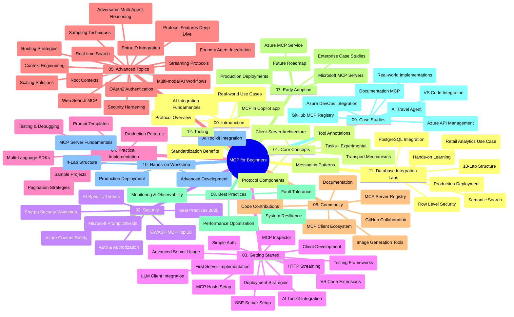

# Protocollo Model Context (MCP) per Principianti - Guida di Studio

Questa guida di studio fornisce una panoramica della struttura del repository e del contenuto per il curriculum "Protocollo Model Context (MCP) per Principianti". Usa questa guida per navigare nel repository in modo efficiente e sfruttare al meglio le risorse disponibili.

## Panoramica del Repository

Il Protocollo Model Context (MCP) è un framework standardizzato per le interazioni tra modelli AI e applicazioni client. Inizialmente creato da Anthropic, MCP è ora mantenuto dalla più ampia comunità MCP tramite l'organizzazione ufficiale GitHub. Questo repository offre un curriculum completo con esempi pratici di codice in C#, Java, JavaScript, Python e TypeScript, progettato per sviluppatori AI, architetti di sistema e ingegneri software.

## Mappa Visiva del Curriculum

## Struttura del Repository

Il repository è organizzato in dodici sezioni principali, ciascuna focalizzata su diversi aspetti di MCP:

1. **Introduzione (00-Introduction/)**
   - Panoramica del Protocollo Model Context
   - Perché la standardizzazione è importante nelle pipeline AI
   - Casi d’uso pratici e benefici

2. **Concetti Base (01-CoreConcepts/)**
   - Architettura client-server
   - Componenti chiave del protocollo
   - Pattern di messaggistica in MCP
   - Specifica corrente: [What's Changed in MCP: The 2026-07-28 Specification](./01-CoreConcepts/mcp-2026-07-28.md) — il core del protocollo senza stato, framework delle Estensioni, e deprecazioni di Roots/Sampling/Logging

3. **Sicurezza (02-Security/)**
   - Minacce alla sicurezza nei sistemi basati su MCP
   - Best practice per la sicurezza delle implementazioni
   - Strategie di autenticazione e autorizzazione
   - Esempio pratico [CIMD e DCR autorizzazione](./02-Security/samples/cimd-dcr-auth/README.md)
   - **Documentazione Completa sulla Sicurezza**:
     - Best Practice di Sicurezza MCP
     - Guida di Implementazione Azure Content Safety
     - Controlli e Tecniche di Sicurezza MCP
     - Riferimento Rapido Best Practices MCP
   - **Temi Chiave di Sicurezza**:
     - Attacchi di prompt injection e avvelenamento strumenti
     - Hijacking di sessione e problemi di confusione deputato
     - Vulnerabilità di token passthrough
     - Permessi e controlli accesso eccessivi
     - Sicurezza della supply chain per componenti AI
     - Integrazione Microsoft Prompt Shields

4. **Primi Passi (03-GettingStarted/)**
   - Configurazione e setup dell'ambiente
   - Creazione di server e client MCP di base
   - Integrazione con applicazioni esistenti
   - Include sezioni per:
     - Prima implementazione server
     - Sviluppo client
     - Integrazione client LLM
     - Integrazione VS Code
     - Server Server-Sent Events (SSE)
     - Uso avanzato del server
     - Streaming HTTP
     - Integrazione AI Toolkit
     - Strategie di testing
     - Linee guida per il deployment

5. **Implementazione Pratica (04-PracticalImplementation/)**
   - Uso di SDK in diversi linguaggi di programmazione
   - Tecniche di debugging, testing e validazione
   - Creazione di template prompt e workflow riutilizzabili
   - Progetti di esempio con esempi di implementazione

6. **Argomenti Avanzati (05-AdvancedTopics/)**
   - Tecniche di ingegneria del contesto
   - Integrazione agent Foundry
   - Workflow AI multimodali
   - Demo di autenticazione OAuth2
   - Capacità di ricerca in tempo reale
   - Streaming in tempo reale
   - Implementazione di Root contexts
   - Strategie di routing
   - Tecniche di campionamento
   - Approcci alla scalabilità
   - Considerazioni di sicurezza
   - Integrazione sicurezza Entra ID
   - Integrazione ricerca web
   - Ragionamento multi-agente avversariale (pattern di dibattito)

7. **Contributi della Comunità (06-CommunityContributions/)**
   - Come contribuire con codice e documentazione
   - Collaborare tramite GitHub
   - Miglioramenti e feedback guidati dalla comunità
   - Uso di vari client MCP (Claude Desktop, Cline, VSCode)
   - Collaborazione con server MCP popolari inclusa generazione immagini

8. **Lezioni dall’Adozione Precoce (07-LessonsfromEarlyAdoption/)**
   - Implementazioni reali e storie di successo
   - Costruzione e deployment di soluzioni basate su MCP
   - Tendenze e roadmap futura
   - **Guida ai Server MCP Microsoft**: Guida completa a 10 server MCP Microsoft pronti per la produzione tra cui:
     - Microsoft Learn Docs MCP Server
     - Azure MCP Server (15+ connettori specializzati)
     - GitHub MCP Server
     - Azure DevOps MCP Server
     - MarkItDown MCP Server
     - SQL Server MCP Server
     - Playwright MCP Server
     - Dev Box MCP Server
     - Microsoft Foundry MCP Server
     - Microsoft 365 Agents Toolkit MCP Server

9. **Best Practices (08-BestPractices/)**
   - Ottimizzazione e tuning delle prestazioni
   - Progettazione di sistemi MCP fault-tolerant
   - Strategie di testing e resilienza

10. **Studi di Caso (09-CaseStudy/)**
    - **Sette studi di caso completi** che dimostrano la versatilità di MCP in scenari diversi:
    - **Azure AI Travel Agents**: Orchestrazione multi-agente con Azure OpenAI e AI Search
    - **Integrazione Azure DevOps**: Automazione processi workflow con aggiornamenti dati YouTube
    - **Recupero Documentazione in Tempo Reale**: Client console Python con streaming HTTP
    - **Generatore Piano di Studio Interattivo**: App web Chainlit con AI conversazionale
    - **Documentazione In-Editor**: Integrazione VS Code con workflow GitHub Copilot
    - **Azure API Management**: Integrazione API enterprise con creazione server MCP
    - **Registro MCP GitHub**: Sviluppo ecosistema e piattaforma integrazione agentica
    - Esempi di implementazione che coprono integrazione enterprise, produttività sviluppatori e sviluppo ecosistema

11. **Workshop Pratico (10-StreamliningAIWorkflowsBuildingAnMCPServerWithAIToolkit/)**
    - Workshop pratico completo che combina MCP con AI Toolkit
    - Costruzione di applicazioni intelligenti che collegano modelli AI con strumenti reali
    - Moduli pratici che coprono fondamentali, sviluppo server custom, e strategie di deployment in produzione
    - **Struttura del Lab**:
      - Lab 1: Fondamenti del Server MCP
      - Lab 2: Sviluppo Avanzato Server MCP
      - Lab 3: Integrazione AI Toolkit
      - Lab 4: Deployment in Produzione e Scalabilità
    - Approccio didattico basato su lab con istruzioni passo passo

12. **Lab di Integrazione Database per Server MCP (11-MCPServerHandsOnLabs/)**
    - **Percorso di apprendimento completo di 13 lab** per costruire server MCP pronti per la produzione con integrazione PostgreSQL
    - **Implementazione reale di analytics retail** usando il caso d’uso Zava Retail
    - **Pattern enterprise-grade** inclusi Row Level Security (RLS), ricerca semantica e accesso multi-tenant ai dati
    - **Struttura Completa del Lab**:
      - **Lab 00-03: Fondamenti** - Introduzione, Architettura, Sicurezza, Setup Ambiente
      - **Lab 04-06: Costruzione del Server MCP** - Design Database, Implementazione Server MCP, Sviluppo Strumenti
      - **Lab 07-09: Funzionalità Avanzate** - Ricerca Semantica, Testing & Debugging, Integrazione VS Code
      - **Lab 10-12: Produzione & Best Practice** - Deployment, Monitoraggio, Ottimizzazione
    - **Tecnologie Coperti**: framework FastMCP, PostgreSQL, Azure OpenAI, Azure Container Apps, Application Insights
    - **Risultati di Apprendimento**: server MCP pronti per la produzione, pattern di integrazione database, analytics potenziati da AI, sicurezza enterprise

13. **Tooling (12-tooling/)**
    - Imparare a usare MCP nell’app Copilot e altri strumenti

## Risorse Aggiuntive

Il repository include risorse di supporto:

- **Cartella Immagini**: Contiene diagrammi e illustrazioni usate in tutto il curriculum
- **Traduzioni**: Supporto multilingue con traduzioni automatiche della documentazione
- **Risorse Ufficiali MCP**:
  - [Documentazione MCP](https://modelcontextprotocol.io/)
  - [Specifiche MCP](https://modelcontextprotocol.io/specification/2026-07-28/)
  - [Repository MCP GitHub](https://github.com/modelcontextprotocol)

## Come Usare Questo Repository

1. **Apprendimento Sequenziale**: Segui i capitoli in ordine (da 00 a 11) per un'esperienza di apprendimento strutturata.
2. **Focalizzazione sul Linguaggio**: Se sei interessato a un linguaggio di programmazione specifico, esplora le directory dei campioni per implementazioni nel linguaggio preferito.
3. **Implementazione Pratica**: Inizia con la sezione "Primi Passi" per configurare l’ambiente e creare il tuo primo server e client MCP.
4. **Esplorazione Avanzata**: Una volta acquisita familiarità con le basi, approfondisci gli argomenti avanzati per ampliare le tue conoscenze.
5. **Coinvolgimento nella Comunità**: Unisciti alla comunità MCP tramite le discussioni GitHub e i canali Discord per connetterti con esperti e sviluppatori.

## Client e Strumenti MCP

Il curriculum copre vari client e strumenti MCP:

1. **Client Ufficiali**:
   - Visual Studio Code
   - MCP in Visual Studio Code
   - Claude Desktop
   - Claude in VSCode
   - Claude API

2. **Client della Comunità**:
   - Cline (basato su terminale)
   - Cursor (editor di codice)
   - ChatMCP
   - Windsurf

3. **Strumenti di Gestione MCP**:
   - MCP CLI
   - MCP Manager
   - MCP Linker
   - MCP Router

## Server MCP Popolari

Il repository presenta vari server MCP, tra cui:

1. **Server MCP Ufficiali Microsoft**:
   - Microsoft Learn Docs MCP Server
   - Azure MCP Server (15+ connettori specializzati)
   - GitHub MCP Server
   - Azure DevOps MCP Server
   - MarkItDown MCP Server
   - SQL Server MCP Server
   - Playwright MCP Server
   - Dev Box MCP Server
   - Microsoft Foundry MCP Server
   - Microsoft 365 Agents Toolkit MCP Server

2. **Server di Riferimento Ufficiali**:
   - Filesystem
   - Fetch
   - Memory
   - Sequential Thinking

3. **Generazione Immagini**:
   - Azure OpenAI DALL-E 3
   - Stable Diffusion WebUI
   - Replicate

4. **Strumenti di Sviluppo**:
   - Git MCP
   - Terminal Control
   - Code Assistant

5. **Server Specializzati**:
   - Salesforce
   - Microsoft Teams
   - Jira & Confluence

## Contribuire

Questo repository accoglie contributi dalla comunità. Consulta la sezione Contributi della Comunità per indicazioni su come contribuire efficacemente all'ecosistema MCP.

----

*Questa guida di studio è stata aggiornata l'ultima volta il 9 settembre 2026. Riflette la
Specifica MCP `2026-07-28`, la revisione corrente del protocollo. Alcuni esempi pratici
rimangono esplicitamente versionati a `2025-11-25` mentre i loro SDK e strumenti adottano
le API del protocollo senza stato.*

---

<!-- CO-OP TRANSLATOR DISCLAIMER START -->
**Disclaimer**:
Questo documento è stato tradotto utilizzando il servizio di traduzione AI [Co-op Translator](https://github.com/Azure/co-op-translator). Sebbene ci impegniamo per garantire la precisione, si prega di notare che le traduzioni automatizzate possono contenere errori o imprecisioni. Il documento originale nella sua lingua nativa deve essere considerato la fonte autorevole. Per informazioni critiche, si raccomanda una traduzione professionale effettuata da un essere umano. Non siamo responsabili per eventuali malintesi o interpretazioni errate derivanti dall’uso di questa traduzione.
<!-- CO-OP TRANSLATOR DISCLAIMER END -->