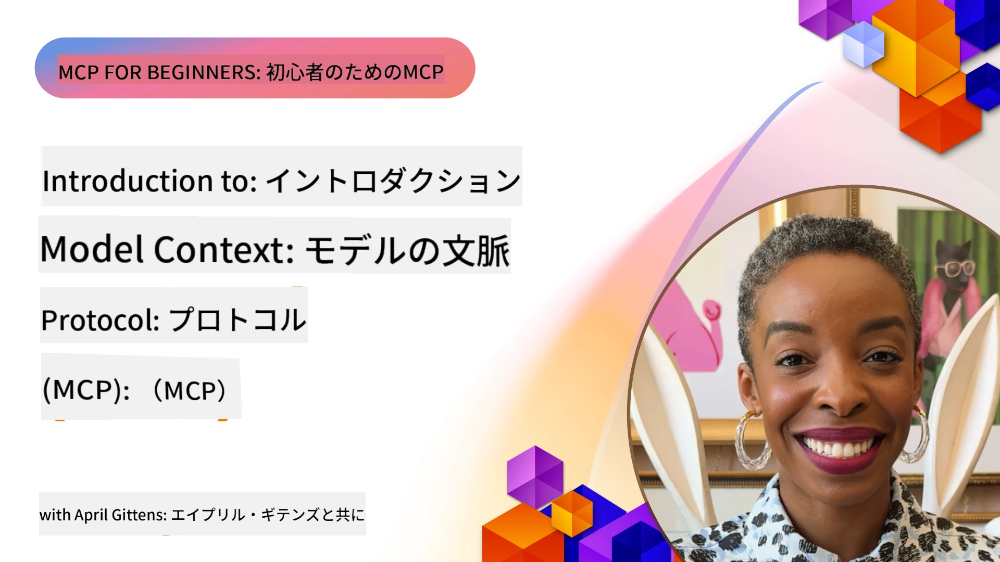
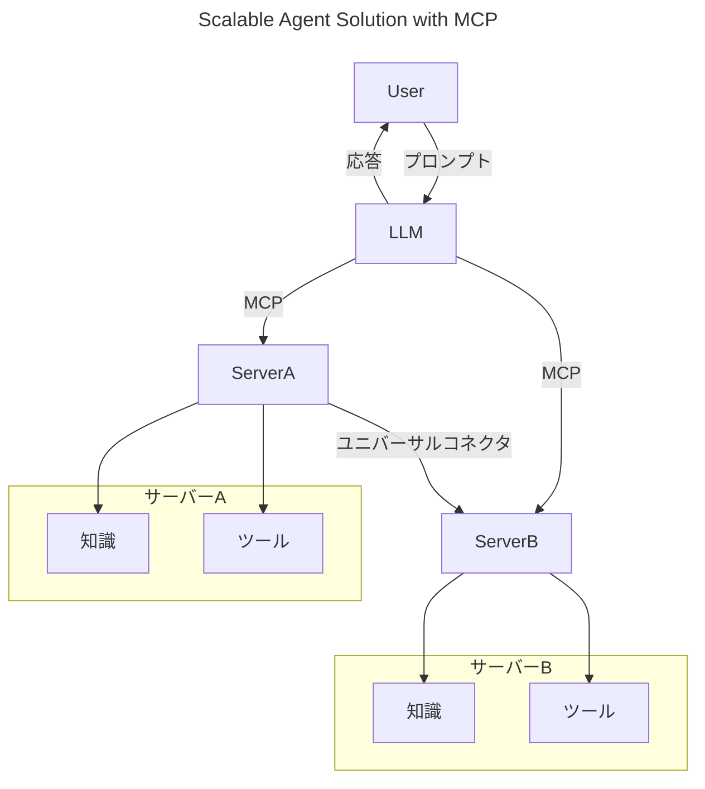
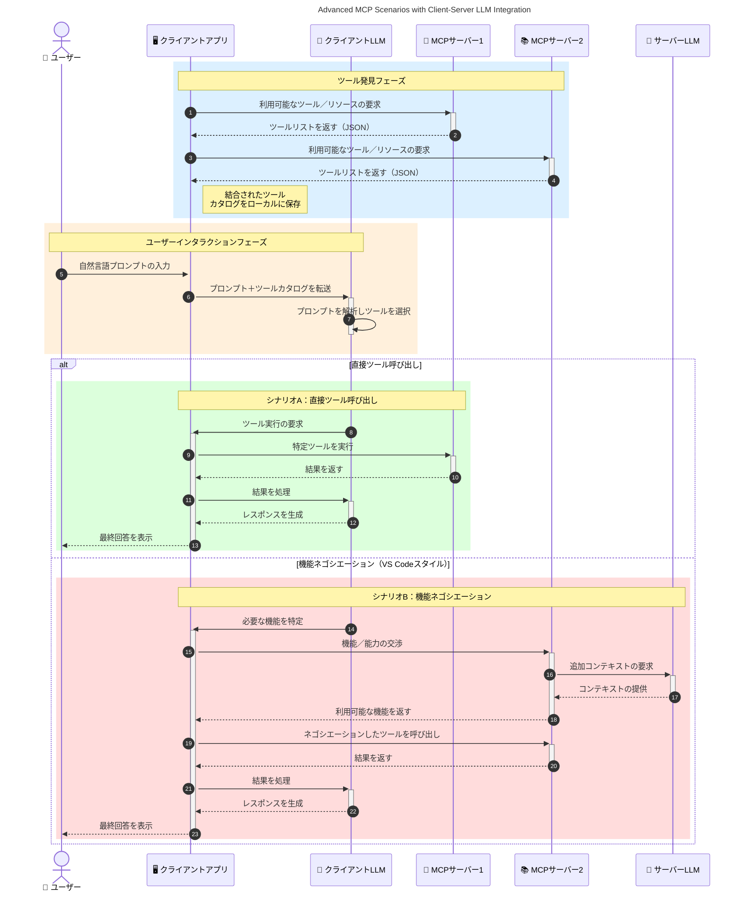

# モデルコンテキストプロトコル（MCP）入門：スケーラブルなAIアプリケーションにおける重要性

[](https://youtu.be/agBbdiOPLQA)

_(上の画像をクリックすると、このレッスンのビデオが表示されます)_

生成AIアプリケーションは、自然言語プロンプトを使ってユーザーがアプリと対話できるため、大きな進歩です。しかし、このようなアプリにより多くの時間やリソースが投入されると、機能やリソースを簡単に統合しやすく、複数のモデルを扱え、さまざまなモデルの複雑さに対応できるようにしたいと考えます。つまり、Gen AIアプリの構築は最初は簡単ですが、規模が拡大して複雑になるにつれて、アーキテクチャを定義し始め、アプリが一貫した方法で構築されることを保証するために標準に依存する必要があります。ここでMCPが登場し、物事を整理し標準を提供します。

---

## **🔍 モデルコンテキストプロトコル（MCP）とは？**

**モデルコンテキストプロトコル（MCP）** は、外部ツール、API、およびデータソースと大規模言語モデル（LLM）がシームレスに連携するための <strong>オープンで標準化されたインターフェース</strong> です。トレーニングデータを超えたAIモデルの機能を強化し、賢くスケーラブルで応答性の高いAIシステムを可能にする一貫したアーキテクチャを提供します。

---

## **🎯 AIにおける標準化の重要性**

生成AIアプリケーションがより複雑になるにつれて、<strong>拡張性、拡張可能性、保守性</strong>を確保し、<strong>ベンダーロックインを回避</strong>するための標準を採用することが不可欠です。MCPは以下を実現します：

- モデルとツールの統合を統一
- もろく壊れやすい一時的なカスタムソリューションの削減
- 複数ベンダーのモデルが1つのエコシステム内で共存可能に

**注意：** MCPはオープン標準を自称していますが、IEEE、IETF、W3C、ISOなどの既存の標準団体での標準化予定はありません。

---

## **📚 学習目標**

本記事の終わりには、以下ができるようになります：

- **モデルコンテキストプロトコル（MCP）** とそのユースケースを定義する
- MCPがモデルとツールの通信をどのように標準化するか理解する
- MCPアーキテクチャの主要コンポーネントを特定する
- MCPの実際の企業および開発現場での応用を探る

---

## **💡 モデルコンテキストプロトコル（MCP）がゲームチェンジャーである理由**

### **🔗 MCPはAI相互作用の断片化問題を解決**

MCP以前は、モデルとツールの連携に以下が必要でした：

- ツールとモデルごとのカスタムコード
- ベンダーごとの非標準API
- 更新による頻繁な断絶
- ツールが増えるとスケールしにくい

### **✅ MCP標準化の利点**

| <strong>利点</strong>                  | <strong>説明</strong>                                                                       |
|--------------------------|--------------------------------------------------------------------------------|
| 相互運用性               | LLMが異なるベンダーのツールとシームレスに動作                              |
| 一貫性                   | プラットフォームとツール間の均一な動作                                       |
| 再利用性                 | 一度構築されたツールを複数のプロジェクトやシステムで使用可能                 |
| 開発加速                 | 標準化されたプラグ・アンド・プレイのインターフェースにより開発時間を短縮     |

---

## **🧱 MCPアーキテクチャ概要（ハイレベル）**

MCPは <strong>クライアント・サーバーモデル</strong> に従い、以下の構造を持ちます：

- **MCPホスト** がAIモデルを運用
- **MCPクライアント** がリクエストを開始
- **MCPサーバー** がコンテキスト、ツール、機能を提供

### **主要コンポーネント：**

- <strong>リソース</strong> – モデル向けの静的または動的データ  
- <strong>プロンプト</strong> – ガイド付き生成のための事前定義ワークフロー  
- <strong>ツール</strong> – 検索や計算などの実行可能な関数  
- <strong>サンプリング</strong> – 再帰的な相互作用によるエージェント的行動（
    MCP `2026-07-28` で非推奨; 新規実装は直接LLMプロバイダーと統合推奨）

- <strong>呼び出し</strong> – サーバー発起のユーザー入力要求
- <strong>ルート</strong> – サーバーに関連する情報ファイルシステム位置（
    MCP `2026-07-28` で非推奨; ツールパラメータ、リソースURI、または
    サーバー設定を推奨）

### **プロトコルアーキテクチャ：**

MCPは2層のアーキテクチャを採用：
- <strong>データ層</strong>：JSON-RPC 2.0メッセージ、リクエストごとのメタデータ、ディスカバリー、
    プロトコル基本要素
- <strong>トランスポート層</strong>：ローカルサブプロセス向けにはstdio、リモートサーバーには
    Streamable HTTPを使用。Streamable HTTPはストリーミング応答にSSEフレーミングを活用、
    ただし旧HTTP+SSEトランスポートは非推奨。

---

## MCPサーバーの動作

MCPサーバーは以下の方法で動作します：

- <strong>リクエストフロー</strong>：
    1. リクエストはエンドユーザーまたはその代理のソフトウェアによって開始される。
    2. **MCPクライアント** はリクエストをAIモデル実行を管理する **MCPホスト** に送信する。
    3. **AIモデル** はユーザープロンプトを受け取り、外部ツールやデータへのアクセスを1つ以上のツール呼び出しで要求するかもしれない。
    4. モデル直ではなく、**MCPホスト** が標準化されたプロトコルを使って適切な **MCPサーバー** と通信する。
- **MCPホストの機能**：
    - <strong>ツールレジストリ</strong>：利用可能なツールとその機能のカタログを管理する。
    - <strong>認証</strong>：ツールアクセスの権限を検証する。
    - <strong>リクエストハンドラー</strong>：モデルからのツールリクエストを処理する。
    - <strong>レスポンスフォーマッター</strong>：モデルが理解できる形式でツールの出力を構成する。
- **MCPサーバーの実行**：
    - **MCPホスト** はツール呼び出しを1つ以上の専門的機能を公開する **MCPサーバー** にルーティングする（検索、計算、データベース問い合わせなど）。
    - **MCPサーバー** は対応する操作を実行し、一貫した形式で結果を **MCPホスト** に返す。
    - **MCPホスト** はこれらの結果を整形し **AIモデル** に送信する。
- <strong>レスポンスの完了</strong>：
    - **AIモデル** はツールの出力を最終回答に組み込む。
    - **MCPホスト** はこの回答を **MCPクライアント** に送り、エンドユーザーまたは呼び出し元ソフトウェアに届ける。
    

```mermaid
---
title: MCP Architecture and Component Interactions
description: A diagram showing the flows of the components in MCP.
---
graph TD
    Client[MCP クライアント/アプリケーション] -->|リクエストを送信| H[MCP ホスト]
    H -->|呼び出し| A[AI モデル]
    A -->|ツール呼び出しリクエスト| H
    H -->|MCP Protocol| T1[MCP Server Tool 01: ウェブ検索]
    H -->|MCP Protocol| T2[MCP Server Tool 02: 計算機ツール]
    H -->|MCP Protocol| T3[MCP Server Tool 03: データベースアクセスツール]
    H -->|MCP Protocol| T4[MCP Server Tool 04: ファイルシステムツール]
    H -->|レスポンスを送信| Client

    subgraph 「MCP ホストコンポーネント」
        H
        G[ツールレジストリ]
        I[認証]
        J[リクエストハンドラ]
        K[レスポンスフォーマッタ]
    end

    H <--> G
    H <--> I
    H <--> J
    H <--> K

    style A fill:#f9d5e5,stroke:#333,stroke-width:2px
    style H fill:#eeeeee,stroke:#333,stroke-width:2px
    style Client fill:#d5e8f9,stroke:#333,stroke-width:2px
    style G fill:#fffbe6,stroke:#333,stroke-width:1px
    style I fill:#fffbe6,stroke:#333,stroke-width:1px
    style J fill:#fffbe6,stroke:#333,stroke-width:1px
    style K fill:#fffbe6,stroke:#333,stroke-width:1px
    style T1 fill:#c2f0c2,stroke:#333,stroke-width:1px
    style T2 fill:#c2f0c2,stroke:#333,stroke-width:1px
    style T3 fill:#c2f0c2,stroke:#333,stroke-width:1px
    style T4 fill:#c2f0c2,stroke:#333,stroke-width:1px
```

## 👨‍💻 MCPサーバーの構築方法（例付き）

MCPサーバーはデータと機能を提供し、LLMの能力拡張を可能にします。 

試してみたいですか？以下は異なる言語／スタックで簡単なMCPサーバーを作成するためのSDKと例です：

- **Python SDK**: https://github.com/modelcontextprotocol/python-sdk

- **TypeScript SDK**: https://github.com/modelcontextprotocol/typescript-sdk

- **Java SDK**: https://github.com/modelcontextprotocol/java-sdk

- **C#/.NET SDK**: https://github.com/modelcontextprotocol/csharp-sdk


## 🌍 MCPの実際のユースケース

MCPはAIの能力を拡張し、幅広いアプリケーションを可能にします：

| <strong>アプリケーション</strong>          | <strong>説明</strong>                                                                     |
|------------------------------|-------------------------------------------------------------------------------|
| 企業データ統合               | LLMをデータベース、CRM、内部ツールに接続                                    |
| エージェントAIシステム       | ツールアクセスと意思決定ワークフローを持つ自律エージェントを実現            |
| マルチモーダルアプリケーション| テキスト、画像、音声ツールを単一統合AIアプリに融合                         |
| リアルタイムデータ統合       | 最新データをAI対話に取り込み、より正確で最新の出力を提供                    |


### 🧠 MCP = AI相互作用のためのユニバーサル標準

モデルコンテキストプロトコル（MCP）は、USB-Cが物理的なデバイス接続を標準化したのと同様に、AI相互作用のユニバーサル標準として機能します。AIの世界では、MCPが一貫したインターフェースを提供し、モデル（クライアント）が外部ツールやデータプロバイダー（サーバー）とシームレスに統合できます。これにより、多様でカスタムな各APIやデータソースごとのプロトコルは不要になります。

MCP対応ツール（MCPサーバーと呼ばれる）は統一された標準に従い、提供するツールやアクションの一覧を示し、AIエージェントのリクエスト時にそれらを実行します。MCP対応のAIエージェントプラットフォームは、サーバーから利用可能なツールを検出し、この標準プロトコルを通じて呼び出すことが可能です。

### 💡 知識へのアクセスを促進

MCPはツールを提供するだけでなく、知識へのアクセスも促進します。様々なデータソースにリンクして、アプリケーションが大規模言語モデル（LLM）にコンテキストを提供できるようにします。例えば、MCPサーバーは企業のドキュメントリポジトリを表し、エージェントが必要に応じて関連情報を取得可能にします。別のサーバーはメール送信や記録更新などの特定のアクションを処理します。エージェントから見ると、これらは単なる利用可能なツールで、いくつかはデータ（知識コンテキスト）を返し、他はアクションを実行します。MCPは両方を効率的に管理します。

MCPサーバーに接続するエージェントは、サーバーの利用可能な機能やアクセス可能なデータを標準フォーマットで自動的に認識します。この標準化によりツールの動的な利用が可能になります。例えば、エージェントのシステムに新しいMCPサーバーを追加すれば、エージェントの指示を追加変更することなく即座にその機能を使えます。

この効率的な連携は、下記の図に示すように、サーバーがツールと知識を提供し、システム間でシームレスな協調を保証する流れに沿っています。

### 👉 例：スケーラブルなエージェントソリューション


 ユニバーサルコネクターはMCPサーバーが互いに通信し能力を共有できるようにし、ServerAがServerBにタスクを委譲したり、そのツールや知識にアクセス可能にします。これにより、ツールとデータがサーバー間で連携し、スケーラブルかつモジュラーなエージェントアーキテクチャをサポートします。MCPがツールの露出を標準化するので、エージェントはサーバー間のリクエストを動的に検出してルーティングでき、ハードコードされた統合は不要になります。


ツールと知識の連携：ツールとデータがサーバー間でアクセス可能になり、よりスケーラブルでモジュラーなエージェントアーキテクチャを実現。

### 🔄 クライアント側LLM統合を含む高度なMCPシナリオ

基本的なMCPアーキテクチャを超えて、クライアントとサーバーの両方にLLMを含む高度なシナリオがあります。以下の図では、<strong>クライアントアプリ</strong>はIDEであり、ユーザーがLLMを通じて利用できる多数のMCPツールを備えています：



## 🔐 MCPの実用的な利点

MCPを使用する実用的な利点は以下の通りです：

- <strong>鮮度</strong>：モデルはトレーニングデータを超えた最新の情報にアクセス可能
- <strong>能力拡張</strong>：モデルが訓練されていないタスク向けの専門ツールを活用可能
- <strong>幻覚の減少</strong>：外部データソースが事実に基づく根拠を提供
- <strong>プライバシー</strong>：機密データは安全な環境内に留まりプロンプトに直接含まずに済む

## 📌 重要なポイント

MCPを利用する際の重要なポイントは以下のとおりです：

- **MCP** はAIモデルがツールやデータとどのように連携するかを標準化
- **拡張性、一貫性、相互運用性** を促進
- MCPは **開発時間短縮、信頼性向上、モデル機能拡張** に貢献
- クライアント・サーバーアーキテクチャが **柔軟で拡張可能なAIアプリケーション** を可能にする

## 🧠 演習

あなたが興味を持っているAIアプリケーションについて考えてみてください。

- どのような<strong>外部ツールやデータ</strong>がその機能を拡張できますか？
- MCPは統合を<strong>より簡単かつ信頼性の高い</strong>ものにできますか？

## 追加リソース

- [MCP GitHubリポジトリ](https://github.com/modelcontextprotocol)


## 次のステップ

次へ：[第1章：コアコンセプト](../01-CoreConcepts/README.md)

---

<!-- CO-OP TRANSLATOR DISCLAIMER START -->
**免責事項**：
本書類は AI 翻訳サービス [Co-op Translator](https://github.com/Azure/co-op-translator) を使用して翻訳されています。正確性を期していますが、自動翻訳には誤りや不正確な部分が含まれる可能性があることをご承知おきください。原文の原語版が正式な情報源とみなされるべきです。重要な情報については、専門の人間による翻訳を推奨します。本翻訳の利用により生じたいかなる誤解や解釈違いについても、当方は責任を負いかねます。
<!-- CO-OP TRANSLATOR DISCLAIMER END -->