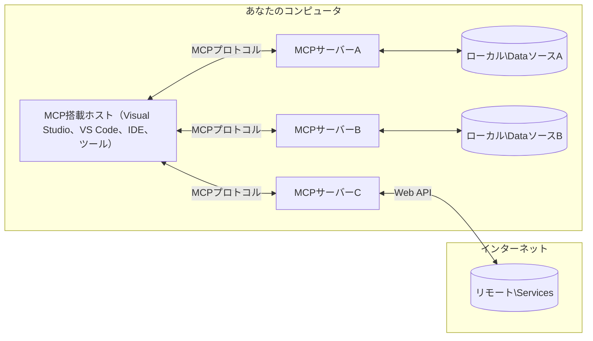

# MCPコアコンセプト：AI統合のためのモデルコンテキストプロトコルの習得

[](https://youtu.be/earDzWGtE84)

_(上の画像をクリックすると、このレッスンのビデオが視聴できます)_

[Model Context Protocol (MCP)](https://github.com/modelcontextprotocol)は、大規模言語モデル（LLM）と外部ツール、アプリケーション、データソース間の通信を最適化する強力で標準化されたフレームワークです。  
このガイドでは、MCPのコアコンセプトを解説します。クライアント-サーバーアーキテクチャ、主要コンポーネント、通信メカニズム、実装のベストプラクティスについて学びます。

- **明示的なユーザー同意**：すべてのデータアクセスと操作は、実行前に明示的なユーザー承認が必要です。ユーザーはどのデータにアクセスし、どのような操作が行われるかを明確に理解し、権限と認可を細かく制御できます。

- **データプライバシー保護**：ユーザーデータは明示的な同意がある場合のみ公開され、インタラクションの全ライフサイクルを通じて堅牢なアクセス制御で保護されなければなりません。実装は不正なデータ送信を防止し、厳格なプライバシー境界を維持する必要があります。

- **ツール実行の安全性**：すべてのツール呼び出しは、ツールの機能、パラメータ、潜在的な影響を明確に理解した上での明示的なユーザー同意が必要です。堅牢なセキュリティ境界により、意図しない危険なまたは悪意のあるツール実行を防止します。

- **トランスポート層のセキュリティ**：すべての通信チャネルは適切な暗号化と認証メカニズムを使用すべきです。リモート接続は安全なトランスポートプロトコルと適切な資格情報管理を実装する必要があります。

#### 実装ガイドライン：

- **権限管理**：ユーザーがアクセス可能なサーバー、ツール、リソースを細かく制御できる権限システムを実装する  
- **認証と認可**：安全な認証方法（OAuth、APIキー）を使用し、適切なトークン管理と有効期限を設定する  
- **入力検証**：定義されたスキーマに従い、すべてのパラメータとデータ入力を検証してインジェクション攻撃を防止する  
- **監査ログ**：セキュリティ監視とコンプライアンスのためにすべての操作の包括的なログを保持する  

## 概要

このレッスンでは、Model Context Protocol (MCP) エコシステムを構成する基本的なアーキテクチャとコンポーネントを探ります。クライアント-サーバーアーキテクチャ、主要コンポーネント、MCPインタラクションを支える通信メカニズムについて学びます。

## 主要な学習目標

このレッスンの終了時には、以下を理解できます：

- MCPのクライアント-サーバーアーキテクチャを理解する  
- ホスト、クライアント、サーバーの役割と責任を識別する  
- MCPを柔軟な統合レイヤーにするコア機能を分析する  
- MCPエコシステム内の情報の流れを学ぶ  
- .NET、Java、Python、JavaScriptのコード例を通じて実践的な洞察を得る  

## MCPアーキテクチャ：詳細解説

MCPエコシステムはクライアント-サーバーモデルに基づいて構築されています。このモジュラー構造により、AIアプリケーションはツール、データベース、API、コンテキストリソースと効率的に連携できます。アーキテクチャを主要コンポーネントに分解して説明します。

MCPはクライアント-サーバーアーキテクチャに従い、ホストアプリケーションが複数のサーバーに接続できます：


- **MCPホスト**：VSCode、Claude Desktop、IDE、またはMCPを通じてデータにアクセスしたいAIツールなどのプログラム  
- **MCPクライアント**：サーバーと1対1の接続を維持するプロトコルクライアント  
- **MCPサーバー**：標準化されたModel Context Protocolを通じて特定の機能を公開する軽量プログラム  
- **ローカルデータソース**：MCPサーバーが安全にアクセスできるコンピュータのファイル、データベース、サービス  
- **リモートサービス**：インターネット経由で利用可能な外部システムで、MCPサーバーがAPIを通じて接続可能  

MCPプロトコルは日付ベースのバージョニング（YYYY-MM-DD形式）を用いる進化中の標準です。現在のプロトコルバージョンは**2025-11-25**です。最新の更新は[プロトコル仕様](https://modelcontextprotocol.io/specification/2025-11-25/)で確認できます。

### 1. ホスト

Model Context Protocol (MCP)における**ホスト**は、ユーザーがプロトコルと対話する主要なインターフェースとして機能するAIアプリケーションです。ホストは複数のMCPサーバーへの接続を管理し、各サーバー接続に専用のMCPクライアントを作成します。ホストの例：

- **AIアプリケーション**：Claude Desktop、Visual Studio Code、Claude Code  
- **開発環境**：MCP統合を備えたIDEやコードエディター  
- **カスタムアプリケーション**：目的特化型のAIエージェントやツール  

**ホスト**はAIモデルのインタラクションを調整するアプリケーションです。彼らは：

- **AIモデルのオーケストレーション**：LLMを実行または対話し、応答生成やAIワークフローを調整  
- **クライアント接続の管理**：MCPサーバーごとに1つのMCPクライアントを作成・維持  
- **ユーザーインターフェースの制御**：会話の流れ、ユーザーインタラクション、応答表示を処理  
- **セキュリティの強制**：権限、セキュリティ制約、認証を管理  
- **ユーザー同意の処理**：データ共有やツール実行のユーザー承認を管理  

### 2. クライアント

**クライアント**はホストとMCPサーバー間の専用1対1接続を維持する重要なコンポーネントです。各MCPクライアントはホストによって特定のMCPサーバーに接続するためにインスタンス化され、整理された安全な通信チャネルを確保します。複数のクライアントにより、ホストは複数のサーバーに同時接続可能です。

**クライアント**はホストアプリケーション内の接続コンポーネントです。彼らは：

- **プロトコル通信**：プロンプトや指示を含むJSON-RPC 2.0リクエストをサーバーに送信  
- **機能交渉**：初期化時にサーバーとサポート機能やプロトコルバージョンを交渉  
- **ツール実行**：モデルからのツール実行リクエストを管理し、応答を処理  
- **リアルタイム更新**：サーバーからの通知やリアルタイム更新を処理  
- **応答処理**：サーバー応答を処理し、ユーザー表示用にフォーマット  

### 3. サーバー

**サーバー**はMCPクライアントにコンテキスト、ツール、機能を提供するプログラムです。ローカル（ホストと同じマシン）またはリモート（外部プラットフォーム）で実行可能で、クライアントのリクエストを処理し構造化された応答を提供します。サーバーは標準化されたModel Context Protocolを通じて特定の機能を公開します。

**サーバー**はコンテキストと機能を提供するサービスです。彼らは：

- **機能登録**：利用可能なプリミティブ（リソース、プロンプト、ツール）をクライアントに登録・公開  
- **リクエスト処理**：クライアントからのツール呼び出し、リソース要求、プロンプト要求を受け取り実行  
- **コンテキスト提供**：モデル応答を強化するためのコンテキスト情報とデータを提供  
- **状態管理**：セッション状態を維持し、必要に応じて状態を持つインタラクションを処理  
- **リアルタイム通知**：機能変更や更新に関する通知を接続クライアントに送信  

サーバーは誰でも開発可能で、専門的な機能でモデル機能を拡張できます。ローカルおよびリモートの両方の展開シナリオをサポートします。

### 4. サーバープリミティブ

Model Context Protocol (MCP)のサーバーは、クライアント、ホスト、言語モデル間の豊かなインタラクションの基本構成要素を定義する3つのコア**プリミティブ**を提供します。これらのプリミティブは、プロトコルを通じて利用可能なコンテキスト情報とアクションの種類を指定します。

MCPサーバーは以下の3つのコアプリミティブの任意の組み合わせを公開できます：

#### リソース

**リソース**はAIアプリケーションにコンテキスト情報を提供するデータソースです。静的または動的なコンテンツを表し、モデルの理解と意思決定を強化します：

- **コンテキストデータ**：AIモデルが利用する構造化情報とコンテキスト  
- **ナレッジベース**：ドキュメントリポジトリ、記事、マニュアル、研究論文  
- **ローカルデータソース**：ファイル、データベース、ローカルシステム情報  
- **外部データ**：APIレスポンス、ウェブサービス、リモートシステムデータ  
- **動的コンテンツ**：外部条件に基づきリアルタイムで更新されるデータ  

リソースはURIで識別され、`resources/list`による発見と`resources/read`による取得をサポートします：

```text
file://documents/project-spec.md
database://production/users/schema
api://weather/current
```

#### プロンプト

**プロンプト**は言語モデルとのインタラクションを構造化する再利用可能なテンプレートです。標準化されたインタラクションパターンとテンプレート化されたワークフローを提供します：

- **テンプレートベースのインタラクション**：事前構造化されたメッセージや会話開始文  
- **ワークフローテンプレート**：一般的なタスクやインタラクションの標準化されたシーケンス  
- **Few-shot例**：モデル指示用の例ベーステンプレート  
- **システムプロンプト**：モデルの振る舞いとコンテキストを定義する基礎的プロンプト  
- **動的テンプレート**：特定のコンテキストに適応するパラメータ化されたプロンプト  

プロンプトは変数置換をサポートし、`prompts/list`で発見、`prompts/get`で取得可能です：

```markdown
Generate a {{task_type}} for {{product}} targeting {{audience}} with the following requirements: {{requirements}}
```

#### ツール

**ツール**はAIモデルが特定のアクションを実行するために呼び出せる実行可能な関数です。MCPエコシステムの「動詞」に相当し、モデルが外部システムと対話することを可能にします：

- **実行可能な関数**：モデルが特定のパラメータで呼び出せる個別操作  
- **外部システム統合**：API呼び出し、データベースクエリ、ファイル操作、計算  
- **固有の識別子**：各ツールは固有の名前、説明、パラメータスキーマを持つ  
- **構造化I/O**：ツールは検証済みパラメータを受け取り、構造化された型付き応答を返す  
- **アクション機能**：モデルが実世界のアクションを実行し、ライブデータを取得可能にする  

ツールはパラメータ検証のためJSON Schemaで定義され、`tools/list`で発見、`tools/call`で実行されます：

```typescript
server.tool(
  "search_products", 
  {
    query: z.string().describe("Search query for products"),
    category: z.string().optional().describe("Product category filter"),
    max_results: z.number().default(10).describe("Maximum results to return")
  }, 
  async (params) => {
    // 検索を実行し、構造化された結果を返します
    return await productService.search(params);
  }
);
```

## クライアントプリミティブ

Model Context Protocol (MCP)において、**クライアント**はサーバーがホストアプリケーションから追加機能を要求できるプリミティブを公開できます。これらのクライアント側プリミティブにより、AIモデル機能やユーザーインタラクションにアクセス可能な、より豊かでインタラクティブなサーバー実装が可能になります。

### サンプリング

**サンプリング**はサーバーがクライアントのAIアプリケーションから言語モデルの補完を要求できる機能です。このプリミティブにより、サーバーは自身のモデル依存を持たずにLLM機能にアクセスできます：

- **モデル非依存アクセス**：サーバーはLLM SDKを含めず、モデルアクセス管理なしに補完を要求可能  
- **サーバー主導のAI**：サーバーがクライアントのAIモデルを使って自律的にコンテンツ生成可能  
- **再帰的LLMインタラクション**：サーバーがAI支援を必要とする複雑なシナリオをサポート  
- **動的コンテンツ生成**：ホストのモデルを使いコンテキストに応じた応答を生成可能  

サンプリングは`sampling/complete`メソッドを通じて開始され、サーバーがクライアントに補完要求を送信します。

### エリシテーション

**エリシテーション**はサーバーがクライアントのインターフェースを通じてユーザーから追加情報や確認を要求できる機能です：

- **ユーザー入力要求**：ツール実行に必要な追加情報をサーバーが要求可能  
- **確認ダイアログ**：センシティブまたは影響の大きい操作に対するユーザー承認を要求  
- **インタラクティブワークフロー**：サーバーが段階的なユーザーインタラクションを作成可能  
- **動的パラメータ収集**：ツール実行中に不足または任意のパラメータを収集  

エリシテーション要求は`elicitation/request`メソッドを使い、クライアントのインターフェースを通じてユーザー入力を収集します。

### ロギング

**ロギング**はサーバーがクライアントに構造化されたログメッセージを送信し、デバッグ、監視、運用の可視性を提供する機能です：

- **デバッグ支援**：サーバーが詳細な実行ログを提供しトラブルシューティングを支援  
- **運用監視**：クライアントにステータス更新やパフォーマンス指標を送信  
- **エラー報告**：詳細なエラーコンテキストと診断情報を提供  
- **監査証跡**：サーバー操作と意思決定の包括的なログを作成  

ロギングメッセージはサーバーの操作透明性を提供し、デバッグを促進するためにクライアントに送信されます。

## MCPにおける情報の流れ

Model Context Protocol (MCP)はホスト、クライアント、サーバー、モデル間の構造化された情報の流れを定義します。この流れを理解することで、ユーザーリクエストの処理方法や外部ツール・データのモデル応答への統合方法が明確になります。

- **ホストが接続を開始**  
  IDEやチャットインターフェースなどのホストアプリケーションが、通常STDIO、WebSocket、または他のサポートされたトランスポートを介してMCPサーバーに接続を確立します。

- **機能交渉**  
  ホストに組み込まれたクライアントとサーバーが、サポートする機能、ツール、リソース、プロトコルバージョンについて情報を交換します。これにより両者がセッションで利用可能な機能を理解します。

- **ユーザーリクエスト**  
  ユーザーがホストと対話（例：プロンプトやコマンド入力）します。ホストはこの入力を収集し、処理のためクライアントに渡します。

- **リソースまたはツールの使用**  
  - クライアントはモデルの理解を深めるために、サーバーから追加のコンテキストやリソース（ファイル、データベースエントリ、ナレッジベース記事など）を要求する場合があります。  
  - モデルがツールの使用を判断した場合（例：データ取得、計算、API呼び出し）、クライアントはツール名とパラメータを指定してサーバーにツール呼び出しリクエストを送信します。

- **サーバー実行**  
  サーバーはリソースまたはツールリクエストを受け取り、必要な操作（関数実行、データベースクエリ、ファイル取得など）を行い、結果を構造化された形式でクライアントに返します。

- **応答生成**  
  クライアントはサーバーの応答（リソースデータ、ツール出力など）をモデルとの継続的なインタラクションに統合します。モデルはこれらの情報を用いて包括的かつ文脈に即した応答を生成します。

- **結果提示**  
  ホストはクライアントから最終出力を受け取り、ユーザーに提示します。通常、モデル生成テキストとツール実行やリソース検索の結果の両方が含まれます。

この流れにより、MCPはモデルと外部ツール・データソースをシームレスに接続し、高度でインタラクティブかつコンテキスト認識型のAIアプリケーションをサポートします。

## プロトコルアーキテクチャとレイヤー

MCPは2つの異なるアーキテクチャレイヤーで構成され、完全な通信フレームワークを提供します：

### データレイヤー

**データレイヤー**は**JSON-RPC 2.0**を基盤としてコアMCPプロトコルを実装します。このレイヤーはメッセージ構造、意味論、インタラクションパターンを定義します：

#### コアコンポーネント：

- **JSON-RPC 2.0プロトコル**：すべての通信は標準化されたJSON-RPC 2.0メッセージ形式を用いてメソッド呼び出し、応答、通知を行う
- **ライフサイクル管理**: クライアントとサーバー間の接続初期化、機能交渉、セッション終了を処理
- **サーバープリミティブ**: サーバーがツール、リソース、プロンプトを通じてコア機能を提供可能にする
- **クライアントプリミティブ**: サーバーがLLMからのサンプリング要求、ユーザー入力の誘発、ログメッセージ送信を行うことを可能にする
- **リアルタイム通知**: ポーリングなしで動的な更新のための非同期通知をサポート

#### 主な特徴:

- **プロトコルバージョン交渉**: 日付ベースのバージョニング（YYYY-MM-DD）を使用して互換性を確保
- **機能検出**: クライアントとサーバーが初期化時にサポートされる機能情報を交換
- **ステートフルセッション**: 複数のやり取りにわたって接続状態を維持し、コンテキストの連続性を確保

### トランスポート層

**トランスポート層**はMCP参加者間の通信チャネル、メッセージフレーミング、認証を管理します：

#### サポートされるトランスポート機構:

1. **STDIOトランスポート**:
   - 標準入力/出力ストリームを使用した直接プロセス間通信
   - ネットワークオーバーヘッドなしで同一マシン上のローカルプロセスに最適
   - ローカルMCPサーバー実装で一般的に使用

2. **ストリーム可能なHTTPトランスポート**:
   - クライアントからサーバーへのメッセージにHTTP POSTを使用  
   - サーバーからクライアントへのストリーミングにオプションのServer-Sent Events (SSE)
   - ネットワーク越しのリモートサーバー通信を可能にする
   - 標準的なHTTP認証（ベアラートークン、APIキー、カスタムヘッダー）をサポート
   - MCPは安全なトークンベース認証にOAuthを推奨

#### トランスポート抽象化:

トランスポート層は通信の詳細をデータ層から抽象化し、すべてのトランスポート機構で同じJSON-RPC 2.0メッセージ形式を使用可能にします。この抽象化により、アプリケーションはローカルサーバーとリモートサーバー間をシームレスに切り替えられます。

### セキュリティ考慮事項

MCP実装は、すべてのプロトコル操作において安全で信頼性の高いやり取りを保証するために、いくつかの重要なセキュリティ原則を遵守しなければなりません：

- **ユーザーの同意と制御**: データアクセスや操作実行の前にユーザーの明示的な同意が必要です。ユーザーは共有するデータや許可する操作を明確に制御できるべきであり、活動のレビューと承認を行う直感的なユーザーインターフェースがサポートされるべきです。

- **データプライバシー**: ユーザーデータは明示的な同意がある場合にのみ公開され、適切なアクセス制御で保護されなければなりません。MCP実装は不正なデータ送信を防ぎ、すべてのやり取りでプライバシーを維持する必要があります。

- **ツールの安全性**: ツールを呼び出す前に明示的なユーザー同意が必要です。ユーザーは各ツールの機能を明確に理解し、意図しないまたは安全でないツール実行を防ぐために堅牢なセキュリティ境界が強制されなければなりません。

これらのセキュリティ原則を遵守することで、MCPは強力なAI統合を可能にしつつ、すべてのプロトコルやり取りにおいてユーザーの信頼、プライバシー、安全性を維持します。

## コード例：主要コンポーネント

以下は、主要なMCPサーバーコンポーネントとツールの実装方法を示す、いくつかの人気プログラミング言語でのコード例です。

### .NET例：ツール付きシンプルMCPサーバーの作成

以下は、カスタムツールを備えたシンプルなMCPサーバーを実装する実用的な.NETコード例です。この例ではツールの定義と登録、リクエスト処理、Model Context Protocolを使ったサーバー接続方法を示します。

```csharp
using System;
using System.Threading.Tasks;
using ModelContextProtocol.Server;
using ModelContextProtocol.Server.Transport;
using ModelContextProtocol.Server.Tools;

public class WeatherServer
{
    public static async Task Main(string[] args)
    {
        // Create an MCP server
        var server = new McpServer(
            name: "Weather MCP Server",
            version: "1.0.0"
        );
        
        // Register our custom weather tool
        server.AddTool<string, WeatherData>("weatherTool", 
            description: "Gets current weather for a location",
            execute: async (location) => {
                // Call weather API (simplified)
                var weatherData = await GetWeatherDataAsync(location);
                return weatherData;
            });
        
        // Connect the server using stdio transport
        var transport = new StdioServerTransport();
        await server.ConnectAsync(transport);
        
        Console.WriteLine("Weather MCP Server started");
        
        // Keep the server running until process is terminated
        await Task.Delay(-1);
    }
    
    private static async Task<WeatherData> GetWeatherDataAsync(string location)
    {
        // This would normally call a weather API
        // Simplified for demonstration
        await Task.Delay(100); // Simulate API call
        return new WeatherData { 
            Temperature = 72.5,
            Conditions = "Sunny",
            Location = location
        };
    }
}

public class WeatherData
{
    public double Temperature { get; set; }
    public string Conditions { get; set; }
    public string Location { get; set; }
}
```

### Java例：MCPサーバーコンポーネント

この例は、上記の.NET例と同じMCPサーバーとツール登録をJavaで実装したものです。

```java
import io.modelcontextprotocol.server.McpServer;
import io.modelcontextprotocol.server.McpToolDefinition;
import io.modelcontextprotocol.server.transport.StdioServerTransport;
import io.modelcontextprotocol.server.tool.ToolExecutionContext;
import io.modelcontextprotocol.server.tool.ToolResponse;

public class WeatherMcpServer {
    public static void main(String[] args) throws Exception {
        // MCPサーバーを作成する
        McpServer server = McpServer.builder()
            .name("Weather MCP Server")
            .version("1.0.0")
            .build();
            
        // 天気ツールを登録する
        server.registerTool(McpToolDefinition.builder("weatherTool")
            .description("Gets current weather for a location")
            .parameter("location", String.class)
            .execute((ToolExecutionContext ctx) -> {
                String location = ctx.getParameter("location", String.class);
                
                // 天気データを取得する（簡略化）
                WeatherData data = getWeatherData(location);
                
                // フォーマットされた応答を返す
                return ToolResponse.content(
                    String.format("Temperature: %.1f°F, Conditions: %s, Location: %s", 
                    data.getTemperature(), 
                    data.getConditions(), 
                    data.getLocation())
                );
            })
            .build());
        
        // stdioトランスポートを使用してサーバーに接続する
        try (StdioServerTransport transport = new StdioServerTransport()) {
            server.connect(transport);
            System.out.println("Weather MCP Server started");
            // プロセスが終了するまでサーバーを稼働させ続ける
            Thread.currentThread().join();
        }
    }
    
    private static WeatherData getWeatherData(String location) {
        // 実装では天気APIを呼び出す
        // 例示のために簡略化している
        return new WeatherData(72.5, "Sunny", location);
    }
}

class WeatherData {
    private double temperature;
    private String conditions;
    private String location;
    
    public WeatherData(double temperature, String conditions, String location) {
        this.temperature = temperature;
        this.conditions = conditions;
        this.location = location;
    }
    
    public double getTemperature() {
        return temperature;
    }
    
    public String getConditions() {
        return conditions;
    }
    
    public String getLocation() {
        return location;
    }
}
```

### Python例：MCPサーバーの構築

この例はfastmcpを使用しているため、まずインストールしてください：

```python
pip install fastmcp
```
コードサンプル：

```python
#!/usr/bin/env python3
import asyncio
from fastmcp import FastMCP
from fastmcp.transports.stdio import serve_stdio

# FastMCPサーバーを作成する
mcp = FastMCP(
    name="Weather MCP Server",
    version="1.0.0"
)

@mcp.tool()
def get_weather(location: str) -> dict:
    """Gets current weather for a location."""
    return {
        "temperature": 72.5,
        "conditions": "Sunny",
        "location": location
    }

# クラスを使用した別のアプローチ
class WeatherTools:
    @mcp.tool()
    def forecast(self, location: str, days: int = 1) -> dict:
        """Gets weather forecast for a location for the specified number of days."""
        return {
            "location": location,
            "forecast": [
                {"day": i+1, "temperature": 70 + i, "conditions": "Partly Cloudy"}
                for i in range(days)
            ]
        }

# クラスツールを登録する
weather_tools = WeatherTools()

# サーバーを起動する
if __name__ == "__main__":
    asyncio.run(serve_stdio(mcp))
```

### JavaScript例：MCPサーバーの作成

この例はJavaScriptでのMCPサーバー作成と、2つの天気関連ツールの登録方法を示します。

```javascript
// 公式のモデルコンテキストプロトコルSDKを使用
import { McpServer } from "@modelcontextprotocol/sdk/server/mcp.js";
import { StdioServerTransport } from "@modelcontextprotocol/sdk/server/stdio.js";
import { z } from "zod"; // パラメータ検証のために

// MCPサーバーを作成
const server = new McpServer({
  name: "Weather MCP Server",
  version: "1.0.0"
});

// 天気ツールを定義
server.tool(
  "weatherTool",
  {
    location: z.string().describe("The location to get weather for")
  },
  async ({ location }) => {
    // 通常は天気APIを呼び出します
    // デモ用に簡略化
    const weatherData = await getWeatherData(location);
    
    return {
      content: [
        { 
          type: "text", 
          text: `Temperature: ${weatherData.temperature}°F, Conditions: ${weatherData.conditions}, Location: ${weatherData.location}` 
        }
      ]
    };
  }
);

// 予報ツールを定義
server.tool(
  "forecastTool",
  {
    location: z.string(),
    days: z.number().default(3).describe("Number of days for forecast")
  },
  async ({ location, days }) => {
    // 通常は天気APIを呼び出します
    // デモ用に簡略化
    const forecast = await getForecastData(location, days);
    
    return {
      content: [
        { 
          type: "text", 
          text: `${days}-day forecast for ${location}: ${JSON.stringify(forecast)}` 
        }
      ]
    };
  }
);

// ヘルパー関数
async function getWeatherData(location) {
  // API呼び出しをシミュレート
  return {
    temperature: 72.5,
    conditions: "Sunny",
    location: location
  };
}

async function getForecastData(location, days) {
  // API呼び出しをシミュレート
  return Array.from({ length: days }, (_, i) => ({
    day: i + 1,
    temperature: 70 + Math.floor(Math.random() * 10),
    conditions: i % 2 === 0 ? "Sunny" : "Partly Cloudy"
  }));
}

// stdioトランスポートを使ってサーバーに接続
const transport = new StdioServerTransport();
server.connect(transport).catch(console.error);

console.log("Weather MCP Server started");
```

このJavaScript例は、サーバーに接続し、プロンプトを送信し、実行されたツール呼び出しを含む応答を処理するMCPクライアントの作成方法を示しています。

## セキュリティと認可

MCPはプロトコル全体でセキュリティと認可を管理するためのいくつかの組み込み概念とメカニズムを含みます：

1. **ツール権限管理**:  
  クライアントはセッション中にモデルが使用可能なツールを指定できます。これにより明示的に許可されたツールのみがアクセス可能となり、意図しないまたは安全でない操作のリスクを低減します。権限はユーザーの好み、組織のポリシー、やり取りのコンテキストに基づいて動的に設定可能です。

2. **認証**:  
  サーバーはツール、リソース、または機密操作へのアクセス前に認証を要求できます。APIキー、OAuthトークン、その他の認証方式が含まれます。適切な認証により、信頼されたクライアントとユーザーのみがサーバー側機能を呼び出せます。

3. **検証**:  
  すべてのツール呼び出しに対してパラメータ検証が強制されます。各ツールはパラメータの期待される型、形式、制約を定義し、サーバーは受信リクエストをそれに従って検証します。これにより不正または悪意のある入力がツール実装に到達するのを防ぎ、操作の整合性を維持します。

4. **レート制限**:  
  悪用防止とサーバーリソースの公平な使用を確保するため、MCPサーバーはツール呼び出しやリソースアクセスに対してレート制限を実装できます。レート制限はユーザー単位、セッション単位、またはグローバルに適用可能で、サービス拒否攻撃や過剰なリソース消費から保護します。

これらのメカニズムを組み合わせることで、MCPは言語モデルと外部ツールやデータソースの統合に安全な基盤を提供し、ユーザーと開発者に細かなアクセス制御と使用管理を可能にします。

## プロトコルメッセージと通信フロー

MCP通信は構造化された**JSON-RPC 2.0**メッセージを使用し、ホスト、クライアント、サーバー間の明確で信頼性の高いやり取りを促進します。プロトコルは異なる操作タイプに特化したメッセージパターンを定義しています：

### コアメッセージタイプ:

#### **初期化メッセージ**
- **`initialize` リクエスト**: 接続を確立し、プロトコルバージョンと機能を交渉
- **`initialize` レスポンス**: サポートされる機能とサーバー情報を確認  
- **`notifications/initialized`**: 初期化完了とセッション準備完了を通知

#### **検出メッセージ**
- **`tools/list` リクエスト**: サーバーから利用可能なツールを検出
- **`resources/list` リクエスト**: 利用可能なリソース（データソース）を一覧表示
- **`prompts/list` リクエスト**: 利用可能なプロンプトテンプレートを取得

#### **実行メッセージ**  
- **`tools/call` リクエスト**: 指定されたパラメータで特定のツールを実行
- **`resources/read` リクエスト**: 特定リソースからコンテンツを取得
- **`prompts/get` リクエスト**: オプションのパラメータ付きでプロンプトテンプレートを取得

#### **クライアント側メッセージ**
- **`sampling/complete` リクエスト**: サーバーがクライアントにLLM完了を要求
- **`elicitation/request`**: サーバーがクライアントインターフェースを通じてユーザー入力を要求
- **ログメッセージ**: サーバーが構造化されたログメッセージをクライアントに送信

#### **通知メッセージ**
- **`notifications/tools/list_changed`**: サーバーがツールの変更をクライアントに通知
- **`notifications/resources/list_changed`**: サーバーがリソースの変更をクライアントに通知  
- **`notifications/prompts/list_changed`**: サーバーがプロンプトの変更をクライアントに通知

### メッセージ構造:

すべてのMCPメッセージはJSON-RPC 2.0形式に従い：
- **リクエストメッセージ**: `id`、`method`、およびオプションの`params`を含む
- **レスポンスメッセージ**: `id`と`result`または`error`を含む  
- **通知メッセージ**: `method`とオプションの`params`を含み（`id`なし、応答不要）

この構造化された通信により、リアルタイム更新、ツール連鎖、堅牢なエラー処理などの高度なシナリオをサポートする信頼性が高く追跡可能なやり取りが保証されます。

## 重要ポイントまとめ

- **アーキテクチャ**: MCPはホストが複数のクライアント接続をサーバーに管理するクライアントサーバーアーキテクチャを採用
- **参加者**: エコシステムにはホスト（AIアプリケーション）、クライアント（プロトコルコネクター）、サーバー（機能提供者）が含まれる
- **トランスポート機構**: 通信はSTDIO（ローカル）とストリーム可能なHTTP（オプションのSSE付き、リモート）をサポート
- **コアプリミティブ**: サーバーはツール（実行可能関数）、リソース（データソース）、プロンプト（テンプレート）を公開
- **クライアントプリミティブ**: サーバーはクライアントにサンプリング（LLM完了）、誘発（ユーザー入力）、ログ送信を要求可能
- **プロトコル基盤**: JSON-RPC 2.0に基づき、日付ベースのバージョニング（現行：2025-11-25）を採用
- **リアルタイム機能**: 動的更新とリアルタイム同期のための通知をサポート
- **セキュリティ最優先**: 明示的なユーザー同意、データプライバシー保護、安全な通信が必須要件

## 演習

あなたのドメインで役立つシンプルなMCPツールを設計してください。以下を定義してください：
1. ツール名
2. 受け入れるパラメータ
3. 返す出力
4. モデルがこのツールを使ってユーザーの問題をどのように解決するか

---

## 次に読む

次へ: [第2章: セキュリティ](../02-Security/README.md)

---

<!-- CO-OP TRANSLATOR DISCLAIMER START -->
**免責事項**：  
本書類はAI翻訳サービス「Co-op Translator」（https://github.com/Azure/co-op-translator）を使用して翻訳されました。正確性の向上に努めておりますが、自動翻訳には誤りや不正確な部分が含まれる可能性があります。原文の言語による文書が正式な情報源とみなされるべきです。重要な情報については、専門の人間による翻訳を推奨します。本翻訳の利用により生じたいかなる誤解や誤訳についても、当方は責任を負いかねます。
<!-- CO-OP TRANSLATOR DISCLAIMER END -->