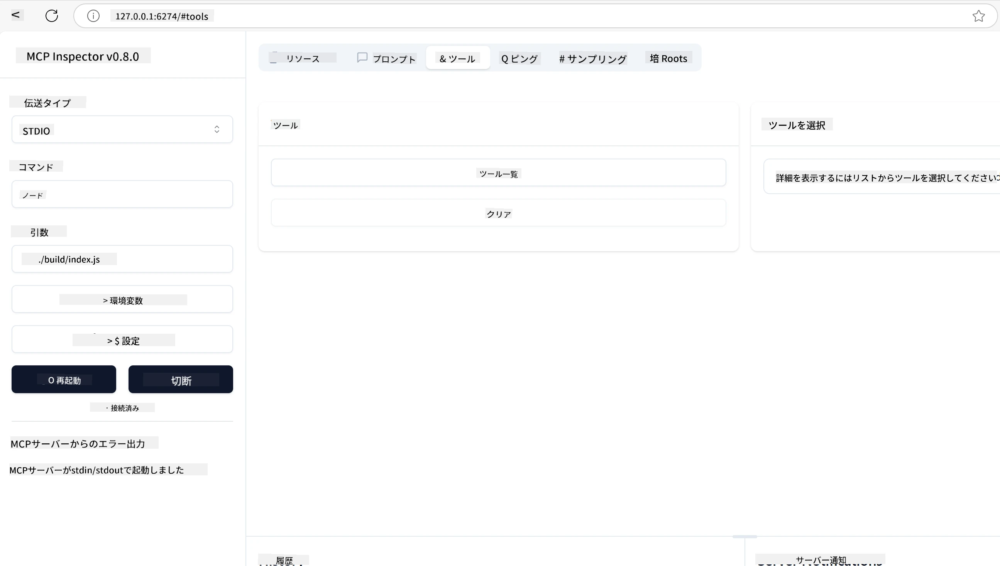
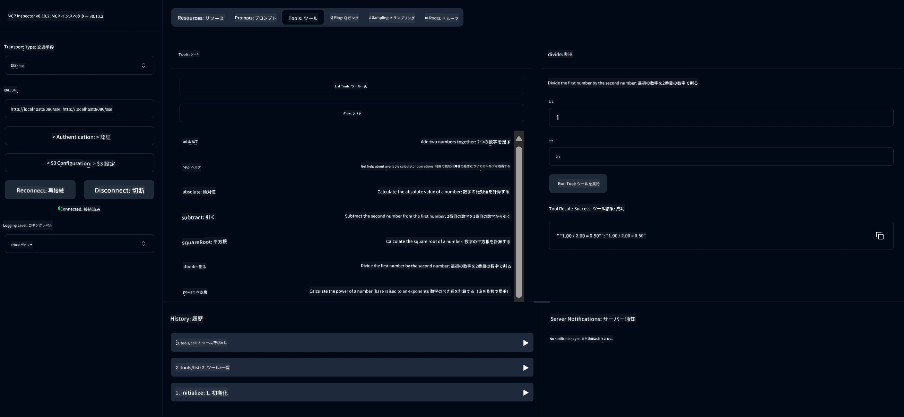
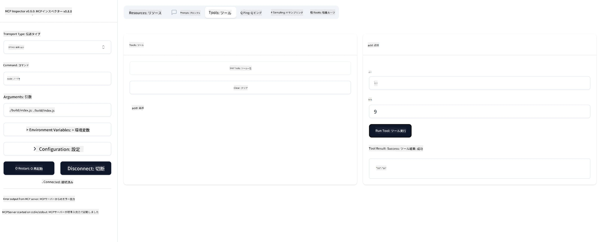

# MCPを使い始めるには

> [!NOTE]
> 本レッスンのJava HTTPサンプルはレガシーなHTTP+SSEトランスポートを使用しており、
> MCP `2025-11-25` に対応するSDKをターゲットとしています。新しいリモートサーバーには
> `2026-07-28` のStreamable HTTPトランスポートを使用し、SDKでのサポートを確認してください。

Model Context Protocol（MCP）の最初のステップへようこそ！MCPが初めての方も、理解を深めたい方も、このガイドでは必須のセットアップと開発プロセスを案内します。MCPがAIモデルとアプリケーションの間でシームレスな統合を可能にする方法を理解し、MCP搭載ソリューションの構築とテストのために環境を迅速に準備する方法を学びます。

> TLDR; AIアプリを作る人は、ツールや他のリソースをLLM（大規模言語モデル）に追加してより知識豊富なモデルにできることを知っています。しかし、それらのツールやリソースをサーバーに置く場合、アプリとサーバーの能力はLLMあり・なしのいずれのクライアントからでも使用可能です。

## 概要

このレッスンでは、MCP環境のセットアップと最初のMCPアプリケーションの構築に関する実践的なガイダンスを提供します。必要なツールやフレームワークの設定、基本的なMCPサーバーの構築、ホストアプリケーションの作成、実装のテスト方法を学びます。

Model Context Protocol（MCP）は、アプリケーションがLLMにコンテキストを提供する方法を標準化したオープンプロトコルです。MCPは、AIアプリケーションのためのUSB-Cポートのようなものです。AIモデルと様々なデータソースやツールを接続する標準的な方法を提供します。

## 学習目標

このレッスンの終わりまでに、以下ができるようになります：

- C#, Java, Python, TypeScript, RustでのMCP開発環境のセットアップ
- カスタム機能（リソース、プロンプト、ツール）付きの基本的なMCPサーバーの構築とデプロイ
- MCPサーバーに接続するホストアプリケーションの作成
- MCP実装のテストとデバッグ

## MCP環境のセットアップ

MCPでの作業を始める前に、開発環境を整え基本的なワークフローを理解することが大切です。このセクションでは、MCPでスムーズに開始できるよう初期セットアップ手順を案内します。

### 前提条件

MCP開発に入る前に、以下を用意してください：

- <strong>開発環境</strong>：使用する言語（C#, Java, Python, TypeScript, Rust）の環境
- **IDE/エディター**：Visual Studio, Visual Studio Code, IntelliJ, Eclipse, PyCharm、または最新のコードエディター
- <strong>パッケージマネージャー</strong>：NuGet, Maven/Gradle, pip, npm/yarn, Cargo
- **APIキー**：ホストアプリケーションで利用予定のAIサービス用

## 基本的なMCPサーバーの構成

MCPサーバーは通常、以下を含みます：

- <strong>サーバー構成</strong>：ポート、認証、その他設定
- <strong>リソース</strong>：LLMに提供されるデータやコンテキスト
- <strong>ツール</strong>：モデルが呼び出せる機能
- <strong>プロンプト</strong>：テキスト生成や構造化のテンプレート

以下はTypeScriptの簡易例です：

```typescript
import { McpServer, ResourceTemplate } from "@modelcontextprotocol/sdk/server/mcp.js";
import { StdioServerTransport } from "@modelcontextprotocol/sdk/server/stdio.js";
import { z } from "zod";

// MCPサーバーを作成する
const server = new McpServer({
  name: "Demo",
  version: "1.0.0"
});

// 追加ツールを追加する
server.tool("add",
  { a: z.number(), b: z.number() },
  async ({ a, b }) => ({
    content: [{ type: "text", text: String(a + b) }]
  })
);

// 動的な挨拶リソースを追加する
server.resource(
  "file",
  // 「list」パラメータはリソースが利用可能なファイルをリストする方法を制御します。これをundefinedに設定すると、このリソースのリスト表示が無効になります。
  new ResourceTemplate("file://{path}", { list: undefined }),
  async (uri, { path }) => ({
    contents: [{
      uri: uri.href,
      text: `File, ${path}!`
    }]
  })
);

// ファイルの内容を読み取るファイルリソースを追加する
server.resource(
  "file",
  new ResourceTemplate("file://{path}", { list: undefined }),
  async (uri, { path }) => {
    let text;
    try {
      text = await fs.readFile(path, "utf8");
    } catch (err) {
      text = `Error reading file: ${err.message}`;
    }
    return {
      contents: [{
        uri: uri.href,
        text
      }]
    };
  }
);

server.prompt(
  "review-code",
  { code: z.string() },
  ({ code }) => ({
    messages: [{
      role: "user",
      content: {
        type: "text",
        text: `Please review this code:\n\n${code}`
      }
    }]
  })
);

// stdinでメッセージの受信を開始し、stdoutでメッセージの送信を開始する
const transport = new StdioServerTransport();
await server.connect(transport);
```

上記コードで行っていること：

- MCP TypeScript SDKから必要なクラスをインポート
- 新しいMCPサーバーインスタンスを作成・設定
- ハンドラー関数付きのカスタムツール（`calculator`）を登録
- サーバーを起動しMCPリクエストの受け付けを開始

## テストとデバッグ

MCPサーバーのテストを始める前に、利用可能なツールとデバッグのベストプラクティスを理解しておくことが重要です。効果的なテストによりサーバーが期待通り動作することを確認し、問題の迅速な発見と解決を助けます。以下のセクションではMCP実装の検証に推奨される方法を解説します。

MCPではサーバーのテストやデバッグを支援するツールがあります：

- **Inspectorツール**：グラフィカルなインターフェースで、サーバーに接続しツール、プロンプト、リソースをテスト可能
- **curl**：curlなどのコマンドラインツールやHTTPコマンドを実行できるその他クライアントでサーバー接続可能

### MCP Inspectorの使い方

[MCP Inspector](https://github.com/modelcontextprotocol/inspector) は以下を支援するビジュアルテストツールです：

1. <strong>サーバーの機能発見</strong>：利用可能なリソース、ツール、プロンプトを自動検出
2. <strong>ツール実行テスト</strong>：様々なパラメーターで試し、リアルタイムの応答を確認
3. <strong>サーバーメタデータの表示</strong>：サーバー情報、スキーマ、設定を確認

```bash
# 例 TypeScript、MCPインスペクターのインストールと実行
npx @modelcontextprotocol/inspector node build/index.js
```

上記コマンドを実行すると、ブラウザでローカルWebインターフェースとしてMCP Inspectorが起動します。登録済みMCPサーバーのダッシュボードや、利用可能なツール、リソース、プロンプトの一覧が表示されます。このインターフェースでツール実行を対話的にテストし、サーバーメタデータを調査し、リアルタイムの応答も確認でき、MCPサーバーの実装検証とデバッグが容易になります。

以下はそのスクリーンショット例です：



## よくあるセットアップ問題と解決策

| 問題 | 可能な解決策 |
|-------|-------------------|
| 接続拒否 | サーバーが起動中か、ポートが正しいか確認 |
| ツール実行エラー | パラメーター検証やエラーハンドリングを見直し |
| 認証失敗 | APIキーや権限の確認 |
| スキーマ検証エラー | パラメーターが定義スキーマに一致しているか確認 |
| サーバー起動失敗 | ポート競合や依存関係の不足を確認 |
| CORSエラー | クロスオリジンリクエスト用に正しいCORSヘッダーを設定 |
| 認証問題 | トークンの有効性や権限を確認 |

## ローカル開発

ローカル開発とテスト用に、MCPサーバーを直接マシン上で実行可能です：

1. <strong>サーバープロセスを起動</strong>：MCPサーバーアプリケーションを実行
2. <strong>ネットワーク設定</strong>：サーバーが期待ポートでアクセス可能か確認
3. <strong>クライアント接続</strong>：`http://localhost:3000` のようなローカル接続URLを使用

```bash
# 例：TypeScript MCPサーバーをローカルで実行する
npm run start
# サーバーが http://localhost:3000 で動作中
```

## 最初のMCPサーバーを作る

以前のレッスンで[コアコンセプト](../../01-CoreConcepts/README.md)を学びました。今度はその知識を実践に移します。

### サーバーは何ができるか

コードを書く前に、サーバーが何をできるか確認しましょう：

MCPサーバーは例えば以下のことができます：

- ローカルファイルやデータベースへのアクセス
- リモートAPIへの接続
- 計算の実行
- 他のツールやサービスとの連携
- インタラクション用のユーザーインターフェースの提供

さあ、何ができるか分かったところで、実装を始めましょう。

## 演習：サーバー作成

サーバー作成には以下の手順を踏みます：

- MCP SDKのインストール
- プロジェクトの作成と構造のセットアップ
- サーバーコードの作成
- サーバーのテスト

### -1- プロジェクトを作成

#### TypeScript

```sh
# プロジェクトディレクトリを作成し、npmプロジェクトを初期化する
mkdir calculator-server
cd calculator-server
npm init -y
```

#### Python

```sh
# プロジェクトディレクトリを作成します
mkdir calculator-server
cd calculator-server
# フォルダをVisual Studio Codeで開きます - もし別のIDEを使っているなら、この手順はスキップしてください
code .
```

#### .NET

```sh
dotnet new console -n McpCalculatorServer
cd McpCalculatorServer
```

#### Java

Javaの場合、Spring Bootプロジェクトを作成：

```bash
curl https://start.spring.io/starter.zip \
  -d dependencies=web \
  -d javaVersion=21 \
  -d type=maven-project \
  -d groupId=com.example \
  -d artifactId=calculator-server \
  -d name=McpServer \
  -d packageName=com.microsoft.mcp.sample.server \
  -o calculator-server.zip
```

zipファイルを解凍：

```bash
unzip calculator-server.zip -d calculator-server
cd calculator-server
# 任意で未使用のテストを削除してください
rm -rf src/test/java
```

*pom.xml* ファイルに以下の完全な設定を追加：

```xml
<?xml version="1.0" encoding="UTF-8"?>
<project xmlns="http://maven.apache.org/POM/4.0.0"
    xmlns:xsi="http://www.w3.org/2001/XMLSchema-instance"
    xsi:schemaLocation="http://maven.apache.org/POM/4.0.0 http://maven.apache.org/xsd/maven-4.0.0.xsd">
    <modelVersion>4.0.0</modelVersion>
    
    <!-- Spring Boot parent for dependency management -->
    <parent>
        <groupId>org.springframework.boot</groupId>
        <artifactId>spring-boot-starter-parent</artifactId>
        <version>3.5.0</version>
        <relativePath />
    </parent>

    <!-- Project coordinates -->
    <groupId>com.example</groupId>
    <artifactId>calculator-server</artifactId>
    <version>0.0.1-SNAPSHOT</version>
    <name>Calculator Server</name>
    <description>Basic calculator MCP service for beginners</description>

    <!-- Properties -->
    <properties>
        <java.version>21</java.version>
        <maven.compiler.source>21</maven.compiler.source>
        <maven.compiler.target>21</maven.compiler.target>
    </properties>

    <!-- Spring AI BOM for version management -->
    <dependencyManagement>
        <dependencies>
            <dependency>
                <groupId>org.springframework.ai</groupId>
                <artifactId>spring-ai-bom</artifactId>
                <version>1.0.0-SNAPSHOT</version>
                <type>pom</type>
                <scope>import</scope>
            </dependency>
        </dependencies>
    </dependencyManagement>

    <!-- Dependencies -->
    <dependencies>
        <dependency>
            <groupId>org.springframework.ai</groupId>
            <artifactId>spring-ai-starter-mcp-server-webflux</artifactId>
        </dependency>
        <dependency>
            <groupId>org.springframework.boot</groupId>
            <artifactId>spring-boot-starter-actuator</artifactId>
        </dependency>
        <dependency>
         <groupId>org.springframework.boot</groupId>
         <artifactId>spring-boot-starter-test</artifactId>
         <scope>test</scope>
      </dependency>
    </dependencies>

    <!-- Build configuration -->
    <build>
        <plugins>
            <plugin>
                <groupId>org.springframework.boot</groupId>
                <artifactId>spring-boot-maven-plugin</artifactId>
            </plugin>
            <plugin>
                <groupId>org.apache.maven.plugins</groupId>
                <artifactId>maven-compiler-plugin</artifactId>
                <configuration>
                    <release>21</release>
                </configuration>
            </plugin>
        </plugins>
    </build>

    <!-- Repositories for Spring AI snapshots -->
    <repositories>
        <repository>
            <id>spring-milestones</id>
            <name>Spring Milestones</name>
            <url>https://repo.spring.io/milestone</url>
            <snapshots>
                <enabled>false</enabled>
            </snapshots>
        </repository>
        <repository>
            <id>spring-snapshots</id>
            <name>Spring Snapshots</name>
            <url>https://repo.spring.io/snapshot</url>
            <releases>
                <enabled>false</enabled>
            </releases>
        </repository>
    </repositories>
</project>
```

#### Rust

```sh
mkdir calculator-server
cd calculator-server
cargo init
```

### -2- 依存関係を追加

プロジェクトが作成できたら、次は依存関係を追加します：

#### TypeScript

```sh
# まだインストールされていない場合は、TypeScript をグローバルにインストールします
npm install typescript -g

# MCP SDK とスキーマ検証のための Zod をインストールします
npm install @modelcontextprotocol/sdk zod
npm install -D @types/node typescript
```

#### Python

```sh
# 仮想環境を作成し、依存関係をインストールする
python -m venv venv
venv\Scripts\activate
pip install "mcp[cli]"
```

#### Java

```bash
cd calculator-server
./mvnw clean install -DskipTests
```

#### Rust

```sh
cargo add rmcp --features server,transport-io
cargo add serde
cargo add tokio --features rt-multi-thread
```

### -3- プロジェクトファイルを作成

#### TypeScript

*package.json* ファイルを開いて内容を次のように置き換え、サーバーのビルドと実行が可能なようにする：

```json
{
  "name": "calculator-server",
  "version": "1.0.0",
  "main": "index.js",
  "type": "module",
  "scripts": {
    "build": "tsc",
    "start": "npm run build && node ./build/index.js",
  },
  "keywords": [],
  "author": "",
  "license": "ISC",
  "description": "A simple calculator server using Model Context Protocol",
  "dependencies": {
    "@modelcontextprotocol/sdk": "^1.16.0",
    "zod": "^3.25.76"
  },
  "devDependencies": {
    "@types/node": "^24.0.14",
    "typescript": "^5.8.3"
  }
}
```

*tsconfig.json* ファイルを次の内容で作成：

```json
{
  "compilerOptions": {
    "target": "ES2022",
    "module": "Node16",
    "moduleResolution": "Node16",
    "outDir": "./build",
    "rootDir": "./src",
    "strict": true,
    "esModuleInterop": true,
    "skipLibCheck": true,
    "forceConsistentCasingInFileNames": true
  },
  "include": ["src/**/*"],
  "exclude": ["node_modules"]
}
```

ソースコード用ディレクトリを作成：

```sh
mkdir src
touch src/index.ts
```

#### Python

*server.py* ファイルを作成

```sh
touch server.py
```

#### .NET

必要なNuGetパッケージをインストール：

```sh
dotnet add package ModelContextProtocol --prerelease
dotnet add package Microsoft.Extensions.Hosting
```

#### Java

Java Spring Bootプロジェクトでは、プロジェクト構造が自動作成されます。

#### Rust

Rustでは `cargo init` により *src/main.rs* ファイルがデフォルトで作成されます。ファイルを開いてデフォルトコードを削除してください。

### -4- サーバーコードを作成

#### TypeScript

*index.ts* ファイルを作成し以下のコードを追加：

```typescript
import { McpServer, ResourceTemplate } from "@modelcontextprotocol/sdk/server/mcp.js";
import { StdioServerTransport } from "@modelcontextprotocol/sdk/server/stdio.js";
import { z } from "zod";
 
// MCPサーバーを作成する
const server = new McpServer({
  name: "Calculator MCP Server",
  version: "1.0.0"
});
```

サーバーは作れましたが機能は少ないので修正しましょう。

#### Python

```python
# server.py
from mcp.server.fastmcp import FastMCP

# MCPサーバーを作成する
mcp = FastMCP("Demo")
```

#### .NET

```csharp
using Microsoft.Extensions.DependencyInjection;
using Microsoft.Extensions.Hosting;
using Microsoft.Extensions.Logging;
using ModelContextProtocol.Server;
using System.ComponentModel;

var builder = Host.CreateApplicationBuilder(args);
builder.Logging.AddConsole(consoleLogOptions =>
{
    // Configure all logs to go to stderr
    consoleLogOptions.LogToStandardErrorThreshold = LogLevel.Trace;
});

builder.Services
    .AddMcpServer()
    .WithStdioServerTransport()
    .WithToolsFromAssembly();
await builder.Build().RunAsync();

// add features
```

#### Java

Javaの場合、コアサーバーコンポーネントを作成します。まずメインアプリケーションクラスを修正：

*src/main/java/com/microsoft/mcp/sample/server/McpServerApplication.java*：

```java
package com.microsoft.mcp.sample.server;

import org.springframework.ai.tool.ToolCallbackProvider;
import org.springframework.ai.tool.method.MethodToolCallbackProvider;
import org.springframework.boot.SpringApplication;
import org.springframework.boot.autoconfigure.SpringBootApplication;
import org.springframework.context.annotation.Bean;
import com.microsoft.mcp.sample.server.service.CalculatorService;

@SpringBootApplication
public class McpServerApplication {

    public static void main(String[] args) {
        SpringApplication.run(McpServerApplication.class, args);
    }
    
    @Bean
    public ToolCallbackProvider calculatorTools(CalculatorService calculator) {
        return MethodToolCallbackProvider.builder().toolObjects(calculator).build();
    }
}
```

計算サービスを作成 *src/main/java/com/microsoft/mcp/sample/server/service/CalculatorService.java*：

```java
package com.microsoft.mcp.sample.server.service;

import org.springframework.ai.tool.annotation.Tool;
import org.springframework.stereotype.Service;

/**
 * Service for basic calculator operations.
 * This service provides simple calculator functionality through MCP.
 */
@Service
public class CalculatorService {

    /**
     * Add two numbers
     * @param a The first number
     * @param b The second number
     * @return The sum of the two numbers
     */
    @Tool(description = "Add two numbers together")
    public String add(double a, double b) {
        double result = a + b;
        return formatResult(a, "+", b, result);
    }

    /**
     * Subtract one number from another
     * @param a The number to subtract from
     * @param b The number to subtract
     * @return The result of the subtraction
     */
    @Tool(description = "Subtract the second number from the first number")
    public String subtract(double a, double b) {
        double result = a - b;
        return formatResult(a, "-", b, result);
    }

    /**
     * Multiply two numbers
     * @param a The first number
     * @param b The second number
     * @return The product of the two numbers
     */
    @Tool(description = "Multiply two numbers together")
    public String multiply(double a, double b) {
        double result = a * b;
        return formatResult(a, "*", b, result);
    }

    /**
     * Divide one number by another
     * @param a The numerator
     * @param b The denominator
     * @return The result of the division
     */
    @Tool(description = "Divide the first number by the second number")
    public String divide(double a, double b) {
        if (b == 0) {
            return "Error: Cannot divide by zero";
        }
        double result = a / b;
        return formatResult(a, "/", b, result);
    }

    /**
     * Calculate the power of a number
     * @param base The base number
     * @param exponent The exponent
     * @return The result of raising the base to the exponent
     */
    @Tool(description = "Calculate the power of a number (base raised to an exponent)")
    public String power(double base, double exponent) {
        double result = Math.pow(base, exponent);
        return formatResult(base, "^", exponent, result);
    }

    /**
     * Calculate the square root of a number
     * @param number The number to find the square root of
     * @return The square root of the number
     */
    @Tool(description = "Calculate the square root of a number")
    public String squareRoot(double number) {
        if (number < 0) {
            return "Error: Cannot calculate square root of a negative number";
        }
        double result = Math.sqrt(number);
        return String.format("√%.2f = %.2f", number, result);
    }

    /**
     * Calculate the modulus (remainder) of division
     * @param a The dividend
     * @param b The divisor
     * @return The remainder of the division
     */
    @Tool(description = "Calculate the remainder when one number is divided by another")
    public String modulus(double a, double b) {
        if (b == 0) {
            return "Error: Cannot divide by zero";
        }
        double result = a % b;
        return formatResult(a, "%", b, result);
    }

    /**
     * Calculate the absolute value of a number
     * @param number The number to find the absolute value of
     * @return The absolute value of the number
     */
    @Tool(description = "Calculate the absolute value of a number")
    public String absolute(double number) {
        double result = Math.abs(number);
        return String.format("|%.2f| = %.2f", number, result);
    }

    /**
     * Get help about available calculator operations
     * @return Information about available operations
     */
    @Tool(description = "Get help about available calculator operations")
    public String help() {
        return "Basic Calculator MCP Service\n\n" +
               "Available operations:\n" +
               "1. add(a, b) - Adds two numbers\n" +
               "2. subtract(a, b) - Subtracts the second number from the first\n" +
               "3. multiply(a, b) - Multiplies two numbers\n" +
               "4. divide(a, b) - Divides the first number by the second\n" +
               "5. power(base, exponent) - Raises a number to a power\n" +
               "6. squareRoot(number) - Calculates the square root\n" + 
               "7. modulus(a, b) - Calculates the remainder of division\n" +
               "8. absolute(number) - Calculates the absolute value\n\n" +
               "Example usage: add(5, 3) will return 5 + 3 = 8";
    }

    /**
     * Format the result of a calculation
     */
    private String formatResult(double a, String operator, double b, double result) {
        return String.format("%.2f %s %.2f = %.2f", a, operator, b, result);
    }
}
```

**本番利用向けの任意コンポーネント：**

スタートアップ設定を作成 *src/main/java/com/microsoft/mcp/sample/server/config/StartupConfig.java*：

```java
package com.microsoft.mcp.sample.server.config;

import org.springframework.boot.CommandLineRunner;
import org.springframework.context.annotation.Bean;
import org.springframework.context.annotation.Configuration;

@Configuration
public class StartupConfig {
    
    @Bean
    public CommandLineRunner startupInfo() {
        return args -> {
            System.out.println("\n" + "=".repeat(60));
            System.out.println("Calculator MCP Server is starting...");
            System.out.println("SSE endpoint: http://localhost:8080/sse");
            System.out.println("Health check: http://localhost:8080/actuator/health");
            System.out.println("=".repeat(60) + "\n");
        };
    }
}
```

ヘルスコントローラーを作成 *src/main/java/com/microsoft/mcp/sample/server/controller/HealthController.java*：

```java
package com.microsoft.mcp.sample.server.controller;

import org.springframework.http.ResponseEntity;
import org.springframework.web.bind.annotation.GetMapping;
import org.springframework.web.bind.annotation.RestController;
import java.time.LocalDateTime;
import java.util.HashMap;
import java.util.Map;

@RestController
public class HealthController {
    
    @GetMapping("/health")
    public ResponseEntity<Map<String, Object>> healthCheck() {
        Map<String, Object> response = new HashMap<>();
        response.put("status", "UP");
        response.put("timestamp", LocalDateTime.now().toString());
        response.put("service", "Calculator MCP Server");
        return ResponseEntity.ok(response);
    }
}
```

例外ハンドラーを作成 *src/main/java/com/microsoft/mcp/sample/server/exception/GlobalExceptionHandler.java*：

```java
package com.microsoft.mcp.sample.server.exception;

import org.springframework.http.HttpStatus;
import org.springframework.http.ResponseEntity;
import org.springframework.web.bind.annotation.ExceptionHandler;
import org.springframework.web.bind.annotation.RestControllerAdvice;

@RestControllerAdvice
public class GlobalExceptionHandler {

    @ExceptionHandler(IllegalArgumentException.class)
    public ResponseEntity<ErrorResponse> handleIllegalArgumentException(IllegalArgumentException ex) {
        ErrorResponse error = new ErrorResponse(
            "Invalid_Input", 
            "Invalid input parameter: " + ex.getMessage());
        return new ResponseEntity<>(error, HttpStatus.BAD_REQUEST);
    }

    public static class ErrorResponse {
        private String code;
        private String message;

        public ErrorResponse(String code, String message) {
            this.code = code;
            this.message = message;
        }

        // ゲッター
        public String getCode() { return code; }
        public String getMessage() { return message; }
    }
}
```

カスタムバナーを作成 *src/main/resources/banner.txt*：

```text
_____      _            _       _             
 / ____|    | |          | |     | |            
| |     __ _| | ___ _   _| | __ _| |_ ___  _ __ 
| |    / _` | |/ __| | | | |/ _` | __/ _ \| '__|
| |___| (_| | | (__| |_| | | (_| | || (_) | |   
 \_____\__,_|_|\___|\__,_|_|\__,_|\__\___/|_|   
                                                
Calculator MCP Server v1.0
Spring Boot MCP Application
```

</details>

#### Rust

*src/main.rs* ファイルの先頭に以下コードを追加してください。これはMCPサーバーに必要なライブラリとモジュールのインポートです。

```rust
use rmcp::{
    handler::server::{router::tool::ToolRouter, tool::Parameters},
    model::{ServerCapabilities, ServerInfo},
    schemars, tool, tool_handler, tool_router,
    transport::stdio,
    ServerHandler, ServiceExt,
};
use std::error::Error;
```

この計算サーバーは2つの数字を加算できるシンプルなものです。計算リクエストを表す構造体を作成しましょう。

```rust
#[derive(Debug, serde::Deserialize, schemars::JsonSchema)]
pub struct CalculatorRequest {
    pub a: f64,
    pub b: f64,
}
```

次に計算サーバーを表す構造体を作成。この構造体はツールルーターを保持し、ツール登録に使います。

```rust
#[derive(Debug, Clone)]
pub struct Calculator {
    tool_router: ToolRouter<Self>,
}
```

続いて、`Calculator` 構造体でサーバーの新規インスタンス作成と、サーバーハンドラーの実装をしてサーバー情報を提供します。

```rust
#[tool_router]
impl Calculator {
    pub fn new() -> Self {
        Self {
            tool_router: Self::tool_router(),
        }
    }
}

#[tool_handler]
impl ServerHandler for Calculator {
    fn get_info(&self) -> ServerInfo {
        ServerInfo {
            instructions: Some("A simple calculator tool".into()),
            capabilities: ServerCapabilities::builder().enable_tools().build(),
            ..Default::default()
        }
    }
}
```

最後にメイン関数を実装しサーバーを起動します。この関数で `Calculator` 構造体のインスタンスを作成し標準入出力で提供します。

```rust
#[tokio::main]
async fn main() -> Result<(), Box<dyn Error>> {
    let service = Calculator::new().serve(stdio()).await?;
    service.waiting().await?;
    Ok(())
}
```

サーバーは自己情報を提供する基本的なものができました。続いて加算を行うツールを追加します。

### -5- ツールとリソースを追加

次のコードを追加してツールとリソースを作成：

#### TypeScript

```typescript
server.tool(
  "add",
  { a: z.number(), b: z.number() },
  async ({ a, b }) => ({
    content: [{ type: "text", text: String(a + b) }]
  })
);

server.resource(
  "greeting",
  new ResourceTemplate("greeting://{name}", { list: undefined }),
  async (uri, { name }) => ({
    contents: [{
      uri: uri.href,
      text: `Hello, ${name}!`
    }]
  })
);
```

ツールはパラメーター `a` と `b` を受け取り、次の形式のレスポンスを生成します：

```typescript
{
  contents: [{
    type: "text", content: "some content"
  }]
}
```

リソースは文字列 `"greeting"` でアクセスされ、パラメーター `name` を取り、ツールと似たレスポンスを返します：

```typescript
{
  uri: "<href>",
  text: "a text"
}
```

#### Python

```python
# 追加ツールを追加する
@mcp.tool()
def add(a: int, b: int) -> int:
    """Add two numbers"""
    return a + b


# 動的な挨拶リソースを追加する
@mcp.resource("greeting://{name}")
def get_greeting(name: str) -> str:
    """Get a personalized greeting"""
    return f"Hello, {name}!"
```

前述コードで：

- `add` というツールを定義し、整数のパラメーター `a` と `b` を受け取るようにした
- `greeting` というリソースを作成しパラメーター `name` を受け取るようにした

#### .NET

Program.csファイルに以下を追加：

```csharp
[McpServerToolType]
public static class CalculatorTool
{
    [McpServerTool, Description("Adds two numbers")]
    public static string Add(int a, int b) => $"Sum {a + b}";
}
```

#### Java

ツールは前段階で作成済みです。

#### Rust

`impl Calculator` ブロック内に新しいツールを追加：

```rust
#[tool(description = "Adds a and b")]
async fn add(
    &self,
    Parameters(CalculatorRequest { a, b }): Parameters<CalculatorRequest>,
) -> String {
    (a + b).to_string()
}
```

### -6- 最終コード

サーバーを起動できるように最後のコードを追加します：

#### TypeScript

```typescript
// 標準入力でメッセージの受信を開始し、標準出力でメッセージの送信を開始する
const transport = new StdioServerTransport();
await server.connect(transport);
```

完全なコードは以下の通りです：

```typescript
// index.ts
import { McpServer, ResourceTemplate } from "@modelcontextprotocol/sdk/server/mcp.js";
import { StdioServerTransport } from "@modelcontextprotocol/sdk/server/stdio.js";
import { z } from "zod";

// MCPサーバーを作成する
const server = new McpServer({
  name: "Calculator MCP Server",
  version: "1.0.0"
});

// 追加ツールを追加する
server.tool(
  "add",
  { a: z.number(), b: z.number() },
  async ({ a, b }) => ({
    content: [{ type: "text", text: String(a + b) }]
  })
);

// 動的な挨拶リソースを追加する
server.resource(
  "greeting",
  new ResourceTemplate("greeting://{name}", { list: undefined }),
  async (uri, { name }) => ({
    contents: [{
      uri: uri.href,
      text: `Hello, ${name}!`
    }]
  })
);

// 標準入力でメッセージの受信を開始し、標準出力でメッセージを送信する
const transport = new StdioServerTransport();
server.connect(transport);
```

#### Python

```python
# server.py
from mcp.server.fastmcp import FastMCP

# MCPサーバーを作成する
mcp = FastMCP("Demo")


# 加算ツールを追加する
@mcp.tool()
def add(a: int, b: int) -> int:
    """Add two numbers"""
    return a + b


# 動的な挨拶リソースを追加する
@mcp.resource("greeting://{name}")
def get_greeting(name: str) -> str:
    """Get a personalized greeting"""
    return f"Hello, {name}!"

# メイン実行ブロック - サーバーを実行するために必要です
if __name__ == "__main__":
    mcp.run()
```

#### .NET

Program.csファイルを次の内容で作成：

```csharp
using Microsoft.Extensions.DependencyInjection;
using Microsoft.Extensions.Hosting;
using Microsoft.Extensions.Logging;
using ModelContextProtocol.Server;
using System.ComponentModel;

var builder = Host.CreateApplicationBuilder(args);
builder.Logging.AddConsole(consoleLogOptions =>
{
    // Configure all logs to go to stderr
    consoleLogOptions.LogToStandardErrorThreshold = LogLevel.Trace;
});

builder.Services
    .AddMcpServer()
    .WithStdioServerTransport()
    .WithToolsFromAssembly();
await builder.Build().RunAsync();

[McpServerToolType]
public static class CalculatorTool
{
    [McpServerTool, Description("Adds two numbers")]
    public static string Add(int a, int b) => $"Sum {a + b}";
}
```

#### Java

完全なメインアプリケーションクラスは次のようになります：

```java
// McpServerApplication.java
package com.microsoft.mcp.sample.server;

import org.springframework.ai.tool.ToolCallbackProvider;
import org.springframework.ai.tool.method.MethodToolCallbackProvider;
import org.springframework.boot.SpringApplication;
import org.springframework.boot.autoconfigure.SpringBootApplication;
import org.springframework.context.annotation.Bean;
import com.microsoft.mcp.sample.server.service.CalculatorService;

@SpringBootApplication
public class McpServerApplication {

    public static void main(String[] args) {
        SpringApplication.run(McpServerApplication.class, args);
    }
    
    @Bean
    public ToolCallbackProvider calculatorTools(CalculatorService calculator) {
        return MethodToolCallbackProvider.builder().toolObjects(calculator).build();
    }
}
```

#### Rust

Rustサーバーの最終コードは以下の通りです：

```rust
use rmcp::{
    ServerHandler, ServiceExt,
    handler::server::{router::tool::ToolRouter, tool::Parameters},
    model::{ServerCapabilities, ServerInfo},
    schemars, tool, tool_handler, tool_router,
    transport::stdio,
};
use std::error::Error;

#[derive(Debug, serde::Deserialize, schemars::JsonSchema)]
pub struct CalculatorRequest {
    pub a: f64,
    pub b: f64,
}

#[derive(Debug, Clone)]
pub struct Calculator {
    tool_router: ToolRouter<Self>,
}

#[tool_router]
impl Calculator {
    pub fn new() -> Self {
        Self {
            tool_router: Self::tool_router(),
        }
    }
    
    #[tool(description = "Adds a and b")]
    async fn add(
        &self,
        Parameters(CalculatorRequest { a, b }): Parameters<CalculatorRequest>,
    ) -> String {
        (a + b).to_string()
    }
}

#[tool_handler]
impl ServerHandler for Calculator {
    fn get_info(&self) -> ServerInfo {
        ServerInfo {
            instructions: Some("A simple calculator tool".into()),
            capabilities: ServerCapabilities::builder().enable_tools().build(),
            ..Default::default()
        }
    }
}

#[tokio::main]
async fn main() -> Result<(), Box<dyn Error>> {
    let service = Calculator::new().serve(stdio()).await?;
    service.waiting().await?;
    Ok(())
}
```

### -7- サーバーテスト

以下のコマンドでサーバーを起動：

#### TypeScript

```sh
npm run build
```

#### Python

```sh
mcp run server.py
```

> MCP Inspectorを使う場合は `mcp dev server.py` を利用するとInspectorが自動起動し必要なプロキシセッショントークンも提供されます。`mcp run server.py` を使うときはInspectorを手動で起動し接続設定が必要です。

#### .NET

プロジェクトディレクトリにいることを確認：

```sh
cd McpCalculatorServer
dotnet run
```

#### Java

```bash
./mvnw clean install -DskipTests
java -jar target/calculator-server-0.0.1-SNAPSHOT.jar
```

#### Rust

形式を整えサーバーを実行するコマンド：

```sh
cargo fmt
cargo run
```

### -8- Inspectorで実行

Inspectorはサーバー起動と動作確認を対話的に行える優れたツールです。起動してみましょう：

> [!NOTE]
> 「コマンド」欄は使用中のランタイムにより異なる表示になることがあります。

#### TypeScript

```sh
npx @modelcontextprotocol/inspector node build/index.js
```

もしくは *package.json* に `"inspector": "npx @modelcontextprotocol/inspector node build/index.js"` を追加し、`npm run inspector` で実行

#### Python

PythonではNode.jsツールのinspectorをラップしています。以下のように呼び出せます：

```sh
mcp dev server.py
```


ただし、ツールで利用可能なすべてのメソッドを実装しているわけではないため、以下のようにNode.jsツールを直接実行することをお勧めします：

```sh
npx @modelcontextprotocol/inspector mcp run server.py
```

スクリプト実行用のコマンドや引数を設定できるツールやIDEを使用している場合は、
`Command` フィールドに `python`、`Arguments` に `server.py` を設定してください。これによりスクリプトが正常に実行されます。

#### .NET

プロジェクトディレクトリにいることを確認してください：

```sh
cd McpCalculatorServer
npx @modelcontextprotocol/inspector dotnet run
```

#### Java

計算サーバーが動作していることを確認してください
インスペクターを起動します：

```cmd
npx @modelcontextprotocol/inspector
```

インスペクターのウェブインターフェースで：

1. トランスポートタイプ「SSE」を選択
2. URLに `http://localhost:8080/sse` を設定
3. 「Connect」をクリック



<strong>これでサーバーに接続されました</strong>
**Javaサーバーテストセクションは完了です**

次のセクションはサーバーとのインタラクションについてです。

次のユーザーインターフェースが表示されるはずです：


1. 「Connect」ボタンを押してサーバーに接続します
  サーバーに接続すると、次の画面が表示されます：

  

1. 「Tools」と「listTools」を選択すると「Add」が表示されます。「Add」を選択してパラメーター値を入力してください。

  次のような応答が表示されます。これは "add" ツールの結果です：

  

おめでとうございます、最初のサーバーの作成と実行に成功しました！

#### Rust

MCP Inspector CLIを使ってRustサーバーを実行するには、次のコマンドを使ってください：

```sh
npx @modelcontextprotocol/inspector cargo run --cli --method tools/call --tool-name add --tool-arg a=1 b=2
```

### 公式SDK

MCPでは複数言語向けに公式SDKを提供しています：

- [C# SDK](https://github.com/modelcontextprotocol/csharp-sdk) - Microsoftと共同でメンテナンス
- [Java SDK](https://github.com/modelcontextprotocol/java-sdk) - Spring AIと共同でメンテナンス
- [TypeScript SDK](https://github.com/modelcontextprotocol/typescript-sdk) - 公式TypeScript実装
- [Python SDK](https://github.com/modelcontextprotocol/python-sdk) - 公式Python実装
- [Kotlin SDK](https://github.com/modelcontextprotocol/kotlin-sdk) - 公式Kotlin実装
- [Swift SDK](https://github.com/modelcontextprotocol/swift-sdk) - Loopwork AIと共同でメンテナンス
- [Rust SDK](https://github.com/modelcontextprotocol/rust-sdk) - 公式Rust実装

## 重要なポイント

- MCP開発環境は言語別SDKで簡単にセットアップ可能
- MCPサーバー構築はツールを明確なスキーマで作成・登録することが必要
- テストとデバッグは信頼性の高いMCP実装のために不可欠

## サンプル

- [Java Calculator](../samples/java/calculator/README.md)
- [.NET Calculator](../../../../03-GettingStarted/samples/csharp)
- [JavaScript Calculator](../samples/javascript/README.md)
- [TypeScript Calculator](../samples/typescript/README.md)
- [Python Calculator](../../../../03-GettingStarted/samples/python)
- [Rust Calculator](../../../../03-GettingStarted/samples/rust)

## 課題

任意のツールを使ってシンプルなMCPサーバーを作成してください：

1. .NET、Java、Python、TypeScript、またはRustの好きな言語でツールを実装する。
2. 入力パラメーターと戻り値を定義する。
3. インスペクターツールを実行してサーバーが正しく動作することを確認する。
4. さまざまな入力で実装をテストする。

## ソリューション

[Solution](./solution/README.md)

## 追加リソース

- [Build Agents using Model Context Protocol on Azure](https://learn.microsoft.com/azure/developer/ai/intro-agents-mcp)
- [Remote MCP with Azure Container Apps (Node.js/TypeScript/JavaScript)](https://learn.microsoft.com/samples/azure-samples/mcp-container-ts/mcp-container-ts/)
- [.NET OpenAI MCP Agent](https://learn.microsoft.com/samples/azure-samples/openai-mcp-agent-dotnet/openai-mcp-agent-dotnet/)

## 次にすること

次へ: [Getting Started with MCP Clients](../02-client/README.md)

---

<!-- CO-OP TRANSLATOR DISCLAIMER START -->
**免責事項**：
本書類は AI 翻訳サービス [Co-op Translator](https://github.com/Azure/co-op-translator) を使用して翻訳されています。正確性を期していますが、自動翻訳には誤りや不正確な部分が含まれる可能性があることをご承知おきください。原文の原語版が正式な情報源とみなされるべきです。重要な情報については、専門の人間による翻訳を推奨します。本翻訳の利用により生じたいかなる誤解や解釈違いについても、当方は責任を負いかねます。
<!-- CO-OP TRANSLATOR DISCLAIMER END -->