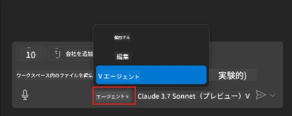
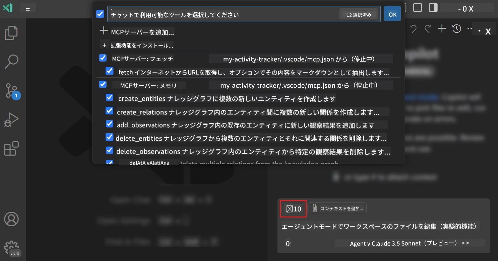
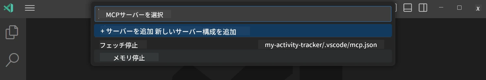
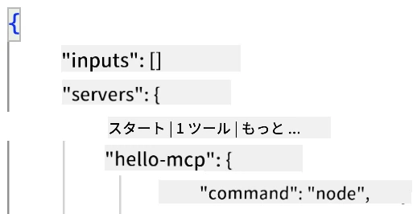
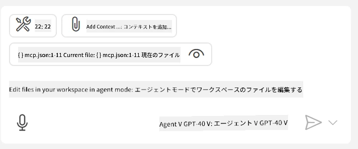
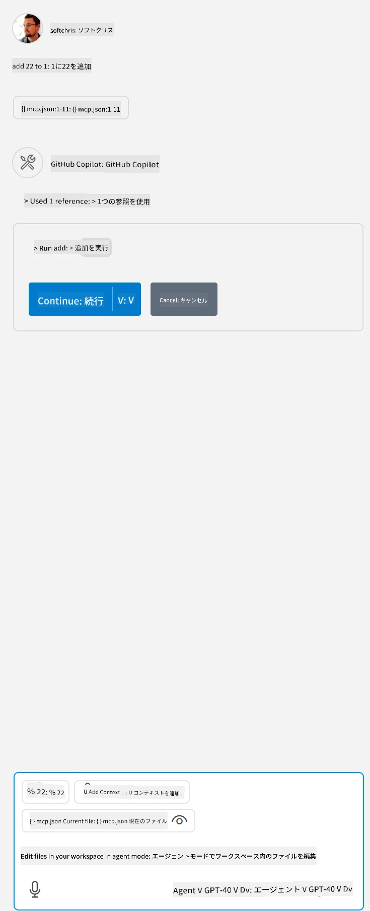

# GitHub Copilot Agentモードからサーバーを利用する

Visual Studio CodeとGitHub Copilotはクライアントとして動作し、MCPサーバーを利用することができます。それでなぜそうしたいのかと思われるかもしれませんが、それはMCPサーバーが持つ機能をIDE内から利用できることを意味します。例えばGitHubのMCPサーバーを追加すると、特定のコマンドをターミナルで打つ代わりにプロンプトでGitHubを操作できるようになります。あるいは、自然言語で制御できる開発者体験を向上させる何かを想像してください。こうした利点がお分かりいただけたでしょう？

## 概要

このレッスンでは、Visual Studio CodeとGitHub CopilotのAgentモードをクライアントとして利用してMCPサーバーを使用する方法を解説します。

## 学習目標

このレッスンの終わりまでに、以下ができるようになります：

- Visual Studio Code経由でMCPサーバーを利用する。
- GitHub Copilotを通じてツールなどの機能を実行する。
- Visual Studio Codeを設定してMCPサーバーを見つけ管理する。

## 使用方法

MCPサーバーは2つの方法で操作できます：

- ユーザーインターフェイスで、本章の後半で方法を説明します。
- ターミナルで、`code`実行ファイルを使って制御できます：

  ユーザープロファイルにMCPサーバーを追加するには、--add-mcpコマンドラインオプションを使用し、{\"name\":\"server-name\",\"command\":...}の形でJSONサーバー設定を指定します。

  ```
  code --add-mcp "{\"name\":\"my-server\",\"command\": \"uvx\",\"args\": [\"mcp-server-fetch\"]}"
  ```

### スクリーンショット





次のセクションでは、ビジュアルインターフェイスの使い方について詳しく説明します。

## アプローチ

全体の流れは次のようになります：

- MCPサーバーを見つけるためのファイルを設定する。
- サーバーを起動/接続し、機能一覧を取得する。
- その機能をGitHub Copilot Chatインターフェイスを通じて使用する。

では流れが理解できたので、Visual Studio Codeを使ってMCPサーバーを利用する演習をしてみましょう。

## 演習：サーバー利用

この演習では、Visual Studio Codeを設定してMCPサーバーを見つけ、GitHub Copilot Chatインターフェイスから利用できるようにします。

### -0- 事前準備、MCPサーバーディスカバリーの有効化

MCPサーバーのディスカバリーを有効化する必要があるかもしれません。

1. Visual Studio Codeの「ファイル -> 設定 -> 設定」に移動します。

1. 「MCP」を検索し、settings.jsonファイル内で`chat.mcp.discovery.enabled`を有効化します。

### -1- 設定ファイルを作成する

プロジェクトルートに設定ファイルを作成します。.vscodeというフォルダーにMCP.jsonという名前でファイルを配置してください。内容は次のようになります：

```text
.vscode
|-- mcp.json
```

次にサーバーエントリを追加する方法を見てみましょう。

### -2- サーバーを設定する

<em>mcp.json</em>に以下の内容を追加してください：

```json
{
    "inputs": [],
    "servers": {
       "hello-mcp": {
           "command": "node",
           "args": [
               "build/index.js"
           ]
       }
    }
}
```

上の例はNode.jsで書かれたサーバーを起動するシンプルな例です。その他のランタイムの場合は、`command`と`args`でサーバー起動用の適切なコマンドを指定してください。

### -3- サーバーを起動する

エントリを追加したので、サーバーを起動してみましょう：

1. <em>mcp.json</em>の自分のエントリを見つけ、「再生」アイコンがあることを確認します：

    

1. 「再生」アイコンをクリックすると、GitHub Copilot Chatのツールアイコンに登録ツールの数が増えたのが見えます。そのツールアイコンをクリックすると、登録済みツールの一覧が表示されます。GitHub Copilotにコンテキストとして使用させたいツールのチェック/チェック解除ができます：

  

1. ツールを実行するには、ツールの説明に合致するプロンプトを入力します。例えば、「add 22 to 1」のようなプロンプトです：

  

  23と返答が表示されるはずです。

## 課題

<em>mcp.json</em>ファイルにサーバーエントリを追加し、サーバーの起動/停止ができるか試してみてください。また、GitHub Copilot Chatインターフェイス経由でサーバーのツールと通信できることを確認してください。

## 解答例

[解答例](./solution/README.md)

## 重要ポイント

この章の重要なポイントは以下の通りです：

- Visual Studio Codeは複数のMCPサーバーとそのツールを利用する優れたクライアントです。
- GitHub Copilot Chatインターフェイスがサーバーとのやり取りの窓口です。
- APIキーのような入力をユーザーにプロンプトし、<em>mcp.json</em>のサーバーエントリ設定時にMCPサーバーに渡すことが可能です。

## サンプル

- [Java Calculator](../samples/java/calculator/README.md)
- [.Net Calculator](../../../../03-GettingStarted/samples/csharp)
- [JavaScript Calculator](../samples/javascript/README.md)
- [TypeScript Calculator](../samples/typescript/README.md)
- [Python Calculator](../../../../03-GettingStarted/samples/python)

## 追加リソース

- [Visual Studio ドキュメント](https://code.visualstudio.com/docs/copilot/chat/mcp-servers)

## 次のステップ

- 次へ: [stdioサーバーの作成](../05-stdio-server/README.md)

---

<!-- CO-OP TRANSLATOR DISCLAIMER START -->
**免責事項**：
本書類は AI 翻訳サービス [Co-op Translator](https://github.com/Azure/co-op-translator) を使用して翻訳されています。正確性を期していますが、自動翻訳には誤りや不正確な部分が含まれる可能性があることをご承知おきください。原文の原語版が正式な情報源とみなされるべきです。重要な情報については、専門の人間による翻訳を推奨します。本翻訳の利用により生じたいかなる誤解や解釈違いについても、当方は責任を負いかねます。
<!-- CO-OP TRANSLATOR DISCLAIMER END -->