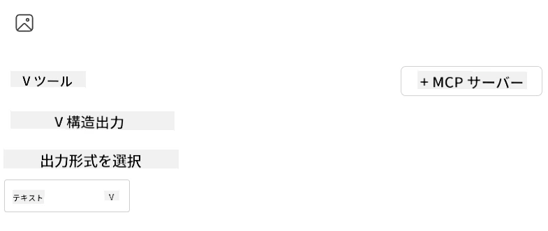

# Visual Studio Code用AI Toolkit拡張機能のサーバーを利用する

AIエージェントを構築する際、単にスマートな応答を生成するだけでなく、エージェントに行動を起こす能力を持たせることも重要です。そこで役立つのがModel Context Protocol（MCP）です。MCPはエージェントが一貫した方法で外部のツールやサービスにアクセスできるようにします。これは、エージェントを実際に使えるツールボックスに接続するようなものです。

例えば、エージェントをあなたの計算機MCPサーバーに接続すると、「47×89はいくつ？」というプロンプトを受け取るだけで数学的な計算を行えるようになります。ロジックをハードコードしたりカスタムAPIを構築したりする必要はありません。

## 概要

このレッスンでは、Visual Studio Codeの[AI Toolkit](https://aka.ms/AIToolkit)拡張機能を使って、計算機MCPサーバーをエージェントに接続し、自然言語での加算、減算、乗算、除算操作をエージェントに実行させる方法を説明します。

AI ToolkitはVisual Studio Codeの強力な拡張機能で、エージェント開発を効率化します。AIエンジニアは、ローカルでもクラウドでも生成AIモデルの開発やテストを簡単に行うことができます。この拡張は現在の主要な生成モデルのほとんどをサポートしています。

<em>注</em>: AI Toolkitは現在PythonとTypeScriptをサポートしています。

## 学習目標

このレッスンの終了時に次のことができるようになります:

- AI Toolkitを介してMCPサーバーを利用する。
- エージェント設定を構成し、MCPサーバーが提供するツールを検出・利用できるようにする。
- 自然言語を使ってMCPツールを活用する。

## アプローチ

ここでは、次の高レベルな手順で進めます:

- エージェントを作成し、そのシステムプロンプトを定義する。
- 計算機ツールを含むMCPサーバーを作成する。
- エージェントビルダーをMCPサーバーに接続する。
- 自然言語経由でエージェントのツール呼び出しをテストする。

では、流れが理解できたので、MCPによる外部ツール活用でAIエージェントの能力を強化する設定を進めましょう！

## 前提条件

- [Visual Studio Code](https://code.visualstudio.com/)
- [Visual Studio Code用AI Toolkit](https://aka.ms/AIToolkit)

## 演習：サーバーの利用

> [!WARNING]
> macOSユーザーへ：依存関係のインストールに影響する問題を現在調査中のため、現時点でこのチュートリアルはmacOSユーザーが完了できません。修正が利用可能になり次第、手順を更新します。ご理解とご協力に感謝します！

この演習では、Visual Studio Code内でAI Toolkitを使い、MCPサーバーのツールを備えたAIエージェントを構築、実行、拡張します。

### -0- 事前準備：My ModelsにOpenAI GPT-4oモデルを追加

演習では<strong>GPT-4o</strong>モデルを使用します。エージェント作成前に<strong>My Models</strong>にモデルを追加してください。


1. <strong>Activity Bar</strong>から<strong>AI Toolkit</strong>拡張機能を開きます。
1. <strong>Catalog</strong>セクションで<strong>Models</strong>を選択し、<strong>Model Catalog</strong>を開きます。これにより新しいエディタータブで<strong>Model Catalog</strong>が開きます。
1. <strong>Model Catalog</strong>の検索バーに<strong>OpenAI GPT-4o</strong>と入力します。
1. <strong>+ Add</strong>をクリックしてモデルを<strong>My Models</strong>リストに追加します。<strong>GitHubホスト</strong>のモデルを選択していることを確認してください。
1. <strong>Activity Bar</strong>で<strong>OpenAI GPT-4o</strong>モデルがリストされていることを確認します。

### -1- エージェントの作成

<strong>Agent (Prompt) Builder</strong>では自身のAIエージェントを作成・カスタマイズできます。このセクションでは新しいエージェントを作成し、会話を支えるモデルを割り当てます。


1. <strong>Activity Bar</strong>から<strong>AI Toolkit</strong>拡張機能を開きます。
1. <strong>Tools</strong>セクションで<strong>Agent (Prompt) Builder</strong>を選択します。これにより新しいエディタータブで<strong>Agent (Prompt) Builder</strong>が開きます。
1. <strong>+ New Agent</strong>ボタンをクリックします。拡張機能が<strong>Command Palette</strong>経由でセットアップウィザードを起動します。
1. 名前に<strong>Calculator Agent</strong>と入力して<strong>Enter</strong>を押します。
1. <strong>Agent (Prompt) Builder</strong>の<strong>Model</strong>フィールドで<strong>OpenAI GPT-4o (via GitHub)</strong>モデルを選択します。

### -2- エージェントのシステムプロンプト作成

エージェントが組み上がったので、次に性格や目的を定義します。このセクションでは<strong>Generate system prompt</strong>機能を使い、計算機エージェントとしての振る舞いを記述し、モデルにシステムプロンプトの生成を任せます。


1. <strong>Prompts</strong>セクションで<strong>Generate system prompt</strong>ボタンをクリックします。これはAIを利用してシステムプロンプトを生成するプロンプトビルダーを起動します。
1. <strong>Generate a prompt</strong>ウィンドウに以下を入力します： `You are a helpful and efficient math assistant. When given a problem involving basic arithmetic, you respond with the correct result.`
1. <strong>Generate</strong>ボタンをクリックします。右下に通知が表示され、システムプロンプトの生成が開始されたことが確認できます。生成が終わると、プロンプトが<strong>Agent (Prompt) Builder</strong>の<strong>System prompt</strong>欄に表示されます。
1. <strong>System prompt</strong>を確認し、必要に応じて修正します。

### -3- MCPサーバーの作成

エージェントのシステムプロンプトを定義して振る舞いを決めたので、実際の機能を持たせる段階です。このセクションでは加算、減算、乗算、除算計算を行う計算機MCPサーバーを作成します。このサーバーにより、エージェントは自然言語プロンプトに応じてリアルタイムに計算操作ができるようになります。



AI Toolkitには独自のMCPサーバーを手軽に作成できるテンプレートが用意されています。ここではPythonテンプレートを使って計算機MCPサーバーを作成します。

<em>注</em>: AI Toolkitは現在PythonとTypeScriptをサポートしています。

1. <strong>Agent (Prompt) Builder</strong>の<strong>Tools</strong>セクションで<strong>+ MCP Server</strong>ボタンをクリックします。拡張機能が<strong>Command Palette</strong>経由でセットアップウィザードを起動します。
1. <strong>+ Add Server</strong>を選択します。
1. <strong>Create a New MCP Server</strong>を選択します。
1. テンプレートとして<strong>python-weather</strong>を選択します。
1. 保存先のフォルダーに<strong>Default folder</strong>を選択します。
1. サーバー名に<strong>Calculator</strong>と入力します。
1. 新しいVisual Studio Codeウィンドウが開きます。<strong>Yes, I trust the authors</strong>を選択します。
1. ターミナル（**Terminal** > **New Terminal**）で仮想環境を作成します：`python -m venv .venv`
1. ターミナルで仮想環境を有効化します：
    1. Windows - `.venv\Scripts\activate`
    1. macOS/Linux - `source .venv/bin/activate`
1. ターミナルで依存関係をインストールします：`pip install -e .[dev]`
1. <strong>Activity Bar</strong>の<strong>Explorer</strong>ビューで<strong>src</strong>ディレクトリを展開し、<strong>server.py</strong>を選択してエディタで開きます。
1. <strong>server.py</strong>ファイルのコードを以下の内容に置き換え、保存します：

    ```python
    """
    Sample MCP Calculator Server implementation in Python.

    
    This module demonstrates how to create a simple MCP server with calculator tools
    that can perform basic arithmetic operations (add, subtract, multiply, divide).
    """
    
    from mcp.server.fastmcp import FastMCP
    
    server = FastMCP("calculator")
    
    @server.tool()
    def add(a: float, b: float) -> float:
        """Add two numbers together and return the result."""
        return a + b
    
    @server.tool()
    def subtract(a: float, b: float) -> float:
        """Subtract b from a and return the result."""
        return a - b
    
    @server.tool()
    def multiply(a: float, b: float) -> float:
        """Multiply two numbers together and return the result."""
        return a * b
    
    @server.tool()
    def divide(a: float, b: float) -> float:
        """
        Divide a by b and return the result.
        
        Raises:
            ValueError: If b is zero
        """
        if b == 0:
            raise ValueError("Cannot divide by zero")
        return a / b
    ```

### -4- 計算機MCPサーバーとともにエージェントを実行

エージェントにツールが備わったので、実際に使ってみましょう。このセクションでは、自然言語プロンプトをエージェントに送信し、計算機MCPサーバーから適切なツールが呼び出されているか検証します。


あなたのローカル開発環境上で<strong>Agent Builder</strong>をMCPクライアントとして使い、計算機MCPサーバーを実行します。

1. `F5`キーを押してMCPサーバーのデバッグを開始します。<strong>Agent (Prompt) Builder</strong>が新しいエディタータブで開きます。ターミナルにサーバーの状態が表示されます。
1. <strong>Agent (Prompt) Builder</strong>の<strong>User prompt</strong>欄に次の文を入力します：`I bought 3 items priced at $25 each, and then used a $20 discount. How much did I pay?`
1. <strong>Run</strong>ボタンをクリックしてエージェントの応答を生成します。
1. エージェントの出力を確認します。モデルは支払い額が<strong>$55</strong>と結論づけるはずです。
1. 実行される内容は次の通りです：
    - エージェントは計算の補助に<strong>multiply</strong>と<strong>subtract</strong>ツールを選択します。
    - <strong>multiply</strong>ツールに対応する`a`と`b`の値が割り当てられます。
    - <strong>subtract</strong>ツールに対応する`a`と`b`の値が割り当てられます。
    - 各ツールからの応答は対応する<strong>Tool Response</strong>に表示されます。
    - 最終的な結果は<strong>Model Response</strong>に表示されます。
1. 追加のプロンプトを送信してエージェントをテストできます。<strong>User prompt</strong>欄をクリックし、既存のプロンプトを変更して試してください。
1. テストが終わったら、<strong>terminal</strong>で<strong>CTRL/CMD+C</strong>を押してサーバーを停止できます。

## 演習課題

<strong>server.py</strong>ファイルに新しいツール（例：平方根を返すツール）を追加してみてください。新ツール（や既存ツール）を利用するプロンプトを送信し、サーバーは再起動して新しいツールを読み込むようにしてください。

## 解答例

[解答例](./solution/README.md)

## 重要ポイント

この章の重要ポイントは次の通りです：

- AI Toolkit拡張機能はMCPサーバーとそのツールを利用する優れたクライアントである。
- MCPサーバーに新しいツールを追加して、エージェントの能力を拡張できる。
- AI Toolkitには（PythonのMCPサーバーテンプレートなど）カスタムツール作成を簡素化するテンプレートが含まれている。

## 追加リソース

- [AI Toolkit ドキュメント](https://aka.ms/AIToolkit/doc)

## 次のステップ
- 次へ: [テストとデバッグ](../08-testing/README.md)

---

<!-- CO-OP TRANSLATOR DISCLAIMER START -->
**免責事項**：
本書類は AI 翻訳サービス [Co-op Translator](https://github.com/Azure/co-op-translator) を使用して翻訳されています。正確性を期していますが、自動翻訳には誤りや不正確な部分が含まれる可能性があることをご承知おきください。原文の原語版が正式な情報源とみなされるべきです。重要な情報については、専門の人間による翻訳を推奨します。本翻訳の利用により生じたいかなる誤解や解釈違いについても、当方は責任を負いかねます。
<!-- CO-OP TRANSLATOR DISCLAIMER END -->