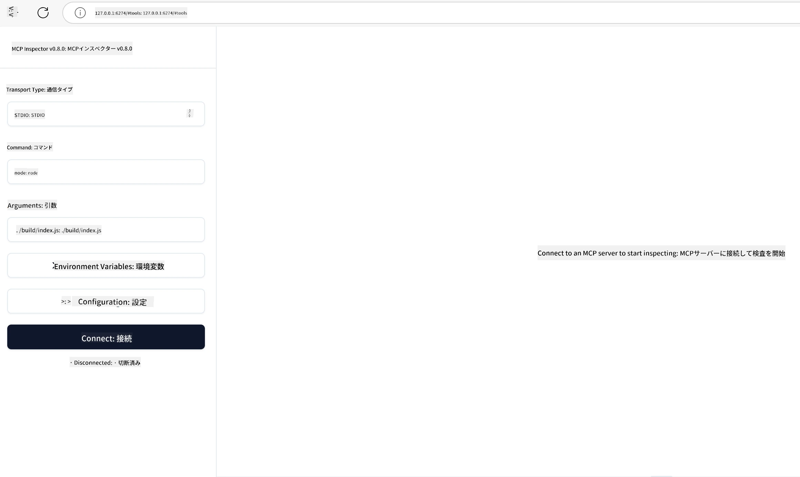

## テストとデバッグ

MCPサーバーのテストを開始する前に、利用可能なツールとデバッグのベストプラクティスを理解することが重要です。効果的なテストは、サーバーが期待通りに動作することを保証し、問題を迅速に特定して解決するのに役立ちます。以下のセクションでは、MCPの実装を検証するための推奨されるアプローチを示します。

## 概要

このレッスンでは、適切なテストのアプローチと最も効果的なテストツールの選択方法について説明します。

## 学習目標

このレッスンを終える頃には、以下ができるようになります：

- 様々なテストのアプローチを説明できること。
- 異なるツールを使用してコードを効果的にテストできること。

## MCPサーバーのテスト

MCPはサーバーのテストとデバッグに役立つツールを提供しています：

- **MCP Inspector**：CLIツールとしてもビジュアルツールとしても実行可能なコマンドラインツール。
- **手動テスト**：curlのようなツールを使用してWebリクエストを実行できますが、HTTPリクエストを実行できるツールであれば何でも可能です。
- **ユニットテスト**：好みのテストフレームワークを使用して、サーバーおよびクライアントの両方の機能をテストできます。

### MCP Inspectorの使用

このツールの使い方は以前のレッスンで説明しましたが、ここでは高レベルで簡単に説明します。このツールはNode.jsで作られており、`npx`コマンドを呼び出すことで使用できます。`npx`はツールを一時的にダウンロードしてインストールし、リクエストの実行後に自動でクリーンアップを行います。

[MCP Inspector](https://github.com/modelcontextprotocol/inspector)は以下のことができます：

- **サーバー機能の検出**：利用可能なリソース、ツール、プロンプトを自動的に検出
- **ツールの実行テスト**：異なるパラメーターを試し、リアルタイムでレスポンスを確認
- **サーバーメタデータの表示**：サーバー情報、スキーマ、設定の確認

ツールの典型的な実行例は以下の通りです：

```bash
npx @modelcontextprotocol/inspector node build/index.js
```

上記のコマンドはMCPとそのビジュアルインターフェイスを起動し、ブラウザでローカルのウェブインターフェイスを開きます。登録されたMCPサーバー、利用可能なツール、リソース、プロンプトを表示するダッシュボードが閲覧できます。インターフェイスを使ってツールの実行を対話的にテストしたり、サーバーメタデータを検査したり、リアルタイムのレスポンスを表示し、MCPサーバーの実装の検証とデバッグを容易にします。

以下はそのインターフェイスの例です： 

このツールはCLIモードでも実行可能で、その場合は`--cli`オプションを追加します。以下は、サーバー上のすべてのツールを一覧表示するCLIモードの実行例です：

```sh
npx @modelcontextprotocol/inspector --cli node build/index.js --method tools/list
```

### 手動テスト

サーバー機能をテストするためにInspectorツールを使う方法の他に、curlのようなHTTPを実行できるクライアントを使う方法があります。

curlを使うと、HTTPリクエストを通じてMCPサーバーを直接テストできます：

```bash
# 例：テストサーバーのメタデータ
curl http://localhost:3000/v1/metadata

# 例：ツールを実行する
curl -X POST http://localhost:3000/v1/tools/execute \
  -H "Content-Type: application/json" \
  -d '{"name": "calculator", "parameters": {"expression": "2+2"}}'
```

上記のcurlの使い方からわかるように、POSTリクエストを使ってツールを呼び出し、そのペイロードにはツール名とパラメーターが含まれます。ご自身に合った方法を使ってください。CLIツールは一般的に高速で使いやすく、スクリプト化にも適しているため、CI/CDの環境で役立ちます。

### ユニットテスト

ツールやリソースのユニットテストを作成し、期待通りに動作するか確認しましょう。以下はテストコードの例です。

```python
import pytest

from mcp.server.fastmcp import FastMCP
from mcp.shared.memory import (
    create_connected_server_and_client_session as create_session,
)

# モジュール全体を非同期テスト用にマークする
pytestmark = pytest.mark.anyio


async def test_list_tools_cursor_parameter():
    """Test that the cursor parameter is accepted for list_tools.

    Note: FastMCP doesn't currently implement pagination, so this test
    only verifies that the cursor parameter is accepted by the client.
    """

 server = FastMCP("test")

    # いくつかのテストツールを作成する
    @server.tool(name="test_tool_1")
    async def test_tool_1() -> str:
        """First test tool"""
        return "Result 1"

    @server.tool(name="test_tool_2")
    async def test_tool_2() -> str:
        """Second test tool"""
        return "Result 2"

    async with create_session(server._mcp_server) as client_session:
        # カーソルパラメータなしでテスト（省略）
        result1 = await client_session.list_tools()
        assert len(result1.tools) == 2

        # cursor=None でテストする
        result2 = await client_session.list_tools(cursor=None)
        assert len(result2.tools) == 2

        # 文字列としてのカーソルでテストする
        result3 = await client_session.list_tools(cursor="some_cursor_value")
        assert len(result3.tools) == 2

        # 空文字列カーソルでテストする
        result4 = await client_session.list_tools(cursor="")
        assert len(result4.tools) == 2
    
```

上記のコードは以下を行っています：

- pytestフレームワークを利用し、テストを関数として作成しassert文を用いています。
- 2つの異なるツールを持つMCPサーバーを作成しています。
- `assert`文を使って特定の条件が満たされているか確認します。

[こちら](https://github.com/modelcontextprotocol/python-sdk/blob/main/tests/client/test_list_methods_cursor.py)でファイルの全体を確認できます。

上記のファイルを参考にして、ご自身のサーバーの機能が正しく作成されているかテストしてください。

主要なSDKには類似のテストセクションがあるので、選択したランタイムに応じて調整できます。

## サンプル

- [Java Calculator](../samples/java/calculator/README.md)
- [.Net Calculator](../../../../03-GettingStarted/samples/csharp)
- [JavaScript Calculator](../samples/javascript/README.md)
- [TypeScript Calculator](../samples/typescript/README.md)
- [Python Calculator](../../../../03-GettingStarted/samples/python)

## 追加リソース

- [Python SDK](https://github.com/modelcontextprotocol/python-sdk)

## 次に進むこと

- 次： [デプロイ](../09-deployment/README.md)

---

<!-- CO-OP TRANSLATOR DISCLAIMER START -->
**免責事項**：  
本書類はAI翻訳サービス「Co-op Translator」（https://github.com/Azure/co-op-translator）を使用して翻訳されています。正確性の向上に努めておりますが、自動翻訳には誤りや不正確な箇所が含まれる可能性があります。原文の言語で記載された文書が正式な情報源として優先されるべきです。重要な情報については、専門の人間による翻訳を推奨いたします。本翻訳の利用によって生じた誤解や誤訳に関して、当方は一切の責任を負いかねます。
<!-- CO-OP TRANSLATOR DISCLAIMER END -->