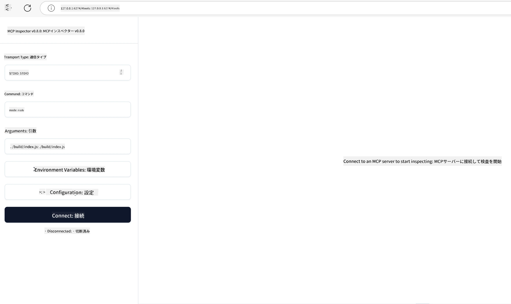

## テストとデバッグ

MCPサーバーのテストを始める前に、利用可能なツールとデバッグのベストプラクティスを理解することが重要です。効果的なテストはサーバーが期待通りに動作することを保証し、問題を迅速に特定して解決するのに役立ちます。以下のセクションではMCPの実装を検証するための推奨される方法について説明します。

## 概要

このレッスンでは、適切なテストアプローチの選択方法と最も効果的なテストツールについて取り上げます。

## 学習目標

このレッスンの終了時には、以下ができるようになります：

- さまざまなテストアプローチを説明する。
- 異なるツールを使って効果的にコードをテストする。


## MCPサーバーのテスト

MCPはサーバーのテストとデバッグを支援するツールを提供しています：

- **MCP Inspector**：CLIツールとしてもビジュアルツールとしても実行できるコマンドラインツール。
- <strong>マニュアルテスト</strong>：curlのようなHTTPリクエストを実行できるツールを使えますが、HTTPを実行できるツールなら何でも構いません。
- <strong>ユニットテスト</strong>：好きなテストフレームワークを使ってサーバーとクライアントの機能をテストすることが可能です。

### MCP Inspectorの使用方法

このツールの使い方は前のレッスンで説明しましたが、ここでは概略に触れます。Node.jsで作られており、`npx`実行ファイルを呼び出すことで使用できます。これによりツール自体が一時的にダウンロードおよびインストールされ、実行後に自動的に片付けられます。

[MCP Inspector](https://github.com/modelcontextprotocol/inspector)は以下のことを支援します：

- <strong>サーバー機能の発見</strong>：利用可能なリソース、ツール、プロンプトを自動検出
- <strong>ツールの実行テスト</strong>：異なるパラメータを試し、リアルタイムで応答を見ることが可能
- <strong>サーバーメタデータの表示</strong>：サーバー情報、スキーマ、設定を調査

ツールの典型的な実行例は以下の通りです：

```bash
npx @modelcontextprotocol/inspector node build/index.js
```

上記のコマンドはMCPとそのビジュアルインターフェイスを起動し、ブラウザでローカルのウェブインターフェイスを立ち上げます。ダッシュボードには登録済みのMCPサーバー、その利用可能なツール、リソース、プロンプトが表示されます。インターフェイスはツールの実行をインタラクティブにテストし、サーバーメタデータの検査やリアルタイムの応答確認を可能にし、MCPサーバーの実装検証とデバッグを容易にします。

以下のように表示されます： 

このツールはCLIモードでも実行可能で、その場合は`--cli`属性を追加します。以下はツールを"CLI"モードで実行し、サーバー上の全ツールを一覧表示する例です：

```sh
npx @modelcontextprotocol/inspector --cli node build/index.js --method tools/list
```

### マニュアルテスト

インスペクターツールを使ってサーバーの機能をテストする以外に、curlのようなHTTPを使えるクライアントを実行する方法もあります。

curlを使えばHTTPリクエストで直接MCPサーバーをテストできます：

```bash
# 例：テストサーバのメタデータ
curl http://localhost:3000/v1/metadata

# 例：ツールを実行する
curl -X POST http://localhost:3000/v1/tools/execute \
  -H "Content-Type: application/json" \
  -d '{"name": "calculator", "parameters": {"expression": "2+2"}}'
```

上のcurlの使用例からわかるように、ツールの名前とそのパラメータを含むペイロードでPOSTリクエストを送ってツールを呼び出します。自分に合った方法を使ってください。CLIツールは一般に高速で使いやすく、スクリプト化に向いており、CI/CD環境で役立ちます。

### ユニットテスト

ツールとリソースが期待通りに動作することを確認するためにユニットテストを作成しましょう。以下はテストコードの例です。

```python
import pytest

from mcp.server.fastmcp import FastMCP
from mcp.shared.memory import (
    create_connected_server_and_client_session as create_session,
)

# モジュール全体を非同期テスト用にマークする
pytestmark = pytest.mark.anyio


async def test_list_tools_cursor_parameter():
    """Test that the cursor parameter is accepted for list_tools.

    Note: FastMCP doesn't currently implement pagination, so this test
    only verifies that the cursor parameter is accepted by the client.
    """

 server = FastMCP("test")

    # いくつかのテストツールを作成する
    @server.tool(name="test_tool_1")
    async def test_tool_1() -> str:
        """First test tool"""
        return "Result 1"

    @server.tool(name="test_tool_2")
    async def test_tool_2() -> str:
        """Second test tool"""
        return "Result 2"

    async with create_session(server._mcp_server) as client_session:
        # カーソルパラメータなしでテスト（省略）
        result1 = await client_session.list_tools()
        assert len(result1.tools) == 2

        # cursor=Noneでテストする
        result2 = await client_session.list_tools(cursor=None)
        assert len(result2.tools) == 2

        # 文字列としてのカーソルでテストする
        result3 = await client_session.list_tools(cursor="some_cursor_value")
        assert len(result3.tools) == 2

        # 空文字列のカーソルでテストする
        result4 = await client_session.list_tools(cursor="")
        assert len(result4.tools) == 2
    
```

上記のコードで行っていることは以下の通りです：

- pytestフレームワークを利用しており、関数としてテストを作成しassert文を使います。
- 2つの異なるツールを持つMCPサーバーを作成します。
- `assert`文を使って一定の条件が満たされていることを確認します。

[こちらのファイル全体](https://github.com/modelcontextprotocol/python-sdk/blob/main/tests/client/test_list_methods_cursor.py)も参照してください。

上記ファイル例に基づいて自身のサーバーをテストし、機能が正しく作成されているか確認できます。

主要なSDKには同様のテスト用セクションがあるので、使用しているランタイムに合わせて調整してください。

## サンプル

- [Java Calculator](../samples/java/calculator/README.md)
- [.Net Calculator](../../../../03-GettingStarted/samples/csharp)
- [JavaScript Calculator](../samples/javascript/README.md)
- [TypeScript Calculator](../samples/typescript/README.md)
- [Python Calculator](../../../../03-GettingStarted/samples/python)

## 追加リソース

- [Python SDK](https://github.com/modelcontextprotocol/python-sdk)

## 次に進む

- 次： [デプロイメント](../09-deployment/README.md)

---

<!-- CO-OP TRANSLATOR DISCLAIMER START -->
**免責事項**：
本書類は AI 翻訳サービス [Co-op Translator](https://github.com/Azure/co-op-translator) を使用して翻訳されています。正確性を期していますが、自動翻訳には誤りや不正確な部分が含まれる可能性があることをご承知おきください。原文の原語版が正式な情報源とみなされるべきです。重要な情報については、専門の人間による翻訳を推奨します。本翻訳の利用により生じたいかなる誤解や解釈違いについても、当方は責任を負いかねます。
<!-- CO-OP TRANSLATOR DISCLAIMER END -->