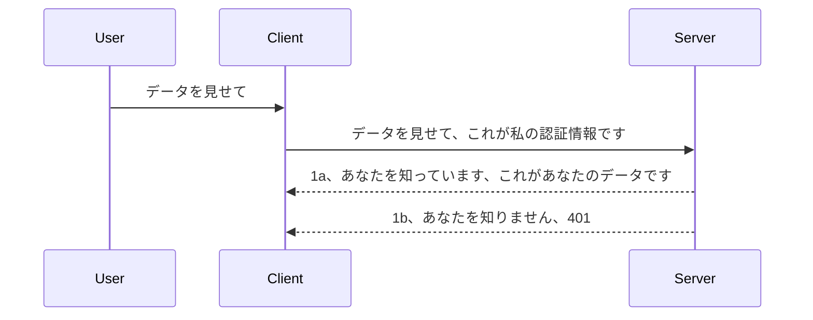

# シンプルな認証

MCP SDKはOAuth 2.1の使用をサポートしていますが、率直に言ってこれは認証サーバー、リソースサーバー、資格情報の送信、コードの取得、そのコードをベアラートークンと交換し、最終的にリソースデータを取得するというように非常に複雑なプロセスを伴います。OAuthに慣れていない場合は（実装するにあたって素晴らしい方法ですが）、基本的な認証レベルから始めて徐々により高度なセキュリティに向かって構築していくことをお勧めします。だからこの章があり、より高度な認証へと導くことが目的です。

## 認証、何を意味するのか？

認証とは「Authentication」と「Authorization」の省略です。ここで必要なのは次の2つのことです：

- **認証（Authentication）**：誰かが私たちの家に入ることを許可するかどうかを判断するプロセス、つまり、MCPサーバーの機能があるリソースサーバーへのアクセス権を持っているかを確認することです。
- **認可（Authorization）**：ユーザーが要求している特定のリソース、例えば注文や商品に対してアクセス権があるか、別の例でいうと内容を読むことは許されているが削除は許されていないといったアクセスレベルの判定プロセスです。

## 資格情報：システムに自分が誰であるかを伝える方法

多くのウェブ開発者は通常、サーバーに資格情報を提供すると考えます。通常は、「ここにいる許可があるかどうか」を示す秘密情報です。この資格情報は通常、ユーザー名とパスワードのbase64エンコード版か、特定のユーザーを一意に識別するAPIキーです。

これを以下のように「Authorization」というヘッダーで送信します：

```json
{ "Authorization": "secret123" }
```

これは通常ベーシック認証と呼ばれます。全体的なフローは以下のように動きます：


フローの仕組みがわかったので、実装はどうすればいいでしょう？多くのウェブサーバーには「ミドルウェア」という概念があり、これはリクエストの一部として動作し資格情報を検証できます。資格情報が有効であればリクエストを通過させ、無効であれば認証エラーを返します。以下はその実装例です。

**Python**

```python
class AuthMiddleware(BaseHTTPMiddleware):
    async def dispatch(self, request, call_next):

        has_header = request.headers.get("Authorization")
        if not has_header:
            print("-> Missing Authorization header!")
            return Response(status_code=401, content="Unauthorized")

        if not valid_token(has_header):
            print("-> Invalid token!")
            return Response(status_code=403, content="Forbidden")

        print("Valid token, proceeding...")
       
        response = await call_next(request)
        # 追加のカスタマーヘッダーやレスポンスの何らかの変更を加える
        return response


starlette_app.add_middleware(CustomHeaderMiddleware)
```

ここでは：

- `AuthMiddleware` というミドルウェアを作成し、その `dispatch` メソッドがウェブサーバーから呼び出されます。
- ミドルウェアをウェブサーバーに追加します：

    ```python
    starlette_app.add_middleware(AuthMiddleware)
    ```

- Authorizationヘッダーが存在し、送られた秘密情報が有効かどうかを検証するロジックを書きました：

    ```python
    has_header = request.headers.get("Authorization")
    if not has_header:
        print("-> Missing Authorization header!")
        return Response(status_code=401, content="Unauthorized")

    if not valid_token(has_header):
        print("-> Invalid token!")
        return Response(status_code=403, content="Forbidden")
    ```

    秘密情報が存在し有効であれば、`call_next` を呼び出してリクエストの通過を許可し、そのレスポンスを返します。

    ```python
    response = await call_next(request)
    # 任意のカスタムヘッダーを追加するか、レスポンスの何らかの変更を行う
    return response
    ```

この仕組みでは、ウェブリクエストがサーバーに送られるとミドルウェアが呼び出され、実装に基づいてリクエストを通過させるか、クライアントが許可されていないことを示すエラーを返します。

**TypeScript**

ここでは人気のフレームワークExpressでミドルウェアを作成し、リクエストがMCPサーバーに到達する前にインターセプトしています。コードは以下の通りです：

```typescript
function isValid(secret) {
    return secret === "secret123";
}

app.use((req, res, next) => {
    // 1. Authorizationヘッダーが存在しますか？
    if(!req.headers["Authorization"]) {
        res.status(401).send('Unauthorized');
    }
    
    let token = req.headers["Authorization"];

    // 2. 有効性を確認します。
    if(!isValid(token)) {
        res.status(403).send('Forbidden');
    }

   
    console.log('Middleware executed');
    // 3. リクエストをリクエストパイプラインの次のステップに渡します。
    next();
});
```

このコードでは：

1. まずAuthorizationヘッダーがあるか確認し、なければ401エラーを返します。
2. 資格情報/トークンが有効かを確認し、無ければ403エラーを返します。
3. 最後にリクエストをリクエストパイプラインに渡し、求められたリソースを返します。

## 演習：認証の実装

知識を活かして実装してみましょう。計画は以下のとおりです：

サーバー

- ウェブサーバーとMCPインスタンスを作成する
- サーバー用のミドルウェアを実装する

クライアント

- ヘッダー経由で資格情報を含むウェブリクエストを送信する

### -1- ウェブサーバーとMCPインスタンスを作成する

最初のステップでは、ウェブサーバーのインスタンスとMCPサーバーを作成します。

**Python**

ここではMCPサーバーのインスタンスを作成し、starletteウェブアプリを作成しuvicornでホストします。

```python
# MCPサーバーを作成中

app = FastMCP(
    name="MCP Resource Server",
    instructions="Resource Server that validates tokens via Authorization Server introspection",
    host=settings["host"],
    port=settings["port"],
    debug=True
)

# starletteウェブアプリを作成中
starlette_app = app.streamable_http_app()

# uvicorn経由でアプリを提供中
async def run(starlette_app):
    import uvicorn
    config = uvicorn.Config(
            starlette_app,
            host=app.settings.host,
            port=app.settings.port,
            log_level=app.settings.log_level.lower(),
        )
    server = uvicorn.Server(config)
    await server.serve()

run(starlette_app)
```

このコードで：

- MCPサーバーを作成します。
- MCPサーバーからstarletteウェブアプリを構築します（`app.streamable_http_app()`）。
- uvicornでウェブアプリをホストしサーブします（`server.serve()`）。

**TypeScript**

ここではMCPサーバーのインスタンスを作成します。

```typescript
const server = new McpServer({
      name: "example-server",
      version: "1.0.0"
    });

    // ... サーバーのリソース、ツール、およびプロンプトを設定します ...
```

このMCPサーバー作成はPOST /mcpルート定義内で行う必要があるため、上記コードを以下のように移動します：

```typescript
import express from "express";
import { randomUUID } from "node:crypto";
import { McpServer } from "@modelcontextprotocol/sdk/server/mcp.js";
import { StreamableHTTPServerTransport } from "@modelcontextprotocol/sdk/server/streamableHttp.js";
import { isInitializeRequest } from "@modelcontextprotocol/sdk/types.js"

const app = express();
app.use(express.json());

// セッションIDごとにトランスポートを保存するマップ
const transports: { [sessionId: string]: StreamableHTTPServerTransport } = {};

// クライアントからサーバーへの通信のPOSTリクエストを処理する
app.post('/mcp', async (req, res) => {
  // 既存のセッションIDをチェックする
  const sessionId = req.headers['mcp-session-id'] as string | undefined;
  let transport: StreamableHTTPServerTransport;

  if (sessionId && transports[sessionId]) {
    // 既存のトランスポートを再利用する
    transport = transports[sessionId];
  } else if (!sessionId && isInitializeRequest(req.body)) {
    // 新しい初期化リクエスト
    transport = new StreamableHTTPServerTransport({
      sessionIdGenerator: () => randomUUID(),
      onsessioninitialized: (sessionId) => {
        // セッションIDごとにトランスポートを保存する
        transports[sessionId] = transport;
      },
      // DNSリバインディング保護は後方互換性のためデフォルトで無効になっています。このサーバーを
      // ローカルで実行している場合は、必ず以下を設定してください：
      // enableDnsRebindingProtection: true,
      // allowedHosts: ['127.0.0.1'],
    });

    // クローズ時にトランスポートをクリーンアップする
    transport.onclose = () => {
      if (transport.sessionId) {
        delete transports[transport.sessionId];
      }
    };
    const server = new McpServer({
      name: "example-server",
      version: "1.0.0"
    });

    // ... サーバーのリソース、ツール、およびプロンプトを設定する ...

    // MCPサーバーに接続する
    await server.connect(transport);
  } else {
    // 不正なリクエスト
    res.status(400).json({
      jsonrpc: '2.0',
      error: {
        code: -32000,
        message: 'Bad Request: No valid session ID provided',
      },
      id: null,
    });
    return;
  }

  // リクエストを処理する
  await transport.handleRequest(req, res, req.body);
});

// GETおよびDELETEリクエスト用の再利用可能なハンドラー
const handleSessionRequest = async (req: express.Request, res: express.Response) => {
  const sessionId = req.headers['mcp-session-id'] as string | undefined;
  if (!sessionId || !transports[sessionId]) {
    res.status(400).send('Invalid or missing session ID');
    return;
  }
  
  const transport = transports[sessionId];
  await transport.handleRequest(req, res);
};

// SSEを介したサーバーからクライアントへの通知のGETリクエストを処理する
app.get('/mcp', handleSessionRequest);

// セッション終了のDELETEリクエストを処理する
app.delete('/mcp', handleSessionRequest);

app.listen(3000);
```

`app.post("/mcp")` 内にMCPサーバー作成コードが移動したことがわかります。

次に進み、ミドルウェアを作成して受信資格情報を検証できるようにしましょう。

### -2- サーバー用のミドルウェアを実装する

次にミドルウェア部分を見ていきます。ここでは `Authorization` ヘッダーの資格情報を探し検証するミドルウェアを作成します。有効ならリクエストは進み、リクエストされたMCP機能（例：ツールのリスト表示、リソースの読み込みなど）を実行します。

**Python**

ミドルウェアを作成するには `BaseHTTPMiddleware` を継承したクラスを作る必要があります。興味深いのは次の2つです：

- リクエスト `request` 、ヘッダー情報をここから読み取ります。
- `call_next` 、受け入れた資格情報を持つクライアントのために呼び出すコールバック。

まず、`Authorization`ヘッダーがない場合の処理：

```python
has_header = request.headers.get("Authorization")

# ヘッダーが存在しない場合は401で失敗し、それ以外は先に進みます。
if not has_header:
    print("-> Missing Authorization header!")
    return Response(status_code=401, content="Unauthorized")
```

認証失敗なので401 Unauthorizedメッセージを返します。

次に資格情報が送信された場合、有効か検証します：

```python
 if not valid_token(has_header):
    print("-> Invalid token!")
    return Response(status_code=403, content="Forbidden")
```

ここで403 Forbiddenメッセージを送っているのに注目してください。以下が上記処理をすべて含む完全なミドルウェア例です：

```python
class AuthMiddleware(BaseHTTPMiddleware):
    async def dispatch(self, request, call_next):

        has_header = request.headers.get("Authorization")
        if not has_header:
            print("-> Missing Authorization header!")
            return Response(status_code=401, content="Unauthorized")

        if not valid_token(has_header):
            print("-> Invalid token!")
            return Response(status_code=403, content="Forbidden")

        print("Valid token, proceeding...")
        print(f"-> Received {request.method} {request.url}")
        response = await call_next(request)
        response.headers['Custom'] = 'Example'
        return response

```

良いですね。しかし `valid_token` 関数は？以下に示します。

```python
# 本番環境で使用しないでください - 改善してください！！
def valid_token(token: str) -> bool:
    # 「Bearer 」のプレフィックスを削除してください
    if token.startswith("Bearer "):
        token = token[7:]
        return token == "secret-token"
    return False
```

もちろんこれは改善すべきです。

重要：これらの秘密はコード内に絶対に直書きしてはいけません。理想的にはデータソースかIDP（IdP＝アイデンティティサービスプロバイダー）から検証値を取得し、さらに良いのはIDPに検証を任せることです。

**TypeScript**

Expressでこれを実装するにはミドルウェア関数を受け取る `use` メソッドを呼び出します。

やるべきこと：

- リクエスト変数を使い `Authorization` プロパティの資格情報をチェック。
- 資格情報を検証し、有効ならリクエストを続行し、クライアントのMCP要求が機能するようにする（例：ツールのリスト、リソース読取など）。

まずAuthorizationヘッダーがあるか確認し、なければリクエストを止めているコード：

```typescript
if(!req.headers["authorization"]) {
    res.status(401).send('Unauthorized');
    return;
}
```

ヘッダーがなければ401を受け取ります。

次に資格情報の有効性をチェックし、無効なら違うメッセージでリクエストを止めます：

```typescript
if(!isValid(token)) {
    res.status(403).send('Forbidden');
    return;
} 
```

403エラーになるのがわかります。

以下はフルコードです：

```typescript
app.use((req, res, next) => {
    console.log('Request received:', req.method, req.url, req.headers);
    console.log('Headers:', req.headers["authorization"]);
    if(!req.headers["authorization"]) {
        res.status(401).send('Unauthorized');
        return;
    }
    
    let token = req.headers["authorization"];

    if(!isValid(token)) {
        res.status(403).send('Forbidden');
        return;
    }  

    console.log('Middleware executed');
    next();
});
```

上記のようにウェブサーバーにミドルウェアを受け入れさせ、クライアントが送信するはずの資格情報をチェックしています。クライアント側はどうでしょう？

### -3- ヘッダー経由で資格情報を含むウェブリクエストを送信する

クライアントが資格情報をヘッダーに含めて送っていることを確実にする必要があります。MCPクライアントを使うのでその手順を確認します。

**Python**

クライアント側では以下のように資格情報を含むヘッダーを渡します：

```python
# 値をハードコードしないでください。最低でも環境変数やより安全なストレージに保管してください。
token = "secret-token"

async with streamablehttp_client(
        url = f"http://localhost:{port}/mcp",
        headers = {"Authorization": f"Bearer {token}"}
    ) as (
        read_stream,
        write_stream,
        session_callback,
    ):
        async with ClientSession(
            read_stream,
            write_stream
        ) as session:
            await session.initialize()
      
            # TODO、クライアントで行いたいこと、例：ツールの一覧表示、ツールの呼び出しなど。
```

`headers = {"Authorization": f"Bearer {token}"}` のように `headers` をセットしていることに注目してください。

**TypeScript**

2ステップで実現できます：

1. 資格情報を含む設定オブジェクトを作成
2. トランスポートに設定オブジェクトを渡す

```typescript

// ここに示されているように値をハードコードしないでください。最低でも環境変数として持ち、開発モードではdotenvのようなものを使用してください。
let token = "secret123"

// クライアントのトランスポートオプションオブジェクトを定義する
let options: StreamableHTTPClientTransportOptions = {
  sessionId: sessionId,
  requestInit: {
    headers: {
      "Authorization": "secret123"
    }
  }
};

// オプションオブジェクトをトランスポートに渡す
async function main() {
   const transport = new StreamableHTTPClientTransport(
      new URL(serverUrl),
      options
   );
```

上記のように `options` オブジェクトを作成し、ヘッダーを `requestInit` プロパティに入れました。

重要：ここからどう改善するか？現在の実装には問題があります。まず、このように資格情報を渡すのはHTTPSを最低限使用しないと非常にリスクがあります。それでも資格情報は盗まれる可能性があり、トークンを簡単に取り消せたり、発信元地域の判断、リクエスト頻度（ボット的動作）等のチェックができる体制が必要です。つまり問題はたくさんあります。

とはいえ、認証なしにAPIを呼ばれるのは避けたい非常にシンプルなAPIにはここまでの実装は良い出発点です。

そこでセキュリティを強化するために、JSON Web Token（JWT）と呼ばれる標準的なフォーマットの利用を試してみましょう。

## JSON Web Tokens、JWT

つまり非常に単純な資格情報から改善を試みます。JWTを採用するとすぐに得られる改善点は：

- **セキュリティの向上**。基本認証（Basic Auth）ではユーザー名とパスワードをbase64エンコードしたトークンを毎回送信します（またはAPIキーを送信）。これがリスクを高めます。JWTではユーザー名とパスワードを送ってトークンを受け取り、それは時間制限付きで期限切れになります。JWTを使うとロール、スコープ、権限を用いたきめ細かなアクセス制御も簡単にできます。
- **ステートレス性とスケーラビリティ**。JWTは自己完結型でユーザー情報を含み、サーバー側のセッションストレージ不要となります。トークンはローカルでも検証可能です。
- **相互運用性とフェデレーション**。JWTはOpen ID Connectの中核で、Entra ID、Google Identity、Auth0などのIDプロバイダーで使われています。シングルサインオンも可能にするなど企業利用に耐えうる機能です。
- **モジュール性と柔軟性**。JWTはAzure API ManagementやNGINXなどのAPIゲートウェイでも使えます。認証シナリオやサービス間通信、委任やなりすましシナリオもサポートします。
- **パフォーマンスとキャッシュ**。JWTはデコード後のキャッシュが可能で解析頻度を減らし、高トラフィックアプリでスループット向上やサーバー負荷削減に役立ちます。
- **高度機能**。イントロスペクション（サーバー側で有効性検証）や無効化（トークン破棄）もサポートします。

これら全ての利点を踏まえ、実装を次のレベルへ進めてみましょう。

## ベーシック認証からJWTへ

大まかな変更点は：

- **JWTトークンの構築方法を学ぶ**、クライアントからサーバーへ送信準備をする。
- **JWTの検証**、有効ならばクライアントにリソースを提供。
- **トークンの安全な保管**。どのように保存するか。
- **ルートの保護**。我々の場合は特定のMCP機能やルートを保護する。
- **リフレッシュトークン追加**。短命トークンと長命リフレッシュトークンを作り、期限切れ時に新トークン取得可能に。リフレッシュエンドポイントと回転戦略も必要。

### -1- JWTトークンを構築する

まずJWTトークンは次のパーツから成ります：

- **ヘッダー**：使用アルゴリズムとトークンタイプ
- **ペイロード**：請求（claims）、例えばsub（トークン対象のユーザーやエンティティ。認証場面では通常ユーザーID）、exp（有効期限）、role（役割）
- **署名**：秘密鍵または秘密で署名

これを構築してエンコードされたトークンを作ります。

**Python**

```python

import jwt
import jwt
from jwt.exceptions import ExpiredSignatureError, InvalidTokenError
import datetime

# JWTの署名に使用される秘密鍵
secret_key = 'your-secret-key'

header = {
    "alg": "HS256",
    "typ": "JWT"
}

# ユーザー情報とそのクレームおよび有効期限
payload = {
    "sub": "1234567890",               # サブジェクト（ユーザーID）
    "name": "User Userson",                # カスタムクレーム
    "admin": True,                     # カスタムクレーム
    "iat": datetime.datetime.utcnow(),# 発行日時
    "exp": datetime.datetime.utcnow() + datetime.timedelta(hours=1)  # 有効期限
}

# エンコードする
encoded_jwt = jwt.encode(payload, secret_key, algorithm="HS256", headers=header)
```

コードでは：

- ヘッダーにHS256アルゴリズムとJWTタイプを指定。
- ペイロードに主題（ユーザーID）、ユーザー名、役割、発行日時、有効期限を含め時間制限を実装。

**TypeScript**

JWTトークン作成に役立つ依存ライブラリが必要です。

依存関係

```sh

npm install jsonwebtoken
npm install --save-dev @types/jsonwebtoken
```

準備できたらヘッダーとペイロードを作り、トークンをエンコードします。

```typescript
import jwt from 'jsonwebtoken';

const secretKey = 'your-secret-key'; // 本番環境で環境変数を使用する

// ペイロードを定義する
const payload = {
  sub: '1234567890',
  name: 'User usersson',
  admin: true,
  iat: Math.floor(Date.now() / 1000), // 発行日時
  exp: Math.floor(Date.now() / 1000) + 60 * 60 // 1時間で有効期限切れ
};

// ヘッダーを定義する（オプション、jsonwebtokenがデフォルトを設定）
const header = {
  alg: 'HS256',
  typ: 'JWT'
};

// トークンを作成する
const token = jwt.sign(payload, secretKey, {
  algorithm: 'HS256',
  header: header
});

console.log('JWT:', token);
```

このトークンは：

- HS256で署名
- 有効期限は1時間
- sub、name、admin、iat、expなどの請求を含む

### -2- トークンを検証する

トークン検証はサーバー側で行い、クライアントが送ってきたものが正当かどうか確認します。構造の検証や有効性の他、ユーザーが自システムに存在し権限を持っているかなど他検証も推奨されます。

トークン検証はデコードして読み取り、検証します。

**Python**

```python

# JWTをデコードして検証する
try:
    decoded = jwt.decode(token, secret_key, algorithms=["HS256"])
    print("✅ Token is valid.")
    print("Decoded claims:")
    for key, value in decoded.items():
        print(f"  {key}: {value}")
except ExpiredSignatureError:
    print("❌ Token has expired.")
except InvalidTokenError as e:
    print(f"❌ Invalid token: {e}")

```

このコードでは `jwt.decode` をトークン、秘密鍵、アルゴリズム指定で呼びます。検証失敗は例外となるためtry-catchで例外処理しています。

**TypeScript**

`jwt.verify` を呼び、デコードしたトークンを取得し更なる解析をします。失敗すればトークンが不正または期限切れです。

```typescript

try {
  const decoded = jwt.verify(token, secretKey);
  console.log('Decoded Payload:', decoded);
} catch (err) {
  console.error('Token verification failed:', err);
}
```

注意：前述のように、このトークンが自システムのユーザーを指しているか、そのユーザーに請求された権利があるか追加チェックすべきです。

次にロールベースアクセス制御（RBAC）について見ていきます。
## 役割ベースのアクセス制御の追加

異なる役割が異なる権限を持つことを表現したいという考えです。例えば、管理者はすべての操作ができ、一般ユーザーは読み取り/書き込みができ、ゲストは読み取りのみができると仮定します。したがって、次のような権限レベルが考えられます：

- Admin.Write  
- User.Read  
- Guest.Read  

このような制御をミドルウェアでどのように実装できるか見てみましょう。ミドルウェアはルートごとに追加することも全ルートに対して追加することもできます。

**Python**

```python
from starlette.middleware.base import BaseHTTPMiddleware
from starlette.responses import JSONResponse
import jwt

# コード内に秘密情報を含めないでください。これはデモンストレーション用です。安全な場所から読み取ってください。
SECRET_KEY = "your-secret-key" # これを環境変数に入れてください
REQUIRED_PERMISSION = "User.Read"

class JWTPermissionMiddleware(BaseHTTPMiddleware):
    async def dispatch(self, request, call_next):
        auth_header = request.headers.get("Authorization")
        if not auth_header or not auth_header.startswith("Bearer "):
            return JSONResponse({"error": "Missing or invalid Authorization header"}, status_code=401)

        token = auth_header.split(" ")[1]
        try:
            decoded = jwt.decode(token, SECRET_KEY, algorithms=["HS256"])
        except jwt.ExpiredSignatureError:
            return JSONResponse({"error": "Token expired"}, status_code=401)
        except jwt.InvalidTokenError:
            return JSONResponse({"error": "Invalid token"}, status_code=401)

        permissions = decoded.get("permissions", [])
        if REQUIRED_PERMISSION not in permissions:
            return JSONResponse({"error": "Permission denied"}, status_code=403)

        request.state.user = decoded
        return await call_next(request)


```
  
以下のようにミドルウェアを追加するいくつかの方法があります：

```python

# 代替案1：starletteアプリを構築する際にミドルウェアを追加する
middleware = [
    Middleware(JWTPermissionMiddleware)
]

app = Starlette(routes=routes, middleware=middleware)

# 代替案2：starletteアプリがすでに構築された後にミドルウェアを追加する
starlette_app.add_middleware(JWTPermissionMiddleware)

# 代替案3：ルートごとにミドルウェアを追加する
routes = [
    Route(
        "/mcp",
        endpoint=..., # ハンドラー
        middleware=[Middleware(JWTPermissionMiddleware)]
    )
]
```
  
**TypeScript**  

`app.use` を使って全リクエストに対して実行されるミドルウェアを使うことができます。

```typescript
app.use((req, res, next) => {
    console.log('Request received:', req.method, req.url, req.headers);
    console.log('Headers:', req.headers["authorization"]);

    // 1. 認証ヘッダーが送信されているか確認する

    if(!req.headers["authorization"]) {
        res.status(401).send('Unauthorized');
        return;
    }
    
    let token = req.headers["authorization"];

    // 2. トークンが有効かどうか確認する
    if(!isValid(token)) {
        res.status(403).send('Forbidden');
        return;
    }  

    // 3. トークンのユーザーがシステム内に存在するか確認する
    if(!isExistingUser(token)) {
        res.status(403).send('Forbidden');
        console.log("User does not exist");
        return;
    }
    console.log("User exists");

    // 4. トークンが正しい権限を持っているか検証する
    if(!hasScopes(token, ["User.Read"])){
        res.status(403).send('Forbidden - insufficient scopes');
    }

    console.log("User has required scopes");

    console.log('Middleware executed');
    next();
});

```
  
ミドルウェアにやらせること、そしてミドルウェアが必ずやるべきことはいくつかあります：

1. 認可ヘッダーが存在するかチェックする  
2. トークンが有効かどうかチェックする。JWTトークンの整合性と有効性をチェックする `isValid` メソッドを呼びます。  
3. ユーザーがシステムに存在するか確認する。これは必ず確認すべきです。

   ```typescript
    // DB内のユーザー
   const users = [
     "user1",
     "User usersson",
   ]

   function isExistingUser(token) {
     let decodedToken = verifyToken(token);

     // TODO、ユーザーがDBに存在するか確認する
     return users.includes(decodedToken?.name || "");
   }
   ```
  
　上記では非常にシンプルな `users` リストを作成していますが、これは当然データベース内にあるべきものです。

4. さらに、トークンが正しい権限を持っているかも確認すべきです。

   ```typescript
   if(!hasScopes(token, ["User.Read"])){
        res.status(403).send('Forbidden - insufficient scopes');
   }
   ```
  
　上記のミドルウェアのコードでは、トークンが User.Read 権限を持っているかをチェックしており、持っていなければ 403 エラーを返します。以下は `hasScopes` ヘルパーメソッドです。

   ```typescript
   function hasScopes(scope: string, requiredScopes: string[]) {
     let decodedToken = verifyToken(scope);
    return requiredScopes.every(scope => decodedToken?.scopes.includes(scope));
  }  
   ```

Have a think which additional checks you should be doing, but these are the absolute minimum of checks you should be doing.

Using Express as a web framework is a common choice. There are helpers library when you use JWT so you can write less code.

- `express-jwt`, helper library that provides a middleware that helps decode your token.
- `express-jwt-permissions`, this provides a middleware `guard` that helps check if a certain permission is on the token.

Here's what these libraries can look like when used:

```typescript
const express = require('express');
const jwt = require('express-jwt');
const guard = require('express-jwt-permissions')();

const app = express();
const secretKey = 'your-secret-key'; // put this in env variable

// Decode JWT and attach to req.user
app.use(jwt({ secret: secretKey, algorithms: ['HS256'] }));

// Check for User.Read permission
app.use(guard.check('User.Read'));

// multiple permissions
// app.use(guard.check(['User.Read', 'Admin.Access']));

app.get('/protected', (req, res) => {
  res.json({ message: `Welcome ${req.user.name}` });
});

// Error handler
app.use((err, req, res, next) => {
  if (err.code === 'permission_denied') {
    return res.status(403).send('Forbidden');
  }
  next(err);
});

```
  
これでミドルウェアが認証および認可の両方に使用できることがわかりましたが、MCPの場合はどうでしょう？認証のやり方を変えるのか？次のセクションで見ていきましょう。

### -3- MCPにRBACを追加する

ミドルウェアでRBACを追加する方法はこれまで学びましたが、MCPには各MCP機能ごとにRBACを簡単に追加する方法はありません。ではどうするか？クライアントが特定のツールを呼び出す権利を持っているかをチェックするようなコードを追加するしかありません。

各機能ごとにRBACを実装する方法はいくつかあります。いくつか例を挙げます：

- 権限レベルをチェックする必要がある各ツール、リソース、プロンプトにチェックを追加する。

  **python**

   ```python
   @tool()
   def delete_product(id: int):
      try:
          check_permissions(role="Admin.Write", request)
      catch:
        pass # クライアントの認証に失敗しました。認証エラーを発生させます。
   ```
  
  **typescript**

   ```typescript
   server.registerTool(
    "delete-product",
    {
      title: Delete a product",
      description: "Deletes a product",
      inputSchema: { id: z.number() }
    },
    async ({ id }) => {
      
      try {
        checkPermissions("Admin.Write", request);
        // やること、idをproductServiceとリモートエントリに送信すること
      } catch(Exception e) {
        console.log("Authorization error, you're not allowed");  
      }

      return {
        content: [{ type: "text", text: `Deletected product with id ${id}` }]
      };
    }
   );
   ```


- 高度なサーバーアプローチとリクエストハンドラーを使い、チェックを行う場所を最小限にする。

  **Python**

   ```python
   
   tool_permission = {
      "create_product": ["User.Write", "Admin.Write"],
      "delete_product": ["Admin.Write"]
   }

   def has_permission(user_permissions, required_permissions) -> bool:
      # user_permissions: ユーザーが持っている権限のリスト
      # required_permissions: ツールに必要な権限のリスト
      return any(perm in user_permissions for perm in required_permissions)

   @server.call_tool()
   async def handle_call_tool(
     name: str, arguments: dict[str, str] | None
   ) -> list[types.TextContent]:
    # request.user.permissionsはユーザーの権限のリストであると仮定する
     user_permissions = request.user.permissions
     required_permissions = tool_permission.get(name, [])
     if not has_permission(user_permissions, required_permissions):
        # エラー "ツール{name}を呼び出す権限がありません" を発生させる
        raise Exception(f"You don't have permission to call tool {name}")
     # 続行してツールを呼び出す
     # ...
   ```   
   

  **TypeScript**

   ```typescript
   function hasPermission(userPermissions: string[], requiredPermissions: string[]): boolean {
       if (!Array.isArray(userPermissions) || !Array.isArray(requiredPermissions)) return false;
       // ユーザーが少なくとも1つの必要な権限を持っている場合はtrueを返します
       
       return requiredPermissions.some(perm => userPermissions.includes(perm));
   }
  
   server.setRequestHandler(CallToolRequestSchema, async (request) => {
      const { params: { name } } = request;
  
      let permissions = request.user.permissions;
  
      if (!hasPermission(permissions, toolPermissions[name])) {
         return new Error(`You don't have permission to call ${name}`);
      }
  
      // 続行してください..
   });
   ```
  
　注意：上記のコードを簡単にするために、ミドルウェアがデコード済みトークンをリクエストの user プロパティに割り当てる必要があります。

### まとめ

これで一般的なRBACの追加方法とMCPにおけるRBACの追加方法を説明しました。提示された概念を理解したか確認するために、自分でセキュリティの実装に挑戦する時です。

## 課題 1：基本認証を使ってmcpサーバーとmcpクライアントを構築する

ここではヘッダーを通じて資格情報を送信する方法について学んだことを活用します。

## 解答例 1

[Solution 1](./code/basic/README.md)

## 課題 2：課題1の解決策をJWTを使うようにアップグレードする

最初の解決策を使いますが、今回は改善します。

Basic Authの代わりにJWTを使いましょう。

## 解答例 2

[Solution 2](./solution/jwt-solution/README.md)

## チャレンジ

「MCPにRBACを追加する」セクションで説明したツールごとのRBACを追加してみてください。

## まとめ

この章を通じて何もなしの状態から基本的なセキュリティ、JWT、そしてJWTをMCPに追加する方法まで多くを学びました。

カスタムJWTでしっかりとした基盤を築きましたが、スケールするにつれて標準化されたIDモデルに移行しています。EntraやKeycloakのようなIdPを採用すると、トークン発行、検証、ライフサイクル管理を信頼できるプラットフォームにオフロードでき、アプリケーションロジックやユーザー体験に集中できます。

そのためのより[高度なEntraに関する章](../../05-AdvancedTopics/mcp-security-entra/README.md)も用意しています。

## 次にやること

- 次へ：[MCPホストの設定](../12-mcp-hosts/README.md)

---

<!-- CO-OP TRANSLATOR DISCLAIMER START -->
**免責事項**：  
本書類はAI翻訳サービス「Co-op Translator」（https://github.com/Azure/co-op-translator）を使用して翻訳されました。正確性の向上に努めておりますが、自動翻訳には誤りや不正確な箇所が含まれる可能性があります。原文（原言語版）が公式かつ権威ある情報源として扱われるべきです。重要な情報については、専門の人間翻訳者による翻訳を推奨します。本翻訳の利用により生じた誤解や解釈の相違について、当方は一切の責任を負いかねますのでご了承ください。
<!-- CO-OP TRANSLATOR DISCLAIMER END -->