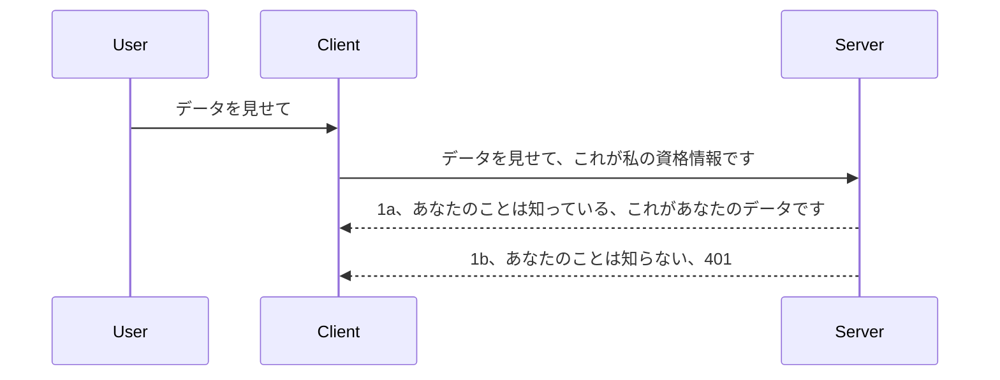

# 簡単な認証

MCP SDK は OAuth 2.1 の利用をサポートしています。正直言って OAuth は認証サーバー、リソースサーバー、資格情報の送信、コードの取得、コードとベアラートークンの交換を経てリソースデータを取得するまでのかなり複雑なプロセスを含みます。OAuth に慣れていない場合は、まず基本的なレベルの認証から始めて、より良いセキュリティへ段階的に構築していくのが良いでしょう。だからこそこの章があり、より高度な認証へと導きます。

## 認証とは何か？

認証とは authentication と authorization の略です。ここで行いたいことは２つあります:

- **Authentication**（認証）は、ある人が自分の家に入って良いか、つまり「ここにいる権利」があるかどうかを確認するプロセスです。これは MCP サーバーの機能が存在するリソースサーバーへのアクセス権があるかどうかに該当します。
- **Authorization**（認可）は、ユーザーが特定のリソース（例えば注文情報や製品情報）にアクセスできるかどうか、または内容を読み取ることはできても削除はできないなどの細かい権限を確認するプロセスです。

## 資格情報：システムに身元を伝える方法

多くのウェブ開発者は、サーバーに資格情報を提供しようと考えます。通常は「Authentication」として許可されているかを示す秘密情報です。この資格情報は通常はユーザー名とパスワードを base64 でエンコードしたもの、あるいは特定ユーザーを一意に識別する API キーです。

これは通常「Authorization」というヘッダーを通して送信されます。例えば以下のように:

```json
{ "Authorization": "secret123" }
```

これは通常基本認証（basic authentication）と呼ばれます。全体の流れは以下の通りです:


```mermaid
sequenceDiagram
   participant User
   participant Client
   participant Server

   User->>Client: データを見せて
   Client->>Server: データを見せて、これが私の資格情報です
   Server-->>Client: 1a、あなたのことは知っている、これがあなたのデータです
   Server-->>Client: 1b、あなたのことは知らない、401 
```

フローが分かったところで、どう実装するかを見てみましょう。多くのウェブサーバーはミドルウェアという概念を持っており、これはリクエストの一部として動作し、資格情報を検証して、有効ならリクエストを通過させます。有効でなければ認証エラーを返します。実装例を見てみましょう:

**Python**

```python
class AuthMiddleware(BaseHTTPMiddleware):
    async def dispatch(self, request, call_next):

        has_header = request.headers.get("Authorization")
        if not has_header:
            print("-> Missing Authorization header!")
            return Response(status_code=401, content="Unauthorized")

        if not valid_token(has_header):
            print("-> Invalid token!")
            return Response(status_code=403, content="Forbidden")

        print("Valid token, proceeding...")
       
        response = await call_next(request)
        # 任意のカスタマーヘッダーを追加するか、レスポンスを何らかの方法で変更してください
        return response


starlette_app.add_middleware(CustomHeaderMiddleware)
```

ここでは:

- `AuthMiddleware` というミドルウェアを作成し、その `dispatch` メソッドをウェブサーバーが呼び出します。
- ミドルウェアをウェブサーバーに追加しました:

    ```python
    starlette_app.add_middleware(AuthMiddleware)
    ```

- Authorization ヘッダーがあるかと送信された秘密情報が有効かを検証するロジックを書きました:

    ```python
    has_header = request.headers.get("Authorization")
    if not has_header:
        print("-> Missing Authorization header!")
        return Response(status_code=401, content="Unauthorized")

    if not valid_token(has_header):
        print("-> Invalid token!")
        return Response(status_code=403, content="Forbidden")
    ```

    秘密情報が存在し有効な場合は `call_next` を呼んでリクエストを通過させ、レスポンスを返します。

    ```python
    response = await call_next(request)
    # レスポンスに任意のカスタマーヘッダーを追加するか、何らかの方法で変更します
    return response
    ```

ウェブリクエストがサーバーに来るとミドルウェアが実行される仕組みで、実装次第でリクエストを通過させるか、許可されていないことを示すエラーを返します。

**TypeScript**

ここでは人気のフレームワーク Express でミドルウェアを作り、MCP サーバーに届く前にリクエストをインターセプトします。コードは以下の通りです:

```typescript
function isValid(secret) {
    return secret === "secret123";
}

app.use((req, res, next) => {
    // 1. 認証ヘッダーは存在しますか？
    if(!req.headers["Authorization"]) {
        res.status(401).send('Unauthorized');
    }
    
    let token = req.headers["Authorization"];

    // 2. 有効性を確認します。
    if(!isValid(token)) {
        res.status(403).send('Forbidden');
    }

   
    console.log('Middleware executed');
    // 3. リクエストをリクエストパイプラインの次のステップに渡します。
    next();
});
```

このコードでは:

1. 最初に Authorization ヘッダーがあるか確認し、なければ 401 エラーを返します。
2. 資格情報／トークンが有効か確認し、無ければ 403 エラーを返します。
3. 最後にリクエストパイプラインを通過させ、要求されたリソースを返します。

## 演習：認証の実装

習ったことを使って実装してみましょう。計画は以下の通りです:

サーバー

- ウェブサーバーと MCP インスタンスを作成。
- サーバー用ミドルウェア実装。

クライアント

- ヘッダー経由で資格情報を送信。

### -1- ウェブサーバーと MCP インスタンスの作成

> [!WARNING]
> 以下の TypeScript の例は MCP `2025-11-25` を対象としています。`mcp-session-id` でトランスポートを管理しており、現行の `2026-07-28` のトランスポート例ではありません。MCP `2026-07-28` では `initialize` ハンドシェイクとプロトコルセッションIDが廃止され、新実装は自己完結型のリクエストを使います。詳細は [What's Changed in MCP: The 2026-07-28 Specification](../../01-CoreConcepts/mcp-2026-07-28.md) を参照してください。

> 
> 


最初のステップとして、ウェブサーバーのインスタンスと MCP サーバーを作成します。

**Python**

MCPサーバーインスタンスを作成し、Starlette ウェブアプリを作成して uvicorn でホストします。

```python
# MCPサーバーを作成中

app = FastMCP(
    name="MCP Resource Server",
    instructions="Resource Server that validates tokens via Authorization Server introspection",
    host=settings["host"],
    port=settings["port"],
    debug=True
)

# starletteウェブアプリを作成中
starlette_app = app.streamable_http_app()

# uvicornを使ってアプリを提供中
async def run(starlette_app):
    import uvicorn
    config = uvicorn.Config(
            starlette_app,
            host=app.settings.host,
            port=app.settings.port,
            log_level=app.settings.log_level.lower(),
        )
    server = uvicorn.Server(config)
    await server.serve()

run(starlette_app)
```

ここでは:

- MCP サーバー作成。
- MCP サーバーから Starlette ウェブアプリを生成 `app.streamable_http_app()`。
- uvicorn でウェブアプリをホスト `server.serve()`。

**TypeScript**

MCP サーバーインスタンスを作成します。

```typescript
const server = new McpServer({
      name: "example-server",
      version: "1.0.0"
    });

    // ... サーバーリソース、ツール、およびプロンプトを設定します ...
```

MCP サーバーの作成は POST /mcp ルート定義内で行う必要があるため、上記を以下のように移動します:

```typescript
import express from "express";
import { randomUUID } from "node:crypto";
import { McpServer } from "@modelcontextprotocol/sdk/server/mcp.js";
import { StreamableHTTPServerTransport } from "@modelcontextprotocol/sdk/server/streamableHttp.js";
import { isInitializeRequest } from "@modelcontextprotocol/sdk/types.js"

const app = express();
app.use(express.json());

// セッションIDごとにトランスポートを格納するマップ
const transports: { [sessionId: string]: StreamableHTTPServerTransport } = {};

// クライアントからサーバーへの通信のPOSTリクエストを処理する
app.post('/mcp', async (req, res) => {
  // 既存のセッションIDを確認する
  const sessionId = req.headers['mcp-session-id'] as string | undefined;
  let transport: StreamableHTTPServerTransport;

  if (sessionId && transports[sessionId]) {
    // 既存のトランスポートを再利用する
    transport = transports[sessionId];
  } else if (!sessionId && isInitializeRequest(req.body)) {
    // 新しい初期化リクエスト
    transport = new StreamableHTTPServerTransport({
      sessionIdGenerator: () => randomUUID(),
      onsessioninitialized: (sessionId) => {
        // セッションIDごとにトランスポートを格納する
        transports[sessionId] = transport;
      },
      // DNSリバインディング保護は後方互換性のためデフォルトで無効になっています。このサーバーを
      // ローカルで実行している場合は、必ず以下を設定してください：
      // enableDnsRebindingProtection: true,
      // allowedHosts: ['127.0.0.1'],
    });

    // 閉じられたときにトランスポートをクリーンアップする
    transport.onclose = () => {
      if (transport.sessionId) {
        delete transports[transport.sessionId];
      }
    };
    const server = new McpServer({
      name: "example-server",
      version: "1.0.0"
    });

    // ... サーバーのリソース、ツール、プロンプトをセットアップ ...

    // MCPサーバーに接続する
    await server.connect(transport);
  } else {
    // 無効なリクエスト
    res.status(400).json({
      jsonrpc: '2.0',
      error: {
        code: -32000,
        message: 'Bad Request: No valid session ID provided',
      },
      id: null,
    });
    return;
  }

  // リクエストを処理する
  await transport.handleRequest(req, res, req.body);
});

// GETおよびDELETEリクエスト用の再利用可能なハンドラー
const handleSessionRequest = async (req: express.Request, res: express.Response) => {
  const sessionId = req.headers['mcp-session-id'] as string | undefined;
  if (!sessionId || !transports[sessionId]) {
    res.status(400).send('Invalid or missing session ID');
    return;
  }
  
  const transport = transports[sessionId];
  await transport.handleRequest(req, res);
};

// SSEを介したサーバーからクライアントへの通知のGETリクエストを処理する
app.get('/mcp', handleSessionRequest);

// セッション終了のためのDELETEリクエストを処理する
app.delete('/mcp', handleSessionRequest);

app.listen(3000);
```

MCP サーバー作成が `app.post("/mcp")` 内に移ったのがわかります。

次にミドルウェアを作り、入ってきた資格情報の検証を実装しましょう。

### -2- サーバー用ミドルウェアの実装

次にミドルウェア部分を見ていきます。ここでは `Authorization` ヘッダーから資格情報を探し、検証します。問題なければリクエストは次へ進みます（例えばツール一覧取得、リソース参照などクライアントが要求した MCP 機能を実行）。

**Python**

ミドルウェアを作るには `BaseHTTPMiddleware` を継承したクラスを作る必要があります。注目点２つ:

- リクエスト `request`、ヘッダー情報を読み取ります。
- `call_next`、クライアントが受け入れ可能な資格情報を持つ場合に呼び出すコールバック。

まず `Authorization` ヘッダーがない場合の処理を行います:

```python
has_header = request.headers.get("Authorization")

# ヘッダーが存在しない場合、401で失敗し、それ以外は続行します。
if not has_header:
    print("-> Missing Authorization header!")
    return Response(status_code=401, content="Unauthorized")
```

クライアントが認証失敗のため 401 未認証メッセージを送信します。

次に資格情報があれば有効性をチェックします:

```python
 if not valid_token(has_header):
    print("-> Invalid token!")
    return Response(status_code=403, content="Forbidden")
```

ここで 403 禁止メッセージを送るのがわかります。続いて、上述全てを実装した完全なミドルウェアがこちらです:

```python
class AuthMiddleware(BaseHTTPMiddleware):
    async def dispatch(self, request, call_next):

        has_header = request.headers.get("Authorization")
        if not has_header:
            print("-> Missing Authorization header!")
            return Response(status_code=401, content="Unauthorized")

        if not valid_token(has_header):
            print("-> Invalid token!")
            return Response(status_code=403, content="Forbidden")

        print("Valid token, proceeding...")
        print(f"-> Received {request.method} {request.url}")
        response = await call_next(request)
        response.headers['Custom'] = 'Example'
        return response

```

ところで `valid_token` 関数は何か？ 以下です:

```python
# 本番環境での使用は避けてください - 改良してください！！
def valid_token(token: str) -> bool:
    # "Bearer " プレフィックスを削除してください
    if token.startswith("Bearer "):
        token = token[7:]
        return token == "secret-token"
    return False
```

これは当然改善すべきです。

重要: このような秘密情報をコード内に直接置くべきではありません。理想的には比較用の値はデータソースや IDP（ID プロバイダー）から取得し、できれば IDP に検証させましょう。

**TypeScript**

Express で実装するには `use` メソッドを呼び、ミドルウェア関数を渡す必要があります。

やるべきことは:

- リクエスト変数で渡された資格情報の `Authorization` プロパティをチェック。
- 資格情報を検証し、有効ならリクエストを続行し、クライアントの MCP リクエストを実行させる（例: ツールリスト取得、リソース参照、その他 MCP 機能）。

ここでは `Authorization` ヘッダーがあるかチェックし、なければリクエストを止めます:

```typescript
if(!req.headers["authorization"]) {
    res.status(401).send('Unauthorized');
    return;
}
```

ヘッダーが最初から送られていなければ 401 が返ります。

次に資格情報の有効性を確認し、不正ならまたリクエストを止めますが別のメッセージです:

```typescript
if(!isValid(token)) {
    res.status(403).send('Forbidden');
    return;
} 
```

ここで 403 エラーが返るのがわかります。

完全なコードがこちらです:

```typescript
app.use((req, res, next) => {
    console.log('Request received:', req.method, req.url, req.headers);
    console.log('Headers:', req.headers["authorization"]);
    if(!req.headers["authorization"]) {
        res.status(401).send('Unauthorized');
        return;
    }
    
    let token = req.headers["authorization"];

    if(!isValid(token)) {
        res.status(403).send('Forbidden');
        return;
    }  

    console.log('Middleware executed');
    next();
});
```

ミドルウェアをセットアップしてクライアントが送る資格情報をチェックしています。ではクライアントはどうでしょう？

### -3- ヘッダー経由で資格情報を使ってウェブリクエスト送信

クライアントが資格情報をヘッダーで渡すことを確認する必要があります。MCP クライアントを使いますが、その方法を把握しましょう。

**Python**

クライアント側では資格情報をヘッダーに追加します:

```python
# 値をハードコードしないで、最低限環境変数かより安全なストレージに置いてください
token = "secret-token"

async with streamablehttp_client(
        url = f"http://localhost:{port}/mcp",
        headers = {"Authorization": f"Bearer {token}"}
    ) as (
        read_stream,
        write_stream,
        session_callback,
    ):
        async with ClientSession(
            read_stream,
            write_stream
        ) as session:
            await session.initialize()
      
            # TODO, クライアントで何をしたいか、例：ツールの一覧表示、ツール呼び出しなど
```

`headers = {"Authorization": f"Bearer {token}"}` のように `headers` プロパティを設定している点に注意。

**TypeScript**

２ステップで実装できます:

1. 設定オブジェクトに資格情報を入れる。
2. 設定オブジェクトをトランスポートに渡す。

```typescript

// ここで示されているように値をハードコーディングしないでください。最低でも環境変数として設定し、開発モードでは dotenv のようなものを使用してください。
let token = "secret123"

// クライアントのトランスポートオプションオブジェクトを定義する
let options: StreamableHTTPClientTransportOptions = {
  sessionId: sessionId,
  requestInit: {
    headers: {
      "Authorization": "secret123"
    }
  }
};

// オプションオブジェクトをトランスポートに渡す
async function main() {
   const transport = new StreamableHTTPClientTransport(
      new URL(serverUrl),
      options
   );
```

上記コードでは `options` オブジェクトを作成し、その中の `requestInit` プロパティにヘッダーを入れています。

重要: ここからどう改善できるか？ 現状の実装には問題があります。最低限 HTTPS がないと非常に危険です。それでも資格情報が盗まれる可能性があり、即座にトークンを失効させられるシステムや、送信元地域や頻度（ボット的挙動の検知）など付加的な検査が必要です。要は多くの懸念が存在します。

とは言え、簡単な API では認証なしで誰にも呼ばれたくない場合の初歩的な一歩としては良いものです。

そこでセキュリティを強化するために、標準的なフォーマットである JSON Web Token、通称 JWT または「JOT」トークンを使ってみましょう。

## JSON Web Tokens、JWT

では、単純な認証情報送信からの改善についてです。JWT を採用することで得られる即時のメリットは何でしょう？

- <strong>セキュリティの向上</strong>。基本認証ではユーザー名とパスワードをベース64エンコードしたトークン（あるいは API キー）を繰り返し送信しリスクが高いです。JWT ではユーザー名とパスワードでトークンを取得し、このトークンは有効期限付きです。JWT はロールやスコープ、権限を使った詳細なアクセス制御を容易にします。
- <strong>ステートレス性とスケーラビリティ</strong>。JWT はすべてのユーザー情報を自己完結的に持ち、サーバー側のセッションストレージを不要にします。トークンはローカルで検証可能です。
- <strong>相互運用性とフェデレーション</strong>。JWT は Open ID Connect の中心で、Entra ID、Google Identity、Auth0 など既知の ID プロバイダーで使われます。SSO（シングルサインオン）なども可能にし、企業級の機能を提供します。
- <strong>モジュール性と柔軟性</strong>。JWT は Azure API Management や NGINX など API ゲートウェイとも利用でき、ユーザー認証シナリオやサーバー間通信、なりすましや委任シナリオもサポートします。
- <strong>パフォーマンスとキャッシュ</strong>。JWT はデコード後キャッシュ可能で解析負荷を減らします。特に高トラフィックアプリのスループット向上とインフラ負荷軽減に貢献します。
- <strong>高度な機能</strong>。イントロスペクション（サーバー側での検証）やリボケーション（トークン無効化）もサポートします。

これらの利点を踏まえ、次のレベルの実装について見てみましょう。

## 基本認証から JWT へ

高層的に必要な変更点は：

- **JWT トークンの構築**、クライアントからサーバーへ送信可能な形にすること。
- **JWT トークンの検証**、有効ならクライアントにリソースを提供。
- <strong>トークンの安全な保存方法</strong>。
- <strong>ルートの保護</strong>、私たちのケースでは MCP のルートや特定機能を保護する必要があります。
- <strong>リフレッシュトークンの追加</strong>。短命なトークンと、切れた際に新しいトークン取得に使う長命なリフレッシュトークンを作成し、リフレッシュ用エンドポイントと回転戦略を確保します。

### -1- JWT トークンの構築

JWT トークンは以下のパートから成ります:

- <strong>ヘッダー</strong>、アルゴリズムとトークンタイプ。
- <strong>ペイロード</strong>、請求（クレーム）、例えば sub（このトークンが表すユーザーまたはエンティティ、通常はユーザーID）、exp（有効期限）、role（役割）。
- <strong>署名</strong>、秘密鍵またはプライベートキーで署名されます。

これらを構築してエンコードトークンを作成します。

**Python**

```python

import jwt
import jwt
from jwt.exceptions import ExpiredSignatureError, InvalidTokenError
import datetime

# JWTの署名に使用される秘密鍵
secret_key = 'your-secret-key'

header = {
    "alg": "HS256",
    "typ": "JWT"
}

# ユーザー情報、そのクレームおよび有効期限
payload = {
    "sub": "1234567890",               # サブジェクト（ユーザーID）
    "name": "User Userson",                # カスタムクレーム
    "admin": True,                     # カスタムクレーム
    "iat": datetime.datetime.utcnow(),# 発行日時
    "exp": datetime.datetime.utcnow() + datetime.timedelta(hours=1)  # 有効期限
}

# エンコードする
encoded_jwt = jwt.encode(payload, secret_key, algorithm="HS256", headers=header)
```

上記コードでは:

- HS256 をアルゴリズム、タイプは JWT とするヘッダーを定義。
- サブジェクト（ユーザーID）、ユーザー名、役割、発行時刻と有効期限を含むペイロードを構築し、時間制限を実装。

**TypeScript**

JWT トークン構築に役立つ依存ライブラリが必要です。

依存関係

```sh

npm install jsonwebtoken
npm install --save-dev @types/jsonwebtoken
```

これが準備できたらヘッダーとペイロードを作成し、エンコードトークンを生成します。

```typescript
import jwt from 'jsonwebtoken';

const secretKey = 'your-secret-key'; // 本番環境で環境変数を使用する

// ペイロードを定義する
const payload = {
  sub: '1234567890',
  name: 'User usersson',
  admin: true,
  iat: Math.floor(Date.now() / 1000), // 発行日時
  exp: Math.floor(Date.now() / 1000) + 60 * 60 // 1時間で有効期限が切れる
};

// ヘッダーを定義する（オプション、jsonwebtokenがデフォルトを設定）
const header = {
  alg: 'HS256',
  typ: 'JWT'
};

// トークンを作成する
const token = jwt.sign(payload, secretKey, {
  algorithm: 'HS256',
  header: header
});

console.log('JWT:', token);
```

このトークンは:

HS256 署名済み
1時間有効
sub, name, admin, iat, exp といったクレームを含む

### -2- トークンの検証

トークンの検証も必要です。これはサーバー側で行い、クライアントが送るものが実際に有効なのか確認します。構造から有効期限まで様々な検査があります。またユーザーが自分のシステムに存在するか等の追加検査も推奨されます。

トークンを検証するには、まずデコードして内容を読み取り、有効性をチェックします:

**Python**

```python

# JWTをデコードして検証する
try:
    decoded = jwt.decode(token, secret_key, algorithms=["HS256"])
    print("✅ Token is valid.")
    print("Decoded claims:")
    for key, value in decoded.items():
        print(f"  {key}: {value}")
except ExpiredSignatureError:
    print("❌ Token has expired.")
except InvalidTokenError as e:
    print(f"❌ Invalid token: {e}")

```


このコードでは、トークン、秘密鍵、および選択したアルゴリズムを入力として使用して `jwt.decode` を呼び出します。失敗した検証がエラーを引き起こすため、try-catch構造を使用していることに注意してください。

**TypeScript**

ここでは、トークンのデコード済みバージョンを取得してさらに分析できるようにするために `jwt.verify` を呼び出す必要があります。この呼び出しが失敗した場合、トークンの構造が不正であるか、もはや有効でないことを意味します。

```typescript

try {
  const decoded = jwt.verify(token, secretKey);
  console.log('Decoded Payload:', decoded);
} catch (err) {
  console.error('Token verification failed:', err);
}
```

NOTE: 前述のように、このトークンがシステム内のユーザーを指していることを確認し、ユーザーが主張する権限を持っていることを保証するために、追加のチェックを行うべきです。

次に、ロールベースのアクセス制御、すなわち RBAC について見てみましょう。

## ロールベースのアクセス制御の追加

ここでの考え方は、異なるロールが異なる権限を持つことを表現したいということです。例えば、管理者はすべての操作ができ、一般ユーザーは読み書きができ、ゲストは読み取りのみができると仮定します。したがって、以下のような権限レベルが考えられます：

- Admin.Write
- User.Read
- Guest.Read

ミドルウェアでこのような制御をどのように実装できるか見てみましょう。ミドルウェアはルートごとにも、全ルートに対しても追加できます。

**Python**

```python
from starlette.middleware.base import BaseHTTPMiddleware
from starlette.responses import JSONResponse
import jwt

# 秘密情報をコードに直接書かないでください。これはデモ用です。安全な場所から読み取ってください。
SECRET_KEY = "your-secret-key" # これを環境変数に入れてください
REQUIRED_PERMISSION = "User.Read"

class JWTPermissionMiddleware(BaseHTTPMiddleware):
    async def dispatch(self, request, call_next):
        auth_header = request.headers.get("Authorization")
        if not auth_header or not auth_header.startswith("Bearer "):
            return JSONResponse({"error": "Missing or invalid Authorization header"}, status_code=401)

        token = auth_header.split(" ")[1]
        try:
            decoded = jwt.decode(token, SECRET_KEY, algorithms=["HS256"])
        except jwt.ExpiredSignatureError:
            return JSONResponse({"error": "Token expired"}, status_code=401)
        except jwt.InvalidTokenError:
            return JSONResponse({"error": "Invalid token"}, status_code=401)

        permissions = decoded.get("permissions", [])
        if REQUIRED_PERMISSION not in permissions:
            return JSONResponse({"error": "Permission denied"}, status_code=403)

        request.state.user = decoded
        return await call_next(request)


```

ミドルウェアを追加する方法はいくつかあります。以下のように：

```python

# 代替案1：Starletteアプリを構築する際にミドルウェアを追加する
middleware = [
    Middleware(JWTPermissionMiddleware)
]

app = Starlette(routes=routes, middleware=middleware)

# 代替案2：Starletteアプリが既に構築された後にミドルウェアを追加する
starlette_app.add_middleware(JWTPermissionMiddleware)

# 代替案3：ルートごとにミドルウェアを追加する
routes = [
    Route(
        "/mcp",
        endpoint=..., # ハンドラー
        middleware=[Middleware(JWTPermissionMiddleware)]
    )
]
```

**TypeScript**

`app.use` と全リクエストで実行されるミドルウェアを使うことができます。

```typescript
app.use((req, res, next) => {
    console.log('Request received:', req.method, req.url, req.headers);
    console.log('Headers:', req.headers["authorization"]);

    // 1. 認証ヘッダーが送信されているか確認する

    if(!req.headers["authorization"]) {
        res.status(401).send('Unauthorized');
        return;
    }
    
    let token = req.headers["authorization"];

    // 2. トークンが有効か確認する
    if(!isValid(token)) {
        res.status(403).send('Forbidden');
        return;
    }  

    // 3. トークンのユーザーがシステム内に存在するか確認する
    if(!isExistingUser(token)) {
        res.status(403).send('Forbidden');
        console.log("User does not exist");
        return;
    }
    console.log("User exists");

    // 4. トークンに適切な権限があるか検証する
    if(!hasScopes(token, ["User.Read"])){
        res.status(403).send('Forbidden - insufficient scopes');
    }

    console.log("User has required scopes");

    console.log('Middleware executed');
    next();
});

```

ミドルウェアに実装すべきことや実行できることがいくつかあります。

1. Authorization ヘッダーが存在するか確認
2. トークンが有効か確認。JWTトークンの整合性と有効性をチェックする自作メソッド `isValid` を呼び出します。
3. ユーザーがシステムに存在するか確認、これをチェックすべきです。

   ```typescript
    // DB内のユーザー
   const users = [
     "user1",
     "User usersson",
   ]

   function isExistingUser(token) {
     let decodedToken = verifyToken(token);

     // TODO、ユーザーがDBに存在するか確認する
     return users.includes(decodedToken?.name || "");
   }
   ```

   上記では、非常にシンプルな `users` リストを作成しましたが、これは当然データベースにあるべきです。

4. さらに、トークンが適切な権限を持っているかもチェックする必要があります。

   ```typescript
   if(!hasScopes(token, ["User.Read"])){
        res.status(403).send('Forbidden - insufficient scopes');
   }
   ```

   上のミドルウェアコードでは、トークンに User.Read 権限が含まれているか確認し、含まれていなければ403エラーを返します。以下は `hasScopes` ヘルパーメソッドです。

   ```typescript
   function hasScopes(scope: string, requiredScopes: string[]) {
     let decodedToken = verifyToken(scope);
    return requiredScopes.every(scope => decodedToken?.scopes.includes(scope));
  }
   ```

Have a think which additional checks you should be doing, but these are the absolute minimum of checks you should be doing.

Using Express as a web framework is a common choice. There are helpers library when you use JWT so you can write less code.

- `express-jwt`, helper library that provides a middleware that helps decode your token.
- `express-jwt-permissions`, this provides a middleware `guard` that helps check if a certain permission is on the token.

Here's what these libraries can look like when used:

```typescript
const express = require('express');
const jwt = require('express-jwt');
const guard = require('express-jwt-permissions')();

const app = express();
const secretKey = 'your-secret-key'; // put this in env variable

// Decode JWT and attach to req.user
app.use(jwt({ secret: secretKey, algorithms: ['HS256'] }));

// Check for User.Read permission
app.use(guard.check('User.Read'));

// multiple permissions
// app.use(guard.check(['User.Read', 'Admin.Access']));

app.get('/protected', (req, res) => {
  res.json({ message: `Welcome ${req.user.name}` });
});

// Error handler
app.use((err, req, res, next) => {
  if (err.code === 'permission_denied') {
    return res.status(403).send('Forbidden');
  }
  next(err);
});

```

これでミドルウェアが認証と認可の両方に使用できる方法を見ましたが、MCPではどうでしょう？ 認証のやり方は変わるのでしょうか？ 次のセクションで見てみましょう。

### -3- MCPにRBACを追加

これまでミドルウェアを介してRBACを追加する方法を見てきましたが、MCPには機能ごとにRBACを追加する簡単な方法がありません。ではどうするか？ ここでは、クライアントが特定のツールを呼び出す権限を持っているかをチェックするようなコードをただ追加するしかありません：

機能ごとのRBACを実現する方法はいくつかあります。ここにいくつか紹介します：

- 権限レベルをチェックする必要があるツール、リソース、プロンプトごとにチェックを追加する。

   **python**

   ```python
   @tool()
   def delete_product(id: int):
      try:
          check_permissions(role="Admin.Write", request)
      catch:
        pass # クライアントの認証に失敗しました。認証エラーを発生させます。
   ```

   **typescript**

   ```typescript
   server.registerTool(
    "delete-product",
    {
      title: Delete a product",
      description: "Deletes a product",
      inputSchema: { id: z.number() }
    },
    async ({ id }) => {
      
      try {
        checkPermissions("Admin.Write", request);
        // やること、IDをproductServiceとリモートエントリーに送信すること
      } catch(Exception e) {
        console.log("Authorization error, you're not allowed");  
      }

      return {
        content: [{ type: "text", text: `Deletected product with id ${id}` }]
      };
    }
   );
   ```


- 高度なサーバーアプローチとリクエストハンドラーを使い、チェックを行う場所を最小化する。

   **Python**

   ```python
   
   tool_permission = {
      "create_product": ["User.Write", "Admin.Write"],
      "delete_product": ["Admin.Write"]
   }

   def has_permission(user_permissions, required_permissions) -> bool:
      # user_permissions: ユーザーが持っている権限のリスト
      # required_permissions: ツールに必要な権限のリスト
      return any(perm in user_permissions for perm in required_permissions)

   @server.call_tool()
   async def handle_call_tool(
     name: str, arguments: dict[str, str] | None
   ) -> list[types.TextContent]:
    # request.user.permissions はユーザーの権限のリストであると仮定する
     user_permissions = request.user.permissions
     required_permissions = tool_permission.get(name, [])
     if not has_permission(user_permissions, required_permissions):
        # エラーを発生させる "ツール {name} を呼び出す権限がありません"
        raise Exception(f"You don't have permission to call tool {name}")
     # 続行してツールを呼び出す
     # ...
   ```   
   

   **TypeScript**

   ```typescript
   function hasPermission(userPermissions: string[], requiredPermissions: string[]): boolean {
       if (!Array.isArray(userPermissions) || !Array.isArray(requiredPermissions)) return false;
       // ユーザーが少なくとも1つの必要な権限を持っている場合はtrueを返します
       
       return requiredPermissions.some(perm => userPermissions.includes(perm));
   }
  
   server.setRequestHandler(CallToolRequestSchema, async (request) => {
      const { params: { name } } = request;
  
      let permissions = request.user.permissions;
  
      if (!hasPermission(permissions, toolPermissions[name])) {
         return new Error(`You don't have permission to call ${name}`);
      }
  
      // 続けてください..
   });
   ```

   注意：ミドルウェアがリクエストの user プロパティにデコード済みトークンを割り当てる必要があり、これによって上記コードが簡単になります。

### まとめ

ここまでで、RBACのサポートの追加方法、特にMCP用の方法について話しました。次は、理解したことを確かめるために自分でセキュリティを実装してみる時です。

## 課題 1: ベーシック認証を使った MCP サーバーと MCP クライアントの構築

ここでは、ヘッダーを通じて資格情報を送信する方法を学んだ内容を活用します。

## 解答例 1

[Solution 1](./code/basic/README.md)

## 課題 2: 課題 1 の解決策を JWT を使うようにアップグレードする

最初の解決策を使いますが、今回はそれを改善します。 

Basic Auth の代わりに JWT を使いましょう。 

## 解答例 2

[Solution 2](./solution/jwt-solution/README.md)

## チャレンジ

「MCPにRBACを追加」セクションで説明したツールごとのRBACを追加してください。

## まとめ

この章では、セキュリティなし、基本的なセキュリティ、JWT、およびそれを MCP に追加する方法まで、多くを学んだでしょう。

カスタムJWTでしっかりした基盤を築きましたが、スケールするに従い、標準に基づくアイデンティティモデルに移行しています。Entra や Keycloak のような IdP を採用することで、トークンの発行、検証、ライフサイクル管理を信頼できるプラットフォームに任せ、アプリのロジックとユーザー体験に集中できます。

そのために、より[高度なEntraの章](../../05-AdvancedTopics/mcp-security-entra/README.md)があります。

## 次に

- 次: [MCPホストのセットアップ](../12-mcp-hosts/README.md)

---

<!-- CO-OP TRANSLATOR DISCLAIMER START -->
**免責事項**：
本書類は AI 翻訳サービス [Co-op Translator](https://github.com/Azure/co-op-translator) を使用して翻訳されています。正確性を期していますが、自動翻訳には誤りや不正確な部分が含まれる可能性があることをご承知おきください。原文の原語版が正式な情報源とみなされるべきです。重要な情報については、専門の人間による翻訳を推奨します。本翻訳の利用により生じたいかなる誤解や解釈違いについても、当方は責任を負いかねます。
<!-- CO-OP TRANSLATOR DISCLAIMER END -->