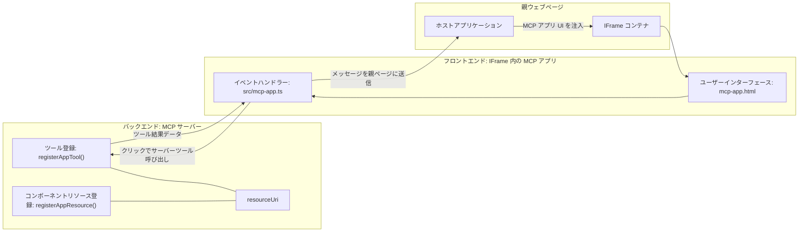
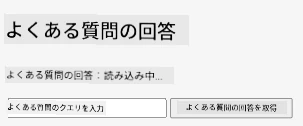
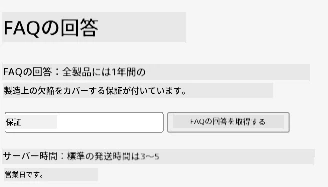
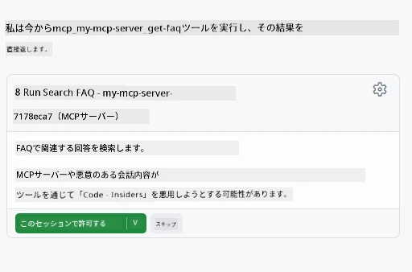
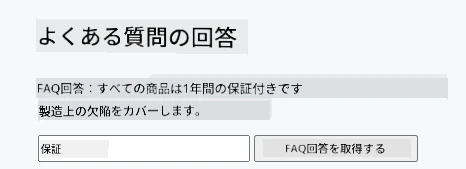

# MCP アプリ

MCP アプリは MCP における新しいパラダイムです。この考え方は、ツール呼び出しからのデータを返すだけでなく、その情報とどのようにやり取りすべきかの情報も提供するというものです。つまり、ツールの結果に UI 情報を含めることができるということです。なぜこれが必要なのでしょうか？今日どのように作業をしているかを考えてみてください。おそらく MCP サーバの結果を利用するために何らかのフロントエンドを用意しているでしょうが、それは自分で書いてメンテナンスするコードです。時にはそれが望ましいこともありますが、時にはデータからユーザーインターフェースまで全てを含む自己完結型のスニペットを取り込むことができれば便利です。

## 概要

このレッスンでは MCP アプリについての実践的なガイダンス、始め方、既存の Web アプリへの統合方法を提供します。MCP アプリは MCP 標準への非常に新しい追加機能です。

## 学習目標

このレッスンの最後には、次のことができるようになります。

- MCP アプリとは何かを説明する。
- MCP アプリを使うべき状況を理解する。
- 自分自身の MCP アプリを構築し統合する。

## MCP アプリ - 仕組み

MCP アプリの考え方は、本質的にレンダリングされるコンポーネントとしての応答を提供することです。そのコンポーネントはビジュアルとインタラクティビティ（例：ボタンクリック、ユーザー入力など）の両方を持つことができます。まずはサーバ側と MCP サーバから始めましょう。MCP アプリコンポーネントを作成するには、ツールとアプリケーションリソースの2つを作成する必要があります。この2つは resourceUri によって接続されます。

以下は例です。関係するものや各部分の役割を視覚化してみましょう：

```text
server.ts -- responsible for registering tools and the component as a UI component
src/
  mcp-app.ts -- wiring up event handlers
mcp-app.html -- the user interface
```
  
この図はコンポーネントとそのロジックを作成するためのアーキテクチャを示しています。


次にバックエンドとフロントエンドの責任を説明してみましょう。

### バックエンド

ここで達成すべきことは2つあります：

- 相互作用したいツールの登録。
- コンポーネントの定義。

**ツールの登録**

```typescript
registerAppTool(
    server,
    "get-time",
    {
      title: "Get Time",
      description: "Returns the current server time.",
      inputSchema: {},
      _meta: { ui: { resourceUri } }, // このツールをそのUIリソースにリンクします
    },
    async () => {
      const time = new Date().toISOString();
      return { content: [{ type: "text", text: time }] };
    },
  );

```
  
上記のコードは `get-time` というツールを公開する動作を説明しています。入力はなく、現在時刻を生成します。ユーザー入力を受け付ける必要がある場合は、ツールのための `inputSchema` を定義することも可能です。

**コンポーネントの登録**

同じファイル内でコンポーネントも登録する必要があります：

```typescript
const resourceUri = "ui://get-time/mcp-app.html";

// UI用のバンドルされたHTML/JavaScriptを返すリソースを登録します。
registerAppResource(
  server,
  resourceUri,
  resourceUri,
  { mimeType: RESOURCE_MIME_TYPE },
  async () => {
    const html = await fs.readFile(path.join(DIST_DIR, "mcp-app.html"), "utf-8");

    return {
    contents: [
        { uri: resourceUri, mimeType: RESOURCE_MIME_TYPE, text: html },
    ],
    };
  },
);
```
  
コンポーネントとそのツールを接続するために `resourceUri` を指定しているのに注意してください。興味深いのは、UI ファイルを読み込みコンポーネントを返すコールバックもあります。

### コンポーネントのフロントエンド

バックエンド同様、ここも2つの部分があります：

- 純粋な HTML で書かれたフロントエンド。
- イベント処理やツール呼び出し・親ウィンドウへのメッセージ送信などを行うコード。

**ユーザーインターフェース**

ユーザーインターフェースを見てみましょう。

```html
<!-- mcp-app.html -->
<!DOCTYPE html>
<html lang="en">
  <head>
    <meta charset="UTF-8" />
    <title>Get Time App</title>
  </head>
  <body>
    <p>
      <strong>Server Time:</strong> <code id="server-time">Loading...</code>
    </p>
    <button id="get-time-btn">Get Server Time</button>
    <script type="module" src="/src/mcp-app.ts"></script>
  </body>
</html>
```
  
**イベントの接続**

最後の部分はイベントの接続です。これは UI のどの部分にイベントハンドラを設定し、イベント発生時に何をするかを定義することを意味します：

```typescript
// mcp-app.ts

import { App } from "@modelcontextprotocol/ext-apps";

// 要素の参照を取得する
const serverTimeEl = document.getElementById("server-time")!;
const getTimeBtn = document.getElementById("get-time-btn")!;

// アプリインスタンスを作成する
const app = new App({ name: "Get Time App", version: "1.0.0" });

// サーバーからのツール結果を処理します。
// 初期のツール結果を見逃さないように、`app.connect()`の前に設定します。
app.ontoolresult = (result) => {
  const time = result.content?.find((c) => c.type === "text")?.text;
  serverTimeEl.textContent = time ?? "[ERROR]";
};

// ボタンクリックを接続する
getTimeBtn.addEventListener("click", async () => {
  // `app.callServerTool()` はUIがサーバーから最新のデータを要求することを可能にします
  const result = await app.callServerTool({ name: "get-time", arguments: {} });
  const time = result.content?.find((c) => c.type === "text")?.text;
  serverTimeEl.textContent = time ?? "[ERROR]";
});

// ホストに接続する
app.connect();
```
  
上記からわかるように、これは DOM 要素にイベントをフックする通常のコードです。特に `callServerTool` の呼び出しがバックエンドのツールを呼ぶことに注目です。

## ユーザー入力への対応

これまで見てきたのは、ボタンが押されるとツールが呼ばれるコンポーネントでした。次に入力フィールドのような UI 要素を追加し、ツールに引数を送れるか試してみましょう。FAQ 機能を実装します。動作は以下の通りです：

- ユーザーが「Shipping」などのキーワードを入力するためのボタンと入力欄があり、これがバックエンドの FAQ データを検索するツールを呼び出す。
- その FAQ 検索をサポートするツール。

まずはバックエンドに必要なサポートを追加しましょう：

```typescript
const faq: { [key: string]: string } = {
    "shipping": "Our standard shipping time is 3-5 business days.",
    "return policy": "You can return any item within 30 days of purchase.",
    "warranty": "All products come with a 1-year warranty covering manufacturing defects.",
  }

registerAppTool(
    server,
    "get-faq",
    {
      title: "Search FAQ",
      description: "Searches the FAQ for relevant answers.",
      inputSchema: zod.object({
        query: zod.string().default("shipping"),
      }),
      _meta: { ui: { resourceUri: faqResourceUri } }, // このツールをそのUIリソースにリンクします
    },
    async ({ query }) => {
      const answer: string = faq[query.toLowerCase()] || "Sorry, I don't have an answer for that.";
      return { content: [{ type: "text", text: answer }] };
    },
  );
```
  
ここで見ているのは `inputSchema` をどのように populdate し、`zod` スキーマを与えているかです。

```typescript
inputSchema: zod.object({
  query: zod.string().default("shipping"),
})
```
  
上記スキーマでは、`query` という名前の入力パラメータがありオプションかつデフォルト値が "shipping" であることを宣言しています。

では次に *mcp-app.html* を見てこのための UI を作成しましょう：

```html
<div class="faq">
    <h1>FAQ response</h1>
    <p>FAQ Response: <code id="faq-response">Loading...</code></p>
    <input type="text" id="faq-query" placeholder="Enter FAQ query" />
    <button id="get-faq-btn">Get FAQ Response</button>
  </div>
```
  
素晴らしい、入力欄とボタンができました。続いて *mcp-app.ts* に進み、これらのイベントを接続します：

```typescript
const getFaqBtn = document.getElementById("get-faq-btn")!;
const faqQueryInput = document.getElementById("faq-query") as HTMLInputElement;

getFaqBtn.addEventListener("click", async () => {
  const query = faqQueryInput.value;
  const result = await app.callServerTool({ name: "get-faq", arguments: { query } });
  const faq = result.content?.find((c) => c.type === "text")?.text;
  faqResponseEl.textContent = faq ?? "[ERROR]";
});
```
  
上のコードでは：

- 興味のある UI 要素への参照を作成。
- ボタンのクリックを処理し、入力値を解析、さらに `app.callServerTool()` を `name` と `arguments`（後者は `query` を値として渡す）で呼び出している。

`callServerTool` を呼ぶと実際には親ウィンドウへメッセージが送られ、そのウィンドウが MCP サーバを呼び出します。

### 試してみましょう

試すと以下のようになります：



次は「warranty」などの入力で試したところです：



このコードを実行するには、[コードセクション](./code/README.md) をご覧ください。

## Visual Studio Code でのテスト

Visual Studio Code は MCP アプリのサポートが充実しており、おそらく最も簡単にテストできる方法の一つです。Visual Studio Code を使うには、*mcp.json* に以下のようにサーバのエントリを追加します：

```json
"my-mcp-server-7178eca7": {
    "url": "http://localhost:3001/mcp",
    "type": "http"
  }
```
  
サーバを起動すると、GitHub Copilot がインストールされていればチャットウィンドウを通じて MVP アプリと通信できます。

例えば「#get-faq」というプロンプトからトリガーすると：



ウェブブラウザで実行したときと同じようにレンダリングされます：



## 課題

ジャンケンゲームを作成しましょう。以下の内容を含みます。

UI:

- 選択肢のドロップダウンリスト
- 選択を送信するボタン
- 誰が何を出し誰が勝ったかを表示するラベル

サーバー:

- "choice" を入力とするジャンケンツールを持つ。コンピューターの選択もレンダリングし、勝者も判定する。

## 解答例

[解答例](./assignment/README.md)

## まとめ

この新しいパラダイム MCP アプリについて学びました。MCP サーバがデータだけでなく、そのデータの提示方法についても意見を持てる新しい枠組みです。

さらに MCP アプリは IFrame 内でホストされ、MCP サーバと通信するために親の Web アプリにメッセージを送る必要があることを学びました。この通信を容易にするライブラリは、プレーン JavaScript 版、React 版など複数存在します。

## 重要ポイント

学んだことは以下の通りです：

- MCP アプリはデータと UI 機能の両方を配送したい場合に便利な新しい標準である。
- セキュリティ上の理由からこれらのアプリは IFrame 内で動作する。

## 次にやること

- [第4章](../../04-PracticalImplementation/README.md)

---

<!-- CO-OP TRANSLATOR DISCLAIMER START -->
**免責事項**：  
本書類はAI翻訳サービス「Co-op Translator」（https://github.com/Azure/co-op-translator）を使用して翻訳されました。正確性の確保に努めていますが、自動翻訳には誤りや不正確な箇所が含まれる可能性があることをご理解ください。原文の母国語版が公式な情報源とみなされます。重要な内容については、専門の翻訳者による人間翻訳を推奨します。本翻訳の利用により生じた誤解や解釈の違いに関して、当方は一切の責任を負いかねます。
<!-- CO-OP TRANSLATOR DISCLAIMER END -->