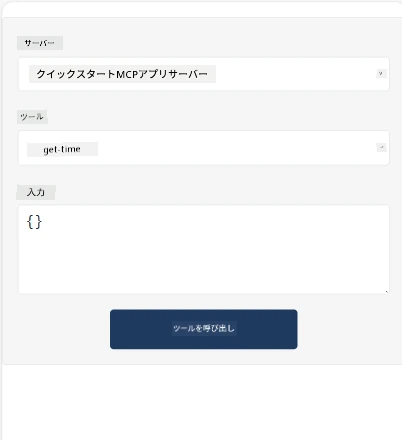
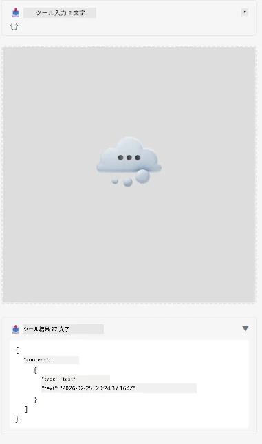

Here's a sample demonstrating MCP App

## Install 

1. *mcp-app* フォルダに移動します
1. `npm install` を実行します。これによりフロントエンドとバックエンドの依存関係がインストールされます

バックエンドがコンパイルされるかどうかを次のコマンドで確認してください：

```sh
npx tsc --noEmit
```

問題がなければ出力はありません。

## Run backend

> MCP Apps ソリューションが `concurrently` ライブラリを使用しているため、Windows マシンでは少し追加作業が必要です。置き換えを見つける必要があります。MCP App の *package.json* の問題のある行は以下の通りです：

    ```json
    "start": "concurrently \"cross-env NODE_ENV=development INPUT=mcp-app.html vite build --watch\" \"tsx watch main.ts\""
    ```

このアプリはバックエンドパートとホストパートの2つに分かれています。

バックエンドを起動するには以下を実行します：

```sh
npm start
```

これにより `http://localhost:3001/mcp` でバックエンドが起動します。

> Codespace を使用している場合は、ポートの公開範囲をパブリックに設定する必要があります。ブラウザから https://<Codespaceの名前>.app.github.dev/mcp でエンドポイントにアクセスできるか確認してください

## Choice -1 Visual Studio Code でアプリをテストする

Visual Studio Code でソリューションをテストするには、以下を行います：

- `mcp.json` にサーバーエントリを次のように追加します：

    ```json
    {
        "servers": {
            "my-mcp-server-7178eca7": {
                "url": "http://localhost:3001/mcp",
                "type": "http"
            }
        },
        "inputs": []
    }
    ```

1. *mcp.json* の「start」ボタンをクリックします
1. チャットウィンドウが開いていることを確認し、`get-faq` と入力すると次のような結果が表示されるはずです：

    

## Choice -2- ホストでアプリをテストする

リポジトリ <https://github.com/modelcontextprotocol/ext-apps> には、MVP Apps をテストするために使用できる複数のホストがあります。

ここでは2つの異なるオプションを提示します：

### ローカルマシン

- リポジトリをクローンした後、*ext-apps* に移動します。

- 依存関係をインストールします

   ```sh
   npm install
   ```

- 別のターミナルウィンドウで *ext-apps/examples/basic-host* に移動します

    > Codespace を使用している場合は、serve.ts の27行目の http://localhost:3001/mcp をバックエンドの Codespace URL に置き換える必要があります。例えば https://psychic-xylophone-657rpjgvxpc5g64-3001.app.github.dev/mcp のようにします

- ホストを起動します：

    ```sh
    npm start
    ```

    これでホストとバックエンドが接続され、以下のようにアプリが起動します：

    

### Codespace

Codespace 環境でホストを使用するには少し追加作業が必要です。Codespace 経由でホストを使うには：

- *ext-apps* ディレクトリに移動し *examples/basic-host* に進みます。
- `npm install` で依存関係をインストールします
- `npm start` でホストを起動します。

## Test out the app

アプリの動作を以下のように試してみてください：

- 「Call Tool」ボタンを選択すると、以下のように結果が表示されます：

    

素晴らしい、すべて正常に動作しています。

---

<!-- CO-OP TRANSLATOR DISCLAIMER START -->
**免責事項**：  
本書類はAI翻訳サービス「Co-op Translator」（https://github.com/Azure/co-op-translator）を用いて翻訳されています。正確性には努めておりますが、自動翻訳には誤りや不正確な箇所が含まれる可能性があります。正式な情報源としては、原文の母国語版を参照してください。重要な情報については、専門の人間による翻訳を推奨します。本翻訳の利用により生じたいかなる誤解や誤訳についても、当方は一切責任を負いかねます。
<!-- CO-OP TRANSLATOR DISCLAIMER END -->