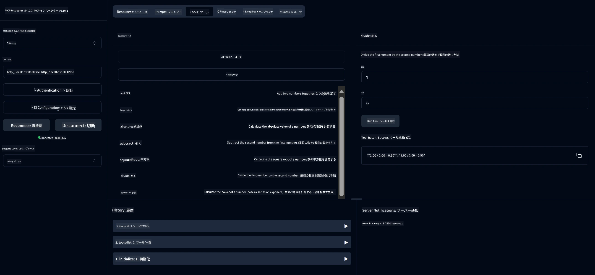

# 基本計算機 MCP サービス

> [!NOTE]
> このサンプルはレガシーな HTTP+SSE トランスポートを使用し、MCP `2025-11-25` 互換の SDK を対象としています。新しいリモートサーバーは `2026-07-28` のストリーミング対応 HTTP サポートを使用してください。
> MCP `2025-11-25` 互換の SDK を対象としています。新しいリモートサーバーは `2026-07-28` ストリーム対応
> HTTP サポートを使用すべきです。

このサービスは、Spring Boot と WebFlux トランスポートを用いて Model Context Protocol (MCP) による基本的な計算機操作を提供します。MCP 実装を学ぶ初心者向けのシンプルな例として設計されています。

詳細については [MCP Server Boot Starter](https://docs.spring.io/spring-ai/reference/api/mcp/mcp-server-boot-starter-docs.html) のリファレンスドキュメントを参照してください。

## 概要

本サービスでは以下を紹介しています：
- SSE (Server-Sent Events) のサポート
- Spring AI の `@Tool` アノテーションを用いた自動ツール登録
- 基本的な計算機能：
  - 加算、減算、乗算、除算
  - 累乗計算と平方根
  - 余り (モジュラス) と絶対値
  - 操作説明のためのヘルプ機能

## 機能

この計算機サービスは以下の機能を提供します：

1. <strong>基本算術操作</strong>：
   - 2つの数値の加算
   - 1つの数値から別の数値を減算
   - 2つの数値の乗算
   - 割り算（ゼロ除算チェック付き）

2. <strong>高度な操作</strong>：
   - 累乗計算（底数を指数でべき乗）
   - 平方根計算（負の数チェック付き）
   - モジュラス（余り）計算
   - 絶対値計算

3. <strong>ヘルプシステム</strong>：
   - 利用可能なすべての操作を説明する組み込みヘルプ機能

## サービスの使用方法

サービスは MCP プロトコルを通じて以下の API エンドポイントを公開します：

- `add(a, b)`: 2つの数値を加算
- `subtract(a, b)`: 2番目の数値を1番目の数値から減算
- `multiply(a, b)`: 2つの数値を乗算
- `divide(a, b)`: 1番目の数値を2番目で除算（ゼロチェック付き）
- `power(base, exponent)`: 数値の累乗を計算
- `squareRoot(number)`: 平方根を計算（負の数チェック付き）
- `modulus(a, b)`: 除算の余りを計算
- `absolute(number)`: 絶対値を計算
- `help()`: 利用可能な操作の情報を取得

## テストクライアント

簡単なテストクライアントが `com.microsoft.mcp.sample.client` パッケージに含まれています。`SampleCalculatorClient` クラスは計算機サービスの利用可能な操作を示しています。

## LangChain4j クライアントの使用

プロジェクトには LangChain4j クライアントの例が `com.microsoft.mcp.sample.client.LangChain4jClient` に含まれており、計算機サービスと LangChain4j や GitHub モデルとの統合方法を示しています：

### 前提条件

1. **GitHub トークンの設定**：
   
   GitHub の AI モデル（例: phi-4）を使用するには、GitHub パーソナルアクセストークンが必要です：

   a. GitHub アカウント設定に移動：https://github.com/settings/tokens
   
   b. 「Generate new token」をクリック → 「Generate new token (classic)」
   
   c. トークンに説明的な名前を付ける
   
   d. 以下のスコープを選択：
      - `repo`（プライベートリポジトリの完全管理）
      - `read:org`（組織・チームメンバーシップの読み取り、組織プロジェクト読み取り）
      - `gist`（Gistの作成）
      - `user:email`（ユーザーメールアドレスの読み取り専用アクセス）
   
   e. 「Generate token」をクリックし、新しいトークンをコピー
   
   f. 環境変数として設定：
      
      Windows の場合：
      ```
      set GITHUB_TOKEN=your-github-token
      ```
      
      macOS/Linux の場合：
      ```bash
      export GITHUB_TOKEN=your-github-token
      ```

   g. 恒久的な設定にはシステム設定から環境変数に追加してください

2. プロジェクトに LangChain4j GitHub 依存関係を追加（pom.xml に既に含まれています）：
   ```xml
   <dependency>
       <groupId>dev.langchain4j</groupId>
       <artifactId>langchain4j-github</artifactId>
       <version>${langchain4j.version}</version>
   </dependency>
   ```

3. 計算機サーバーが `localhost:8080` で起動していることを確認

### LangChain4j クライアントの実行

この例では、以下を示します：
- SSE トランスポートを使って計算機 MCP サーバーに接続
- LangChain4j を使って計算機操作を活用するチャットボットを作成
- GitHub AI モデルとの統合（現在は phi-4 モデル使用）

クライアントは以下のサンプルクエリを送信して機能を示します：
1. 2つの数値の合計計算
2. 数値の平方根を求める
3. 利用可能な計算機操作のヘルプ情報取得

この例を実行し、コンソール出力で AI モデルがどのように計算機ツールを使って応答するか確認してください。

### GitHub モデルの設定

LangChain4j クライアントは GitHub の phi-4 モデルを以下の設定で使用しています：

```java
ChatLanguageModel model = GitHubChatModel.builder()
    .apiKey(System.getenv("GITHUB_TOKEN"))
    .timeout(Duration.ofSeconds(60))
    .modelName("phi-4")
    .logRequests(true)
    .logResponses(true)
    .build();
```

別の GitHub モデルを使う場合は、`modelName` パラメータをサポートされている他のモデル名（例："claude-3-haiku-20240307"、"llama-3-70b-8192" など）に変更してください。

## 依存関係

プロジェクトは以下の主要な依存関係を必要とします：

```xml
<!-- For MCP Server -->
<dependency>
    <groupId>org.springframework.ai</groupId>
    <artifactId>spring-ai-starter-mcp-server-webflux</artifactId>
</dependency>

<!-- For LangChain4j integration -->
<dependency>
    <groupId>dev.langchain4j</groupId>
    <artifactId>langchain4j-mcp</artifactId>
    <version>${langchain4j.version}</version>
</dependency>

<!-- For GitHub models support -->
<dependency>
    <groupId>dev.langchain4j</groupId>
    <artifactId>langchain4j-github</artifactId>
    <version>${langchain4j.version}</version>
</dependency>
```

## プロジェクトのビルド

Maven を使ってプロジェクトをビルドします：
```bash
./mvnw clean install -DskipTests
```

## サーバーの起動

### Java の使用

```bash
java -jar target/calculator-server-0.0.1-SNAPSHOT.jar
```

### MCP Inspector の使用

MCP Inspector は MCP サービスとやり取りするための便利なツールです。この計算機サービスで使用するには：

1. **MCP Inspector をインストールして新しいターミナルウィンドウで起動**：
   ```bash
   npx @modelcontextprotocol/inspector
   ```

2. **表示される URL をクリックして Web UI にアクセス**（通常は http://localhost:6274）

3. <strong>接続の設定</strong>：
   - トランスポートタイプを「SSE」に設定
   - 実行中のサーバーの SSE エンドポイント URL を設定：`http://localhost:8080/sse`
   - 「Connect」をクリック

4. <strong>ツールの使用</strong>：
   - 「List Tools」をクリックして利用可能な計算機操作を一覧表示
   - ツールを選択し、「Run Tool」をクリックして操作を実行



### Docker の使用

プロジェクトにはコンテナ化デプロイ用の Dockerfile が含まれています：

1. **Docker イメージのビルド**：
   ```bash
   docker build -t calculator-mcp-service .
   ```

2. **Docker コンテナの起動**：
   ```bash
   docker run -p 8080:8080 calculator-mcp-service
   ```

これにより：
- Maven 3.9.9 と Eclipse Temurin 24 JDK を使ったマルチステージ Docker イメージをビルド
- 最適化されたコンテナイメージを作成
- ポート 8080 でサービスを公開
- コンテナ内で MCP 計算機サービスを起動

コンテナが起動後、`http://localhost:8080` でサービスにアクセスできます。

## トラブルシューティング

### GitHub トークンに関する一般的な問題

1. <strong>トークンの権限問題</strong>：403 Forbidden エラーが出る場合、前提条件に記載の通りトークンが正しい権限を持っていることを確認してください。

2. <strong>トークンが見つからない</strong>：「No API key found」エラーが出る場合は、GITHUB_TOKEN 環境変数が正しく設定されていることを確認してください。

3. <strong>レートリミット</strong>：GitHub API にはレート制限があります。429 ステータスコードのエラーが発生した場合は数分待ってから再試行してください。

4. <strong>トークンの有効期限</strong>：GitHub トークンは期限切れになることがあります。認証エラーが出たら新しいトークンを生成し、環境変数を更新してください。

さらなるサポートが必要な場合は [LangChain4j ドキュメント](https://github.com/langchain4j/langchain4j) または [GitHub API ドキュメント](https://docs.github.com/en/rest) を参照してください。

---

<!-- CO-OP TRANSLATOR DISCLAIMER START -->
**免責事項**：
本書類は AI 翻訳サービス [Co-op Translator](https://github.com/Azure/co-op-translator) を使用して翻訳されています。正確性を期していますが、自動翻訳には誤りや不正確な部分が含まれる可能性があることをご承知おきください。原文の原語版が正式な情報源とみなされるべきです。重要な情報については、専門の人間による翻訳を推奨します。本翻訳の利用により生じたいかなる誤解や解釈違いについても、当方は責任を負いかねます。
<!-- CO-OP TRANSLATOR DISCLAIMER END -->