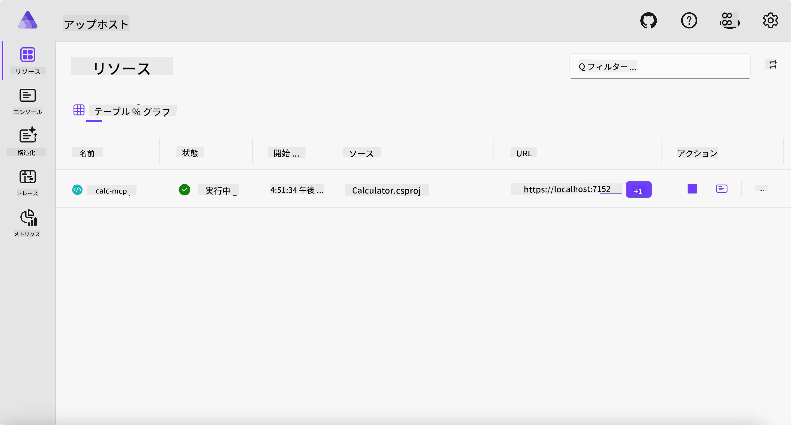
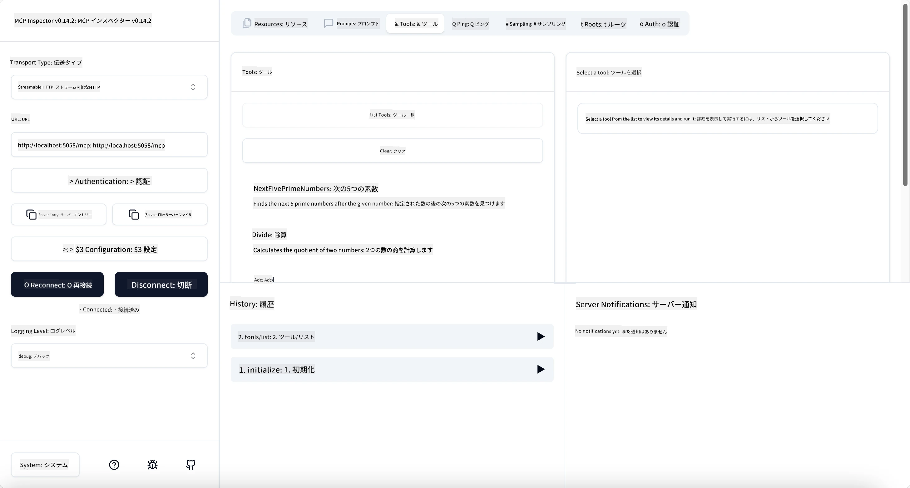
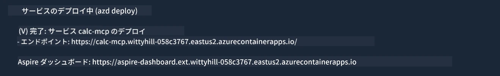

# サンプル

前の例では、`stdio`タイプのローカル.NETプロジェクトの使い方と、コンテナ内でサーバーをローカルに実行する方法を示しました。多くの状況でこれは良い解決策です。しかし、サーバーをクラウド環境のようなリモートで実行することも有用な場合があります。ここで`http`タイプが登場します。

`04-PracticalImplementation`フォルダーのソリューションを見ると、前回のものよりはるかに複雑に見えるかもしれませんが、実際にはそうではありません。`src/Calculator`プロジェクトをよく見ると、前の例とほとんど同じコードであることがわかります。唯一の違いは、HTTPリクエストを処理するために異なるライブラリ`ModelContextProtocol.AspNetCore`を使用していることです。また、メソッド`IsPrime`をプライベートに変更して、コード内にプライベートメソッドを持つことができることを示しています。それ以外のコードは以前と同じです。

他のプロジェクトは[Aspire](https://aspire.dev/get-started/what-is-aspire/)のものです。ソリューションにAspireを含めることで、開発とテストの体験が向上し、可観測性にも役立ちます。サーバーを実行するために必須ではありませんが、ソリューションに含めることは良い習慣です。

## サーバーをローカルで起動する

1. VS Code（C# DevKit拡張機能付き）から、`04-PracticalImplementation/samples/csharp`ディレクトリに移動します。
1. 次のコマンドを実行してサーバーを起動します：

   ```bash
    dotnet watch run --project ./src/AppHost
   ```

1. ブラウザがAspireダッシュボードを開いたら、`http`のURLを確認してください。`http://localhost:5058/`のようになっているはずです。

   

## MCP InspectorでStreamable HTTPをテストする

Node.js 22.7.5以降をお持ちの場合、MCP Inspectorでサーバーをテストできます。

サーバーを起動し、端末で次のコマンドを実行します：

```bash
npx @modelcontextprotocol/inspector http://localhost:5058
```



- トランスポートタイプとして`Streamable HTTP`を選択します。
- Urlフィールドに先ほど確認したサーバーのURLを入力し、`/mcp`を追加します。`http`（`https`ではありません）で、例えば`http://localhost:5058/mcp`のようにします。
- Connectボタンを選択します。

Inspectorの良い点は、何が起こっているかをわかりやすく可視化してくれるところです。

- 利用可能なツールの一覧を試してみてください。
- いくつかのツールを試してみてください。前回と同様に動作するはずです。

## GitHub Copilot Chat in VS CodeでMCPサーバーをテストする

GitHub Copilot ChatでStreamable HTTPトランスポートを使用するには、先に作成した「calc-mcp」サーバーの設定を次のように変更します：

```jsonc
// .vscode/mcp.json
{
  "servers": {
    "calc-mcp": {
      "type": "http",
      "url": "http://localhost:5058/mcp"
    }
  }
}
```

テストをしてみましょう：

- 「6780の後の3つの素数」と尋ねてみてください。Copilotが新しいツール`NextFivePrimeNumbers`を使い、最初の3つの素数のみを返すことに注意してください。
- 「111の後の7つの素数」と聞いて、どうなるか試してください。
- 「ジョンは24個のロリポップを3人の子どもに均等に配りたい。子ども一人あたり何個になるか」と尋ねて、どうなるか試してください。

## サーバーをAzureにデプロイする

サーバーをAzureにデプロイして、より多くの人に使ってもらいましょう。

端末から`04-PracticalImplementation/samples/csharp`フォルダーに移動し、次のコマンドを実行します：

```bash
azd up
```

デプロイが完了すると、次のようなメッセージが表示されるはずです：



URLを取得し、それをMCP InspectorやGitHub Copilot Chatで使用してください。

```jsonc
// .vscode/mcp.json
{
  "servers": {
    "calc-mcp": {
      "type": "http",
      "url": "https://calc-mcp.gentleriver-3977fbcf.australiaeast.azurecontainerapps.io/mcp"
    }
  }
}
```

## 次は？

さまざまなトランスポートタイプやテストツールを試し、MCPサーバーをAzureにデプロイしました。しかし、サーバーがプライベートリソースにアクセスする必要がある場合はどうでしょう？例えば、データベースやプライベートAPIなどです。次の章では、サーバーのセキュリティを強化する方法を見ていきます。

---

<!-- CO-OP TRANSLATOR DISCLAIMER START -->
**免責事項**：
本書類は AI 翻訳サービス [Co-op Translator](https://github.com/Azure/co-op-translator) を使用して翻訳されています。正確性を期していますが、自動翻訳には誤りや不正確な部分が含まれる可能性があることをご承知おきください。原文の原語版が正式な情報源とみなされるべきです。重要な情報については、専門の人間による翻訳を推奨します。本翻訳の利用により生じたいかなる誤解や解釈違いについても、当方は責任を負いかねます。
<!-- CO-OP TRANSLATOR DISCLAIMER END -->