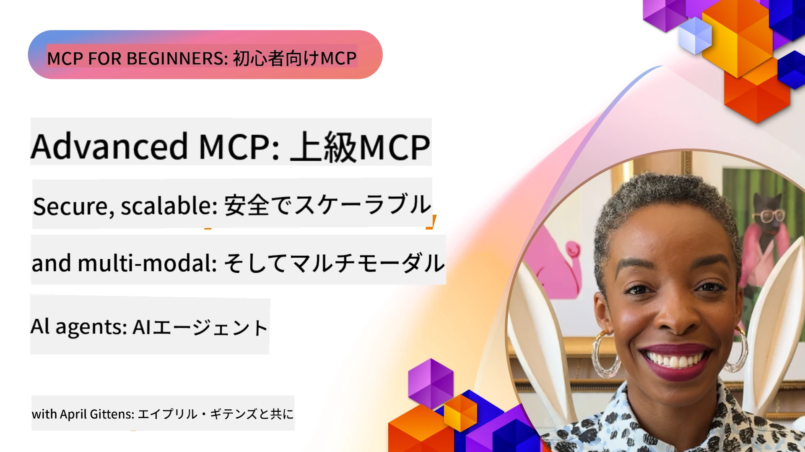

# MCPの高度なトピック

_(このレッスンのビデオを見るには上の画像をクリックしてください)_

この章では、モデルコンテキストプロトコル（MCP）の実装における一連の高度なトピックについて説明します。マルチモーダル統合、スケーラビリティ、セキュリティのベストプラクティス、エンタープライズ統合などが含まれます。これらのトピックは、現代のAIシステムの要求に応える堅牢で本番環境対応のMCPアプリケーションを構築するために不可欠です。

## 概要

このレッスンでは、モデルコンテキストプロトコルの実装における高度な概念を探求します。主にマルチモーダル統合、スケーラビリティ、セキュリティのベストプラクティス、およびエンタープライズ統合に焦点を当てています。これらのトピックは、エンタープライズ環境における複雑な要件を処理できる本番レベルのMCPアプリケーションを構築するために必須です。

> **今後の展望：** 以下のいくつかのトピックは`2026-07-28`のMCP仕様リリース候補の影響を受けています。ルートコンテキスト(5.4)およびサンプリング(5.6)は、リリース候補で非推奨とされるプリミティブに基づいており、プロトコル機能(5.16)で参照される実験的なTasks機能は専用のTasks拡張に移行しています。詳細は[What's Changing in MCP: The 2026-07-28 Release Candidate](../01-CoreConcepts/mcp-2026-07-28-release-candidate.md)を参照してください。

## 学習目標

このレッスンを終了するまでに、以下ができるようになります：

- MCPフレームワーク内でマルチモーダル機能を実装する
- 高負荷シナリオに対応できるスケーラブルなMCPアーキテクチャを設計する
- MCPのセキュリティ原則に沿ったセキュリティのベストプラクティスを適用する
- MCPをエンタープライズAIシステムおよびフレームワークと統合する
- 本番環境におけるパフォーマンスと信頼性を最適化する

## レッスンとサンプルプロジェクト

| リンク | タイトル | 説明 |
|------|-------|-------------|
| [5.1 Azure との統合e](./mcp-integration/README.md) | Azureとの統合 | Azure上のMCPサーバーとの統合方法を学ぶ |
| [5.2 マルチモーダル・サンプル](./mcp-multi-modality/README.md) | MCPマルチモーダルサンプル | 音声、画像、マルチモーダル応答のサンプル |
| [5.3 MCP OAuth2 サンプル](../../../05-AdvancedTopics/mcp-oauth2-demo) | MCP OAuth2 デモ | OAuth2を利用した最小限のSpring Bootアプリ。Authorization ServerとResource Server両方の役割を示し、安全なトークン発行、保護されたエンドポイント、Azure Container Appsへの展開、API管理統合を実演。 |
| [5.4 ルートコンテキスト](./mcp-root-contexts/README.md) | ルートコンテキスト | ルートコンテキストについて学び、その実装方法を習得（`2026-07-28`リリース候補で非推奨; `2025-11-25`までは有効） |
| [5.5 ルーティング](./mcp-routing/README.md) | ルーティング | さまざまなルーティングの種類を学ぶ |
| [5.6 サンプリング](./mcp-sampling/README.md) | サンプリング | サンプリングの扱い方を学ぶ（`2026-07-28`リリース候補で非推奨; `2025-11-25`までは有効） |
| [5.7 スケーリング](./mcp-scaling/README.md) | スケーリング | スケーリングについて学ぶ |
| [5.8 セキュリティ](./mcp-security/README.md) | セキュリティ | MCPサーバーを安全に保つ方法 |
| [5.9 Web 検索サンプル](./web-search-mcp/README.md) | Web検索MCP | SerpAPIと連携するPythonのMCPサーバーとクライアントの例。リアルタイムのウェブ、ニュース、製品検索、Q&Aに対応。マルチツールのオーケストレーション、外部API連携、堅牢なエラー処理を実証。 |
| [5.10 リアルタイム・ストリーミング](./mcp-realtimestreaming/README.md) | ストリーミング | 現代のデータ駆動型世界では、ビジネスやアプリケーションがタイムリーな意思決定のために即時情報アクセスを必要とし、リアルタイムデータストリーミングが不可欠となっている |
| [5.11 リアルタイム Web 検索証](./mcp-realtimesearch/README.md) | ウェブ検索 | MCPが提供する標準化されたコンテキスト管理を通じて、AIモデルや検索エンジン、アプリケーション間でリアルタイムウェブ検索がどのように変革されるかを学ぶ |
| [5.12 Model Context Protocol サーバー向け Entra ID 認証](./mcp-security-entra/README.md) | Entra ID認証 | Microsoft Entra IDは認証・アクセス管理の強力なクラウドベースソリューション。許可されたユーザーとアプリケーションのみがMCPサーバーとやり取りできるよう支援。 |
| [5.13 Microsoft Foundry エージェントとの統合](./mcp-foundry-agent-integration/README.md) | Microsoft Foundry統合 | Model Context ProtocolサーバーをMicrosoft Foundryエージェントと統合する方法を学ぶ。標準化された外部データソース接続により強力なツールオーケストレーションとエンタープライズAI機能を実現。 |
| [5.14 コンテキスト・エンジニアリング](./mcp-contextengineering/README.md) | コンテキストエンジニアリング | MCPサーバーの将来におけるコンテキストエンジニアリング技術の可能性。コンテキスト最適化、動的コンテキスト管理、効果的なプロンプトエンジニアリング戦略を含む。 |
| [5.15 MCP カスタム・トランスポート](./mcp-transport/README.md) | カスタムトランスポート | 特殊なMCP通信シナリオ向けにカスタムトランスポート機構を実装する方法を学ぶ。 |
| [5.16 プロトコル機能の詳細解説](./mcp-protocol-features/README.md) | プロトコル機能 | 進捗通知、リクエストキャンセル、リソーステンプレート、エラーハンドリングパターンなど、高度なプロトコル機能をマスターする。 |
| [5.17 敵対的マルチエージェント推論](./mcp-adversarial-agents/README.md) | 対立するエージェント | 対立する立場の2エージェントが単一のMCPツールセットを共有し、幻覚の検出、エッジケースの表出、構造化された討論を通じてより精度の高い出力を生成。 |

> **MCP仕様 2025-11-25の新機能**: 仕様には実験的な<strong>Tasks</strong>（進捗追跡付きの長時間実行操作）、<strong>ツール注釈</strong>（安全性のためのツールの振る舞いに関するメタデータ）、**URLモード誘導**（クライアントからの特定URLコンテンツ要求）、および拡張された<strong>ルート</strong>（ワークスペースコンテキスト管理）が含まれています。詳細は[MCP仕様の変更履歴](https://spec.modelcontextprotocol.io/)を参照してください。

## 追加リファレンス

最新の高度なMCPトピックについては、以下を参照してください：
- [MCP Documentation](https://modelcontextprotocol.io/)
- [MCP Specification (2025-11-25)](https://spec.modelcontextprotocol.io/specification/2025-11-25/)
- [GitHub Repository](https://github.com/modelcontextprotocol)
- [OWASP MCP Top 10](https://microsoft.github.io/mcp-azure-security-guide/mcp/) - セキュリティリスクと対策
- [MCP Security Summit Workshop (Sherpa)](https://azure-samples.github.io/sherpa/) - 実践的なセキュリティトレーニング

## 重要なポイント

- マルチモーダルMCP実装はテキスト処理を超えたAI機能の拡張を可能にする
- エンタープライズ展開にはスケーラビリティが不可欠であり、水平方向と垂直方向のスケーリングで対応可能
- 包括的なセキュリティ対策はデータを保護し適切なアクセス制御を保証する
- Azure OpenAIやMicrosoft AI Foundryなどのプラットフォームとのエンタープライズ統合がMCP機能を強化する
- 高度なMCP実装は最適化されたアーキテクチャと慎重なリソース管理から恩恵を受ける

## 演習

特定のユースケースに対するエンタープライズグレードのMCP実装を設計してください：

1. ユースケースのマルチモーダル要件を特定する
2. 機密データを保護するために必要なセキュリティコントロールを概説する
3. 変動する負荷に対応できるスケーラブルなアーキテクチャを設計する
4. エンタープライズAIシステムとの統合ポイントを計画する
5. 潜在的なパフォーマンスボトルネックと緩和戦略を文書化する

## 追加リソース

- [Azure OpenAI Documentation](https://learn.microsoft.com/en-us/azure/ai-services/openai/)
- [Microsoft AI Foundry Documentation](https://learn.microsoft.com/en-us/ai-services/)

---

## 次に進むには

このモジュールのレッスンを[5.1 Model Context Protocol（MCP）統合](./mcp-integration/README.md)から開始してください

このモジュールを完了したら、次は[モジュール6: コミュニティと貢献](../06-CommunityContributions/README.md)へ進みましょう

---

<!-- CO-OP TRANSLATOR DISCLAIMER START -->
**免責事項**：
本書類は AI 翻訳サービス [Co-op Translator](https://github.com/Azure/co-op-translator) を使用して翻訳されています。正確性を期していますが、自動翻訳には誤りや不正確な部分が含まれる可能性があることをご承知おきください。原文の原語版が正式な情報源とみなされるべきです。重要な情報については、専門の人間による翻訳を推奨します。本翻訳の利用により生じたいかなる誤解や解釈違いについても、当方は責任を負いかねます。
<!-- CO-OP TRANSLATOR DISCLAIMER END -->
