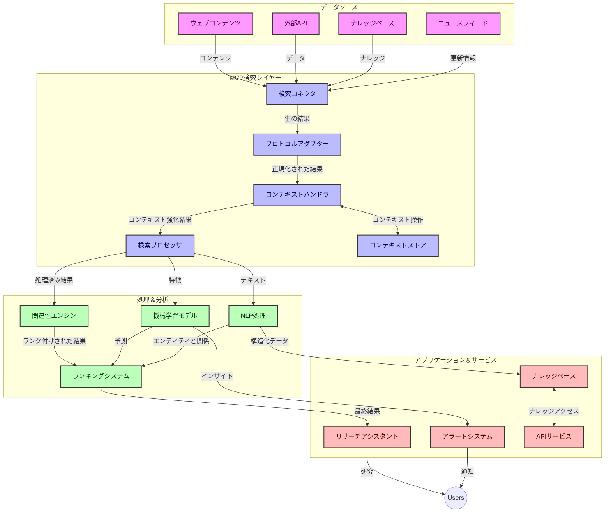
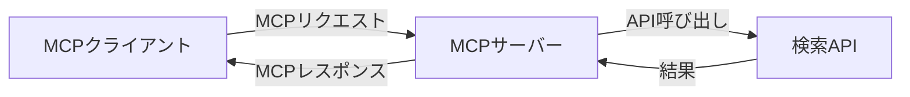
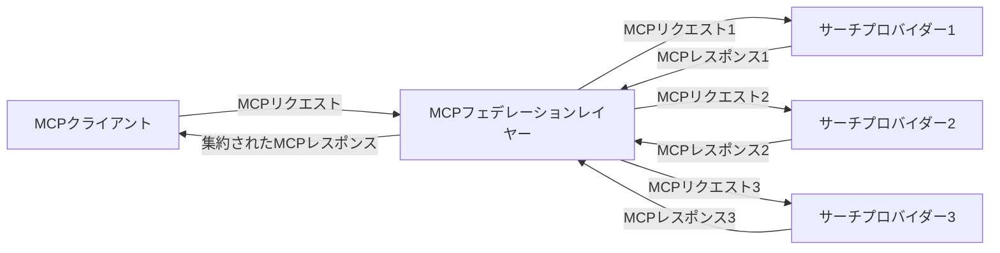
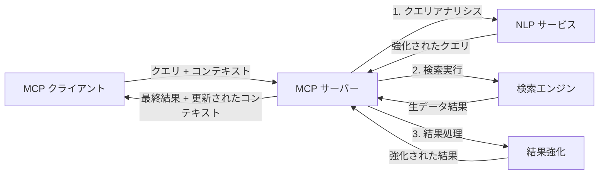

# リアルタイムウェブ検索のためのモデルコンテキストプロトコル

## 概要

リアルタイムウェブ検索は、情報主導の現代環境において不可欠なものとなり、アプリケーションはインターネット上の最新情報に即座にアクセスして関連性の高い適時な応答を提供する必要があります。モデルコンテキストプロトコル（MCP）は、これらのリアルタイム検索プロセスを最適化し、検索効率の向上、コンテキストの保持、全体的なシステム性能の改善において重要な進展を示しています。

本モジュールでは、AIモデル、検索エンジン、アプリケーション間でのコンテキスト管理の標準化されたアプローチを提供することで、MCPがリアルタイムウェブ検索をどのように変革するかを探ります。

### 学習内容

この包括的なガイドでは、以下の内容を学びます：

- MCPがAIモデルとリアルタイムウェブ検索機能をシームレスに橋渡しする方法
- MCPを用いた効率的でスケーラブルな検索ソリューションのアーキテクチャパターン
- 複数のクエリやインタラクションにわたる検索コンテキストの維持技術
- さまざまな検索シナリオに適用するPythonとJavaScriptの実践的なコード実装
- MCPを活用した検索システムにおける関連性、最新性、パフォーマンスのバランス調整メソッド

## リアルタイムウェブ検索の紹介

リアルタイムウェブ検索は、ウェブ上に公開または更新される情報を継続的にクエリ、処理、分析する技術的アプローチであり、システムが新鮮かつ関連性の高い情報を最小限の遅延で提供できるようにします。数時間または数日前のインデックスデータを対象とする従来の検索システムと異なり、リアルタイム検索はウェブのライブデータを扱い、オンラインコンテンツの現状を反映した洞察と情報を届けます。

### リアルタイムウェブ検索の基本コンセプト：

- <strong>継続的クエリ処理</strong>：常に更新されるデータソースに対して検索クエリを処理する
- <strong>最新性の優先</strong>：新鮮な情報を優先する設計
- <strong>関連性と最新性のバランス調整</strong>：両者の均衡を維持する
- <strong>スケーラブルなアーキテクチャ</strong>：可変なクエリ負荷とデータ量を処理可能
- <strong>コンテキスト理解</strong>：検索の反復でユーザーのコンテキストを保持し、意味のある結果を提供
- <strong>動的クエリ再構成</strong>：コンテキストや以前の結果に基づきクエリを適応的に変更する
- <strong>マルチソース統合</strong>：複数の検索プロバイダーやウェブソースの結果を統合
- <strong>意味論的理解</strong>：単なるキーワードではなく意味に基づいたクエリとコンテンツ処理
- <strong>リアルタイムランキング</strong>：新情報の到着に応じて結果順位を継続的に調整

### モデルコンテキストプロトコルとリアルタイムウェブ検索

モデルコンテキストプロトコル（MCP）は、リアルタイムウェブ検索環境におけるいくつかの重要な課題に対処します：

1. <strong>検索コンテキストの保持</strong>：MCPは分散された検索コンポーネント間でコンテキストの維持方法を標準化し、AIモデルや処理ノードが関連するクエリ履歴やユーザーの好みにアクセスできるようにします。

2. <strong>効率的なクエリ管理</strong>：コンテキスト伝達の構造化されたメカニズムを提供し、各検索反復でのコンテキストの繰り返しによるオーバーヘッドを減らします。

3. <strong>相互運用性</strong>：多様な検索技術とAIモデル間でコンテキストを共有する共通言語を創出し、より柔軟で拡張可能なアーキテクチャを実現します。

4. <strong>検索に最適化されたコンテキスト</strong>：MCP実装は有効な検索に最も関連深いコンテキスト要素を優先でき、パフォーマンスと精度の両立を図ります。

5. <strong>適応型検索処理</strong>：MCPによる適切なコンテキスト管理により、ユーザーのニーズや情報環境の変化に応じて検索処理を動的に調整できます。

ニュース集約からリサーチアシスタントまでの現代アプリケーションでは、MCPのウェブ検索技術との統合により、ユーザーのインタラクションが続くほどに関連性の高い結果を提供する、より知的でコンテキスト対応型の検索が可能になります。

## 学習目標

本レッスン終了時には以下ができるようになります：

- リアルタイムウェブ検索の基本と現代アプリケーションにおける課題を理解する
- モデルコンテキストプロトコル（MCP）がリアルタイムウェブ検索能力を強化する方法を説明する
- 人気のフレームワークとAPIを用いたMCPベースの検索ソリューションを実装する
- MCPを用いたスケーラブルで高性能な検索アーキテクチャを設計・展開する
- セマンティック検索、リサーチ支援、AI拡張ブラウジングなどの様々なユースケースにMCP概念を適用する
- MCPベースの検索技術における新興トレンドと将来の革新を評価する
- ユーザーインタラクションから学習するコンテキスト対応型検索システムを開発する
- 標準化されたMCPプロトコルを使いAIアシスタントにウェブ検索機能を統合する
- コンテキストに基づき段階的に結果を絞り込むマルチステージ検索パイプラインを作成する
- 包括的なコンテキスト認識を維持しつつ検索性能を最適化する

### 定義と重要性

リアルタイムウェブ検索は、ウェブベースの情報を最小限の遅延で継続的にクエリ、取得、配信することを指します。定期的にウェブをクロールしインデックスする従来型の検索エンジンと異なり、リアルタイム検索は情報が利用可能になるとすぐに表面化させ、最新コンテンツに即時アクセスできるようにします。

リアルタイムウェブ検索の主な特性：

- <strong>新鮮さ</strong>：最近のコンテンツと更新を優先
- <strong>継続的処理</strong>：新情報の監視を絶え間なく行う
- <strong>クエリアダプテーション</strong>：コンテキストやフィードバックに基づく検索クエリの改良
- <strong>即時配信</strong>：ほぼ遅延なく検索結果を提供
- <strong>コンテキスト維持</strong>：以前のクエリに基づき関連性を向上

### 従来型ウェブ検索の課題

従来のウェブ検索アプローチは、リアルタイムシナリオに適用する際に以下の制約に直面します：

1. <strong>コンテキストの断片化</strong>：複数クエリにわたる検索コンテキストの維持が困難
2. <strong>情報の新鮮さ</strong>：最新情報へのアクセスと優先付けの難しさ
3. <strong>統合の複雑さ</strong>：検索システムとアプリケーション間の相互運用性課題
4. <strong>レイテンシの問題</strong>：包括的な検索と応答時間のバランス
5. <strong>関連性チューニング</strong>：最新性を優先しつつ精度と関連性を確保

## 検索のためのモデルコンテキストプロトコル（MCP）理解

### 検索コンテキストにおけるMCPとは？

モデルコンテキストプロトコル（MCP）は、AIモデルとアプリケーション間の効率的な相互作用を促進する標準化された通信プロトコルです。リアルタイムウェブ検索の文脈では、MCPは以下のためのフレームワークを提供します：

- クエリシーケンス全体で検索コンテキストを保持する
- 検索クエリと結果フォーマットを標準化する
- 検索パラメータと結果の伝送を最適化する
- モデルと検索エンジン間の通信を強化する

### コアコンポーネントとアーキテクチャ

MCPのリアルタイムウェブ検索用アーキテクチャは以下の主要コンポーネントで構成されています：

1. <strong>クエストコンテキストハンドラー</strong>：複数クエリ間で検索コンテキストを管理かつ維持
2. <strong>検索プロセッサー</strong>：コンテキスト認識技術を用いて検索リクエストを処理
3. <strong>プロトコルアダプター</strong>：異なる検索API間の変換を行い、コンテキストを保持
4. <strong>コンテキストストア</strong>：検索履歴や好みを効率よく保存および取得
5. <strong>検索コネクター</strong>：多様な検索エンジンやウェブAPIに接続



### MCPがリアルタイムウェブ検索を改善する方法

MCPは従来のウェブ検索の課題に対し、以下の点で対処します：

- <strong>コンテキストの連続性</strong>：検索セッション全体にわたるクエリ間の関係を維持
- <strong>最適化された伝送</strong>：インテリジェントなコンテキスト管理により検索パラメータの冗長性を削減
- <strong>標準化インターフェース</strong>：検索コンポーネント用の一貫したAPIを提供
- <strong>レイテンシ削減</strong>：効率的なコンテキスト処理でオーバーヘッドを最小化
- <strong>関連性向上</strong>：複数のクエリにわたりユーザー意図を保持し検索関連性を改善

## 統合と実装

リアルタイムウェブ検索システムは性能とコンテキストの整合性を維持するために綿密なアーキテクチャ設計と実装が必要です。モデルコンテキストプロトコルは、AIモデルと検索技術の統合に標準化された手法を提供し、より高度でコンテキスト対応型の検索パイプラインを可能にします。

### 検索アーキテクチャにおけるMCP統合の概要

リアルタイムウェブ検索環境でMCPを実装する際は以下の点を考慮します：

1. <strong>検索コンテキストのシリアライズ</strong>：MCPは検索リクエスト内でコンテキスト情報を効率的にエンコードする機構を提供し、重要なコンテキストが処理パイプライン全体でクエリと共に伝達されることを保証します。これには検索関連メタデータに最適化された標準的なシリアライズフォーマットが含まれます。

2. <strong>状態を持つ検索処理</strong>：MCPは検索反復間で一貫したコンテキスト表現を維持することで、より知的な状態を持つ処理を可能にします。これはコンテキストの洗練が結果を改善するマルチステージ検索パイプラインで特に価値があります。

3. <strong>クエリの拡張と洗練</strong>：MCP実装は蓄積されたコンテキストに基づいた高度なクエリ拡張や洗練を支援し、検索セッションが進むにつれてより関連性の高い結果を導きます。

4. <strong>結果のキャッシュと優先順位付け</strong>：コンテキスト管理を標準化することで、MCPは結果のキャッシュ管理と優先順位付けを助け、検索コンテキストの進化に応じてコンポーネントが適応できます。

5. <strong>検索フェデレーションと集約</strong>：MCPは複数のバックエンドにまたがる検索を高度に連携させることを促進し、検索コンテキストの構造化された表現を提供、さまざまなソースからの結果の意味ある集約を可能にします。

MCPを様々な検索技術にわたって実装することで、コンテキスト管理の統一的アプローチが生まれ、カスタム統合コードの必要性を減らしつつ、検索クエリの進化時に意味のあるコンテキストを維持する能力を向上させます。

### 各種ウェブ検索実装におけるMCP

これらの例は、異なるトランスポートメカニズムを備えたJSON-RPCベースのプロトコルに焦点を当てる現行のMCP仕様に準拠しています。コードはMCPプロトコルとの完全な互換性を保ちつつカスタム検索統合を実装する方法を示しています。


<details>
<summary>一般的な検索APIを用いたPython実装</summary>

```python
import asyncio
import json
import aiohttp
from typing import Dict, Any, Optional, List
from contextlib import asynccontextmanager
from collections.abc import AsyncIterator

# 標準のMCPライブラリをインポートする
from mcp.client.session import ClientSession
from mcp.client.streamable_http import streamablehttp_client
from mcp.types import TextContent, CreateMessageRequestParams, CreateMessageResult
from mcp.server.fastmcp import FastMCP

# ウェブ検索用のFastMCPサーバーを作成する
search_server = FastMCP("WebSearch")

# ウェブ検索操作を処理するクラス
class WebSearchHandler:
    def __init__(self, api_endpoint: str, api_key: str):
        self.api_endpoint = api_endpoint
        self.api_key = api_key
        self.session = None
        
    async def initialize(self):
        """Initialize the HTTP session"""
        self.session = aiohttp.ClientSession(
            headers={"Authorization": f"Bearer {self.api_key}"}
        )
    
    async def close(self):
        """Close the HTTP session"""
        if self.session:
            await self.session.close()
            
    async def perform_search(self, query: str, max_results: int = 5, 
                           include_domains: List[str] = None, 
                           exclude_domains: List[str] = None,
                           time_period: str = "any") -> Dict[str, Any]:
        """Perform web search using the search API"""
        # 検索パラメータを構築する
        search_params = {
            "q": query,
            "limit": max_results,
            "time": time_period
        }
        
        if include_domains:
            search_params["site"] = ",".join(include_domains)
            
        if exclude_domains:
            search_params["exclude_site"] = ",".join(exclude_domains)
        
        # 検索リクエストを実行する
        try:
            async with self.session.get(
                self.api_endpoint,
                params=search_params
            ) as response:
                if response.status != 200:
                    error_text = await response.text()
                    raise Exception(f"Search API error: {response.status} - {error_text}")
                
                search_data = await response.json()
                
                # API固有のレスポンスを標準形式に変換する
                results = []
                for item in search_data.get("results", []):
                    results.append({
                        "title": item.get("title", ""),
                        "url": item.get("url", ""),
                        "snippet": item.get("snippet", ""),
                        "date": item.get("published_date", ""),
                        "source": item.get("source", "")
                    })
                
                return {
                    "query": query,
                    "totalResults": len(results),
                    "results": results
                }
        except Exception as e:
            print(f"Search API request error: {e}")
            raise

# 検索ハンドラを初期化する
search_handler = WebSearchHandler(
    api_endpoint="https://api.search-service.example/search",
    api_key="your-api-key-here"
)

# 検索ハンドラを管理するためにライフスパンを設定する
@asyncio.asynccontextmanager
async def app_lifespan(server: FastMCP):
    """Manage application lifecycle"""
    await search_handler.initialize()
    try:
        yield {"search_handler": search_handler}
    finally:
        await search_handler.close()

# サーバーのライフスパンを設定する
search_server = FastMCP("WebSearch", lifespan=app_lifespan)

# ウェブ検索ツールを登録する
@search_server.tool()
async def web_search(query: str, max_results: int = 5, 
                   include_domains: List[str] = None,
                   exclude_domains: List[str] = None,
                   time_period: str = "any") -> Dict[str, Any]:
    """
    Search the web for information
    
    Args:
        query: The search query
        max_results: Maximum number of results to return (default: 5)
        include_domains: List of domains to include in search results
        exclude_domains: List of domains to exclude from search results
        time_period: Time period for results ("day", "week", "month", "any")
        
    Returns:
        Dictionary containing search results
    """
    ctx = search_server.get_context()
    search_handler = ctx.request_context.lifespan_context["search_handler"]
    
    results = await search_handler.perform_search(
        query=query,
        max_results=max_results,
        include_domains=include_domains,
        exclude_domains=exclude_domains,
        time_period=time_period
    )
    
    return results

# クライアント利用例
async def client_example():
    # Streamable HTTPトランスポートを使用して検索サーバーに接続する
    async with streamablehttp_client("http://localhost:8000/mcp") as (read, write, _):
        async with ClientSession(read, write) as session:
            # 接続を初期化する
            await session.initialize()
            
            # web_searchツールを呼び出す
            search_results = await session.call_tool(
                "web_search", 
                {
                    "query": "latest developments in AI and Model Context Protocol",
                    "max_results": 5,
                    "time_period": "day",
                    "include_domains": ["github.com", "microsoft.com"]
                }
            )
            
            print(f"Search results: {search_results}")

# サーバー実行例
if __name__ == "__main__":
    # Streamable HTTPトランスポートでサーバーを実行する
    search_server.run(transport="streamable-http")
```
</details> 

<details>
<summary>ブラウザベース検索を用いたJavaScript実装</summary>


```javascript
// ウェブ検索のためのMCPサーバー実装
import { McpServer, ResourceTemplate } from '@modelcontextprotocol/sdk/server/mcp.js';
import { StreamableHTTPServerTransport } from '@modelcontextprotocol/sdk/server/streamableHttp.js';
import { z } from 'zod';

// ウェブ検索用のMCPサーバーを作成する
const searchServer = new McpServer({
    name: "BrowserSearch",
    description: "A server that provides web search capabilities"
});

// 検索サービスクラス
class SearchService {
    constructor(searchApiUrl, apiKey) {
        this.searchApiUrl = searchApiUrl;
        this.apiKey = apiKey;
    }

    async performSearch(parameters) {
        const {
            query = '',
            maxResults = 5,
            includeDomains = [],
            excludeDomains = [],
            timePeriod = 'any'
        } = parameters;
        
        // パラメータを使って検索URLを構築する
        const url = new URL(this.searchApiUrl);
        url.searchParams.append('q', query);
        url.searchParams.append('limit', maxResults);
        url.searchParams.append('time', timePeriod);
        
        if (includeDomains.length > 0) {
            url.searchParams.append('site', includeDomains.join(','));
        }
        
        if (excludeDomains.length > 0) {
            url.searchParams.append('exclude_site', excludeDomains.join(','));
        }
        
        try {
            const response = await fetch(url.toString(), {
                method: 'GET',
                headers: {
                    'Authorization': `Bearer ${this.apiKey}`,
                    'Content-Type': 'application/json'
                }
            });
            
            if (!response.ok) {
                const errorText = await response.text();
                throw new Error(`Search API error: ${response.status} - ${errorText}`);
            }
            
            const searchData = await response.json();
            
            // API固有のレスポンスを標準フォーマットに変換する
            const results = searchData.results?.map(item => ({
                title: item.title || '',
                url: item.url || '',
                snippet: item.snippet || '',
                date: item.published_date || '',
                source: item.source || ''
            })) || [];
            
            return {
                query,
                totalResults: results.length,
                results
            };
        } catch (error) {
            console.error('Search API request error:', error);
            throw error;
        }
    }
}

// 検索サービスを初期化する
const searchService = new SearchService(
    'https://api.search-service.example/search',
    'your-api-key-here'
);

// サーバーのコンテキストプロバイダーを設定する
searchServer.setContextProvider(() => {
    return {
        searchService
    };
});

// ウェブ検索ツールを登録する
searchServer.tool({
    name: 'web_search',
    description: 'Search the web for information',
    parameters: {
        type: 'object',
        properties: {
            query: {
                type: 'string',
                description: 'The search query'
            },
            maxResults: {
                type: 'integer',
                description: 'Maximum number of results to return',
                default: 5
            },
            includeDomains: {
                type: 'array',
                items: { type: 'string' },
                description: 'List of domains to include in search results'
            },
            excludeDomains: {
                type: 'array',
                items: { type: 'string' },
                description: 'List of domains to exclude from search results'
            },
            timePeriod: {
                type: 'string',
                description: 'Time period for results',
                enum: ['day', 'week', 'month', 'any'],
                default: 'any'
            }
        },
        required: ['query']
    },
    handler: async (params, context) => {
        const { searchService } = context;
        return await searchService.performSearch(params);
    }
});

// 検索サーバーに接続するためのクライアントサンプルコード
import { Client } from '@modelcontextprotocol/sdk/client/index.js';
import { StreamableHTTPClientTransport } from '@modelcontextprotocol/sdk/client/streamableHttp.js';

async function connectToSearchServer() {
    // 検索サーバーに接続する
    const transport = new StreamableHTTPClientTransport(
        new URL('http://localhost:8000/mcp')
    );
    
    const client = new Client({
        name: 'search-client',
        version: '1.0.0'
    });
    
    await client.connect(transport);
    
    // 検索ツールを実行する
    const searchResults = await client.callTool({
        name: 'web_search',
        arguments: {
            query: 'Model Context Protocol implementation examples',
            maxResults: 10,
            timePeriod: 'week',
            includeDomains: ['github.com', 'docs.microsoft.com']
        }
    });
    
    console.log('Search results:', searchResults);
    
    // クリーンアップ
    await client.disconnect();
}

// サーバーを起動する
const transport = new StreamableHTTPServerTransport();
await searchServer.connect(transport);
console.log('Search server running at http://localhost:8000/mcp');

// 別プロセスでまたはサーバー起動後に
// connectToSearchServer().catch(console.error);
```
</details> 


## コード例に関する免責事項

> <strong>重要なお知らせ</strong>: 以下のコード例は、モデルコンテキストプロトコル（MCP）とウェブ検索機能の統合を示しています。公式MCP SDKのパターンと構造に従っていますが、教育目的で簡略化されています。
> 
> これらの例は次を示しています：
> 
> 1. **Python実装**：FastMCPサーバー実装で、ウェブ検索ツールを提供し外部検索APIに接続します。この例は、公式MCP Python SDKのパターンに従い、適切なライフスパン管理、コンテキスト処理、ツール実装を示し、推奨されているStreamable HTTPトランスポートを利用しています。これは、旧来のSSEトランスポートに代わる本番展開推奨方式です。
> 
> 2. **JavaScript実装**：公式MCP TypeScript SDKのFastMCPパターンを用いたTypeScript/JavaScript実装で、適切なツール定義とクライアント接続を備えた検索サーバーを作成しています。最新のセッション管理およびコンテキスト保持パターンに従っています。
> 
> これらの例は、実運用には追加のエラーハンドリング、認証、特定のAPI統合コードが必要です。検索APIエンドポイント（`https://api.search-service.example/search`）はダミーであり、実際の検索サービスエンドポイントに差し替えが必要です。
> 
> 完全な実装詳細や最新のアプローチは、
> [公式MCP仕様](https://modelcontextprotocol.io/specification/2026-07-28/)
> およびSDKドキュメンテーションを参照してください。

## コアコンセプト

### モデルコンテキストプロトコル（MCP）フレームワーク

モデルコンテキストプロトコルは、AIモデル、アプリケーション、サービス間でコンテキストを交換するための標準化された方法を提供します。リアルタイムウェブ検索において、このフレームワークは一貫したマルチターン検索体験を作る上で不可欠です。主な構成要素は以下のとおりです：

1. **クライアント-サーバーアーキテクチャ**：MCPは検索クライアント（リクエスター）と検索サーバー（プロバイダー）の明確な分離を確立し、柔軟な展開モデルを可能にします。

2. **JSON-RPC通信**：メッセージ交換にJSON-RPCを使用し、ウェブ技術と互換性があり、異なるプラットフォーム間での実装が容易です。

3. <strong>コンテキスト管理</strong>：複数のインタラクションにわたって検索コンテキストを維持、更新、活用するための構造化された方法を定義します。

4. <strong>ツール定義</strong>：検索機能は、明確なパラメータと戻り値を持つ標準化されたツールとして公開されます。

5. <strong>ストリーミング対応</strong>：リアルタイム検索では結果が段階的に到着するため、結果のストリーミングをサポートします。

### ウェブ検索統合パターン

MCPをウェブ検索と統合すると、いくつかのパターンが現れます：

#### 1. 直接検索プロバイダー統合



このパターンでは、MCPサーバーが1つ以上の検索APIと直接インターフェースし、MCPリクエストをAPI固有の呼び出しに変換し、結果をMCPレスポンスとして整形します。

#### 2. コンテキスト保持型フェデレーテッドサーチ



このパターンでは、複数のMCP対応検索プロバイダーに検索クエリを分散します。各プロバイダーは異なるタイプのコンテンツや検索機能に特化している可能性がありますが、統一されたコンテキストを維持します。

#### 3. コンテキスト強化型検索チェーン



このパターンでは、検索処理が複数段階に分かれ、各ステップでコンテキストが強化され、段階的により関連性の高い結果を導きます。

### 検索コンテキストの構成要素

MCPベースのウェブ検索では、コンテキストは通常以下を含みます：

- <strong>クエリ履歴</strong>：セッション内の過去の検索クエリ
- <strong>ユーザーの好み</strong>：言語、地域、セーフサーチ設定
- <strong>インタラクション履歴</strong>：クリックされた結果、結果に費やした時間
- <strong>検索パラメータ</strong>：フィルター、並べ替え順序、その他の検索修飾子
- <strong>ドメイン知識</strong>：検索に関連する専門的なコンテキスト
- <strong>時間的コンテキスト</strong>：時間に基づく関連性の要因
- <strong>ソースの好み</strong>：信頼または優先する情報源

## ユースケースと応用

### リサーチと情報収集

MCPはリサーチワークフローを次のように強化します：

- 検索セッションを超えたリサーチコンテキストの保持
- より高度でコンテキストに即したクエリの実現
- マルチソース検索フェデレーションの支援
- 検索結果からの知識抽出の促進

### リアルタイムニュースとトレンドモニタリング

MCP駆動の検索はニュース監視に以下の利点を提供します：

- 新興ニュースのほぼリアルタイム発見
- 関連情報のコンテキストフィルタリング
- 複数ソースにわたるトピックおよびエンティティの追跡
- ユーザーコンテキストに基づくパーソナライズドニュースアラート

### AI拡張ブラウジングとリサーチ

MCPはAI拡張ブラウジングの新たな可能性を創出します：

- 現在のブラウザ活動に基づくコンテキスト検索提案
- ウェブ検索とLLM搭載アシスタントのシームレスな統合
- コンテキストを維持したマルチターン検索の洗練
- 強化されたファクトチェックと情報検証

## 今後のトレンドと革新

### ウェブ検索におけるMCPの進化

今後、MCPは以下の課題に対応して進化すると予測されます：


- <strong>マルチモーダル検索</strong>: 文脈を保持したテキスト、画像、音声、動画の検索の統合
- <strong>分散型検索</strong>: 分散およびフェデレーション型検索エコシステムのサポート
- <strong>検索プライバシー</strong>: 文脈認識型のプライバシー保護検索メカニズム
- <strong>クエリ理解</strong>: 自然言語検索クエリの深層意味解析

### 技術の潜在的な進歩

MCP検索の将来を形作る新興技術:

1. <strong>ニューラル検索アーキテクチャ</strong>: MCP向けに最適化された埋め込みベースの検索システム
2. <strong>パーソナライズされた検索コンテキスト</strong>: 個々のユーザーの検索パターンの継続的学習
3. <strong>ナレッジグラフ統合</strong>: ドメイン特化型ナレッジグラフで強化された文脈検索
4. <strong>クロスモーダルコンテキスト</strong>: 異なる検索モダリティ間でのコンテキスト保持

## ハンズオン演習

### 演習1: 基本的なMCP検索パイプラインのセットアップ

この演習では、以下を学びます:
- 基本的なMCP検索環境の構成
- ウェブ検索用コンテキストハンドラの実装
- 検索反復間でのコンテキスト保持のテストと検証

### 演習2: MCP検索を使ったリサーチアシスタントの構築

完成されたアプリケーションを作成します:
- 自然言語の研究質問の処理
- 文脈認識型ウェブ検索の実行
- 複数の情報源から情報を統合
- 整理された調査結果の提示

### 演習3: MCPによるマルチソース検索フェデレーションの実装

上級演習内容:
- 文脈認識型の複数検索エンジンへのクエリ派遣
- 結果のランキングと集約
- 検索結果の文脈的重複排除
- ソース固有メタデータの取り扱い

## 追加リソース

- [Model Context Protocol Specification](https://modelcontextprotocol.io/specification/2026-07-28/) - MCPの公式仕様書および詳細プロトコルドキュメント
- [Model Context Protocol Documentation](https://modelcontextprotocol.io/) - 詳細なチュートリアルと実装ガイド
- [MCP Python SDK](https://github.com/modelcontextprotocol/python-sdk) - MCPプロトコルの公式Python実装
- [MCP TypeScript SDK](https://github.com/modelcontextprotocol/typescript-sdk) - MCPプロトコルの公式TypeScript実装
- [MCP Reference Servers](https://github.com/modelcontextprotocol/servers) - MCPサーバーのリファレンス実装
- [Bing Web Search API Documentation](https://learn.microsoft.com/en-us/bing/search-apis/bing-web-search/overview) - Microsoftのウェブ検索API
- [Google Custom Search JSON API](https://developers.google.com/custom-search/v1/overview) - Googleのプログラム可能検索エンジン
- [SerpAPI Documentation](https://serpapi.com/search-api) - 検索エンジン結果ページAPI
- [Meilisearch Documentation](https://www.meilisearch.com/docs) - オープンソース検索エンジン
- [Elasticsearch Documentation](https://www.elastic.co/guide/index.html) - 分散検索および分析エンジン
- [LangChain Documentation](https://python.langchain.com/docs/get_started/introduction) - LLMを使ったアプリケーション構築

## 学習目標

本モジュール完了後、以下が可能になります:

- リアルタイムウェブ検索の基本と課題の理解
- Model Context Protocol (MCP) がリアルタイムウェブ検索機能を強化する方法の説明
- 人気のあるフレームワークやAPIを使ったMCPベースの検索ソリューションの実装
- MCPによるスケーラブルで高性能な検索アーキテクチャの設計と展開
- セマンティック検索、リサーチ支援、AI支援ブラウジングなど多様なユースケースでのMCP概念の適用
- MCPベースの検索技術における新興トレンドと将来の革新の評価


### 信頼性と安全性の考慮事項

MCPベースのウェブ検索ソリューションを実装する際は、MCP仕様の以下の重要な原則を守ってください:

1. <strong>ユーザーの同意と制御</strong>: ユーザーがすべてのデータアクセスと操作に明示的に同意し、理解すること。特に外部データソースにアクセスするウェブ検索実装で重要です。

2. <strong>データプライバシー</strong>: 検索クエリと結果が機微情報を含む可能性があるため、適切な取り扱いを徹底し、ユーザーデータを保護するためのアクセス制御を実装してください。

3. <strong>ツールの安全性</strong>: 検索ツールは任意コード実行の可能性を秘めているため、適切な認可と検証を実装してください。ツールの動作説明は、信頼されたサーバーから得られたものでない限り信頼しないこと。

4. <strong>明確なドキュメント</strong>: MCP仕様の実装ガイドラインに従い、能力・制限・セキュリティ考慮について明確なドキュメントを提供してください。

5. <strong>堅牢な同意フロー</strong>: 各ツールが何を行うかを明確に説明し、外部ウェブリソースとやり取りするツールの使用許可前に適切な同意と認可フローを構築してください。

MCPのセキュリティと信頼性に関する詳細は、
[公式ドキュメント](https://modelcontextprotocol.io/specification/2026-07-28/basic/security_best_practices)をご参照ください。

## 次にやること

- [5.12 Entra ID Authentication for Model Context Protocol Servers](../mcp-security-entra/README.md)

---

<!-- CO-OP TRANSLATOR DISCLAIMER START -->
**免責事項**：
本書類は AI 翻訳サービス [Co-op Translator](https://github.com/Azure/co-op-translator) を使用して翻訳されています。正確性を期していますが、自動翻訳には誤りや不正確な部分が含まれる可能性があることをご承知おきください。原文の原語版が正式な情報源とみなされるべきです。重要な情報については、専門の人間による翻訳を推奨します。本翻訳の利用により生じたいかなる誤解や解釈違いについても、当方は責任を負いかねます。
<!-- CO-OP TRANSLATOR DISCLAIMER END -->