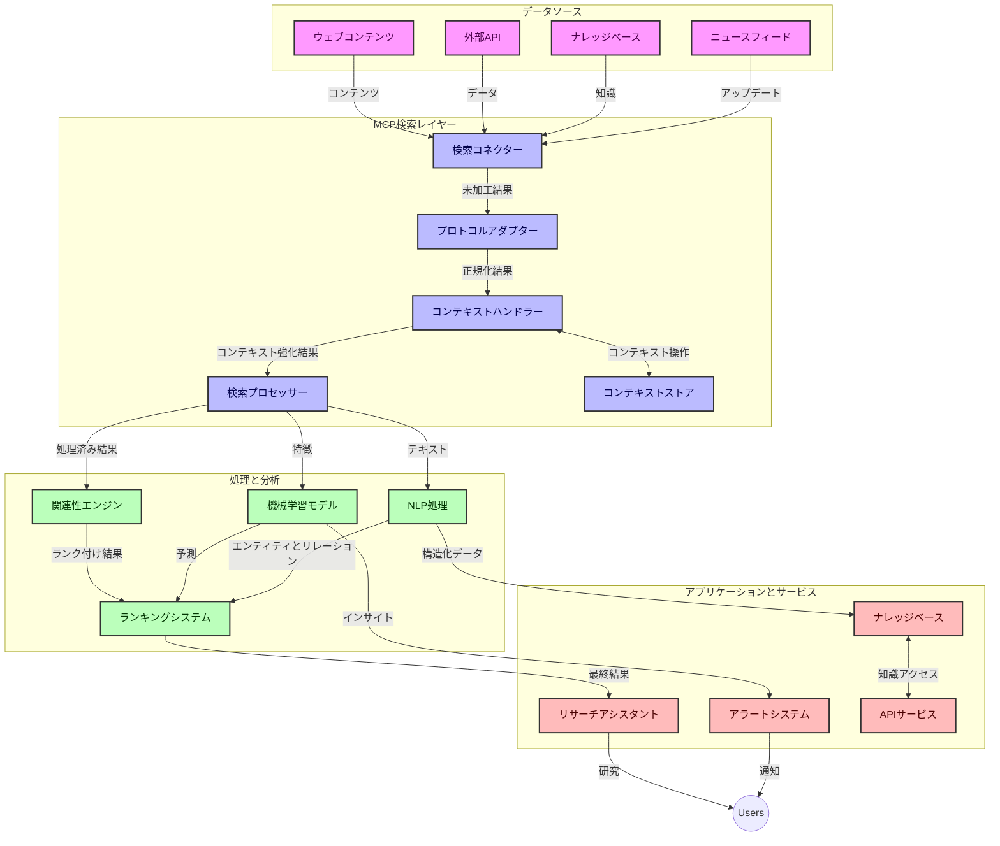
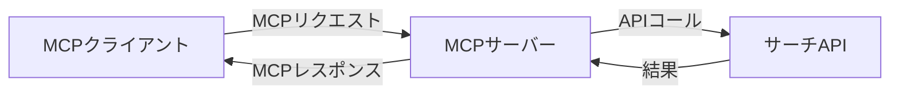
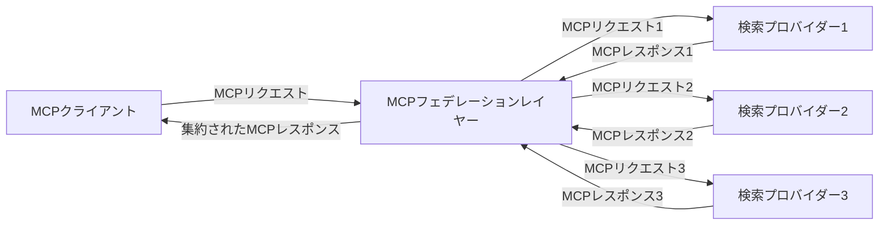
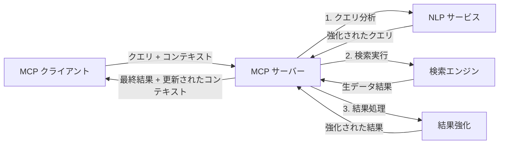

# リアルタイムウェブ検索のためのモデルコンテキストプロトコル

## 概要

リアルタイムウェブ検索は、最新かつ関連性の高い情報を提供するためにインターネット全体への即時アクセスが必要な、現代の情報駆動型環境で不可欠となっています。モデルコンテキストプロトコル（MCP）は、これらのリアルタイム検索プロセスを最適化し、検索効率を向上させ、コンテキストの整合性を維持し、システム全体のパフォーマンスを改善する上で重要な進歩を表しています。

本モジュールでは、MCPがAIモデル、検索エンジン、アプリケーション間でのコンテキスト管理に標準的なアプローチを提供することで、リアルタイムウェブ検索をどのように変革するかを探ります。

### 学習項目

この包括的なガイドでは、以下を学びます：

- MCPがAIモデルとリアルタイムウェブ検索機能の間にシームレスな橋渡しを作る方法
- MCPを用いて効率的かつスケーラブルな検索ソリューションを実装するためのアーキテクチャパターン
- 複数のクエリやインタラクションにわたる検索コンテキストを保持する技術
- さまざまな検索シナリオ向けにPythonおよびJavaScriptでの実践的なコード実装
- MCP搭載の検索システムで関連性、鮮度、パフォーマンスをバランスさせる方法

## リアルタイムウェブ検索の紹介

リアルタイムウェブ検索は、ウェブ上の情報が公開または更新されると同時に継続的に照会、処理、分析を行い、システムが新鮮で関連性の高い情報をほぼ遅延なく提供できる技術的手法です。従来の数時間から数日前のインデックス化されたデータを操作する検索システムと異なり、リアルタイム検索はウェブのライブデータを処理し、オンラインコンテンツの現状を反映した洞察と情報を提供します。

### リアルタイムウェブ検索のコアコンセプト：

- <strong>継続的なクエリ処理</strong>: 絶えず更新されるデータソースに対して検索クエリを処理
- <strong>鮮度優先</strong>: 新鮮な情報を優先する設計
- <strong>関連性のバランス</strong>: 関連性と鮮度のバランスを維持
- <strong>スケーラブルなアーキテクチャ</strong>: 可変のクエリ負荷とデータ量を処理可能に
- <strong>コンテキスト理解</strong>: 検索の繰り返しに渡るユーザーコンテキストの維持が有意義な結果に必須
- <strong>動的なクエリ再形成</strong>: コンテキストと前回結果に基づきクエリを適応的に変更
- <strong>複数ソース統合</strong>: 複数の検索プロバイダーやウェブソースからの結果を統合
- <strong>セマンティック理解</strong>: キーワードだけでなく意味に基づいたクエリとコンテンツ処理
- <strong>リアルタイムランク付け</strong>: 新しい情報の出現に合わせて結果の順位を継続的に調整

### モデルコンテキストプロトコルとリアルタイムウェブ検索

モデルコンテキストプロトコル（MCP）は、リアルタイムウェブ検索環境の以下の重要課題に対処します：

1. <strong>検索コンテキストの保持</strong>: MCPは分散検索コンポーネント間でのコンテキスト維持を標準化し、AIモデルや処理ノードが関連するクエリ履歴やユーザーの好みにアクセスできるようにします。

2. <strong>効率的なクエリ管理</strong>: コンテキスト伝達のための構造化メカニズムを提供することで、各検索反復時のコンテキストの繰り返しによるオーバーヘッドを削減します。

3. <strong>相互運用性</strong>: MCPは多様な検索技術とAIモデル間でコンテキスト共有の共通言語を創出し、より柔軟かつ拡張可能なアーキテクチャを実現します。

4. <strong>検索最適化されたコンテキスト</strong>: MCPの実装は、効果的な検索に最も関連性の高いコンテキスト要素を優先し、パフォーマンスと精度の両立を最適化します。

5. <strong>適応型検索処理</strong>: MCPによる適切なコンテキスト管理により、検索システムは進化するユーザーのニーズや情報環境に応じて動的に処理を調整できます。

ニュース集約からリサーチアシスタントに至る現代のアプリケーションでは、MCPとウェブ検索技術の統合により、ユーザーのインタラクションが続くほどにより関連性の高い結果を提供できる、よりインテリジェントでコンテキストを意識した検索が可能になります。

## 学習目標

このレッスンの終わりまでに、あなたは以下ができるようになります：

- リアルタイムウェブ検索の基本と現代のアプリケーションでの課題を理解する
- モデルコンテキストプロトコル（MCP）がリアルタイムウェブ検索機能をどのように強化するか説明する
- 人気のフレームワークとAPIを使ってMCPベースの検索ソリューションを実装する
- MCPを用いたスケーラブルで高性能な検索アーキテクチャを設計・展開する
- セマンティック検索、リサーチ支援、AI拡張ブラウジングなどの様々なユースケースにMCPの概念を応用する
- MCPベースの検索技術における新興の動向と将来の革新を評価する
- ユーザーのインタラクションから学習するコンテキスト対応検索システムを開発する
- 標準化されたMCPプロトコルを使用してAIアシスタントにウェブ検索機能を統合する
- コンテキストに基づいて段階的に結果を洗練するマルチステージ検索パイプラインを作成する
- 包括的なコンテキスト認識を維持しつつ検索パフォーマンスを最適化する

### 定義と重要性

リアルタイムウェブ検索は、遅延を最小限に抑えてウェブベースの情報を継続的に照会、取得、配信することを含みます。定期的にウェブをクロールしインデックス化する従来の検索エンジンとは異なり、リアルタイム検索は情報が利用可能になった時点で表面化させ、最も新しいコンテンツに即時アクセスを可能にします。

リアルタイムウェブ検索の主要な特徴は以下の通りです：

- <strong>鮮度</strong>: 最近のコンテンツと更新を優先
- <strong>継続的処理</strong>: 新しい情報を絶えず監視
- <strong>クエリアダプテーション</strong>: コンテキストやフィードバックに基づいて検索クエリを精緻化
- <strong>即時配信</strong>: 最小遅延で検索結果を提供
- <strong>コンテキスト保持</strong>: 以前のクエリに基づいた関連性向上のための構築

### 従来のウェブ検索における課題

従来のウェブ検索手法は、リアルタイムシナリオに適用する際にいくつかの制限があります：

1. <strong>コンテキストの断片化</strong>: 複数のクエリにわたる検索コンテキストの維持が困難
2. <strong>情報の鮮度</strong>: 最新情報へのアクセスと優先順位付けが難しい
3. <strong>統合の複雑さ</strong>: 検索システムとアプリケーション間の相互運用性の問題
4. <strong>遅延問題</strong>: 包括的検索と応答時間要件のバランス
5. <strong>関連性調整</strong>: 鮮度を優先しながら正確性と関連性を確保

## 検索のためのモデルコンテキストプロトコル（MCP）の理解

### 検索コンテキストにおけるMCPとは？

モデルコンテキストプロトコル（MCP）は、AIモデルとアプリケーション間の効率的なやり取りを促進するために設計された標準化された通信プロトコルです。リアルタイムウェブ検索の文脈では、MCPは以下のフレームワークを提供します：

- クエリシーケンス全体での検索コンテキストの保持
- 検索クエリと結果形式の標準化
- 検索パラメーターおよび結果送信の最適化
- モデルから検索エンジンへの通信の強化

### コアコンポーネントとアーキテクチャ

リアルタイムウェブ検索向けのMCPアーキテクチャは、いくつかの主要コンポーネントで構成されます：

1. <strong>クエストコンテキストハンドラー</strong>: 複数クエリにわたる検索コンテキストを管理・維持
2. <strong>検索プロセッサー</strong>: コンテキスト対応技術を用いた検索リクエストの処理
3. <strong>プロトコルアダプター</strong>: コンテキストを保持しつつ異なる検索API間の変換
4. <strong>コンテキストストア</strong>: 検索履歴およびユーザー好みの効率的な保存と取得
5. <strong>検索コネクター</strong>: さまざまな検索エンジンやウェブAPIへの接続



### MCPがリアルタイムウェブ検索を改善する方法

MCPは従来のウェブ検索課題に対し、以下の対応を行います：

- <strong>コンテキスト継続性</strong>: 検索セッション全体にわたるクエリ間の関係を保持
- <strong>最適化された送信</strong>: インテリジェントなコンテキスト管理による検索パラメーターの冗長性削減
- <strong>標準化されたインターフェース</strong>: 検索コンポーネントに対する一貫したAPI提供
- <strong>低遅延</strong>: 効率的なコンテキスト処理によるオーバーヘッド最小化
- <strong>関連性向上</strong>: 複数クエリにわたるユーザー意図の保持による検索関連性の改善

## 統合と実装

リアルタイムウェブ検索システムでは、パフォーマンスおよびコンテキストの整合性両方を維持するために綿密なアーキテクチャ設計と実装が必要です。モデルコンテキストプロトコルは、AIモデルと検索技術を統合するための標準的アプローチを提供し、より洗練されたコンテキスト認識検索パイプラインを可能にします。

### 検索アーキテクチャにおけるMCP統合の概要

リアルタイムウェブ検索環境でMCPを実装する際には、以下の重要な考慮点があります：

1. <strong>検索コンテキストのシリアル化</strong>: MCPは検索リクエスト内にコンテキスト情報を効率的にエンコードするメカニズムを提供し、重要なコンテキストが処理パイプライン全体でクエリと共に伝達されるようにします。これは検索関連メタデータに最適化された標準化されたシリアル化フォーマットを含みます。

2. <strong>ステートフルな検索処理</strong>: MCPは検索反復間で一貫したコンテキスト表現を維持し、より知的なステートフル処理を可能にします。これは、コンテキストの洗練が結果を向上させるマルチステージ検索パイプラインで特に価値があります。

3. <strong>クエリの拡張および精緻化</strong>: MCPの実装は蓄積されたコンテキストに基づいた高度なクエリ拡張と精緻化を促進し、検索セッションの進行に伴いさらに関連性の高い結果を生成可能にします。

4. <strong>結果のキャッシュと優先順位付け</strong>: コンテキストの取り扱いを標準化することで、MCPは結果のキャッシュおよび優先順位付けを管理し、コンポーネントが進化する検索コンテキストに適応できるよう支援します。

5. <strong>検索フェデレーションと集約</strong>: MCPは検索コンテキストの構造化された表現を提供することで、複数のバックエンドにまたがるより高度な検索フェデレーションを促進し、多様なソースからの結果のより有意義な集約を可能にします。

さまざまな検索技術にわたるMCPの実装は、カスタム統合コードの必要性を減らしつつ、検索クエリの進化に伴い意味のあるコンテキストを維持するシステム能力を強化する統一されたコンテキスト管理アプローチを実現します。

### 様々なウェブ検索実装におけるMCP

これらの例は、異なるトランスポートメカニズムを持つJSON-RPCベースのプロトコルに焦点を当てた現在のMCP仕様に準拠しています。コードは、MCPプロトコルとの完全な互換性を維持しながらカスタム検索統合をどのように実装できるかを示します。


<details>
<summary>汎用検索APIによるPython実装</summary>

```python
import asyncio
import json
import aiohttp
from typing import Dict, Any, Optional, List
from contextlib import asynccontextmanager
from collections.abc import AsyncIterator

# 標準MCPライブラリをインポートする
from mcp.client.session import ClientSession
from mcp.client.streamable_http import streamablehttp_client
from mcp.types import TextContent, CreateMessageRequestParams, CreateMessageResult
from mcp.server.fastmcp import FastMCP

# ウェブ検索用のFastMCPサーバーを作成する
search_server = FastMCP("WebSearch")

# ウェブ検索操作を処理するクラス
class WebSearchHandler:
    def __init__(self, api_endpoint: str, api_key: str):
        self.api_endpoint = api_endpoint
        self.api_key = api_key
        self.session = None
        
    async def initialize(self):
        """Initialize the HTTP session"""
        self.session = aiohttp.ClientSession(
            headers={"Authorization": f"Bearer {self.api_key}"}
        )
    
    async def close(self):
        """Close the HTTP session"""
        if self.session:
            await self.session.close()
            
    async def perform_search(self, query: str, max_results: int = 5, 
                           include_domains: List[str] = None, 
                           exclude_domains: List[str] = None,
                           time_period: str = "any") -> Dict[str, Any]:
        """Perform web search using the search API"""
        # 検索パラメータを構築する
        search_params = {
            "q": query,
            "limit": max_results,
            "time": time_period
        }
        
        if include_domains:
            search_params["site"] = ",".join(include_domains)
            
        if exclude_domains:
            search_params["exclude_site"] = ",".join(exclude_domains)
        
        # 検索リクエストを実行する
        try:
            async with self.session.get(
                self.api_endpoint,
                params=search_params
            ) as response:
                if response.status != 200:
                    error_text = await response.text()
                    raise Exception(f"Search API error: {response.status} - {error_text}")
                
                search_data = await response.json()
                
                # API固有のレスポンスを標準フォーマットに変換する
                results = []
                for item in search_data.get("results", []):
                    results.append({
                        "title": item.get("title", ""),
                        "url": item.get("url", ""),
                        "snippet": item.get("snippet", ""),
                        "date": item.get("published_date", ""),
                        "source": item.get("source", "")
                    })
                
                return {
                    "query": query,
                    "totalResults": len(results),
                    "results": results
                }
        except Exception as e:
            print(f"Search API request error: {e}")
            raise

# 検索ハンドラーを初期化する
search_handler = WebSearchHandler(
    api_endpoint="https://api.search-service.example/search",
    api_key="your-api-key-here"
)

# 検索ハンドラーを管理するために寿命を設定する
@asyncio.asynccontextmanager
async def app_lifespan(server: FastMCP):
    """Manage application lifecycle"""
    await search_handler.initialize()
    try:
        yield {"search_handler": search_handler}
    finally:
        await search_handler.close()

# サーバーの寿命を設定する
search_server = FastMCP("WebSearch", lifespan=app_lifespan)

# ウェブ検索ツールを登録する
@search_server.tool()
async def web_search(query: str, max_results: int = 5, 
                   include_domains: List[str] = None,
                   exclude_domains: List[str] = None,
                   time_period: str = "any") -> Dict[str, Any]:
    """
    Search the web for information
    
    Args:
        query: The search query
        max_results: Maximum number of results to return (default: 5)
        include_domains: List of domains to include in search results
        exclude_domains: List of domains to exclude from search results
        time_period: Time period for results ("day", "week", "month", "any")
        
    Returns:
        Dictionary containing search results
    """
    ctx = search_server.get_context()
    search_handler = ctx.request_context.lifespan_context["search_handler"]
    
    results = await search_handler.perform_search(
        query=query,
        max_results=max_results,
        include_domains=include_domains,
        exclude_domains=exclude_domains,
        time_period=time_period
    )
    
    return results

# クライアント使用例
async def client_example():
    # Streamable HTTPトランスポートを使って検索サーバーに接続する
    async with streamablehttp_client("http://localhost:8000/mcp") as (read, write, _):
        async with ClientSession(read, write) as session:
            # 接続を初期化する
            await session.initialize()
            
            # web_searchツールを呼び出す
            search_results = await session.call_tool(
                "web_search", 
                {
                    "query": "latest developments in AI and Model Context Protocol",
                    "max_results": 5,
                    "time_period": "day",
                    "include_domains": ["github.com", "microsoft.com"]
                }
            )
            
            print(f"Search results: {search_results}")

# サーバー実行例
if __name__ == "__main__":
    # Streamable HTTPトランスポートでサーバーを実行する
    search_server.run(transport="streamable-http")
```
</details> 

<details>
<summary>ブラウザベースの検索によるJavaScript実装</summary>


```javascript
// ウェブ検索のためのMCPサーバー実装
import { McpServer, ResourceTemplate } from '@modelcontextprotocol/sdk/server/mcp.js';
import { StreamableHTTPServerTransport } from '@modelcontextprotocol/sdk/server/streamableHttp.js';
import { z } from 'zod';

// ウェブ検索のためのMCPサーバーを作成する
const searchServer = new McpServer({
    name: "BrowserSearch",
    description: "A server that provides web search capabilities"
});

// 検索サービスクラス
class SearchService {
    constructor(searchApiUrl, apiKey) {
        this.searchApiUrl = searchApiUrl;
        this.apiKey = apiKey;
    }

    async performSearch(parameters) {
        const {
            query = '',
            maxResults = 5,
            includeDomains = [],
            excludeDomains = [],
            timePeriod = 'any'
        } = parameters;
        
        // パラメータを使って検索URLを構築する
        const url = new URL(this.searchApiUrl);
        url.searchParams.append('q', query);
        url.searchParams.append('limit', maxResults);
        url.searchParams.append('time', timePeriod);
        
        if (includeDomains.length > 0) {
            url.searchParams.append('site', includeDomains.join(','));
        }
        
        if (excludeDomains.length > 0) {
            url.searchParams.append('exclude_site', excludeDomains.join(','));
        }
        
        try {
            const response = await fetch(url.toString(), {
                method: 'GET',
                headers: {
                    'Authorization': `Bearer ${this.apiKey}`,
                    'Content-Type': 'application/json'
                }
            });
            
            if (!response.ok) {
                const errorText = await response.text();
                throw new Error(`Search API error: ${response.status} - ${errorText}`);
            }
            
            const searchData = await response.json();
            
            // API固有のレスポンスを標準フォーマットに変換する
            const results = searchData.results?.map(item => ({
                title: item.title || '',
                url: item.url || '',
                snippet: item.snippet || '',
                date: item.published_date || '',
                source: item.source || ''
            })) || [];
            
            return {
                query,
                totalResults: results.length,
                results
            };
        } catch (error) {
            console.error('Search API request error:', error);
            throw error;
        }
    }
}

// 検索サービスを初期化する
const searchService = new SearchService(
    'https://api.search-service.example/search',
    'your-api-key-here'
);

// サーバーのコンテキストプロバイダーを設定する
searchServer.setContextProvider(() => {
    return {
        searchService
    };
});

// ウェブ検索ツールを登録する
searchServer.tool({
    name: 'web_search',
    description: 'Search the web for information',
    parameters: {
        type: 'object',
        properties: {
            query: {
                type: 'string',
                description: 'The search query'
            },
            maxResults: {
                type: 'integer',
                description: 'Maximum number of results to return',
                default: 5
            },
            includeDomains: {
                type: 'array',
                items: { type: 'string' },
                description: 'List of domains to include in search results'
            },
            excludeDomains: {
                type: 'array',
                items: { type: 'string' },
                description: 'List of domains to exclude from search results'
            },
            timePeriod: {
                type: 'string',
                description: 'Time period for results',
                enum: ['day', 'week', 'month', 'any'],
                default: 'any'
            }
        },
        required: ['query']
    },
    handler: async (params, context) => {
        const { searchService } = context;
        return await searchService.performSearch(params);
    }
});

// 検索サーバーに接続するためのクライアントコード例
import { Client } from '@modelcontextprotocol/sdk/client/index.js';
import { StreamableHTTPClientTransport } from '@modelcontextprotocol/sdk/client/streamableHttp.js';

async function connectToSearchServer() {
    // 検索サーバーに接続する
    const transport = new StreamableHTTPClientTransport(
        new URL('http://localhost:8000/mcp')
    );
    
    const client = new Client({
        name: 'search-client',
        version: '1.0.0'
    });
    
    await client.connect(transport);
    
    // 検索ツールを実行する
    const searchResults = await client.callTool({
        name: 'web_search',
        arguments: {
            query: 'Model Context Protocol implementation examples',
            maxResults: 10,
            timePeriod: 'week',
            includeDomains: ['github.com', 'docs.microsoft.com']
        }
    });
    
    console.log('Search results:', searchResults);
    
    // クリーンアップ
    await client.disconnect();
}

// サーバーを起動する
const transport = new StreamableHTTPServerTransport();
await searchServer.connect(transport);
console.log('Search server running at http://localhost:8000/mcp');

// 別プロセスでまたはサーバー起動後に
// connectToSearchServer().catch(console.error);
```
</details> 


## コード例に関する免責事項

> <strong>重要注意</strong>: 以下のコード例は、モデルコンテキストプロトコル（MCP）とウェブ検索機能の統合を示しています。公式MCP SDKのパターンと構造に従っていますが、教育目的で簡素化されています。
> 
> これらの例は以下を示しています：
> 
> 1. **Python実装**: FastMCPサーバーの実装で、ウェブ検索ツールを提供し外部検索APIに接続します。この例は、[公式MCP Python SDK](https://github.com/modelcontextprotocol/python-sdk)のパターンに従い、適切なライフスパン管理、コンテキスト処理、およびツール実装を示します。サーバーは推奨されるStreamable HTTPトランスポートを活用しており、古いSSEトランスポートに代わる本番環境向けのものです。
> 
> 2. **JavaScript実装**: [公式MCP TypeScript SDK](https://github.com/modelcontextprotocol/typescript-sdk)のFastMCPパターンを用いたTypeScript/JavaScript実装で、適切なツール定義とクライアント接続を持つ検索サーバーを作成します。最新の推奨パターンに従い、セッション管理とコンテキスト保持を行います。
> 
> これらの例は本番利用には追加のエラーハンドリング、認証、および特定API統合コードが必要です。示された検索APIエンドポイント（`https://api.search-service.example/search`）はプレースホルダーであり、実際の検索サービスのエンドポイントに置き換える必要があります。
> 
> 完全な実装詳細と最新のアプローチについては、[公式MCP仕様](https://spec.modelcontextprotocol.io/)およびSDKドキュメントを参照してください。

## コアコンセプト

### モデルコンテキストプロトコル（MCP）フレームワーク

MCPの基盤は、AIモデル、アプリケーション、およびサービス間でコンテキストを交換するための標準化された方法を提供することです。リアルタイムウェブ検索では、多ターンの検索体験を作成するうえでこのフレームワークが不可欠です。主な構成要素は以下の通りです：

1. **クライアント-サーバーアーキテクチャ**: MCPは検索クライアント（リクエスター）と検索サーバー（プロバイダー）を明確に分離し、柔軟な展開モデルを可能にします。

2. **JSON-RPC通信**: プロトコルはメッセージ交換にJSON-RPCを使用し、ウェブ技術との互換性があり、異なるプラットフォームでの実装が容易です。

3. <strong>コンテキスト管理</strong>: MCPは複数の相互作用にわたる検索コンテキストの維持、更新、活用のための構造的手法を定義します。

4. <strong>ツール定義</strong>: 検索機能は、明確なパラメーターと戻り値を持つ標準化されたツールとして公開されます。

5. <strong>ストリーミングサポート</strong>: プロトコルはリアルタイム検索で段階的に結果が到着することに必要なストリーミング結果をサポートします。

### ウェブ検索統合パターン

MCPをウェブ検索に統合する場合、以下のパターンが現れます：

#### 1. 直接検索プロバイダー統合



このパターンでは、MCPサーバーが1つまたは複数の検索APIと直接対話し、MCPリクエストをAPI固有の呼び出しに変換し、結果をMCPレスポンスとしてフォーマットします。

#### 2. コンテキスト保持を伴うフェデレーテッド検索



このパターンは複数のMCP対応検索プロバイダーに対して検索クエリを分配し、各プロバイダーが異なる種類のコンテンツまたは検索機能に特化している可能性がある一方で、統一されたコンテキストを維持します。

#### 3. コンテキスト強化型検索チェーン



このパターンでは、検索プロセスが複数の段階に分割され、それぞれの段階でコンテキストが充実され、段階的により関連性の高い結果を生み出します。

### 検索コンテキストの構成要素

MCPベースのウェブ検索におけるコンテキストには通常以下が含まれます：

- <strong>クエリ履歴</strong>: セッション内の過去の検索クエリ
- <strong>ユーザーの好み</strong>: 言語、地域、セーフサーチ設定
- <strong>インタラクション履歴</strong>: どの結果がクリックされたか、結果に費やした時間
- <strong>検索パラメーター</strong>: フィルター、ソート順、その他の検索修飾子
- <strong>ドメイン知識</strong>: 検索に関連する主題別コンテキスト
- <strong>時間的コンテキスト</strong>: 時間ベースの関連性要素
- <strong>情報源の好み</strong>: 信頼または推奨される情報源

## ユースケースとアプリケーション

### 研究および情報収集

MCPは以下の点で研究ワークフローを強化します：

- 検索セッション間の研究コンテキストの保存
- より高度でコンテキストに適応したクエリの実現
- 複数情報源にわたる検索フェデレーションのサポート
- 検索結果からの知識抽出の促進

### リアルタイムニュースとトレンド監視

MCP搭載検索はニュース監視に次の利点を提供します：

- 新興ニュース報道のほぼリアルタイム発見
- 関連情報のコンテキストフィルタリング
- 複数情報源にわたるトピックおよびエンティティの追跡
- ユーザーコンテキストに基づくパーソナライズされたニュースアラート

### AI拡張ブラウジングおよびリサーチ

MCPはAI拡張ブラウジングに新たな可能性を創出します：

- 現在のブラウザ活動に基づくコンテキスト検索提案
- ウェブ検索とLLM搭載アシスタントのシームレスな統合
- 維持されたコンテキストによる多ターン検索の精緻化
- 向上した事実確認および情報検証

## 将来の動向と革新

### ウェブ検索におけるMCPの進化

今後、MCPは次の課題に対応して進化することが期待されます：


- <strong>マルチモーダル検索</strong>: テキスト、画像、音声、動画検索の統合によるコンテキストの保持
- <strong>分散型検索</strong>: 分散型およびフェデレーテッド検索エコシステムのサポート
- <strong>検索プライバシー</strong>: コンテキスト対応のプライバシー保護検索メカニズム
- <strong>クエリ理解</strong>: 自然言語検索クエリの深い意味解析

### 技術の潜在的な進歩

MCP検索の未来を形作る新興技術：

1. <strong>ニューラル検索アーキテクチャ</strong>: MCPに最適化された埋め込みベースの検索システム
2. <strong>パーソナライズされた検索コンテキスト</strong>: 個々のユーザー検索パターンの継続的学習
3. <strong>ナレッジグラフ統合</strong>: ドメイン固有のナレッジグラフによるコンテキスト強化検索
4. <strong>クロスモーダルコンテキスト</strong>: 異なる検索モダリティ間でのコンテキスト維持

## 実践演習

### 演習1: 基本的なMCP検索パイプラインの設定

この演習では次のことを学びます：
- 基本的なMCP検索環境の構築
- ウェブ検索用のコンテキストハンドラの実装
- 検索の繰り返しにおけるコンテキスト保持のテストと検証

### 演習2: MCP検索を用いたリサーチアシスタントの構築

完全なアプリケーションを作成します：
- 自然言語による研究質問の処理
- コンテキスト対応のウェブ検索の実行
- 複数の情報源からの情報の統合
- 組織化された研究結果の提示

### 演習3: MCPを用いたマルチソース検索フェデレーションの実装

高度な演習で扱う内容：
- 複数の検索エンジンへのコンテキスト対応クエリの送信
- 結果のランキングと集約
- 検索結果のコンテキストに基づく重複排除
- ソース固有のメタデータの取り扱い

## 追加リソース

- [Model Context Protocol Specification](https://spec.modelcontextprotocol.io/) - 公式のMCP仕様および詳細なプロトコルドキュメント
- [Model Context Protocol Documentation](https://modelcontextprotocol.io/) - 詳細なチュートリアルと実装ガイド
- [MCP Python SDK](https://github.com/modelcontextprotocol/python-sdk) - MCPプロトコルの公式Python実装
- [MCP TypeScript SDK](https://github.com/modelcontextprotocol/typescript-sdk) - MCPプロトコルの公式TypeScript実装
- [MCP Reference Servers](https://github.com/modelcontextprotocol/servers) - MCPサーバーのリファレンス実装
- [Bing Web Search API Documentation](https://learn.microsoft.com/en-us/bing/search-apis/bing-web-search/overview) - マイクロソフトのウェブ検索API
- [Google Custom Search JSON API](https://developers.google.com/custom-search/v1/overview) - グーグルのプログラム可能な検索エンジン
- [SerpAPI Documentation](https://serpapi.com/search-api) - 検索エンジン結果ページAPI
- [Meilisearch Documentation](https://www.meilisearch.com/docs) - オープンソースの検索エンジン
- [Elasticsearch Documentation](https://www.elastic.co/guide/index.html) - 分散型検索および分析エンジン
- [LangChain Documentation](https://python.langchain.com/docs/get_started/introduction) - LLMを用いたアプリケーション構築

## 学習目標

このモジュールを修了すると次のことができるようになります：

- リアルタイムウェブ検索の基本とその課題の理解
- Model Context Protocol (MCP) がリアルタイムウェブ検索能力をどのように強化するかの説明
- 人気のフレームワークおよびAPIを用いたMCPベースの検索ソリューションの実装
- MCPを用いたスケーラブルで高性能な検索アーキテクチャの設計と展開
- セマンティック検索、リサーチ支援、AI拡張ブラウジングなど様々なユースケースへのMCP概念の適用
- MCPベースの検索技術における新興トレンドと将来のイノベーションの評価


### 信頼性と安全性への配慮

MCPベースのウェブ検索ソリューションを実装する際、MCP仕様からの以下の重要な原則を念頭に置いてください：

1. <strong>ユーザーの同意と管理</strong>: ユーザーはすべてのデータアクセスと操作について明示的に同意し理解する必要があります。外部データソースへアクセスする可能性のあるウェブ検索実装では特に重要です。

2. <strong>データプライバシー</strong>: 敏感な情報が含まれる可能性のある検索クエリや結果を適切に扱い、ユーザーデータを保護するための適切なアクセス制御を実装してください。

3. <strong>ツールの安全性</strong>: 任意コードの実行を通じた潜在的なセキュリティリスクとなる検索ツールに対し、適切な認可と検証を実装してください。ツールの挙動説明は、信頼できるサーバーから取得されない限り信用しないでください。

4. <strong>明確なドキュメント</strong>: MCP仕様に基づいた実装ガイドラインに従い、MCPベース検索実装の能力、制限およびセキュリティ考慮事項について明確にドキュメント化してください。

5. <strong>堅牢な同意フロー</strong>: 外部のウェブリソースと連携するツールの場合、使用許可前に各ツールの機能を明確に説明する堅牢な同意および認可フローを構築してください。

MCPのセキュリティと信頼に関する詳細は、[公式ドキュメント](https://modelcontextprotocol.io/specification/2025-11-25/basic/security_best_practices)を参照してください。

## 次に進むべきこと

- [5.12 Entra ID Authentication for Model Context Protocol Servers](../mcp-security-entra/README.md)

---

<!-- CO-OP TRANSLATOR DISCLAIMER START -->
**免責事項**：
本書類は AI 翻訳サービス [Co-op Translator](https://github.com/Azure/co-op-translator) を使用して翻訳されています。正確性を期していますが、自動翻訳には誤りや不正確な部分が含まれる可能性があることをご承知おきください。原文の原語版が正式な情報源とみなされるべきです。重要な情報については、専門の人間による翻訳を推奨します。本翻訳の利用により生じたいかなる誤解や解釈違いについても、当方は責任を負いかねます。
<!-- CO-OP TRANSLATOR DISCLAIMER END -->