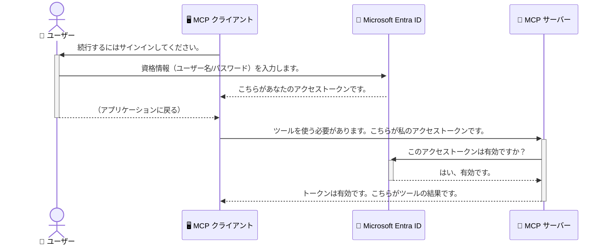

# AI ワークフローのセキュリティ：モデルコンテキストプロトコルサーバーの Entra ID 認証

> [!NOTE]
> このレッスンのリモートサーバーコードはレガシーな `/sse` および `/message` エンドポイントを保護し、
> MCP `2025-11-25` を対象としています。アイデンティティおよびトークン検証の
> プラクティスは維持してください。ただし、新しい実装には `2026-07-28` 対応の Streamable HTTP トランスポートを使用してください。


## はじめに
モデルコンテキストプロトコル（MCP）サーバーのセキュリティは、自宅の玄関の鍵を掛けるのと同じくらい重要です。MCP サーバーを開放すると、ツールやデータが不正アクセスにさらされ、セキュリティ違反につながる可能性があります。Microsoft Entra ID は強力なクラウドベースの ID・アクセス管理ソリューションを提供し、権限のあるユーザーとアプリケーションのみが MCP サーバーとやり取りできるよう支援します。このセクションでは、Entra ID 認証を使用して AI ワークフローを保護する方法を学びます。

## 学習目標
このセクションの終了時には、以下ができるようになります：

- MCP サーバーのセキュリティの重要性を理解する。
- Microsoft Entra ID と OAuth 2.0 認証の基本を説明する。
- 公開クライアントと機密クライアントの違いを認識する。
- ローカル（公開クライアント）およびリモート（機密クライアント）MCP サーバーのシナリオで Entra ID 認証を実装する。
- AI ワークフロー開発におけるセキュリティのベストプラクティスを適用する。

## セキュリティと MCP

自宅の玄関の鍵を掛けないのと同様に、MCP サーバーを誰でもアクセス可能な状態にしてはいけません。AI ワークフローのセキュリティは、堅牢で信頼性が高く安全なアプリケーション構築の要です。この章では、Microsoft Entra ID を使って MCP サーバーを保護し、権限のあるユーザーとアプリケーションのみがツールやデータにアクセスできるようにする方法を紹介します。

## MCP サーバーのセキュリティが重要な理由

あなたの MCP サーバーにメール送信や顧客データベースアクセスなどのツールがあるとします。セキュリティが無いサーバーでは誰でもそのツールを利用でき、不正なデータアクセスやスパム、その他の悪意ある行為につながる可能性があります。

認証を実装することで、サーバーへのすべてのリクエストの認証を行い、リクエスト元のユーザーまたはアプリケーションの身元を確認できます。これは AI ワークフローを安全に保つための最初で最も重要なステップです。

## Microsoft Entra ID 入門

[**Microsoft Entra ID**](https://adoption.microsoft.com/microsoft-security/entra/) はクラウドベースの ID およびアクセス管理サービスです。アプリケーションのための普遍的なセキュリティガードのようなものと考えてください。ユーザーの身元を確認（認証）し、許可された操作を決定（認可）する複雑なプロセスを処理します。

Entra ID を使用すると、次のことができます：

- ユーザーの安全なサインインを可能にする。
- API およびサービスを保護する。
- 中央からアクセス ポリシーを管理する。

MCP サーバーにおいて、Entra ID は誰がサーバーの機能にアクセスできるかを管理するための堅牢で信頼性の高いソリューションを提供します。

---

## 魔法の仕組み：Entra ID 認証のしくみ

Entra ID は **OAuth 2.0** のようなオープンスタンダードを使用して認証を行います。詳細は複雑な場合がありますが、核心的な考え方は簡単で、例え話で理解できます。

### OAuth 2.0 のやさしい紹介：バレットキー

OAuth 2.0 をレストランのバレットサービス（車の預かりサービス）に例えます。レストランに行くとき、あなたはマスターキーをバレットに渡しません。代わりに限定的な権限を持つ <strong>バレットキー</strong> を渡します。このキーでは車の始動やドアの施錠はできますが、トランクやグローブボックスは開けられません。

この例えでの対応：

- <strong>あなた</strong> が <strong>ユーザー</strong> です。
- <strong>あなたの車</strong> が 価値あるツールとデータを持つ **MCP サーバー** です。
- <strong>バレット</strong> が **Microsoft Entra ID** です。
- <strong>駐車係</strong> が **MCP クライアント**（サーバーにアクセスしようとするアプリケーション）です。
- <strong>バレットキー</strong> が <strong>アクセストークン</strong> です。

アクセストークンは、ユーザーがサインイン後に MCP クライアントが Entra ID から受け取る安全な文字列です。クライアントはこのトークンを各リクエストに添えて MCP サーバーに送信し、サーバーはトークンを検証してリクエストの正当性とクライアントが必要な権限を持っているかを確認します。これにより、パスワードのような実際の資格情報を扱う必要がなくなります。

### 認証フロー

実際の流れは次の通りです：



### Microsoft Authentication Library (MSAL) の紹介

コードに入る前に、例でよく登場する重要なコンポーネントである **Microsoft Authentication Library (MSAL)** を紹介します。

MSAL は Microsoft が開発したライブラリで、認証処理を簡単にします。開発者がトークン管理、サインイン処理、セッション更新の複雑なコードを書く代わりに、MSAL がその負担を軽減します。

MSAL を使うことが推奨される理由は以下の通りです：

- <strong>安全性が高い</strong>：業界標準のプロトコルとセキュリティベストプラクティスを実装し、脆弱性のリスクを低減します。
- <strong>開発が簡単</strong>：OAuth 2.0 や OpenID Connect の複雑さを抽象化し、数行のコードで強力な認証をアプリに組み込めます。
- <strong>継続的なメンテナンス</strong>：Microsoft が新たなセキュリティ脅威やプラットフォーム変更に対応して積極的に更新します。

MSAL は .NET、JavaScript/TypeScript、Python、Java、Go、そして iOS や Android のモバイルプラットフォームなど多様な言語とフレームワークをサポートしています。これにより、技術スタック全体で一貫した認証パターンを使えます。

MSAL について詳細は公式の [MSAL overview ドキュメント](https://learn.microsoft.com/entra/identity-platform/msal-overview) をご覧ください。

---

## Entra ID で MCP サーバーを保護する：ステップバイステップガイド

それでは、Entra ID を使ってローカル MCP サーバー（`stdio` で通信する）を保護する方法を順を追って説明します。この例では <strong>公開クライアント</strong> を使い、デスクトップアプリやローカル開発サーバーのようにユーザーのマシン上で動作するアプリに適しています。

### シナリオ 1：ローカル MCP サーバーの保護（公開クライアント使用）

このシナリオでは、ローカルで動作し `stdio` 経由で通信する MCP サーバーを見ていきます。ユーザー認証に Entra ID を使い、ツールへのアクセスを制御します。サーバーは Microsoft Graph API からユーザーのプロフィール情報を取得する単一のツールを持ちます。

#### 1. Entra ID でアプリケーションを設定する

コードを書く前に、Microsoft Entra ID にアプリケーションを登録します。これは Entra ID にアプリの情報を伝え、認証サービスの利用許可を与える作業です。

1. **[Microsoft Entra ポータル](https://entra.microsoft.com/)** にアクセスします。
2. <strong>アプリの登録</strong> に移動し、<strong>新しい登録</strong> をクリックします。
3. アプリの名前を入力します（例："My Local MCP Server"）。
4. <strong>サポートされているアカウントの種類</strong> で <strong>この組織ディレクトリ内のアカウントのみ</strong> を選びます。
5. この例では **リダイレクト URI** は空白のままで構いません。
6. <strong>登録</strong> をクリックします。

登録後、**アプリケーション（クライアント）ID** と **ディレクトリ（テナント）ID** をメモしてください。コード内で使用します。

#### 2. コードの解説

認証処理の要となるコード部分を見てみましょう。この例の完全なコードは [mcp-auth-servers GitHub リポジトリ](https://github.com/Azure-Samples/mcp-auth-servers) の [Entra ID - Local - WAM](https://github.com/Azure-Samples/mcp-auth-servers/tree/main/src/entra-id-local-wam) フォルダーにあります。

**`AuthenticationService.cs`**

このクラスは Entra ID とのやり取りを担当します。

- **`CreateAsync`**：MSAL の `PublicClientApplication` を初期化します。アプリの `clientId` と `tenantId` を使って設定されます。
- **`WithBroker`**：Windows Web Account Managerなどのブローカー利用を有効にし、より安全かつシームレスなシングルサインオンを提供します。
- **`AcquireTokenAsync`**：コアとなるメソッドです。最初にサイレント（ユーザー操作なし）でトークン取得を試み、失敗したらユーザーからのインタラクティブなサインインを促します。

```csharp
// Simplified for clarity
public static async Task<AuthenticationService> CreateAsync(ILogger<AuthenticationService> logger)
{
    var msalClient = PublicClientApplicationBuilder
        .Create(_clientId) // Your Application (client) ID
        .WithAuthority(AadAuthorityAudience.AzureAdMyOrg)
        .WithTenantId(_tenantId) // Your Directory (tenant) ID
        .WithBroker(new BrokerOptions(BrokerOptions.OperatingSystems.Windows))
        .Build();

    // ... cache registration ...

    return new AuthenticationService(logger, msalClient);
}

public async Task<string> AcquireTokenAsync()
{
    try
    {
        // Try silent authentication first
        var accounts = await _msalClient.GetAccountsAsync();
        var account = accounts.FirstOrDefault();

        AuthenticationResult? result = null;

        if (account != null)
        {
            result = await _msalClient.AcquireTokenSilent(_scopes, account).ExecuteAsync();
        }
        else
        {
            // If no account, or silent fails, go interactive
            result = await _msalClient.AcquireTokenInteractive(_scopes).ExecuteAsync();
        }

        return result.AccessToken;
    }
    catch (Exception ex)
    {
        _logger.LogError(ex, "An error occurred while acquiring the token.");
        throw; // Optionally rethrow the exception for higher-level handling
    }
}
```

**`Program.cs`**

MCP サーバーのセットアップと認証サービスの統合がここで行われます。

- **`AddSingleton<AuthenticationService>`**：依存性注入コンテナに `AuthenticationService` を登録し、他のアプリ部分（ツールなど）で利用可能にします。
- **`GetUserDetailsFromGraph` ツール**：このツールは `AuthenticationService` のインスタンスを必要とします。使用前に `authService.AcquireTokenAsync()` を呼び出して有効なアクセストークンを取得します。認証成功後は、そのトークンを使って Microsoft Graph API を呼び出し、ユーザーの詳細情報を取得します。

```csharp
// Simplified for clarity
[McpServerTool(Name = "GetUserDetailsFromGraph")]
public static async Task<string> GetUserDetailsFromGraph(
    AuthenticationService authService)
{
    try
    {
        // This will trigger the authentication flow
        var accessToken = await authService.AcquireTokenAsync();

        // Use the token to create a GraphServiceClient
        var graphClient = new GraphServiceClient(
            new BaseBearerTokenAuthenticationProvider(new TokenProvider(authService)));

        var user = await graphClient.Me.GetAsync();

        return System.Text.Json.JsonSerializer.Serialize(user);
    }
    catch (Exception ex)
    {
        return $"Error: {ex.Message}";
    }
}
```

#### 3. 全体の動作の流れ

1. MCP クライアントが `GetUserDetailsFromGraph` ツールを使用しようとすると、ツールはまず `AcquireTokenAsync` を呼びます。
2. `AcquireTokenAsync` は MSAL ライブラリを使って有効なトークンを確認します。
3. トークンが見つからない場合、MSAL はブローカー経由でユーザーに Entra ID アカウントでのサインインを促します。
4. ユーザーがサインインすると、Entra ID がアクセストークンを発行します。
5. ツールはトークンを受け取り、それを用いて Microsoft Graph API に安全な呼び出しをします。
6. ユーザーの詳細情報は MCP クライアントに返されます。

この流れにより、認証されたユーザーだけがツールを利用でき、ローカル MCP サーバーが効果的に保護されます。

### シナリオ 2：リモート MCP サーバーの保護（機密クライアント使用）

MCP サーバーがリモートマシン（クラウドサーバーなど）で動作し、HTTP ストリーミングのようなプロトコルで通信する場合、セキュリティ要件が異なります。この場合は <strong>機密クライアント</strong> と **Authorization Code Flow** を使用すべきです。この方法は、アプリケーションの秘密がブラウザに露出しないため、より安全です。

この例では、HTTP リクエストの処理に Express.js を使った TypeScript ベースの MCP サーバーを用います。

#### 1. Entra ID でアプリケーションを設定する

設定は公開クライアントと似ていますが、重要な違いが一つあります：<strong>クライアントシークレット</strong> を作成する必要があります。

1. **[Microsoft Entra ポータル](https://entra.microsoft.com/)** にアクセスします。
2. アプリ登録の <strong>証明書とシークレット</strong> タブに行きます。
3. <strong>新しいクライアントシークレット</strong> をクリックし、説明を入力して <strong>追加</strong> をクリックします。
4. **重要：** シークレット値はすぐにコピーしてください。一度閉じると再表示できません。
5. **リダイレクト URI** も設定が必要です。<strong>認証</strong> タブに行き、<strong>プラットフォームの追加</strong> をクリックして **Web** を選択し、アプリのリダイレクト URI を入力します（例：`http://localhost:3001/auth/callback`）。

> **⚠️ 重要なセキュリティ注意:** 本番アプリケーションでは、Microsoft はクライアントシークレットの代わりに **Managed Identity** や **Workload Identity Federation** のような秘密なし認証方式の使用を強く推奨しています。クライアントシークレットは漏洩や侵害のリスクがあります。マネージド ID はコードや設定に認証情報を保存する必要をなくし、より安全な手法です。
>
> マネージド ID の概要と実装方法については、[Azure リソースのマネージド ID 概要](https://learn.microsoft.com/entra/identity/managed-identities-azure-resources/overview) を参照してください。

#### 2. コードの解説

この例はセッションベースのアプローチを使います。ユーザーが認証すると、サーバーはアクセストークンとリフレッシュトークンをセッションに保存し、ユーザーにセッショントークンを渡します。以降のリクエストはこのセッショントークンを使います。完全なコードは [mcp-auth-servers GitHub リポジトリ](https://github.com/Azure-Samples/mcp-auth-servers) の [Entra ID - Confidential client](https://github.com/Azure-Samples/mcp-auth-servers/tree/main/src/entra-id-cca-session) フォルダーにあります。

**`Server.ts`**

Express サーバーと MCP トランスポート層をセットアップします。

- **`requireBearerAuth`**：`/sse` と `/message` エンドポイントを保護するミドルウェアです。リクエストの `Authorization` ヘッダーに有効なベアラートークンの存在をチェックします。
- **`EntraIdServerAuthProvider`**：`McpServerAuthorizationProvider` インターフェースを実装するカスタムクラスで、OAuth 2.0 フローの処理を担当します。
- **`/auth/callback`**：ユーザー認証後の Entra ID からのリダイレクトを処理するエンドポイントです。認可コードをアクセストークンとリフレッシュトークンに交換します。

```typescript
// 明確化のために簡略化
const app = express();
const { server } = createServer();
const provider = new EntraIdServerAuthProvider();

// SSEエンドポイントを保護する
app.get("/sse", requireBearerAuth({
  provider,
  requiredScopes: ["User.Read"]
}), async (req, res) => {
  // ... トランスポートに接続する ...
});

// メッセージエンドポイントを保護する
app.post("/message", requireBearerAuth({
  provider,
  requiredScopes: ["User.Read"]
}), async (req, res) => {
  // ... メッセージを処理する ...
});

// OAuth 2.0のコールバックを処理する
app.get("/auth/callback", (req, res) => {
  provider.handleCallback(req.query.code, req.query.state)
    .then(result => {
      // ... 成功または失敗を処理する ...
    });
});
```

**`Tools.ts`**

MCP サーバーが提供するツールを定義しています。`getUserDetails` ツールは前の例に似ていますが、アクセストークンをセッションから取得します。

```typescript
// 明確にするために簡略化
server.setRequestHandler(CallToolRequestSchema, async (request) => {
  const { name } = request.params;
  const context = request.params?.context as { token?: string } | undefined;
  const sessionToken = context?.token;

  if (name === ToolName.GET_USER_DETAILS) {
    if (!sessionToken) {
      throw new AuthenticationError("Authentication token is missing or invalid. Ensure the token is provided in the request context.");
    }

    // セッションストアからEntra IDトークンを取得
    const tokenData = tokenStore.getToken(sessionToken);
    const entraIdToken = tokenData.accessToken;

    const graphClient = Client.init({
      authProvider: (done) => {
        done(null, entraIdToken);
      }
    });

    const user = await graphClient.api('/me').get();

    // ... ユーザーの詳細を返す ...
  }
});
```

**`auth/EntraIdServerAuthProvider.ts`**

このクラスは以下のロジックを処理します：

- ユーザーを Entra ID サインインページにリダイレクトする。
- 認可コードをアクセストークンに交換する。
- `tokenStore` にトークンを保存する。
- アクセストークンの有効期限が切れた際にリフレッシュする。


#### 3. すべてがどのように連携するか

1. ユーザーが最初にMCPサーバーに接続しようとすると、`requireBearerAuth` ミドルウェアは有効なセッションがないことを検知し、Entra IDのサインインページにリダイレクトします。
2. ユーザーはEntra IDアカウントでサインインします。
3. Entra IDは認可コードとともにユーザーを`/auth/callback`エンドポイントにリダイレクトします。
4. サーバーはコードをアクセストークンとリフレッシュトークンに交換し、それらを保存して、セッショントークンを作成しクライアントに送信します。
5. クライアントは今後のすべてのMCPサーバーへのリクエストで、このセッショントークンを`Authorization`ヘッダーに使用できます。
6. `getUserDetails`ツールが呼び出されると、セッショントークンを使ってEntra IDのアクセストークンを取得し、それを使ってMicrosoft Graph APIを呼び出します。

このフローは公開クライアントフローより複雑ですが、インターネットに公開されたエンドポイントには必須です。リモートMCPサーバーは公開インターネットからアクセス可能なため、不正アクセスや潜在的な攻撃から守るためにより強力なセキュリティ対策が必要です。


## セキュリティのベストプラクティス

- **常にHTTPSを使用する**: クライアントとサーバー間の通信を暗号化し、トークンが傍受されるのを防ぎます。
- **ロールベースアクセス制御（RBAC）を実装する**: ユーザーが認証されているかだけでなく、何が許可されているかをチェックします。Entra IDでロールを定義し、MCPサーバー内でそれを検査できます。
- <strong>監視と監査を行う</strong>: すべての認証イベントをログに記録し、不審な活動を検出・対応できるようにします。
- <strong>レート制限とスロットリングに対応する</strong>: Microsoft Graphやその他のAPIはレート制限を実装しています。MCPサーバーでは指数関数的バックオフやリトライロジックを実装し、HTTP 429（リクエスト過多）の応答にうまく対処します。API呼び出しを減らすために頻繁にアクセスするデータのキャッシュも検討してください。
- <strong>トークンの安全な保存</strong>: アクセストークンやリフレッシュトークンを安全に保存します。ローカルアプリケーションにはシステムの安全なストレージ機構を使い、サーバーアプリケーションには暗号化されたストレージやAzure Key Vaultのような安全なキー管理サービスを検討してください。
- <strong>トークンの有効期限管理</strong>: アクセストークンは有効期限が限られています。リフレッシュトークンを使った自動トークン更新を実装し、再認証を必要とせずにシームレスなユーザー体験を維持します。
- **Azure API Managementの利用を検討する**: MCPサーバー内で直接セキュリティを実装すると細かな制御が可能ですが、Azure API ManagementのようなAPIゲートウェイは認証、認可、レート制限、監視などのセキュリティ問題を自動的に処理します。クライアントとMCPサーバーの間に中央集約型のセキュリティレイヤーを提供します。MCPでのAPIゲートウェイ利用の詳細は[Azure API Management Your Auth Gateway For MCP Servers](https://techcommunity.microsoft.com/blog/integrationsonazureblog/azure-api-management-your-auth-gateway-for-mcp-servers/4402690)を参照してください。


## 主要なポイント

- MCPサーバーを安全に保護することはデータやツールを守る上で非常に重要です。
- Microsoft Entra IDは認証と認可のための強力かつスケーラブルなソリューションを提供します。
- ローカルアプリケーションには<strong>公開クライアント</strong>を、リモートサーバーには<strong>機密クライアント</strong>を使用します。
- <strong>認可コードフロー</strong>はウェブアプリケーションにとって最も安全な選択肢です。


## 演習

1. あなたが作るかもしれないMCPサーバーについて考えてみましょう。ローカルサーバーですか、それともリモートサーバーですか？
2. 答えに基づき、公開クライアントか機密クライアントのどちらを使用しますか？
3. Microsoft Graphに対して操作を行うために、MCPサーバーはどのような権限を要求しますか？


## ハンズオン演習

### 演習 1: Entra IDにアプリケーションを登録する
Microsoft Entraポータルにアクセスします。
MCPサーバー用に新しいアプリケーションを登録します。
アプリケーション（クライアント）IDとディレクトリ（テナント）IDを記録します。

### 演習 2: ローカルMCPサーバーのセキュリティ確保（公開クライアント）
- コード例に従ってMSAL（Microsoft Authentication Library）を使用したユーザー認証を統合します。
- Microsoft Graphからユーザー詳細を取得するMCPツールを呼び出して認証フローをテストします。

### 演習 3: リモートMCPサーバーのセキュリティ確保（機密クライアント）
- Entra IDで機密クライアントを登録し、クライアントシークレットを作成します。
- Express.js MCPサーバーを認可コードフローで設定します。
- 保護されたエンドポイントをテストし、トークンベースのアクセスを確認します。

### 演習 4: セキュリティのベストプラクティスの適用
- ローカルまたはリモートサーバーでHTTPSを有効にします。
- サーバーロジックにロールベースアクセス制御（RBAC）を実装します。
- トークンの有効期限処理と安全なトークン保存を追加します。

## リソース

1. **MSAL概要ドキュメント**  
   Microsoft Authentication Library (MSAL)がプラットフォームを跨いで安全にトークンを取得する方法を学びます：  
   [MSAL Overview on Microsoft Learn](https://learn.microsoft.com/en-gb/entra/msal/overview)

2. **Azure-Samples/mcp-auth-servers GitHub リポジトリ**  
   認証フローを示すMCPサーバーのリファレンス実装：  
   [Azure-Samples/mcp-auth-servers on GitHub](https://github.com/Azure-Samples/mcp-auth-servers)

3. **Azureリソースのマネージド ID 概要**  
   シークレットを不要にするシステムまたはユーザー割当マネージドIDを理解する：  
   [Managed Identities Overview on Microsoft Learn](https://learn.microsoft.com/en-us/entra/identity/managed-identities-azure-resources/)

4. **Azure API Management: MCPサーバーの認証ゲートウェイ**  
   MCPサーバー用の安全なOAuth2ゲートウェイとしてのAPIMの詳細解説：  
   [Azure API Management Your Auth Gateway For MCP Servers](https://techcommunity.microsoft.com/blog/integrationsonazureblog/azure-api-management-your-auth-gateway-for-mcp-servers/4402690)

5. **Microsoft Graphの権限リファレンス**  
   Microsoft Graphの委任およびアプリケーション権限の包括的リスト：  
   [Microsoft Graph Permissions Reference](https://learn.microsoft.com/zh-tw/graph/permissions-reference)


## 学習成果
本セクションを修了すると、以下が可能になります：

- MCPサーバーとAIワークフローにとって認証がなぜ重要かを説明できる。
- ローカルおよびリモートのMCPサーバーシナリオ向けにEntra ID認証を設定・構成できる。
- サーバーの展開に基づいて適切なクライアントタイプ（公開または機密）を選択できる。
- トークン保存やロールベース認可などの安全なコーディングプラクティスを実装できる。
- 不正アクセスからMCPサーバーとそのツールを確実に保護できる。

## 次に進むには

- [5.13 モデルコンテキストプロトコル（MCP）とMicrosoft Foundryの統合](../mcp-foundry-agent-integration/README.md)

---

<!-- CO-OP TRANSLATOR DISCLAIMER START -->
**免責事項**：
本書類は AI 翻訳サービス [Co-op Translator](https://github.com/Azure/co-op-translator) を使用して翻訳されています。正確性を期していますが、自動翻訳には誤りや不正確な部分が含まれる可能性があることをご承知おきください。原文の原語版が正式な情報源とみなされるべきです。重要な情報については、専門の人間による翻訳を推奨します。本翻訳の利用により生じたいかなる誤解や解釈違いについても、当方は責任を負いかねます。
<!-- CO-OP TRANSLATOR DISCLAIMER END -->
