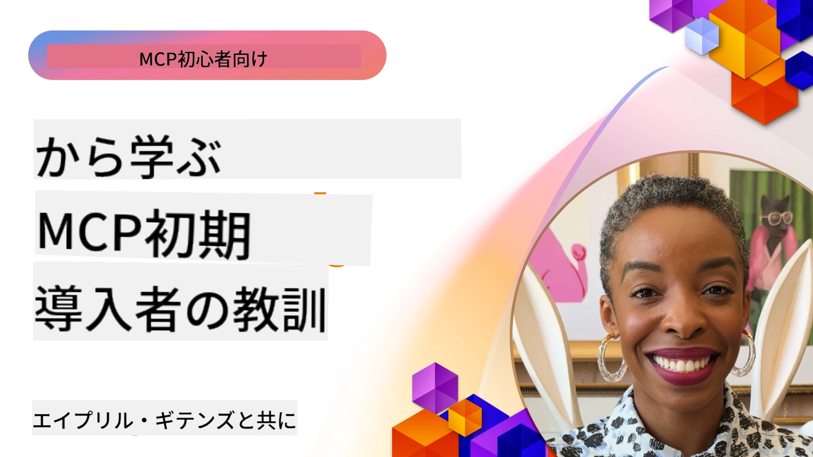

# 🌟 先行採用者からの教訓

[](https://youtu.be/jds7dSmNptE)

_（上の画像をクリックするとこのレッスンのビデオを視聴できます）_

## 🎯 このモジュールで扱う内容

このモジュールでは、実際の組織や開発者がModel Context Protocol（MCP）を活用して実際の課題を解決し、イノベーションを推進している方法を探ります。詳細なケーススタディ、実践的なプロジェクト、具体的な例を通じて、MCPが言語モデル、ツール、企業データを接続する安全でスケーラブルなAI統合をどのように可能にしているかを発見します。

### 📚 MCPの実践例を参照

これらの原則が本番対応のツールにどのように適用されているかを見たいですか？実際に利用可能なMicrosoftのMCPサーバーを紹介する[**10のMicrosoft MCPサーバーが開発者の生産性を変革**](microsoft-mcp-servers.md)をご覧ください。

## 概要

本レッスンでは、早期導入者がModel Context Protocol（MCP）を活用して実世界の課題を解決し、産業をまたいでイノベーションを推進してきた事例を探ります。詳細なケーススタディと実践的なプロジェクトを通じて、MCPが大規模言語モデル、ツール、企業データを統合されたフレームワークで安全かつ標準化し、拡張可能なAI統合を実現する方法を学びます。MCPベースのソリューションの設計と構築に関する実践的経験を得て、実証済みの実装パターンから学び、実稼働環境でのMCP展開におけるベストプラクティスを発見します。さらに、新たに浮上するトレンドや将来の方向性、オープンソースのリソースも紹介し、MCP技術とその進化するエコシステムの最前線に立てるよう支援します。

## 学習目標

- 様々な業界における実際のMCP実装を分析する
- 完全なMCPベースのアプリケーションを設計・構築する
- MCP技術における新興トレンドや将来の方向性を探る
- 実際の開発シナリオでベストプラクティスを適用する

## 実際のMCP実装

### ケーススタディ1：企業の顧客サポート自動化

多国籍企業が、顧客サポートシステム全体でのAIインタラクションを標準化するため、MCPベースのソリューションを導入しました。これにより以下を可能にしました：

- 複数のLLMプロバイダー向けの統一インターフェイスの作成
- 部門全体で一貫したプロンプト管理の維持
- 強固なセキュリティおよびコンプライアンス制御の実装
- 特定のニーズに基づいたAIモデル間の容易な切り替え

**技術的実装：**

```python
# カスタマーサポート用のPython MCPサーバー実装
import logging
import asyncio
from modelcontextprotocol import create_server, ServerConfig
from modelcontextprotocol.server import MCPServer
from modelcontextprotocol.transports import create_http_transport
from modelcontextprotocol.resources import ResourceDefinition
from modelcontextprotocol.prompts import PromptDefinition
from modelcontextprotocol.tool import ToolDefinition

# ロギングの設定
logging.basicConfig(level=logging.INFO)

async def main():
    # サーバー設定の作成
    config = ServerConfig(
        name="Enterprise Customer Support Server",
        version="1.0.0",
        description="MCP server for handling customer support inquiries"
    )
    
    # MCPサーバーの初期化
    server = create_server(config)
    
    # ナレッジベースリソースの登録
    server.resources.register(
        ResourceDefinition(
            name="customer_kb",
            description="Customer knowledge base documentation"
        ),
        lambda params: get_customer_documentation(params)
    )
    
    # プロンプトテンプレートの登録
    server.prompts.register(
        PromptDefinition(
            name="support_template",
            description="Templates for customer support responses"
        ),
        lambda params: get_support_templates(params)
    )
    
    # サポートツールの登録
    server.tools.register(
        ToolDefinition(
            name="ticketing",
            description="Create and update support tickets"
        ),
        handle_ticketing_operations
    )
    
    # HTTPトランスポートでサーバーを起動
    transport = create_http_transport(port=8080)
    await server.run(transport)

if __name__ == "__main__":
    asyncio.run(main())
```

**結果:** モデルコストを30％削減、応答の一貫性を45％向上、グローバルオペレーションのコンプライアンスを強化。

### ケーススタディ2：医療診断アシスタント

医療機関は複数の専門特化型医療AIモデルを統合しつつ、敏感な患者データの保護も確保するためにMCPインフラを開発しました：

- 一般医療モデルと専門医療モデル間のシームレスな切り替え
- 厳格なプライバシー制御と監査トレイル
- 既存の電子健康記録（EHR）システムとの統合
- 医療用語に一貫したプロンプトエンジニアリングの実施

**技術的実装：**

```csharp
// C# MCP host application implementation in healthcare application
using Microsoft.Extensions.DependencyInjection;
using ModelContextProtocol.SDK.Client;
using ModelContextProtocol.SDK.Security;
using ModelContextProtocol.SDK.Resources;

public class DiagnosticAssistant
{
    private readonly MCPHostClient _mcpClient;
    private readonly PatientContext _patientContext;
    
    public DiagnosticAssistant(PatientContext patientContext)
    {
        _patientContext = patientContext;
        
        // Configure MCP client with healthcare-specific settings
        var clientOptions = new ClientOptions
        {
            Name = "Healthcare Diagnostic Assistant",
            Version = "1.0.0",
            Security = new SecurityOptions
            {
                Encryption = EncryptionLevel.Medical,
                AuditEnabled = true
            }
        };
        
        _mcpClient = new MCPHostClientBuilder()
            .WithOptions(clientOptions)
            .WithTransport(new HttpTransport("https://healthcare-mcp.example.org"))
            .WithAuthentication(new HIPAACompliantAuthProvider())
            .Build();
    }
    
    public async Task<DiagnosticSuggestion> GetDiagnosticAssistance(
        string symptoms, string patientHistory)
    {
        // Create request with appropriate resources and tool access
        var resourceRequest = new ResourceRequest
        {
            Name = "patient_records",
            Parameters = new Dictionary<string, object>
            {
                ["patientId"] = _patientContext.PatientId,
                ["requestingProvider"] = _patientContext.ProviderId
            }
        };
        
        // Request diagnostic assistance using appropriate prompt
        var response = await _mcpClient.SendPromptRequestAsync(
            promptName: "diagnostic_assistance",
            parameters: new Dictionary<string, object>
            {
                ["symptoms"] = symptoms,
                patientHistory = patientHistory,
                relevantGuidelines = _patientContext.GetRelevantGuidelines()
            });
            
        return DiagnosticSuggestion.FromMCPResponse(response);
    }
}
```

**結果:** HIPAA完全準拠を維持しつつ医師向け診断提案を改善し、システム間のコンテキスト切替を大幅に削減。

### ケーススタディ3：金融サービスのリスク分析

金融機関は異なる部門にまたがるリスク分析プロセスを標準化するためにMCPを導入しました：

- クレジットリスク、不正検出、投資リスクモデル向けの統一インターフェイスを作成
- 厳格なアクセス制御およびモデルバージョニングを実施
- すべてのAI推奨事項の監査可能性を確保
- 多様なシステム間で一貫したデータフォーマットを保守

**技術的実装：**

```java
// 金融リスク評価のためのJava MCPサーバー
import org.mcp.server.*;
import org.mcp.security.*;

public class FinancialRiskMCPServer {
    public static void main(String[] args) {
        // 金融コンプライアンス機能を備えたMCPサーバーを作成する
        MCPServer server = new MCPServerBuilder()
            .withModelProviders(
                new ModelProvider("risk-assessment-primary", new AzureOpenAIProvider()),
                new ModelProvider("risk-assessment-audit", new LocalLlamaProvider())
            )
            .withPromptTemplateDirectory("./compliance/templates")
            .withAccessControls(new SOCCompliantAccessControl())
            .withDataEncryption(EncryptionStandard.FINANCIAL_GRADE)
            .withVersionControl(true)
            .withAuditLogging(new DatabaseAuditLogger())
            .build();
            
        server.addRequestValidator(new FinancialDataValidator());
        server.addResponseFilter(new PII_RedactionFilter());
        
        server.start(9000);
        
        System.out.println("Financial Risk MCP Server running on port 9000");
    }
}
```

**結果:** 規制遵守を強化し、モデル展開サイクルを40％高速化、部門間でのリスク評価の一貫性を向上。

### ケーススタディ4：Microsoft Playwright MCPサーバーによるブラウザー自動化

MicrosoftはModel Context Protocolを通じた安全で標準化されたブラウザー自動化を可能にする[Playwright MCPサーバー](https://github.com/microsoft/playwright-mcp)を開発しました。この本番対応サーバーは、AIエージェントやLLMが制御可能で監査可能、拡張性のある方法でWebブラウザーと対話できるようにします。用途には自動化ウェブテスト、データ抽出、エンドツーエンドのワークフローなどが含まれます。

> **🎯 本番対応ツール**
> 
> これは実際に使えるMCPサーバーです！Playwright MCPサーバーと他の9つの本番対応Microsoft MCPサーバーについては[**Microsoft MCP Servers Guide**](microsoft-mcp-servers.md#8--playwright-mcp-server)をご覧ください。

**主な特徴：**
- ナビゲーション、フォーム入力、スクリーンショット取得などのブラウザー自動化機能をMCPツールとして公開
- 不正操作を防ぐ厳格なアクセス制御とサンドボックス実装
- すべてのブラウザー操作に対する詳細な監査ログを提供
- Azure OpenAIや他のLLMプロバイダーとの統合をサポートし、エージェント駆動自動化を実現
- GitHub Copilotのコーディングエージェントにブラウジング機能を提供

**技術的実装：**

```typescript
// TypeScript: MCPサーバーにPlaywrightブラウザ自動化ツールを登録する
import { createServer, ToolDefinition } from 'modelcontextprotocol';
import { launch } from 'playwright';

const server = createServer({
  name: 'Playwright MCP Server',
  version: '1.0.0',
  description: 'MCP server for browser automation using Playwright'
});

// URLに移動してスクリーンショットをキャプチャするツールを登録する
server.tools.register(
  new ToolDefinition({
    name: 'navigate_and_screenshot',
    description: 'Navigate to a URL and capture a screenshot',
    parameters: {
      url: { type: 'string', description: 'The URL to visit' }
    }
  }),
  async ({ url }) => {
    const browser = await launch();
    const page = await browser.newPage();
    await page.goto(url);
    const screenshot = await page.screenshot();
    await browser.close();
    return { screenshot };
  }
);

// MCPサーバーを起動する
server.listen(8080);
```

**結果:**

- AIエージェントやLLM向けの安全なプログラム的ブラウザー自動化を実現
- 手動テスト工数を削減し、Webアプリケーションのテストカバレッジを向上
- 企業環境でのブラウザベースのツール統合に対する再利用可能で拡張可能なフレームワークを提供
- GitHub CopilotのWebブラウジング機能を支える

**参考文献：**

- [Playwright MCP Server GitHubリポジトリ](https://github.com/microsoft/playwright-mcp)
- [Microsoft AI and Automation Solutions](https://azure.microsoft.com/en-us/products/ai-services/)

### ケーススタディ5：Azure MCP – エンタープライズ対応モデルコンテキストプロトコルのサービス

Azure MCPサーバー（[https://aka.ms/azmcp](https://aka.ms/azmcp)）は、MicrosoftによるModel Context Protocolのマネージドで企業レベルの実装であり、スケーラブルで安全かつコンプライアンス対応のMCPサーバー機能をクラウドサービスとして提供します。Azure MCPにより組織はMCPサーバーを迅速に展開、管理、Azure AI、データ、セキュリティサービスと統合でき、運用負荷を低減しAI導入を加速します。

> **🎯 本番対応ツール**
> 
> これは実際に利用可能なMCPサーバーです！Microsoft Foundry MCPサーバーについては[**Microsoft MCP Servers Guide**](microsoft-mcp-servers.md)で詳しく説明しています。

- 組み込みのスケーリング、監視、セキュリティを備えた完全マネージドMCPサーバーホスティング
- Azure OpenAI、Azure AI Searchおよびその他Azureサービスとのネイティブ統合
- Microsoft Entra IDによる企業認証と認可
- カスタムツール、プロンプトテンプレート、リソースコネクタのサポート
- 企業のセキュリティおよび規制要件に準拠

**技術的実装：**

```yaml
# Example: Azure MCP server deployment configuration (YAML)
apiVersion: mcp.microsoft.com/v1
kind: McpServer
metadata:
  name: enterprise-mcp-server
spec:
  modelProviders:
    - name: azure-openai
      type: AzureOpenAI
      endpoint: https://<your-openai-resource>.openai.azure.com/
      apiKeySecret: <your-azure-keyvault-secret>
  tools:
    - name: document_search
      type: AzureAISearch
      endpoint: https://<your-search-resource>.search.windows.net/
      apiKeySecret: <your-azure-keyvault-secret>
  authentication:
    type: EntraID
    tenantId: <your-tenant-id>
  monitoring:
    enabled: true
    logAnalyticsWorkspace: <your-log-analytics-id>
```

**結果：**  
- 使いやすく準拠したMCPサーバープラットフォームを提供し、企業のAIプロジェクトの価値創出までの時間を短縮
- LLM、ツール、企業データソースの統合を簡素化
- MCPワークロードのセキュリティ、可観測性、運用効率を向上
- Azure SDKのベストプラクティスと最新認証パターンでコード品質を改善

**参考文献：**  
- [Azure MCP ドキュメント](https://aka.ms/azmcp)
- [Azure MCP Server GitHubリポジトリ](https://github.com/Azure/azure-mcp)
- [Azure AI サービス](https://azure.microsoft.com/en-us/products/ai-services/)
- [Microsoft MCP Center](https://mcp.azure.com)

## ケーススタディ6：NLWeb  
MCP（Model Context Protocol）はチャットボットやAIアシスタントがツールとやり取りするための新興のプロトコルです。すべてのNLWebインスタンスはMCPサーバーでもあり、自然言語でウェブサイトに質問するための１つのコアメソッド ask をサポートします。返される応答は広く使われるウェブデータ記述ボキャブラリであるschema.orgを活用しています。ざっくり言えば、MCPはHttpがHTMLに対するもののようにNLWebに対するものです。NLWebはプロトコル、Schema.orgフォーマット、およびサンプルコードの組み合わせで、サイトがこれらのエンドポイントを迅速に作成し、会話型インターフェイスで人間に、自然なエージェント間の相互作用で機械に利益をもたらします。

NLWebには二つの異なる構成要素があります。
- 非常にシンプルなプロトコルで、自然言語でサイトとインターフェイスし、jsonとschema.orgを活用して回答を返すフォーマット。REST APIのドキュメントを参照してください。
- リスト化されたアイテム（製品、レシピ、観光スポット、レビューなど）として抽象化可能なサイト向けに既存のマークアップを利用した（1）の単純実装。ユーザーインターフェイスウィジェット群と組み合わせて、サイトは会話型インターフェイスを簡単に提供可能。チャットクエリのライフサイクルに関するドキュメントも参照してください。

**参考文献：**  
- [Azure MCP ドキュメント](https://aka.ms/azmcp)
- [NLWeb](https://github.com/microsoft/NlWeb)

### ケーススタディ7：Microsoft Foundry MCPサーバー – エンタープライズAIエージェント統合

Microsoft Foundry MCPサーバーは、MCPを用いてエンタープライズ環境でAIエージェントとワークフローをオーケストレーションおよび管理する方法を示しています。MCPをMicrosoft Foundryと統合することで、組織はエージェント間のインタラクションを標準化し、Foundryのワークフロー管理を活用し、安全でスケーラブルな展開を保証できます。

> **🎯 本番対応ツール**
> 
> これは実際に利用可能なMCPサーバーです！Microsoft Foundry MCPサーバーについては[**Microsoft MCP Servers Guide**](microsoft-mcp-servers.md#9--microsoft-foundry-mcp-server)をご覧ください。

**主な特徴：**
- モデルカタログや展開管理を含むAzureのAIエコシステムへの包括的アクセス
- RAGアプリケーション向けのAzure AI Searchによる知識インデックス化
- AIモデルの性能評価や品質保証ツール
- 最先端の研究モデル向けMicrosoft Foundry CatalogおよびLabsとの統合
- 本番環境向けエージェント管理および評価機能

**結果：**
- AIエージェントワークフローの迅速なプロトタイピングと堅牢な監視
- 高度なシナリオ向けAzure AIサービスとのシームレス統合
- エージェントパイプラインの構築・展開・監視の統一インターフェイス
- エンタープライズ向けのセキュリティ、コンプライアンス、運用効率の向上
- 複雑なエージェント駆動プロセスを管理しつつAI導入を加速

**参考文献：**
- [Microsoft Foundry MCP Server GitHubリポジトリ](https://github.com/azure-ai-foundry/mcp-foundry)
- [Azure AIエージェントとMCPの統合（Microsoft Foundryブログ）](https://devblogs.microsoft.com/foundry/integrating-azure-ai-agents-mcp/)

### ケーススタディ8：Foundry MCP Playground – 実験とプロトタイピング

Foundry MCP Playgroundは、MCPサーバーとMicrosoft Foundry統合の実験にすぐ使える環境を提供します。開発者はMicrosoft Foundry CatalogやLabsのリソースを用い、AIモデルやエージェントワークフローを迅速にプロトタイプ、テスト、評価できます。セットアップが簡単でサンプルプロジェクトを提供し、共同開発を支援し、最小限の負担でベストプラクティスや新シナリオを探索可能です。特に複雑なインフラが不要でアイデア検証や実験共有、学習促進が必要なチームに有益で、MCPとMicrosoft Foundryのエコシステムでイノベーションとコミュニティ貢献を促進します。

**参考文献：**

- [Foundry MCP Playground GitHubリポジトリ](https://github.com/azure-ai-foundry/foundry-mcp-playground)

### ケーススタディ9：Microsoft Learn Docs MCPサーバー – AI搭載ドキュメントアクセス

Microsoft Learn Docs MCPサーバーは、Model Context Protocolを通じてAIアシスタントに公式Microsoftドキュメントへのリアルタイムアクセスを提供するクラウドホストサービスです。この本番対応サーバーはMicrosoft Learnの包括的なエコシステムに接続し、すべての公式Microsoftソースに対するセマンティック検索を可能にします。

> **🎯 本番対応ツール**
> 
> これは実際に使えるMCPサーバーです！Microsoft Learn Docs MCPサーバーについては[**Microsoft MCP Servers Guide**](microsoft-mcp-servers.md#1--microsoft-learn-docs-mcp-server)で詳しく説明しています。

**主な特徴：**
- 公式Microsoftドキュメント、Azureドキュメント、Microsoft 365ドキュメントへのリアルタイムアクセス
- コンテキストと意図を理解する高度なセマンティック検索機能
- Microsoft Learnコンテンツの公開に合わせて常に最新情報を提供
- Microsoft Learn、Azureドキュメント、Microsoft 365ソースを包括的にカバー
- 記事タイトルとURL付きで最大10件の高品質コンテンツチャンクを返す

**重要性：**
- Microsoftテクノロジーの「AI知識の陳腐化」問題を解決
- AIアシスタントが最新の.NET、C#、Azure、Microsoft 365機能にアクセス可能に
- 正確なコード生成のための信頼できる一次情報を提供
- 急速に進化するMicrosoftテクノロジーで開発する開発者に欠かせない

**結果：**
- Microsoftテクノロジー向けAI生成コードの精度を劇的に向上
- 最新のドキュメントやベストプラクティス検索時間を削減
- コンテキスト認識型ドキュメント取得により開発者の生産性向上
- IDEを離れずに開発ワークフローにシームレス統合

**参考文献：**
- [Microsoft Learn Docs MCP Server GitHubリポジトリ](https://github.com/MicrosoftDocs/mcp)
- [Microsoft Learnドキュメント](https://learn.microsoft.com/)

## ハンズオンプロジェクト

### プロジェクト1：マルチプロバイダMCPサーバーを構築する

**目的：** 特定の条件に基づいて複数のAIモデルプロバイダーにリクエストをルーティングできるMCPサーバーを作成する。

**要件：**

- 少なくとも3つ以上の異なるモデルプロバイダーをサポート（例：OpenAI、Anthropic、ローカルモデル）
- リクエストメタデータに基づくルーティング機構を実装
- プロバイダークレデンシャル管理のための設定システムを作成
- パフォーマンスとコスト最適化のためのキャッシュ機構を追加
- 使用状況の監視のためのシンプルなダッシュボードを構築

**実装手順：**

1. 基本的なMCPサーバー基盤をセットアップ
2. それぞれのAIモデルサービス向けプロバイダーアダプターを実装
3. リクエスト属性に基づくルーティングロジックを作成
4. 頻繁なリクエスト向けにキャッシュ機構を追加
5. 監視ダッシュボードを開発
6. 様々なリクエストパターンでテスト

**技術選択肢：** Python（.NET/Java/Pythonも可能）、キャッシュにRedis、ダッシュボードにシンプルなWebフレームワークを選択可能。

### プロジェクト2：企業向けプロンプト管理システム

**目的：** 組織内でプロンプトテンプレートの管理、バージョニング、展開を行うMCPベースのシステムを開発する。

**要件：**
- プロンプトテンプレートの中央リポジトリを作成する
- バージョニングと承認ワークフローを実装する
- サンプル入力を使用したテンプレートテスト機能を構築する
- ロールベースのアクセス制御を開発する
- テンプレート取得および展開用のAPIを作成する

**実装ステップ：**

1. テンプレート保存用のデータベーススキーマを設計する
2. テンプレートのCRUD操作のためのコアAPIを作成する
3. バージョニングシステムを実装する
4. 承認ワークフローを構築する
5. テストフレームワークを開発する
6. 管理用のシンプルなウェブインターフェースを作成する
7. MCPサーバーと統合する

**技術:** バックエンドフレームワーク、SQLまたはNoSQLデータベース、管理インターフェース用のフロントエンドフレームワークは自由に選択してください。

### プロジェクト3：MCPベースのコンテンツ生成プラットフォーム

**目的:** MCPを活用して異なるコンテンツタイプにわたり一貫した結果を提供するコンテンツ生成プラットフォームを構築する。

**要件:**

- 複数のコンテンツフォーマット（ブログ記事、ソーシャルメディア、マーケティングコピー）をサポートする
- カスタマイズオプション付きのテンプレートベース生成を実装する
- コンテンツのレビューとフィードバックシステムを作成する
- コンテンツパフォーマンスの指標を追跡する
- コンテンツのバージョニングおよび反復をサポートする

**実装ステップ:**

1. MCPクライアントインフラストラクチャをセットアップする
2. 各種コンテンツタイプ用のテンプレートを作成する
3. コンテンツ生成パイプラインを構築する
4. レビューシステムを実装する
5. 指標追跡システムを開発する
6. テンプレート管理とコンテンツ生成用のユーザーインターフェースを作成する

**技術:** お好みのプログラミング言語、ウェブフレームワーク、データベースシステム。

## MCP技術の今後の方向性

### 新興トレンド

1. **マルチモーダルMCP**
   - 画像、音声、映像モデルとの相互作用を標準化するMCPの拡張
   - クロスモーダル推論能力の開発
   - 異なるモダリティに対応した標準化されたプロンプトフォーマット

2. **フェデレーテッドMCPインフラストラクチャ**
   - 組織間でリソースを共有可能な分散型MCPネットワーク
   - 安全なモデル共有のための標準化プロトコル
   - プライバシー保護計算技術

3. **MCPマーケットプレイス**
   - MCPテンプレートやプラグインの共有および収益化エコシステム
   - 品質保証および認証プロセス
   - モデルマーケットプレイスとの統合

4. **エッジコンピューティング向けMCP**
   - リソース制約のあるエッジデバイス向けMCP標準の適応
   - 低帯域幅環境向けに最適化されたプロトコル
   - IoTエコシステム向けの専門的なMCP実装

5. <strong>規制フレームワーク</strong>
   - 規制遵守のためのMCP拡張の開発
   - 標準化された監査証跡および説明可能性インターフェース
   - 新興のAIガバナンスフレームワークとの統合

### MicrosoftによるMCPソリューション

MicrosoftとAzureは、さまざまなシナリオでMCPを実装するためのオープンソースリポジトリを多数開発しています：

#### Microsoft組織

1. [playwright-mcp](https://github.com/microsoft/playwright-mcp) - ブラウザー自動化とテスト用のPlaywright MCPサーバー
2. [files-mcp-server](https://github.com/microsoft/files-mcp-server) - ローカルテストとコミュニティ貢献のためのOneDrive MCPサーバー実装
3. [NLWeb](https://github.com/microsoft/NlWeb) - 開放プロトコルのコレクションおよび関連するオープンソースツール。AI Webの基盤層確立に注力。

#### Azure-Samples組織

1. [mcp](https://github.com/Azure-Samples/mcp) - 複数言語を使用してAzure上にMCPサーバーを構築・統合するためのサンプル、ツール、リソースへのリンク
2. [mcp-auth-servers](https://github.com/Azure-Samples/mcp-auth-servers) - 最新のModel Context Protocol仕様で認証を示すリファレンスMCPサーバー
3. [remote-mcp-functions](https://github.com/Azure-Samples/remote-mcp-functions) - Azure Functions上のリモートMCPサーバー実装のランディングページおよび言語別リポジトリへのリンク
4. [remote-mcp-functions-python](https://github.com/Azure-Samples/remote-mcp-functions-python) - Pythonを使用したAzure Functions対応のカスタムリモートMCPサーバー構築のクイックスタートテンプレート
5. [remote-mcp-functions-dotnet](https://github.com/Azure-Samples/remote-mcp-functions-dotnet) - .NET/C#を使用したAzure Functions対応カスタムリモートMCPサーバークイックスタートテンプレート
6. [remote-mcp-functions-typescript](https://github.com/Azure-Samples/remote-mcp-functions-typescript) - TypeScriptを使ったAzure Functions対応カスタムリモートMCPサーバー用クイックスタートテンプレート
7. [remote-mcp-apim-functions-python](https://github.com/Azure-Samples/remote-mcp-apim-functions-python) - PythonでのAzure API ManagementをAIゲートウェイとして利用しリモートMCPサーバーと連携
8. [AI-Gateway](https://github.com/Azure-Samples/AI-Gateway) - Azure OpenAIおよびAI Foundryとの統合を含むAPIM ❤️ AI実験、MCP機能搭載

これらのリポジトリは、Model Context Protocolをさまざまなプログラミング言語やAzureサービスで活用するための実装例、テンプレート、リソースを提供しています。基本的なサーバー実装から認証、クラウド展開、エンタープライズ統合まで幅広いユースケースを網羅しています。

#### MCPリソースディレクトリ

公式Microsoft MCPリポジトリ内の[MCP Resourcesディレクトリ](https://github.com/microsoft/mcp/tree/main/Resources)は、Model Context Protocolサーバー用のサンプルリソース、プロンプトテンプレート、ツール定義の厳選されたコレクションを提供しています。このディレクトリは開発者が以下のような再利用可能なビルディングブロックやベストプラクティス例を利用して迅速にMCPを始められるよう設計されています：

- **プロンプトテンプレート:** 共通のAIタスクやシナリオ向けにすぐ使えるテンプレート、独自のMCPサーバー実装向けに適応可能
- **ツール定義:** ツール統合と呼び出しを標準化するための例示的なツールスキーマやメタデータ
- **リソースサンプル:** MCPフレームワーク内でデータソース、API、外部サービス接続のためのサンプル定義
- **リファレンス実装:** 実際のMCPプロジェクトでのリソース、プロンプト、ツールの構造や整理法を示した実例

これらのリソースは開発の加速、標準化の促進、MCPベースソリューション構築時のベストプラクティス維持に役立ちます。

#### MCPリソースディレクトリ

- [MCP Resources（サンプルプロンプト、ツール、リソース定義）](https://github.com/microsoft/mcp/tree/main/Resources)

### 研究の機会

- MCPフレームワーク内での効率的なプロンプト最適化技術
- マルチテナントMCP展開のためのセキュリティモデル
- 異なるMCP実装間の性能ベンチマーク
- MCPサーバーの形式的検証手法

## 結論

Model Context Protocol（MCP）は標準化されセキュアで相互運用可能なAI統合の未来を急速に形作っています。本レッスンの事例研究や実践的プロジェクトを通じて、MicrosoftとAzureを含む初期導入者がどのようにMCPを活用して実世界の課題を解決し、AI導入の加速、コンプライアンス、セキュリティ、スケーラビリティを確保しているかを学びました。MCPのモジュラー方式により、組織は大規模言語モデル、ツール、企業データを統一かつ監査可能なフレームワーク内でつなぐことが可能です。MCPが進化し続ける中、コミュニティへの参加、オープンソースリソースの活用、ベストプラクティスの適用が堅牢で将来対応可能なAIソリューション構築の鍵となるでしょう。

## 追加リソース

- [MCP Foundry GitHubリポジトリ](https://github.com/azure-ai-foundry/mcp-foundry)
- [Foundry MCP Playground](https://github.com/azure-ai-foundry/foundry-mcp-playground)
- [Azure AIエージェントをMCPと統合する（Microsoft Foundryブログ）](https://devblogs.microsoft.com/foundry/integrating-azure-ai-agents-mcp/)
- [MCP GitHubリポジトリ（Microsoft）](https://github.com/microsoft/mcp)
- [MCP Resourcesディレクトリ（サンプルプロンプト、ツール、リソース定義）](https://github.com/microsoft/mcp/tree/main/Resources)
- [MCPコミュニティ＆ドキュメント](https://modelcontextprotocol.io/introduction)
- [MCP仕様（2025-11-25）](https://spec.modelcontextprotocol.io/specification/2025-11-25/)
- [Azure MCPドキュメント](https://aka.ms/azmcp)
- [OWASP MCPトップ10](https://microsoft.github.io/mcp-azure-security-guide/mcp/) - セキュリティのベストプラクティス
- [Playwright MCPサーバーGitHubリポジトリ](https://github.com/microsoft/playwright-mcp)
- [Files MCPサーバー（OneDrive）](https://github.com/microsoft/files-mcp-server)
- [Azure-Samples MCP](https://github.com/Azure-Samples/mcp)
- [MCP認証サーバー（Azure-Samples）](https://github.com/Azure-Samples/mcp-auth-servers)
- [Remote MCP Functions（Azure-Samples）](https://github.com/Azure-Samples/remote-mcp-functions)
- [Remote MCP Functions Python（Azure-Samples）](https://github.com/Azure-Samples/remote-mcp-functions-python)
- [Remote MCP Functions .NET（Azure-Samples）](https://github.com/Azure-Samples/remote-mcp-functions-dotnet)
- [Remote MCP Functions TypeScript（Azure-Samples）](https://github.com/Azure-Samples/remote-mcp-functions-typescript)
- [Remote MCP APIM Functions Python（Azure-Samples）](https://github.com/Azure-Samples/remote-mcp-apim-functions-python)
- [AI-Gateway（Azure-Samples）](https://github.com/Azure-Samples/AI-Gateway)
- [Microsoft AIおよび自動化ソリューション](https://azure.microsoft.com/en-us/products/ai-services/)

## 演習

1. 事例研究のうち1つを分析し、代替の実装アプローチを提案してください。
2. プロジェクトアイデアの1つを選んで詳細な技術仕様を作成してください。
3. 事例研究で取り上げられていない業界を調査し、その特有の課題をMCPがどう解決できるか概説してください。
4. 今後の方向性のうち1つを調査し、それをサポートする新しいMCP拡張のコンセプトを作成してください。

## 次に進む

さらに探求： [Microsoft MCPサーバー](./microsoft-mcp-servers.md)

続けて： [モジュール8：ベストプラクティス](../08-BestPractices/README.md)

---

<!-- CO-OP TRANSLATOR DISCLAIMER START -->
**免責事項**：
本書類は AI 翻訳サービス [Co-op Translator](https://github.com/Azure/co-op-translator) を使用して翻訳されています。正確性を期していますが、自動翻訳には誤りや不正確な部分が含まれる可能性があることをご承知おきください。原文の原語版が正式な情報源とみなされるべきです。重要な情報については、専門の人間による翻訳を推奨します。本翻訳の利用により生じたいかなる誤解や解釈違いについても、当方は責任を負いかねます。
<!-- CO-OP TRANSLATOR DISCLAIMER END -->
