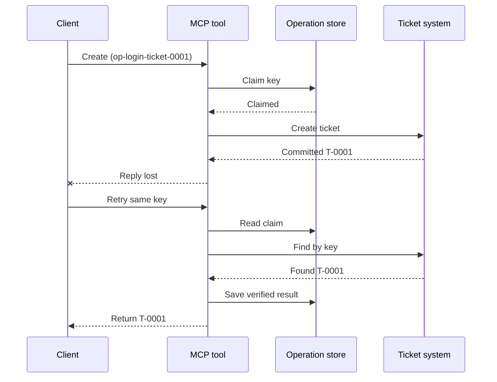
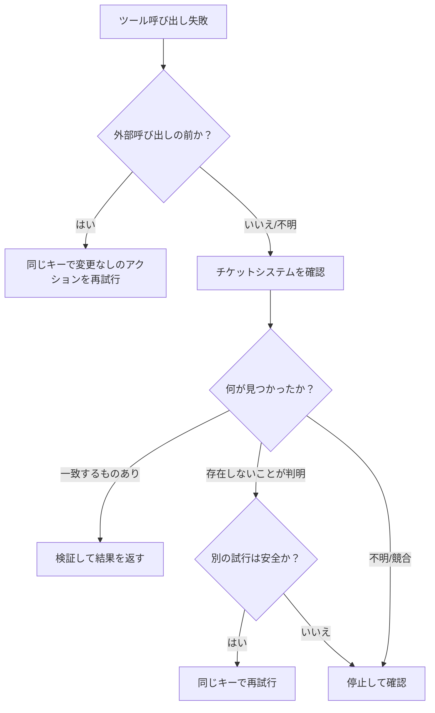

# MCPツールのための安全なリトライ：信頼性サイドカー・パターン

応答がないからといって、アクションが実行されなかったわけではありません。例えば、サポートチケット作成ツールがチケット `T-0001` を作成したものの、クライアントが結果を受け取る前に接続が切断されるケースが考えられます。もしクライアントが何も考えずにリトライを行うと、新たに `T-0002` が作成されてしまうかもしれません。

本レッスンでは、そのような「結果が不確実な状態」を認識する方法、意図したアクションに対して一貫した識別子（ID）を維持する方法、そして再試行の前にチケットシステムの状態を確認する方法を学びます。付属のPython演習は、標準ライブラリとSQLiteを使用してローカル環境で実行できます。

## なぜタイムアウトが「結果不明」を意味するのか

クライアントが `op-login-ticket-0001` という操作キー（operation key）を使って `create_support_ticket` を呼び出す場面を想定してみましょう。



チケットの作成（コミット）は完了したものの、結果が届く前に接続が切断されています。クライアントは「応答がない」ことしか知らず、チケットが作成されたかどうかまでは分かりません。操作キーを再利用することで、ツールは `T-0002` を新たに作成する代わりに、既存の `T-0001` を見つけ出し、それを返すことができます。

## 信頼性サイドカーの役割

信頼性サイドカーとは、ツールの周囲でリカバリ（復旧）のための状態を保持するアプリケーションコードのことです。これはライブラリやミドルウェア、データベースを利用したサービス、あるいは単なるツール実装の一部である場合もあります。必ずしも独立したプロセスである必要はなく、MCPプロトコル自体の機能でもありません。

サイドカーには主に4つの役割があります。

1. 外部システムを呼び出す前に、意図したアクションを保存する。 2. 1つのワーカーだけがそのアクションを要求（claim）できるようにする。
3. クラッシュ後に復旧できるよう、必要な状態を保持する。
4. 結果が不確かな場合は、外部システムを確認する。

このレッスンは、MCP仕様の最終版 `2026-07-28` を対象としています。MCPにはプロトコルレベルのセッションが存在しないため、オペレーションキーは、永続的なアプリケーション状態に裏打ちされた、通常のツール引数として扱われます。このパターンは、以前のMCPバージョンでも同様に機能します。

## 異なる問題を解決する4つのID

これらの識別子は互いに関連していますが、置き換え可能なものではありません。

| 識別子 | 何を識別するか | 再試行後も有効か |
| --- | --- | --- |
| JSON-RPC ID | 1つのリクエストとレスポンス | いいえ（新しいリクエストIDを使用） |
| MCP Task ID | 1つの長時間実行タスク | はい（ポーリング用に保持） |
| Operation key | 1つの意図されたアクション | はい（そのアクションで再利用） |
| Ticket ID | 保存された結果 | はい（検証後に返却） |

進捗通知やトレースコンテキストは、リクエストの状況を把握するのに役立ちます。キャンセルは処理の停止を要求するものです。これらはいずれも、チケットの重複作成を防ぐものではありません。

## ガード（保護機構）の構築

最初のツール呼び出しの前にオペレーションキーを作成し、ワークフローと共に保存します。同じチケットを作成しようとする試みには、常に同じキーを使用します。

```json
{
  "operation_key": "op-login-ticket-0001",
  "title": "Cannot sign in"
}
```

異なるチケットを作成する場合は、新しいキーを使用します。本番環境では、顧客データをキーに含めるのではなく、推測不可能な不透明な（opaqueな）値を生成してください。このレッスンで使用するMCPツールの完全なスキーマは以下の通りです。

```json
{
  "name": "create_support_ticket",
  "title": "Create support ticket",
  "description": "Creates or recovers one support ticket for an operation key.",
  "inputSchema": {
    "$schema": "https://json-schema.org/draft/2020-12/schema",
    "type": "object",
    "properties": {
      "operation_key": {
        "type": "string",
        "minLength": 16,
        "maxLength": 128,
        "description": "Stable key reused for the same intended action."
      },
      "title": {
        "type": "string",
        "minLength": 1,
        "maxLength": 200
      }
    },
    "required": ["operation_key", "title"],
    "additionalProperties": false
  },
  "outputSchema": {
    "$schema": "https://json-schema.org/draft/2020-12/schema",
    "type": "object",
    "properties": {
      "ticket_id": {
        "type": "string"
      },
      "operation_key": {
        "type": "string"
      },
      "status": {
        "type": "string",
        "const": "verified"
      }
    },
    "required": ["ticket_id", "operation_key", "status"],
    "additionalProperties": false
  }
}
```

認証された呼び出し元のIDは、モデルから提供されるツールへの入力ではなく、サーバーのコンテキストから取得されます。保存される各操作のスコープは、以下のように定義します。

- その呼び出し元、テナント、またはサービスアカウント
- ツールの名前とバージョン
- 外部アクションを定義する正規化された入力のハッシュ

入力のハッシュは、「この再試行は同じチケットを要求しているか？」という単純な問いに答えるものです。もしそのキーがすでに別のタイトル（案件）に紐付いている場合は、呼び出しを拒否してください。入力が変更されたにもかかわらず以前の結果を返してしまうと、コントラクト（仕様）上のエラーが隠蔽されてしまうためです。

クレーム（操作の予約）は、アトミックな（不可分な）データベース操作で保存します。「アトミック」とは、2つのワーカーが同時に空のレコードを認識し、両方が所有者になってしまうような事態が起こらないことを意味します。別のサーバーインスタンスが再試行を受け取る可能性がある場合、プロセスローカルなロックでは不十分です。

ワークフローは、アクションが `planned`（計画中）の段階でキーを作成します。その後、サンプルでは以下の状態を永続化します。

- `claimed`（確保済み）：1つのワーカーが操作を予約した状態
- `completed`（完了）：チケットシステムから結果が返された状態
- `verified`（検証済み）：チケットシステムからの読み取りにより結果が確認された状態

クラッシュが発生すると、チケットが作成された後でも、保存された状態が `claimed` のまま残ることがあります。外部からの証拠によって確定するまでは、終了状態（完了または検証済み）にないすべてのクレームを「不確実」なものとして扱ってください。`claimed` 状態であることをもって「何も起こらなかった」とみなしてはいけません。

## 再試行の前に復旧を行う

ツールの呼び出しが失敗した場合、別の外部書き込みを行う前に、何が判明しているかを確認・判断します。



チケットAPIが呼び出される前に失敗する検証エラーは、既知の失敗として扱います。同じ操作キーを使用して、変更なしのアクションを再試行してください。入力の修正によって意図するチケットが変わる場合は、その新しいアクションに対して新しいキーを作成します。

リクエストがチケットシステムに到達している可能性がある場合は、まず整合性の確認（リコンシリエーション）を行ってください。照合とは、保存されたクレームと正式なチケットレコードを比較することです。
一致するレコードが1つだけ見つかった場合は、既存のチケットを返却します。

チケットが確実に存在せず、かつ下流の契約によって再試行が安全と判断された場合にのみ、再試行します。

「見つかりません」という結果は、必ずしも決定的なものではありません。結果整合性検索を行うプロバイダは、一定期間の待機と再チェックが必要になる場合があります。
システムを検索できない場合、矛盾する結果が返された場合、または安全に重複排除できない場合は、処理を停止し、「結果不明」と報告します。ここで停止することは、「フェイルクローズ」と呼ばれることもあります。ワークフローは推測を拒否します。

## 証拠、タスク、およびキャンセル

ツールのレスポンスは、ツールが報告した内容を示します。保存されたチェックポイントは、ワークフローが記録した内容を示します。最も確実な証拠は、その結果を管理するシステムから得られるものです。この例で言えば、チケットシステムから読み取った情報（一致するチケットがちょうど1つ存在することの確認）がそれに当たります。

証拠とリスクを適切に照合してください。リスクの低い通知であれば、プロバイダーのメッセージIDだけで十分な場合があります。一方、支払い、デプロイ、破壊的な操作などでは、プロバイダーのステータス、台帳（レジャー）の記録、あるいは手動確認による証拠が必要になることがあります。

MCPの「Tasks（タスク）」拡張機能は、長時間実行される処理においてこのパターンを補完します。タスクIDを使用すると、クライアントは切断後にポーリングを再開できますが、タスクID自体はチケットを特定したり、チケットの重複を排除したりするものではありません。Tasksを使用する場合、識別子は次のように関連付けられます。

```text
操作キー -> タスクID -> チケットID -> 検証用証拠
```

キャンセル処理は協調的なものであり、ロールバック（取り消し）ではありません。キャンセルが受け付けられた後でもチケットが作成される可能性があるため、不確実な結果については依然として整合性の確認（リコンシリエーション）が必要です。

## 障害注入（Failure-Injection）演習の実行

このサンプルでは2つのSQLiteファイルを使用します。一方は操作ストアを表し、もう一方は外部のチケットシステムを表します。これら2つのファイルにまたがるトランザクションは存在しません。障害は、チケットがコミットされた後、かつサイドカーが完了を記録する前に注入されます。

直接呼び出されるPythonメソッドは、認証済みサーバーコンテキストの代わりとして `caller_id` を受け取ります。モデルによって制御されるMCP入力スキーマには `caller_id` を追加しないでください。

テストを実行する前に結果を予測してみましょう。

| パス | 再試行後の結果 | チケット数 |
| --- | --- | --- |
| ブラインド再試行 | `T-0001` のレスポンスを見失った後、`T-0002` を作成する | 2 |
| ガード付き再試行 | `T-0001` を見つけて返す | 1 |

実行コマンド:

```bash
cd 08-BestPractices/reliability-sidecars/python
python -m unittest discover -p "test_*.py" -v
```

6つのテストから以下のことがわかります。

1. ブラインド再試行は重複を作成する。
2. レスポンスの消失と再起動が発生しても、永続的な要求（durable claim）からチケットを復旧できる。
3. 検証付き再試行は、保存された結果を再利用する。 4. 変更された入力や矛盾する外部の証拠は拒否されます。
5. 外部の証拠を伴わない既存のクレームは、安全に停止します。
6. 競合するクレームについては、検証済みの結果を後戻りさせることなく、単一の所有者が認められます。

サンプルを開く:

- [Python実装](./python/reliability_sidecar.py)
- [決定論的テスト](./python/test_reliability_sidecar.py)

このサンプルでは、​​意図的に「古いクレーム（stale-claim）」のリースに関する処理を省略しています。本番環境での引き継ぎ（テイクオーバー）ポリシーには、有効期限付きのリース、アトミックな所有権の移転、そして実行前の追加の外部チェックが必要となります。

## オプションのコミュニティ実装

「Agent Enhancer Utilities」は、このアプリケーションレベルのパターンを実装したコミュニティ製ツールの一つです。そのプランナー（計画機能）は復旧アプローチを選択し、チェックポイントは「クレーム（処理の確保）」および「結果が不確定な状態」を記録します。実際の処理（アクション）の実行と検証は、依然としてドメインツールまたはMCPサーバーが行います。このサービスはMCP仕様の一部ではなく、本レッスンにおいて必須でもありません。

| レッスンの概念 | Agent Enhancerの構成要素 | 重要な制約 |
| --- | --- | --- |
| 復旧計画 | `workflow-guard-planner` | ドメインツールを呼び出さない |
| クレームと復旧 | `workflow-checkpoint` | `external_proof` は `false` のまま |
| サイドカー呼び出しの正確な再試行 | `lab.invoke_tool` | 別の冪等性キー（idempotency key）を使用 |
| 実際の処理の検証 | 宛先検索／読み戻し（read-back） | ドメインMCPが担当 |

サイドカー呼び出しを正確に再試行するため、`lab.invoke_tool` は外側の `idempotency_key` を受け入れます。このキーはサイドカーの呼び出しを識別するものであり、チケットに使用される業務上の `operation_key` とは異なります。

タグ付けされたパブリックコントラクト（仕様）およびネットワーク経由のサンプル実装は、以下から入手できます。

- [Reliability Sidecar Contract v1](https://github.com/artiehinz/Agent-Enhancer-Utilities/blob/v1.6.0/docs/RELIABILITY_SIDECAR_CONTRACT_V1.md)
- [Planner and mock-domain example](https://github.com/artiehinz/Agent-Enhancer-Utilities/tree/v1.6.0/examples/reliability-sidecar)

これらのリンクは、当該アプリケーションパターンを例示するものです。ホストされているサービスがMCP仕様 `2026-07-28` に準拠していることを保証するものではなく、チェックポイントの状態がチケットの「外部的な証拠（external proof）」と見なされることもありません。

## 本番環境向けチェックリスト

- [ ] 最初の外部への試行を行う前に、オペレーションキーを作成・保存する。
- [ ] キーを、呼び出し元、ツールバージョン、および正規化された入力ハッシュに紐付ける。
- [ ] 既存のキーに対して入力内容が変更されている場合は拒否する。
- [ ] アトミックな共有ストア操作により、単一の所有者のみを許可する。 
- [ ] 冪等性（idempotency）がサポートされている場合は、キーを下流のプロバイダーに転送する。
- [ ] 次の書き込みを行う前に、結果が不確かな処理の整合性を確認（リコンサイル）する。
- [ ] 検証済みの結果と証拠を、リトライ可能な期間全体にわたって保持する。
- [ ] 外部での処理結果を安全に確定できない場合は、処理を中断して確認を行う。

## 参考文献

- [MCP 仕様 `2026-07-28`](https://modelcontextprotocol.io/specification/2026-07-28)
- [MCP `2026-07-28` ツールに関するガイダンス](https://modelcontextprotocol.io/specification/2026-07-28/server/tools)
- [MCP Tasks 拡張機能](https://modelcontextprotocol.io/extensions/tasks/overview)
- [JSON-RPC 2.0 仕様](https://www.jsonrpc.org/specification)

---

<!-- CO-OP TRANSLATOR DISCLAIMER START -->
**免責事項**：
本書類は AI 翻訳サービス [Co-op Translator](https://github.com/Azure/co-op-translator) を使用して翻訳されています。正確性を期していますが、自動翻訳には誤りや不正確な部分が含まれる可能性があることをご承知おきください。原文の原語版が正式な情報源とみなされるべきです。重要な情報については、専門の人間による翻訳を推奨します。本翻訳の利用により生じたいかなる誤解や解釈違いについても、当方は責任を負いかねます。
<!-- CO-OP TRANSLATOR DISCLAIMER END -->
