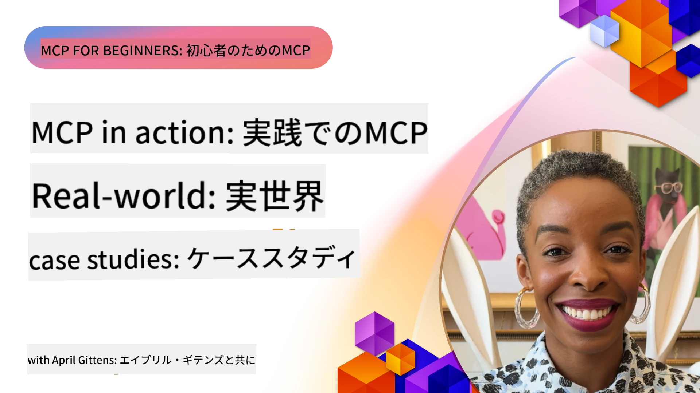

# MCP活用事例：実際のケーススタディ

_(上の画像をクリックすると、このレッスンのビデオをご覧いただけます)_

モデルコンテキストプロトコル（MCP）は、AIアプリケーションがデータ、ツール、サービスとどのように連携するかを変革しています。このセクションでは、さまざまな企業のシナリオにおけるMCPの実用的な応用を示す実例を紹介します。

## 概要

このセクションでは、MCPの実装に関する具体的な事例を紹介し、組織がどのようにこのプロトコルを活用して複雑なビジネス課題を解決しているかを明らかにします。これらのケーススタディを通じて、MCPの多様性、拡張性、および実用的な利点についての洞察を得ることができます。

## 主な学習目標

これらのケーススタディを探索することで、以下が学べます：

- MCPが特定のビジネス課題を解決するためにどのように適用されるかを理解する
- さまざまな統合パターンやアーキテクチャ的アプローチについて学ぶ
- 企業環境でMCPを実装する際のベストプラクティスを認識する
- 実際の実装で直面した課題とその解決策について洞察を得る
- 自分のプロジェクトに類似のパターンを適用する機会を特定する

## 特集ケーススタディ

### 1. [Azure AIトラベルエージェント — リファレンス実装](./travelagentsample.md)

このケーススタディは、MCP、Azure OpenAI、Azure AI Searchを用いた複数エージェントAI搭載の旅行計画アプリケーションを構築する方法を示すマイクロソフトの包括的なリファレンスソリューションを検証します。本プロジェクトでは以下を示しています：

- MCPによる複数エージェントのオーケストレーション
- Azure AI Searchを利用した企業データ統合
- Azureサービスを活用した安全で拡張可能なアーキテクチャ
- 再利用可能なMCPコンポーネントによる拡張可能なツール群
- Azure OpenAIにより実現される会話型ユーザー体験

アーキテクチャおよび実装の詳細は、MCPを調整レイヤーとして用いた複雑な複数エージェントシステムの構築に関する貴重な洞察を提供します。

### 2. [YouTubeデータからAzure DevOpsアイテムの更新](./UpdateADOItemsFromYT.md)

このケーススタディは、ワークフロープロセスの自動化にMCPを実用的に応用した例を示します。MCPツールを利用して以下を実現します：

- オンラインプラットフォーム（YouTube）からデータ抽出
- Azure DevOpsシステム内の作業アイテムの更新
- 繰り返し可能な自動化ワークフローの作成
- 異なるシステム間のデータ統合

この例は、単純なMCP実装であっても定型作業の自動化やシステム間のデータ整合性向上により大幅な効率向上をもたらすことを示しています。

### 3. [MCPによるリアルタイムドキュメント取得](./docs-mcp/README.md)

このケーススタディでは、PythonコンソールクライアントをMCPサーバーに接続し、リアルタイムでコンテキスト認識されたMicrosoftドキュメントを取得・記録する方法を案内します。学べる内容は：

- Pythonクライアントと公式MCP SDKを使ってMCPサーバーに接続する方法
- ストリーミングHTTPクライアントで効率的なリアルタイムデータ取得を行う方法
- サーバーのドキュメントツールを呼び出し、応答を直接コンソールに記録する方法
- 端末を離れずに最新のMicrosoftドキュメントをワークフローに統合する方法

この章にはハンズオン課題、最小動作コードサンプル、さらなる学習のためのリソースリンクが含まれています。MCPがコンソールベースの環境でドキュメントアクセスと開発者生産性をどのように変革するかを、リンク先の章とコードで確認してください。

### 4. [MCPによるインタラクティブ学習計画生成Webアプリ](./docs-mcp/README.md)

このケーススタディは、Chainlitとモデルコンテキストプロトコル（MCP）を使って、あらゆるトピックのためにパーソナライズされた学習計画を生成するインタラクティブなWebアプリの構築方法を示します。ユーザーは科目（例："AI-900認定"）と学習期間（例：8週間）を指定でき、アプリは週ごとの推奨コンテンツを提供します。Chainlitは会話型チャットインターフェイスを提供し、使いやすく適応的な体験を実現します。

- Chainlitによる会話型Webアプリ
- トピックと期間を指定するユーザードリブンのプロンプト
- MCPを使った週単位のコンテンツ推奨
- チャットインターフェイスでのリアルタイムで適応的な応答

このプロジェクトは、会話型AIとMCPを組み合わせて、現代的なWeb環境で動的かつユーザー主導の教育ツールを作成する方法を示しています。

### 5. [VS Code内のMCPサーバーを利用したエディター内ドキュメント](./docs-mcp/README.md)

このケーススタディは、MCPサーバーを使ってMicrosoft Learn Docsを直接VS Code環境に取り込み、ブラウザタブを切り替える必要をなくす方法を示します。以下のことが分かります：

- MCPパネルやコマンドパレットを利用し、VS Code内で瞬時にドキュメント検索と閲覧を行う方法
- ドキュメント参照やREADMEやコースのマークダウンファイルにリンクを直接挿入する方法
- GitHub CopilotとMCPを組み合わせて、シームレスなAI駆動のドキュメントとコードのワークフローを実現する方法
- リアルタイムのフィードバックとMicrosoft提供の精度でドキュメントを検証・強化する方法
- MCPをGitHubワークフローと統合し、継続的なドキュメント検証を行う方法

実装には以下が含まれます：

- 簡単セットアップのための`.vscode/mcp.json`設定例
- エディター内での体験を示すスクリーンショット付きウォークスルー
- CopilotとMCPを組み合わせて生産性を最大にするためのヒント

このシナリオは、コース作成者、ドキュメントライター、開発者がドキュメント、Copilot、検証ツールの作業中にエディター内に集中し続けたい場合に理想的です。すべてがMCPで支えられています。

### 6. [APIMを用いたMCPサーバーの作成](./apimsample.md)

このケーススタディは、Azure API Management (APIM) を使ってMCPサーバーを作成する手順を詳述します。内容は以下をカバーします：

- Azure API ManagementでのMCPサーバー設定
- MCPツールとしてAPI操作を公開する方法
- レートリミットやセキュリティのためのポリシー設定
- Visual Studio CodeとGitHub CopilotによるMCPサーバーのテスト

この例は、Azureの機能を活かして堅牢なMCPサーバーを作成し、AIシステムと企業APIの統合を強化する方法を示しています。

### 7. [GitHub MCPレジストリ — エージェント統合の加速](https://github.com/mcp)

このケーススタディでは、2025年9月に開始されたGitHubのMCPレジストリが、AIエコシステムの重要な課題、すなわち分散したMCPサーバーの発見と展開の断片化問題にどう対応しているかを考察します。

#### 概要
<strong>MCPレジストリ</strong>は、従来統合が遅く、エラーが起こりやすかった各リポジトリやレジストリに散在するMCPサーバーの問題を解決します。これらのサーバーは、AIエージェントがAPIやデータベース、ドキュメントソースなど外部システムと連携するためのものです。

#### 問題の定義
エージェントワークフローを構築する開発者は以下の課題に直面していました：
- 異なるプラットフォーム間でのMCPサーバーの<strong>発見困難</strong>
- フォーラムやドキュメントに散らばる<strong>冗長なセットアップ質問</strong>
- 未検証・信用できないソースからの<strong>セキュリティリスク</strong>
- サーバー品質と互換性の<strong>標準化の欠如</strong>

#### ソリューションアーキテクチャ
GitHub MCPレジストリは、信頼されたMCPサーバーを集中管理し、以下の主要機能を備えています：
- VS Codeとの<strong>ワンクリックインストール</strong>によるスムーズなセットアップ
- スター数、活動量、コミュニティの検証を用いた<strong>ノイズの少ない信号抽出</strong>
- GitHub Copilotや他のMCP対応ツールとの<strong>直接統合</strong>
- コミュニティと企業パートナー双方が貢献可能な<strong>オープンな貢献モデル</strong>

#### ビジネスへの影響
レジストリは測定可能な改善をもたらしました：
- Microsoft Learn MCPサーバーのようなツールを使った開発者の<strong>オンボーディング時間の短縮</strong>（公式ドキュメントをエージェントに直接ストリーム）
- `github-mcp-server`のような専門サーバーによる<strong>生産性向上</strong>（自然言語GitHub自動化: PR作成、CI再実行、コードスキャン）
- キュレーション済みリストと透明な設定基準による<strong>エコシステムの信頼強化</strong>

#### 戦略的価値
エージェントライフサイクル管理や再現可能なワークフローを専門とする実務者に対し、MCPレジストリは以下を提供します：
- 標準化されたコンポーネントによる<strong>モジュール式エージェント展開</strong>
- 一貫したテストと検証のための<strong>レジストリ支援評価パイプライン</strong>
- 異なるAIプラットフォーム間の統合を可能にする<strong>クロスツール相互運用性</strong>

このケーススタディは、MCPレジストリが単なるディレクトリではなく、拡張可能で実用的なモデル統合とエージェントシステム展開の基盤プラットフォームであることを示しています。

### 8. [エージェントからソーシャルネットワークへの投稿](./publora-social-publishing.md)

このケーススタディは、書き込み可能なリモートMCPサーバーを使った例を紹介します。ツールがユーザーの代理で不可逆的なアクションを行う例としてソーシャル投稿を取り上げ、エージェントが投稿案を作成し、人間が承認、サーバーがネットワークに予定投稿を行います。

興味深いのは、投稿が課す設計制約であり、これは読み取りではなく書き込みを行う任意のサーバーに当てはまります：

- **オープンな発見、認証付き実行**： `tools/list` は資格情報なしで応答しレジストリやクライアントが内部を調査できる一方、すべての `tools/call` はトークンを必要とし、そうでなければ `401` と `WWW-Authenticate` ヘッダーを返す
- **非対面によるOAuth登録**：現在の動的クライアント登録と、`2026-07-28`仕様が指すクライアントIDメタデータドキュメントへの方向
- <strong>ツール注釈</strong>（`readOnlyHint`、`destructiveHint`、`idempotentHint`）でクライアントが確認すべき内容を判断—強制ではなくヒントで、接続ディレクトリのレビュー時に期待されるもの
- <strong>偽造不能な識別子</strong>で、幻覚値が大人しく失敗し、ありそうな値で誤動作しないようにする
- <strong>ポスト作成ツールの冪等性キー</strong>で、エージェントランタイムの再試行が重複投稿にならないようにする
- <strong>ツールスキーマで記述されたNo-opターゲット</strong>により書き込みパスをフルに動かしつつ何も投稿しない処理を設け、レビュアーやCIで利用

この章は作成中のサーバーに適用できる短いチェックリストで締めくくられます。

## 結論

これら8つの包括的なケーススタディは、モデルコンテキストプロトコルの多様性と実用性をさまざまな実世界のシナリオで示しています。複雑なマルチエージェント旅行計画システムや企業API管理から効率的なドキュメントワークフローや革新的なGitHub MCPレジストリまで、これらの例はMCPがAIシステムとツール、データ、サービスを標準化・拡張可能な方法で接続し、卓越した価値を提供していることを明らかにします。

ケーススタディはMCP実装の複数の側面を網羅しています：
- <strong>企業統合</strong>：Azure API ManagementとAzure DevOpsの自動化
- <strong>マルチエージェントオーケストレーション</strong>：調整されたAIエージェントによる旅行計画
- <strong>開発者生産性</strong>：VS Code統合とリアルタイムドキュメントアクセス
- <strong>エコシステム開発</strong>：基盤プラットフォームとしてのGitHub MCPレジストリ
- <strong>教育用途</strong>：インタラクティブな学習計画生成器と会話型インターフェイス

これらの実装を学ぶことで、以下の重要な洞察が得られます：
- <strong>規模やユースケースに応じたアーキテクチャパターン</strong>
- <strong>機能性と保守性のバランスを取る実装戦略</strong>
- <strong>本番環境展開におけるセキュリティと拡張性の考慮</strong>
- **MCPサーバー開発とクライアント統合のベストプラクティス**
- **相互接続されたAI対応ソリューション構築のためのエコシステム思考**

これらの例は、MCPが単なる理論的枠組みではなく、実際の複雑なビジネス課題に対応可能な成熟した本番対応プロトコルであることを実証しています。シンプルな自動化ツールから高度なマルチエージェントシステムまで、ここで示したパターンとアプローチは自身のMCPプロジェクトの堅実な基盤となるでしょう。

## 追加リソース

- [Azure AIトラベルエージェントGitHubリポジトリ](https://github.com/Azure-Samples/azure-ai-travel-agents)
- [Azure DevOps MCPツール](https://github.com/microsoft/azure-devops-mcp)
- [Playwright MCPツール](https://github.com/microsoft/playwright-mcp)
- [Microsoft Docs MCPサーバー](https://github.com/MicrosoftDocs/mcp)
- [GitHub MCPレジストリ — エージェント統合の加速](https://github.com/mcp)
- [MCPコミュニティ例](https://github.com/microsoft/mcp)

## 次へ

- 前へ: [モジュール8: ベストプラクティス](../08-BestPractices/README.md)
- 次へ: [モジュール10: AIワークフローの効率化: AIツールキットでMCPサーバー構築](../10-StreamliningAIWorkflowsBuildingAnMCPServerWithAIToolkit/README.md)

---

<!-- CO-OP TRANSLATOR DISCLAIMER START -->
**免責事項**：
本書類は AI 翻訳サービス [Co-op Translator](https://github.com/Azure/co-op-translator) を使用して翻訳されています。正確性を期していますが、自動翻訳には誤りや不正確な部分が含まれる可能性があることをご承知おきください。原文の原語版が正式な情報源とみなされるべきです。重要な情報については、専門の人間による翻訳を推奨します。本翻訳の利用により生じたいかなる誤解や解釈違いについても、当方は責任を負いかねます。
<!-- CO-OP TRANSLATOR DISCLAIMER END -->