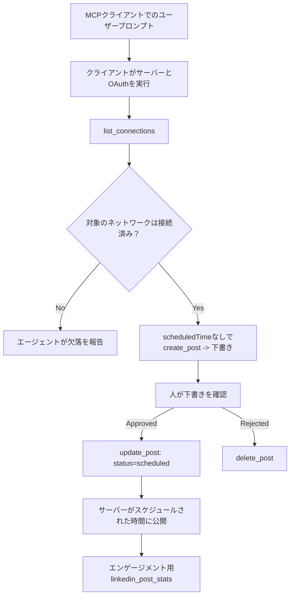

# ケーススタディ：リモートMCPサーバーを使ったエージェントからのソーシャルネットワークへの公開

> **免責事項：** 複数のサービスやオープンソースプロジェクトがソーシャルネットワークへの公開を行え、またチームがそれぞれのネットワークのAPIを直接統合することも可能です。以下のシナリオは、<strong>書き込み可能なリモートMCPサーバー</strong>がどのように設計・利用されうるかの一例として示されています。Publoraは無料プランのある商用サービスであり、ここで説明するパターンは、ユーザーの代わりに不可逆的なアクションを実行する任意のMCPサーバーに適用されます。

## 概要

エージェントはコンテンツの草稿作成は得意だが、配信は苦手です。モデルは数秒でリリース発表の文章を書けますが、その後の作業は止まります：公開には各ネットワークごとのAPI、各ネットワークごとのOAuthアプリ、それぞれ異なるメディアルールが必要だからです。多くのチームはこれをブラウザにテキストを手作業でコピーすることで解決しています。

本ケーススタディでは、その最後のステップを単一のリモートMCPサーバーでどのように完結させるか、また — それを構築する人にとってより役立つように — <strong>書き込み可能な</strong>サーバーが正しく行うべき設計判断を見ていきます。データの読み取りは寛容ですが、公開は違います：誤ったツール呼び出しは観客に見え、元に戻せません。

## シナリオ

小規模な開発者リレーションチームがエージェント（Claude、VS Code、Cursor などクライアントは問わない）内で投稿文を草稿します。エージェントに求めることは：

- チームが接続済みのソーシャルアカウントを確認できること、
- 投稿文を草稿として保存し、人間による承認まで保持できること、
- 画像を添付できること、
- 指定した時間に複数のネットワークへスケジュールできること、
- 後でどのように投稿が反応したか報告できること。

決定的に重要なのは、実験段階のうちは誤って公開できないことをエージェントに保証することです。

## 利用したツール

- [Publora MCP Server](https://github.com/publora/mcp-server) — パブリッシング、スケジューリング、メディア、LinkedIn分析ツールを提供するリモートMCPサーバー（`streamable-http`）。公式MCPレジストリに `com.publora/mcp-server` として登録済み。

## ステップバイステップのワークフロー

1. **サーバーに接続する。** OAuth対応クライアントはサーバー自身の同意画面を介したPKCE付き認可コードフローを完了する。対応しないクライアント（ヘッドレスCLIなど）はヘッダにPublora APIキーを使う。双方がサポートされており、どちらを使うかはクライアントに依存し、サーバーには依存しない。
2. **接続を一覧表示。** エージェントは `list_connections` を呼び出し、接続済みアカウントの識別子を受け取る。
3. **草稿作成。** エージェントはスケジュール時間なしで `create_post` を呼び出す。投稿は草稿として保存され、公開はされない。
4. **メディアを添付。** 公開画像URLを同一呼び出し内で渡す。サーバーはダウンロードし検証する。
5. **スケジュール設定。** 人間による承認後に `update_post` でステータスをスケジュール済みに更新し、ISO 8601時間を指定する。
6. **測定。** LinkedInについては、投稿がライブ状態になると `linkedin_post_stats` がエンゲージメントを返す。

## 例示プロンプト

```text
Which social accounts do I have connected?
Draft a post announcing our new changelog page, attach the screenshot at
https://example.com/changelog.png, and keep it as a draft — do not publish it.
Once I approve, schedule it to LinkedIn and Bluesky for tomorrow at 09:00 UTC.
```

## Mermaid フローチャート



## 技術的実装

以下の教訓は、本ケーススタディから移植可能な部分です。

### オープンな発見、認証付き実行

`tools/list` は認証不要で提供される；一方すべての `tools/call` はトークンを必要とし、なければ `401` と `WWW-Authenticate` ヘッダーが返され、保護リソースのメタデータを指し示す。（サーバーは認証なしの `initialize` にも応答するが、これは `2026-07-28` より前のプロトコルバージョンのクライアントにのみ関係する。その改訂でハンドシェイクが完全に削除された。）

この分離は実務で重要です。レジストリ、カタログ、クライアントは秘密なしにツールの表面（名前、スキーマ、注釈）を内省できるが、匿名で<em>実行</em>はできません。`initialize` にトークンを要求するサーバーはツールからは事実上見えず、匿名の `tools/call` を許すサーバーはリスクとなります。

### 登録：動的クライアント登録とそれに代わるもの

サーバーは `/.well-known/oauth-protected-resource` と `/.well-known/oauth-authorization-server` を広告し、PKCE（`S256`）付き認可コードフロー、リフレッシュトークン、および<strong>動的クライアント登録</strong>をサポートしています。

動的登録は手動ステップを省略します。これがないとすべてのクライアントに事前発行された `client_id` が必要で、クライアントごとにベンダーへのオフバンドリクエストが生じます。

これは模倣すべき設計というより互換動作と考えてください。`2026-07-28` の仕様改訂は動的クライアント登録を廃止し、クライアントがHTTPSの安定URLにホストしたメタデータドキュメントを `client_id` とする Client ID Metadata Documents に置き換えます。DCRは今なお機能しますが、今日新設計を作るなら CIMD を計画し、古いクライアントはDCRを保持する形にすべきです。

### ツールの注釈は装飾ではない

すべてのツールは `title` と適用されるヒント：`readOnlyHint`、`destructiveHint`、`idempotentHint`、`openWorldHint` を持ちます。

これに投資する理由は二つ。まず、クライアントはヒントを使いユーザーに確認すべき動作を決めます — 例えば読み取り専用の照会は自動実行し、削除前に承認を求めることが可能です。仕様は注釈を信頼不可のヒントとし、認可メカニズムではないと明言しています：クライアントが提供する動作を形づくるだけで、サーバー側で何かを止めるものではなく、サーバーは独自のルールを必ず遵守しなければなりません。次に、主要なコネクタディレクトリはレビュー時に注釈を<em>必須</em>としています；ツールにタイトルやヒントの無いサーバーは、挙動に関係なく却下されます。

### 識別子を推測不能にする

プラットフォーム識別子は `list_connections` が返す不透明な文字列であり、スキーマの説明はそれを逐語的にコピーし、決して推測してはならないと明示しています。サーバーはそれ以外を拒否します。

モデルは混同が得意です。書き込み可能なサーバーは必ずいずれ識別子が幻覚されると仮定し、ありそうな値で動くのではなく、早期かつ明確に失敗させるべきです。

### 公開前に失敗し、操作可能なメッセージを返す

一部のネットワークではテキストのみの投稿を拒否し、画像か動画の添付を要求します。これは投稿のスケジューリング時に検証され、エラーはプラットフォーム名と不足条件を示します。

エージェントは「Instagramにはメディアが必要 — 画像か動画を添付してください」には往復不要で回復可能ですが、一般的な `400` では回復できません。

### リトライを安全に行えるようにする

コンテンツ作成ツールの `create_post` と `update_post` は冪等性キーを受け入れます：同一キーで同一リクエストを再送すると元の応答を再生し、二重投稿を防ぎます。エージェントランタイムはタイムアウトでリトライします。冪等性がないと遅い応答が重複公開になる恐れがあります。他の書き込みツール（削除、メディア処理、LinkedInのリアクションとコメント）は冪等性キーを取らず、そちらのリトライは自動的に安全とは言えません。自分の変異操作のうちどれが保護され、どれがされていないか把握しましょう。

### 何も公開しないテスト手段を提供する

サーバーは予約済みのターゲット `publora-playground` を受け入れます。これは検証・承認はされるが捨てられ、実際のアカウントには届きません。これはツールスキーマ自体に記述されており、クライアントは認証なしで読めます。`create_post` の `platforms` フィールドでは「実際の接続を必要としない接続テスト用ターゲット — 投稿は承認され捨てられ、何も公開されない」と説明されています。これを呼び出すには唯一のエントリとして `platforms: ["publora-playground"]` を渡します。

これは全体の表面で最も有用な詳細の一つであることが分かりました。コネクタディレクトリのレビュー担当者、貢献者、CIは、リアルな観客にリスクなしで完全な書き込みパスを端から端まで実行できます。不可逆的アクションを持つ全てのMCPサーバーは文書化された無操作ターゲットを持つべきです。

## 成果と影響

- 公開ステップがブラウザからコンテンツ作成中の会話内に移り、草稿優先の習慣で人間が介在します。ここでいう草稿は慣習であり境界ではありません。同一資格情報でスケジュールと公開が可能なので、実際の承認ゲートが必要ならツール表面の外で強制する必要があります — 資格情報の分離、またはサーバー前のポリシーレイヤーなど。
- ネットワークごとの差異（メディア要件、スレッド、返信制御）は、接続する全てのエージェントではなくサーバー側で一度だけ処理されます。
- 同一サーバーは探索がオープン、登録が動的なので複数のMCPクライアントをクライアントごとの作業なしに支えます。
- 上記の設計制約はユーザーだけでなくコネクタディレクトリのレビューによっても形作られました：注釈、OAuth、安全なテストターゲットの各機能はそれぞれ少なくとも1回は要求されました。

## 参考文献

- [Publora MCP Server (ソース)](https://github.com/publora/mcp-server)
- [Publora API とMCPドキュメント](https://docs.publora.com)
- [MCP レジストリエントリ: `com.publora/mcp-server`](https://registry.modelcontextprotocol.io/v0/servers?search=com.publora/mcp-server)
- [MCP仕様 — 認可](https://modelcontextprotocol.io/specification/draft/basic/authorization)
- [MCP仕様 — ツール注釈](https://modelcontextprotocol.io/docs/concepts/tools)

## 次のステップ

- 自分が設計しているMCPサーバーで、ここに挙げた最も効果的な三つをチェックする：すべてのツールに注釈、すべての書き込みに冪等性キー、文書化された無操作ターゲット。
- オープンディスカバリの分離を試す：認証なしで公開されたリモートサーバーに `tools/list` を呼び出し、次にツールを呼んで `401` チャレンジを観察する。
- 自分の分野における「取り消し」は何かを考える。公開には草稿と削除がある；もしアクションに相当がなければ確認はツール設計に置くべきで、プロンプトではない。

---

<!-- CO-OP TRANSLATOR DISCLAIMER START -->
**免責事項**：
本書類は AI 翻訳サービス [Co-op Translator](https://github.com/Azure/co-op-translator) を使用して翻訳されています。正確性を期していますが、自動翻訳には誤りや不正確な部分が含まれる可能性があることをご承知おきください。原文の原語版が正式な情報源とみなされるべきです。重要な情報については、専門の人間による翻訳を推奨します。本翻訳の利用により生じたいかなる誤解や解釈違いについても、当方は責任を負いかねます。
<!-- CO-OP TRANSLATOR DISCLAIMER END -->