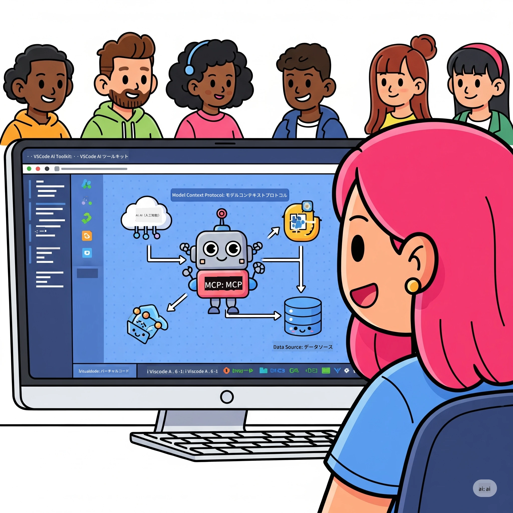
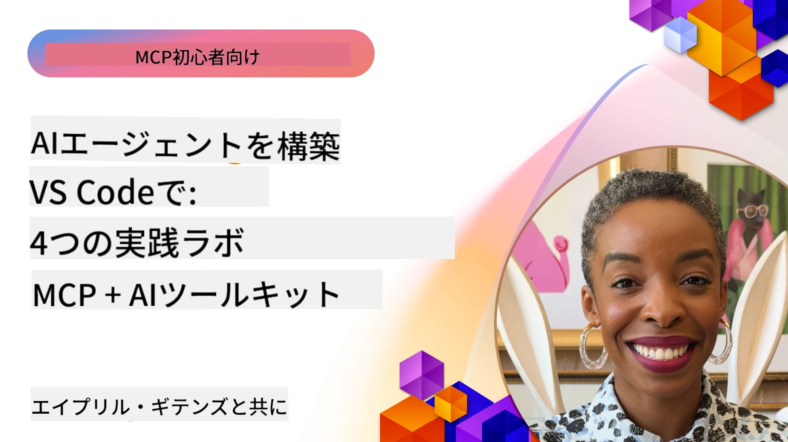

# AIワークフローの効率化：Microsoft Foundry ToolkitでMCPサーバーを構築する

## 🎯 概要

_(上の画像をクリックするとこのレッスンのビデオを視聴できます)_

<strong>Model Context Protocol (MCP) ワークショップ</strong>へようこそ！この充実したハンズオンワークショップでは、2つの最先端技術を組み合わせてAIアプリケーション開発を革新します：

> **互換性についての注意:** ワークショップコードは上のバッジに示されているようにMCP
> `2025-11-25` で構築・テストされています。新しいプロトコル実装には
> [最新の `2026-07-28` 仕様](https://modelcontextprotocol.io/specification/2026-07-28/)
> を使用し、SDKのリリースノートを確認のうえ
> ラボを移行してください。

- **🔗 Model Context Protocol (MCP)**: シームレスなAIツール統合のためのオープン標準
- **🛠️ Microsoft Foundry Toolkit Extension for VS Code**: Microsoftによる強力なAI開発拡張機能

### 🎓 学習内容

ここでのワークショップ終了時には、AIモデルと現実のツール・サービスを橋渡しするインテリジェントアプリケーションの構築方法を習得します。自動テストからカスタムAPI統合まで、複雑な事業課題を解決する実践的なスキルが身につきます。

## 🏗️ 技術スタック

### 🔌 Model Context Protocol (MCP)

MCPは<strong>「AIのためのUSB-C」</strong> — AIモデルを外部ツールやデータソースに接続するユニバーサル標準です。

**✨ 主な特徴：**

- 🔄 <strong>標準化された統合</strong>: AIツール接続のためのユニバーサルインターフェース
- 🏛️ <strong>柔軟なアーキテクチャ</strong>: stdio/SSE通信によるローカル & リモートサーバー対応
- 🧰 <strong>充実したエコシステム</strong>: ツール、プロンプト、リソースを一つのプロトコルで提供
- 🔒 <strong>エンタープライズ対応</strong>: セキュリティと信頼性を内蔵

**🎯 なぜMCPが重要なのか：**
USB-Cがケーブルの混乱を解消したように、MCPはAI統合の複雑さをなくします。ひとつのプロトコルで無限の可能性。

### 🤖 Microsoft Foundry Toolkit Extension for VS Code

Microsoftの代表的なAI開発拡張機能で、VS CodeをAI開発の強力なプラットフォームに変えます。

**🚀 コア機能：**

- 📦 <strong>モデルカタログ</strong>: Azure AI、GitHub、Hugging Face、Ollamaのモデルにアクセス
- ⚡ <strong>ローカル推論</strong>: ONNX最適化済みのCPU/GPU/NPU実行
- 🏗️ <strong>エージェントビルダー</strong>: MCP統合の視覚的AIエージェント開発
- 🎭 <strong>マルチモーダル</strong>: テキスト、ビジョン、構造化出力対応

**💡 開発のメリット:**

- 設定不要のモデル展開
- 視覚的プロンプトエンジニアリング
- リアルタイムのテストプレイグラウンド
- シームレスなMCPサーバー統合

## 📚 学習の旅

### [🚀 モジュール1：Microsoft Foundry Toolkit基礎](./lab1/README.md)

<strong>所要時間</strong>：15分

- 🛠️ Microsoft Foundry ToolkitのインストールとVS Codeへの設定
- 🗂️ Model Catalogを探検（GitHub、ONNX、OpenAI、Anthropic、Googleの100以上のモデル）
- 🎮 リアルタイムモデルテスト用インタラクティブプレイグラウンドをマスター
- 🤖 Agent Builderで最初のAIエージェントを構築
- 📊 F1、関連性、類似性、一貫性などの内蔵メトリクスでモデル性能を評価
- ⚡ バッチ処理とマルチモーダル対応機能を学習

**🎯 学習成果**：Microsoft Foundry Toolkitの機能を総合的に理解して、実用的なAIエージェントを作成

### [🌐 モジュール2：Microsoft Foundry ToolkitとMCP基礎](./lab2/README.md)

<strong>所要時間</strong>：20分

- 🧠 Model Context Protocol（MCP）のアーキテクチャと概念を習得
- 🌐 MicrosoftのMCPサーバーエコシステムを探る
- 🤖 Playwright MCPサーバーを使ったブラウザ自動化エージェントを構築
- 🔧 MCPサーバーをMicrosoft Foundry Toolkit Agent Builderに統合
- 📊 エージェント内でのMCPツールの設定とテスト
- 🚀 MCP対応のエージェントをエクスポートし、本番環境に展開

**🎯 学習成果**：外部ツールを活用したMCP連携によるAIエージェントを展開

### [🔧 モジュール3：Microsoft Foundry Toolkitと高度なMCP開発](./lab3/README.md)

<strong>所要時間</strong>：20分

- 💻 Microsoft Foundry Toolkitを使ったカスタムMCPサーバーの作成
- 🐍 最新のMCP Python SDK（v1.9.3）の設定と利用
- 🔍 MCP Inspectorを設定しデバッグに活用
- 🛠️ プロフェッショナルなデバッグワークフローを備えた天気MCPサーバーを構築
- 🧪 Agent BuilderおよびInspector環境でMCPサーバーをデバッグ

**🎯 学習成果**：最新のツールを用いてカスタムMCPサーバーの開発とデバッグを行う

### [🐙 モジュール4：実践的MCP開発 - カスタムGitHubクローンサーバー](./lab4/README.md)

<strong>所要時間</strong>：30分

- 🏗️ 開発ワークフロー向けの実用的なGitHubクローンMCPサーバーを構築
- 🔄 検証とエラーハンドリングを備えたスマートなリポジトリクローニングを実装
- 📁 インテリジェントなディレクトリ管理とVS Code統合を作成
- 🤖 GitHub CopilotエージェントモードをカスタムMCPツールで利用
- 🛡️ 本番対応の信頼性とクロスプラットフォーム互換性を適用

**🎯 学習成果**：実際の開発ワークフローを効率化する本番対応MCPサーバーを展開

## 💡 実世界での応用と影響

### 🏢 エンタープライズユースケース

#### 🔄 DevOps自動化

インテリジェントな自動化で開発ワークフローを変革：

- <strong>スマートリポジトリ管理</strong>：AIによるコードレビューとマージ判断
- **インテリジェントCI/CD**：コード変更に基づくパイプライン自動最適化
- <strong>課題トリアージ</strong>：自動バグ分類と割り当て

#### 🧪 品質保証の革新

AI搭載自動化でテストを高度化：

- <strong>インテリジェントテスト生成</strong>：包括的なテストスイートを自動作成
- <strong>ビジュアル回帰テスト</strong>：AIによるUI変更検知
- <strong>パフォーマンス監視</strong>：問題の早期特定と解決

#### 📊 データパイプラインインテリジェンス

賢いデータ処理ワークフローを構築：

- **適応型ETLプロセス**：自己最適化するデータ変換
- <strong>異常検知</strong>：リアルタイムのデータ品質モニタリング
- <strong>インテリジェントルーティング</strong>：スマートなデータフロー管理

#### 🎧 顧客体験の向上

卓越した顧客交流を実現：

- <strong>コンテキスト対応サポート</strong>：顧客履歴にアクセス可能なAIエージェント
- <strong>先回りの問題解決</strong>：予測型カスタマーサービス
- <strong>マルチチャネル統合</strong>：プラットフォーム横断の統合AI体験

## 🛠️ 前提条件とセットアップ

### 💻 システム要件

| コンポーネント | 要件 | 備考 |
|-----------|-------------|-------|
| <strong>オペレーティングシステム</strong> | Windows 10以上、macOS 10.15以上、Linux | 任意の最新OS |
| **Visual Studio Code** | 最新の安定版 | Microsoft Foundry Toolkit用に必須 |
| **Node.js** | v18.0以上およびnpm | MCPサーバー開発用 |
| **Python** | 3.10以上 | Python MCPサーバーはオプション |
| <strong>メモリ</strong> | 最低8GB RAM | ローカルモデルは16GB推奨 |

### 🔧 開発環境

#### 推奨VS Code拡張機能

- **Microsoft Foundry Toolkit** (ms-windows-ai-studio.windows-ai-studio)
- **Python** (ms-python.python)
- **Pythonデバッガー** (ms-python.debugpy)
- **GitHub Copilot** (GitHub.copilot) - オプションだが有用

#### オプションツール

- **uv**：モダンなPythonパッケージマネージャー
- **MCP Inspector**：MCPサーバー用の視覚的デバッグツール
- **Playwright**：ウェブ自動化の例用

## 🎖️ 学習成果と認定パス

### 🏆 スキル習得チェックリスト

このワークショップを修了すると、以下を習得できます：

#### 🎯 コアコンピテンシー

- [ ] **MCPプロトコルの習熟**：アーキテクチャと実装パターンを深く理解
- [ ] **Microsoft Foundry Toolkitの熟練**：高速開発のための高度な活用
- [ ] <strong>カスタムサーバー開発</strong>：本番用MCPサーバーの構築、展開、保守
- [ ] <strong>ツール統合の卓越</strong>：AIと既存の開発ワークフローをシームレスに接続
- [ ] <strong>問題解決の応用</strong>：学んだスキルを実ビジネスの課題に適用

#### 🔧 技術スキル

- [ ] VS CodeでMicrosoft Foundry Toolkitを設定・構成する
- [ ] カスタムMCPサーバーを設計・実装
- [ ] GitHubモデルをMCPアーキテクチャに統合
- [ ] Playwrightでの自動テストワークフロー構築
- [ ] AIエージェントを本番環境に展開
- [ ] MCPサーバーのデバッグと最適化

#### 🚀 高度な能力

- [ ] エンタープライズ規模のAI統合を設計
- [ ] AIアプリケーションのセキュリティベストプラクティスを実装
- [ ] 拡張可能なMCPサーバーアーキテクチャを設計
- [ ] 特定ドメイン向けのカスタムツールチェーンを作成
- [ ] AIネイティブ開発における他者の指導

## 📖 追加リソース

- [MCP仕様書（2026-07-28）](https://modelcontextprotocol.io/specification/2026-07-28/)
- [Microsoft Foundry Toolkit GitHubリポジトリ](https://github.com/microsoft/vscode-ai-toolkit)
- [MCPサンプルサーバーコレクション](https://github.com/modelcontextprotocol/servers)
- [ベストプラクティスガイド](https://modelcontextprotocol.io/docs/best-practices)
- [OWASP MCPトップ10](https://microsoft.github.io/mcp-azure-security-guide/mcp/) - セキュリティベストプラクティス

---

**🚀 AI開発ワークフローを革新する準備はできましたか？**

MCPとMicrosoft Foundry Toolkitで、インテリジェントアプリケーションの未来を一緒に築きましょう！

## 次のステップ

続けて：[モジュール11：MCPサーバーハンズオンラボ](../11-MCPServerHandsOnLabs/README.md)

---

<!-- CO-OP TRANSLATOR DISCLAIMER START -->
**免責事項**：
本書類は AI 翻訳サービス [Co-op Translator](https://github.com/Azure/co-op-translator) を使用して翻訳されています。正確性を期していますが、自動翻訳には誤りや不正確な部分が含まれる可能性があることをご承知おきください。原文の原語版が正式な情報源とみなされるべきです。重要な情報については、専門の人間による翻訳を推奨します。本翻訳の利用により生じたいかなる誤解や解釈違いについても、当方は責任を負いかねます。
<!-- CO-OP TRANSLATOR DISCLAIMER END -->