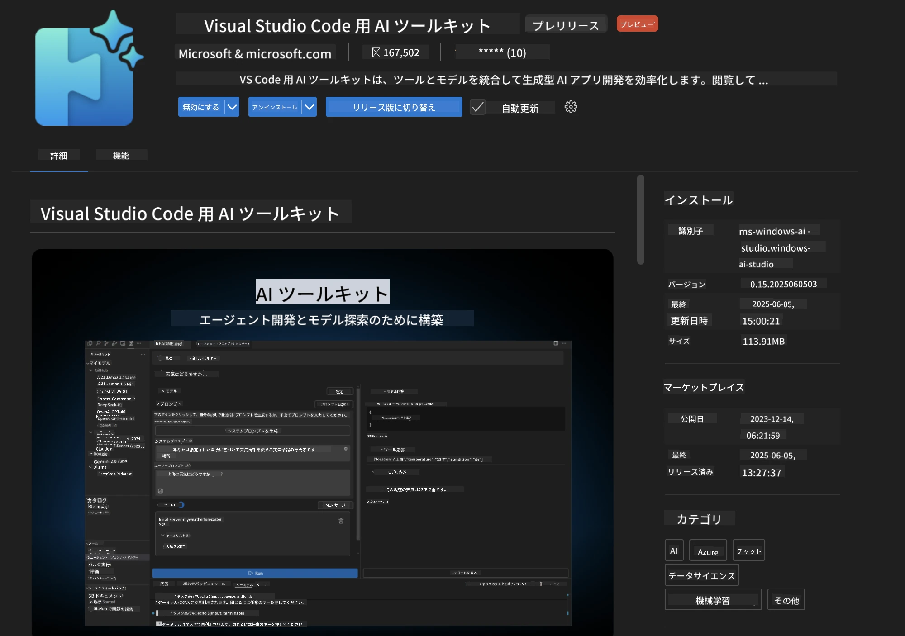
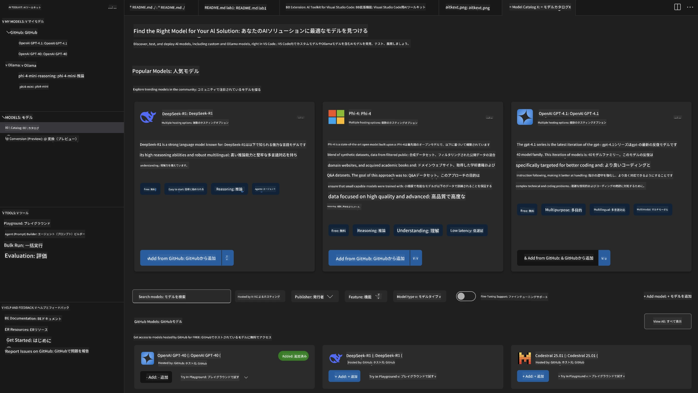
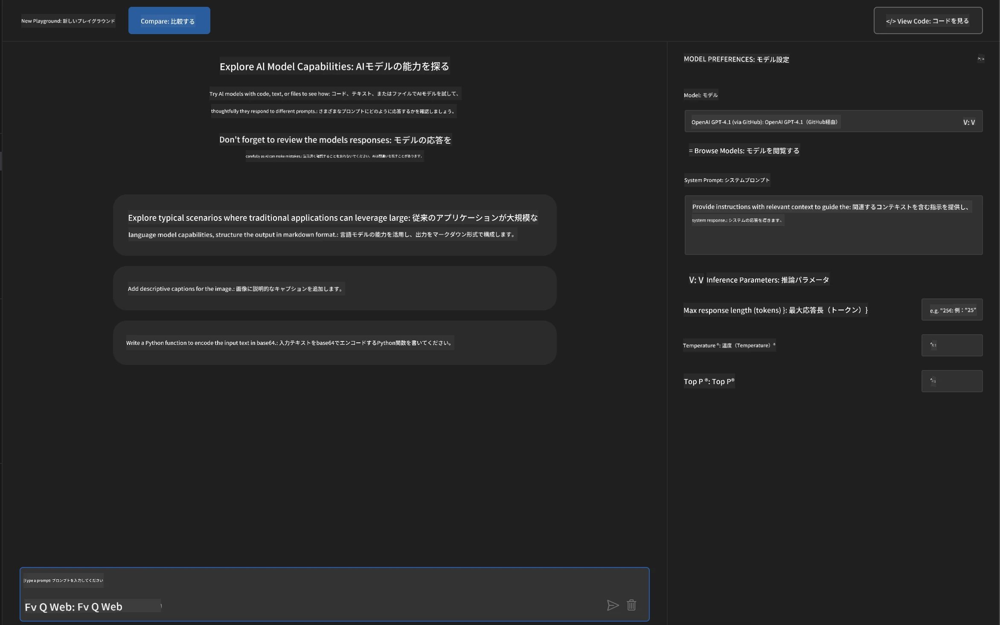
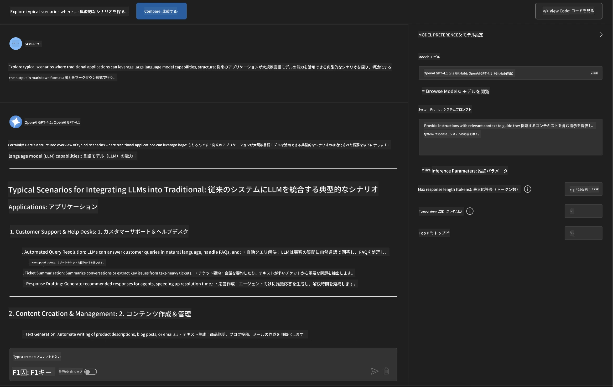
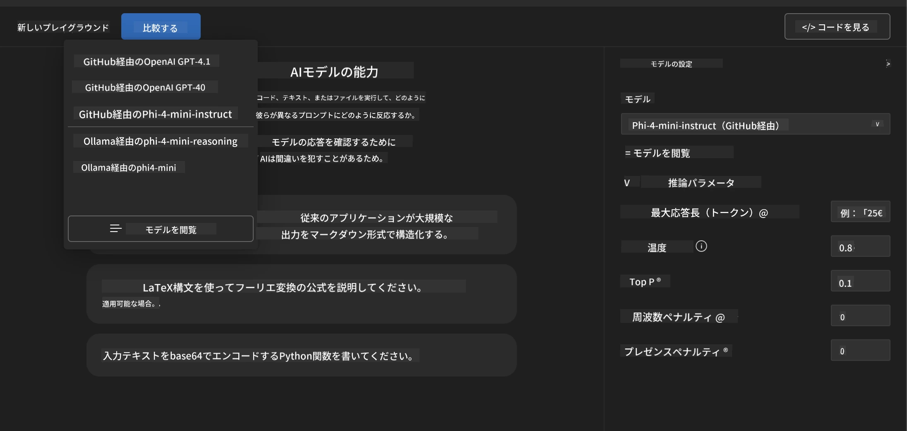
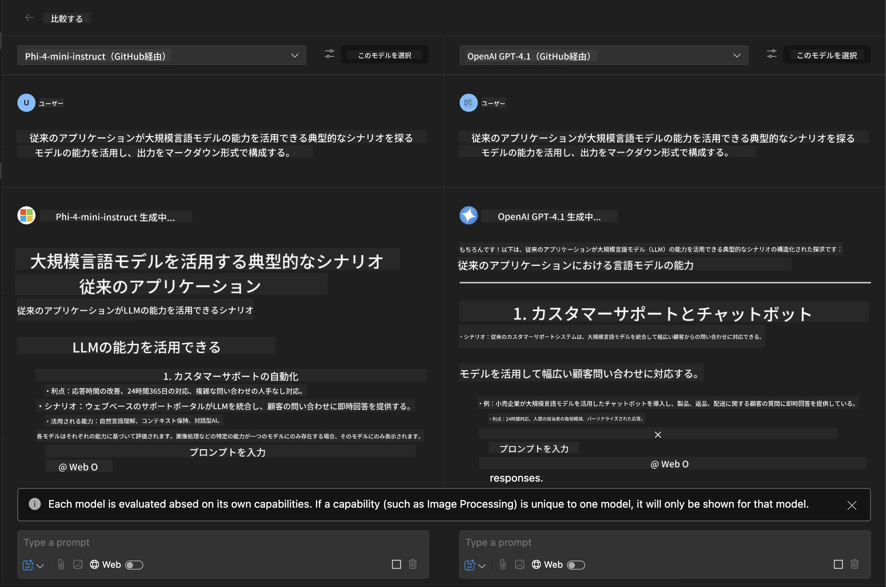
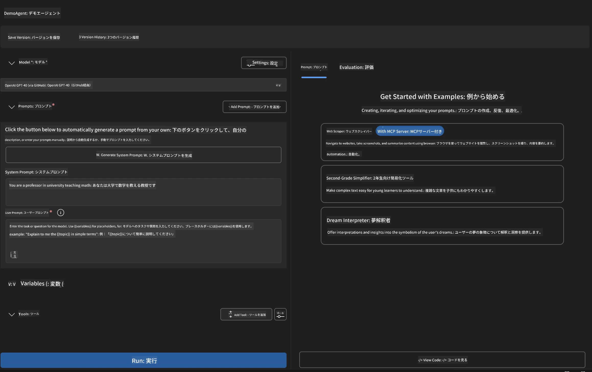
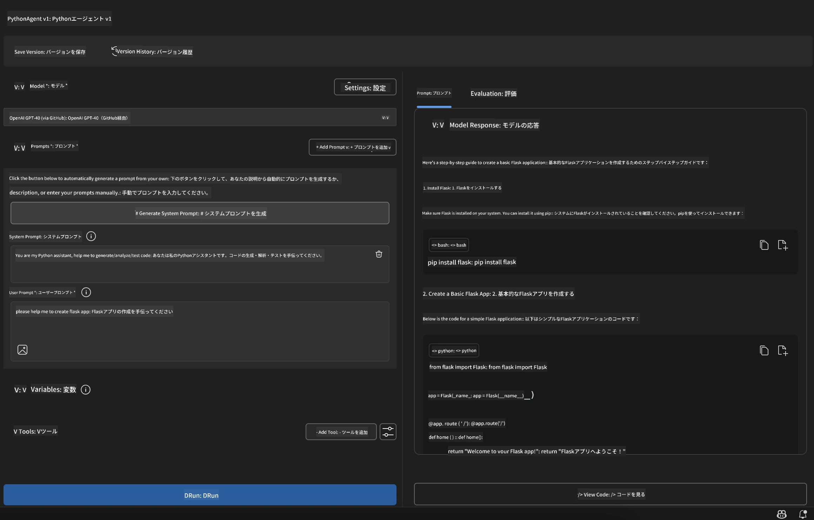

# 🚀 モジュール 1: Microsoft Foundry Toolkit 基礎

[]()
[]()
[]()

## 📋 学習目標

このモジュールの終了時には、以下ができるようになります：
- ✅ Microsoft Foundry Toolkit Extension for VS Code のインストールと設定
- ✅ モデルカタログの操作とさまざまなモデルソースの理解
- ✅ Playground を使ったモデルのテストと実験
- ✅ Agent Builder を使ったカスタム AI エージェントの作成
- ✅ さまざまなプロバイダー間でのモデル性能の比較
- ✅ プロンプトエンジニアリングのベストプラクティスの適用

## 🧠 Microsoft Foundry Toolkit の紹介

**Microsoft Foundry Toolkit Extension for VS Code** は、VS Code を包括的な AI 開発環境に変える Microsoft の旗艦拡張機能です。AI 研究と実用的なアプリケーション開発の橋渡しをし、あらゆるスキルレベルの開発者に生成 AI を提供します。

### 🌟 主要機能

| 機能 | 説明 | ユースケース |
|---------|-------------|----------|
| **🗂️ モデルカタログ** | GitHub、ONNX、OpenAI、Anthropic、Google から100以上のモデルにアクセス | モデルの発見と選択 |
| **🔌 BYOM サポート** | 独自のモデル（ローカル/リモート）を統合 | カスタムモデルの展開 |
| **🎮 インタラクティブ Playgroud** | チャットインターフェースでのリアルタイムモデルテスト | 迅速なプロトタイピングとテスト |
| **📎 マルチモーダル対応** | テキスト、画像、添付ファイルを取り扱い | 複雑な AI アプリケーション |
| **⚡ バッチ処理** | 複数のプロンプトを同時に実行 | 効率的なテストワークフロー |
| **📊 モデル評価** | 組み込み指標（F1、関連性、類似度、一貫性） | パフォーマンス評価 |

### 🎯 Microsoft Foundry Toolkit が重要な理由

- **🚀 開発加速**: アイデアからプロトタイプまで数分で
- **🔄 統一ワークフロー**: 複数の AI プロバイダーを一つのインターフェースで
- **🧪 簡単な実験**: 複雑なセットアップなしでモデルを比較
- **📈 本番対応**: プロトタイプからデプロイへのシームレスな移行

## 🛠️ 前提条件とセットアップ

### 📦 Microsoft Foundry Toolkit Extension のインストール

**ステップ 1: 拡張機能マーケットプレイスにアクセス**
1. Visual Studio Code を開く
2. 拡張機能ビューへ移動 (`Ctrl+Shift+X` または `Cmd+Shift+X`)
3. 「Microsoft Foundry Toolkit」を検索

**ステップ 2: バージョンを選択**
- **🟢 リリース**: 本番利用に推奨
- **🔶 プレリリース**: 最新機能の早期アクセス

**ステップ 3: インストールとアクティベート**



### ✅ 確認チェックリスト
- [ ] VS Code サイドバーに Microsoft Foundry Toolkit アイコンが表示されている
- [ ] 拡張機能が有効かつアクティブになっている
- [ ] 出力パネルにインストールエラーがない

## 🧪 ハンズオン演習 1: GitHub モデルの探索

**🎯 目的**: モデルカタログを習熟し、最初の AI モデルをテスト

### 📊 ステップ 1: モデルカタログのナビゲート

モデルカタログは AI エコシステムへのゲートウェイです。複数のプロバイダーからモデルを集約し、発見と比較を容易にします。

**🔍 ナビゲーションガイド:**

Microsoft Foundry Toolkit サイドバーの **MODELS - Catalog** をクリック



**💡 プロのヒント**: コード生成、クリエイティブライティング、分析など、ユースケースに合った特定の能力を持つモデルを探しましょう。

**⚠️ 注意**: GitHub ホストのモデル（GitHub Models）は無料で使えますが、リクエストとトークンにレート制限があります。GitHub 以外のモデル（Azure AI やその他のエンドポイントでホストされている外部モデル）にアクセスしたい場合は、適切な API キーや認証情報を用意する必要があります。

### 🚀 ステップ 2: 最初のモデルを追加・構成する

<strong>モデル選択戦略</strong>:
- **GPT-4.1**: 複雑な推論と分析に最適
- **Phi-4-mini**: 軽量でシンプルタスク向けに高速応答

**🔧 構成プロセス**:
1. カタログから **OpenAI GPT-4.1** を選択
2. **Add to My Models** をクリック - モデルを使用登録
3. **Try in Playground** を選択してテスト環境を起動
4. モデル初期化を待つ（初回セットアップには少し時間がかかる場合あり）



**⚙️ モデルパラメーターの理解**:
- **Temperature**: 創造性を制御（0 = 決定的、1 = 創造的）
- **Max Tokens**: 最大応答長
- **Top-p**: 応答の多様性を保つ核サンプリング

### 🎯 ステップ 3: Playground インターフェースをマスターする

Playground は AI 実験ラボです。最大限に活用する方法は以下の通りです：

**🎨 プロンプトエンジニアリングのベストプラクティス:**
1. <strong>具体的に記述</strong>: 明確で詳細な指示が良い結果を生む
2. <strong>コンテキストを提供</strong>: 関連する背景情報を含める
3. <strong>例を使う</strong>: モデルに望むことを例示する
4. <strong>反復する</strong>: 初期結果に基づきプロンプトを改善する

**🧪 テストシナリオ:**
```markdown
# Example 1: Code Generation
"Write a Python function that calculates the factorial of a number using recursion. Include error handling and docstrings."

# Example 2: Creative Writing
"Write a professional email to a client explaining a project delay, maintaining a positive tone while being transparent about challenges."

# Example 3: Data Analysis
"Analyze this sales data and provide insights: [paste your data]. Focus on trends, anomalies, and actionable recommendations."
```



### 🏆 チャレンジ課題: モデル性能比較

**🎯 目標**: 同一プロンプトで異なるモデルを比較し、それぞれの強みを理解する

**📋 手順**:
1. **Phi-4-mini** をワークスペースに追加
2. GPT-4.1 と Phi-4-mini に同じプロンプトを使用



3. 応答の品質、速度、正確性を比較
4. 結果セクションに発見を記録



**💡 発見すべき重要ポイント**:
- LLM と SLM を使い分けるタイミング
- コスト対パフォーマンスのトレードオフ
- モデルごとの専門的な能力

## 🤖 ハンズオン演習 2: Agent Builder を使ってカスタムエージェントを構築

**🎯 目的**: 特定タスク・ワークフローに最適化された専門エージェントを作成

### 🏗️ ステップ 1: Agent Builder の理解

Agent Builder は Microsoft Foundry Toolkit の真骨頂。大規模言語モデルの力に加え、カスタム指示やパラメーター、専門知識を組み合わせた目的特化の AI アシスタントを作成できます。

**🧠 エージェント構成要素**:
- <strong>コアモデル</strong>: 基盤となる LLM（GPT-4、Groks、Phi など）
- <strong>システムプロンプト</strong>: エージェントの人格・振る舞いを定義
- <strong>パラメーター</strong>: 最適な動作のための微調整設定
- <strong>ツール統合</strong>: 外部 API や MCP サービスとの連携
- <strong>メモリ</strong>: 会話コンテキストとセッションの持続



### ⚙️ ステップ 2: エージェント構成の詳細

**🎨 効果的なシステムプロンプト作成:**
```markdown
# Template Structure:
## Role Definition
You are a [specific role] with expertise in [domain].

## Capabilities
- List specific abilities
- Define scope of knowledge
- Clarify limitations

## Behavior Guidelines
- Response style (formal, casual, technical)
- Output format preferences
- Error handling approach

## Examples
Provide 2-3 examples of ideal interactions
```

*もちろん、「Generate System Prompt」を使って AI にプロンプト生成や最適化を支援させることも可能です*

**🔧 パラメーター最適化:**
| パラメーター | 推奨範囲 | ユースケース |
|-----------|------------------|----------|
| **Temperature** | 0.1-0.3 | 技術的／事実応答向け |
| **Temperature** | 0.7-0.9 | 創造的／ブレインストーミング向け |
| **Max Tokens** | 500-1000 | 簡潔な応答 |
| **Max Tokens** | 2000-4000 | 詳細な説明 |

### 🐍 ステップ 3: 実践課題 - Python プログラミングエージェント

**🎯 ミッション**: 専門的な Python コーディングアシスタントを作成

**📋 構成手順**:

1. <strong>モデル選択</strong>: **Claude 3.5 Sonnet**（コードに優れる）

2. <strong>システムプロンプト設計</strong>:
```markdown
# Python Programming Expert Agent

## Role
You are a senior Python developer with 10+ years of experience. You excel at writing clean, efficient, and well-documented Python code.

## Capabilities
- Write production-ready Python code
- Debug complex issues
- Explain code concepts clearly
- Suggest best practices and optimizations
- Provide complete working examples

## Response Format
- Always include docstrings
- Add inline comments for complex logic
- Suggest testing approaches
- Mention relevant libraries when applicable

## Code Quality Standards
- Follow PEP 8 style guidelines
- Use type hints where appropriate
- Handle exceptions gracefully
- Write readable, maintainable code
```

3. <strong>パラメーター構成</strong>:
   - Temperature: 0.2（安定かつ信頼できるコード向け）
   - Max Tokens: 2000（詳細な説明）
   - Top-p: 0.9（バランスの良い創造性）



### 🧪 ステップ 4: Python エージェントのテスト

**テストシナリオ:**
1. <strong>基本機能</strong>: 「素数を見つける関数を作成」
2. <strong>複雑なアルゴリズム</strong>: 「挿入、削除、検索メソッドを持つ二分探索木を実装」
3. <strong>実世界の問題</strong>: 「レート制限とリトライを扱うウェブスクレイパーを構築」
4. <strong>デバッグ</strong>: 「このコードを修正してください [バグのあるコードを貼り付け]」

**🏆 合格基準:**
- ✅ エラーなくコードが動作する
- ✅ 適切なドキュメントが含まれている
- ✅ Python のベストプラクティスに従っている
- ✅ 明確な説明を提供している
- ✅ 改善案を提示している

## 🎓 モジュール 1 総括と次のステップ

### 📊 知識チェック

理解度を確認しましょう：
- [ ] カタログ内のモデルの違いを説明できますか？
- [ ] カスタムエージェントを作成しテストできましたか？
- [ ] さまざまなユースケースに応じたパラメーター最適化が理解できていますか？
- [ ] 効果的なシステムプロンプトを設計できますか？

### 📚 追加リソース

- **Microsoft Foundry Toolkit ドキュメント**: [公式 Microsoft Docs](https://github.com/microsoft/vscode-ai-toolkit)
- <strong>プロンプトエンジニアリングガイド</strong>: [ベストプラクティス](https://platform.openai.com/docs/guides/prompt-engineering)
- **Microsoft Foundry Toolkit のモデル**: [開発中のモデル](https://github.com/microsoft/vscode-ai-toolkit/blob/main/doc/models.md)

**🎉 おめでとうございます！** Microsoft Foundry Toolkit の基礎を習得し、より高度な AI アプリケーションの構築準備ができました！

### 🔜 次のモジュールへ進む

さらに高度な機能に挑戦したいですか？**[モジュール2: Microsoft Foundry Toolkit Fundamentals を使用した MCP](../lab2/README.md)** に進んで、以下を学びます：
- エージェントを Model Context Protocol (MCP) を使って外部ツールに接続する方法
- Playwright を使ったブラウザ自動化エージェントの構築
- MCP サーバーを Microsoft Foundry Toolkit エージェントと統合
- 外部データと機能を利用してエージェントを強化

---

<!-- CO-OP TRANSLATOR DISCLAIMER START -->
**免責事項**：
本書類は AI 翻訳サービス [Co-op Translator](https://github.com/Azure/co-op-translator) を使用して翻訳されています。正確性を期していますが、自動翻訳には誤りや不正確な部分が含まれる可能性があることをご承知おきください。原文の原語版が正式な情報源とみなされるべきです。重要な情報については、専門の人間による翻訳を推奨します。本翻訳の利用により生じたいかなる誤解や解釈違いについても、当方は責任を負いかねます。
<!-- CO-OP TRANSLATOR DISCLAIMER END -->
