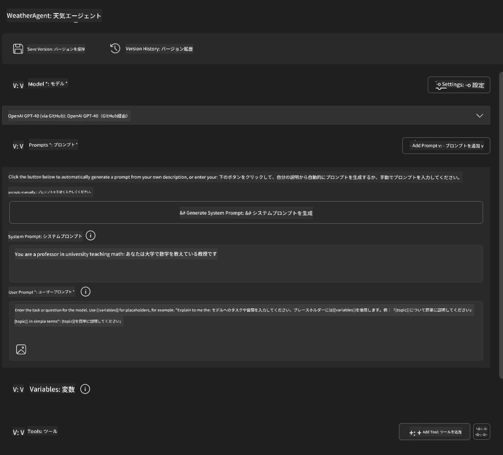
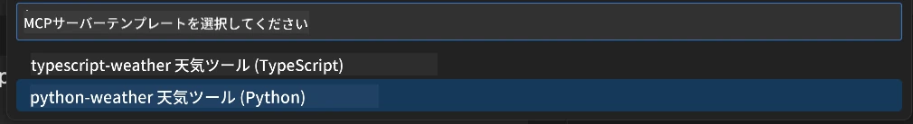
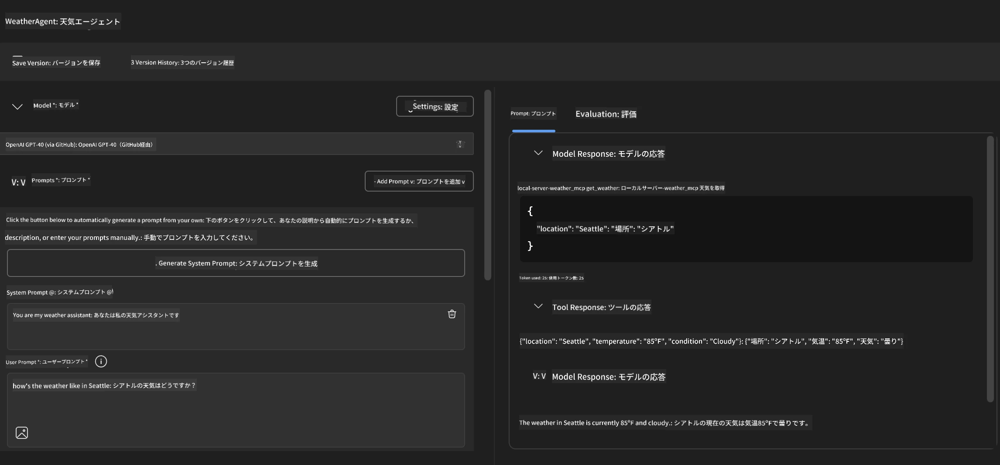
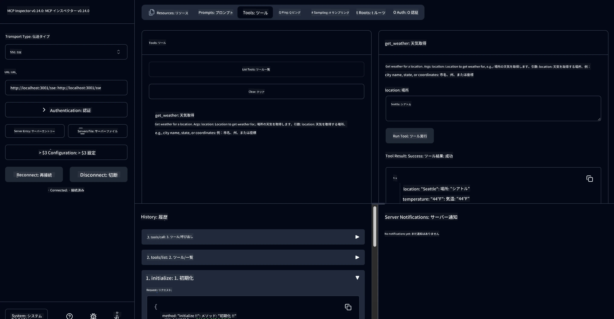

# 🔧 モジュール 3: Microsoft Foundry Toolkit を使った高度な MCP 開発

> [!NOTE]
> このラボにおける Inspector の URL はレガシーな `/sse` エンドポイントを使用し、ピン留めされた MCP SDK `1.9.3` および Inspector `0.14.0` の依存関係を対象としています。これらは最新の `2026-07-28` Streamable HTTP の例ではありません。
> 
> 


## 🎯 学習目標

このラボを終える頃には、以下ができるようになっています：

- ✅ Microsoft Foundry Toolkit を使ったカスタム MCP サーバーの作成
- ✅ 最新 MCP Python SDK (v1.9.3) の設定と利用
- ✅ デバッグ用途の MCP Inspector のセットアップと活用
- ✅ Agent Builder と Inspector 環境での MCP サーバーのデバッグ
- ✅ 高度な MCP サーバー開発ワークフローの理解

## 📋 前提条件

- ラボ 2 (MCP 基礎) の完了
- Microsoft Foundry Toolkit 拡張機能がインストールされた VS Code
- Python 3.10+ の環境
- Inspector セットアップのための Node.js と npm

## 🏗️ 作成するもの

このラボでは、**Weather MCP Server** を作成します。以下を実演します：
- カスタム MCP サーバーの実装
- Microsoft Foundry Toolkit Agent Builder との統合
- プロフェッショナルなデバッグワークフロー
- 最新 MCP SDK の利用パターン

---

## 🔧 コアコンポーネント概要

### 🐍 MCP Python SDK
Model Context Protocol の Python SDK はカスタム MCP サーバーを構築する基礎を提供します。バージョン 1.9.3 を使用し、デバッグ機能が強化されています。

### 🔍 MCP Inspector
強力なデバッグツールで以下を提供します：
- リアルタイムのサーバーモニタリング
- ツール実行の可視化
- ネットワークリクエスト／レスポンスの検査
- 対話的なテスト環境

---

## 📖 ステップバイステップの実装

### ステップ 1: Agent Builder で WeatherAgent を作成する

1. **Microsoft Foundry Toolkit 拡張機能を使って VS Code で Agent Builder を起動**
2. **次の構成で新しいエージェントを作成：**
   - エージェント名: `WeatherAgent`



### ステップ 2: MCP サーバープロジェクトの初期化

1. **Agent Builder の Tools → Add Tool に移動**
2. **利用可能なオプションから「MCP Server」を選択**
3. **「Create A new MCP Server」を選択**
4. **`python-weather` テンプレートを選択**
5. **サーバー名を `weather_mcp` に設定**



### ステップ 3: プロジェクトを開いて確認

1. **生成されたプロジェクトを VS Code で開く**
2. **プロジェクト構造をレビュー：**
   ```
   weather_mcp/
   ├── src/
   │   ├── __init__.py
   │   └── server.py
   ├── inspector/
   │   ├── package.json
   │   └── package-lock.json
   ├── .vscode/
   │   ├── launch.json
   │   └── tasks.json
   ├── pyproject.toml
   └── README.md
   ```

### ステップ 4: 最新の MCP SDK にアップグレード

> **🔍 なぜアップグレード？** 最新 MCP SDK (v1.9.3) と Inspector サービス (0.14.0) を利用して、強化された機能とより良いデバッグが可能になるためです。

#### 4a. Python 依存関係の更新

**`pyproject.toml` を編集：** [./code/weather_mcp/pyproject.toml](../../../../10-StreamliningAIWorkflowsBuildingAnMCPServerWithAIToolkit/lab3/code/weather_mcp/pyproject.toml) を更新


#### 4b. Inspector の設定を更新

**`inspector/package.json` を編集：** [./code/weather_mcp/inspector/package.json](../../../../10-StreamliningAIWorkflowsBuildingAnMCPServerWithAIToolkit/lab3/code/weather_mcp/inspector/package.json) を更新

#### 4c. Inspector の依存関係を更新

**`inspector/package-lock.json` を編集：** [./code/weather_mcp/inspector/package-lock.json](../../../../10-StreamliningAIWorkflowsBuildingAnMCPServerWithAIToolkit/lab3/code/weather_mcp/inspector/package-lock.json) を更新

> **📝 注意:** このファイルには広範な依存関係定義が含まれます。以下は主要な構造です。完全な内容は依存関係解決に必須です。


> **⚡ フルパッケージロック:** 完全な package-lock.json は約 3000 行の依存関係定義を含みます。上記は重要構造の抜粋です。完全な依存関係解決にファイルを使用してください。

### ステップ 5: VS Code のデバッグ設定

*注意: 指定されたパスのファイルをコピーし、対応するローカルファイルを置換してください*

#### 5a. 起動構成を更新

**`.vscode/launch.json` を編集：**

```json
{
  "version": "0.2.0",
  "configurations": [
    {
      "name": "Attach to Local MCP",
      "type": "debugpy",
      "request": "attach",
      "connect": {
        "host": "localhost",
        "port": 5678
      },
      "presentation": {
        "hidden": true
      },
      "internalConsoleOptions": "neverOpen",
      "postDebugTask": "Terminate All Tasks"
    },
    {
      "name": "Launch Inspector (Edge)",
      "type": "msedge",
      "request": "launch",
      "url": "http://localhost:6274?timeout=60000&serverUrl=http://localhost:3001/sse#tools",
      "cascadeTerminateToConfigurations": [
        "Attach to Local MCP"
      ],
      "presentation": {
        "hidden": true
      },
      "internalConsoleOptions": "neverOpen"
    },
    {
      "name": "Launch Inspector (Chrome)",
      "type": "chrome",
      "request": "launch",
      "url": "http://localhost:6274?timeout=60000&serverUrl=http://localhost:3001/sse#tools",
      "cascadeTerminateToConfigurations": [
        "Attach to Local MCP"
      ],
      "presentation": {
        "hidden": true
      },
      "internalConsoleOptions": "neverOpen"
    }
  ],
  "compounds": [
    {
      "name": "Debug in Agent Builder",
      "configurations": [
        "Attach to Local MCP"
      ],
      "preLaunchTask": "Open Agent Builder",
    },
    {
      "name": "Debug in Inspector (Edge)",
      "configurations": [
        "Launch Inspector (Edge)",
        "Attach to Local MCP"
      ],
      "preLaunchTask": "Start MCP Inspector",
      "stopAll": true
    },
    {
      "name": "Debug in Inspector (Chrome)",
      "configurations": [
        "Launch Inspector (Chrome)",
        "Attach to Local MCP"
      ],
      "preLaunchTask": "Start MCP Inspector",
      "stopAll": true
    }
  ]
}
```

**`.vscode/tasks.json` を編集：**

```
{
  "version": "2.0.0",
  "tasks": [
    {
      "label": "Start MCP Server",
      "type": "shell",
      "command": "python -m debugpy --listen 127.0.0.1:5678 src/__init__.py sse",
      "isBackground": true,
      "options": {
        "cwd": "${workspaceFolder}",
        "env": {
          "PORT": "3001"
        }
      },
      "problemMatcher": {
        "pattern": [
          {
            "regexp": "^.*$",
            "file": 0,
            "location": 1,
            "message": 2
          }
        ],
        "background": {
          "activeOnStart": true,
          "beginsPattern": ".*",
          "endsPattern": "Application startup complete|running"
        }
      }
    },
    {
      "label": "Start MCP Inspector",
      "type": "shell",
      "command": "npm run dev:inspector",
      "isBackground": true,
      "options": {
        "cwd": "${workspaceFolder}/inspector",
        "env": {
          "CLIENT_PORT": "6274",
          "SERVER_PORT": "6277",
        }
      },
      "problemMatcher": {
        "pattern": [
          {
            "regexp": "^.*$",
            "file": 0,
            "location": 1,
            "message": 2
          }
        ],
        "background": {
          "activeOnStart": true,
          "beginsPattern": "Starting MCP inspector",
          "endsPattern": "Proxy server listening on port"
        }
      },
      "dependsOn": [
        "Start MCP Server"
      ]
    },
    {
      "label": "Open Agent Builder",
      "type": "shell",
      "command": "echo ${input:openAgentBuilder}",
      "presentation": {
        "reveal": "never"
      },
      "dependsOn": [
        "Start MCP Server"
      ],
    },
    {
      "label": "Terminate All Tasks",
      "command": "echo ${input:terminate}",
      "type": "shell",
      "problemMatcher": []
    }
  ],
  "inputs": [
    {
      "id": "openAgentBuilder",
      "type": "command",
      "command": "ai-mlstudio.agentBuilder",
      "args": {
        "initialMCPs": [ "local-server-weather_mcp" ],
        "triggeredFrom": "vsc-tasks"
      }
    },
    {
      "id": "terminate",
      "type": "command",
      "command": "workbench.action.tasks.terminate",
      "args": "terminateAll"
    }
  ]
}
```


---

## 🚀 MCP サーバーの起動とテスト

### ステップ 6: 依存関係のインストール

設定変更後、以下コマンドを実行してください：

**Python 依存関係のインストール：**
```bash
uv sync
```

**Inspector 依存関係のインストール：**
```bash
cd inspector
npm install
```

### ステップ 7: Agent Builder でデバッグ

1. **F5 を押すか、「Debug in Agent Builder」構成を使用**
2. <strong>デバッグパネルからコンパウンド構成を選択</strong>
3. **サーバー起動と Agent Builder が開くのを待つ**
4. **weather MCP サーバーを自然言語クエリでテスト**

このような入力プロンプト

SYSTEM_PROMPT

```
You are my weather assistant
```

USER_PROMPT

```
How's the weather like in Seattle
```



### ステップ 8: MCP Inspector でデバッグ

1. **「Debug in Inspector」構成を使用（Edge または Chrome）**
2. **Inspector インターフェースを `http://localhost:6274` で開く**
3. **対話的なテスト環境を探索：**
   - 利用可能なツールの表示
   - ツール実行のテスト
   - ネットワークリクエストの監視
   - サーバーレスポンスのデバッグ



---

## 🎯 主要な学習成果

このラボを完了することで、以下を達成しました：

- [x] **Microsoft Foundry Toolkit テンプレートを使ったカスタム MCP サーバー作成**
- [x] **最新の MCP SDK (v1.9.3) へのアップグレードで機能強化**
- [x] **Agent Builder と Inspector の両方のプロフェッショナルなデバッグワークフロー設定**
- [x] **対話的サーバーテストのための MCP Inspector のセットアップ**
- [x] **MCP 開発向け VS Code デバッグ構成の習得**

## 🔧 探索した高度な機能

| 機能 | 説明 | ユースケース |
|---------|-------------|----------|
| **MCP Python SDK v1.9.3** | 最新プロトコル実装 | モダンサーバー開発 |
| **MCP Inspector 0.14.0** | 対話型デバッグツール | リアルタイムサーバーテスト |
| **VS Code デバッグ** | 統合開発環境 | プロフェッショナルなデバッグワークフロー |
| **Agent Builder 統合** | Microsoft Foundry Toolkit 直接連携 | エンドツーエンドのエージェントテスト |

## 📚 追加リソース

- [MCP Python SDK ドキュメント](https://modelcontextprotocol.io/docs/sdk/python)
- [Microsoft Foundry Toolkit 拡張機能ガイド](https://code.visualstudio.com/docs/ai/ai-toolkit)
- [VS Code デバッグドキュメント](https://code.visualstudio.com/docs/editor/debugging)
- [Model Context Protocol 仕様](https://modelcontextprotocol.io/docs/concepts/architecture)

---

**🎉 おめでとうございます！** ラボ 3 を無事完了し、プロフェッショナルな開発ワークフローでカスタム MCP サーバーの作成、デバッグ、展開ができるようになりました。

### 🔜 次のモジュールへ進む

実践的な開発ワークフローに MCP スキルを応用する準備はできましたか？続けて **[モジュール 4: 実践的 MCP 開発 - カスタム GitHub クローンサーバー](../lab4/README.md)** へ進みましょう。ここでは：
- GitHub リポジトリ操作を自動化する実用的な MCP サーバー構築
- MCP を使った GitHub リポジトリのクローン機能実装
- VS Code と GitHub Copilot Agent Mode との統合
- 実運用環境でのカスタム MCP サーバーのテストと展開
- 開発者向けの実用的なワークフロー自動化を学習

---

<!-- CO-OP TRANSLATOR DISCLAIMER START -->
**免責事項**：
本書類は AI 翻訳サービス [Co-op Translator](https://github.com/Azure/co-op-translator) を使用して翻訳されています。正確性を期していますが、自動翻訳には誤りや不正確な部分が含まれる可能性があることをご承知おきください。原文の原語版が正式な情報源とみなされるべきです。重要な情報については、専門の人間による翻訳を推奨します。本翻訳の利用により生じたいかなる誤解や解釈違いについても、当方は責任を負いかねます。
<!-- CO-OP TRANSLATOR DISCLAIMER END -->