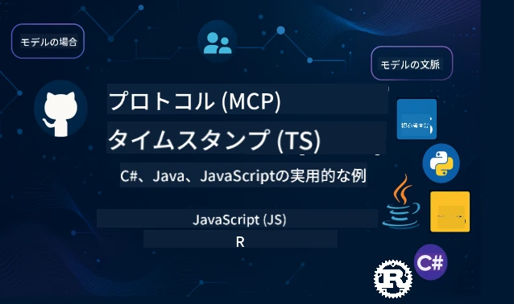

 

[](https://GitHub.com/microsoft/mcp-for-beginners/graphs/contributors)
[](https://GitHub.com/microsoft/mcp-for-beginners/issues)
[](https://GitHub.com/microsoft/mcp-for-beginners/pulls)
[](http://makeapullrequest.com)

[](https://GitHub.com/microsoft/mcp-for-beginners/watchers)
[](https://GitHub.com/microsoft/mcp-for-beginners/fork)
[](https://GitHub.com/microsoft/mcp-for-beginners/stargazers)


[](https://discord.gg/nTYy5BXMWG)

これらのリソースを使い始めるには、以下の手順に従ってください：
1. **リポジトリをフォークする**: [](https://GitHub.com/microsoft/mcp-for-beginners/fork) をクリック
2. **リポジトリをクローンする**: `git clone https://github.com/microsoft/mcp-for-beginners.git`
3. **[](https://discord.gg/nTYy5BXMWG) に参加する**


### 🌐 多言語サポート

#### GitHub Actionsでサポート（自動化＆常に最新）

<!-- CO-OP TRANSLATOR LANGUAGES TABLE START -->
[Arabic](../ar/README.md) | [Bengali](../bn/README.md) | [Bulgarian](../bg/README.md) | [Burmese (Myanmar)](../my/README.md) | [Chinese (Simplified)](../zh-CN/README.md) | [Chinese (Traditional, Hong Kong)](../zh-HK/README.md) | [Chinese (Traditional, Macau)](../zh-MO/README.md) | [Chinese (Traditional, Taiwan)](../zh-TW/README.md) | [Croatian](../hr/README.md) | [Czech](../cs/README.md) | [Danish](../da/README.md) | [Dutch](../nl/README.md) | [Estonian](../et/README.md) | [Finnish](../fi/README.md) | [French](../fr/README.md) | [German](../de/README.md) | [Greek](../el/README.md) | [Hebrew](../he/README.md) | [Hindi](../hi/README.md) | [Hungarian](../hu/README.md) | [Indonesian](../id/README.md) | [Italian](../it/README.md) | [Japanese](./README.md) | [Kannada](../kn/README.md) | [Korean](../ko/README.md) | [Lithuanian](../lt/README.md) | [Malay](../ms/README.md) | [Malayalam](../ml/README.md) | [Marathi](../mr/README.md) | [Nepali](../ne/README.md) | [Nigerian Pidgin](../pcm/README.md) | [Norwegian](../no/README.md) | [Persian (Farsi)](../fa/README.md) | [Polish](../pl/README.md) | [Portuguese (Brazil)](../pt-BR/README.md) | [Portuguese (Portugal)](../pt-PT/README.md) | [Punjabi (Gurmukhi)](../pa/README.md) | [Romanian](../ro/README.md) | [Russian](../ru/README.md) | [Serbian (Cyrillic)](../sr/README.md) | [Slovak](../sk/README.md) | [Slovenian](../sl/README.md) | [Spanish](../es/README.md) | [Swahili](../sw/README.md) | [Swedish](../sv/README.md) | [Tagalog (Filipino)](../tl/README.md) | [Tamil](../ta/README.md) | [Telugu](../te/README.md) | [Thai](../th/README.md) | [Turkish](../tr/README.md) | [Ukrainian](../uk/README.md) | [Urdu](../ur/README.md) | [Vietnamese](../vi/README.md)

> **ローカルでクローンすることを好みますか？**

> このリポジトリには50以上の言語の翻訳が含まれており、ダウンロードサイズが大幅に増加します。翻訳なしでクローンするには、スパースチェックアウトを使用してください：
> ```bash
> git clone --filter=blob:none --sparse https://github.com/microsoft/mcp-for-beginners.git
> cd mcp-for-beginners
> git sparse-checkout set --no-cone '/*' '!translations' '!translated_images'
> ```
> これにより、コースを完了するために必要なすべてをより高速にダウンロードできます。
<!-- CO-OP TRANSLATOR LANGUAGES TABLE END -->

# 🚀 初心者のための Model Context Protocol (MCP) カリキュラム

## **C#、Java、JavaScript、Rust、Python、TypeScript での実践的なコード例を使って MCP を学ぼう**

## 🧠 Model Context Protocol カリキュラムの概要
Model Context Protocol の世界へようこそ！AIアプリケーションがさまざまなツールやサービスとどのように連携しているのか疑問に思ったことがあれば、開発者がインテリジェントシステムを構築する方法を変える優雅な解決策をこれから発見することになります。

MCPはAIアプリケーションのためのユニバーサル翻訳者のようなものです — USBポートがどんなデバイスでもコンピューターに接続できるのと同じように、MCPはAIモデルがどんなツールやサービスとも標準化された方法で接続できるようにします。初めてチャットボットを作るときも、複雑なAIワークフローに取り組むときも、MCPを理解することでより多機能で柔軟なアプリケーションを作る力を手に入れられます。

このカリキュラムはあなたの学習の旅を大切に設計されています。既に理解している簡単な概念から始めて、好きなプログラミング言語での実践を通じて徐々に専門知識を深めます。すべてのステップにおいて明確な説明、実践的な例、そして励ましをたくさん用意しています。

この旅を終える頃には、自分でMCPサーバーを構築し、人気のAIプラットフォームと統合し、この技術がAI開発の未来をいかに形作っているか理解できる自信がついているでしょう。さあ、このエキサイティングな冒険を一緒に始めましょう！

### 公式ドキュメントと仕様

これらのリソースは理解が進むにつれてより価値が増しますが、すぐにすべてを読む必要はありません。興味のある部分から始めてください！
- 📘 [MCP ドキュメント](https://modelcontextprotocol.io/) – ステップバイステップのチュートリアルやユーザーガイドが揃っています。初心者を意識して書かれており、自分のペースでわかりやすく学べます。
- 📜 [MCP 仕様書](https://modelcontextprotocol.io/docs/) – 包括的なリファレンスマニュアルです。カリキュラムを進めながら必要に応じてここに戻り、詳細な情報や高度な機能を調べることができます。
- 📜 [オリジナル MCP 仕様書](https://modelcontextprotocol.io/specification/versioning) – 高度な実装に役立つ追加の技術詳細を含みます。必要なときに参照すればよく、最初は気にしなくて大丈夫です。
- 🧑‍💻 [MCP GitHubリポジトリ](https://github.com/modelcontextprotocol) – 複数のプログラミング言語でのSDK、ツール、コードサンプルが揃っています。実践的な例やすぐに使えるコンポーネントの宝庫です。
- 🌐 [MCP コミュニティ](https://github.com/orgs/modelcontextprotocol/discussions) – MCPについて学ぶ仲間や経験豊かな開発者と議論できる場です。質問を歓迎し、知識を共有するサポートコミュニティです。

## 学習目標

このカリキュラムを終える頃には、新しい能力について自信とワクワクを感じているでしょう。達成できることは次の通りです：

• **MCPの基本を理解する**: Model Context Protocolとは何か、なぜAIアプリケーションの連携を変革しているのか、わかりやすい例や比喩を通じて納得できます。

• **初めてのMCPサーバーを構築する**: 好きなプログラミング言語で動作するMCPサーバーを作成し、簡単な例から段階的にスキルを伸ばします。

• **AIモデルと実際のツールを接続する**: AIモデルと実際のサービスの橋渡しを学び、アプリケーションに強力な新機能を追加します。

• **セキュリティのベストプラクティスを実装する**: MCP実装を安全に保つための方法を理解し、アプリケーションとユーザーを守ります。

• **自信を持ってデプロイする**: 開発から本番環境への展開までの実践的な戦略を知り、確実に運用可能にします。

• **MCPコミュニティに参加する**: AIアプリ開発の未来を形作るコミュニティの一員となり、仲間と共に成長していきます。

## 必要な基礎知識

MCPの具体的な話に入る前に、基礎となる概念に慣れておきましょう。不安なくても大丈夫です。必要なことはすべて説明していきます！

### プロトコルの理解（基盤）

プロトコルとは会話のルールのようなものです。友達に電話をかけるとき、お互いに「こんにちは」「さようなら」を言って、話す順番を守りますよね。コンピュータプログラムも効果的に通信するために似たルールが必要です。

MCPはプロトコルであり、AIモデルとツールやサービスが効率よく「対話」するための合意されたルールセットです。人間の会話にルールがあるように、MCPがあればAIアプリ間の通信もよりスムーズで強力になります。

### クライアント・サーバー関係（プログラムの連携）

あなたは日々クライアント・サーバーの関係を使っています。ウェブブラウザ（クライアント）でウェブサイトにアクセスすると、ウェブサーバーからページが送られてきます。ブラウザは情報の要求方法を知り、サーバーは応答します。

MCPでも似た関係があります。AIモデルが情報やアクションをリクエストするクライアント役で、MCPサーバーがその能力を提供するサーバー役です。AIが特定のタスクをお願いできる助っ人のような存在です。

### 標準化の重要性（連携を可能にする）

もし車のメーカーごとに異なる形の給油口だったら、車ごとに違うアダプターが必要になるでしょう。標準化とは、共通のやり方に合意し、スムーズに動くようにすることです。

MCPはAIアプリケーションのためにこの標準化を提供します。AIモデルごとにそれぞれのツールと連携するカスタムコードを書かなくて済みます。1回ツールを作れば、多くのAIシステムで動くようになります。

## 🧭 あなたの学習パス概要

MCPの旅は自信とスキルを段階的に築くように注意深く構成されています。各フェーズで新しい概念が紹介され、学んだことが強化されます。

### 🌱 基礎フェーズ：基本の理解（モジュール0-2）

ここから冒険が始まります！身近な例えやシンプルな例を使ってMCPの概念を紹介します。MCPが何か、その存在意義、AI開発の世界の中での位置づけを理解します。

• **モジュール0 - MCP入門**: MCPとは何か、なぜ現代のAIアプリに重要なのかを探ります。実際のMCP活用例を見て、開発者が直面する一般的な課題をどのように解決するか理解します。

• **モジュール1 - 基本概念の説明**: MCPの基本要素を学びます。たくさんの比喩や視覚的な例を使い、自然でわかりやすい理解を目指します。

• **モジュール2 - MCPのセキュリティ**: セキュリティは難しそうに聞こえますが、MCPの組み込みの安全機能と最初からアプリを守るベストプラクティスを学びます。

### 🔨 構築フェーズ：初めての実装を作る（モジュール3）

ここからが本当の楽しみです！実際のMCPサーバーとクライアントを作る実践経験を積みます。心配しないでください、シンプルなところから始まり、一歩ずつ丁寧に案内します。

このモジュールにはあなたの好みのプログラミング言語で練習できるハンズオンガイドが複数含まれています。最初のサーバーを作り、接続するクライアントを作り、VS Codeなどの人気開発ツールとも連携します。
各ガイドには、完全なコード例、トラブルシューティングのヒント、および特定の設計選択を行う理由の説明が含まれています。このフェーズの終了時には、自分の誇りになる動作するMCP実装を手に入れることができます！

### 🚀 成長フェーズ：高度な概念と実践的応用（モジュール4-5）

基本を習得したら、より高度なMCP機能を探求する準備が整います。実践的な実装戦略、デバッグ技術、マルチモーダルAI統合のような高度なトピックを取り上げます。

また、本番利用に向けてMCP実装のスケールアップ方法やAzureなどのクラウドプラットフォームとの統合についても学びます。これらのモジュールは、現実の要求に対応可能なMCPソリューションの構築に備えるものです。

### 🌟 マスタリーフェーズ：コミュニティと専門分野（モジュール6-11）

最終フェーズは、MCPコミュニティへの参加と自分が最も興味のある分野への専門化に焦点を当てています。オープンソースのMCPプロジェクトへの貢献、高度な認証パターンの実装、包括的なデータベース統合ソリューションの構築を学びます。

特にモジュール11は完全な13ラボの実践的学習パスで、PostgreSQL統合による本番対応のMCPサーバー構築方法を教えます。これまで学んだことを総まとめする最終プロジェクトのようなものです！

### 📚 完全カリキュラム構造

| Module | Topic | Description | Link |
|--------|-------|-------------|------|
| **Module 1-3: Fundamentals** | | | |
| 00 | MCP入門 | Model Context Protocolの概要とAIパイプラインにおける重要性 | [詳細](./00-Introduction/README.md) |
| 01 | 核心概念の解説 | MCPの核心概念の詳しい探求 | [詳細](./01-CoreConcepts/README.md) |
| 02 | MCPのセキュリティ | セキュリティの脅威とベストプラクティス | [詳細](./02-Security/README.md) |
| 03 | MCPの開始方法 | 環境セットアップ、基本的なサーバー/クライアント、統合 | [詳細](./03-GettingStarted/README.md) |
| **Module 3: 最初のサーバー＆クライアント構築** | | | |
| 3.1 | 最初のサーバー | 初めてのMCPサーバーを作成する | [ガイド](./03-GettingStarted/01-first-server/README.md) |
| 3.2 | 最初のクライアント | 基本的なMCPクライアントを開発する | [ガイド](./03-GettingStarted/02-client/README.md) |
| 3.3 | LLMを用いたクライアント | 大規模言語モデルを統合する | [ガイド](./03-GettingStarted/03-llm-client/README.md) |
| 3.4 | VS Code統合 | VS CodeでMCPサーバーを利用する | [ガイド](./03-GettingStarted/04-vscode/README.md) |
| 3.5 | stdioサーバー | stdioトランスポートを使ったサーバー作成 | [ガイド](./03-GettingStarted/05-stdio-server/README.md) |
| 3.6 | HTTPストリーミング | MCPでHTTPストリーミングを実装する | [ガイド](./03-GettingStarted/06-http-streaming/README.md) |
| 3.7 | AIツールキット | MCPでAIツールキットを使用する | [ガイド](./03-GettingStarted/07-aitk/README.md) |
| 3.8 | テスト | MCPサーバー実装のテスト | [ガイド](./03-GettingStarted/08-testing/README.md) |
| 3.9 | デプロイメント | MCPサーバーを本番環境にデプロイする | [ガイド](./03-GettingStarted/09-deployment/README.md) |
| 3.10 | 上級サーバー利用 | 高度な機能利用と改善されたアーキテクチャのための上級サーバー利用 | [ガイド](./03-GettingStarted/10-advanced/README.md) |
| 3.11 | シンプル認証 | 基本の認証とRBACを示す章 | [ガイド](./03-GettingStarted/11-simple-auth/README.md) |
| **Module 4-5: 実践＆高度な内容** | | | |
| 04 | 実践的実装 | SDK、デバッグ、テスト、再利用可能なプロンプトテンプレート | [詳細](./04-PracticalImplementation/README.md) |
| 05 | MCPの高度なトピック | マルチモーダルAI、スケーリング、企業利用 | [詳細](./05-AdvancedTopics/README.md) |
| 5.1 | Azure統合 | AzureとのMCP統合 | [ガイド](./05-AdvancedTopics/mcp-integration/README.md) |
| 5.2 | マルチモーダリティ | 複数モダリティの利用 | [ガイド](./05-AdvancedTopics/mcp-multi-modality/README.md) |
| 5.3 | OAuth2デモ | OAuth2認証の実装 | [ガイド](./05-AdvancedTopics/mcp-oauth2-demo/README.md) |
| 5.4 | ルートコンテキスト | ルートコンテキストの理解と実装 | [ガイド](./05-AdvancedTopics/mcp-root-contexts/README.md) |
| 5.5 | ルーティング | MCPのルーティング戦略 | [ガイド](./05-AdvancedTopics/mcp-routing/README.md) |
| 5.6 | サンプリング | MCPのサンプリング技術 | [ガイド](./05-AdvancedTopics/mcp-sampling/README.md) |
| 5.7 | スケーリング | MCP実装のスケールアップ | [ガイド](./05-AdvancedTopics/mcp-scaling/README.md) |
| 5.8 | セキュリティ | 高度なセキュリティ考慮事項 | [ガイド](./05-AdvancedTopics/mcp-security/README.md) |
| 5.9 | ウェブ検索 | ウェブ検索機能の実装 | [ガイド](./05-AdvancedTopics/web-search-mcp/README.md) |
| 5.10 | リアルタイムストリーミング | リアルタイムストリーミング機能の構築 | [ガイド](./05-AdvancedTopics/mcp-realtimestreaming/README.md) |
| 5.11 | リアルタイム検索 | リアルタイム検索の実装 | [ガイド](./05-AdvancedTopics/mcp-realtimesearch/README.md) |
| 5.12 | Entra ID認証 | Microsoft Entra IDによる認証 | [ガイド](./05-AdvancedTopics/mcp-security-entra/README.md) |
| 5.13 | Foundry統合 | Azure AI Foundryとの統合 | [ガイド](./05-AdvancedTopics/mcp-foundry-agent-integration/README.md) |
| 5.14 | コンテキストエンジニアリング | 効果的なコンテキストエンジニアリング技術 | [ガイド](./05-AdvancedTopics/mcp-contextengineering/README.md) |
| 5.15 | MCPカスタムトランスポート | カスタムトランスポート実装 | [ガイド](./05-AdvancedTopics/mcp-transport/README.md) |
| **Module 6-10: コミュニティ＆ベストプラクティス** | | | |
| 06 | コミュニティ貢献 | MCPエコシステムへの貢献方法 | [ガイド](./06-CommunityContributions/README.md) |
| 07 | 早期導入の洞察 | 実際の導入ストーリー | [ガイド](./07-LessonsFromEarlyAdoption/README.md) |
| 08 | MCPのベストプラクティス | 性能、フォールトトレランス、レジリエンス | [ガイド](./08-BestPractices/README.md) |
| 09 | MCPケーススタディ | 実践的な実装例 | [ガイド](./09-CaseStudy/README.md) |
| 10 | ハンズオンワークショップ | AIツールキットを用いたMCPサーバー構築 | [ラボ](./10-StreamliningAIWorkflowsBuildingAnMCPServerWithAIToolkit/README.md) |
| **Module 11: MCPサーバーハンズオンラボ** | | | |
| 11 | MCPサーバーデータベース統合 | PostgreSQL統合のための13ラボ包括的な実践学習パス | [ラボ](./11-MCPServerHandsOnLabs/README.md) |
| 11.1 | はじめに | データベース統合と小売分析ユースケースのMCP概要 | [ラボ00](./11-MCPServerHandsOnLabs/00-Introduction/README.md) |
| 11.2 | コアアーキテクチャ | MCPサーバーアーキテクチャ、データベース層、セキュリティパターンの理解 | [ラボ01](./11-MCPServerHandsOnLabs/01-Architecture/README.md) |
| 11.3 | セキュリティ＆マルチテナンシー | 行レベルセキュリティ、認証、マルチテナントデータアクセス | [ラボ02](./11-MCPServerHandsOnLabs/02-Security/README.md) |
| 11.4 | 環境セットアップ | 開発環境の構築、Docker、Azureリソースの準備 | [ラボ03](./11-MCPServerHandsOnLabs/03-Setup/README.md) |
| 11.5 | データベース設計 | PostgreSQLセットアップ、小売スキーマ設計、サンプルデータ | [ラボ04](./11-MCPServerHandsOnLabs/04-Database/README.md) |
| 11.6 | MCPサーバー実装 | データベース統合版FastMCPサーバー構築 | [ラボ05](./11-MCPServerHandsOnLabs/05-MCP-Server/README.md) |
| 11.7 | ツール開発 | データベースクエリツールとスキーマイントロスペクション作成 | [ラボ06](./11-MCPServerHandsOnLabs/06-Tools/README.md) |
| 11.8 | セマンティック検索 | Azure OpenAIとpgvectorによるベクトル埋め込みの実装 | [ラボ07](./11-MCPServerHandsOnLabs/07-Semantic-Search/README.md) |
| 11.9 | テスト＆デバッグ | テスト戦略、デバッグツール、検証方法 | [ラボ08](./11-MCPServerHandsOnLabs/08-Testing/README.md) |
| 11.10 | VS Code統合 | VS Code MCP統合とAIチャット利用の設定 | [ラボ09](./11-MCPServerHandsOnLabs/09-VS-Code/README.md) |
| 11.11 | デプロイメント戦略 | Dockerデプロイ、Azure Container Apps、スケーリングの考慮 | [ラボ10](./11-MCPServerHandsOnLabs/10-Deployment/README.md) |
| 11.12 | モニタリング | Application Insights、ログ、パフォーマンス監視 | [ラボ11](./11-MCPServerHandsOnLabs/11-Monitoring/README.md) |
| 11.13 | ベストプラクティス | パフォーマンス最適化、セキュリティ強化、本番運用のヒント | [ラボ12](./11-MCPServerHandsOnLabs/12-Best-Practices/README.md) |

### 💻 サンプルコードプロジェクト

MCP学習の最もエキサイティングな部分の一つは、コードスキルが段階的に成長していく様子を見ることです。コード例は、理解しやすさを保ちつつ、より洗練された内容へと進化していくよう設計しています。以下のように概念を紹介します。簡単に理解できるコードでありながら、実際のMCP原則を示し、このコードがなぜそのように構造化されているのか、そしてより大きなMCPアプリケーションでどのように位置付けられるかがわかります。

#### 基本的なMCP計算機サンプル

| Language | Description | Link |
|----------|-------------|------|
| C# | MCPサーバー例 | [コードを表示](./03-GettingStarted/samples/csharp/README.md) |
| Java | MCP計算機 | [コードを表示](./03-GettingStarted/samples/java/calculator/README.md) |
| JavaScript | MCPデモ | [コードを表示](./03-GettingStarted/samples/javascript/README.md) |
| Python | MCPサーバー | [コードを表示](../../03-GettingStarted/samples/python/mcp_calculator_server.py) |
| TypeScript | MCP例 | [コードを表示](./03-GettingStarted/samples/typescript/README.md) |
| Rust | MCP例 | [コードを表示](./03-GettingStarted/samples/rust/README.md) |

#### 上級MCP実装

| Language | Description | Link |
|----------|-------------|------|
| C# | 上級サンプル | [コードを表示](./04-PracticalImplementation/samples/csharp/README.md) |
| Springを用いたJava | コンテナアプリ例 | [コードを表示](./04-PracticalImplementation/samples/java/containerapp/README.md) |
| JavaScript | 上級サンプル | [コードを表示](./04-PracticalImplementation/samples/javascript/README.md) |
| Python | 複雑な実装 | [コードを表示](../../04-PracticalImplementation/samples/python/READMEmd) |
| TypeScript | コンテナサンプル | [コードを表示](./04-PracticalImplementation/samples/typescript/README.md) |


## 🎯 MCP学習の前提条件

このカリキュラムを最大限に活用するには、以下が必要です：

- C#、Java、JavaScript、Python、TypeScriptのいずれか１つ以上での基本的なプログラミング知識
- クライアントサーバーモデルおよびAPIの理解
- RESTおよびHTTPの概念の理解
- （任意）AI/MLの基本概念の背景知識

- サポートのためのコミュニティディスカッションへの参加

## 📚 学習ガイド＆リソース

このリポジトリには、効果的に学習を進めるための複数のリソースが含まれています：

### 学習ガイド

包括的な[学習ガイド](./study_guide.md)では、このリポジトリの効果的な活用方法を案内します。ビジュアルカリキュラムマップで全トピックの関連性を示し、サンプルプロジェクトの使い方を説明しています。大局を把握したい視覚的学習者に特に有用です。

ガイドには以下が含まれます：
- カバーされる全トピックのビジュアルカリキュラムマップ
- リポジトリ各セクションの詳細な内訳
- サンプルプロジェクトの活用ガイド
- スキルレベル別の推奨学習パス
- 学習を補完する追加リソース

### 変更履歴

[変更履歴](./changelog.md)には、カリキュラム資料の重要な更新を詳細に記録しています。最新の改良や追加情報を把握できます。
- 新規コンテンツの追加
- 構造の変更
- 機能改善
- ドキュメントの更新

## 🛠️ このカリキュラムを効果的に使う方法

本ガイドの各レッスンには：
1. MCPの概念の明確な説明  
2. 複数言語によるライブコード例  
3. 実際のMCPアプリケーション構築の演習  
4. 上級学習者向けの追加リソース

## オンデマンドコンテンツ

### [MCP Dev Days 2025年7月](https://developer.microsoft.com/en-us/reactor/series/S-1563/)
#### [➡️オンデマンド視聴 - MCP Dev Days](https://developer.microsoft.com/en-us/reactor/series/S-1563/)
MCP（Model Context Protocol）に特化した、2日間にわたる深い技術的洞察、コミュニティのつながり、実践的な学習のバーチャルイベント、MCP Dev Daysの準備をしましょう。MCPはAIモデルとそれを支えるツールをつなぐ新たな標準です。
イベントページ https://aka.ms/mcpdevdays に登録して、MCP Dev Daysをご覧いただけます。

#### [1日目：MCP生産性、開発ツール、コミュニティ](https://developer.microsoft.com/en-us/reactor/series/S-1563/)

開発者がMCPを開発ワークフローに活用できるように支援し、素晴らしいMCPコミュニティを称えます。Arcade、Block、Okta、Neonなどのコミュニティメンバーやパートナーと共に、Microsoftと協力してオープンで拡張性のあるMCPエコシステムを形成する様子をご紹介します。VS Code、Visual Studio、GitHub Copilot、人気のコミュニティツールを使った実際のデモ
実践的でコンテクストに基づく開発ワークフロー
コミュニティ主導のセッションとインサイト
MCPを始めたばかりの方も、すでに開発している方も、1日目は刺激と実践的なヒントを得られる場となります。

#### [2日目：自信を持ってMCPサーバーを構築する](https://developer.microsoft.com/en-us/reactor/series/S-1563/)

MCPビルダー向けに、MCPサーバーの構築やAIワークフローへのMCP統合に関する実装戦略とベストプラクティスを詳しく解説します。

#### トピックには：

- MCPサーバーの構築とエージェント体験への統合
- プロンプト駆動型開発
- セキュリティのベストプラクティス
- Functions、ACA、API管理などのビルディングブロックの活用
- レジストリの整合性とツール（1P + 3P）

開発者、ツールビルダー、AIプロダクト戦略担当者にとって、スケーラブルで安全、かつ未来に対応したMCPソリューションを作るための洞察に満ちた1日です。

### MCPブートキャンプ 2025年8月
MCPサーバーの作成、VS Codeとの統合、Azureでのプロフェッショナルな展開を初心者向けカリキュラムに基づく動画セッションで集中的に学びます。主要企業がすでに利用している技術で実践的なスキルを習得しましょう。

#### [➡️オンデマンド視聴 MCPブートキャンプ | 英語](https://developer.microsoft.com/en-us/reactor/series/s-1568/)
#### [➡️オンデマンド視聴 MCPブートキャンプ | ブラジル](https://developer.microsoft.com/en-us/reactor/series/S-1566/)
#### [➡️オンデマンド視聴 MCPブートキャンプ | スペイン語](https://developer.microsoft.com/en-us/reactor/series/S-1567/)

### C#で学ぶMCP - チュートリアルシリーズ
AIモデルとクライアントアプリケーション間のインタラクションを標準化する最先端フレームワーク、Model Context Protocol（MCP）を学びましょう。この初心者向けセッションでは、MCPを紹介し、初めてのMCPサーバー構築へのガイドを行います。
#### C#: [https://aka.ms/letslearnmcp-csharp](https://aka.ms/letslearnmcp-csharp)
#### Java: [https://aka.ms/letslearnmcp-java](https://aka.ms/letslearnmcp-java)
#### JavaScript: [https://aka.ms/letslearnmcp-javascript](https://aka.ms/letslearnmcp-javascript)
#### Python: [https://aka.ms/letslearnmcp-python](https://aka.ms/letslearnmcp-python)

## 🎓 あなたのMCPの旅が始まります

おめでとうございます！これから、あなたのプログラミング能力が広がり、AI開発の最先端とつながるエキサイティングな旅の第一歩を踏み出しました。

### これまでの達成

この導入を読み進めることで、すでにMCPの知識基盤を築き始めています。MCPとは何か、その重要性、そしてこのカリキュラムがあなたの学習をどのようにサポートするか理解しました。これは重要な成果であり、この技術の専門家への第一歩です。

### これからの冒険

モジュールを進めるにあたり、すべての専門家もかつては初心者だったことを忘れないでください。今は複雑に感じるかもしれない概念も、練習と適用を繰り返すことで自然に身につきます。小さな一歩一歩が、あなたの開発キャリアを支える強力な能力へとつながっていきます。

### あなたのサポートネットワーク

あなたはMCPに情熱を持ち、他者の成功を助けたい学習者や専門家のコミュニティに加わります。コードの課題で行き詰った時も、ブレイクスルーを共有したい時も、このコミュニティがあなたの旅を支えます。

AIアプリ構築に関する質問や問題があれば、同じ学習者や経験豊富な開発者と共にMCPについて議論しましょう。質問歓迎で知識を自由に共有できるサポート体制のあるコミュニティです。

[](https://discord.gg/nTYy5BXMWG)

製品のフィードバックや構築中のエラーがあればこちらへ：

[](https://aka.ms/foundry/forum)

### さあ始めましょうか？

あなたのMCPの冒険は今始まります！まずはモジュール0から手を動かしてMCPを体験し、サンプルプロジェクトを見て何を作るか確認しましょう。すべての専門家はまさに今のあなたの位置から始まっています。忍耐強く練習を積めば、あなたができることにきっと驚くでしょう。

Model Context Protocol開発の世界へようこそ。共に素晴らしいものを作りましょう！

## 🤝 学習コミュニティへの貢献

このカリキュラムは、あなたのような学習者の貢献でさらに強化されます。誤字の修正、説明の改善提案、新しい例の追加など、あなたの貢献が他の初心者の成功を支えます。

コードサンプルを提供してくださったMicrosoft Valued Professionalの[Shivam Goyal](https://www.linkedin.com/in/shivam2003/)に感謝いたします。

貢献プロセスは歓迎的かつ支援的に設計されています。ほとんどの貢献にはContributor License Agreement（CLA）が必要ですが、自動化ツールが手続きの案内をスムーズに行います。

## 📜 オープンソース学習

このカリキュラム全体はMIT [LICENSE](../../LICENSE)の下で提供されており、自由に使用、改変、共有が可能です。これは、MCPの知識を全ての開発者に届けるという私たちの使命を支えています。

## 🤝 貢献ガイドライン

このプロジェクトは、貢献や提案を歓迎します。多くの貢献は、あなたが貢献物の使用権を授与する権利を持ち、実際に授与していることを宣言するContributor License Agreement（CLA）への同意が必要です。詳細は <https://cla.opensource.microsoft.com> をご覧ください。

プルリクエストを送信すると、CLAボットが自動的にCLAの提出が必要かどうかを判断し、適切にPRに状態チェックやコメントを付けます。ボットの指示に従うだけで、そのリポジトリの間で一度だけの手続きで済みます。

本プロジェクトは[Microsoft Open Source Code of Conduct](https://opensource.microsoft.com/codeofconduct/)を採用しています。詳細は[Code of Conduct FAQ](https://opensource.microsoft.com/codeofconduct/faq/)をご覧いただくか、質問やコメントは[opencode@microsoft.com](mailto:opencode@microsoft.com)までお送りください。

---

*MCPの旅を始める準備はできましたか？ [Module 00 - MCPイントロダクション](./00-Introduction/README.md)から始めて、Model Context Protocol開発の世界へ第一歩を踏み出しましょう！*


## 🎒 その他のコース
私たちのチームは他のコースも制作しています！ぜひご覧ください：

<!-- CO-OP TRANSLATOR OTHER COURSES START -->
### LangChain
[](https://aka.ms/langchain4j-for-beginners)
[](https://aka.ms/langchainjs-for-beginners?WT.mc_id=m365-94501-dwahlin)

---

### Azure / Edge / MCP / Agents
[](https://github.com/microsoft/AZD-for-beginners?WT.mc_id=academic-105485-koreyst)
[](https://github.com/microsoft/edgeai-for-beginners?WT.mc_id=academic-105485-koreyst)
[](https://github.com/microsoft/mcp-for-beginners?WT.mc_id=academic-105485-koreyst)
[](https://github.com/microsoft/ai-agents-for-beginners?WT.mc_id=academic-105485-koreyst)

---
 
### 生成AIシリーズ
[](https://github.com/microsoft/generative-ai-for-beginners?WT.mc_id=academic-105485-koreyst)
[-9333EA?style=for-the-badge&labelColor=E5E7EB&color=9333EA)](https://github.com/microsoft/Generative-AI-for-beginners-dotnet?WT.mc_id=academic-105485-koreyst)
[-C084FC?style=for-the-badge&labelColor=E5E7EB&color=C084FC)](https://github.com/microsoft/generative-ai-for-beginners-java?WT.mc_id=academic-105485-koreyst)
[-E879F9?style=for-the-badge&labelColor=E5E7EB&color=E879F9)](https://github.com/microsoft/generative-ai-with-javascript?WT.mc_id=academic-105485-koreyst)

---
 
### コアラーニング
[](https://aka.ms/ml-beginners?WT.mc_id=academic-105485-koreyst)
[](https://aka.ms/datascience-beginners?WT.mc_id=academic-105485-koreyst)
[](https://aka.ms/ai-beginners?WT.mc_id=academic-105485-koreyst)
[](https://github.com/microsoft/Security-101?WT.mc_id=academic-96948-sayoung)
[](https://aka.ms/webdev-beginners?WT.mc_id=academic-105485-koreyst)
[](https://aka.ms/iot-beginners?WT.mc_id=academic-105485-koreyst)
[](https://github.com/microsoft/xr-development-for-beginners?WT.mc_id=academic-105485-koreyst)

---
 
### コパイロットシリーズ
[](https://aka.ms/GitHubCopilotAI?WT.mc_id=academic-105485-koreyst)
[](https://github.com/microsoft/mastering-github-copilot-for-dotnet-csharp-developers?WT.mc_id=academic-105485-koreyst)
[](https://github.com/microsoft/CopilotAdventures?WT.mc_id=academic-105485-koreyst)
<!-- CO-OP TRANSLATOR OTHER COURSES END -->

---

<!-- CO-OP TRANSLATOR DISCLAIMER START -->
**免責事項**：  
本書類はAI翻訳サービス【Co-op Translator】（https://github.com/Azure/co-op-translator）を使用して翻訳されました。正確性には努めておりますが、自動翻訳には誤りや不正確な箇所が含まれる可能性があることをご了承ください。正式な情報については、原文の言語で書かれた原文を正本としてご参照ください。重要な情報については、専門の人間による翻訳を推奨いたします。本翻訳の利用によって生じた誤解や誤訳について、当方は一切の責任を負いかねます。
<!-- CO-OP TRANSLATOR DISCLAIMER END -->