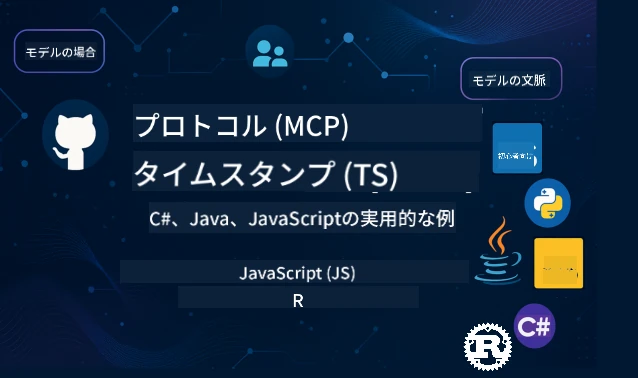

 

[](https://GitHub.com/microsoft/mcp-for-beginners/graphs/contributors)
[](https://GitHub.com/microsoft/mcp-for-beginners/issues)
[](https://GitHub.com/microsoft/mcp-for-beginners/pulls)
[](http://makeapullrequest.com)

[](https://GitHub.com/microsoft/mcp-for-beginners/watchers)
[](https://GitHub.com/microsoft/mcp-for-beginners/fork)
[](https://GitHub.com/microsoft/mcp-for-beginners/stargazers)


[](https://discord.gg/nTYy5BXMWG)

これらのリソースの使用を開始するために次の手順に従ってください：
1. **リポジトリをフォークする**: クリック [](https://GitHub.com/microsoft/mcp-for-beginners/fork)
2. **リポジトリをクローンする**: `git clone https://github.com/microsoft/mcp-for-beginners.git`
3. **参加する** [](https://discord.gg/nTYy5BXMWG)


### 🌐 多言語サポート

#### GitHub Actionによるサポート（自動化＆常に最新）

<!-- CO-OP TRANSLATOR LANGUAGES TABLE START -->
[Arabic](../ar/README.md) | [Bengali](../bn/README.md) | [Bulgarian](../bg/README.md) | [Burmese (Myanmar)](../my/README.md) | [Chinese (Simplified)](../zh-CN/README.md) | [Chinese (Traditional, Hong Kong)](../zh-HK/README.md) | [Chinese (Traditional, Macau)](../zh-MO/README.md) | [Chinese (Traditional, Taiwan)](../zh-TW/README.md) | [Croatian](../hr/README.md) | [Czech](../cs/README.md) | [Danish](../da/README.md) | [Dutch](../nl/README.md) | [Estonian](../et/README.md) | [Finnish](../fi/README.md) | [French](../fr/README.md) | [German](../de/README.md) | [Greek](../el/README.md) | [Hebrew](../he/README.md) | [Hindi](../hi/README.md) | [Hungarian](../hu/README.md) | [Indonesian](../id/README.md) | [Italian](../it/README.md) | [Japanese](./README.md) | [Kannada](../kn/README.md) | [Korean](../ko/README.md) | [Lithuanian](../lt/README.md) | [Malay](../ms/README.md) | [Malayalam](../ml/README.md) | [Marathi](../mr/README.md) | [Nepali](../ne/README.md) | [Nigerian Pidgin](../pcm/README.md) | [Norwegian](../no/README.md) | [Persian (Farsi)](../fa/README.md) | [Polish](../pl/README.md) | [Portuguese (Brazil)](../pt-BR/README.md) | [Portuguese (Portugal)](../pt-PT/README.md) | [Punjabi (Gurmukhi)](../pa/README.md) | [Romanian](../ro/README.md) | [Russian](../ru/README.md) | [Serbian (Cyrillic)](../sr/README.md) | [Slovak](../sk/README.md) | [Slovenian](../sl/README.md) | [Spanish](../es/README.md) | [Swahili](../sw/README.md) | [Swedish](../sv/README.md) | [Tagalog (Filipino)](../tl/README.md) | [Tamil](../ta/README.md) | [Telugu](../te/README.md) | [Thai](../th/README.md) | [Turkish](../tr/README.md) | [Ukrainian](../uk/README.md) | [Urdu](../ur/README.md) | [Vietnamese](../vi/README.md)

> **ローカルでクローンすることを好みますか？**
>
> このリポジトリには50以上の言語の翻訳が含まれており、ダウンロードサイズが大幅に増加します。翻訳なしでクローンするには、スパースチェックアウトを使用してください：
>
> **Bash / macOS / Linux:**
> ```bash
> git clone --filter=blob:none --sparse https://github.com/microsoft/mcp-for-beginners.git
> cd mcp-for-beginners
> git sparse-checkout set --no-cone '/*' '!translations' '!translated_images'
> ```
>
> **CMD (Windows):**
> ```cmd
> git clone --filter=blob:none --sparse https://github.com/microsoft/mcp-for-beginners.git
> cd mcp-for-beginners
> git sparse-checkout set --no-cone "/*" "!translations" "!translated_images"
> ```
>
> これにより、はるかに高速なダウンロードでコースを完了するために必要なすべてが入手できます。
<!-- CO-OP TRANSLATOR LANGUAGES TABLE END -->

# 🚀 初心者向け モデルコンテキストプロトコル (MCP) カリキュラム

## **C#、Java、JavaScript、Rust、Python、TypeScriptの実践的コード例でMCPを学ぶ**

## 🧠 モデルコンテキストプロトコルカリキュラム概要
モデルコンテキストプロトコルへの旅へようこそ！AIアプリケーションがどのようにさまざまなツールやサービスと通信しているのか疑問に思ったことがあれば、開発者がインテリジェントなシステムを構築する方法を変革しているエレガントな解決策をこれから発見します。

MCPはAIアプリケーションのためのユニバーサルトランスレーターのようなもので、USBポートがどんなデバイスでもコンピューターに接続できるようにするのと同様に、MCPはAIモデルがどんなツールやサービスにも標準化された方法で接続できるようにします。最初のチャットボットを作る時でも、複雑なAIワークフローで作業している時でも、MCPを理解することでより多機能で柔軟なアプリケーションを作る力が得られます。

このカリキュラムはあなたの学習の旅を考慮に入れて忍耐強く作成されています。すでに理解している簡単な概念から始めて、お気に入りのプログラミング言語での実践を通じて徐々に専門知識を構築していきます。各ステップには明確な説明、実用的な例、そして十分な励ましが含まれています。

旅を終える頃には、自分自身のMCPサーバーを構築し、人気のあるAIプラットフォームと統合する自信がつき、この技術がAI開発の未来をどのように形作っているかを理解していることでしょう。さあ、このエキサイティングな冒険を一緒に始めましょう！

### 公式ドキュメントと仕様

このカリキュラムは**MCP仕様 2025-11-25**（最新の安定リリース）に準拠しています。MCP仕様は日付ベースのバージョニング（YYYY-MM-DD形式）を使い、プロトコルのバージョンを明確に追跡できるようにしています。

これらのリソースは理解が深まるほど価値が高まりますが、すぐにすべてを読む必要はありません。興味のある部分から始めてください！
- 📘 [MCPドキュメント](https://modelcontextprotocol.io/) – ステップバイステップのチュートリアルやユーザーガイドの主要リソースです。初心者を意識して書かれており、あなたがペースに合わせて進められる明確な例が含まれています。
- 📜 [MCP仕様書](https://modelcontextprotocol.io/specification/2025-11-25) – 包括的なリファレンスマニュアルのようなものです。カリキュラムを進めるうちに、特定の詳細を調べたり高度な機能を探求したりするために何度もここに戻ってくることでしょう。
- 📜 [MCP仕様バージョニング](https://modelcontextprotocol.io/specification/versioning) – プロトコルのバージョン履歴とMCPが日付ベースのバージョニング（YYYY-MM-DD形式）をどう使用しているかの情報が含まれています。
- 🧑‍💻 [MCP GitHubリポジトリ](https://github.com/modelcontextprotocol) – ここではSDK、ツール、複数プログラミング言語のコードサンプルが入手できます。実用的な例とすぐに使えるコンポーネントの宝庫です。
- 🌐 [MCPコミュニティ](https://github.com/orgs/modelcontextprotocol/discussions) – MCPに関する学習者や経験豊富な開発者たちとディスカッションに参加しましょう。質問歓迎で知識共有が活発なサポートコミュニティです。
  
## 学習目標

このカリキュラムの終了時には、新しい能力に自信と興奮を感じるようになるでしょう。達成できることは以下の通りです：

• **MCPの基本を理解する**: モデルコンテキストプロトコルとは何か、なぜAIアプリケーションの連携方法を変革しているのかを、アナロジーやわかりやすい例を使って理解します。

• **最初のMCPサーバーを作る**: 自分の好きなプログラミング言語で動作するMCPサーバーを構築し、シンプルな例からステップバイステップでスキルを伸ばします。

• **AIモデルを実際のツールに接続する**: AIモデルと実際のサービスをつなぐ方法を学び、アプリケーションに強力な新機能をもたらします。

• **セキュリティのベストプラクティスを実装する**: MCP実装を安全に保ち、アプリケーションとユーザー双方を守る方法を理解します。

• **自信を持ってデプロイする**: 開発から本番環境へのMCPプロジェクトの展開方法を学び、実際の運用に役立つ実践的な手法を身につけます。

• **MCPコミュニティに参加する**: AIアプリケーション開発の未来を形作る成長中のコミュニティの一員になります。

## 必須の基礎知識

MCPの詳細に入る前に、いくつかの基本概念に慣れていることを確認しましょう。これらの分野に詳しくなくても心配はいりません。必要なことはすべて途中で説明します！

### プロトコルの理解（基盤）

プロトコルは会話のルールのようなものと考えてください。友達に電話するとき、受けたら「こんにちは」と言い、順番に話し、終わったら「さようなら」というのが決まりですよね。コンピュータープログラムも効果的に通信するために似たようなルールが必要です。

MCPはプロトコル、つまりAIモデルとアプリケーションがツールやサービスと「会話」するための合意されたルールの集合です。会話のルールがあると人のコミュニケーションがスムーズになるのと同じように、MCPがあるとAIアプリケーション同士の通信がより信頼性が高く強力になります。

### クライアントとサーバーの関係（プログラムの連携）

あなたは毎日クライアント-サーバー関係を利用しています！ブラウザー（クライアント）でウェブサイトを訪れると、ページの内容を送るウェブサーバーに接続しています。ブラウザーは情報の要求方法を知っており、サーバーは応答の仕方を知っています。

MCPでも同じ関係があります：AIモデルは情報やアクションを要求するクライアントの役割を果たし、MCPサーバーがそれらの機能を提供します。AIが頼みたい具体的な作業を依頼できる便利なアシスタント（サーバー）がいるイメージです。

### 標準化の重要性（連携を可能にする）

もしすべての自動車メーカーが異なる形のガスポンプを使っていたらどうでしょう？車ごとに異なるアダプターが必要になりますよね！標準化とは共通の方法を決めて、物事がシームレスに動くようにすることです。

MCPはAIアプリケーションに対してこの標準化を提供します。すべてのAIモデルが毎回特別なコードを書かなくてもツールと連携できるユニバーサルな方法を作ります。つまり、開発者は一度ツールを作れば多くの異なるAIシステムで動作させることができるのです。

## 🧭 学習ルートの概要

あなたのMCP旅路は自信とスキルを徐々に伸ばすように丁寧に構成されています。各フェーズで新しい概念を導入しつつ、これまで学んだ内容を繰り返し強化します。

### 🌱 基礎フェーズ：基本の理解（モジュール0～2）

ここから冒険が始まります！なじみのあるアナロジーや簡単な例を使ってMCPのコンセプトを紹介します。MCPとは何か、なぜ存在するのか、そしてAI開発の大きな世界の中でどのように位置づけられているのかを理解します。

• **モジュール0 - MCPの紹介**: MCPが何であるか、なぜ現代のAIアプリケーションにとって重要なのかを探ります。実際のMCPの動作例を見て、開発者が直面する共通の問題をどのように解決しているのかを理解します。

• **モジュール1 - コアコンセプトの解説**: MCPの基本的な構成要素を学びます。たくさんのアナロジーやビジュアル例を使い、これらの概念を自然で理解しやすいものにします。

• **モジュール2 - MCPのセキュリティ**: セキュリティは難しそうに聞こえますが、MCPに組み込まれた安全機能を紹介し、最初からアプリケーションを守るベストプラクティスを教えます。

### 🔨 実装フェーズ：最初の実装を作る（モジュール3）

ここから本当の楽しみが始まります！実際のMCPサーバーとクライアントを作る体験をします。心配はいりません、簡単なところから始めて一歩一歩案内します。
このモジュールには、好みのプログラミング言語で実践できる複数のハンズオンガイドが含まれています。最初のサーバーの作成、接続用クライアントの構築、さらにはVS Codeなどの人気の開発ツールとの統合も行います。

各ガイドには、完全なコード例、トラブルシューティングのヒント、特定の設計選択を行う理由が説明されています。このフェーズの終わりには、自信を持って動作するMCPの実装が手に入ります！

### 🚀 成長フェーズ：高度な概念と実世界の応用（モジュール4-5）

基本をマスターしたら、より洗練されたMCP機能の探求に進みます。実装の実用的な戦略、デバッグ技法、多モーダルAI統合などの高度なトピックを扱います。

また、MCPの実装を本番環境向けにスケールさせたり、Azureのようなクラウドプラットフォームとの連携方法も学びます。これらのモジュールは、現実のニーズに対応できるMCPソリューションを構築する準備を整えます。

### 🌟 マスタリーフェーズ：コミュニティと専門化（モジュール6-11）

最終フェーズはMCPコミュニティへの参加と、興味のある分野に特化することに焦点を当てています。オープンソースのMCPプロジェクトへの貢献方法、高度な認証パターンの実装、包括的なデータベース統合ソリューションの構築方法を学びます。

モジュール11は特に注目に値します。PostgreSQL統合を伴う本格的な13ラボのハンズオン学習パスで、生産準備が整ったMCPサーバーを構築する方法を教えます。これまで学んだすべてを集大成するキャップストーンプロジェクトのようなものです！

### 📚 完全なカリキュラム構成

| モジュール | トピック | 説明 | リンク |
|--------|-------|-------------|------|
| **モジュール0-3：基礎** | | | |
| 00 | MCP入門 | Model Context ProtocolとAIパイプラインにおける重要性の概要 | [詳細](./00-Introduction/README.md) |
| 01 | コアコンセプト解説 | MCPの主要概念の詳細な探求 | [詳細](./01-CoreConcepts/README.md) |
| 02 | MCPにおけるセキュリティ | セキュリティ脅威とベストプラクティス | [詳細](./02-Security/README.md) |
| 03 | MCPの始め方 | 環境設定、基本的なサーバー/クライアント、統合 | [詳細](./03-GettingStarted/README.md) |
| **モジュール3：最初のサーバーとクライアントの構築** | | | |
| 3.1 | 初めてのサーバー | 最初のMCPサーバーを作成 | [ガイド](./03-GettingStarted/01-first-server/README.md) |
| 3.2 | 初めてのクライアント | 基本的なMCPクライアントを開発 | [ガイド](./03-GettingStarted/02-client/README.md) |
| 3.3 | LLMを使ったクライアント | 大規模言語モデルを統合 | [ガイド](./03-GettingStarted/03-llm-client/README.md) |
| 3.4 | VS Code統合 | VS CodeでMCPサーバーを利用 | [ガイド](./03-GettingStarted/04-vscode/README.md) |
| 3.5 | stdioサーバー | stdioトランスポートを使ったサーバー作成 | [ガイド](./03-GettingStarted/05-stdio-server/README.md) |
| 3.6 | HTTPストリーミング | MCPでのHTTPストリーミング実装 | [ガイド](./03-GettingStarted/06-http-streaming/README.md) |
| 3.7 | AIツールキット | AIツールキットとMCPの利用 | [ガイド](./03-GettingStarted/07-aitk/README.md) |
| 3.8 | テスト | MCPサーバー実装のテスト | [ガイド](./03-GettingStarted/08-testing/README.md) |
| 3.9 | デプロイメント | MCPサーバーの本番環境へのデプロイ | [ガイド](./03-GettingStarted/09-deployment/README.md) |
| 3.10 | 高度なサーバー利用 | 高度な機能の利用とアーキテクチャ改善のためのサーバー利用 | [ガイド](./03-GettingStarted/10-advanced/README.md) |
| 3.11 | シンプル認証 | 初歩からの認証とRBACを紹介 | [ガイド](./03-GettingStarted/11-simple-auth/README.md) |
| 3.12 | MCPホスト | Claude Desktop、Cursor、ClineなどのMCPホストを設定 | [ガイド](./03-GettingStarted/12-mcp-hosts/README.md) |
| 3.13 | MCP インスペクター | InspectorツールでMCPサーバーをデバッグ・テスト | [ガイド](./03-GettingStarted/13-mcp-inspector/README.md) |
| 3.14 | サンプリング | クライアントとの共同作業にサンプリングを使用 | [ガイド](./03-GettingStarted/14-sampling/README.md) |
| 3.15 | MCPアプリ | MCPアプリを構築 | [ガイド](./03-GettingStarted/15-mcp-apps/README.md) |

| **モジュール4-5：実践と高度な内容** | | | |
| 04 | 実践的実装 | SDK、デバッグ、テスト、再利用可能なプロンプトテンプレート | [詳細](./04-PracticalImplementation/README.md) |
| 4.1 | ページネーション | カーソルベースのページネーションで大規模結果を処理 | [ガイド](./04-PracticalImplementation/pagination/README.md) |
| 05 | MCPの高度なトピック | マルチモーダルAI、スケーリング、企業利用 | [詳細](./05-AdvancedTopics/README.md) |
| 5.1 | Azure統合 | AzureとのMCP統合 | [ガイド](./05-AdvancedTopics/mcp-integration/README.md) |
| 5.2 | マルチモダリティ | 複数モダリティの活用 | [ガイド](./05-AdvancedTopics/mcp-multi-modality/README.md) |
| 5.3 | OAuth2デモ | OAuth2認証の実装 | [ガイド](./05-AdvancedTopics/mcp-oauth2-demo/README.md) |
| 5.4 | ルートコンテキスト | ルートコンテキストの理解と実装 | [ガイド](./05-AdvancedTopics/mcp-root-contexts/README.md) |
| 5.5 | ルーティング | MCPのルーティング戦略 | [ガイド](./05-AdvancedTopics/mcp-routing/README.md) |
| 5.6 | サンプリング | MCPにおけるサンプリング技術 | [ガイド](./05-AdvancedTopics/mcp-sampling/README.md) |
| 5.7 | スケーリング | MCP実装のスケーリング | [ガイド](./05-AdvancedTopics/mcp-scaling/README.md) |
| 5.8 | セキュリティ | 高度なセキュリティ考慮点 | [ガイド](./05-AdvancedTopics/mcp-security/README.md) |
| 5.9 | ウェブ検索 | ウェブ検索機能の実装 | [ガイド](./05-AdvancedTopics/web-search-mcp/README.md) |
| 5.10 | リアルタイムストリーミング | リアルタイムストリーミング機能の構築 | [ガイド](./05-AdvancedTopics/mcp-realtimestreaming/README.md) |
| 5.11 | リアルタイム検索 | リアルタイム検索の実装 | [ガイド](./05-AdvancedTopics/mcp-realtimesearch/README.md) |
| 5.12 | Entra ID認証 | Microsoft Entra IDでの認証 | [ガイド](./05-AdvancedTopics/mcp-security-entra/README.md) |
| 5.13 | Foundry統合 | Azure AI Foundryとの連携 | [ガイド](./05-AdvancedTopics/mcp-foundry-agent-integration/README.md) |
| 5.14 | コンテキストエンジニアリング | 効果的なコンテキスト設計技術 | [ガイド](./05-AdvancedTopics/mcp-contextengineering/README.md) |
| 5.15 | MCPカスタムトランスポート | カスタムトランスポートの実装 | [ガイド](./05-AdvancedTopics/mcp-transport/README.md) |
| 5.16 | プロトコル機能 | 進捗通知、キャンセル、リソーステンプレート | [ガイド](./05-AdvancedTopics/mcp-protocol-features/README.md) |
| **モジュール6-10：コミュニティとベストプラクティス** | | | |
| 06 | コミュニティ貢献 | MCPエコシステムへの貢献方法 | [ガイド](./06-CommunityContributions/README.md) |
| 07 | 初期導入からの洞察 | 実際の実装事例 | [ガイド](./07-LessonsfromEarlyAdoption/README.md) |
| 08 | MCPのベストプラクティス | パフォーマンス、フォールトトレランス、レジリエンス | [ガイド](./08-BestPractices/README.md) |
| 09 | MCPケーススタディ | 実践的な実装例 | [ガイド](./09-CaseStudy/README.md) |
| 10 | ハンズオンワークショップ | AIツールキットを使ったMCPサーバー構築 | [ラボ](./10-StreamliningAIWorkflowsBuildingAnMCPServerWithAIToolkit/README.md) |
| **モジュール11：MCPサーバーハンズオンラボ** | | | |
| 11 | MCPサーバーデータベース統合 | PostgreSQL統合のための包括的な13ラボハンズオン学習パス | [ラボ集](./11-MCPServerHandsOnLabs/README.md) |
| 11.1 | はじめに | データベース統合と小売分析ユースケースの概要 | [ラボ00](./11-MCPServerHandsOnLabs/00-Introduction/README.md) |
| 11.2 | コアアーキテクチャ | MCPサーバーのアーキテクチャ、データベース層、セキュリティパターンの理解 | [ラボ01](./11-MCPServerHandsOnLabs/01-Architecture/README.md) |
| 11.3 | セキュリティとマルチテナンシー | 行レベルセキュリティ、認証、マルチテナントデータアクセス | [ラボ02](./11-MCPServerHandsOnLabs/02-Security/README.md) |
| 11.4 | 環境設定 | 開発環境、Docker、Azureリソースのセットアップ | [ラボ03](./11-MCPServerHandsOnLabs/03-Setup/README.md) |
| 11.5 | データベース設計 | PostgreSQLセットアップ、小売スキーマ設計、サンプルデータ | [ラボ04](./11-MCPServerHandsOnLabs/04-Database/README.md) |
| 11.6 | MCPサーバー実装 | データベース統合を伴うFastMCPサーバーの構築 | [ラボ05](./11-MCPServerHandsOnLabs/05-MCP-Server/README.md) |
| 11.7 | ツール開発 | データベースクエリツールとスキーマイントロスペクションの作成 | [ラボ06](./11-MCPServerHandsOnLabs/06-Tools/README.md) |
| 11.8 | セマンティックサーチ | Azure OpenAIとpgvectorを使ったベクトル埋め込みの実装 | [ラボ07](./11-MCPServerHandsOnLabs/07-Semantic-Search/README.md) |
| 11.9 | テストとデバッグ | テスト戦略、デバッグツール、検証手法 | [ラボ08](./11-MCPServerHandsOnLabs/08-Testing/README.md) |
| 11.10 | VS Code統合 | VS Code MCP統合とAIチャットの設定 | [ラボ09](./11-MCPServerHandsOnLabs/09-VS-Code/README.md) |
| 11.11 | デプロイメント戦略 | Dockerデプロイ、Azure Container Apps、スケーリングの考慮 | [ラボ10](./11-MCPServerHandsOnLabs/10-Deployment/README.md) |
| 11.12 | モニタリング | Application Insights、ログ記録、パフォーマンス監視 | [ラボ11](./11-MCPServerHandsOnLabs/11-Monitoring/README.md) |
| 11.13 | ベストプラクティス | パフォーマンス最適化、セキュリティ強化、本番運用のヒント | [ラボ12](./11-MCPServerHandsOnLabs/12-Best-Practices/README.md) |

### 💻 サンプルコードプロジェクト

MCP学習で最もエキサイティングな部分は、コードスキルが段階的に向上するのを実感できることです。コード例はシンプルなものから始まり、理解が深まるにつれてより高度になります。以下のように概念を紹介します。簡単に理解できるコードですが、実際のMCP原則を示しながら、コードがどう動くかだけでなく、その構造の理由や大規模MCPアプリへの適用方法も理解できます。

#### 基本的なMCP計算機サンプル

| 言語 | 説明 | リンク |
|----------|-------------|------|
| C# | MCPサーバー例 | [コードを見る](./03-GettingStarted/samples/csharp/README.md) |
| Java | MCP計算機 | [コードを見る](./03-GettingStarted/samples/java/calculator/README.md) |
| JavaScript | MCPデモ | [コードを見る](./03-GettingStarted/samples/javascript/README.md) |
| Python | MCPサーバー | [コードを見る](../../03-GettingStarted/samples/python/mcp_calculator_server.py) |
| TypeScript | MCP例 | [コードを見る](./03-GettingStarted/samples/typescript/README.md) |
| Rust | MCP例 | [コードを見る](./03-GettingStarted/samples/rust/README.md) |

#### 高度なMCP実装

| 言語 | 説明 | リンク |
|----------|-------------|------|
| C# | 高度なサンプル | [コードを見る](./04-PracticalImplementation/samples/csharp/README.md) |
| Java with Spring | コンテナアプリ例 | [コードを見る](./04-PracticalImplementation/samples/java/containerapp/README.md) |
| JavaScript | 高度なサンプル | [コードを見る](./04-PracticalImplementation/samples/javascript/README.md) |
| Python | 複雑な実装 | [コードを見る](./04-PracticalImplementation/samples/python/README.md) |
| TypeScript | コンテナサンプル | [コードを見る](./04-PracticalImplementation/samples/typescript/README.md) |


## 🎯 MCP学習に必要な前提条件

このカリキュラムを最大限に活用するには、以下のことが求められます:
- 以下のいずれかの言語でのプログラミングの基本知識：C#、Java、JavaScript、Python、またはTypeScript
- クライアントサーバーモデルとAPIの理解
- RESTおよびHTTPの概念への馴染み
- （オプション）AI/MLの概念のバックグラウンド

- サポートのためにコミュニティディスカッションに参加すること

## 📚 学習ガイド＆リソース

このリポジトリには、効果的に学習し進めるための複数のリソースが含まれています：

### 学習ガイド

包括的な[学習ガイド](./study_guide.md)が利用可能で、リポジトリを効果的に進める助けとなります。この視覚的なカリキュラムマップはトピック同士のつながりを示し、サンプルプロジェクトの活用方法を案内します。全体像を把握したいビジュアル学習者に特に役立ちます。

ガイドには以下が含まれます：
- すべてのトピックを示す視覚的カリキュラムマップ
- 各リポジトリセクションの詳細な内訳
- サンプルプロジェクトの活用ガイダンス
- 技能レベルに応じた推奨学習パス
- 学習の補完となる追加リソース

### 変更履歴

カリキュラム資料のすべての重要な更新を追跡する詳細な[変更履歴](./changelog.md)を維持しています。最新の改良と追加を把握できます。
- 新規コンテンツの追加
- 構造の変更
- 機能改善
- ドキュメントの更新

## 🛠️ このカリキュラムを効果的に使う方法

このガイドの各レッスンには以下が含まれます：

1. MCPの概念の明確な説明  
2. 複数の言語でのライブコード例  
3. 実際のMCPアプリケーションを構築する演習  
4. 上級者向けの追加リソース

### C#で学ぶMCP - チュートリアルシリーズ
モデルコンテキストプロトコル（MCP）について学びましょう。これはAIモデルとクライアントアプリ間の対話を標準化する最先端のフレームワークです。この初心者向けセッションでは、MCPの紹介と最初のMCPサーバーの作成手順をご案内します。
#### C#: [https://aka.ms/letslearnmcp-csharp](https://aka.ms/letslearnmcp-csharp)
#### Java: [https://aka.ms/letslearnmcp-java](https://aka.ms/letslearnmcp-java)
#### JavaScript: [https://aka.ms/letslearnmcp-javascript](https://aka.ms/letslearnmcp-javascript)
#### Python: [https://aka.ms/letslearnmcp-python](https://aka.ms/letslearnmcp-python)

## 🎓 あなたのMCPの旅が始まります

おめでとうございます！プログラミング能力を広げ、AI開発の最先端に繋がるエキサイティングな旅の第一歩を踏み出しました。

### これまでに達成したこと

この紹介文を読むことで、すでにMCPの知識基盤を築き始めています。MCPとは何か、その重要性、このカリキュラムが学習のサポートになることを理解しました。これは重要な成果であり、この重要な技術の専門知識の始まりです。

### 今後の冒険

モジュールを進めるにつれて、すべての専門家はかつて初心者だったことを忘れないでください。今は複雑に見える概念も、練習と応用を通じて自然に身につきます。一歩一歩が強力な能力を築き、あなたの開発キャリアを支えるでしょう。

### あなたのサポートネットワーク

MCPに情熱を持ち、他者の成功を熱心に支援する学習者と専門家のコミュニティに参加しています。コーディングの壁にぶつかった時や新たな発見を共有したい時、このコミュニティがあなたの旅を支えます。

AIアプリの構築で困った場合や質問があれば、学習仲間や経験豊かな開発者とMCPについて議論しましょう。質問歓迎で知識が自由に共有される、支え合いのコミュニティです。

[](https://discord.gg/nTYy5BXMWG)

製品のフィードバックやビルド中のエラーがあればこちらをご利用ください：

[](https://aka.ms/foundry/forum)

### さあ始めましょうか？

あなたのMCPの冒険は今始まります！まずはモジュール0から最初のハンズオン体験に飛び込み、あるいはサンプルプロジェクトを探索してこれから作るものを見てみましょう。すべての専門家が今のあなたの位置から出発し、忍耐と練習によって驚くべき成果を出してきました。

モデルコンテキストプロトコル開発の世界へようこそ。一緒に素晴らしいものを作りましょう！

## 🤝 学習コミュニティへの貢献

このカリキュラムはあなたのような学習者の貢献によってより強くなります！タイプミスの修正や説明の明確化、新しい例の追加など、あなたの貢献が他の初心者の成功を助けます。

Microsoft Valued Professionalの[Shivam Goyal](https://www.linkedin.com/in/shivam2003/)にコードサンプルのご提供ありがとうございます。

貢献プロセスは歓迎的かつ支援的です。ほとんどの貢献には貢献者ライセンス契約（CLA）が必要ですが、自動ツールがスムーズに案内します。

## 📜 オープンソース学習

このカリキュラム全体はMITの[LICENSE](../../LICENSE)の下で利用可能で、自由に使用、改変、共有できます。これは、MCPの知識をすべての開発者に広めるという我々の使命を支えます。

## 🤝 貢献ガイドライン

このプロジェクトは貢献や提案を歓迎します。ほとんどの貢献は、あなたが貢献物に関する利用権利を実際に持っており、当社に使用権を付与することに同意するCLAへの署名が必要です。詳細は<https://cla.opensource.microsoft.com>を参照してください。

プルリクエストを提出すると、CLAボットが自動的にCLAが必要かを判断し、PRに適切なタグ（ステータスチェック、コメントなど）を付けます。ボットの指示に従ってください。CLAはこのCLAを使用するすべてのリポジトリで一度だけ必要です。

このプロジェクトは[Microsoftオープンソース行動規範](https://opensource.microsoft.com/codeofconduct/)を採用しています。詳細は[行動規範 FAQ](https://opensource.microsoft.com/codeofconduct/faq/)を参照するか、質問やコメントは[opencode@microsoft.com](mailto:opencode@microsoft.com)までご連絡ください。

---

*MCPの旅を始める準備はできましたか？[Module 00 - MCP入門](./00-Introduction/README.md)から始め、モデルコンテキストプロトコル開発の世界に足を踏み入れましょう！*

## 🎒 その他のコース
チームが他のコースも制作しています！ぜひご覧ください：

<!-- CO-OP TRANSLATOR OTHER COURSES START -->
### LangChain
[](https://aka.ms/langchain4j-for-beginners)
[](https://aka.ms/langchainjs-for-beginners?WT.mc_id=m365-94501-dwahlin)
[](https://github.com/microsoft/langchain-for-beginners?WT.mc_id=m365-94501-dwahlin)
---

### Azure / Edge / MCP / Agents
[](https://github.com/microsoft/AZD-for-beginners?WT.mc_id=academic-105485-koreyst)
[](https://github.com/microsoft/edgeai-for-beginners?WT.mc_id=academic-105485-koreyst)
[](https://github.com/microsoft/mcp-for-beginners?WT.mc_id=academic-105485-koreyst)
[](https://github.com/microsoft/ai-agents-for-beginners?WT.mc_id=academic-105485-koreyst)

---
 
### 生成AIシリーズ
[](https://github.com/microsoft/generative-ai-for-beginners?WT.mc_id=academic-105485-koreyst)
[-9333EA?style=for-the-badge&labelColor=E5E7EB&color=9333EA)](https://github.com/microsoft/Generative-AI-for-beginners-dotnet?WT.mc_id=academic-105485-koreyst)
[-C084FC?style=for-the-badge&labelColor=E5E7EB&color=C084FC)](https://github.com/microsoft/generative-ai-for-beginners-java?WT.mc_id=academic-105485-koreyst)
[-E879F9?style=for-the-badge&labelColor=E5E7EB&color=E879F9)](https://github.com/microsoft/generative-ai-with-javascript?WT.mc_id=academic-105485-koreyst)

---
 
### コアラーニング
[](https://aka.ms/ml-beginners?WT.mc_id=academic-105485-koreyst)
[](https://aka.ms/datascience-beginners?WT.mc_id=academic-105485-koreyst)
[](https://aka.ms/ai-beginners?WT.mc_id=academic-105485-koreyst)
[](https://github.com/microsoft/Security-101?WT.mc_id=academic-96948-sayoung)
[](https://aka.ms/webdev-beginners?WT.mc_id=academic-105485-koreyst)
[](https://aka.ms/iot-beginners?WT.mc_id=academic-105485-koreyst)
[](https://github.com/microsoft/xr-development-for-beginners?WT.mc_id=academic-105485-koreyst)

---
 
### Copilotシリーズ

[](https://aka.ms/GitHubCopilotAI?WT.mc_id=academic-105485-koreyst)
[](https://github.com/microsoft/mastering-github-copilot-for-dotnet-csharp-developers?WT.mc_id=academic-105485-koreyst)
[](https://github.com/microsoft/CopilotAdventures?WT.mc_id=academic-105485-koreyst)
<!-- CO-OP TRANSLATOR OTHER COURSES END -->

---

<!-- CO-OP TRANSLATOR DISCLAIMER START -->
**免責事項**：  
本書類はAI翻訳サービス「Co-op Translator」（https://github.com/Azure/co-op-translator）を使用して翻訳されています。正確性の確保に努めておりますが、自動翻訳には誤りや不正確な点が含まれる可能性があります。原文の言語による文書が正式な情報源とみなされるべきです。重要な情報については、専門の人間による翻訳を推奨いたします。本翻訳の利用に起因するいかなる誤解や誤訳についても、当方は一切の責任を負いかねます。
<!-- CO-OP TRANSLATOR DISCLAIMER END -->