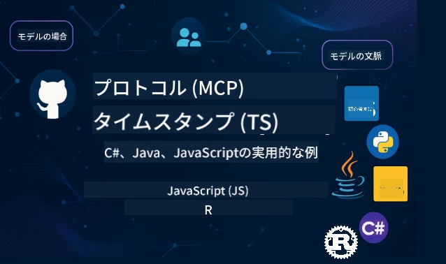

 

[](https://GitHub.com/microsoft/mcp-for-beginners/graphs/contributors)
[](https://GitHub.com/microsoft/mcp-for-beginners/issues)
[](https://GitHub.com/microsoft/mcp-for-beginners/pulls)
[](http://makeapullrequest.com)
[](https://mcptoplist.com/server/mcp.so%2Fmcp-for-beginners%2Fmicrosoft)

[](https://GitHub.com/microsoft/mcp-for-beginners/watchers)
[](https://GitHub.com/microsoft/mcp-for-beginners/fork)
[](https://GitHub.com/microsoft/mcp-for-beginners/stargazers)


[](https://discord.gg/nTYy5BXMWG)

これらのリソースを使い始めるには、次の手順に従ってください:
1. <strong>リポジトリをフォークする</strong>: クリック [](https://GitHub.com/microsoft/mcp-for-beginners/fork)
2. <strong>リポジトリをクローンする</strong>:   `git clone https://github.com/microsoft/mcp-for-beginners.git`
3. <strong>参加する</strong> [](https://discord.gg/nTYy5BXMWG)


### 🌐 多言語サポート

#### GitHub Actionsでサポート（自動化＆常に最新）

<!-- CO-OP TRANSLATOR LANGUAGES TABLE START -->
[Arabic](../ar/README.md) | [Bengali](../bn/README.md) | [Bulgarian](../bg/README.md) | [Burmese (Myanmar)](../my/README.md) | [Chinese (Simplified)](../zh-CN/README.md) | [Chinese (Traditional, Hong Kong)](../zh-HK/README.md) | [Chinese (Traditional, Macau)](../zh-MO/README.md) | [Chinese (Traditional, Taiwan)](../zh-TW/README.md) | [Croatian](../hr/README.md) | [Czech](../cs/README.md) | [Danish](../da/README.md) | [Dutch](../nl/README.md) | [Estonian](../et/README.md) | [Finnish](../fi/README.md) | [French](../fr/README.md) | [German](../de/README.md) | [Greek](../el/README.md) | [Hebrew](../he/README.md) | [Hindi](../hi/README.md) | [Hungarian](../hu/README.md) | [Indonesian](../id/README.md) | [Italian](../it/README.md) | [Japanese](./README.md) | [Kannada](../kn/README.md) | [Khmer](../km/README.md) | [Korean](../ko/README.md) | [Lithuanian](../lt/README.md) | [Malay](../ms/README.md) | [Malayalam](../ml/README.md) | [Marathi](../mr/README.md) | [Nepali](../ne/README.md) | [Nigerian Pidgin](../pcm/README.md) | [Norwegian](../no/README.md) | [Persian (Farsi)](../fa/README.md) | [Polish](../pl/README.md) | [Portuguese (Brazil)](../pt-BR/README.md) | [Portuguese (Portugal)](../pt-PT/README.md) | [Punjabi (Gurmukhi)](../pa/README.md) | [Romanian](../ro/README.md) | [Russian](../ru/README.md) | [Serbian (Cyrillic)](../sr/README.md) | [Slovak](../sk/README.md) | [Slovenian](../sl/README.md) | [Spanish](../es/README.md) | [Swahili](../sw/README.md) | [Swedish](../sv/README.md) | [Tagalog (Filipino)](../tl/README.md) | [Tamil](../ta/README.md) | [Telugu](../te/README.md) | [Thai](../th/README.md) | [Turkish](../tr/README.md) | [Ukrainian](../uk/README.md) | [Urdu](../ur/README.md) | [Vietnamese](../vi/README.md)

> **ローカルでクローンするのがお好みですか？**
>
> このリポジトリには50以上の言語翻訳が含まれており、ダウンロードサイズが大幅に増加します。翻訳を含めずにクローンするには、スパースチェックアウトを使用してください：
>
> **Bash / macOS / Linux:**
> ```bash
> git clone --filter=blob:none --sparse https://github.com/microsoft/mcp-for-beginners.git
> cd mcp-for-beginners
> git sparse-checkout set --no-cone '/*' '!translations' '!translated_images'
> ```
>
> **CMD (Windows):**
> ```cmd
> git clone --filter=blob:none --sparse https://github.com/microsoft/mcp-for-beginners.git
> cd mcp-for-beginners
> git sparse-checkout set --no-cone "/*" "!translations" "!translated_images"
> ```
>
> これにより、より高速なダウンロードでコースを完了するために必要なものがすべて得られます。
<!-- CO-OP TRANSLATOR LANGUAGES TABLE END -->

# 🚀 初心者向け Model Context Protocol (MCP) カリキュラム

## **C#、Java、JavaScript、Rust、Python、TypeScriptでハンズオンコード例を使ってMCPを学ぶ**

## 🧠 Model Context Protocolカリキュラムの概要
Model Context Protocolの旅へようこそ！AIアプリケーションがさまざまなツールやサービスとどのように通信しているのか疑問に思ったことがあれば、開発者がインテリジェントなシステムを構築する方法を変革している優雅な解決策をまもなく発見します。

MCPをAIアプリケーションのためのユニバーサルトランスレーターのように考えてください。USBポートがどんなデバイスでもコンピューターに接続できるようにするのと同じように、MCPはAIモデルが標準化された方法でどんなツールやサービスにも接続できるようにします。最初のチャットボットを作る場合でも複雑なAIワークフローに取り組む場合でも、MCPを理解することで、より能力が高く柔軟なアプリケーションを作成する力が得られます。

このカリキュラムは、あなたの学習の旅を忍耐強く丁寧に設計しています。すでに理解している単純な概念から始めて、お気に入りのプログラミング言語でのハンズオン演習を通じて段階的にスキルを高めていきます。各ステップには明確な説明、実用的な例、そして豊富な励ましがあります。

この旅を完了する頃には、自分自身のMCPサーバーを構築し、それを人気のあるAIプラットフォームと統合し、この技術がAI開発の未来をどのように再形成しているかを理解する自信がついていることでしょう。さあ、このエキサイティングな冒険を共に始めましょう！

### 公式ドキュメントと仕様

このカリキュラムは<strong>MCP仕様 2025-11-25</strong>（最新の安定版リリース）に準拠しています。MCP仕様は日付ベースのバージョニング（YYYY-MM-DD形式）を使用し、プロトコルのバージョン管理を明確にしています。

> **今後の予定:** 次の仕様バージョンのリリース候補である<strong>2026-07-28</strong>は2026年7月28日に公開予定です。これによりプロトコルがトランスポート層でステートレスになり、拡張機能フレームワーク（MCP Apps、Tasks）が正式化され、認証が強化され、Roots、Sampling、およびLoggingが廃止されます。詳細については[2026-07-28リリース候補でのMCPの変更点](./01-CoreConcepts/mcp-2026-07-28-release-candidate.md)をご覧ください。

これらのリソースは、理解が深まるほど価値が増しますが、すぐにすべてを読む必要はありません。興味のある分野から始めてください！
- 📘 [MCP ドキュメント](https://modelcontextprotocol.io/) – ステップバイステップのチュートリアルとユーザーガイドが揃った、初心者向けのわかりやすいリソースです。自分のペースで例を試しながら学べます。
- 📜 [MCP 仕様](https://modelcontextprotocol.io/specification/2025-11-25) – 包括的なリファレンスマニュアルとして活用してください。カリキュラムを進めながら、特定の詳細を調べたり高度な機能を探求したりするときに戻ってきます。
- 📜 [MCP 仕様のバージョニング](https://modelcontextprotocol.io/specification/versioning) – プロトコルのバージョン履歴や日付ベースのバージョニング(YYYY-MM-DD形式)の使い方についての情報を含みます。
- 🧑‍💻 [MCP GitHubリポジトリ](https://github.com/modelcontextprotocol) – SDK、ツール、複数のプログラミング言語によるコードサンプルが揃っています。実用的な例やすぐに使えるコンポーネントの宝庫です。
- 🌐 [MCP コミュニティ](https://github.com/orgs/modelcontextprotocol/discussions) – MCPについて学んでいる仲間や経験豊富な開発者と議論に参加しましょう。質問歓迎のサポート的なコミュニティで、知識が自由に共有されています。
  
## 学習目標

このカリキュラムの修了時には、自信とワクワクを感じられるでしょう。達成できることは次の通りです:

• **MCPの基本を理解する**: Model Context Protocolとは何か、それがAIアプリケーション間の連携に革命をもたらしている理由を、分かりやすい比喩や例を通じて把握します。

• **最初のMCPサーバーを構築する**: 好きなプログラミング言語で動作するMCPサーバーを作成し、簡単な例から始めて段階的にスキルを向上させます。

• **AIモデルを実際のツールに接続する**: AIモデルと実サービス間の橋渡し方法を学び、アプリケーションに強力な新機能を与えます。

• <strong>セキュリティのベストプラクティスを実装する</strong>: MCP実装を安全に保ち、アプリケーションとユーザーの双方を保護する方法を理解します。

• <strong>自信を持ってデプロイする</strong>: 開発から本番環境への移行方法を理解し、実際の現場で有効なデプロイ戦略を学びます。

• **MCPコミュニティに参加する**: AIアプリケーション開発の未来を形作っている成長中の開発者コミュニティに加わります。 

## 基本的な背景知識

MCPの詳細に入る前に、いくつかの基礎的な概念に慣れておきましょう。これらの分野が得意でなくても心配いりません。必要なことはすべて進めながら説明します！

### プロトコルの理解（基礎）

プロトコルとは会話のルールのようなものです。友人に電話したとき、あなたも友人も「こんにちは」と言い、交互に話し、最後に「さようなら」と言います。同じように、コンピュータプログラムも効果的に通信するために似たルールが必要です。

MCPはプロトコル、つまりAIモデルとアプリケーションがツールやサービスと実りある「会話」をするために合意したルールのセットです。人間の会話ルールがコミュニケーションを円滑にするように、MCPもAIアプリケーションのコミュニケーションをより信頼でき強力なものにします。

### クライアント-サーバー関係（プログラム同士の連携）

あなたは毎日すでにクライアント-サーバー関係を使っています！ウェブブラウザ（クライアント）でウェブサイトを訪問すると、ページの内容を送るウェブサーバーに接続します。ブラウザは情報を求める方法を知り、サーバーは応答方法を知っています。

MCPでは似た関係があります：AIモデルは情報や行動を求めるクライアントとして機能し、MCPサーバーがそれらの機能を提供します。AIが特定タスクの実行を頼める便利なアシスタント（サーバー）がいるようなものです。

### 標準化が重要な理由（互換性を持たせる）

もし、すべての自動車メーカーが違う形の給油ポンプを使っていたら、それぞれの車に違うアダプターが必要になってしまいますよね！標準化は、共通の方法で合意し、スムーズに連携できるようにすることです。

MCPはAIアプリケーションのためにこの標準化を提供します。すべてのAIモデルが個別のコードでツールと連携するのではなく、MCPが共通の通信方法を作り出します。これにより開発者はツールを一度作れば、多くのAIシステムで使えるようになります。

## 🧭 学習の道筋概要

あなたのMCPの旅は、着実に自信とスキルを築けるように慎重に構成されています。各フェーズで新しい概念を紹介しつつ、すでに学んだことを強化します。

### 🌱 基礎フェーズ：基本の理解（モジュール0-2）

ここからあなたの冒険が始まります！おなじみの比喩や簡単な例を使ってMCPの概念を紹介します。MCPとは何か、なぜ存在するのか、そしてAI開発の大きな世界の中でどのように位置づけられているかがわかります。


• **モジュール 0 - MCP入門**: MCPとは何か、そしてなぜ現代のAIアプリケーションにとって重要なのかを探ります。実際の事例を通じてMCPの活用例を見て、開発者が直面する一般的な問題をどのように解決するかを理解します。

• **モジュール 1 - 核となる概念の説明**: ここではMCPの基本構成要素を学びます。多くのアナロジーや視覚的な例を使って、これらの概念が自然に理解できるようにします。

• **モジュール 2 - MCPのセキュリティ**: セキュリティは難しそうに思えるかもしれませんが、MCPに組み込まれている安全機能を紹介し、アプリケーションを最初から守るためのベストプラクティスを教えます。

### 🔨 構築フェーズ: 最初の実装を作成しよう (モジュール 3)

いよいよ実践です！実際にMCPのサーバーとクライアントを構築するハンズオン体験をします。心配無用、簡単なところから始めて、ステップごとに丁寧に案内します。

このモジュールには複数のハンズオンガイドが含まれており、お好みのプログラミング言語で練習できます。最初のサーバーを作り、それに接続するクライアントを開発し、VS Codeのような人気開発ツールとの統合も行います。

各ガイドは完全なコード例、トラブルシューティングのヒント、そしてなぜ特定の設計選択をするのかの説明を含みます。このフェーズの終わりには、自信を持って使えるMCPの実装が完成しています！

### 🚀 成長フェーズ: 高度な概念と実践的応用 (モジュール 4-5)

基礎を習得したら、より洗練されたMCPの機能を探求しましょう。実用的な実装戦略、デバッグ技術、多モーダルAI統合などの高度なトピックを扱います。

また、MCP実装を本番環境にスケールさせる方法や、Azureなどのクラウドプラットフォームとの統合方法も学びます。これらのモジュールは現実の要求に対応できるMCPソリューションを構築する準備を整えます。

### 🌟 マスタリーフェーズ: コミュニティと専門分野 (モジュール 6-11)

最終フェーズでは、MCPコミュニティに参加し、自分の興味に応じた専門分野を深めます。オープンソースのMCPプロジェクトへの貢献、高度な認証パターンの実装、そして包括的なデータベース統合ソリューションの構築を学びます。

モジュール11は特に注目に値します。PostgreSQL統合を学ぶ13ラボのハンズオン学習パスで、総仕上げのプロジェクトのようにこれまで学んだことをすべてまとめて実践します！

### 📚 完全なカリキュラム構成

| モジュール | トピック | 説明 | リンク |
|--------|-------|-------------|------|
| **モジュール 0-3: 基本** | | | |
| 00 | MCP入門 | モデルコンテキストプロトコルの概要とAIパイプラインにおけるその重要性 | [Read more](./00-Introduction/README.md) |
| 01 | 核となる概念の説明 | MCPの核となる概念の詳細な探究 | [Read more](./01-CoreConcepts/README.md) |
| 1.1 | MCPにおける変更点 (2026-07-28 RC) | ステートレスプロトコル、拡張フレームワーク、および次の仕様バージョンで廃止される機能 | [Guide](./01-CoreConcepts/mcp-2026-07-28-release-candidate.md) |
| 02 | MCPのセキュリティ | セキュリティの脅威とベストプラクティス | [Read more](./02-Security/README.md) |
| 03 | MCPの始め方 | 環境設定、基本的なサーバー/クライアント、統合 | [Read more](./03-GettingStarted/README.md) |
| **モジュール 3: 最初のサーバーとクライアントの構築** | | | |
| 3.1 | 最初のサーバー | 最初のMCPサーバーを作成 | [Guide](./03-GettingStarted/01-first-server/README.md) |
| 3.2 | 最初のクライアント | 基本的なMCPクライアントを開発 | [Guide](./03-GettingStarted/02-client/README.md) |
| 3.3 | LLMを使ったクライアント | 大規模言語モデルの統合 | [Guide](./03-GettingStarted/03-llm-client/README.md) |
| 3.4 | VS Code統合 | VS CodeでMCPサーバーを利用 | [Guide](./03-GettingStarted/04-vscode/README.md) |
| 3.5 | stdioサーバー | stdioトランスポートを使ったサーバー作成 | [Guide](./03-GettingStarted/05-stdio-server/README.md) |
| 3.6 | HTTPストリーミング | MCPでのHTTPストリーミング実装 | [Guide](./03-GettingStarted/06-http-streaming/README.md) |
| 3.7 | Microsoft Foundry Toolkit | MCPでMicrosoft Foundry Toolkitを使用 | [Guide](./03-GettingStarted/07-aitk/README.md) |
| 3.8 | テスト | MCPサーバーのテスト実施 | [Guide](./03-GettingStarted/08-testing/README.md) |
| 3.9 | デプロイ | MCPサーバーを本番環境へデプロイ | [Guide](./03-GettingStarted/09-deployment/README.md) |
| 3.10 | 高度なサーバー利用 | 高度な機能利用やアーキテクチャの改善のためのサーバー利用 | [Guide](./03-GettingStarted/10-advanced/README.md) |
| 3.11 | シンプル認証 | 認証の基本とRBACを示す章 | [Guide](./03-GettingStarted/11-simple-auth/README.md) |
| 3.12 | MCPホスト | Claude Desktop、Cursor、ClineなどのMCPホスト設定 | [Guide](./03-GettingStarted/12-mcp-hosts/README.md) |
| 3.13 | MCPインスペクター | インスペクターツールでMCPサーバーのデバッグとテスト | [Guide](./03-GettingStarted/13-mcp-inspector/README.md) |
| 3.14 | サンプリング | クライアントと協調するためのサンプリングの利用 | [Guide](./03-GettingStarted/14-sampling/README.md) |
| 3.15 | MCPアプリ | MCPアプリの構築 | [Guide](./03-GettingStarted/15-mcp-apps/README.md) |
| **モジュール 4-5: 実践と応用** | | | |
| 04 | 実践的な実装 | SDK、デバッグ、テスト、再利用可能なプロンプトテンプレート | [Read more](./04-PracticalImplementation/README.md) |
| 4.1 | ページネーション | 大規模結果セットのカーソルベースのページネーション処理 | [Guide](./04-PracticalImplementation/pagination/README.md) |
| 05 | MCPの高度なトピック | マルチモーダルAI、スケーリング、エンタープライズ利用 | [Read more](./05-AdvancedTopics/README.md) |
| 5.1 | Azure統合 | AzureとのMCP統合 | [Guide](./05-AdvancedTopics/mcp-integration/README.md) |
| 5.2 | マルチモーダリティ | 複数モダリティの利用 | [Guide](./05-AdvancedTopics/mcp-multi-modality/README.md) |
| 5.3 | OAuth2デモ | OAuth2認証の実装 | [Guide](./05-AdvancedTopics/mcp-oauth2-demo/README.md) |
| 5.4 | ルートコンテキスト | ルートコンテキストの理解と実装 | [Guide](./05-AdvancedTopics/mcp-root-contexts/README.md) |
| 5.5 | ルーティング | MCPのルーティング戦略 | [Guide](./05-AdvancedTopics/mcp-routing/README.md) |
| 5.6 | サンプリング | MCPにおけるサンプリング技術 | [Guide](./05-AdvancedTopics/mcp-sampling/README.md) |
| 5.7 | スケーリング | MCP実装のスケールアップ | [Guide](./05-AdvancedTopics/mcp-scaling/README.md) |
| 5.8 | セキュリティ | 高度なセキュリティ考慮点 | [Guide](./05-AdvancedTopics/mcp-security/README.md) |
| 5.9 | ウェブ検索 | ウェブ検索機能の実装 | [Guide](./05-AdvancedTopics/web-search-mcp/README.md) |
| 5.10 | リアルタイムストリーミング | リアルタイムストリーミング機能の構築 | [Guide](./05-AdvancedTopics/mcp-realtimestreaming/README.md) |
| 5.11 | リアルタイム検索 | リアルタイム検索の実装 | [Guide](./05-AdvancedTopics/mcp-realtimesearch/README.md) |
| 5.12 | Entra ID認証 | Microsoft Entra IDによる認証 | [Guide](./05-AdvancedTopics/mcp-security-entra/README.md) |
| 5.13 | Foundry統合 | Microsoft Foundryとの統合 | [Guide](./05-AdvancedTopics/mcp-foundry-agent-integration/README.md) |
| 5.14 | コンテキストエンジニアリング | 効果的なコンテキスト設計の技術 | [Guide](./05-AdvancedTopics/mcp-contextengineering/README.md) |
| 5.15 | MCPカスタムトランスポート | カスタムトランスポートの実装 | [Guide](./05-AdvancedTopics/mcp-transport/README.md) |
| 5.16 | プロトコル機能 | 進捗通知、キャンセル、リソーステンプレート | [Guide](./05-AdvancedTopics/mcp-protocol-features/README.md) |
| 5.17 | 逆境的マルチエージェント推論 | 共有MCPツールを使い、2つのエージェントが異なる側を議論し、審査員エージェントが評価 | [Guide](./05-AdvancedTopics/mcp-adversarial-agents/README.md) |
| **モジュール 6-10: コミュニティとベストプラクティス** | | | |
| 06 | コミュニティ貢献 | MCPエコシステムへの貢献方法 | [Guide](./06-CommunityContributions/README.md) |
| 07 | 早期導入からの知見 | 実世界の実装ストーリー | [Guide](./07-LessonsfromEarlyAdoption/README.md) |
| 08 | MCPのベストプラクティス | パフォーマンス、障害耐性、回復力 | [Guide](./08-BestPractices/README.md) |
| 09 | MCPケーススタディ | 実践的な実装例 | [Guide](./09-CaseStudy/README.md) |
| 10 | ハンズオンワークショップ | Microsoft Foundry Toolkitを使ったMCPサーバー構築 | [Lab](./10-StreamliningAIWorkflowsBuildingAnMCPServerWithAIToolkit/README.md) |
| **モジュール 11: MCPサーバーハンズオンラボ** | | | |
| 11 | MCPサーバーデータベース統合 | PostgreSQL統合のための13ラボの包括的ハンズオン学習パス | [Labs](./11-MCPServerHandsOnLabs/README.md) |
| 11.1 | 導入 | データベース統合のMCP概要と小売分析ユースケース | [Lab 00](./11-MCPServerHandsOnLabs/00-Introduction/README.md) |
| 11.2 | コアアーキテクチャ | MCPサーバーアーキテクチャ、データベース層、セキュリティパターンの理解 | [Lab 01](./11-MCPServerHandsOnLabs/01-Architecture/README.md) |
| 11.3 | セキュリティとマルチテナンシー | 行レベルセキュリティ、認証、多テナントデータアクセス | [Lab 02](./11-MCPServerHandsOnLabs/02-Security/README.md) |
| 11.4 | 環境設定 | 開発環境、Docker、Azureリソースのセットアップ | [Lab 03](./11-MCPServerHandsOnLabs/03-Setup/README.md) |
| 11.5 | データベース設計 | PostgreSQLセットアップ、小売スキーマ設計、サンプルデータ | [Lab 04](./11-MCPServerHandsOnLabs/04-Database/README.md) |
| 11.6 | MCPサーバー実装 | データベース統合版FastMCPサーバーの構築 | [Lab 05](./11-MCPServerHandsOnLabs/05-MCP-Server/README.md) |
| 11.7 | ツール開発 | データベースクエリツールとスキーマインスペクションの作成 | [Lab 06](./11-MCPServerHandsOnLabs/06-Tools/README.md) |
| 11.8 | セマンティックサーチ | Azure OpenAIとpgvectorを使ったベクトル埋め込みの実装 | [Lab 07](./11-MCPServerHandsOnLabs/07-Semantic-Search/README.md) |
| 11.9 | テストとデバッグ | テスト戦略、デバッグツール、検証手法 | [Lab 08](./11-MCPServerHandsOnLabs/08-Testing/README.md) |
| 11.10 | VS Code統合 | VS Code MCP統合とAIチャット利用の設定 | [Lab 09](./11-MCPServerHandsOnLabs/09-VS-Code/README.md) |
| 11.11 | デプロイ戦略 | Dockerデプロイ、Azureコンテナーアプリ、スケーリングの考慮 | [Lab 10](./11-MCPServerHandsOnLabs/10-Deployment/README.md) |
| 11.12 | モニタリング | Application Insights、ログ、パフォーマンス監視 | [Lab 11](./11-MCPServerHandsOnLabs/11-Monitoring/README.md) |
| 11.13 | ベストプラクティス | パフォーマンス最適化、セキュリティ強化、本番運用のヒント | [Lab 12](./11-MCPServerHandsOnLabs/12-Best-Practices/README.md) |
| **モジュール 12: MCPツール** | | | |
| 12.1 | ツーリング | CopilotアプリでのMCP使用 | [ Guide ](./12-tooling/README.md) |

### 💻 サンプルコードプロジェクト

MCP学習で最もわくわくする部分の一つは、コーディングスキルが段階的に成長するところです。コード例はシンプルに始まり、理解が深まるにつれてより洗練されています。以下のように概念を紹介しています — 理解しやすく、しかしMCPの原則を示すコードで、コードが何をしているかだけでなく、なぜこのように構成されているのか、そしてより大きなMCPアプリケーションにどう関連しているかを理解できます。

#### 基本的なMCP計算機サンプル

| 言語 | 説明 | リンク |
|----------|-------------|------|

| C# | MCPサーバーの例 | [View Code](./03-GettingStarted/samples/csharp/README.md) |
| Java | MCP電卓 | [View Code](./03-GettingStarted/samples/java/calculator/README.md) |
| JavaScript | MCPデモ | [View Code](./03-GettingStarted/samples/javascript/README.md) |
| Python | MCPサーバー | [View Code](../../03-GettingStarted/samples/python/mcp_calculator_server.py) |
| TypeScript | MCP例 | [View Code](./03-GettingStarted/samples/typescript/README.md) |
| Rust | MCP例 | [View Code](./03-GettingStarted/samples/rust/README.md) |

#### 高度なMCP実装

| 言語 | 説明 | リンク |
|----------|-------------|------|
| C# | 高度なサンプル | [View Code](./04-PracticalImplementation/samples/csharp/README.md) |
| Springを使ったJava | コンテナーアプリ例 | [View Code](./04-PracticalImplementation/samples/java/containerapp/README.md) |
| JavaScript | 高度なサンプル | [View Code](./04-PracticalImplementation/samples/javascript/README.md) |
| Python | 複雑な実装 | [View Code](./04-PracticalImplementation/samples/python/README.md) |
| TypeScript | コンテナーサンプル | [View Code](./04-PracticalImplementation/samples/typescript/README.md) |


## 🎯 MCPを学ぶための前提条件

このカリキュラムを最大限に活用するには、以下の条件が望まれます:

- C#、Java、JavaScript、Python、またはTypeScriptのいずれかの言語での基本的なプログラミング知識
- クライアント・サーバーモデルとAPIの理解
- RESTおよびHTTPの概念に慣れていること
- （任意）AI/MLの概念の基礎知識

- サポートのためにコミュニティディスカッションに参加すること

## 📚 学習ガイド＆リソース

このリポジトリには、効果的に学習を進めるためのいくつかのリソースが含まれています:

### 学習ガイド

包括的な[学習ガイド](./study_guide.md)が利用可能で、このリポジトリを効果的にナビゲートするのに役立ちます。この視覚的なカリキュラムマップはすべてのトピックのつながりを示し、サンプルプロジェクトの効果的な使い方の指針を提供します。特に全体像を把握したいビジュアル学習者に役立ちます。

ガイドには以下が含まれます:
- カバーされるすべてのトピックを示す視覚的なカリキュラムマップ
- 各リポジトリセクションの詳細な内訳
- サンプルプロジェクトの活用方法の指導
- スキルレベル別の推奨学習パス
- 学習を補完する追加リソース

### 更新履歴

詳細な[更新履歴](./changelog.md)を維持しており、カリキュラム資料のすべての重要なアップデートを追跡しているので、最新の改善や追加を常に把握できます。
- 新規コンテンツの追加
- 構造の変更
- 機能改善
- ドキュメントの更新

## 🛠️ このカリキュラムを効果的に使う方法

このガイドの各レッスンには次が含まれます:

1. MCPの概念の明確な説明  
2. 複数言語のライブコード例  
3. 実際のMCPアプリケーションを構築する演習  
4. 上級者向けの追加リソース

### C#で学ぶMCP - チュートリアルシリーズ
最新のフレームワークであるModel Context Protocol（MCP）について学びましょう。これはAIモデルとクライアントアプリケーション間のやりとりを標準化するために設計されています。この初心者向けセッションでは、MCPの紹介と最初のMCPサーバーの作成を案内します。
#### C#: [https://aka.ms/letslearnmcp-csharp](https://aka.ms/letslearnmcp-csharp)
#### Java: [https://aka.ms/letslearnmcp-java](https://aka.ms/letslearnmcp-java)
#### JavaScript: [https://aka.ms/letslearnmcp-javascript](https://aka.ms/letslearnmcp-javascript)
#### Python: [https://aka.ms/letslearnmcp-python](https://aka.ms/letslearnmcp-python)

## 🎓 あなたのMCPの旅が始まります

おめでとうございます！プログラミング能力を広げ、AI開発の最前線に繋がる刺激的な旅の第一歩を踏み出しました。

### 既に達成したこと

この序文を読むことで、すでにMCPの知識基盤を築き始めています。MCPとは何か、なぜ重要か、このカリキュラムが学習旅をどのように支援するかを理解しました。これは重要な成果であり、この重要な技術の専門知識の始まりです。

### これからの冒険

モジュールを進むにつれて、すべての専門家もかつては初心者だったことを忘れないでください。今は複雑に見える概念も、練習して適用することで自然に理解できるようになります。小さな一歩一歩が強力なスキルとなり、開発のキャリアを通じて役立ちます。

### あなたのサポートネットワーク

MCPに情熱を持つ学習者と専門家のコミュニティに参加しています。コーディングの課題で行き詰まったり、画期的な成果を共有したくなったとき、このコミュニティがあなたの旅をサポートします。

AIアプリ作成で行き詰まったり質問がある場合は、他の学習者や経験豊かな開発者とMCPについて議論しましょう。質問が歓迎され、知識が自由に共有される支援的なコミュニティです。

[](https://discord.gg/nTYy5BXMWG)

製品のフィードバックや構築中のエラーがある場合は、以下をご覧ください：

[](https://aka.ms/foundry/forum)

### 始める準備はできましたか？

さあ、あなたのMCP冒険が今始まります！まずはモジュール0から始めて最初のハンズオンMCP体験をしましょう。またはサンプルプロジェクトを探索して、これから何を作るのか見てみましょう。すべての専門家は、今あなたがいる場所から始まり、忍耐と練習で驚くべき成果を達成しています。

Model Context Protocol開発の世界へようこそ。一緒に素晴らしいものを作りましょう！

## 🤝 学習コミュニティへの貢献

このカリキュラムは、あなたのような学習者の貢献によってより強くなります！誤字を直したり、説明を分かりやすく提案したり、新しい例を追加したり、あなたの貢献が他の初心者の成功を助けます。

Microsoft MVPの [Shivam Goyal](https://www.linkedin.com/in/shivam2003/) にコードサンプルの貢献を感謝します。

貢献プロセスは歓迎的で支援的になるよう設計されています。ほとんどの貢献にはContributor License Agreement（CLA）が必要ですが、自動化ツールがスムーズに案内します。

## 📜 オープンソース学習

このカリキュラム全体はMIT [LICENSE](../../LICENSE)の下で利用可能で、自由に使用、変更、共有ができます。これはMCP知識を開発者に広く提供するという使命を支えています。
## 🤝 貢献ガイドライン

このプロジェクトは貢献や提案を歓迎します。ほとんどの貢献には、
貢献権利を当方に付与する権利があると認めるContributor License Agreement（CLA）
に同意する必要があります。詳細は <https://cla.opensource.microsoft.com> を参照してください。

プルリクエストを提出すると、CLAボットが自動的にCLAの必要性を判定し、適切な装飾（ステータスチェックやコメント）を行います。ボットの指示に従ってください。CLAは当社のCLAを使用する全リポジトリで一度だけ行えば済みます。


このプロジェクトは [Microsoft Open Source Code of Conduct](https://opensource.microsoft.com/codeofconduct/) を採用しています。
詳細は [Code of Conduct FAQ](https://opensource.microsoft.com/codeofconduct/faq/) を参照するか、
追加のご質問やコメントは [opencode@microsoft.com](mailto:opencode@microsoft.com) までご連絡ください。

---

*MCPの旅を始める準備はできましたか？まずは[モジュール00 - MCPの紹介](./00-Introduction/README.md)から始めて、Model Context Protocol開発の世界に一歩踏み出しましょう！*


## 🎒 その他のコース
私たちのチームは他にもコースを提供しています！ぜひチェックしてください:

<!-- CO-OP TRANSLATOR OTHER COURSES START -->
### LangChain
[](https://aka.ms/langchain4j-for-beginners)
[](https://aka.ms/langchainjs-for-beginners?WT.mc_id=m365-94501-dwahlin)
[](https://github.com/microsoft/langchain-for-beginners?WT.mc_id=m365-94501-dwahlin)
---

### Azure / Edge / MCP / エージェント
[](https://github.com/microsoft/AZD-for-beginners?WT.mc_id=academic-105485-koreyst)
[](https://github.com/microsoft/edgeai-for-beginners?WT.mc_id=academic-105485-koreyst)
[](https://github.com/microsoft/mcp-for-beginners?WT.mc_id=academic-105485-koreyst)
[](https://github.com/microsoft/ai-agents-for-beginners?WT.mc_id=academic-105485-koreyst)

---
 
### 生成AIシリーズ
[](https://github.com/microsoft/generative-ai-for-beginners?WT.mc_id=academic-105485-koreyst)
[-9333EA?style=for-the-badge&labelColor=E5E7EB&color=9333EA)](https://github.com/microsoft/Generative-AI-for-beginners-dotnet?WT.mc_id=academic-105485-koreyst)
[-C084FC?style=for-the-badge&labelColor=E5E7EB&color=C084FC)](https://github.com/microsoft/generative-ai-for-beginners-java?WT.mc_id=academic-105485-koreyst)
[-E879F9?style=for-the-badge&labelColor=E5E7EB&color=E879F9)](https://github.com/microsoft/generative-ai-with-javascript?WT.mc_id=academic-105485-koreyst)

---
 
### コア学習
[](https://aka.ms/ml-beginners?WT.mc_id=academic-105485-koreyst)
[](https://aka.ms/datascience-beginners?WT.mc_id=academic-105485-koreyst)
[](https://aka.ms/ai-beginners?WT.mc_id=academic-105485-koreyst)

[](https://github.com/microsoft/Security-101?WT.mc_id=academic-96948-sayoung)
[](https://aka.ms/webdev-beginners?WT.mc_id=academic-105485-koreyst)
[](https://aka.ms/iot-beginners?WT.mc_id=academic-105485-koreyst)
[](https://github.com/microsoft/xr-development-for-beginners?WT.mc_id=academic-105485-koreyst)

---
 
### Copilot シリーズ
[](https://aka.ms/GitHubCopilotAI?WT.mc_id=academic-105485-koreyst)
[](https://github.com/microsoft/mastering-github-copilot-for-dotnet-csharp-developers?WT.mc_id=academic-105485-koreyst)
[](https://github.com/microsoft/CopilotAdventures?WT.mc_id=academic-105485-koreyst)
<!-- CO-OP TRANSLATOR OTHER COURSES END -->

---

<!-- CO-OP TRANSLATOR DISCLAIMER START -->
**免責事項**：
本書類は AI 翻訳サービス [Co-op Translator](https://github.com/Azure/co-op-translator) を使用して翻訳されています。正確性を期していますが、自動翻訳には誤りや不正確な部分が含まれる可能性があることをご承知おきください。原文の原語版が正式な情報源とみなされるべきです。重要な情報については、専門の人間による翻訳を推奨します。本翻訳の利用により生じたいかなる誤解や解釈違いについても、当方は責任を負いかねます。
<!-- CO-OP TRANSLATOR DISCLAIMER END -->