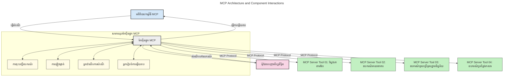
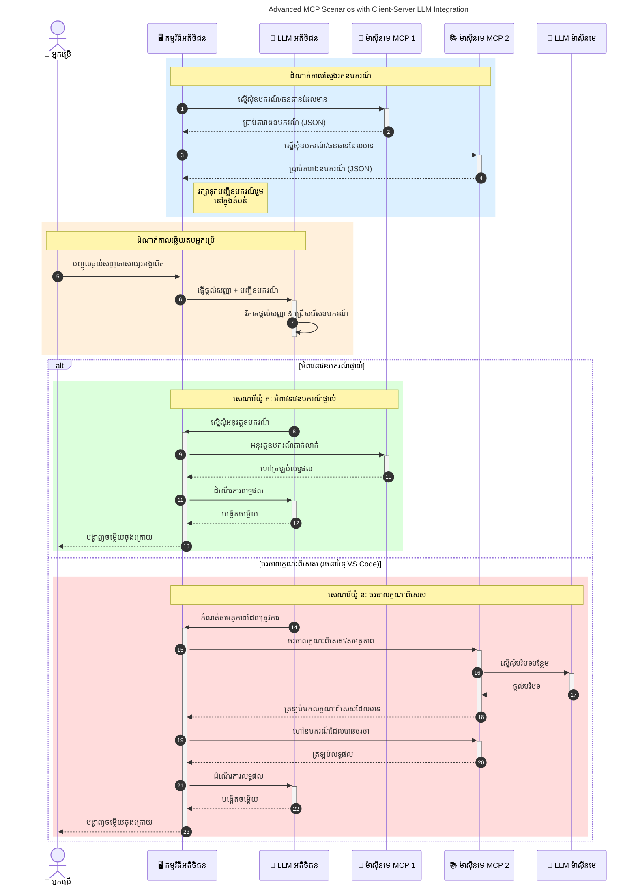

# ការណែនាំអំពីស្តង់ដារអង្គការម៉ូដែល (MCP): ហេតុអ្វីដែលវាសំខាន់សម្រាប់កម្មវិធី AI ដែលអាចពង្រីកបាន

[](https://youtu.be/agBbdiOPLQA)

_(ចុចរូបភាពខាងលើដើម្បីមើលវីដេអូមេរៀននេះ)_

កម្មវិធី AI ផលិតនូវអត្ថប្រយោជន៍ដ៏ល្អបំផុត ខណៈពេលដែលវាមានឱកាសឱ្យអ្នកប្រើប្រាស់អាចមានប្រតិកម្មទៅកម្មវិធីដោយប្រើប្រាស់​បញ្ជាក់ភាសាប្រពៃណី។ ទោះយ៉ាងណា ក្រោយពេលបានវិនិយោគពេលវេលា និងធនធានក្នុងកម្មវិធីទាំងនេះ អ្នកចង់ប្រាកដថា អ្នកអាចបញ្ចូលមុខងារ និងធនធានបានយ៉ាងងាយស្រួល ដូច្នេះវា​ងាយស្រួល​ពង្រីក​ កម្មវិធីរបស់អ្នក​អាចគ្របដណ្តប់បានលើនូវម៉ូដែលជាច្រើន និងអាចដោះស្រាយបញ្ហាត្រឺមត្រូវនានារបស់មូដែល។ ពិតជាការសាងសង់កម្មវិធី Gen AI គឺងាយស្រួល នៅដំបូង ប៉ុន្តែក្នុងពេលវេលាពួកវាកាន់តែធំធេង និងស្មុគស្មាញ អ្នកត្រូវចាប់ផ្តើមកំណត់ស្ថាបត្យកម្ម ហើយព្រោះជានិច្ច អ្នកប្រហែលជាត្រូវពឹងផ្អែកលើស្តង់ដារមួយដើម្បីធានាថាកម្មវិធីរបស់អ្នកត្រូវបានសាងសង់យ៉ាងតំរូវទ្រង់ទ្រាយពាក់ព័ន្ធ។ វានេះហៅថា MCP ជួយរៀបចំរបស់នានា និងផ្តល់ស្តង់ដា។

---

## **🔍 ស្តង់ដារអង្គការម៉ូដែល (MCP) គឺជាអ្វី?**

**ស្តង់ដារអង្គការម៉ូដែល (MCP)** គឺជា **ចំណុចប្រទាក់ស្តង់ដារបើកចំហ** ដែលអនុញ្ញាតឱ្យម៉ូដែលភាសាធំ (LLMs) ធ្វើប្រតិកម្មយ៉ាងរលូនជាមួយឧបករណ៍ខាងក្រៅ API និងប្រភពទិន្នន័យ។ វាបង្ហាញពីស្ថាបត្យកម្មស្តង់ដាដើម្បីបង្កើនមុខងារម៉ូដែល AI ក្រៅពីទិន្នន័យហ្វឹកហាត់ ដើម្បីធ្វើឱ្យប្រព័ន្ធ AI មានភាពច្បាស់លាស់ ពង្រីកបាននិងឆ្លើយតបបានល្អជាងមុន។

---

## **🎯 ហេតុអ្វីបានជាស្តង់ដារលើ AI គឺមានសារៈសំខាន់**

ខណៈពេលកម្មវិធី AI ផលិតកាន់តែស្មុគស្មាញ វាជាការសំខាន់ក្នុងការទទួលយកស្តង់ដារដែលធានាថា **អាចពង្រីកបាន, អាចពង្រីកមុខងារ, រក្សាទុកបានងាយស្រួល** និង **ជៀសវាងការលាប់ចំណាប់ខ្លួនពីអ្នកផ្គត់ផ្គង់**។ MCP ដោះស្រាយបញ្ហាទាំងនេះដោយ:

- បង្រួមការបញ្ចូលឧបករណ៍នានា និងម៉ូដែល
- កាត់បន្ថយដំណោះស្រាយបុគ្គលករណីមួយៗដែលងាយខូច
- អនុញ្ញាតឱ្យមានម៉ូដែលជាច្រើនពីអ្នកផ្គត់ផ្គង់ផ្សេងៗនៅក្នុងប្រព័ន្ធតែមួយ

**ចំណាំ:** ទោះបី MCP ទទួលបានការផ្សព្វផ្សាយថាជាស្តង់ដារបើកចំហ ក៏ប៉ុន្តែមិនមានផែនការណ៍ណាមួយក្នុងការស្តង់ដារ MCP តាមរយៈអង្គការស្តង់ដារដូចជា IEEE, IETF, W3C, ISO ឬអង្គការស្តង់ដារផ្សេងទៀតឡើយ។

---

## **📚 គោលបំណងសិក្សា**

នៅចុងអត្តបទនេះ អ្នក​នឹងអាច​ដូចតទៅ:

- កំណត់និយមន័យ **ស្តង់ដារអង្គការម៉ូដែល (MCP)** និងករណីការប្រើប្រាស់របស់វា
- យល់ដឹងពីរបៀបដែល MCP ស្តង់ដារប្រើប្រាស់ស័ក្តិសមរវាងម៉ូដែលនិងឧបករណ៍
- ស្គាល់ធាតុសំខាន់ៗនៃស្ថាបត្យកម្ម MCP
- ស្វែងយល់ពីការអនុវត្តពិតប្រាកដរបស់ MCP ក្នុងបរិបទសហគ្រាស និងការអភិវឌ្ឍន៍

---

## **💡 ហេតុអ្វីបានជា ស្តង់ដារអង្គការម៉ូដែល (MCP) ជាផលិតផលផ្លាស់ប្ដូរ**

### **🔗 MCP ដោះស្រាយបញ្ហាការបំបែកក្នុងប្រតិកម្ម AI**

មុនពេលមាន MCP ការ​លាយបញ្ចូលម៉ូដែលជាមួយឧបករណ៍ទាមទារឲ:

- កូដផ្ទាល់ខ្លួនសម្រាប់គូម៉ូដែល-ឧបករណ៍នីមួយៗ
- API មិនស្តង់ដារសម្រាប់អ្នកផ្គត់ផ្គង់នីមួយៗ
- ការបំបែកញឹកញាប់ដោយសារជួសជុល
- ភាពពិបាកក្នុងការបង្កើននៅពេលមានឧបករណ៍ច្រើន

### **✅ អត្ថប្រយោជន៍នៃការស្តង់ដារ MCP**

| **អត្ថប្រយោជន៍**            | **ការពណ៌នា**                                                               |
|------------------------------|------------------------------------------------------------------------------|
| ប្រតិបត្តិការសម្រួល          | LLMs ធ្វើការជាមួយឧបករណ៍ពីអ្នកផ្គត់ផ្គង់ផ្សេងៗបានយ៉ាងរលូន                 |
| ភាពស្របគ្នា                  | អាកប្បកម្មស្របគ្នារវាងវេទិកានានា និងឧបករណ៍                               |
| អាចប្រើឡើងវិញ              | ឧបករណ៍ដែលបានបង្កើតម្តងអាចប្រើឡើងវិញក្នុងគំរោងនិងប្រព័ន្ធផ្សេងៗ         |
| ល្បឿនអភិវឌ្ឍន៍រហ័ស          | កាត់បន្ថយពេលអភិវឌ្ឍដោយប្រើចំណុចប្រទាក់ស្តង់ដារ ផ្គុំសម្រាំងបានយ៉ាងងាយស្រួល        |

---

## **🧱 ពិពណ៌នាស្ថាបត្យកម្ម MCP កម្រិតខ្ពស់**

MCP អនុវត្តម៉ូដែល **client-server**, ដែលជា:

- **MCP Hosts** រត់ម៉ូដែល AI
- **MCP Clients** ចាប់ផ្តើមការស្នើសុំ
- **MCP Servers** ផ្តល់បរិបទ ឧបករណ៍ និងសមត្ថភាព

### **ធាតុសំខាន់ៗ:**

- **ធនធាន** – ទិន្នន័យថេរឬផ្លាស់ប្តូរសម្រាប់ម៉ូដែល  
- **បញ្ជាក់** – ការងារបន្តិចសម្រាប់ការបង្កើតដែលមានការណែនាំ  
- **ឧបករណ៍** – មុខងារប្រតិបត្តិដូចជាស្វែងរក ការគណនា  
- **ជម្រើស** – អាកប្បកម្មប្រតិបត្តិការចំហរយកតាមរយៈប្រតិកម្មស្ទូច (បានលុបចេញនៅ
    MCP `2026-07-28`; កម្មវិធីថ្មីគួរតែបញ្ចូលផ្ទាល់ជាមួយរ៉ូវីដែរម៉ូដែល LLM)

- **ការសុំប្រើ** – សំណើដែលសេវាកម្មរៀបចំសម្រាប់ការបញ្ចូលព័ត៌មានពីអ្នកប្រើ
- **មូលដ្ឋាន** – ទីតាំងប្រព័ន្ធឯកសារព័ត៌មានដែលពាក់ព័ន្ធជាមួយម៉ាស៊ីនម៉ាស៊ីនមួយ
    (បានលុបចេញនៅ MCP `2026-07-28`; ប្រើប្រាស់ប៉ារ៉ាម៉ែត្រឧបករណ៍, URI ធនធាន ឬ
    កំណត់រចនាសម្ព័ន្ធម៉ាស៊ីនមួយជំនួស)

### **ស្ថាបត្យកម្មស្តង់ដារ:**

MCP ប្រើស្ថាបត្យកម្មជាន់ពីរ:
- **ជាន់ទិន្នន័យ**: សារ JSON-RPC 2.0, ម៉ែតាដាតាគ្រាន់តែមួយការស្នើសុំ, ការរុករក និង
    គោលការណ៍ស្តង់ដារ
- **ជាន់ដឹកជញ្ជូន**: stdio សម្រាប់កម្រិត subprocess ទីតាំង និង Streamable HTTP សម្រាប់
    ម៉ាស៊ីនពីចម្ងាយ។ Streamable HTTP អាចប្រើបច្ចេកទេស SSE សម្រាប់ការឆ្លើយតបផ្ទាល់,
    ប៉ុន្តែការដឹកជញ្ជូន HTTP+SSE ពីមុននេះត្រូវបានលុបចេញ។

---

## របៀបដែលម៉ាស៊ីន MCP ដំណើរការ

ម៉ាស៊ីន MCP ប្រតិបត្តិការដូចខាងក្រោម:

- **ទ្រង់ទ្រាយសំណើ**:
    1. សំណើត្រូវបានចាប់ផ្តើមដោយអ្នកប្រើចុងខ្សែ ឬកម្មវិធីដែលធ្វើការតំណាង។
    2. **MCP Client** បញ្ជូនសំណើទៅកាន់ **MCP Host** ដែលគ្រប់គ្រង runtime ម៉ូដែល AI។
    3. **ម៉ូដែល AI** ទទួលការបញ្ជាក់ពីអ្នកប្រើ និងអាចស្នើសុំចូលប្រើឧបករណ៍ ឬទិន្នន័យខាងក្រៅតាមរយៈការហៅឧបករណ៍មួយឬច្រើន។
    4. **MCP Host** មិនមែនម៉ូដែលផ្ទាល់ទេ ទំនាក់ទំនងជាមួយ **MCP Server(s)** ដែលសមនឹងស្តង់ដាររួម។
- **មុខងារ MCP Host**:
    - **បញ្ជីឧបករណ៍**: ថែរក្សាបញ្ជីឧបករណ៍ដែលមាន និងសមត្ថភាពរបស់ពួកវា។
    - **ការផ្ទៀងផ្ទាត់សិទ្ធិ**: ផ្ទៀងផ្ទាត់សិទ្ធិនៃការចូលប្រើឧបករណ៍។
    - **អ្នកដំណើរការសំណើរ**: ដំណើរការសំណើឧបករណ៍ចូលពីម៉ូដែល។
    - **អ្នករៀបចំចម្លើយ**: រៀបចំចេញផលមុខងារឯកឧបករណ៍ក្នុងទ្រង់ទ្រាយដែលម៉ូដែលអាចយល់បាន។
- **ការប្រតិបត្តិសេវាកម្ម MCP Server**:
    - **MCP Host** បញ្ជូនហៅឧបករណ៍ទៅម៉ាស៊ីន **MCP Servers** មួយឬច្រើន ដែលមានមុខងារពិសេស (ដូចជា ស្វែងរក, គណនា, សួរព័ត៌មានក្នុងប្រព័ន្ធទិន្នន័យ)។
    - **MCP Servers** ដំណើរការប្រតិបត្តិការរបស់ពួកវា ហើយបង្វិលលទ្ធផលទៅ **MCP Host** ក្នុងទ្រង់ទ្រាយជាប់ជាមួយ។
    - **MCP Host** រៀបចំទ្រង់ទ្រាយ និងផ្ញើលទ្ធផលទៅ **ម៉ូដែល AI**។
- **បញ្ចប់ចម្លើយ**:
    - **ម៉ូដែល AI** បញ្ចូលលទ្ធផលឧបករណ៍ក្នុងចម្លើយចុងក្រោយ។
    - **MCP Host** ផ្ញើចម្លើយនេះត្រឡប់ទៅ **MCP Client** ដែលផ្តល់ឱ្យអ្នកប្រើចុងខ្សែ ឬកម្មវិធីហៅដំណើរការ។
    



## 👨‍💻 របៀបសង់ម៉ាស៊ីន MCP (ជាមួយឧទាហរណ៍)

ម៉ាស៊ីន MCP អនុញ្ញាតឱ្យអ្នកពង្រីកសមត្ថភាព LLM ដោយផ្តល់ទិន្នន័យ និងមុខងារ។ 

រៀបចំរួចហើយ? នេះគឺជាកុងត្រូល SDK ជាភាសា និង/ឬ stack ដើម្បីបង្កើតម៉ាស៊ីន MCP ងាយៗក្នុងភាសា/stack ផ្សេងៗ:

- **Python SDK**: https://github.com/modelcontextprotocol/python-sdk

- **TypeScript SDK**: https://github.com/modelcontextprotocol/typescript-sdk

- **Java SDK**: https://github.com/modelcontextprotocol/java-sdk

- **C#/.NET SDK**: https://github.com/modelcontextprotocol/csharp-sdk


## 🌍 ករណីប្រើប្រាស់ពិតប្រាកដសម្រាប់ MCP

MCP អាចអនុញាតឱ្យមានកាលបរិច្ឆេទអាចជាច្រើនដោយពង្រីកសមត្ថភាព AI:

| **កម្មវិធី**                 | **ការពណ៌នា**                                                               |
|-----------------------------|------------------------------------------------------------------------------|
| ការតភ្ជាប់ទិន្នន័យសហគ្រាស     | ភ្ជាប់ LLMs ទៅកាន់មូលដ្ឋានទិន្នន័យ, CRM, ឬឧបករណ៍ផ្ទៃក្នុង                       |
| ប្រព័ន្ធ Agentic AI           | អនុញ្ញាតឱ្យភ្នាក់ងារឯករាជ្យមានការចូលប្រើឧបករណ៍និងដំណើរការសម្រេចចិត្ត          |
| កម្មវិធីមូលដ្ឋានមុខងារច្រើន | ផ្ដួចផ្ដើមគ្នានូវអត្ថបទ រូបភាព និងសម្លេងនៅក្នុងកម្មវិធី AI តែមួយ                 |
| ការតភ្ជាប់ទិន្នន័យពេលវេលាពិត | នាំទិន្នន័យផ្សព្វផ្សាយជាសកម្មភាពទៅក្នុងប្រតិកម្ម AI សម្រាប់លទ្ធផលត្រឹមត្រូវ និងទាន់សម័យ        |


### 🧠 MCP = ស្តង់ដារមូលដ្ឋានសកលសម្រាប់ប្រតិកម្ម AI

ស្តង់ដារអង្គការម៉ូដែល (MCP) ធ្វើដំណើរជាស្តង់ដារសកលសម្រាប់ប្រតិកម្ម AI ដូចជាការស្តង់ដារភ្ជាប់ឧបករណ៍ USB-C សម្រាប់ឧបករណ៍ ធ្វើឱ្យវាមានចំណុចប្រទាក់ថេរដើម្បីអនុញ្ញាតម៉ូដែល (client) រួមបញ្ចូលយ៉ាងរលូនជាមួយឧបករណ៍និងផ្គត់ផ្គង់ទិន្នន័យពីក្រៅ (server)។ វាបំបាត់ការត្រូវការស្តង់ដារបុគ្គលនិងផ្ទាល់ខ្លួនសម្រាប់ API ឬប្រភពទិន្នន័យនីមួយៗ។

នៅក្រោម MCP ឧបករណ៍មានសមត្ថភាព MCP (ហៅថា MCP server) តាមស្តង់ដារស្របគ្នា។ ម៉ាស៊ីនទាំងនេះអាចបញ្ជីឧបករណ៍ ឬសកម្មភាពដែលពួកវាបង្ហាញ ហើយអនុវត្តសកម្មភាពទាំងនោះពេលដែលមានសំណើពីភ្នាក់ងារអេไอ។ វេទិកាភ្នាក់ងារអេไอដែលគាំទ្រ MCP អាចរកឃើញឧបករណ៍ដែលមាននៅម៉ាស៊ីននានា និងហៅវាតាមស្តង់ដារ។

### 💡 ជម្រះឱ្យអាចចូលដំណឹងសារព័ត៌មានបានយ៉ាងងាយស្រួល

មិនត្រឹមតែផ្តល់ឧបករណ៍ទេ MCP ក៏ជួយជម្រះឱ្យអាចចូលដំណឹងសារព័ត៌មានបានផងដែរ។ វាអនុញ្ញាតឲ្យកម្មវិធីផ្គត់ផ្គង់បរិបទទៅម៉ូដែលភាសាធំ ដោយភ្ជាប់ពួកវាទៅកាន់ប្រភពទិន្នន័យនានា។ ឧទាហរណ៍ ម៉ាស៊ីន MCP មួយអាចតំណាងឲ្យឃ្លាំងឯកសាររបស់ក្រុមហ៊ុន អនុញ្ញាតឲ្យភ្នាក់ងារយកព័ត៌មានពាក់ព័ន្ធបានតាមតម្រូវការ ម៉ាស៊ីនមួយទៀតអាចដំណើរការជាមួយសកម្មភាពជាក់លាក់ ដូចជា ផ្ញើអ៊ីមែល ឬធ្វើបច្ចុប្បន្នភាពកំណត់ត្រា។ ពីទិដ្ឋភាពភ្នាក់ងារ នេះគឺជាឧបករណ៍ដែលអាចប្រើប្រាស់—គ្រឿងបន្លាស់ខ្លះត្រឡប់ទិន្នន័យ (បរិបទចំណេះដឹង), ខ្លះអនុវត្តសកម្មភាព។ MCP គ្រប់គ្រងទាំងពីរយ៉ាងមានប្រសិទ្ធិភាព។

ភ្នាក់ងារដែលភ្ជាប់ទៅម៉ាស៊ីន MCP នេះ អាចរៀនពីសមត្ថភាពដែលម៉ាស៊ីនមាន និងទិន្នន័យដែលអាចចូលដំណឹងតាមរយៈទ្រង់ទ្រាយស្តង់ដា។ ការស្តង់ដាវានេះធ្វើឲ្យមានភាពបត់បែននៃភាពមានឧបករណ៍អាចប្រើបាន។ ឧទាហរណ៍ ការបន្ថែមម៉ាស៊ីន MCP ថ្មីទៅប្រព័ន្ធភ្នាក់ងារធ្វើឲ្យមុខងារ​របស់វាអាចប្រើបានភ្លាមៗ ដោយមិនចាំបាច់កែប្រែកូដបន្ថែម។

ការរួមបញ្ចូលស្មើភាពនេះសម្របសម្រួលជាមួយចរន្តដែលបង្ហាញក្នុងការគំនូរក្រោយ ដែលម៉ាស៊ីនផ្តល់ទាំងឧបករណ៍ និងចំណេះដឹងធានាពីការសហការយ៉ាងរលូនក្នុងប្រព័ន្ធ។

### 👉 ឧទាហរណ៍: ដំណោះស្រាយភ្នាក់ងារអាចពង្រីកបាន

```mermaid
---
title: Scalable Agent Solution with MCP
description: A diagram illustrating how a user interacts with an LLM that connects to multiple MCP servers, with each server providing both knowledge and tools, creating a scalable AI system architecture
---
graph TD
    User -->|ពាក្យបញ្ចូន| LLM
    LLM -->|ប្រតិកម្ម| User
    LLM -->|MCP| ServerA
    LLM -->|MCP| ServerB
    ServerA -->|ខ្សែភ្ជាប់សកល| ServerB
    ServerA --> KnowledgeA
    ServerA --> ToolsA
    ServerB --> KnowledgeB
    ServerB --> ToolsB

    subgraph ម៉ាស៊ីនមេ A
        KnowledgeA[ចំណេះដឹង]
        ToolsA[ឧបករណ៍]
    end

    subgraph ម៉ាស៊ីនមេ B
        KnowledgeB[ចំណេះដឹង]
        ToolsB[ឧបករណ៍]
    end
```
 កម្មវិធី Universal Connector អនុញ្ញាតឲ្យម៉ាស៊ីន MCP ផ្សព្វផ្សាយ និងចែករំលែកសមត្ថភាពគ្នា បាន ServerA ផ្ទេរបេសកកម្មទៅ ServerB ឬចូលប្រើឧបករណ៍ និងចំណេះដឹងរបស់វា។ វាជាការរួមបញ្ចូលឧបករណ៍ និងទិន្នន័យពីម៉ាស៊ីននានា សម្របសម្រួលជំនាញ និងរចនាសម្ព័ន្ធភ្នាក់ងារដែលអាចពង្រីកបាន និងមានម៉ូឌុល។ ដោយសារតែ MCP ស្ដង់ដារឧបករណ៍ វាអនុញ្ញាតឲ្យភ្នាក់ងារស្វែងរក និងបញ្ជូនសំណើរវិញទៅម៉ាស៊ីនដោយមិនចាំបាច់មានការចងខ្សែផ្ទាល់ខ្លួន។


ការរួមបញ្ចូលឧបករណ៍ និងចំណេះដឹង: អាចចូលប្រើឧបករណ៍ និងទិន្នន័យឆ្លើយតបពីម៉ាស៊ីននានា បានធានាការពង្រីក និងរចនាសម្ព័ន្ធវេទិកាភ្នាក់ងារដែលមានម៉ូឌុល។

### 🔄 លទ្ធភាព MCP សម្រាប់ស្ថានភាពអភិវឌ្ឍន៍ជាមួយ LLM នៅភាគី Client

លើសពីស្ថាបត្យកម្មមូលដ្ឋាន MCP មានស្ថានភាពអភិវឌ្ឍន៍ដែលភាគី client និង server ទាំងពីរចូលរួមមាន LLMs អនុញ្ញាតឲ្យមានប្រតិកម្មលំអិតជាងនេះ។ នៅក្នុងរូបភាពខាងក្រោម **Client App** អាចជាកម្មវិធី IDE ដែលមានឧបករណ៍ MCP ភ្ជាប់សម្រាប់ប្រើប្រាស់ដោយ LLM:



## 🔐 អត្ថប្រយោជន៍ជាក់ស្តែងនៃ MCP

នេះគឺជាអត្ថប្រយោជន៍ជាក់ស្តែងនៃការប្រើ MCP:

- **ភាពថ្មីទាន់សម័យ**: ម៉ូដែលអាចចូលដំណឹងព័ត៌មានថ្មីក្រៅពីទិន្នន័យហ្វឹកហាត់
- **ពង្រីកសមត្ថភាព**: ម៉ូដែលអាចប្រើឧបករណ៍ជំនាញពិសេសសម្រាប់ការងារដែលពួកវារីករាយ
- **កាត់បន្ថយការស្រមៃមិនត្រឹមត្រូវ**: ប្រភពទិន្នន័យខាងក្រៅផ្តល់ដីធ្វើត្រឹមត្រូវ
- **ភាពឯកជន**: ទិន្នន័យដែលមានសម្ងាត់អាចរក្សាទុកនៅជុំវិញបរិស្ថានមានសុវត្ថិភាព ដោយមិនចាំបាច់បញ្ចូលក្នុងបញ្ជាក់

## 📌 ចំណុចសំខាន់

ចំណុចសំខាន់ៗសម្រាប់ប្រើ MCP មានដូចតទៅ:

- **MCP** ស្តង់ដារបញ្ចូលវិធីដែលម៉ូដែល AI ប្រតិកម្មជាមួយឧបករណ៍និងទិន្នន័យ
- ផ្តល់លទ្ធភាព **ពង្រីក, ភាពស្របគ្នា និងប្រតិបត្តិការសម្របសម្រួល**
- MCP ជួយ **កាត់បន្ថយពេលអភិវឌ្ឍ បង្កើនឱកាសទុកចិត្ត និងពង្រីកសមត្ថភាពម៉ូដែល**
- រចនាសម្ព័ន្ធ client-server **អនុញ្ញាតឲ្យមានកម្មវិធី AI ដែលបត់បែន និងអាចពង្រីកបាន**

## 🧠 អនុវត្ត

សូមគិតអំពីកម្មវិធី AI ដែលអ្នកចាប់អារម្មណ៍ចង់បង្កើត។

- កម្មវិធីណាខ្លះផ្តល់ឧបករណ៍នៅខាងក្រៅ ឬទិន្នន័យ​អាចបង្កើនសមត្ថភាពរបស់វា?
- MCP នឹងធ្វើឲ្យការរួមបញ្ចូលខាងលើនេះ **ឆាប់រហ័ស និងទុកចិត្តបានកាន់តែងាយស្រួលយ៉ាងដូចម្តេច?**

## ឯកសារបន្ថែម

- [ឃ្លាំងរបស់ MCP នៅ GitHub](https://github.com/modelcontextprotocol)


## តើដូចម្តេចទៅបន្ទាប់

បន្ទាប់: [ជំពូក 1: យល់ដឹងចម្បង](../01-CoreConcepts/README.md)

---

<!-- CO-OP TRANSLATOR DISCLAIMER START -->
**ការបដិសេធ**:
ឯកសារនេះត្រូវបានបម្លែងភាសា ដោយប្រើសេវាបម្លែងភាសា AI [Co-op Translator](https://github.com/Azure/co-op-translator)។ ទោះយើងខ្ញុំមានក្តីប្រាថ្នាឱ្យបានច្បាស់លាស់ តែសូមយល់ដឹងថាការបម្លែងដោយស្វ័យប្រវត្តិក៏អាចមានកំហុសឬភាពមិនត្រឹមត្រូវ។ ឯកសារដើមជាភាសាទីតាំងគួរត្រូវបានគេប្រើជាប្រភពច្បាស់លាស់។ សម្រាប់ព័ត៌មានសំខាន់ៗ សូមណែនាំឱ្យប្រើប្រាស់ការប្រែដោយមនុស្សជំនាញ។ យើងខ្ញុំមិនទទួលខុសត្រូវចំពោះការយល់ច្រឡំ ឬការបកស្រាយខុសបន្ទាប់ពីការប្រើប្រាស់ការបម្លែងនេះនោះទេ។
<!-- CO-OP TRANSLATOR DISCLAIMER END -->