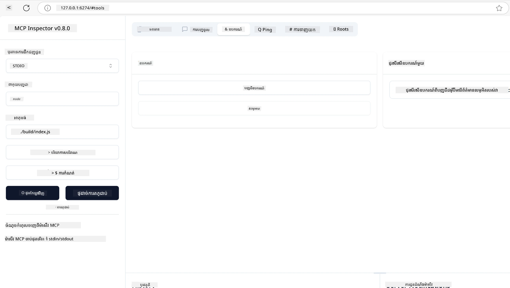
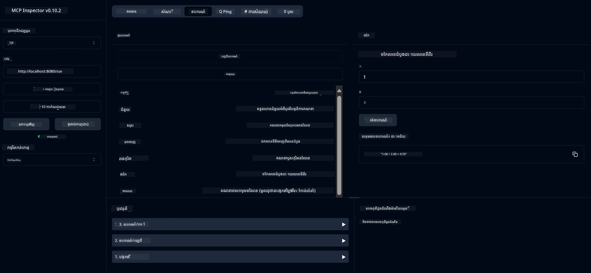
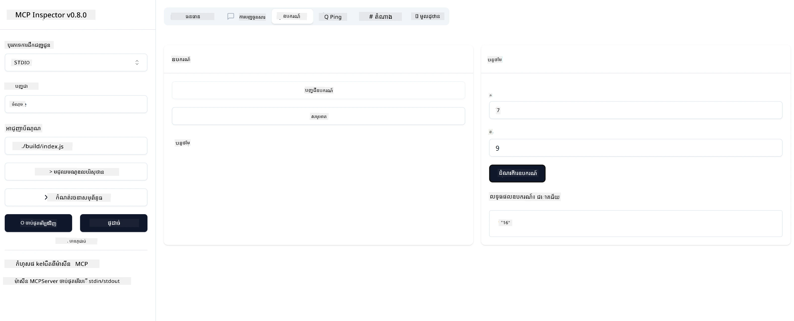

# ការចាប់ផ្តើមជាមួយ MCP

> [!NOTE]
> ឧទាហរណ៍ HTTP Java ក្នុងមេរៀននេះប្រើប្រាស់ការដឹកជញ្ជូន HTTP+SSE បុរាណ ហើយ
> គោលបំណងទៅឧបករណ៍ SDK ដែលសមស្របជាមួយ MCP `2025-11-25`។ សម្រាប់ម៉ាស៊ឺរផ្ទះក្រៅថ្មីៗ សូមប្រើប្រាស់
> ការដឹកជញ្ជូន Streamable HTTP `2026-07-28` ហើយពិនិត្យការគាំទ្រនៅក្នុង SDK របស់អ្នក។

ស្វាគមន៍មកកាន់ជំហានដំបូងរបស់អ្នកជាមួយព.protocol Context Model (MCP)! តើអ្នកថ្មីចំពោះ MCP ឬកំពុងស្វែងរកដើម្បីជ្រាបជ្រាលថែមទៀត មេរៀននេះនឹងដឹកនាំអ្នកឆ្លងកាត់ដំណើរការដំឡើង និងអភិវឌ្ឍមូលដ្ឋានដែលចាំបាច់។ អ្នកនឹងឃើញថា MCP អនុញ្ញាតឲ្យចូលរួមបានយ៉ាងស្រួលរវាងគំរូ AI និងកម្មវិធី និងរៀនពីរបៀបដែលអ្នកអាចរៀបចំបរិស្ថានរបស់អ្នកបានយ៉ាងលឿនសម្រាប់កសាង និងសាកល្បងដំណោះស្រាយដែលបំពាក់ដោយ MCP។

> TLDR; ប្រសិនបើអ្នកកំពុងបង្កើតកម្មវិធី AI អ្នកដឹងថាអ្នកអាចបន្ថែមឧបករណ៍ និងធនធានផ្សេងៗទៅ LLM (គំរូភាសាធំ) របស់អ្នក ដើម្បីធ្វើឲ្យ LLM ម្ចាស់ចំណេះដឹងប្រសើរឡើង។ ទោះបីជាអ្នកដាក់ទាំងឧបករណ៍និងធនធាននោះនៅលើម៉ាស៊ីនមេ ការអនុវត្តន៍និងសមត្ថភាពម៉ាស៊ីនមេអាចត្រូវបានប្រើប្រាស់ដោយអតិថិជនណាមួយដោយមាន/គ្មាន LLM។

## ទិដ្ឋភាពទូទៅ

មេរៀននេះផ្តល់ឱ្យនូវការណែនាំអាចអនុវត្តបានលើការត្រៀមបរិស្ថាន MCP និងការបង្កើតកម្មវិធី MCP ដំបូងរបស់អ្នក។ អ្នកនឹងរៀនពីរបៀបដំឡើងឧបករណ៍ និងសុទិដ្ធានត្រូវការ កសាងម៉ាស៊ីនមេ MCP មូលដ្ឋាន បង្កើតកម្មវិធីផ្ទះ ហើយសាកល្បងអនុវត្តន៍របស់អ្នក។

ព.protocol Context Model (MCP) គឺជា protocol បើកដែលធ្វើឲ្យមានស្តង់ដារទៅលើរបៀបទាក់ទង ផ្តល់ context ទៅ LLM។ សូមគិតថា MCP គឺដូចជា​ទំព័រភ្ជាប់ USB-C សម្រាប់កម្មវិធី AI — វាប្រើជារបៀបស្តង់ដារដើម្បីភ្ជាប់គំរូ AI ទៅកាន់ប្រភពទិន្នន័យ និងឧបករណ៍ផ្សេងៗ។

## គោលបំណងនៃការសិក្សា

នៅចុងបញ្ចប់នៃមេរៀននេះ អ្នកនឹងអាច:

- ត្រៀមបរិស្ថានអភិវឌ្ឍសម្រាប់ MCP ក្នុង C#, Java, Python, TypeScript និង Rust
- សាងសង់និងផ្សព្វផ្សាយម៉ាស៊ីនមេ MCP មូលដ្ឋានជាមួយលក្ខណៈពិសេសផ្ទាល់ខ្លួន (ធនធាន, ការស្នើសុំ, និងឧបករណ៍)
- បង្កើតកម្មវិធីផ្ទះដែលភ្ជាប់ទៅម៉ាស៊ីនមេ MCP
- សាកល្បងនិងកែតម្រូវកំហុសអនុវត្តន៍ MCP

## ការត្រៀមបរិស្ថាន MCP របស់អ្នក

មុននឹងចាប់ផ្តើមធ្វើការជាមួយ MCP វាមានសារៈសំខាន់ក្នុងការរៀបចំបរិស្ថានអភិវឌ្ឍន៍ ហើយយល់ដឹងពីដំណើរការធម្មតា។ ផ្នែកនេះនឹងណែនាំអ្នកឆ្លងកាត់ជំហានដំឡើងដំបូងដើម្បីធ្វើឲ្យការបំពេញនូវ MCP របស់អ្នករលូន។

### លក្ខខណ្ឌមុន

មុនចូលទៅរកការអភិវឌ្ឍ MCP សូមប្រាកដថាអ្នកមាន:

- **បរិស្ថានអភិវឌ្ឍន៍**: សម្រាប់ភាសាដែលអ្នកបានជ្រើស (C#, Java, Python, TypeScript, ឬ Rust)
- **IDE/Editor**: Visual Studio, Visual Studio Code, IntelliJ, Eclipse, PyCharm, ឬកម្មវិធីកូដទំនើបណាមួយ
- **Package Managers**: NuGet, Maven/Gradle, pip, npm/yarn, ឬ Cargo
- **កូនសោ API**: សម្រាប់សេវាកម្ម AI ដែលអ្នកមានបំណងប្រើនៅក្នុងកម្មវិធីផ្ទះរបស់អ្នក

## រចនាសម្ព័ន្ធម៉ាស៊ីនមេ MCP មូលដ្ឋាន

ម៉ាស៊ីនមេ MCP គឺភាគច្រើនរួមមាន:

- **ការកំណត់ម៉ាស៊ីនមេ**: កំណត់ជើងចាប់, ការផ្ទៀងផ្ទាត់, និងការកំណត់ផ្សេងៗ
- **ធនធាន**: ទិន្នន័យ និង context ដែលមានសម្រាប់ LLM
- **ឧបករណ៍**: មុខងារដែលគំរូអាចប្រើ
- **ការស្នើសុំ**: គំរូសម្រាប់បង្កើត ឬរៀបចំអត្ថបទ

ឧទាហរណ៍សាមញ្ញមួយក្នុងTypeScriptមានដូចខាងក្រោម៖

```typescript
import { McpServer, ResourceTemplate } from "@modelcontextprotocol/sdk/server/mcp.js";
import { StdioServerTransport } from "@modelcontextprotocol/sdk/server/stdio.js";
import { z } from "zod";

// បង្កើតម៉ាស៊ែវ MCP
const server = new McpServer({
  name: "Demo",
  version: "1.0.0"
});

// បន្ថែមឧបករណ៍បូក
server.tool("add",
  { a: z.number(), b: z.number() },
  async ({ a, b }) => ({
    content: [{ type: "text", text: String(a + b) }]
  })
);

// បន្ថែមធនធានស្វាគមន៍ថាប្រពៃណី
server.resource(
  "file",
  // ប៉ារ៉ាម៉ែត្រ 'list' គ្រប់គ្រងរបៀបធនធានបង្ហាញបញ្ជីឯកសារមាន។ ការកំណត់វាទៅជាអត់កំណត់ន័យនឹងបិទបញ្ជីសម្រាប់ធនធាននេះ។
  new ResourceTemplate("file://{path}", { list: undefined }),
  async (uri, { path }) => ({
    contents: [{
      uri: uri.href,
      text: `File, ${path}!`
    }]
  })
);

// បន្ថែមធនធានឯកសារដែលអានមាតិកាឯកសារ
server.resource(
  "file",
  new ResourceTemplate("file://{path}", { list: undefined }),
  async (uri, { path }) => {
    let text;
    try {
      text = await fs.readFile(path, "utf8");
    } catch (err) {
      text = `Error reading file: ${err.message}`;
    }
    return {
      contents: [{
        uri: uri.href,
        text
      }]
    };
  }
);

server.prompt(
  "review-code",
  { code: z.string() },
  ({ code }) => ({
    messages: [{
      role: "user",
      content: {
        type: "text",
        text: `Please review this code:\n\n${code}`
      }
    }]
  })
);

// ចាប់ផ្តើមទទួលសារនៅលើ stdin និងផ្ញើសារនៅលើ stdout
const transport = new StdioServerTransport();
await server.connect(transport);
```

ក្នុងកូដខាងលើ យើងបាន:

- នាំចClass ត្រូវការពី MCP TypeScript SDK។
- បង្កើតនិងកំណត់ម៉ាស៊ីនមេ MCP ថ្មីមួយ។
- ចុះបញ្ជីឧបករណ៍ផ្ទាល់ខ្លួន (`calculator`) ជាមួយម៉ោងក្រុមហ៊ុនអ្នកដំណើរការ។
- ចាប់ផ្តើមម៉ាស៊ីនមេដើម្បីស្តាប់សំណើ MCP ចូល។

## ការសាកល្បង និងកែតម្រូវកំហុស

មុនចាប់ផ្តើមសាកល្បងម៉ាស៊ីនមេ MCP របស់អ្នក វាមានសារៈសំខាន់ក្នុងការយល់ពីឧបករណ៍ដែលមាន និងវិធីសាស្រ្តល្អបំផុតសម្រាប់កែតម្រូវកំហុស។ ការសាកល្បងប្រសើរធានាថា ម៉ាស៊ីនមេរបស់អ្នកមានអាកប្បកិរិយាត្រឹមត្រូវ និងជួយអ្នកស្គាល់និងដោះស្បួនបញ្ហាបានយ៉ាងលឿន។ ផ្នែកក្រោមនេះបង្ហាញពីវិធីសាស្រ្តណែនាំសម្រាប់ផ្ទៀងផ្ទាត់ការអនុវត្ត MCP របស់អ្នក។

MCP ផ្ដល់ឧបករណ៍ជួយអ្នកសាកល្បង និងកែតម្រូវកំហុសម៉ាស៊ីនមេរបស់អ្នក:

- **ឧបករណ៍ Inspector**, ចំណុចផ្ទាំងក្រាហ្វិកនេះអនុញ្ញាតឲ្យអ្នកភ្ជាប់ទៅម៉ាស៊ីនមេនិងសាកល្បងឧបករណ៍ ការស្នើសុំ និងធនធានរបស់អ្នក។
- **curl**, អ្នកក៏អាចភ្ជាប់ទៅម៉ាស៊ីនមេរបស់អ្នកដោយប្រើឧបនយ៉ាណ៍បន្ទាត់ពាក្យបញ្ជា ដូចជា curl ឬអតិថិជនផ្សេងទៀតដែលអាចបង្កើត និងដំណើរការបញ្ជា HTTP។

### ការប្រើប្រាស់ MCP Inspector

[MCP Inspector](https://github.com/modelcontextprotocol/inspector) គឺជាឧបករណ៍សាកល្បងមានផ្ទាំងចុងក្រោយ ដែលជួយអ្នក:

1. **រកឃើញសមត្ថភាពម៉ាស៊ីនមេ**: រកឃើញធនធាន, ឧបករណ៍ និងការស្នើសុំដែលមានស្រាប់ដោយស្វ័យប្រវត្តិ
2. **សាកល្បងការប្រតិបត្តិឧបករណ៍**: សាកល្បងប៉ារ៉ាម៉ែត្រផ្សេងៗ ហើយមើលចម្លើយក្នុងពេលវេលាចាំបាច់
3. **មើលព័ត៌មានម៉ាស៊ីនមេ**: ពិនិត្យព័ត៌មានម៉ាស៊ីនមេ ស្កីម៉ា និងការកំណត់ផ្សេងៗ

```bash
# ឧទាហរណ៍ TypeScript, ការដំឡើង និងរត់ MCP Inspector
npx @modelcontextprotocol/inspector node build/index.js
```

នៅពេលអ្នករត់បញ្ជាទាំងនេះ MCP Inspector នឹងបើកផ្ទាំងគេហទំព័រផ្ទាល់ក្នុងកម្មវិធីរុករករបស់អ្នក។ អ្នកអាចរំពឹងថានឹងឃើញផ្ទាំងគ្រប់គ្រងបង្ហាញម៉ាស៊ីនមេ MCP ដែលបានចុះបញ្ជីឲ្យអ្នក, ឧបករណ៍, ធនធាន និងការស្នើសុំពាក់ព័ន្ធរបស់ពួកវា។ ផ្ទាំងនេះអាចអនុញ្ញាតឲ្យអ្នកសាកល្បងការប្រតិបត្តិឧបករណ៍ប្រកបដោយអន្តរកម្ម ពិនិត្យមើលព័ត៌មានម៉ាស៊ីនមេ ហើយមើលចម្លើយពេលវេលាចាំបាច់ ដែលធ្វើឲ្យបញ្ហាការផ្ទៀងផ្ទាត់ និងកែតម្រូវកំហុស MCP របស់អ្នកកាន់តែងាយស្រួល។

នេះជារូបថតអេក្រង់ដែលវាអាចមានរាងដូចជា៖



## បញ្ហាប្រឈមក្នុងការតំឡើង និងដំណោះស្រាយ

| បញ្ហា | ដំណោះស្រាយសក្តិសម |
|-------|-------------------|
| ការតភ្ជាប់ត្រូវបានបដិសេធ | ពិនិត្យមើលថាម៉ាស៊ីនមេដំណើរការហើយ និងឈុតខ្សែកាបត្រឹមត្រូវ |
| កំហុសក្នុងការប្រតិបត្តិឧបករណ៍ | ពិនិត្យការត្រួតពិនិត្យប៉ារ៉ាម៉ែត្រ និងការគ្រប់គ្រងកំហុស |
| កំហុសផ្ទៀងផ្ទាត់ការផ្ទៀងផ្ទាត់ | ពិនិត្យកូនសោ API និងការអនុញ្ញាត |
| កំហុសក្នុងការផ្ទៀងផ្ទាត់ស្កីម៉ា | ប្រាកដថាប៉ារ៉ាម៉ែត្រតំរូវតាមស្កីម៉ាដែលបានកំណត់ |
| ម៉ាស៊ីនមេមិនចាប់ផ្តើម | ពិនិត្យសំរាប់ការប្រកួតប្រជែងជើងចាប់ ឬគ្មានឯកសារដ៏ទាក់ទង |
| កំហុស CORS | កំណត់ក្បាលCORS ដែលត្រឹមត្រូវសម្រាប់សំណើរ ហ្រ្វក្រោយត្រូវបានគេហៅពីក្រៅដែន |
| បញ្ហាការផ្ទៀងផ្ទាត់ | ពិនិត្យសុពលភាពនៃនិមិត្តប័ត្រនិងការអនុញ្ញាត |

## ការអភិវឌ្ឍន៍ក្នុងតំបន់មូលដ្ឋាន

សម្រាប់ការអភិវឌ្ឍន៍ក្នុងតំបន់មូលដ្ឋាន និងសាកល្បង អ្នកអាចរត់ម៉ាស៊ីនមេ MCP ដោយផ្ទាល់លើម៉ាស៊ីនរបស់អ្នក៖

1. **ចាប់ផ្តើមដំណើរការម៉ាស៊ីនមេ**: រត់កម្មវិធីម៉ាស៊ីនមេ MCP របស់អ្នក
2. **កំណត់បណ្តាញ**: ប្រាកដថាម៉ាស៊ីនមេអាចចូលប្រើបានលើច្រកដែលបានរំពឹងទុក
3. **ភ្ជាប់អតិថិជន**: ប្រើ URL ភ្ជាប់ក្នុងតំបន់ដូចជា `http://localhost:3000`

```bash
# ឧទាហរណ៍៖ ក្រុមម៉ាស៊ីន MCP TypeScript កំពុងរត់ក្នុងតំបន់មូលដ្ឋាន
npm run start
# ម៉ាស៊ីនបម្រើកំពុងរត់នៅ http://localhost:3000
```

## សាងសង់ម៉ាស៊ីនមេ MCP ដំបូងរបស់អ្នក

យើងបានបង្រៀនពី [មូលដ្ឋានគ្រឹះ](../../01-CoreConcepts/README.md) នៅក្នុងមេរៀនមុន ឥឡូវនេះពេលវេលាដើម្បីអនុវត្តន៍ចំណេះដឹងនោះ។

### ម៉ាស៊ីនមេអាចធ្វើអ្វីបានខ្លះ

មុនពេលយើងចាប់ផ្តើមសរសេរកូដ មកម្លើតមើលជាថ្មីថាម៉ាស៊ីនមេអាចធ្វើអ្វីបានខ្លះ:

ម៉ាស៊ីនមេ MCP អាចសម្រាប់ឧទាហរណ៍:

- ចូលប្រើឯកសារ និងមូលដ្ឋានទិន្នន័យក្នុងតំបន់
- ភ្ជាប់ទៅ API ចម្រុះនៅចម្ងាយ
- ធ្វើគណនាប្រាក់
- បញ្ចូលជាមួយឧបករណ៍ និងសេវាកម្មផ្សេងទៀត
- ផ្ដល់ចំណុចប្រទាក់អ្នកប្រើសម្រាប់អន្តរាគមន៍

ល្អហើយ ឥឡូវនេះដែលយើងបានដឹងថាអ្វីដែលវាអាចធ្វើបាន តោះចាប់ផ្តើមសរសេរកូដ។

## ការហាត់ប្រាណ: ការបង្កើតម៉ាស៊ីនមេ

ដើម្បីបង្កើតម៉ាស៊ីនមេ អ្នកត្រូវតែអនុវត្តតាមជំហានខាងក្រោម៖

- ដំឡើង MCP SDK។
- បង្កើតគម្រោងមួយ ហើយរៀបចំរចនាសម្ព័ន្ធគម្រោង។
- សរសេរកូដម៉ាស៊ីនមេ។
- សាកល្បងម៉ាស៊ីនមេ។

### -1- បង្កើតគម្រោង

#### TypeScript

```sh
# បង្កើតថតគម្រោង និងចាប់ផ្តើមគម្រោង npm
mkdir calculator-server
cd calculator-server
npm init -y
```

#### Python

```sh
# បង្កើតថតគំរូ
mkdir calculator-server
cd calculator-server
# បើកថតក្នុង Visual Studio Code - ហួសចំនួននេះបើអ្នកកំពុងប្រើ IDE ផ្សេង
code .
```

#### .NET

```sh
dotnet new console -n McpCalculatorServer
cd McpCalculatorServer
```

#### Java

សម្រាប់ Java សូមបង្កើតគម្រោង Spring Boot៖

```bash
curl https://start.spring.io/starter.zip \
  -d dependencies=web \
  -d javaVersion=21 \
  -d type=maven-project \
  -d groupId=com.example \
  -d artifactId=calculator-server \
  -d name=McpServer \
  -d packageName=com.microsoft.mcp.sample.server \
  -o calculator-server.zip
```

ដកស្រង់ឯកសារ zip៖

```bash
unzip calculator-server.zip -d calculator-server
cd calculator-server
# ជាជម្រើស អាចលុបការប្រឡងដែលមិនបានប្រើប្រាស់បាន
rm -rf src/test/java
```

បន្ថែមការកំណត់ពេញលេញខាងក្រោមទៅឯកសារ *pom.xml* របស់អ្នក៖

```xml
<?xml version="1.0" encoding="UTF-8"?>
<project xmlns="http://maven.apache.org/POM/4.0.0"
    xmlns:xsi="http://www.w3.org/2001/XMLSchema-instance"
    xsi:schemaLocation="http://maven.apache.org/POM/4.0.0 http://maven.apache.org/xsd/maven-4.0.0.xsd">
    <modelVersion>4.0.0</modelVersion>
    
    <!-- Spring Boot parent for dependency management -->
    <parent>
        <groupId>org.springframework.boot</groupId>
        <artifactId>spring-boot-starter-parent</artifactId>
        <version>3.5.0</version>
        <relativePath />
    </parent>

    <!-- Project coordinates -->
    <groupId>com.example</groupId>
    <artifactId>calculator-server</artifactId>
    <version>0.0.1-SNAPSHOT</version>
    <name>Calculator Server</name>
    <description>Basic calculator MCP service for beginners</description>

    <!-- Properties -->
    <properties>
        <java.version>21</java.version>
        <maven.compiler.source>21</maven.compiler.source>
        <maven.compiler.target>21</maven.compiler.target>
    </properties>

    <!-- Spring AI BOM for version management -->
    <dependencyManagement>
        <dependencies>
            <dependency>
                <groupId>org.springframework.ai</groupId>
                <artifactId>spring-ai-bom</artifactId>
                <version>1.0.0-SNAPSHOT</version>
                <type>pom</type>
                <scope>import</scope>
            </dependency>
        </dependencies>
    </dependencyManagement>

    <!-- Dependencies -->
    <dependencies>
        <dependency>
            <groupId>org.springframework.ai</groupId>
            <artifactId>spring-ai-starter-mcp-server-webflux</artifactId>
        </dependency>
        <dependency>
            <groupId>org.springframework.boot</groupId>
            <artifactId>spring-boot-starter-actuator</artifactId>
        </dependency>
        <dependency>
         <groupId>org.springframework.boot</groupId>
         <artifactId>spring-boot-starter-test</artifactId>
         <scope>test</scope>
      </dependency>
    </dependencies>

    <!-- Build configuration -->
    <build>
        <plugins>
            <plugin>
                <groupId>org.springframework.boot</groupId>
                <artifactId>spring-boot-maven-plugin</artifactId>
            </plugin>
            <plugin>
                <groupId>org.apache.maven.plugins</groupId>
                <artifactId>maven-compiler-plugin</artifactId>
                <configuration>
                    <release>21</release>
                </configuration>
            </plugin>
        </plugins>
    </build>

    <!-- Repositories for Spring AI snapshots -->
    <repositories>
        <repository>
            <id>spring-milestones</id>
            <name>Spring Milestones</name>
            <url>https://repo.spring.io/milestone</url>
            <snapshots>
                <enabled>false</enabled>
            </snapshots>
        </repository>
        <repository>
            <id>spring-snapshots</id>
            <name>Spring Snapshots</name>
            <url>https://repo.spring.io/snapshot</url>
            <releases>
                <enabled>false</enabled>
            </releases>
        </repository>
    </repositories>
</project>
```

#### Rust

```sh
mkdir calculator-server
cd calculator-server
cargo init
```

### -2- បន្ថែមការពឹងផ្អែក

ឥឡូវនេះដែលអ្នកបានបង្កើតគម្រោងរួចហើយ មកបន្ថែមការពឹងផ្អែកបន្តិច៖

#### TypeScript

```sh
# ប្រសិនបើមិនទាន់បានដំឡើង អាចដំឡើង TypeScript ជាទូទៅ
npm install typescript -g

# ដំឡើង MCP SDK និង Zod សម្រាប់ផ្ទៀងផ្ទាត់ស្គីម៉ា
npm install @modelcontextprotocol/sdk zod
npm install -D @types/node typescript
```

#### Python

```sh
# បង្កើតបរិយាកាសវឺជ័រនិងដំឡើងការគាំទ្រ
python -m venv venv
venv\Scripts\activate
pip install "mcp[cli]"
```

#### Java

```bash
cd calculator-server
./mvnw clean install -DskipTests
```

#### Rust

```sh
cargo add rmcp --features server,transport-io
cargo add serde
cargo add tokio --features rt-multi-thread
```

### -3- បង្កើតឯកសារគម្រោង

#### TypeScript

បើកឯកសារ *package.json* ហើយបម្លែងមាតិកាទៅជា តាមខាងក្រោម ដើម្បីធានាថាអ្នកអាចសង់ និងរត់ម៉ាស៊ីនមេបាន៖

```json
{
  "name": "calculator-server",
  "version": "1.0.0",
  "main": "index.js",
  "type": "module",
  "scripts": {
    "build": "tsc",
    "start": "npm run build && node ./build/index.js",
  },
  "keywords": [],
  "author": "",
  "license": "ISC",
  "description": "A simple calculator server using Model Context Protocol",
  "dependencies": {
    "@modelcontextprotocol/sdk": "^1.16.0",
    "zod": "^3.25.76"
  },
  "devDependencies": {
    "@types/node": "^24.0.14",
    "typescript": "^5.8.3"
  }
}
```

បង្កើតឯកសារ *tsconfig.json* ជាមួយមាតិកាខាងក្រោម៖

```json
{
  "compilerOptions": {
    "target": "ES2022",
    "module": "Node16",
    "moduleResolution": "Node16",
    "outDir": "./build",
    "rootDir": "./src",
    "strict": true,
    "esModuleInterop": true,
    "skipLibCheck": true,
    "forceConsistentCasingInFileNames": true
  },
  "include": ["src/**/*"],
  "exclude": ["node_modules"]
}
```

បង្កើតថតសម្រាប់កូដប្រភពរបស់អ្នក៖

```sh
mkdir src
touch src/index.ts
```

#### Python

បង្កើតឯកសារ *server.py*

```sh
touch server.py
```

#### .NET

ដំឡើងកញ្ចប់ NuGet ត្រូវការ៖

```sh
dotnet add package ModelContextProtocol --prerelease
dotnet add package Microsoft.Extensions.Hosting
```

#### Java

សម្រាប់គម្រោង Java Spring Boot រចនាសម្ព័ន្ធគម្រោងត្រូវបានបង្កើតដោយស្វ័យប្រវត្តិ។

#### Rust

សម្រាប់ Rust ឯកសារ *src/main.rs* ត្រូវបានបង្កើតដោយលំនាំដើមពេលអ្នករត់ `cargo init`។ បើកឯកសារនិងលុបកូដលំនាំដើម។

### -4- សរសេរកូដម៉ាស៊ីនមេ

#### TypeScript

បង្កើតឯកសារ *index.ts* ហើយបន្ថែមកូដខាងក្រោម៖

```typescript
import { McpServer, ResourceTemplate } from "@modelcontextprotocol/sdk/server/mcp.js";
import { StdioServerTransport } from "@modelcontextprotocol/sdk/server/stdio.js";
import { z } from "zod";
 
// បង្កើតម៉ាស៊ីនមេ MCP
const server = new McpServer({
  name: "Calculator MCP Server",
  version: "1.0.0"
});
```

ឥឡូវនេះអ្នកមានម៉ាស៊ីនមេមួយ ប៉ុន្តែវាមិនអាចធ្វើអ្វីបានច្រើនទេ នៅពេលនេះមកជួសជុលវា។

#### Python

```python
# server.py
from mcp.server.fastmcp import FastMCP

# បង្កើតម៉ាស៊ីនមេ MCP
mcp = FastMCP("Demo")
```

#### .NET

```csharp
using Microsoft.Extensions.DependencyInjection;
using Microsoft.Extensions.Hosting;
using Microsoft.Extensions.Logging;
using ModelContextProtocol.Server;
using System.ComponentModel;

var builder = Host.CreateApplicationBuilder(args);
builder.Logging.AddConsole(consoleLogOptions =>
{
    // Configure all logs to go to stderr
    consoleLogOptions.LogToStandardErrorThreshold = LogLevel.Trace;
});

builder.Services
    .AddMcpServer()
    .WithStdioServerTransport()
    .WithToolsFromAssembly();
await builder.Build().RunAsync();

// add features
```

#### Java

សម្រាប់ Java បង្កើតមុខងារម៉ាស៊ីនមេស្នូល។ ជាដំបូងកែប្រែថ្នាក់កម្មវិធីសំខាន់៖

*src/main/java/com/microsoft/mcp/sample/server/McpServerApplication.java*:

```java
package com.microsoft.mcp.sample.server;

import org.springframework.ai.tool.ToolCallbackProvider;
import org.springframework.ai.tool.method.MethodToolCallbackProvider;
import org.springframework.boot.SpringApplication;
import org.springframework.boot.autoconfigure.SpringBootApplication;
import org.springframework.context.annotation.Bean;
import com.microsoft.mcp.sample.server.service.CalculatorService;

@SpringBootApplication
public class McpServerApplication {

    public static void main(String[] args) {
        SpringApplication.run(McpServerApplication.class, args);
    }
    
    @Bean
    public ToolCallbackProvider calculatorTools(CalculatorService calculator) {
        return MethodToolCallbackProvider.builder().toolObjects(calculator).build();
    }
}
```

បង្កើតសេវាកម្ម calculator *src/main/java/com/microsoft/mcp/sample/server/service/CalculatorService.java*:

```java
package com.microsoft.mcp.sample.server.service;

import org.springframework.ai.tool.annotation.Tool;
import org.springframework.stereotype.Service;

/**
 * Service for basic calculator operations.
 * This service provides simple calculator functionality through MCP.
 */
@Service
public class CalculatorService {

    /**
     * Add two numbers
     * @param a The first number
     * @param b The second number
     * @return The sum of the two numbers
     */
    @Tool(description = "Add two numbers together")
    public String add(double a, double b) {
        double result = a + b;
        return formatResult(a, "+", b, result);
    }

    /**
     * Subtract one number from another
     * @param a The number to subtract from
     * @param b The number to subtract
     * @return The result of the subtraction
     */
    @Tool(description = "Subtract the second number from the first number")
    public String subtract(double a, double b) {
        double result = a - b;
        return formatResult(a, "-", b, result);
    }

    /**
     * Multiply two numbers
     * @param a The first number
     * @param b The second number
     * @return The product of the two numbers
     */
    @Tool(description = "Multiply two numbers together")
    public String multiply(double a, double b) {
        double result = a * b;
        return formatResult(a, "*", b, result);
    }

    /**
     * Divide one number by another
     * @param a The numerator
     * @param b The denominator
     * @return The result of the division
     */
    @Tool(description = "Divide the first number by the second number")
    public String divide(double a, double b) {
        if (b == 0) {
            return "Error: Cannot divide by zero";
        }
        double result = a / b;
        return formatResult(a, "/", b, result);
    }

    /**
     * Calculate the power of a number
     * @param base The base number
     * @param exponent The exponent
     * @return The result of raising the base to the exponent
     */
    @Tool(description = "Calculate the power of a number (base raised to an exponent)")
    public String power(double base, double exponent) {
        double result = Math.pow(base, exponent);
        return formatResult(base, "^", exponent, result);
    }

    /**
     * Calculate the square root of a number
     * @param number The number to find the square root of
     * @return The square root of the number
     */
    @Tool(description = "Calculate the square root of a number")
    public String squareRoot(double number) {
        if (number < 0) {
            return "Error: Cannot calculate square root of a negative number";
        }
        double result = Math.sqrt(number);
        return String.format("√%.2f = %.2f", number, result);
    }

    /**
     * Calculate the modulus (remainder) of division
     * @param a The dividend
     * @param b The divisor
     * @return The remainder of the division
     */
    @Tool(description = "Calculate the remainder when one number is divided by another")
    public String modulus(double a, double b) {
        if (b == 0) {
            return "Error: Cannot divide by zero";
        }
        double result = a % b;
        return formatResult(a, "%", b, result);
    }

    /**
     * Calculate the absolute value of a number
     * @param number The number to find the absolute value of
     * @return The absolute value of the number
     */
    @Tool(description = "Calculate the absolute value of a number")
    public String absolute(double number) {
        double result = Math.abs(number);
        return String.format("|%.2f| = %.2f", number, result);
    }

    /**
     * Get help about available calculator operations
     * @return Information about available operations
     */
    @Tool(description = "Get help about available calculator operations")
    public String help() {
        return "Basic Calculator MCP Service\n\n" +
               "Available operations:\n" +
               "1. add(a, b) - Adds two numbers\n" +
               "2. subtract(a, b) - Subtracts the second number from the first\n" +
               "3. multiply(a, b) - Multiplies two numbers\n" +
               "4. divide(a, b) - Divides the first number by the second\n" +
               "5. power(base, exponent) - Raises a number to a power\n" +
               "6. squareRoot(number) - Calculates the square root\n" + 
               "7. modulus(a, b) - Calculates the remainder of division\n" +
               "8. absolute(number) - Calculates the absolute value\n\n" +
               "Example usage: add(5, 3) will return 5 + 3 = 8";
    }

    /**
     * Format the result of a calculation
     */
    private String formatResult(double a, String operator, double b, double result) {
        return String.format("%.2f %s %.2f = %.2f", a, operator, b, result);
    }
}
```

**មុខងារជាជម្រើសសម្រាប់សេវាកម្មដែលរួចរក្សាធ្វើការផលិត:**

បង្កើតកំណត់ការចាប់ផ្ដើម *src/main/java/com/microsoft/mcp/sample/server/config/StartupConfig.java*:

```java
package com.microsoft.mcp.sample.server.config;

import org.springframework.boot.CommandLineRunner;
import org.springframework.context.annotation.Bean;
import org.springframework.context.annotation.Configuration;

@Configuration
public class StartupConfig {
    
    @Bean
    public CommandLineRunner startupInfo() {
        return args -> {
            System.out.println("\n" + "=".repeat(60));
            System.out.println("Calculator MCP Server is starting...");
            System.out.println("SSE endpoint: http://localhost:8080/sse");
            System.out.println("Health check: http://localhost:8080/actuator/health");
            System.out.println("=".repeat(60) + "\n");
        };
    }
}
```

បង្កើតកម្មវិធីគ្រប់គ្រងសុខភាព *src/main/java/com/microsoft/mcp/sample/server/controller/HealthController.java*:

```java
package com.microsoft.mcp.sample.server.controller;

import org.springframework.http.ResponseEntity;
import org.springframework.web.bind.annotation.GetMapping;
import org.springframework.web.bind.annotation.RestController;
import java.time.LocalDateTime;
import java.util.HashMap;
import java.util.Map;

@RestController
public class HealthController {
    
    @GetMapping("/health")
    public ResponseEntity<Map<String, Object>> healthCheck() {
        Map<String, Object> response = new HashMap<>();
        response.put("status", "UP");
        response.put("timestamp", LocalDateTime.now().toString());
        response.put("service", "Calculator MCP Server");
        return ResponseEntity.ok(response);
    }
}
```

បង្កើតកម្មវិធីគ្រប់គ្រងករណីកើតឡើង *src/main/java/com/microsoft/mcp/sample/server/exception/GlobalExceptionHandler.java*:

```java
package com.microsoft.mcp.sample.server.exception;

import org.springframework.http.HttpStatus;
import org.springframework.http.ResponseEntity;
import org.springframework.web.bind.annotation.ExceptionHandler;
import org.springframework.web.bind.annotation.RestControllerAdvice;

@RestControllerAdvice
public class GlobalExceptionHandler {

    @ExceptionHandler(IllegalArgumentException.class)
    public ResponseEntity<ErrorResponse> handleIllegalArgumentException(IllegalArgumentException ex) {
        ErrorResponse error = new ErrorResponse(
            "Invalid_Input", 
            "Invalid input parameter: " + ex.getMessage());
        return new ResponseEntity<>(error, HttpStatus.BAD_REQUEST);
    }

    public static class ErrorResponse {
        private String code;
        private String message;

        public ErrorResponse(String code, String message) {
            this.code = code;
            this.message = message;
        }

        // អ្នកទទួលបាន
        public String getCode() { return code; }
        public String getMessage() { return message; }
    }
}
```

បង្កើតបដាផ្សាយផ្ទាល់ខ្លួន *src/main/resources/banner.txt*:

```text
_____      _            _       _             
 / ____|    | |          | |     | |            
| |     __ _| | ___ _   _| | __ _| |_ ___  _ __ 
| |    / _` | |/ __| | | | |/ _` | __/ _ \| '__|
| |___| (_| | | (__| |_| | | (_| | || (_) | |   
 \_____\__,_|_|\___|\__,_|_|\__,_|\__\___/|_|   
                                                
Calculator MCP Server v1.0
Spring Boot MCP Application
```

</details>

#### Rust

បន្ថែមកូដខាងក្រោមទៅកំពូលឯកសារ *src/main.rs*។ នេះនាំចូលបណ្ណាល័យ និងម៉ូឌុលដែលចាំបាច់សម្រាប់ម៉ាស៊ីនមេ MCP របស់អ្នក។

```rust
use rmcp::{
    handler::server::{router::tool::ToolRouter, tool::Parameters},
    model::{ServerCapabilities, ServerInfo},
    schemars, tool, tool_handler, tool_router,
    transport::stdio,
    ServerHandler, ServiceExt,
};
use std::error::Error;
```

ម៉ាស៊ីនមេ calculator នឹងមានរូបមន្តសាមញ្ញដែលអាចបូកលេខពីរចូលគ្នា។ សូមបង្កើត struct មួយសម្រាប់តំណាងសំណើ calculator។

```rust
#[derive(Debug, serde::Deserialize, schemars::JsonSchema)]
pub struct CalculatorRequest {
    pub a: f64,
    pub b: f64,
}
```

បន្ទាប់មក បង្កើត struct មួយសម្រាប់តំណាងម៉ាស៊ីនមេ calculator។ struct នេះនឹងផ្ទុកច្រកឧបករណ៍ ដែលប្រើសម្រាប់ចុះបញ្ជីឧបករណ៍។

```rust
#[derive(Debug, Clone)]
pub struct Calculator {
    tool_router: ToolRouter<Self>,
}
```

ឥឡូវនេះ យើងអាចអនុវត្តន៍ struct `Calculator` ដើម្បីបង្កើតឯកតាថ្មីនៃម៉ាស៊ីនមេ ហើយអនុវត្តឧបករណ៍ម៉ាស៊ីនមេដើម្បីផ្ដល់ព័ត៌មានម៉ាស៊ីនមេ។

```rust
#[tool_router]
impl Calculator {
    pub fn new() -> Self {
        Self {
            tool_router: Self::tool_router(),
        }
    }
}

#[tool_handler]
impl ServerHandler for Calculator {
    fn get_info(&self) -> ServerInfo {
        ServerInfo {
            instructions: Some("A simple calculator tool".into()),
            capabilities: ServerCapabilities::builder().enable_tools().build(),
            ..Default::default()
        }
    }
}
```

ចុងក្រោយ យើងត្រូវអនុវត្តមុខងារ main ដើម្បីចាប់ផ្តើមម៉ាស៊ីនមេ។ មុខងារនេះនឹងបង្កើតឯកតានៃ struct `Calculator` ហើយបម្រើឲ្យតាមការបញ្ចូល/បញ្ចេញស្តង់ដារ។

```rust
#[tokio::main]
async fn main() -> Result<(), Box<dyn Error>> {
    let service = Calculator::new().serve(stdio()).await?;
    service.waiting().await?;
    Ok(())
}
```

ម៉ាស៊ីនមេឥឡូវបានរៀបចំដើម្បីផ្ដល់ព័ត៌មានជាមូលដ្ឋានអំពីខ្លួនវា។ បន្ទាប់មក យើងនឹងបន្ថែមឧបករណ៍ដើម្បីកំណត់ការបូក។

### -5- ការបន្ថែមឧបករណ៍និងធនធាន

បន្ថែមឧបករណ៍ និងធនធានដោយបន្ថែមកូដខាងក្រោម៖

#### TypeScript

```typescript
server.tool(
  "add",
  { a: z.number(), b: z.number() },
  async ({ a, b }) => ({
    content: [{ type: "text", text: String(a + b) }]
  })
);

server.resource(
  "greeting",
  new ResourceTemplate("greeting://{name}", { list: undefined }),
  async (uri, { name }) => ({
    contents: [{
      uri: uri.href,
      text: `Hello, ${name}!`
    }]
  })
);
```

ឧបករណ៍របស់អ្នកទទួលប៉ារ៉ាម៉ែត្រ `a` និង `b` ហើយដំណើរការមុខងារដែលបង្កើតចម្លើយក្នុងរូបមន្ត:

```typescript
{
  contents: [{
    type: "text", content: "some content"
  }]
}
```

ធនធានរបស់អ្នកត្រូវបានចូលប្រើតាមខ្សែអក្សរ "greeting" ហើយទទួលប៉ារ៉ាម៉ែត្រ `name` ហើយបង្កើតចម្លើយស្រដៀងគ្នាជាមួយឧបករណ៍៖

```typescript
{
  uri: "<href>",
  text: "a text"
}
```

#### Python

```python
# បន្ថែមឧបករណ៍បូក
@mcp.tool()
def add(a: int, b: int) -> int:
    """Add two numbers"""
    return a + b


# បន្ថែមធនធានស្វាគមន៍ឌីណាមិច
@mcp.resource("greeting://{name}")
def get_greeting(name: str) -> str:
    """Get a personalized greeting"""
    return f"Hello, {name}!"
```

ក្នុងកូដខាងលើ យើងបាន:

- កំណត់ឧបករណ៍ `add` ដែលទទួលប៉ារ៉ាម៉ែត្រ `a` និង `b` ប្រភេទលេខគត់។
- បង្កើតធនធាន `greeting` ដែលទទួលប៉ារ៉ាម៉ែត្រ `name`។

#### .NET

បន្ថែមនេះទៅទៅឯកសារ Program.cs របស់អ្នក៖

```csharp
[McpServerToolType]
public static class CalculatorTool
{
    [McpServerTool, Description("Adds two numbers")]
    public static string Add(int a, int b) => $"Sum {a + b}";
}
```

#### Java

ឧបករណ៍បានបង្កើតរួចនៅជំហានមុនហើយ។

#### Rust

បន្ថែមឧបករណ៍ថ្មីនៅក្នុងប្លុក `impl Calculator`៖

```rust
#[tool(description = "Adds a and b")]
async fn add(
    &self,
    Parameters(CalculatorRequest { a, b }): Parameters<CalculatorRequest>,
) -> String {
    (a + b).to_string()
}
```

### -6- កូដចុងក្រោយ

មកបន្ថែមកូដចុងក្រោយដែលយើងត្រូវការ ដើម្បីម៉ាស៊ីនមេទៅចាប់ផ្តើមបាន៖

#### TypeScript

```typescript
// ចាប់ផ្តើមទទួលសារ​លើ stdin និង​ផ្ញើសារ​លើ stdout
const transport = new StdioServerTransport();
await server.connect(transport);
```

នេះជាកូដពេញលេញ៖

```typescript
// index.ts
import { McpServer, ResourceTemplate } from "@modelcontextprotocol/sdk/server/mcp.js";
import { StdioServerTransport } from "@modelcontextprotocol/sdk/server/stdio.js";
import { z } from "zod";

// បង្កើតម៉ាស៊ីនមេ MCP
const server = new McpServer({
  name: "Calculator MCP Server",
  version: "1.0.0"
});

// បន្ថែមឧបករណ៍បូក
server.tool(
  "add",
  { a: z.number(), b: z.number() },
  async ({ a, b }) => ({
    content: [{ type: "text", text: String(a + b) }]
  })
);

// បន្ថែមធនធានស្វាគមន៍អនុគមន៍
server.resource(
  "greeting",
  new ResourceTemplate("greeting://{name}", { list: undefined }),
  async (uri, { name }) => ({
    contents: [{
      uri: uri.href,
      text: `Hello, ${name}!`
    }]
  })
);

// ចាប់ផ្តើមទទួលសារ នៅលើ stdin និងផ្ញើសារ នៅលើ stdout
const transport = new StdioServerTransport();
server.connect(transport);
```

#### Python

```python
# server.py
from mcp.server.fastmcp import FastMCP

# បង្កើតម៉ាស៊ីនបម្រើ MCP
mcp = FastMCP("Demo")


# បន្ថែមឧបករណ៍បូក
@mcp.tool()
def add(a: int, b: int) -> int:
    """Add two numbers"""
    return a + b


# បន្ថែមធនធានស្វាគមន៍ឌីណាមិច
@mcp.resource("greeting://{name}")
def get_greeting(name: str) -> str:
    """Get a personalized greeting"""
    return f"Hello, {name}!"

# ឆាកអនុវត្តន៍​មេ - នេះ​ត្រូវការដើម្បីបើកម៉ាស៊ីនបម្រើ
if __name__ == "__main__":
    mcp.run()
```

#### .NET

បង្កើតឯកសារ Program.cs ជាមួយមាតិកាខាងក្រោម៖

```csharp
using Microsoft.Extensions.DependencyInjection;
using Microsoft.Extensions.Hosting;
using Microsoft.Extensions.Logging;
using ModelContextProtocol.Server;
using System.ComponentModel;

var builder = Host.CreateApplicationBuilder(args);
builder.Logging.AddConsole(consoleLogOptions =>
{
    // Configure all logs to go to stderr
    consoleLogOptions.LogToStandardErrorThreshold = LogLevel.Trace;
});

builder.Services
    .AddMcpServer()
    .WithStdioServerTransport()
    .WithToolsFromAssembly();
await builder.Build().RunAsync();

[McpServerToolType]
public static class CalculatorTool
{
    [McpServerTool, Description("Adds two numbers")]
    public static string Add(int a, int b) => $"Sum {a + b}";
}
```

#### Java

ថ្នាក់កម្មវិធីសំខាន់ពេញលេញរបស់អ្នកគួរត្រូវមានរូបរាងដូចខាងក្រោម៖

```java
// កម្មវិធី McpServerApplication.java
package com.microsoft.mcp.sample.server;

import org.springframework.ai.tool.ToolCallbackProvider;
import org.springframework.ai.tool.method.MethodToolCallbackProvider;
import org.springframework.boot.SpringApplication;
import org.springframework.boot.autoconfigure.SpringBootApplication;
import org.springframework.context.annotation.Bean;
import com.microsoft.mcp.sample.server.service.CalculatorService;

@SpringBootApplication
public class McpServerApplication {

    public static void main(String[] args) {
        SpringApplication.run(McpServerApplication.class, args);
    }
    
    @Bean
    public ToolCallbackProvider calculatorTools(CalculatorService calculator) {
        return MethodToolCallbackProvider.builder().toolObjects(calculator).build();
    }
}
```

#### Rust

កូដចុងក្រោយសម្រាប់ម៉ាស៊ីនមេ Rust គួរត្រូវមានរូបរាងដូចខាងក្រោម៖

```rust
use rmcp::{
    ServerHandler, ServiceExt,
    handler::server::{router::tool::ToolRouter, tool::Parameters},
    model::{ServerCapabilities, ServerInfo},
    schemars, tool, tool_handler, tool_router,
    transport::stdio,
};
use std::error::Error;

#[derive(Debug, serde::Deserialize, schemars::JsonSchema)]
pub struct CalculatorRequest {
    pub a: f64,
    pub b: f64,
}

#[derive(Debug, Clone)]
pub struct Calculator {
    tool_router: ToolRouter<Self>,
}

#[tool_router]
impl Calculator {
    pub fn new() -> Self {
        Self {
            tool_router: Self::tool_router(),
        }
    }
    
    #[tool(description = "Adds a and b")]
    async fn add(
        &self,
        Parameters(CalculatorRequest { a, b }): Parameters<CalculatorRequest>,
    ) -> String {
        (a + b).to_string()
    }
}

#[tool_handler]
impl ServerHandler for Calculator {
    fn get_info(&self) -> ServerInfo {
        ServerInfo {
            instructions: Some("A simple calculator tool".into()),
            capabilities: ServerCapabilities::builder().enable_tools().build(),
            ..Default::default()
        }
    }
}

#[tokio::main]
async fn main() -> Result<(), Box<dyn Error>> {
    let service = Calculator::new().serve(stdio()).await?;
    service.waiting().await?;
    Ok(())
}
```

### -7- សាកល្បងម៉ាស៊ីនមេ

ចាប់ផ្តើមម៉ាស៊ីនមេទៅជាមួយបញ្ជាទាំងនេះ៖

#### TypeScript

```sh
npm run build
```

#### Python

```sh
mcp run server.py
```

> ដើម្បីប្រើ MCP Inspector សូមប្រើ `mcp dev server.py` ដែលដោយស្វ័យប្រវត្តិបើក Inspector ហើយផ្ដល់និមិត្តសញ្ញាសមិទ្ធិការបញ្ជូនសំរាប់ proxy។ បើប្រើ `mcp run server.py` អ្នកត្រូវចាប់ផ្តើម Inspector ដោយដៃ និងកំណត់ការតភ្ជាប់។

#### .NET

សូមប្រាកដថាអ្នកនៅក្នុងថតគម្រោងរបស់អ្នក៖

```sh
cd McpCalculatorServer
dotnet run
```

#### Java

```bash
./mvnw clean install -DskipTests
java -jar target/calculator-server-0.0.1-SNAPSHOT.jar
```

#### Rust

រត់បញ្ជាទាំងនេះដើម្បីផ្លាស់ប្ដូររូបមន្តនិងដំណើរការម៉ាស៊ីនមេ៖

```sh
cargo fmt
cargo run
```

### -8- រ៉ាន់ដោយប្រើ inspector

Inspector គឺជាឧបករណ៍ល្អមួយដែលអាចចាប់ផ្តើមម៉ាស៊ីនមេរបស់អ្នក ហើយអនុញ្ញាតឲ្យអ្នកអន្តរជាតិជាមួយវា ដូច្នេះអ្នកអាចសាកល្បងឲ្យវាធ្វើការបាន។ ហាត់ចាប់ផ្តើមវា៖

> [!NOTE]
> វាអាចមើលទៅផ្សេងពីផ្នែក "command" ពីព្រោះវាមានបញ្ជាដើម្បីរត់ម៉ាស៊ីនមេទៅជាមួយ runtime ជាក់លាក់របស់អ្នក/

#### TypeScript

```sh
npx @modelcontextprotocol/inspector node build/index.js
```

ឬបន្ថែមវាទៅក្នុង *package.json* ដូចខាងក្រោមៈ `"inspector": "npx @modelcontextprotocol/inspector node build/index.js"` ហើយបន្ទាប់មករត់ `npm run inspector`

#### Python

Python បិទបង្ហាញឧបករណ៍ Node.js មួយហៅថា inspector។ អាចហៅឧបករណ៍នេះដូចខាងក្រោម៖

```sh
mcp dev server.py
```


ទោះបីជាយ៉ាងណា វាមិនអនុវត្តវិធីសាស្រ្តទាំងអស់ដែលមាននៅលើឧបករណ៍នោះទេ ដូច្នេះអ្នកត្រូវបានណែនាំឱ្យរត់ឧបករណ៍ Node.js ដោយផ្ទាល់ដូចខាងក្រោម៖

```sh
npx @modelcontextprotocol/inspector mcp run server.py
```

ប្រសិនបើអ្នកកំពុងប្រើឧបករណ៍ឬ IDE ដែលអនុញ្ញាតឱ្យអ្នកកំណត់ការបញ្ជា និងអាគុយម៉ង់សម្រាប់រត់ស្ព្រីប 
សូមប្រាកដថាត្រូវកំណត់ `python` នៅក្នុងវាល `Command` និង `server.py` ជា `Arguments`។ វានឹងធានាថាស្ព្រីបរត់បានត្រឹមត្រូវ។

#### .NET

ត្រូវប្រាកដថាអ្នកនៅក្នុងថតគម្រោងរបស់អ្នក៖

```sh
cd McpCalculatorServer
npx @modelcontextprotocol/inspector dotnet run
```

#### Java

ប្រាកដថាស្វ័យប្រវត្តិគណនាសម្បទារបស់អ្នកកំពុងរត់
បន្ទាប់មករត់កម្មវិធីស៊ើបអង្កេត៖

```cmd
npx @modelcontextprotocol/inspector
```

នៅក្នុងផ្ទាំងអ្នកស៊ើបអង្កេតបណ្តាញ៖

1. ជ្រើសរើស "SSE" ជាប្រភេទការដឹកជញ្ជូន
2. កំណត់ URL ទៅ៖ `http://localhost:8080/sse`
3. ចុច "Connect"



**ឥឡូវអ្នកបានភ្ជាប់ទៅម៉ាស៊ីនបម្រើដោយជោគជ័យ**
**ផ្នែកសាកល្បងម៉ាស៊ីនបម្រើ Java បានបញ្ចប់ហើយ**

ផ្នែកបន្ទាប់គឺអំពីការបរិច្ឆេទជាមួយម៉ាស៊ីនបម្រើ។

អ្នកគួរតែឃើញចំណុចប្រទាក់អ្នកប្រើដូចខាងក្រោម៖


1. ភ្ជាប់ទៅម៉ាស៊ីនបម្រើដោយជ្រើសប៊ូតុង Connect
  ពេលអ្នកភ្ជាប់ទៅម៉ាស៊ីនបម្រើ អ្នកគួរតែឃើញដូចខាងក្រោម៖

  

1. ជ្រើស "Tools" និង "listTools" អ្នកគួរតែឃើញ "Add" បង្ហាញឡើង ជ្រើស "Add" ហើយបញ្ចូលតម្លៃប៉ារ៉ាម៉ែត្រ។

  អ្នកគួរតែឃើញចម្លើយដូចខាងក្រោម នោះគឺលទ្ធផលពីឧបករណ៍ "add"៖

  

សូមអបអរសាទរ អ្នកបានគ្រប់គ្រងក្នុងការបង្កើត និងរត់ម៉ាស៊ីនបម្រើដំបូងរបស់អ្នកបានរួចរាល់ហើយ!

#### Rust

ដើម្បីរត់ម៉ាស៊ីនបម្រើ Rust ជាមួយនឹង MCP Inspector CLI សូមប្រើបញ្ជាខាងក្រោម៖

```sh
npx @modelcontextprotocol/inspector cargo run --cli --method tools/call --tool-name add --tool-arg a=1 b=2
```

### SDKs ផ្លូវការ

MCP ផ្តល់ជូន SDKs ផ្លូវការសម្រាប់ភាសាជាច្រើន៖

- [C# SDK](https://github.com/modelcontextprotocol/csharp-sdk) - រក្សាទុកជាគោលការណ៍រួមជាមួយ Microsoft
- [Java SDK](https://github.com/modelcontextprotocol/java-sdk) - រក្សាទុកជាគោលការណ៍រួមជាមួយ Spring AI
- [TypeScript SDK](https://github.com/modelcontextprotocol/typescript-sdk) - ការអនុវត្ត TypeScript ផ្លូវការ
- [Python SDK](https://github.com/modelcontextprotocol/python-sdk) - ការអនុវត្ត Python ផ្លូវការ
- [Kotlin SDK](https://github.com/modelcontextprotocol/kotlin-sdk) - ការអនុវត្ត Kotlin ផ្លូវការ
- [Swift SDK](https://github.com/modelcontextprotocol/swift-sdk) - រក្សាទុកជាគោលការណ៍រួមជាមួយ Loopwork AI
- [Rust SDK](https://github.com/modelcontextprotocol/rust-sdk) - ការអនុវត្ត Rust ផ្លូវការ

## ចំណុចសំខាន់ៗ

- ការតំឡើងបរិយាកាសអភិវឌ្ឍ MCP គឺមានភាពសាមញ្ញជាមួយ SDKs ពីភាសា
- ការបង្កើតម៉ាស៊ីនបម្រើ MCP ពាក់ព័ន្ធនឹងការបង្កើត និងចុះបញ្ជីឧបករណ៍ជាមួយស្តង់ដារschemaច្បាស់លាស់
- ការសាកល្បង និងពិនិត្យកំហុសមានសារៈសំខាន់សម្រាប់ការអនុវត្ត MCP ដែលទុកចិត្តបាន

## គំរូ

- [Java Calculator](../samples/java/calculator/README.md)
- [.NET Calculator](../../../../03-GettingStarted/samples/csharp)
- [JavaScript Calculator](../samples/javascript/README.md)
- [TypeScript Calculator](../samples/typescript/README.md)
- [Python Calculator](../../../../03-GettingStarted/samples/python)
- [Rust Calculator](../../../../03-GettingStarted/samples/rust)

## ការតែងចេញ

បង្កើតម៉ាស៊ីនបម្រើ MCP ងាយៗជាមួយឧបករណ៍ដែលអ្នកចូលចិត្ត៖

1. អនុវត្តឧបករណ៍ក្នុងភាសាដែលអ្នកចូលចិត្ត (.NET, Java, Python, TypeScript, ឬ Rust)។
2. កំណត់ប៉ារ៉ាម៉ែត្របញ្ចូល និងតម្លៃបញ្ជូនត្រឡប់។
3. រត់ឧបករណ៍ inspector ដើម្បីធានាថាម៉ាស៊ីនបម្រើដំណើរការត្រឹមត្រូវ។
4. សាកល្បងការអនុវត្តជាមួយបញ្ចូលប្លែកៗ។

## ដំណោះស្រាយ

[Solution](./solution/README.md)

## ប្រភពបន្ថែម

- [បង្កើត Agents ប្រើ Model Context Protocol នៅលើ Azure](https://learn.microsoft.com/azure/developer/ai/intro-agents-mcp)
- [Remote MCP ជាមួយ Azure Container Apps (Node.js/TypeScript/JavaScript)](https://learn.microsoft.com/samples/azure-samples/mcp-container-ts/mcp-container-ts/)
- [.NET OpenAI MCP Agent](https://learn.microsoft.com/samples/azure-samples/openai-mcp-agent-dotnet/openai-mcp-agent-dotnet/)

## អ្វីទៅបន្ទាប់

បន្ទាប់: [ការចាប់ផ្តើមជាមួយ MCP Clients](../02-client/README.md)

---

<!-- CO-OP TRANSLATOR DISCLAIMER START -->
**ការបដិសេធ**:
ឯកសារនេះត្រូវបានបម្លែងភាសា ដោយប្រើសេវាបម្លែងភាសា AI [Co-op Translator](https://github.com/Azure/co-op-translator)។ ទោះយើងខ្ញុំមានក្តីប្រាថ្នាឱ្យបានច្បាស់លាស់ តែសូមយល់ដឹងថាការបម្លែងដោយស្វ័យប្រវត្តិក៏អាចមានកំហុសឬភាពមិនត្រឹមត្រូវ។ ឯកសារដើមជាភាសាទីតាំងគួរត្រូវបានគេប្រើជាប្រភពច្បាស់លាស់។ សម្រាប់ព័ត៌មានសំខាន់ៗ សូមណែនាំឱ្យប្រើប្រាស់ការប្រែដោយមនុស្សជំនាញ។ យើងខ្ញុំមិនទទួលខុសត្រូវចំពោះការយល់ច្រឡំ ឬការបកស្រាយខុសបន្ទាប់ពីការប្រើប្រាស់ការបម្លែងនេះនោះទេ។
<!-- CO-OP TRANSLATOR DISCLAIMER END -->