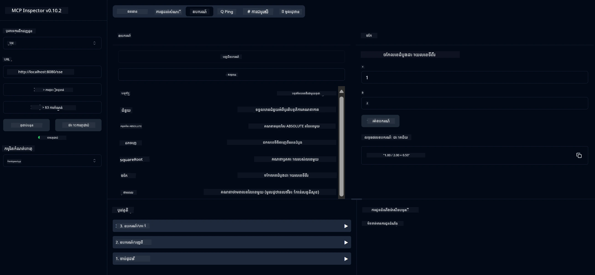

# សេវាកម្មគណនេយ្យមូលដ្ឋាន MCP

> [!NOTE]
> ដំណោះស្រាយ Java នេះប្រើការដឹកជញ្ជូន HTTP+SSE របស់មុន និងមានគោលដៅ SDK
> ដែលត្រូវគ្នាជាមួយ MCP `2025-11-25`។ វាត្រូវបានរក្សាទុកសម្រាប់កូដថ្នាក់សិក្សាដូចគ្នា;
> សែលម៉ាស៊ីនមេប៊នៅពីចម្ងាយថ្មីគួរតែប្រើការគាំទ្រ HTTP Streamable `2026-07-28`។

សេវាកម្មនេះផ្តល់ជូននូវប្រតិបត្តិការ​គណនេយ្យមូលដ្ឋានតាមរយៈ Model Context Protocol (MCP) ដោយប្រើ Spring Boot ជាមួយការដឹកជញ្ជូន WebFlux។ វាត្រូវបានរចនាឡើងជារូបមន្តងាយស្រួលសម្រាប់អ្នកចាប់ផ្តើមរៀនអំពីការអនុវត្ត MCP។

សម្រាប់ព័ត៌មានបន្ថែម សូមឃើញឯកសារចំណាំយោង [MCP Server Boot Starter](https://docs.spring.io/spring-ai/reference/api/mcp/mcp-server-boot-starter-docs.html)។


## ការប្រើប្រាស់សេវាកម្ម

សេវាកម្មបង្ហាញចំណុចប្រទាក់ API ខាងក្រោមតាមរយៈប្រព័ន្ធ MCP៖

- `add(a, b)`: បូកលេខពីរជាមួយគ្នា
- `subtract(a, b)`: ដកលេខទីពីរចេញពីលេខទីមួយ
- `multiply(a, b)`: គុណលេខពីរ
- `divide(a, b)`: បែងចែកលេខទីមួយដោយលេខទីពីរ (ពិនិត្យសូន្យ)
- `power(base, exponent)`: គណនាថាមពលរបស់លេខមួយ
- `squareRoot(number)`: គណនាឫសការេ (ពិនិត្យលេខអវិជ្ជមាន)
- `modulus(a, b)`: គណនាផលចាក់ចេញពេលបែងចែក
- `absolute(number)`: គណនាតម្លៃអាប់សូលុត

## ការទាមទារ

គម្រោងតម្រូវឲ្យមានការទាមទារសំខាន់ៗដូចតទៅ៖

```xml
<dependency>
    <groupId>org.springframework.ai</groupId>
    <artifactId>spring-ai-starter-mcp-server-webflux</artifactId>
</dependency>
```

## ការសាងសង្រ្គោះគម្រោង

សាងសង្រ្គោះគម្រោងដោយប្រើ Maven៖
```bash
./mvnw clean install -DskipTests
```

## ការរត់ម៉ាស៊ីនមេ

### ប្រើ Java

```bash
java -jar target/calculator-server-0.0.1-SNAPSHOT.jar
```

### ប្រើ MCP Inspector

MCP Inspector គឺជាឧបករណ៍ជួយដល់ការរួមផ្សំជាមួយសេវាកម្ម MCP។ ដើម្បីប្រើវាជាមួយសេវាគណនេយ្យនេះ៖

1. **ដំឡើងនិងរត់ MCP Inspector** នៅក្នុងផ្ទាំងបញ្ជារថ្មី៖
   ```bash
   npx @modelcontextprotocol/inspector
   ```

2. **ចូលប្រើ UI វេបសាយ** ដោយចុចលើ URL ដែលកម្មវិធីបង្ហាញ (ភាគច្រើន http://localhost:6274)

3. **កំណត់ការតភ្ជាប់**៖
   - ដាក់ប្រភេទដឹកជញ្ជូនជាទំរង់ "SSE"
   - ដាក់ URL ទៅកាន់ចំណុចស្នាក់របស់ម៉ាស៊ីនមេ SSE របស់អ្នក៖ `http://localhost:8080/sse`
   - ចុច "Connect"

4. **ប្រើឧបករណ៍**៖
   - ចុច "List Tools" ដើម្បីមើលប្រតិបត្តិការគណនេយ្យដែលមាន
   - ជ្រើសឧបករណ៍មួយហើយចុច "Run Tool" ដើម្បីបញ្ចេញប្រតិបត្តិការ



---

<!-- CO-OP TRANSLATOR DISCLAIMER START -->
**ការបដិសេធ**:
ឯកសារនេះត្រូវបានបម្លែងភាសា ដោយប្រើសេវាបម្លែងភាសា AI [Co-op Translator](https://github.com/Azure/co-op-translator)។ ទោះយើងខ្ញុំមានក្តីប្រាថ្នាឱ្យបានច្បាស់លាស់ តែសូមយល់ដឹងថាការបម្លែងដោយស្វ័យប្រវត្តិក៏អាចមានកំហុសឬភាពមិនត្រឹមត្រូវ។ ឯកសារដើមជាភាសាទីតាំងគួរត្រូវបានគេប្រើជាប្រភពច្បាស់លាស់។ សម្រាប់ព័ត៌មានសំខាន់ៗ សូមណែនាំឱ្យប្រើប្រាស់ការប្រែដោយមនុស្សជំនាញ។ យើងខ្ញុំមិនទទួលខុសត្រូវចំពោះការយល់ច្រឡំ ឬការបកស្រាយខុសបន្ទាប់ពីការប្រើប្រាស់ការបម្លែងនេះនោះទេ។
<!-- CO-OP TRANSLATOR DISCLAIMER END -->