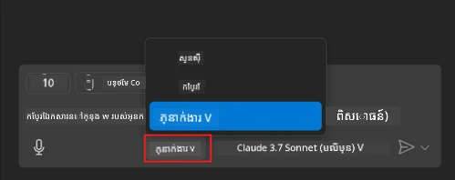
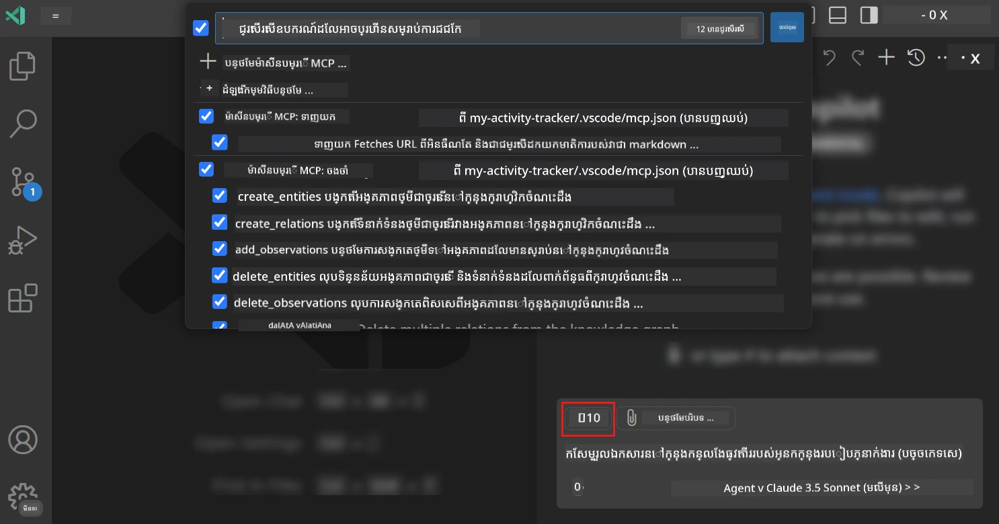
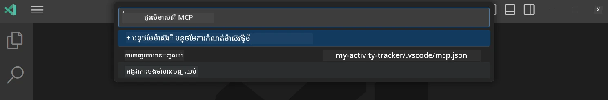
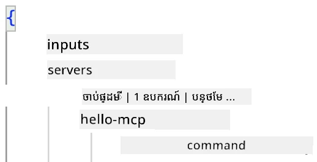
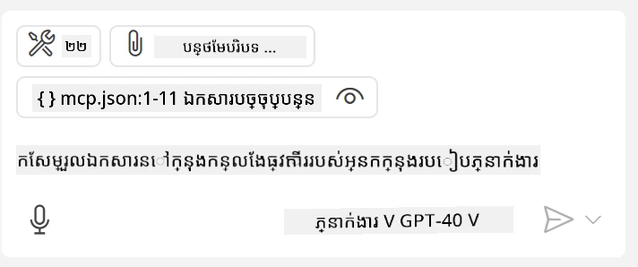
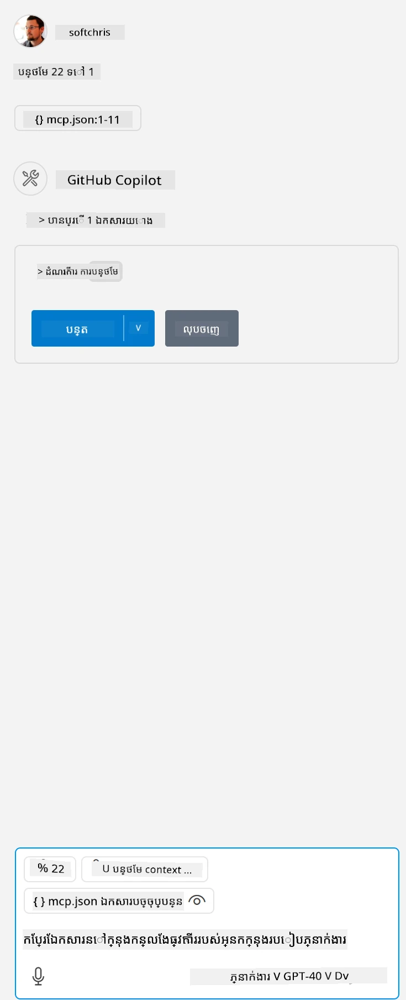

# ការប្រើប្រាស់ម៉ាស៊ីនបម្រើពីរបេក្ខជន GitHub Copilot Agent mode

Visual Studio Code និង GitHub Copilot អាចដំណើរការជាជាងគ្រូ និងប្រើប្រាស់ MCP Server។ ចំពោះមូលហេតុដែលចង់ធ្វើបែបនេះ អ្នកអាចសួរថា? មែនហើយ នៅពេលនេះមុខងារណាដែល MCP Server មានអាចប្រើបានពីក្នុង IDE របស់អ្នក។ សូមស្រមៃថាអ្នកបន្ថែមម៉ាស៊ីនបម្រើ MCP របស់ GitHub រួចនេះនឹងអនុញ្ញាតឱ្យគ្រប់គ្រង GitHub តាមរយៈបញ្ចូលចំពោះការចុចពាក្យបញ្ជាក្នុងterminal។ ឬសូមស្រមៃអ្វីក៏បានដែលអាចធ្វើឱ្យបទពិសោធន៍អ្នកអភិវឌ្ឍន៍របស់អ្នកល្អប្រសើរឡើង ដែលគ្រប់គ្រងដោយភាសាធម្មជាតិ។ ឥឡូវនេះអ្នកចាំបាច់ឃើញតម្លៃរបស់វា, ច្បាស់ហើយ?

## ទិដ្ឋភាពទូទៅ

មេរៀននេះគ្របដណ្តប់ពីវិធីដែលប្រើ Visual Studio Code និងរបប Agent របស់ GitHub Copilot ជាជាងគ្រូសម្រាប់ MCP Server របស់អ្នក។

## គោលបំណងអប់រំ

នៅចុងបញ្ចប់មេរៀននេះ អ្នកអាចធ្វើបាន:

- ប្រើ MCP Server តាមរយៈ Visual Studio Code។
- ដំណើរការមុខងារដូចជា ឧបករណ៍តាមរយៈ GitHub Copilot។
- កំណត់ Visual Studio Code ដើម្បីស្វែងរក និងគ្រប់គ្រង MCP Server របស់អ្នក។

## ការប្រើប្រាស់

អ្នកអាចគ្រប់គ្រងម៉ាស៊ីនបម្រើ MCP របស់អ្នកដោយវិធីសាស្ត្រចំរូងពីរបទ:

- ចំណុចប្រទាក់អ្នកប្រើ, អ្នកនឹងឃើញពីរបៀបធ្វើនេះនៅក្នុងជំពូកក្រោយ។
- terminal, អាចគ្រប់គ្រងអ្វីៗពីterminal ដោយប្រើ `code` executable៖

  ដើម្បីបន្ថែមម៉ាស៊ីនបម្រើ MCP ទៅក្នុងប្រវត្តិរូបអ្នកប្រើ សូមប្រើជម្រើសបញ្ជារ --add-mcp ហើយផ្តល់នូវការកំណត់ម៉ាស៊ីនបម្រើ JSON ក្នុងទ្រង់ទ្រាយ {\"name\":\"server-name\",\"command\":...}។

  ```
  code --add-mcp "{\"name\":\"my-server\",\"command\": \"uvx\",\"args\": [\"mcp-server-fetch\"]}"
  ```

### រូបថតអេក្រង់





មកនិយាយបន្ថែមពីរបៀបប្រើចំណុចប្រទាក់ឃ្លាំងទម្រង់នៅផ្នែកខាងក្រោយ។

## វិធីសាស្ត្រ

នេះគឺជាវិធីដែលយើងត្រូវអនុវត្តនៅកម្រិតខ្ពស់៖

- កំណត់ឯកសារមួយដើម្បីស្វែងរក MCP Server របស់យើង។
- ចាប់ផ្តើម/ភ្ជាប់ទៅម៉ាស៊ីនបម្រើដែលបាននិយាយដើម្បីឲ្យវាបង្ហាញមុខងារ។
- ប្រើមុខងារនោះតាមរយៈចំណុចប្រទាក់ GitHub Copilot Chat។

ល្អហើយ ឥឡូវនេះដែលយើងយល់អំពីដំណើរការនេះ សូមសាកល្បងប្រើ MCP Server តាម Visual Studio Code ក្នុងលំហាត់មួយ។

## លំហាត់៖ ការប្រើម៉ាស៊ីនបម្រើ

ក្នុងលំហាត់នេះ យើងនឹងកំណត់ Visual Studio Code ដើម្បីស្វែងរកម៉ាស៊ីនបម្រើ MCP របស់អ្នក ដូច្នេះវាអាចប្រើបានពីចំណុចប្រទាក់ GitHub Copilot Chat។

### -0- ជំហានមុន, បើកអនុញ្ញាតការស្វែងរក MCP Server

អ្នកប្រហែលជាត្រូវការបើកអនុញ្ញាតការស្វែងរកម៉ាស៊ីនបម្រើ MCP។

1. ទៅកាន់ `File -> Preferences -> Settings` ក្នុង Visual Studio Code។

1. ស្វែងរក "MCP" ហើយបើក `chat.mcp.discovery.enabled` នៅក្នុងឯកសារ settings.json។

### -1- បង្កើតឯកសារកំណត់

ចាប់ផ្តើមដោយបង្កើតឯកសារកំណត់នៅឫសគម្រោងរបស់អ្នក អ្នកត្រូវតែមានឯកសារដែលមានឈ្មោះ MCP.json ហើយដាក់វានៅក្នុងថត .vscode។ វាគួរតែមានរូបរាងដូចខាងក្រោម៖

```text
.vscode
|-- mcp.json
```

បន្ទាប់មក ចង់មើលរបៀបបន្ថែមបន្ទាត់ម៉ាស៊ីនបម្រើ។

### -2- កំណត់ម៉ាស៊ីនបម្រើ

បន្ថែមមាតិកាដូចខាងក្រោមទៅ *mcp.json*៖

```json
{
    "inputs": [],
    "servers": {
       "hello-mcp": {
           "command": "node",
           "args": [
               "build/index.js"
           ]
       }
    }
}
```

នេះគឺជាឧទាហរណ៍សាមញ្ញថា របៀបចាប់ផ្តើមម៉ាស៊ីនបម្រើដែលសរសេរបានក្នុង Node.js។ សម្រាប់ runtime ផ្សេងទៀត សូមបញ្ជាក់ពាក្យបញ្ជាត្រូវពេលចាប់ផ្តើមម៉ាស៊ីនដោយប្រើ `command` និង `args`។

### -3- ចាប់ផ្តើមម៉ាស៊ីនបម្រើ

ឥឡូវនេះដែលអ្នកបានបន្ថែមបន្ទាត់រួច សូមចាប់ផ្តើមម៉ាស៊ីនបម្រើ៖

1. រកទីតាំងបន្ទាត់របស់អ្នកក្នុង *mcp.json* ហើយប្រាកដថាអ្នកឃើញរូបតំណាង "ចាប់ផ្តើម"៖

    

1. ចុចរូបតំណាង "ចាប់ផ្តើម", អ្នកគួរតែឃើញរូបតំណាងឧបករណ៍នៅក្នុង GitHub Copilot Chat បន្ថែមចំនួនឧបករណ៍ដែលអាចប្រើបាន។ ប្រសិនបើអ្នកចុចរូបតំណាងឧបករណ៍នេះ អ្នកនឹងឃើញបញ្ជីឧបករណ៍ ដែលបានចុះបញ្ជី។ អ្នកអាចជ្រើសរើស/លុបជម្រើសឧបករណ៍ពាក់ព័ន្ធផ្អែកលើថាតើអ្នកចង់អោយ GitHub Copilot ប្រើវាជាពាក្យបរិបទ​​៖

  

1. ដើម្បីដំណើរការឧបករណ៍មួយ សូមវាយបញ្ចូលពាក្យដែលអ្នកដឹងថានឹងផ្គូផ្គងនឹងការពិពណ៌នាអំពីឧបករណ៍មួយនោះ ដូចជាបញ្ចូល "បន្ថែម 22 ទៅ 1"៖

  

  អ្នកគួរតែបានឃើញឆ្លើយតបថា 23។

## ការ អនុវត្ត

សូមសាកល្បងបន្ថែមបន្ទាត់ម៉ាស៊ីនបម្រើទៅក្នុង *mcp.json* របស់អ្នក ហើយប្រាកដថាអ្នកអាចចាប់ផ្តើម/បញ្ឈប់ម៉ាស៊ីនបម្រើបាន។ ដែលទៀតសូមប្រាកដថាអ្នកអាចទំនាក់ទំនងជាមួយឧបករណ៍នៅលើម៉ាស៊ីនបម្រើតាម GitHub Copilot Chat។

## ដំណោះស្រាយ

[ដំណោះស្រាយ](./solution/README.md)

## ចំណុចសំខាន់ដែលយកចិត្តទុកដាក់

ការយកចិត្តទុកដាក់ពីជំពូកនេះមានដូចខាងក្រោម៖

- Visual Studio Code ជាអតិថិជនដ៏ល្អមួយដែលអនុញ្ញាតឱ្យអ្នកប្រើ MCP Servers និងឧបករណ៍របស់ពួកវាច្រើន។
- ចំណុចប្រទាក់ GitHub Copilot Chat គឺជាទីតាំងដែលអ្នកធ្វើអន្តរាគមន៍ជាមួយម៉ាស៊ីនបម្រើ។
- អ្នកអាចបញ្ចូលព័ត៌មានចូលដូចជា API keys ដែលអាចផ្ញើទៅ MCP Server នៅពេលកំណត់បន្ទាត់ម៉ាស៊ីនបម្រើក្នុងឯកសារ *mcp.json*។

## គំរូ

- [កម្មវិធីគណនា Java](../samples/java/calculator/README.md)
- [កម្មវិធីគណនា .Net](../../../../03-GettingStarted/samples/csharp)
- [កម្មវិធីគណនា JavaScript](../samples/javascript/README.md)
- [កម្មវិធីគណនា TypeScript](../samples/typescript/README.md)
- [កម្មវិធីគណនា Python](../../../../03-GettingStarted/samples/python)

## ធនធានបន្ថែម

- [ឯកសារ Visual Studio](https://code.visualstudio.com/docs/copilot/chat/mcp-servers)

## តើត្រូវធ្វើយ៉ាងដូចម្តេចបន្ត

- បន្ទាប់: [បង្កើតមាស៊ីនបម្រើ stdio](../05-stdio-server/README.md)

---

<!-- CO-OP TRANSLATOR DISCLAIMER START -->
**ការបដិសេធ**:
ឯកសារនេះត្រូវបានបម្លែងភាសា ដោយប្រើសេវាបម្លែងភាសា AI [Co-op Translator](https://github.com/Azure/co-op-translator)។ ទោះយើងខ្ញុំមានក្តីប្រាថ្នាឱ្យបានច្បាស់លាស់ តែសូមយល់ដឹងថាការបម្លែងដោយស្វ័យប្រវត្តិក៏អាចមានកំហុសឬភាពមិនត្រឹមត្រូវ។ ឯកសារដើមជាភាសាទីតាំងគួរត្រូវបានគេប្រើជាប្រភពច្បាស់លាស់។ សម្រាប់ព័ត៌មានសំខាន់ៗ សូមណែនាំឱ្យប្រើប្រាស់ការប្រែដោយមនុស្សជំនាញ។ យើងខ្ញុំមិនទទួលខុសត្រូវចំពោះការយល់ច្រឡំ ឬការបកស្រាយខុសបន្ទាប់ពីការប្រើប្រាស់ការបម្លែងនេះនោះទេ។
<!-- CO-OP TRANSLATOR DISCLAIMER END -->