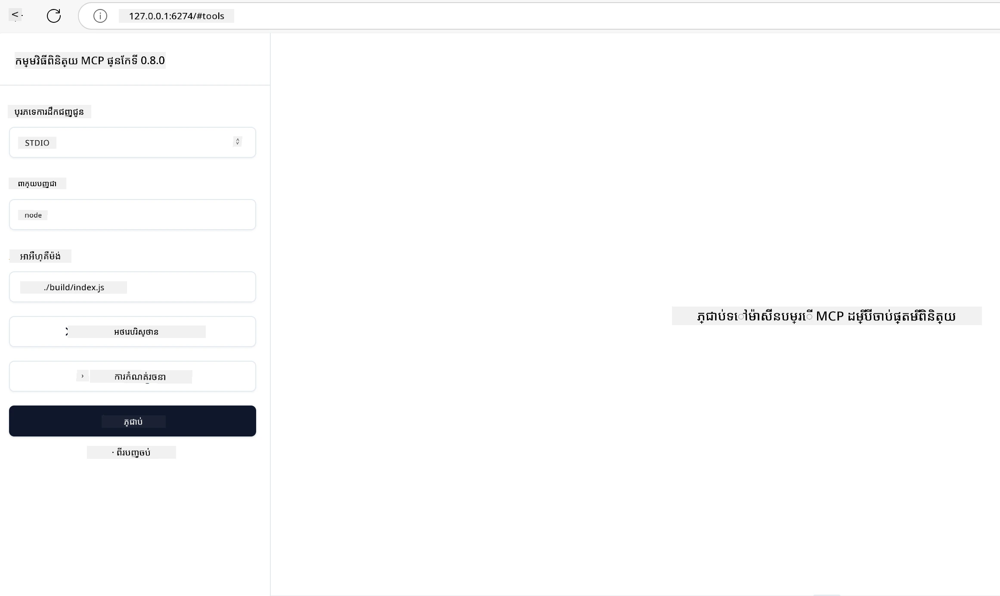

## ការធ្វើតេស្ត និងកំណត់ខុសត្រូវ

មុនពេល你ចាប់ផ្តើមធ្វើតេស្តម៉ាស៊ីនបម្រើ MCP របស់អ្នក វាជារឿងសំខាន់ក្នុងការយល់ដឹងពីឧបករណ៍មានស្រាប់ និងអនុវត្តន៍ល្អបំផុតសម្រាប់កំណត់ខុសត្រូវ។ ការធ្វើតេស្តដែលមានប្រសិទ្ធភាពធានាថា ម៉ាស៊ីនបម្រើមានចលនាតាមដែលបានរំពឹងទុក ហើយជួយអ្នកកំណត់អត្តសញ្ញាណនិងដោះស្រាយបញ្ហាដោយរហ័ស។ ផ្នែកខាងក្រោមនឹងបង្ហាញពីវិធីសាស្រ្តណែនាំសម្រាប់ផ្ទៀងផ្ទាត់ការអនុវត្ត MCP របស់អ្នក។

## សង្ខេប

មេរៀននេះគ្របដណ្តប់ពីរបៀបជ្រើសរើសវិធីសាស្រ្តតេស្តដែលត្រឹមត្រូវ និងឧបករណ៍តេស្តមានប្រសិទ្ធភាពបំផុត។

## គោលដៅការសិក្សា

នៅចុងបញ្ចប់មេរៀននេះ អ្នកនឹងអាចៈ

- ពិពណ៌នាពីវិធីសាស្រ្តផ្សេងៗសម្រាប់ការធ្វើតេស្ត។
- ប្រើឧបករណ៍ផ្សេងៗដើម្បីធ្វើតេស្តកូដរបស់អ្នកបានយូរអង្វែង។


## ការធ្វើតេស្តម៉ាស៊ីនបម្រើ MCP

MCP ផ្តល់ឧបករណ៍ជួយអ្នកធ្វើតេស្ត និងកំណត់ខុសត្រូវម៉ាស៊ីនបម្រើរបស់អ្នក៖

- **MCP Inspector**៖ ឧបករណ៍បញ្ជារបញ្ជាត្រូវដែលអាចប្រើបានជារៀង as CLI និងជាឧបករណ៍មើលរូបភាពផងដែរនៅលើកញ្ចក់។
- **ការធ្វើតេស្តដោយដៃ**៖ អ្នកអាចប្រើឧបករណ៍ដូចជា curl ជាជម្រើសក្នុងការបញ្ជូនសំណើវេបសាយ ប៉ុន្តែឧបករណ៍ណាមួយដែលអាចប្រើ HTTP បានក៏អាចប្រើបានដែរ។
- **ការធ្វើតេស្តឯកតា**៖ អាចប្រើចំណាត់ថ្នាក់អ្នកចូលចិត្តសម្រាប់ធ្វើតេស្តលក្ខណៈនៃម៉ាស៊ីនបម្រើនិងម៉ាស៊ីនអតិថិជន។

### ការប្រើប្រាស់ MCP Inspector

យើងបានពិពណ៌នាអំពីការប្រើប្រាស់ឧបករណ៍នេះនៅក្នុងមេរៀនមុនៗ ប៉ុន្តែតោះនិយាយខ្លះនៅចំណុចកំពូល។ នេះគឺជាឧបករណ៍ដែលបានបង្កើតជាមួយ Node.js ហើយអ្នកអាចប្រើវាដោយហៅកម្មវិធី `npx` ដែលនឹងទាញយកហើយដំឡើងឧបករណ៍នេះបណ្តោះអាសន្ន ហើយវានឹងសម្អាតខ្លួនឯងនៅពេលបញ្ចប់ការប្រតិបត្តិសំណើររបស់អ្នក។

[MCP Inspector](https://github.com/modelcontextprotocol/inspector) ជួយអ្នក៖

- **ស្វែងរកសមត្ថភាពម៉ាស៊ីនបម្រើ**៖ កំណត់ដោយស្វ័យប្រវត្តិក្នុងធនធាន មានឧបករណ៍ និងបង្ហាញអំពីការផ្គាប់ផ្សំនានា
- **សាកល្បងការប្រតិបត្តិឧបករណ៍**៖ សាកល្បងប៉ារ៉ាម៉ែត្រផ្សេងៗ និងមើលចម្លើយដោយពេលពិត
- **មើលព័ត៌មានផ្ទាល់ខ្លួនម៉ាស៊ីនបម្រើ**៖ ពិនិត្យព័ត៌មានម៉ាស៊ីនបម្រើ ស្កីម និងការកំណត់រចនាសម្ព័ន្ធ

ការប្រតិបត្តិអ្នកចម្លងឧបករណ៍នៅខាងលើមានរូបរាងដូចខាងក្រោម៖

```bash
npx @modelcontextprotocol/inspector node build/index.js
```

អ៊ឹនណារីសនៃការបញ្ជារនេះចាប់ផ្តើម MCP និងចំហម្លុងមើលរូបភាព រួចបើកមុខងារនៅលើកម្មវិធីវេបសាយក្នុងកម្មវិធីរុករករបស់អ្នក។ អ្នកអាចរំពឹងថានឹងឃើញផ្ទាំងគ្រប់គ្រងបង្ហាញម៉ាស៊ីនបម្រើ MCP ដែលបានចុះបញ្ជី រួមមានឧបករណ៍ធនធាន និងការផ្គាប់ផ្សំដែលអាចប្រើបាន។ មុខងារ UI នេះអនុញ្ញាតឱ្យអ្នកធ្វើតេស្តមុខងារឧបករណ៍យ៉ាងចលាចលមើល, ពិនិត្យ metadata ម៉ាស៊ីនបម្រើ និងទទួលបានចម្លើយពេលពិត ធ្វើឲ្យអាចដាក់ពិនិត្យនិងកំណត់កំហុសការអនុវត្ត MCP របស់អ្នកបានយ៉ាងងាយស្រួល។

រូបរាងវាមានដូចជា៖ 

អ្នកក៏អាចបើកឧបករណ៍នេះនៅម៉ូដ CLI ដោយបន្ថែម attribute `--cli`។ ខាងក្រោមជាគំរូរបស់ការប្រើម៉ូដ "CLI" ដែលបង្ហាញឧបករណ៍ទាំងអស់នៅលើម៉ាស៊ីនបម្រើ៖

```sh
npx @modelcontextprotocol/inspector --cli node build/index.js --method tools/list
```

### ការធ្វើតេស្តដោយដៃ

លើសពីការបើកឧបករណ៍ inspector ដើម្បីធ្វើតេស្តសមត្ថភាពម៉ាស៊ីនបម្រើ វិធីសាស្រ្តដូចមួយទៀតគឺការបើកម៉ាស៊ីនអតិថិជនដែលមានសមត្ថភាពប្រើ HTTP ដូចជា curl។

ជាមួយ curl អ្នកអាចធ្វើតេស្តម៉ាស៊ីនបម្រើ MCP ត្រង់តាមការបញ្ជូនសំណើ HTTP៖

```bash
# ឧទាហរណ៍៖ ដំណើរការилип បច្ចេកវិទ្យាសេវាកម្ម
curl http://localhost:3000/v1/metadata

# ឧទាហរណ៍៖ អនុវត្តឧបករណ៍មួយ
curl -X POST http://localhost:3000/v1/tools/execute \
  -H "Content-Type: application/json" \
  -d '{"name": "calculator", "parameters": {"expression": "2+2"}}'
```

ដូចដែលអ្នកអាចឃើញពីការប្រើប្រាស់ curl ខាងលើ អ្នកប្រើសំណើ POST ដើម្បីហៅឧបករណ៍ដោយបញ្ចូលទិន្ន្ន័យដែលមានឈ្មោះឧបករណ៍ និងប៉ារ៉ាម៉ែត្រ។ ប្រើរបៀបដែលសមស្របសម្រាប់អ្នក។ ឧបករណ៍ CLI ទូទៅមានល្បឿនប្រើប្រាស់លឿន និងអាចផ្គូរផ្គងជាភាពជាស្គ្រីបដែលមានប្រយោជន៍សម្រាប់បរិយាកាស CI/CD។

### ការធ្វើតេស្តឯកតា

បង្កើតតេស្តឯកតាសម្រាប់ឧបករណ៍ និងធនធានរបស់អ្នកដើម្បីធានាថាពួកវាដំណើរការតាមរបៀបដែលបានរំពឹងទុក។ ខាងក្រោមជាគំរូកូដតេស្តមួយចំនួន។

```python
import pytest

from mcp.server.fastmcp import FastMCP
from mcp.shared.memory import (
    create_connected_server_and_client_session as create_session,
)

# ជាការសម្គាល់ម៉ូឌុលទាំងមូលសម្រាប់ការធ្វើតេស្ត async
pytestmark = pytest.mark.anyio


async def test_list_tools_cursor_parameter():
    """Test that the cursor parameter is accepted for list_tools.

    Note: FastMCP doesn't currently implement pagination, so this test
    only verifies that the cursor parameter is accepted by the client.
    """

 server = FastMCP("test")

    # បង្កើតឧបករណ៍សម្រាប់ធ្វើតេស្តពីរ
    @server.tool(name="test_tool_1")
    async def test_tool_1() -> str:
        """First test tool"""
        return "Result 1"

    @server.tool(name="test_tool_2")
    async def test_tool_2() -> str:
        """Second test tool"""
        return "Result 2"

    async with create_session(server._mcp_server) as client_session:
        # សាកល្បងដោយគ្មានប៉ារ៉ាម៉ែត្រ cursor (មិនបានបញ្ចូល)
        result1 = await client_session.list_tools()
        assert len(result1.tools) == 2

        # សាកល្បងជាមួយ cursor=None
        result2 = await client_session.list_tools(cursor=None)
        assert len(result2.tools) == 2

        # សាកល្បងជាមួយ cursor ជាខ្សែអក្សរ
        result3 = await client_session.list_tools(cursor="some_cursor_value")
        assert len(result3.tools) == 2

        # សាកល្បងជាមួយ cursor ខ្សែអក្សរបញ្ចូលសូន្យ
        result4 = await client_session.list_tools(cursor="")
        assert len(result4.tools) == 2
    
```

កូដខាងលើនូវរៀបរាប់ការដូចខាងក្រោម៖

- អនុវត្ត pytest framework ដែលអនុញ្ញាតឲ្យអ្នកបង្កើតតេស្តជាអនុគមន៍ និងប្រើប្រកាស assert។
- បង្កើតម៉ាស៊ីនបម្រើ MCP ជាមួយឧបករណ៍ពីរផ្សេងគ្នា។
- ប្រើប្រកាស `assert` ដើម្បីពិនិត្យថា លក្ខខណ្ឌមួយចំនួនត្រូវបានបំពេញ។

សូមមើលឯកសារពេញលេញ [នៅទីនេះ](https://github.com/modelcontextprotocol/python-sdk/blob/main/tests/client/test_list_methods_cursor.py)

ដោយផ្អែកលើឯកសារខាងលើ អ្នកអាចធ្វើតេស្តម៉ាស៊ីនបម្រើរបស់អ្នកដើម្បីធានាសមត្ថភាពត្រូវបានបង្កើតហើយត្រូវតាមដែលគួរត្រូវ។

អ្នក SDK សំខាន់ៗទាំងអស់មានផ្នែកការធ្វើតេស្តស្រដៀងគ្នាទាំងនេះ ដូច្នេះអ្នកអាចធ្វើសម្រីបបានតាមថ្នាក់ runtime ដែលអ្នកជ្រើសរើស។

## គំរូ 

- [គណនី Java](../samples/java/calculator/README.md)
- [គណនី .Net](../../../../03-GettingStarted/samples/csharp)
- [គណនី JavaScript](../samples/javascript/README.md)
- [គណនី TypeScript](../samples/typescript/README.md)
- [គណនី Python](../../../../03-GettingStarted/samples/python) 

## ឯកសារបន្ថែម

- [Python SDK](https://github.com/modelcontextprotocol/python-sdk)

## តើអ្វីទៅបន្ទាប់

- បន្ទាប់៖ [ការដាក់បញ្ចូល](../09-deployment/README.md)

---

<!-- CO-OP TRANSLATOR DISCLAIMER START -->
**ការបដិសេធ**:
ឯកសារនេះត្រូវបានបម្លែងភាសា ដោយប្រើសេវាបម្លែងភាសា AI [Co-op Translator](https://github.com/Azure/co-op-translator)។ ទោះយើងខ្ញុំមានក្តីប្រាថ្នាឱ្យបានច្បាស់លាស់ តែសូមយល់ដឹងថាការបម្លែងដោយស្វ័យប្រវត្តិក៏អាចមានកំហុសឬភាពមិនត្រឹមត្រូវ។ ឯកសារដើមជាភាសាទីតាំងគួរត្រូវបានគេប្រើជាប្រភពច្បាស់លាស់។ សម្រាប់ព័ត៌មានសំខាន់ៗ សូមណែនាំឱ្យប្រើប្រាស់ការប្រែដោយមនុស្សជំនាញ។ យើងខ្ញុំមិនទទួលខុសត្រូវចំពោះការយល់ច្រឡំ ឬការបកស្រាយខុសបន្ទាប់ពីការប្រើប្រាស់ការបម្លែងនេះនោះទេ។
<!-- CO-OP TRANSLATOR DISCLAIMER END -->