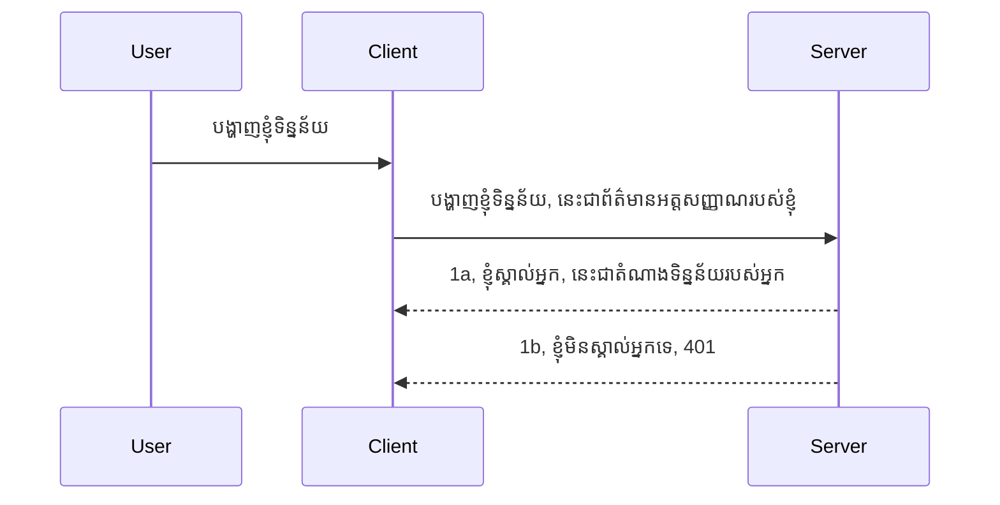

# បញ្ជាក់​ភាគ​ច្រើន​សាមញ្ញ

MCP SDKs គាំទ្រការប្រើប្រាស់ OAuth 2.1 ដែលពិត​ជា​ជា​ដំណើរការដែលពាក់ព័ន្ធជាច្រើន​រួម​មានគំនិត​ដូចជា auth server, resource server, ផ្ញើ​ជាមួយ​ពាក្យសម្ងាត់, ទទួលបានកូដ,​ប្ដូរកូដទៅជា bearer token រហូតដល់​អ្នកអាចទទួលបាន​ទិន្នន័យធនធានរបស់​អ្នក។ ប្រសិនបើ​អ្នក​មិនទំនាស់​ជាមួយ OAuth ដែល​ជា​រឿងល្អក្នុងការអនុវត្តន៍នោះ អាចជាការគួរឱ្យចាប់ផ្តើម​ជាមួយជំរៅ auth មូលដ្ឋាន ហើយ​សាងសង់ឲ្យមាន​សុវត្ថិភាព​ល្អ​ប្រសើរឡើងៗ។ ដូច្នេះ​វិធីងាយស្រួល​នេះមានវត្តមាន ដើម្បី​ឲ្យ​អ្នកអាច​ធ្វើ auth ដែល​ច្រើនជាងនេះ។

## Auth មាន​អ្វីខ្លះ?

Auth ជាដំណែក​កាត់​សម្រាប់ authentication និង authorization។ គំនិត​គឺថា​យើង​ត្រូវធ្វើ ២ ធ្វើការ៖

- **Authentication** គឺ​ជា​ដំណើរការ​ធ្វើការកំណត់​មើលថាតើយើងអនុញ្ញាតឲ្យមនុស្សចូលទៅផ្ទះរបស់យើង តើគេមានសិទ្ធិ “នៅទីនេះ” មានការចូលដំណើរការទៅកាន់ resource server ដែលជាទីតាំងដែល​អនុវត្ត MCP Server របស់យើង។
- **Authorization** គឺ​ជា​ដំណើរការ​ស្វែងរកមើលថា​អ្នកប្រើប្រាស់ត្រូវបានអនុញ្ញាត​ឲ្យចូលទៅធនធានពិសេស​ដែលគេចង់បាន ឧទាហរណ៍បញ្ជាទិញ ឬ​ផលិតផល​ត្រង់​នោះ ហើយតើគេអាចអានមាតិកាបាន ដោយ​មិន​អាចលុបបាន ជាឧទាហរណ៍​ផ្សេងទៀត។

## ប្រព័ន្ធសម្ងាត់ ផ្លូវការប្រាប់ប្រព័ន្ធយើងថា​យើងជាអ្នកណា

តែ​ពួក​អ្នក​អភិវឌ្ឍន៍​ច្រើនតែម្នាក់ មានគំនិត​ផ្តល់វិធីសាស្រ្ត​សម្ងាត់ដល់ម៉ាស៊ីនមេ ជាទូទៅជាសម្ងាត់​ដែលប្រាប់ថា​ពួកគេអាចនៅទីនេះ “Authentication”។ វាពីរូបមន្តជាទូទៅគឺជារូបមន្ត base64 កូដនៃឈ្មោះអ្នកប្រើ និងពាក្យសម្ងាត់ ឬ key API ដែលសម្គាល់ប្រើប្រាស់តែម្នាក់។ 

វានៅក្នុងការ​ផ្ញើជាលាយលក្ខណៈ​មួយ​តាម​ក្បាល​ដំណើរការ​ឈ្មោះ "Authorization" ដូចខាងក្រោម៖

```json
{ "Authorization": "secret123" }
```

វាគេហៅថា basic authentication។ វិធីសាស្រ្តការហូរ​នេះធ្វើការដូចខាងក្រោម៖



ឥឡូវនេះយើងយល់ថាវាដំណើរការយ៉ាងដូចម្តេចពីសភាពហ៊ុនហៅ ទៅវិញទៅមក។ តើយើងត្រូវធ្វើវានៅម៉ាស៊ីនម៉េច? វាគឺជា middleware សម្រាប់មុខងារ មួយក្នុងសំណើ ដែលអាចផ្ទៀងផ្ទាត់សម្ងាត់ ហើយបើវាមានសុពលភាព នឹងអនុញ្ញាតឲ្យសំណើអណ្ដែតបន្ត។ ប្រសិនបើសំណើមិនមានសម្ងាត់ត្រឹមត្រូវ យើងនឹងទទួលបានកំហុស auth។ អ្នកមកតាមដំណើរវិធីសាស្រ្តនេះ៖

**Python**

```python
class AuthMiddleware(BaseHTTPMiddleware):
    async def dispatch(self, request, call_next):

        has_header = request.headers.get("Authorization")
        if not has_header:
            print("-> Missing Authorization header!")
            return Response(status_code=401, content="Unauthorized")

        if not valid_token(has_header):
            print("-> Invalid token!")
            return Response(status_code=403, content="Forbidden")

        print("Valid token, proceeding...")
       
        response = await call_next(request)
        # បន្ថែមក្បាលអតិថិជនណាមួយ ឬប្ដូរជាមធ្យមមួយនៅក្នុងចម្លើយ
        return response


starlette_app.add_middleware(CustomHeaderMiddleware)
```

នៅទីនេះយើងមាន៖ 

- បានបង្កើត middleware ហៅថា `AuthMiddleware` ដែលមានមេតូឌី `dispatch` ដំណើរការដោយម៉ាស៊ីនមេបណ្ដាញ។
- បានបន្ថែម middleware ដល់ម៉ាស៊ីនមេបណ្ដាញ៖

    ```python
    starlette_app.add_middleware(AuthMiddleware)
    ```

- បានសរសេរត្រួតពិនិត្យបញ្ជាក់ថា header Authorization មានរួចហើយ និងសម្ងាត់ដែលផ្ញើត្រឹមត្រូវ៖

    ```python
    has_header = request.headers.get("Authorization")
    if not has_header:
        print("-> Missing Authorization header!")
        return Response(status_code=401, content="Unauthorized")

    if not valid_token(has_header):
        print("-> Invalid token!")
        return Response(status_code=403, content="Forbidden")
    ```

    ប្រសិនបើសម្ងាត់មាន និងត្រឹមត្រូវ នោះយើងអនុញ្ញាតឲ្យសំណើបន្តដោយហៅ `call_next` ហើយត្រឡប់តម្លៃចេញ។

    ```python
    response = await call_next(request)
    # បន្ថែមក្បាលអតិថិជនណាមួយ ឬផ្លាស់ប្តូរឆ្លើយតបនៅក្នុងវិធីណាមួយ
    return response
    ```

វាដំណើរការ​ទៅបែបនេះ ប្រសិនបើសំណើមួយ​ត្រូវបានផ្ញើទៅម៉ាស៊ីនមេ middleware នឹងដំណើរការហើយ ដោយផ្អែកលើអនុវត្តន៍របស់វា វានឹងអនុញ្ញាតឲ្យសំណើបន្ត ឬត្រឡប់កំហុសមួយ​ដែលបង្ហាញថា client មិនត្រូវបានអនុញ្ញាតឲ្យបន្តទេ។

**TypeScript**

ឥឡូវនេះយើងបង្កើត middleware ជាមួយ framework Express ដែលពេញនិយម ហើយមើលសំណើមុនពេលវាគ្របដណ្តប់ទៅ MCP Server។ នេះគឺជា code សម្រាប់វា៖

```typescript
function isValid(secret) {
    return secret === "secret123";
}

app.use((req, res, next) => {
    // 1. តើមានក្បាលសិទ្ធិអនុម័តទេ?
    if(!req.headers["Authorization"]) {
        res.status(401).send('Unauthorized');
    }
    
    let token = req.headers["Authorization"];

    // 2. ពិនិត្យភាពត្រឹមត្រូវ។
    if(!isValid(token)) {
        res.status(403).send('Forbidden');
    }

   
    console.log('Middleware executed');
    // 3. ផ្ញើអំពាវនាវទៅជំហានបន្ទាប់នៅក្នុងបម្រាក់មួយនៃការស្នើសុំ។
    next();
});
```

នៅក្នុងកូដនេះ​យើង៖

1. ពិនិត្យមើលថា header Authorization មានរឺអត់ ជាអាទិភាព ប្រសិនបើមិនបានមានផ្ញើក៏ផ្ញើកំហុស 401។
2. ពិនិត្យសម្ងាត់/ token ត្រឹមត្រូវ ឬអត់ ប្រសិនបើមិនត្រឹមត្រូវ ក៏ផ្ញើកំហុស 403។
3. ចុងក្រោយ អនុញ្ញាតសំណើបន្តក្នុង pipeline ហើយត្រឡប់ធនធានដែលបានស្នើរ។

## លំហាត់សិក្សា៖ អនុវត្ត authentication

យើង​យកចំណេះដឹង​និង​ព្យាយាម​អនុវត្តវា។ នេះ​គ្រោងផែនការរបស់យើង៖

ម៉ាស៊ីនមេ

- បង្កើតម៉ាស៊ីនមេបណ្ដាញ និង MCP instance។
- អនុវត្ត middleware សម្រាប់ម៉ាស៊ីនមេ។

ចូរអ្នកប្រើប្រាស់

- ផ្ញើសំណើបណ្ដាញ​មានសម្ងាត់ តាម header។

### -1- បង្កើតម៉ាស៊ីនមេបណ្ដាញ និង MCP instance

> [!WARNING]
> ឧទាហរណ៍ TypeScript ខាងក្រោម​គឺផ្ទុក MCP `2025-11-25`។ វាគ្រប់គ្រងការដឹកជញ្ជូន
> តាម `mcp-session-id` ហើយមិនមែន​ជា​ករណី `2026-07-28` ការដឹកជញ្ជូន។ MCP
> `2026-07-28` បានយក `initialize` handshake និង protocol session ID ចេញ; ការអនុវត្តថ្មី
> ប្រើសំណើផ្ទាល់ខ្លួន។ សូមមើល
> [ការផ្លាស់ប្តូរនៅក្នុង MCP: ការបញ្ជាក់ 2026-07-28](../../01-CoreConcepts/mcp-2026-07-28.md)។

ក្នុងជំហានដំបូងនេះ យើងត្រូវបង្កើតម៉ាស៊ីនមេបណ្ដាញ និង MCP Server instance។

**Python**

នៅទីនេះ យើងបង្កើត MCP server instance បង្កើត starlette web app ហើយរៀបចំវាជាមួយ uvicorn។

```python
# កំពុងបង្កើតម៉ាស៊ីនមេ MCP

app = FastMCP(
    name="MCP Resource Server",
    instructions="Resource Server that validates tokens via Authorization Server introspection",
    host=settings["host"],
    port=settings["port"],
    debug=True
)

# កំពុងបង្កើតកម្មវិធីវេប starlette
starlette_app = app.streamable_http_app()

# បម្រើកម្មវិធីតាមរយៈ uvicorn
async def run(starlette_app):
    import uvicorn
    config = uvicorn.Config(
            starlette_app,
            host=app.settings.host,
            port=app.settings.port,
            log_level=app.settings.log_level.lower(),
        )
    server = uvicorn.Server(config)
    await server.serve()

run(starlette_app)
```

នៅក្នុងកូដនេះយើងបាន៖

- បង្កើត MCP Server។
- បង្កើត starlette web app ពី MCP Server, `app.streamable_http_app()`។
- រៀបចំ និង​សេវាកម្ម​ចល័ត​បណ្ដាញ​ដោយប្រើ uvicorn `server.serve()`។

**TypeScript**

នៅទីនេះយើងបង្កើត MCP Server instance។

```typescript
const server = new McpServer({
      name: "example-server",
      version: "1.0.0"
    });

    // ... តំឡើងធនធានម៉ាស៊ីនបម្រើ ឧបករណ៍ និងការជំនួយ ...
```

ការបង្កើត MCP Server នេះត្រូវបានអនុវត្តនៅក្នុងកំណត់ជំហាន POST /mcp ដូច្នេះយើងយកកូដខាងលើហើយផ្លាស់ទីវា​ដូចជា៖

```typescript
import express from "express";
import { randomUUID } from "node:crypto";
import { McpServer } from "@modelcontextprotocol/sdk/server/mcp.js";
import { StreamableHTTPServerTransport } from "@modelcontextprotocol/sdk/server/streamableHttp.js";
import { isInitializeRequest } from "@modelcontextprotocol/sdk/types.js"

const app = express();
app.use(express.json());

// ផែនទីដើម្បីរក្សាទុកការដឹកជញ្ជូនតាមអត្តសញ្ញាណសម័យ
const transports: { [sessionId: string]: StreamableHTTPServerTransport } = {};

// ដោះស្រាយការស្នើសុំ POST សម្រាប់ការទំនាក់ទំនងពីអតិថិជនទៅម៉ាស៊ីនមេ
app.post('/mcp', async (req, res) => {
  // ពិនិត្យសម្រាប់អត្តសញ្ញាណសម័យដែលមានរួចហើយ
  const sessionId = req.headers['mcp-session-id'] as string | undefined;
  let transport: StreamableHTTPServerTransport;

  if (sessionId && transports[sessionId]) {
    // ប្រើប្រាស់ការដឹកជញ្ជូនដែលមានរួចហើយម្តងទៀត
    transport = transports[sessionId];
  } else if (!sessionId && isInitializeRequest(req.body)) {
    // សំណើការបង្កើតថ្មី
    transport = new StreamableHTTPServerTransport({
      sessionIdGenerator: () => randomUUID(),
      onsessioninitialized: (sessionId) => {
        // រក្សាទុកការដឹកជញ្ជូនតាមអត្តសញ្ញាណសម័យ
        transports[sessionId] = transport;
      },
      // ការការពារ DNS rebinding ត្រូវបានបិទប្រើដោយលំនាំដើមសម្រាប់ការមានភាព takaisinជាមួយបច្ចុប្បន្ន។ ប្រសិនបើអ្នកកំពុងដំណើរការម៉ាស៊ីនមេនេះ
      // ក្នុងក្នុងស្រុក, សូមធ្វើការកំណត់:
      // enableDnsRebindingProtection: true,
      // allowedHosts: ['127.0.0.1'],
    });

    // សម្អាតការដឹកជញ្ជូនពេលបិទ
    transport.onclose = () => {
      if (transport.sessionId) {
        delete transports[transport.sessionId];
      }
    };
    const server = new McpServer({
      name: "example-server",
      version: "1.0.0"
    });

    // ... រៀបចំធនធានម៉ាស៊ីនមេ, ឧបករណ៍, និងសំណើ ...

    // តភ្ជាប់ទៅម៉ាស៊ីនមេ MCP
    await server.connect(transport);
  } else {
    // សំណើមិនត្រឹមត្រូវ
    res.status(400).json({
      jsonrpc: '2.0',
      error: {
        code: -32000,
        message: 'Bad Request: No valid session ID provided',
      },
      id: null,
    });
    return;
  }

  // ដោះស្រាយសំណើ
  await transport.handleRequest(req, res, req.body);
});

// អ្នកដោះស្រាយដែលអាចប្រើឡើងវិញសម្រាប់សំណើ GET និង DELETE
const handleSessionRequest = async (req: express.Request, res: express.Response) => {
  const sessionId = req.headers['mcp-session-id'] as string | undefined;
  if (!sessionId || !transports[sessionId]) {
    res.status(400).send('Invalid or missing session ID');
    return;
  }
  
  const transport = transports[sessionId];
  await transport.handleRequest(req, res);
};

// ដោះស្រាយសំណើ GET សម្រាប់ការជូនដំណឹងពីម៉ាស៊ីនមេទៅអតិថិជនតាម SSE
app.get('/mcp', handleSessionRequest);

// ដោះស្រាយសំណើ DELETE សម្រាប់ការបិទសម័យ
app.delete('/mcp', handleSessionRequest);

app.listen(3000);
```

ឥឡូវនេះអ្នកឃើញថា MCP Server creation ត្រូវបានផ្លាស់ទីនៅក្នុង `app.post("/mcp")`។

យើងបន្តទៅជំហានបន្ទាប់សម្រាប់បង្កើត middleware ដើម្បីបញ្ជាក់សម្ងាត់ដែលមកដល់។

### -2- អនុវត្ត middleware សម្រាប់ម៉ាស៊ីនមេ

យើងមកកាន់ផ្នែក middleware បន្ទាប់។ នៅទីនេះយើងនឹងបង្កើត middleware វាយតម្លៃសម្ងាត់នៅក្នុង header `Authorization` ហើយបញ្ជាក់វា។ ប្រសិនបើវាគ្មានបញ្ហា សំណើនឹងបន្តទៅធ្វើអ្វីដែលត្រូវធ្វើ (ដូចជា បញ្ជីឧបករណ៍ អានធនធាន ឬមុខងារ MCP ដែលប្រើស្នើ)។

**Python**

ដើម្បីបង្កើត middleware យើងត្រូវបង្កើតថ្នាក់មួយ ដែលបន្តពី `BaseHTTPMiddleware`។ មានបំណែកចំនួនពីរ​ដែលគួរឱ្យចាប់អារម្មណ៍៖

- សំណើ `request` ដែលយើងអានព័ត៌មានក្បាលពីវា។
- `call_next` callback ដែលយើងត្រូវហៅ ប្រសិនបើ client បញ្ចូនសម្ងាត់យើងទទួលបាន។

ដំបូង យើងត្រូវគ្រប់គ្រងករណី header `Authorization` អវត្តមាន៖

```python
has_header = request.headers.get("Authorization")

# មិនមានក្បាលស្លាបផ្តល់, ជួបជ័យជំនះជាមួយ 401, ផ្ទុយទៅវិញទៅមុខ។
if not has_header:
    print("-> Missing Authorization header!")
    return Response(status_code=401, content="Unauthorized")
```

នៅទីនេះយើងផ្ញើសារ 401 unauthorized ពីព្រោះ client បរាជ័យក្នុងការផ្ទៀងផ្ទាត់។

បន្ទាប់មក ប្រសិនបើបានផ្ញើសម្ងាត់មក អ្នកត្រូវត្រួតពិនិត្យវាត្រឹមត្រូវ៖

```python
 if not valid_token(has_header):
    print("-> Invalid token!")
    return Response(status_code=403, content="Forbidden")
```

សូមមើលថាតើយើងផ្ញើសារ 403 forbidden ខាងលើបែបណា។ មកមើល middleware ពេញលេញខាងក្រោមដែលអនុវត្តខាងលើទាំងអស់នេះ៖

```python
class AuthMiddleware(BaseHTTPMiddleware):
    async def dispatch(self, request, call_next):

        has_header = request.headers.get("Authorization")
        if not has_header:
            print("-> Missing Authorization header!")
            return Response(status_code=401, content="Unauthorized")

        if not valid_token(has_header):
            print("-> Invalid token!")
            return Response(status_code=403, content="Forbidden")

        print("Valid token, proceeding...")
        print(f"-> Received {request.method} {request.url}")
        response = await call_next(request)
        response.headers['Custom'] = 'Example'
        return response

```

ល្អហើយ តើ `valid_token` សម្រាប់ធ្វើយ៉ាងដូចម្តេច? នៅទីនេះ៖

```python
# កុំប្រើសម្រាប់ការផលិត - សូមពន្លឿនវា !!
def valid_token(token: str) -> bool:
    # លុបផ្នែកចាំបាច់ "Bearer "
    if token.startswith("Bearer "):
        token = token[7:]
        return token == "secret-token"
    return False
```

នេះគួរតែបង្កើនប្រសើរ​បន្ថែម។

ចំណាំ៖ អ្នកមិនគួរតែមានសម្ងាត់នេះនៅក្នុងកូដទេ។ គួរនាំយកតម្លៃសម្រាប់ប្រៀបធៀបពីប្រភពទិន្នន័យ ឬ IDP (identity service provider) ហើយល្អជាងគេអនុញ្ញាតឲ្យ IDP ផ្ទៀងផ្ទាត់ផងដែរ។

**TypeScript**

ដើម្បីអនុវត្តក្នុង Express យើងត្រូវហៅមេតូឌី `use` ដែលទទួលបានមុខងារមេឌៀវ័រ។

យើងត្រូវ៖

- បន្តប្រាក់ប្រើប្រាស់សំណើដើម្បីត្រួតពិនិត្យសម្ងាត់ក្នុង `Authorization` property។
- បញ្ជាក់សម្ងាត់ ប្រសិនបើត្រឹមត្រូវអនុញ្ញាតទៅបន្ត និងអនុវត្តសំណើ MCP client ដូចដែលបានស្នើ។

នៅទីនេះ យើងកំពុងពិនិត្យថា header `Authorization` មានរឺអត់ ហើយប្រសិនបើមិនមាន ទើបរាំងសន្ទស្សន៍សំណើមិនឲ្យបន្ត។

```typescript
if(!req.headers["authorization"]) {
    res.status(401).send('Unauthorized');
    return;
}
```

ប្រសិនបើគ្មាន header ត្រូវបានផ្ញើ អ្នកទទួល 401។

បន្ទាប់មក ពិនិត្យសម្ងាត់ត្រឹមត្រូវ ឥឡូវនេះបង្វិលសំណើ ពីព្រោះមិនត្រឹមត្រូវទេ ប៉ុន្តែ​សារ​ខុសគ្នា៖

```typescript
if(!isValid(token)) {
    res.status(403).send('Forbidden');
    return;
} 
```

សូមមើលថាឥឡូវនេះអ្នកទទួលកំហុស 403។

នេះគឺជាកូដពេញលេញ៖

```typescript
app.use((req, res, next) => {
    console.log('Request received:', req.method, req.url, req.headers);
    console.log('Headers:', req.headers["authorization"]);
    if(!req.headers["authorization"]) {
        res.status(401).send('Unauthorized');
        return;
    }
    
    let token = req.headers["authorization"];

    if(!isValid(token)) {
        res.status(403).send('Forbidden');
        return;
    }  

    console.log('Middleware executed');
    next();
});
```

យើងបានរៀបចំម៉ាស៊ីនមេបណ្ដាញដើម្បីទទួល middleware ដើម្បីពិនិត្យសម្ងាត់ដែល client ធ្វើផ្ញើមក។ តើ client ដំណើរការយ៉ាងដូចម្តេច?

### -3- ផ្ញើសំណើបណ្ដាញជាមួយសម្ងាត់តាម header

យើងត្រូវប្រាកដថា client ផ្ញើសម្ងាត់តាម header។ ដូចដែលយើងនឹងប្រើ MCP client សម្រាប់វា ត្រូវរៀបចំដឹងពីរបៀបធ្វើ។

**Python**

សម្រាប់ client យើងត្រូវផ្ញើ header ជាមួយសម្ងាត់ដូចខាងក្រោម៖

```python
# កុំកំណត់តម្លៃដោយផ្ទាល់, មានវាឲ្យបានអប្បបរមានៅក្នុងអថេរស្ថានភាពបរិស្ថាន ឬការផ្ទុកដែលមានសុវត្ថិភាពជាងនេះ
token = "secret-token"

async with streamablehttp_client(
        url = f"http://localhost:{port}/mcp",
        headers = {"Authorization": f"Bearer {token}"}
    ) as (
        read_stream,
        write_stream,
        session_callback,
    ):
        async with ClientSession(
            read_stream,
            write_stream
        ) as session:
            await session.initialize()
      
            # TODO, អ្វីដែលអ្នកចង់ឲ្យធ្វើក្នុងអ្នកប្រើ, ឧ. បញ្ជីឧបករណ៍, ហៅឧបករណ៍ ល។
```

សូមមើលថាយើងបំពេញ `headers` property ដូចជាការអនុវត្ត ` headers = {"Authorization": f"Bearer {token}"}`។

**TypeScript**

យើងអាចដោះស្រាយវា​ក្នុង ២ ជំហាន៖

1. បំពេញ objekt កំណត់តម្លៃជាមួយសម្ងាត់របស់យើង។
2. ផ្ញើ objekt កំណត់តម្លៃទៅ ការដឹកជញ្ជូន។

```typescript

// កុំកូដតម្លៃនេះដោយផ្ទាល់ដូចដែលបង្ហាញនៅទីនេះ។យ៉ាងតិចជាទ្រព្យសម្បត្តិសម្រាប់បរិស្ថានហើយប្រើអ្វីមួយដូចជា dotenv (នៅម៉ូដ dev)។
let token = "secret123"

// កំណត់វត្ថុជម្រើសដឹកជញ្ជូនរបស់អតិថិជន
let options: StreamableHTTPClientTransportOptions = {
  sessionId: sessionId,
  requestInit: {
    headers: {
      "Authorization": "secret123"
    }
  }
};

// ផ្ញើវត្ថុជម្រើសទៅកាន់ដឹកជញ្ជូន
async function main() {
   const transport = new StreamableHTTPClientTransport(
      new URL(serverUrl),
      options
   );
```

នៅទីនេះអ្នកឃើញថា យើងបានបង្កើត objekt `options` ហើយដាក់ header នៅក្រោម property `requestInit`។

ចំណាំ៖ តើយើងធ្វើវាបានល្អប្រសើរជាងនេះដូចម្តេច? ការអនុវត្តបច្ចុប្បន្នមានបញ្ហាជាច្រើន។ ជាចាំបាច់ យើងត្រូវមាន HTTPS ជាចំបង ដើម្បីការពារ។ ទោះយ៉ាងណា សម្ងាត់អាចត្រូវមានការលួចលត់ ដូច្នេះត្រូវមានប្រព័ន្ធសម្រាប់ដកtoken និងបន្ថែមត្រួតពិនិត្យផ្សេងៗ ឌីជីថលកន្លែងមក, ការស្នើញញឹមធ្វើលឿនពេក (បែបរាងbot) ដែលមានកង្វះខាតជាច្រើន។ 

តែគួរកន្ថែមថា សម្រាប់ API ងាយស្រួល​ដែលអ្នកមិនចង់ឲ្យ​មាននរណាម្នាក់បានហៅ API របស់អ្នកដោយគ្មានអត្ថសញ្ញា នេះជាចំណុច​ចាប់ផ្ដើមល្អណាស់។ 

ដោយហេតុផលនេះយើងព្យាយាមពង្រីកសុវត្ថិភាពល្អជាងនេះ ដោយប្រើព្រមទាំង token JSON Web Token ដែលគេស្គាល់ក្នុងឈ្មោះ JWT ឬ token "JOT"។

## JSON Web Tokens, JWT

ដូច្នេះ យើងកំពុងព្យាយាមកែលម្អ​ពីការផ្ញើសម្ងាត់ងាយៗ។ តើអ្វីទៅជាការវិវត្តន៍ភ្លាមៗនៅពេលយើងទទួលយក JWT?

- **ភាពល្អប្រសើរនៅសុវត្ថិភាព**។ នៅ basic auth អ្នកផ្ញើឈ្មោះ និងពាក្យសម្ងាត់ជារៀងរាល់ដង ជាជំនួសជាគ្រឿង base64 កូដ​ (ឬ key API) ដែលបង្កើនហានិភ័យ។ ជាមួយ JWT អ្នកផ្ញើឈ្មោះ និងពាក្យសម្ងាត់ និងទទួលបាន token ជាប្រាក់ឌីជីថល ដែលកំណត់ពេលសុពលភាព។ JWT អនុញ្ញាត​ឲ្យដំណើរការត្រួតពិនិត្យចូលប្រើដោយសម្ងាត់ល្អសំរាប់តួនាទី, scopes និងសិទ្ធិ។
- **Statelessness និងភាពអាចបង្រួមួយប្រសើរឡើង**។ JWTs គឺមានទិន្នន័យមិនមែនជាសភាពសំរភារះគឺផ្ទុកពត៌មានអ្នកប្រើប្រាស់ និងលុបបំបាត់ការផ្ទុក sessionនៅម៉ាស៊ីនយក្ស។ Token អាចផ្ទៀងផ្ទាត់នៅក្នុងតំបន់ដូចគ្នា។
- **ភាពអាចប្រើប្រាស់រួមគ្នានឹងចំណែករដ្ឋាភិបាល**។ JWTs ជាគោលការណ៍​សំខាន់ក្នុង Open ID Connect និងប្រើជាមួយ identity providers ដូចជា Entra ID, Google Identity និង Auth0។ វានិងអាចប្រើបាន សំរាប់ single sign on និងផ្សេងទៀត ធ្វើឲ្យវាជាកម្រិតក្រុមហ៊ុន។
- **ភាពច្បាស់លាស់ និងភាពបត់បែន**។ JWTs ក៏អាចប្រើជាមួយ API Gateways ដូចជា Azure API Management, NGINX និងផ្សេងទៀត។ វាក៏គាំទ្រ​ស្ថានភាព authentication ហើយការទំនាក់ទំនងម៉ាស៊ីនជា​មួយដែលមាន impersonation និង delegation។
- **កម្មវិធីល្បឿន និងកក់ cache**។ JWTs អាចត្រូវរក្សាទុកបន្ទាប់ពី decode ដែលកាត់បន្ថយការត្រូវបកស្រាយ token ជាបន្តបន្ទាប់។ វាអាចជួយទូទៅក្នុងកម្មវិធីចរាចរណ៍ខ្ពស់ ដោយបង្កើនការដឹកនាំ និងកាត់បន្ថយការលំបាកទៅការដាក់ធនធាន។
- **មុខងារជាក់លាក់**។ វាក៏គាំទ្រចំពោះ introspection (ពិនិត្យវត្ថុបច្ចេកទេសនៅម៉ាស៊ីនបម្រើ) និង revocation (ធ្វើឲ្យ token មិនមានតំលៃ)។

ជាមួយអត្ថប្រយោជន៍ទាំងនេះរួចមក មកមើលថាយើងអាចធ្វើបានយ៉ាងដូចម្តេចដើម្បីជំរុញការអនុវត្តរបស់យើងទៅកម្រិតបន្តទៅមុខ។

## ការបំលែង auth ងាយទៅជា JWT

ដូច្នេះ ការផ្លាស់ប្តូរដែលយើងត្រូវធ្វើ នៅកម្រិតខ្ពស់ គឺ៖

- **រៀនបង្កើត token JWT** និងធ្វើឲ្យវាត្រៀមសម្រាប់ផ្ញើពី client ទៅ server។
- **ធ្វើត្រួតពិនិត្យ token JWT**, ហើយប្រសិនបើគុណភាពល្អ អនុញ្ញាតឲ្យ client ដំណើរការទទួលយកធនធាន។
- **ការរក្សាទុក token យ៉ាងសុវត្ថិភាព**។ របៀប​ដែលយើង​រក្សាទុក token នេះ។
- **ការការពារ​ផ្លូវចូល**។ យើងត្រូវការការពារ​ផ្លូវចូល។ ក្នុងករណីយើង ត្រូវការការពារ​ផ្លូវចូល និងមុខងារ MCP មួយចំនួន។
- **បន្ថែម refresh tokens**។ ប្រាកដថាយើងបង្កើត token ដែលមានអាយុកាលខ្លី ប៉ុន្តែមាន refresh tokens ដែលមានអាយុកាលវែង អាចប្រើសម្រាប់ទទួលបាន token ថ្មី ប្រសិនបើវាអស់សម្លាប់។ ផងដែរ ត្រូវប្រាកដមាន refresh endpoint និងយុទ្ធសាស្ត្រត្រឡប់ token។

### -1- បង្កើត token JWT

ជាមុនសិន token JWT មានផ្នែកដូចខាងក្រោម៖

- **header**, លេខកូដ algorithm ដែលប្រើ និងប្រភេទ token។
- **payload**, ពាក្យវិវត្តន៍ claims, ដូចជា sub (អ្នកប្រើប្រាស់ ឬអង្គភាពដែល token បង្ហាញ), exp (ពេលវាកំណត់ផុតកំណត់) role (តួនាទី)
- **signature**, បានចុះហត្ថលេខាជាមួយសម្ងាត់ ឬ key ផ្ទាល់ខ្លួន។

សម្រាប់នេះ យើងត្រូវបង្កើត header, payload និង token ដែលបាន encode។

**Python**

```python

import jwt
import jwt
from jwt.exceptions import ExpiredSignatureError, InvalidTokenError
import datetime

# កូនសោសម្ងាត់ដែលប្រើសម្រាប់ចុះហត្ថលេខាលើ JWT
secret_key = 'your-secret-key'

header = {
    "alg": "HS256",
    "typ": "JWT"
}

# ព័ត៌មានអ្នកប្រើ និងបណ្តា ចំណងជើងរបស់វា និងពេលផុតកំណត់
payload = {
    "sub": "1234567890",               # មុខវិជ្ជា (ID អ្នកប្រើ)
    "name": "User Userson",                # ចំណងជើងផ្ទាល់ខ្លួន
    "admin": True,                     # ចំណងជើងផ្ទាល់ខ្លួន
    "iat": datetime.datetime.utcnow(),# បានបញ្ចេញនៅ
    "exp": datetime.datetime.utcnow() + datetime.timedelta(hours=1)  # ផុតកំណត់
}

# เข้ารหัสវា
encoded_jwt = jwt.encode(payload, secret_key, algorithm="HS256", headers=header)
```

នៅក្នុងកូដខាងលើ យើង៖

- កំណត់ header ប្រើ HS256 ជាលេខកូដ និងប្រើ JWT ជាប្រភេទ។
- បង្កើត payload ដែលមាន subject ឬ id អ្នកប្រើប្រាស់, ឈ្មោះ​ប្រើប្រាស់, រូបមន្ត, ពេលចេញបញ្ជូន និងពេលវាអាចផុតកំណត់ ដែលបង្ហាញលើការគ្រប់គ្រងពេលវេលា។

**TypeScript**

នៅទីនេះយើងត្រូវការពាក់ព័ន្ធបញ្ញៀវពិសេសមួយចំនួនដែលជួយបង្កើត token JWT។

ពាក់ព័ន្ធ

```sh

npm install jsonwebtoken
npm install --save-dev @types/jsonwebtoken
```

ឥឡូវ​នេះយើងមានអ្វីទៅហើយ រួចនាំមកបង្កើត header, payload ហើយតាមរយៈវា បង្កើត token ដែលបាន encode។

```typescript
import jwt from 'jsonwebtoken';

const secretKey = 'your-secret-key'; // ប្រើប្រាស់អថេរបរិស្ថិតិក្នុងផលិតកម្ម

// កំណត់ទម្រង់ទិន្នន័យ
const payload = {
  sub: '1234567890',
  name: 'User usersson',
  admin: true,
  iat: Math.floor(Date.now() / 1000), // ចេញផ្សាយនៅ
  exp: Math.floor(Date.now() / 1000) + 60 * 60 // មានពុទ្ធិក្នុងរយៈពេល 1 ម៉ោង
};

// កំណត់ក្បាល (ជ្រើសរើស, jsonwebtoken កំណត់លំនាំដើម)
const header = {
  alg: 'HS256',
  typ: 'JWT'
};

// បង្កើតសញ្ញាប័ត្រ
const token = jwt.sign(payload, secretKey, {
  algorithm: 'HS256',
  header: header
});

console.log('JWT:', token);
```

token នេះគឺ៖

បានចុះហត្ថលេខាជាមួយ HS256
មានសុពលភាពរយៈពេល 1 ម៉ោង
រួមបញ្ចូល claims ដូចជា sub, name, admin, iat និង exp។

### -2- ត្រួតពិនិត្យ token

យើងត្រូវត្រួតពិនិត្យ token ផងដែរ នេះជាធាតុដែលយើងគួរធ្វើនៅម៉ាស៊ីនបម្រើ ដើម្បីប្រាកដថាចំណុចដែល client ផ្ញើមក មានត្រឹមត្រូវ។ មានការត្រួតពិនិត្យជាច្រើនដែលយើងត្រូវធ្វើ ពីការត្រួតពិនិត្យរចនាសម្ព័ន្ធរបស់វា ទៅការត្រួតពិនិត្យសុពលភាពរបស់វា។ អ្នកក៏អាចបន្ថែមត្រួតពិនិត្យផ្សេងៗ ដូចជា តើអ្នកប្រើនៅក្នុងប្រព័ន្ធរបស់អ្នកឬអត់ និងផ្សេងទៀត។

ដើម្បីត្រួតពិនិត្យ token យើងត្រូវ decode វា ដើម្បីអានរួចចាប់ផ្តើមត្រួតពិនិត្យសុពលភាពរបស់វា៖

**Python**

```python

# ពន្យល់និងផ្ទៀងផ្ទាត់ JWT
try:
    decoded = jwt.decode(token, secret_key, algorithms=["HS256"])
    print("✅ Token is valid.")
    print("Decoded claims:")
    for key, value in decoded.items():
        print(f"  {key}: {value}")
except ExpiredSignatureError:
    print("❌ Token has expired.")
except InvalidTokenError as e:
    print(f"❌ Invalid token: {e}")

```


នៅក្នុងកូដនេះ យើងហៅ `jwt.decode` ដោយប្រើ token, ចំនុចសម្ងាត់ និងអាល់កូរីធម៌ដែលបានជ្រើសរើសជាបញ្ចូល។ សូមចាប់អារម្មណ៍ពីរបៀបប្រើបន្ទាត់ try-catch ដោយសារតែការផ្ទៀងផ្ទាត់បរាជ័យនឹងនាំឱ្យមានកំហុសកើតឡើង។

**TypeScript**

នៅទីនេះ យើងត្រូវហៅ `jwt.verify` ដើម្បីទទួលបានកំណែdecoded នៃ token ដែលអាចវិភាគបន្ថែមបាន។ ប្រសិនបើការហៅនេះបរាជ័យ នោះមានន័យថា រចនាសម្ព័ន្ធ token មិនត្រឹមត្រូវ ឬវាមិនមានសុពលភាពទៀតហើយ។

```typescript

try {
  const decoded = jwt.verify(token, secretKey);
  console.log('Decoded Payload:', decoded);
} catch (err) {
  console.error('Token verification failed:', err);
}
```

កំណត់សម្គាល់៖ ដូចបានអះអាងពីមុន គេគួរតែដំណើរការពិនិត្យបន្ថែមដើម្បីធានាថា token នេះបញ្ជាក់ពីអ្នកប្រើ​នៅក្នុងប្រព័ន្ធរបស់យើង និងធានាថាអ្នកប្រើមានសិទ្ធិដែលវាអះអាង។

បន្ទាប់មក មកមើលនូវការគ្រប់គ្រងចូលដោយផ្អែកលើតួនាទី ដែលគេស្គាល់ថា RBAC ផងដែរ។

## បន្ថែមការគ្រប់គ្រងចូលដោយផ្អែកលើតួនាទី

គំនិតគឺយើងចង់បញ្ចេញថាតួនាទីផ្សេងៗមានសិទ្ធិផ្សេងៗគ្នា។ ឧទាហរណ៍ យើងគិតថាអ្នកគ្រប់គ្រងអាចធ្វើអ្វីៗទាំងអស់បាន អ្នកប្រើទូទៅអាចអាននិងសរសេរ ហើយភ្ញៀវអាចអានតែប៉ុណ្ណោះ។ ដូច្នេះ ទីនេះជាកម្រិតសិទ្ធិដែលប្រហែលមាន៖

- Admin.Write 
- User.Read
- Guest.Read

មកមើលរបៀបដែលយើងអាចអនុវត្តន៍ការគ្រប់គ្រងបែបនេះជាមួយ middleware។ Middleware អាចត្រូវបានបន្ថែមចំពោះផ្លូវចូលមួយឬសម្រាប់ផ្លូវចូលទាំងអស់។

**Python**

```python
from starlette.middleware.base import BaseHTTPMiddleware
from starlette.responses import JSONResponse
import jwt

# កុំដាក់សម្ងាត់នៅក្នុងកូដដូចនេះទេ ព្រោះនេះគ្រាន់តែលើកទឹកចិត្ដបង្ហាញប៉ុណ្ណោះ។ សូមអានវាពីទីតាំងដែលមានសុវត្ថិភាព។
SECRET_KEY = "your-secret-key" # ដាក់វានៅក្នុងអថេរប្រព័ន្ធ env
REQUIRED_PERMISSION = "User.Read"

class JWTPermissionMiddleware(BaseHTTPMiddleware):
    async def dispatch(self, request, call_next):
        auth_header = request.headers.get("Authorization")
        if not auth_header or not auth_header.startswith("Bearer "):
            return JSONResponse({"error": "Missing or invalid Authorization header"}, status_code=401)

        token = auth_header.split(" ")[1]
        try:
            decoded = jwt.decode(token, SECRET_KEY, algorithms=["HS256"])
        except jwt.ExpiredSignatureError:
            return JSONResponse({"error": "Token expired"}, status_code=401)
        except jwt.InvalidTokenError:
            return JSONResponse({"error": "Invalid token"}, status_code=401)

        permissions = decoded.get("permissions", [])
        if REQUIRED_PERMISSION not in permissions:
            return JSONResponse({"error": "Permission denied"}, status_code=403)

        request.state.user = decoded
        return await call_next(request)


```

មានវិធីខ្លះៗបន្ថែម middleware ដូចខាងក្រោម៖

```python

# ជំនាន់ 1: បន្ថែម middleware ខណៈកំពុងបង្កើតកម្មវិធី starlette
middleware = [
    Middleware(JWTPermissionMiddleware)
]

app = Starlette(routes=routes, middleware=middleware)

# ជំនាន់ 2: បន្ថែម middleware បន្ទាប់ពីកម្មវិធី starlette ត្រូវបានបង្កើតរួច
starlette_app.add_middleware(JWTPermissionMiddleware)

# ជំនាន់ 3: បន្ថែម middleware សម្រាប់មីធូតរ៉ោតនីមួយៗ
routes = [
    Route(
        "/mcp",
        endpoint=..., # អ្នកដោះស្រាយ
        middleware=[Middleware(JWTPermissionMiddleware)]
    )
]
```

**TypeScript**

យើងអាចប្រើ `app.use` និង middleware មួយដែលនឹងរត់សម្រាប់ការស្នើសុំនីតផងទាំងអស់។

```typescript
app.use((req, res, next) => {
    console.log('Request received:', req.method, req.url, req.headers);
    console.log('Headers:', req.headers["authorization"]);

    // 1. ពិនិត្យមើលថា header authorization ត្រូវបានផ្ញើរទេ

    if(!req.headers["authorization"]) {
        res.status(401).send('Unauthorized');
        return;
    }
    
    let token = req.headers["authorization"];

    // 2. ពិនិត្យមើលថា token មានសុពលភាពឬទេ
    if(!isValid(token)) {
        res.status(403).send('Forbidden');
        return;
    }  

    // 3. ពិនិត្យមើលថា token user មាននៅក្នុងប្រព័ន្ធរបស់យើងឬទេ
    if(!isExistingUser(token)) {
        res.status(403).send('Forbidden');
        console.log("User does not exist");
        return;
    }
    console.log("User exists");

    // 4. ពិនិត្យវាយតម្លៃថា token មានសិទ្ធិបានត្រឹមត្រូវ
    if(!hasScopes(token, ["User.Read"])){
        res.status(403).send('Forbidden - insufficient scopes');
    }

    console.log("User has required scopes");

    console.log('Middleware executed');
    next();
});

```

មានរឿងជាច្រើនដែលយើងអាចអោយ middleware របស់យើងធ្វើ និង middleware របស់យើងគួរធ្វើ យ៉ាងដូចជា៖

1. ពិនិត្យមើលថា authorization header មានរួចហើយឬនៅ
2. ពិនិត្យមើលថា token មានសុពលភាព យើងហៅ `isValid` ដែលជាវិធីសាស្រ្តដែលយើងបានសរសេរដើម្បីពិនិត្យភាពត្រឹមត្រូវ និងសុពលភាពនៃ token JWT។
3. ផ្ទៀងផ្ទាត់ថាអ្នកប្រើមាននៅក្នុងប្រព័ន្ធរបស់យើង យើងគួរតែពិនិត្យនេះ។

   ```typescript
    // អ្នកប្រើក្នុង DB
   const users = [
     "user1",
     "User usersson",
   ]

   function isExistingUser(token) {
     let decodedToken = verifyToken(token);

     // TODO, ពិនិត្យមើលថាតើអ្នកប្រើមាននៅក្នុង DB ឬទេ
     return users.includes(decodedToken?.name || "");
   }
   ```

   ខាងលើ យើងបានបង្កើតបញ្ជី `users` សាមញ្ញមួយ ដែលគួរតែមាននៅក្នុងមូលដ្ឋានទិន្នន័យយ៉ាងច្បាស់។

4. បន្ថែមទៀត យើងគួរតែពិនិត្យថា token មានសិទ្ធិ​ត្រឹមត្រូវ។

   ```typescript
   if(!hasScopes(token, ["User.Read"])){
        res.status(403).send('Forbidden - insufficient scopes');
   }
   ```

   ក្នុងកូដខាងលើពី middleware យើងពិនិត្យថា token មានសិទ្ធិ User.Read មិនមែនត្រូវទេ យើងបញ្ចូនកំហុស 403។ ខាងក្រោមជាវិធីជំនួយ `hasScopes`។

   ```typescript
   function hasScopes(scope: string, requiredScopes: string[]) {
     let decodedToken = verifyToken(scope);
    return requiredScopes.every(scope => decodedToken?.scopes.includes(scope));
  }
   ```

Have a think which additional checks you should be doing, but these are the absolute minimum of checks you should be doing.

Using Express as a web framework is a common choice. There are helpers library when you use JWT so you can write less code.

- `express-jwt`, helper library that provides a middleware that helps decode your token.
- `express-jwt-permissions`, this provides a middleware `guard` that helps check if a certain permission is on the token.

Here's what these libraries can look like when used:

```typescript
const express = require('express');
const jwt = require('express-jwt');
const guard = require('express-jwt-permissions')();

const app = express();
const secretKey = 'your-secret-key'; // put this in env variable

// Decode JWT and attach to req.user
app.use(jwt({ secret: secretKey, algorithms: ['HS256'] }));

// Check for User.Read permission
app.use(guard.check('User.Read'));

// multiple permissions
// app.use(guard.check(['User.Read', 'Admin.Access']));

app.get('/protected', (req, res) => {
  res.json({ message: `Welcome ${req.user.name}` });
});

// Error handler
app.use((err, req, res, next) => {
  if (err.code === 'permission_denied') {
    return res.status(403).send('Forbidden');
  }
  next(err);
});

```

ឥឡូវនេះ អ្នកបានឃើញរបៀបដែល middleware អាចប្រើសម្រាប់ការផ្ទៀងផ្ទាត់ (authentication) និងការអនុញ្ញាត (authorization), តើ MCP មានការផ្លាស់ប្តូររបៀបដែលយើងធ្វើ auth ទេ? យើងរង់ចាំស្វែងរកនៅក្នុងផ្នែកបន្ទាប់។

### -3- បន្ថែម RBAC ទៅ MCP

អ្នកបានឃើញរបៀបដែលអាចបន្ថែម RBAC តាម middleware ប៉ុន្តែសម្រាប់ MCP គ្មានរបៀបងាយស្រួលក្នុងការបន្ថែម RBAC លើមុខងារ MCP មួយៗ ទេ តើយើងត្រូវធ្វើអ្វី? ពិតណាស់ យើងត្រូវបន្ថែមកូដដូចខាងក្រោម ដែលពិនិត្យថាអតិថិជនមានសិទ្ធិក្នុងការហៅឧបករណ៍ណាមួយជាក់លាក់។

អ្នកមានជម្រើសខ្លះៗក្នុងការអនុវត្ត RBAC លើមុខងារ មួយនេះជាជម្រើសខ្លះ៖

- បន្ថែមការពិនិត្យសម្រាប់ឧបករណ៍ មធ្យោបាយ ផ្នែកដែលអ្នកត្រូវការពិនិត្យកម្រិតសិទ្ធិ។

   **python**

   ```python
   @tool()
   def delete_product(id: int):
      try:
          check_permissions(role="Admin.Write", request)
      catch:
        pass # អតិថិជនបរាជ័យក្នុងការអនុញ្ញាត, បញ្ចេញកំហុសអនុញ្ញាត
   ```

   **typescript**

   ```typescript
   server.registerTool(
    "delete-product",
    {
      title: Delete a product",
      description: "Deletes a product",
      inputSchema: { id: z.number() }
    },
    async ({ id }) => {
      
      try {
        checkPermissions("Admin.Write", request);
        // ត្រូវធ្វើ, ផ្ញើរព្រមទាំង id ទៅកាន់ productService និង remote entry
      } catch(Exception e) {
        console.log("Authorization error, you're not allowed");  
      }

      return {
        content: [{ type: "text", text: `Deletected product with id ${id}` }]
      };
    }
   );
   ```


- ប្រើវិធីសាស្រ្តម៉ាស៊ីនបម្រើដំណើរការលំបាក និងអ្នកដឹកនាំការសំណើ ដើម្បីកាត់បន្ថយចំនួនកន្លែងដែលត្រូវធ្វើការពិនិត្យ។

   **Python**

   ```python
   
   tool_permission = {
      "create_product": ["User.Write", "Admin.Write"],
      "delete_product": ["Admin.Write"]
   }

   def has_permission(user_permissions, required_permissions) -> bool:
      # user_permissions: បញ្ជីសិទ្ធិដែលអ្នកប្រើមាន
      # required_permissions: បញ្ជីសិទ្ធិដែលត្រូវការសម្រាប់ឧបករណ៍
      return any(perm in user_permissions for perm in required_permissions)

   @server.call_tool()
   async def handle_call_tool(
     name: str, arguments: dict[str, str] | None
   ) -> list[types.TextContent]:
    # សន្មត់ថា request.user.permissions គឺជាបញ្ជីសិទ្ធិសម្រាប់អ្នកប្រើ
     user_permissions = request.user.permissions
     required_permissions = tool_permission.get(name, [])
     if not has_permission(user_permissions, required_permissions):
        # បណ្ដេញកំហុស "អ្នកគ្មានសិទ្ធិឲ្យហៅឧបករណ៍ {name}"
        raise Exception(f"You don't have permission to call tool {name}")
     # បន្តដំណើរការ ហើយហៅឧបករណ៍
     # ...
   ```   
   

   **TypeScript**

   ```typescript
   function hasPermission(userPermissions: string[], requiredPermissions: string[]): boolean {
       if (!Array.isArray(userPermissions) || !Array.isArray(requiredPermissions)) return false;
       // បង្វិលត្រឡប់មក true ប្រសិនបើអ្នកប្រើមានសិទ្ធិចាំបាច់យ៉ាងតិចមួយ
       
       return requiredPermissions.some(perm => userPermissions.includes(perm));
   }
  
   server.setRequestHandler(CallToolRequestSchema, async (request) => {
      const { params: { name } } = request;
  
      let permissions = request.user.permissions;
  
      if (!hasPermission(permissions, toolPermissions[name])) {
         return new Error(`You don't have permission to call ${name}`);
      }
  
      // បន្តទៅ..
   });
   ```

   ចំណាំ អ្នកត្រូវធានាថា middleware របស់អ្នកកំណត់ token ដែលបាន decode ទៅលើគុណលក្ខណៈ user របស់ការស្នើសុំ ដូច្នេះកូដខាងលើសាមញ្ញ។

### សំណាត់ចុង

ឥឡូវនេះ យើងបានពិភាក្សាពីរបៀបបន្ថែមគាំទ្រ RBAC ជាទូទៅ និងសម្រាប់ MCP ជាពិសេស វានាពេលហត្ថការអនុវត្តសុវត្ថិភាពដោយខ្លួនឯង ដើម្បីធានាថាអ្នកយល់ច្បាស់ពីគំនិតដែលបានណែនាំ។

## កិច្ចការ ១៖ បង្កើតម៉ាស៊ីនបម្រើ mcp និងអតិថិជន mcp ដោយប្រើការផ្ទៀងផ្ទាត់មូលដ្ឋាន

នៅទីនេះ អ្នកនឹងយកអ្វីដែលបានរាប់អានក្នុងការផ្ញើលិខិតសំងាត់តាម headers។

## ដំណោះស្រាយ ១

[ដំណោះស្រាយ ១](./code/basic/README.md)

## កិច្ចការ ២៖ បន្ថែមដំណោះស្រាយពីកិច្ចការ ១ ដើម្បីប្រើ JWT

ទទួលយកដំណោះស្រាយដំបូង ប៉ុន្តែពេលនេះ យើងចង់ធ្វើឲ្យវាល្អប្រសើរឡើង។

ជំនួសការប្រើ Basic Auth សូមប្រើ JWT។

## ដំណោះស្រាយ ២

[ដំណោះស្រាយ ២](./solution/jwt-solution/README.md)

## thách thức

បន្ថែម RBAC លើឧបករណ៍ដែលយើងបានពិពណ៌នាក្នុងផ្នែក « បន្ថែម RBAC ទៅ MCP »។

## សម្រួល

អ្នកប្រាថ្នាថាបានរៀនភាគច្រើនពីជំពូកនេះ ចាប់ពីគ្មានសុវត្ថិភាពដល់សុវត្ថិភាពមូលដ្ឋានទូទៅ ចុះទៅ JWT និងរបៀបដែលវាអាចបន្ថែមទៅ MCP បាន។

យើងបានបង្កើតមូលដ្ឋានរឹងមាំជាមួយ JWT ផ្ទាល់ខ្លួន ប៉ុន្តែខណៈយើងពង្រីក កំពុងផ្លាស់ទៅទាញយកម៉ូដែលអត្តសញ្ញាណតាមស្តង់ដារ។ ការទទួលយក IdP ដូចជា Entra ឬ Keycloak ធ្វើឲ្យយើងអាចបញ្ចេញការផ្ដល់ token, ការផ្ទៀងផ្ទាត់ និងការគ្រប់គ្រងជីវិត token ទៅឱ្យវេទិកាមួយដែលទុកចិត្តបាន — ផ្តល់សេរីភាពឲ្យយើងផ្ដោតលើបច្ចេកវិទ្យា app និងបទពិសោធន៍អ្នកប្រើ។

សម្រាប់គោលបំណងនោះ យើងមាន [ជំពូកកម្រិតខ្ពស់លើ Entra](../../05-AdvancedTopics/mcp-security-entra/README.md)

## តើបន្ទាប់ជាอะไร

- បន្ទាប់៖ [ការតំឡើង MCP Hosts](../12-mcp-hosts/README.md)

---

<!-- CO-OP TRANSLATOR DISCLAIMER START -->
**ការបដិសេធ**:
ឯកសារនេះត្រូវបានបម្លែងភាសា ដោយប្រើសេវាបម្លែងភាសា AI [Co-op Translator](https://github.com/Azure/co-op-translator)។ ទោះយើងខ្ញុំមានក្តីប្រាថ្នាឱ្យបានច្បាស់លាស់ តែសូមយល់ដឹងថាការបម្លែងដោយស្វ័យប្រវត្តិក៏អាចមានកំហុសឬភាពមិនត្រឹមត្រូវ។ ឯកសារដើមជាភាសាទីតាំងគួរត្រូវបានគេប្រើជាប្រភពច្បាស់លាស់។ សម្រាប់ព័ត៌មានសំខាន់ៗ សូមណែនាំឱ្យប្រើប្រាស់ការប្រែដោយមនុស្សជំនាញ។ យើងខ្ញុំមិនទទួលខុសត្រូវចំពោះការយល់ច្រឡំ ឬការបកស្រាយខុសបន្ទាប់ពីការប្រើប្រាស់ការបម្លែងនេះនោះទេ។
<!-- CO-OP TRANSLATOR DISCLAIMER END -->