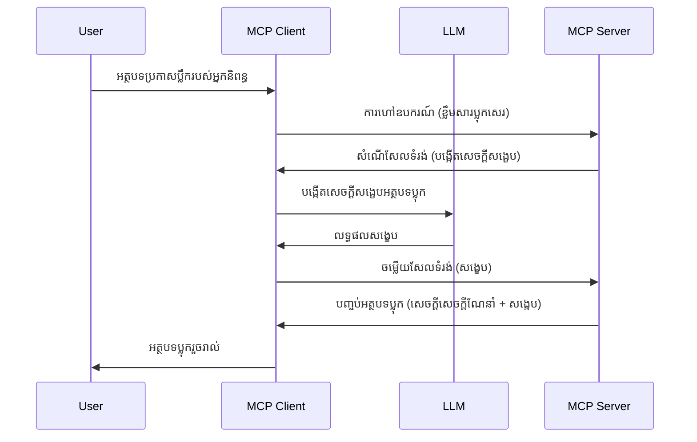

> [!WARNING]
> ការប្រមាញ់គំរូត្រូវបានបញ្ឈប់ប្រើក្នុង MCP `2026-07-28` ។ មេរៀននេះត្រូវបានរក្សាទុកសម្រាប់
> ការអនុវត្តផ្លូវកាល។ ម៉ាស៊ីនបម្រើថ្មីៗគួរតែបញ្ចូលជាមួយ API ពាណិជ្ជកម្ម LLM
> ផ្ទាល់។

# ការប្រមាញ់គំរូ - ដាក់មុខងារ delegate ទៅ Client

> ការប្រមាញ់គំរូនៅតែមាននៅក្នុងលក្ខណៈ `2026-07-28` សម្រាប់ភាពឆាប់សម្របសម្រួល ហើយអាច
> ត្រូវបានដកចេញក្នុងការកែសម្រួលដំបូងដែលចេញផ្សាយនៅពេលក្រោយ ឬបន្ទាប់ពីថ្ងៃទី 28 ខែកក្កដា
> ឆ្នាំ 2027 ។ ឧទាហរណ៍ក្នុងមេរៀននេះអាចប្រើ API SDK ដែលអនុវត្ត `2025-11-25` ។
> មើល [អ្វីដែលបានផ្លាស់ប្តូរនៅ MCP: លក្ខណៈ ២០២៦-០៧-២៨](../../01-CoreConcepts/mcp-2026-07-28.md)។

ក្នុងការអនុវត្តផ្លូវកាល ការប្រមាញ់គំរូអនុញ្ញាតឲ្យម៉ាស៊ីនបម្រើ MCP ស្នើសុំជំនួយពី LLM
ដែលមានការគ្រប់គ្រងដោយ client ។ សម្រាប់ការអនុវត្តថ្មីៗ សូមហៅអ្នកផ្គត់ផ្គង់ LLM ដែលបានជ្រើសរើស
ផ្ទាល់វិញ។

មកយើងស្វែងយល់ពីករណីប្រើប្រាស់ខ្លះៗ និងរបៀបសង់ដំណោះស្រាយដែលពាក់ព័ន្ធនឹងការប្រមាញ់គំរូ។

## សង្ខេប

ក្នុងមេរៀននេះ យើងផ្តោតលើការពណ៌នាពីពេលវេលា និងកន្លែងប្រើ Sampling និងរបៀបកំណត់រចនាសម្ព័ន្ធរបស់វា។

## គោលបំណងការសិក្សា

នៅក្នុងជំពូកនេះ យើងនឹង:

- ពន្យល់អំពី Sampling ជាអ្វី និងពេលវេលាដែលគួរប្រើវា។
- បង្ហាញរបៀបកំណត់ Sampling ក្នុង MCP ។
- ផ្តល់ឧទាហរណ៍នៃការប្រើ Sampling ក្នុងការអនុវត្ត។

## Sampling ជាអ្វី និងហេតុអ្វីបានជាគួរប្រើវា?

Sampling គឺជាមុខងារវីជ័យដែលដំណើរការដូចខាងក្រោម៖



### សំណើ Sampling

តោះ។ ឥឡូវនេះយើងមានទិដ្ឋភាពទូលំទូលាយនៃករណីដែលមានសក្ដានុពលមួយហើយ យើងចង់និយាយពីសំណើ sampling ដែលម៉ាស៊ីនបម្រើផ្ញើទៅ client។ រូបនេះជារបៀបសំណើនោះក្នុងទ្រង់ទ្រង់ JSON-RPC៖

```json
{
  "jsonrpc": "2.0",
  "id": 1,
  "method": "sampling/createMessage",
  "params": {
    "messages": [
      {
        "role": "user",
        "content": {
          "type": "text",
          "text": "Create a blog post summary of the following blog post: <BLOG POST>"
        }
      }
    ],
    "modelPreferences": {
      "hints": [
        {
          "name": "claude-3-sonnet"
        }
      ],
      "intelligencePriority": 0.8,
      "speedPriority": 0.5
    },
    "systemPrompt": "You are a helpful assistant.",
    "maxTokens": 100
  }
}
```

មានរឿងខ្លះៗដែលគួរត្រូវបានលើកឡើង៖

- Prompt នៅក្រោម content -> text គឺជាសំណើររបស់យើងដែលជាណែនាំឲ្យ LLM សង្ខេបមាតិកាប្លក់។

- **modelPreferences**។ ផ្នែកនេះគឺជាការជ្រើសរើសមួយ ការណែនាំនៃរចនាសម្ព័ន្ធដែលគួរអនុវត្តជាមួយ LLM ។ អ្នកប្រើអាចជ្រើសរើសទាមទារនេះ ឬផ្លាស់ប្តូរពួកវា។ ក្នុងករណីនេះ មានការណែនាំអំពីម៉ូដែលដែលគួរប្រើ និងអាទិភាពល្បឿន និងអត្តចរិត។
- **systemPrompt** នេះគឺជាសំណើប្រព័ន្ធធម្មតារបស់អ្នកដែលផ្តល់អត្តចរិតឲ្យ LLM និងមានណែនាំនានា។
- **maxTokens** វាជាលក្ខណៈមួយទៀតដែលប្រើប្រាស់ដើម្បីរៀបរាប់ថាចំនួន token ប៉ុន្មានគួរត្រូវបានប្រើសម្រាប់កម្មវិធីនេះ។

### ពីរបានសampling

ប្រែប្រួលនេះគឺជា resopnse ដែល Client MCP ផ្ញើត្រឡប់ទៅម៉ាស៊ីនបម្រើ MCP ហើយជាលទ្ធផលមកពី client ហៅ LLM រង់ចាំពេលបញ្ចប់ ហើយបង្កើតសារ។ រូបមន្តនេះត្រូវបានបង្ហាញនៅ JSON-RPC៖

```json
{
  "jsonrpc": "2.0",
  "id": 1,
  "result": {
    "role": "assistant",
    "content": {
      "type": "text",
      "text": "Here's your abstract <ABSTRACT>"
    },
    "model": "gpt-5",
    "stopReason": "endTurn"
  }
}
```

សូមមើលថា ពីរបាននេះជាសេចក្ដីសង្ខេបនៃប្លក់ដូចដែលយើងបានស្នើសុំ។ ក៏ដូចជាជ្រើសម៉ូដែលដែលប្រើមិនមែនជាផ្នែកដែលយើងបានស្នើទេ ប៉ុន្តែ "gpt-5" ជំនួស "claude-3-sonnet" ។ នេះដើម្បីបង្ហាញថាអ្នកប្រើអាចផ្លាស់ប្តូរមាតិការនៅលើម៉ូដែលដែលគួរប្រើ ហើយសំណើធ្វើ sampling របស់អ្នកគឺជាការណែនាំ។

ឥឡូវនេះដែលយើងយល់ពីដំណើរការសំខាន់ និងការងារដែលមានប្រយោជន៍សម្រាប់វា "ការបង្កើតប្លក់ + សេចក្ដីសង្ខេប" មកមើលអ្វីដែលយើងត្រូវធ្វើដើម្បីឲ្យវាដំណើរការ។

### ប្រភេទសារ

សារប្រមាញ់គំរូមិនត្រូវបានគំរាមកំហែងថាត្រូវមានតែអក្សរតែប៉ុណ្ណោះទេ ដោយអ្នកអាចផ្ញើរូបភាព និងសំឡេងផងដែរ។ រូបមន្ត JSON-RPC ត្រូវបានបង្ហាញខុសគ្នា៖

**អក្សរ**

```json
{
  "type": "text",
  "text": "The message content"
}
```

**មាតិការូបភាព**

```json
{
  "type": "image",
  "data": "base64-encoded-image-data",
  "mimeType": "image/jpeg"
}
```

**មាតិកាសំឡេង**

```json
{
  "type": "audio",
  "data": "base64-encoded-audio-data",
  "mimeType": "audio/wav"
}
```

> NOTE: សម្រាប់ស្ថានភាពបច្ចុប្បន្ន និងការណែនាំអំពីការផ្លាស់ប្តូរ សូមមើល
> [ឯកសារប៉ុន្មាន Sampling ដែលត្រូវបានបញ្ឈប់ប្រើ](https://modelcontextprotocol.io/specification/2026-07-28/client/sampling)។

## របៀបកំណត់រចនាសម្ព័ន្ធSampling នៅក្នុង Client

> សំគាល់៖ ប្រសិនបើអ្នកកំពុងបង្កើតម៉ាស៊ីនបម្រើតែប៉ុណ្ណោះ អ្នកមិនចាំបាច់ធ្វើអ្វីច្រើននៅទីនេះទេ។

នៅក្នុង client អ្នកត្រូវតែបញ្ជាក់មុខងារខាងក្រោមដូច្នេះ៖

```json
{
  "capabilities": {
    "sampling": {}
  }
}
```

វានឹងត្រូវបានជ្រើសរើសពេល client ដែលបានជ្រើសរើសរបស់អ្នកចាប់ផ្តើមជាមួយម៉ាស៊ីនបម្រើ។

## ឧទាហរណ៍ Sampling ក្នុងការអនុវត្ត - បង្កើតប្លក់មួយ

មកកូដម៉ាស៊ីនបម្រើ sampling រួមគ្នា យើងត្រូវធ្វើដូចជា៖

1. បង្កើតឧបករណ៍នៅលើម៉ាស៊ីនបម្រើ។
1. ឧបករណ៍ត្រូវបង្កើតសំណើ sampling
1. ឧបករណ៍ត្រូវរង់ចាំការឆ្លើយតបសំណើ sampling ពី client ។
1. បន្ទាប់មកលទ្ធផលពីឧបករណ៍ត្រូវបានបង្កើត។

មកមើលកូដជាជំហានៗ៖

### -1- បង្កើតឧបករណ៍

**python**

```python
@mcp.tool()
async def create_blog(title: str, content: str, ctx: Context[ServerSession, None]) -> str:
    """Create a blog post and generate a summary"""

```

### -2- បង្កើតសំណើ sampling

ពន្លឿនឧបករណ៍របស់អ្នកជាមួយកូដខាងក្រោម៖

**python**

```python
post = BlogPost(
        id=len(posts) + 1,
        title=title,
        content=content,
        abstract=""
    )

prompt = f"Create an abstract of the following blog post: title: {title} and draft: {content} "

result = await ctx.session.create_message(
        messages=[
            SamplingMessage(
                role="user",
                content=TextContent(type="text", text=prompt),
            )
        ],
        max_tokens=100,
)

```

### -3- រង់ចាំការឆ្លើយតប ហើយតបចម្លើយវិញ

**python**

```python
post.abstract = result.content.text

posts.append(post)

# ត្រឡប់ផលិតផលពេញលេញ
return json.dumps({
    "id": post.title,
    "abstract": post.abstract
})
```

### -4- កូដពេញលេញ

**python**

```python
from starlette.applications import Starlette
from starlette.routing import Mount, Host

from mcp.server.fastmcp import Context, FastMCP

from mcp.server.session import ServerSession
from mcp.types import SamplingMessage, TextContent

import json


from uuid import uuid4
from typing import List
from pydantic import BaseModel


mcp = FastMCP("Blog post generator")

# app = FastAPI()

posts = []

class BlogPost(BaseModel):
    id: int
    title: str
    content: str
    abstract: str

posts: List[BlogPost] = []

@mcp.tool()
async def create_blog(title: str, content: str, ctx: Context[ServerSession, None]) -> str:
    """Create a blog post and generate a summary"""

    post = BlogPost(
        id=len(posts) + 1,
        title=title,
        content=content,
        abstract=""
    )

    prompt = f"Create an abstract of the following blog post: title: {title} and draft: {content} "

    result = await ctx.session.create_message(
        messages=[
            SamplingMessage(
                role="user",
                content=TextContent(type="text", text=prompt),
            )
        ],
        max_tokens=100,
    )

    post.abstract = result.content.text

    posts.append(post)

    # សង្រ្តាបប្លុកពេញលេញ
    return json.dumps({
        "id": post.title,
        "abstract": post.abstract
    })

if __name__ == "__main__":
    print("Starting server...")
    # mcp.run()
    mcp.run(transport="streamable-http")

# រត់កម្មវិធីជាមួយ៖ python server.py
```

### -5- សាកល្បងវាបាននៅក្នុង Visual Studio Code

ដើម្បីសាកល្បងនេះនៅក្នុង Visual Studio Code សូមធ្វើដូចខាងក្រោម៖

1. ចាប់ផ្តើមម៉ាស៊ីនបម្រើនៅ terminal
1. បញ្ចូលវាទៅ *mcp.json* (ហើយប្រាកដថាវាត្រូវបានចាប់ផ្តើម) ឧទាហរណ៍ដូចខាងក្រោម៖

   ```json
   "servers": {
      "blog-server": {
        "type": "http",
        "url": "http://localhost:8000/mcp"
      }
   }
   ```

1. វាយប្រយោគចេញម្ដង៖

   ```text
   create a blog post named "Where Python comes from", the content is "Python is actually named after Monty Python Flying Circus"
   ```

1. អនុញ្ញាតឲ្យ sampling ចាប់ផ្តើម។ លើកដំបូងដែលអ្នកសាកល្បង នឹងមានប្រអប់បន្ថែមមួយដែលអ្នកត្រូវទទួលយក បន្ទាប់មកអ្នកនឹងឃើញប្រអប់ធម្មតាសម្រាប់ស្នើសុំឱ្យរត់ឧបករណ៍

1. ពិនិត្យលទ្ធផល។ អ្នកនឹងឃើញលទ្ធផលទាំងពីរបែបនៅក្នុង GitHub Copilot Chat យ៉ាងស្អាត និងអាចពិនិត្យ JSON raw response ផងដែរ។

**បន្ថែម**។ ឧបករណ៍ Visual Studio Code មានការគាំទ្រល្អសម្រាប់ sampling។ អ្នកអាចកំណត់ការចូលប្រើ Sampling នៅលើម៉ាស៊ីនបម្រើដែលបានដំឡើងរបស់អ្នកដោយចូលទៅកាន់វាដូចខាងក្រោម៖

1. ចូលទៅផ្នែក extension។
1. ជ្រើសរើសរូបតំណាង cog សម្រាប់ម៉ាស៊ីនបម្រើដែលបានដំឡើងរបស់អ្នកនៅផ្នែក "MCP SERVERS - INSTALLED"។
1 ជ្រើស "Configure Model Access", នៅទីនេះ អ្នកអាចជ្រើសម៉ូដែលដែល GitHub Copilot អាចប្រើប្រាស់ក្នុងពេលធ្វើ sampling។ អ្នកក៏អាចមើលសំណើ sampling ទាំងអស់ដែលកើតឡើងរួចស្រេចដោយជ្រើស "Show Sampling requests"។

## កិច្ចការផ្តល់

ក្នុងកិច្ចការនេះ អ្នកនឹងបង្កើត Sampling ដែលខុសប្លែកបន្តិចគឺជាការចងក្រង sampling ដែលគាំទ្រការបង្កើតពិពណ៌នាផលិតផល។ នេះជាករណីរបស់អ្នក៖

**ករណី**៖ បុគ្គលិកក្រោយការិយាល័យនៅហាងអេឡិចត្រូនិចត្រូវការជំនួយ ព្រោះវាអស់ពេលវេលាច្រើនក្នុងការបង្កើតពិពណ៌នាផលិតផល។ ដូច្នេះ អ្នកត្រូវបង្កើតដំណោះស្រាយដែលអាចហៅឧបករណ៍ "create_product" ជាមួយ "title" និង "keywords" ជាអគ្គិសនី ហើយវាល "description" គួរត្រូវបានបំពេញដោយ LLM របស់ client។

TIP: ប្រើអ្វីដែលអ្នកបានរៀនមុននេះដើម្បីសាងសង់ម៉ាស៊ីនបម្រើ និងឧបករណ៍របស់វាដោយប្រើសំណើ sampling។

## ដំណោះស្រាយ

[Solution](./solution/README.md)

## មេរៀនសំខាន់ៗ

Sampling គឺជាមុខងារសមត្ថភាពខ្លាំងដែលអនុញ្ញាតឲ្យម៉ាស៊ីនបម្រើបញ្ជូនភារកិច្ចទៅ client នៅពេលវាត្រូវការជំនួយពី LLM។

## អ្វីជាដំណាក់កាលបន្ទាប់

- [ជំពូក 4 - ការអនុវត្តទាក់ទង](../../04-PracticalImplementation/README.md)

---

<!-- CO-OP TRANSLATOR DISCLAIMER START -->
**ការបដិសេធ**:
ឯកសារនេះត្រូវបានបម្លែងភាសា ដោយប្រើសេវាបម្លែងភាសា AI [Co-op Translator](https://github.com/Azure/co-op-translator)។ ទោះយើងខ្ញុំមានក្តីប្រាថ្នាឱ្យបានច្បាស់លាស់ តែសូមយល់ដឹងថាការបម្លែងដោយស្វ័យប្រវត្តិក៏អាចមានកំហុសឬភាពមិនត្រឹមត្រូវ។ ឯកសារដើមជាភាសាទីតាំងគួរត្រូវបានគេប្រើជាប្រភពច្បាស់លាស់។ សម្រាប់ព័ត៌មានសំខាន់ៗ សូមណែនាំឱ្យប្រើប្រាស់ការប្រែដោយមនុស្សជំនាញ។ យើងខ្ញុំមិនទទួលខុសត្រូវចំពោះការយល់ច្រឡំ ឬការបកស្រាយខុសបន្ទាប់ពីការប្រើប្រាស់ការបម្លែងនេះនោះទេ។
<!-- CO-OP TRANSLATOR DISCLAIMER END -->