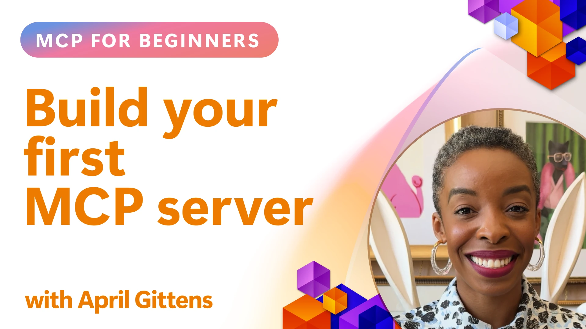

## ការចាប់ផ្តើម  

_(ចុចលើរូបភាពខាងលើដើម្បីមើលវីដេអូសម័យមេរៀននេះ)_

អ្នកនឹងបានជួបជាមួយមេរៀនជាច្រើននៅក្នុងផ្នែកនេះ៖

- **1 ម៉ាស៊ីនមេដំបូងរបស់អ្នក**, ក្នុងមេរៀនដំបូងនេះ អ្នកនឹងរៀនពីវិធីបង្កើតម៉ាស៊ីនមេដំបូងរបស់អ្នក និងពិនិត្យវាជាមួយឧបករណ៍អ្នកស៊ើបអង្កេត ដែលជាវិធីមានតម្លៃសម្រាប់សាកល្បង និងបញ្ឆេះកំហុសលើម៉ាស៊ីនមេរបស់អ្នក, [ទៅមេរៀន](01-first-server/README.md)

- **2 Client**, ក្នុងមេរៀននេះ អ្នកនឹងរៀនពីវិធីសរសេរជាសំណាក់ (client) ដែលអាចភ្ជាប់ទៅម៉ាស៊ីនមេសរបស់អ្នក, [ទៅមេរៀន](02-client/README.md)

- **3 Client ជាមួយ LLM**, វិធីល្អជាងសម្រាប់សរសេរជាសំណាក់ គឺដោយបន្ថែម LLM ចូលទៅក្នុងវា ដូច្នេះវាអាច "ចរចា" ជាមួយម៉ាស៊ីនមេសរបស់អ្នកអំពីអ្វីដែលត្រូវធ្វើ, [ទៅមេរៀន](03-llm-client/README.md)

- **4 ការប្រើម៉ូដ GitHub Copilot Agent សម្រាប់ម៉ាស៊ីនមេក្នុង Visual Studio Code**។ នៅទីនេះ យើងកំពុងមើលការរត់ម៉ាស៊ីនមេខ MCP របស់យើងពីក្នុង Visual Studio Code, [ទៅមេរៀន](04-vscode/README.md)

- **5 ម៉ាស៊ីនមេ stdio Transport** stdio transport គឺជាស្តង់ដារដែលផ្ដល់អនុសាសន៍សម្រាប់ការទំនាក់ទំនងពីម៉ាស៊ីនមេ MCP ទៅភ្ញៀវនៅក្នុងតំបន់ ដែលផ្ដល់ទំនាក់ទំនង subprocess មានសុវត្ថិភាពជាមួយការបំបែកដំណើរការដែលបង្កើតជាស្រេច [ទៅមេរៀន](05-stdio-server/README.md)

- **6 ការបញ្ច្រាស HTTP ជាមួយ MCP (Streamable HTTP)**។ រៀនអំពីស្តង់ដា
ការដឹកជញ្ជូនពីចម្ងាយនៅក្នុង [MCP Specification 2026-07-28](https://modelcontextprotocol.io/specification/2026-07-28/basic/transports/streamable-http),
បូកបញ្ចូលការអនុវត្តដែលមានប្រវត្តិរឿង session-based ដែលបានរក្សាទុកនៅក្នុងមេរៀន។
[ទៅមេរៀន](06-http-streaming/README.md)

- **7 ការប្រើប្រាស់ AI Toolkit សម្រាប់ VSCode** ដើម្បីប្រើប្រាស់ និងសាកល្បង MCP Clients និង Servers របស់អ្នក [ទៅមេរៀន](07-aitk/README.md)

- **8 ការសាកល្បង**។ នៅទីនេះ យើងនឹងផ្តោតដោយជាក់លាក់ពីរបៀបដែលយើងអាចសាកល្បងម៉ាស៊ីនមេ និងភ្ញៀវរបស់យើងបានក្នុងវិធីផ្សេងៗ, [ទៅមេរៀន](08-testing/README.md)

- **9 ការដាក់បញ្ចូល**។ មុខម្ហូបនេះនឹងមើលទៅវិធីផ្សេងៗនៃការដាក់បញ្ចូលដំណោះស្រាយ MCP របស់អ្នក, [ទៅមេរៀន](09-deployment/README.md)

- **10 ការប្រើប្រាស់ម៉ាស៊ីនមេជំនាន់ខ្ពស់**។ មុខម្ហូបនេះគ្របដណ្តប់ការប្រើប្រាស់ម៉ាស៊ីនមេជំនាន់ខ្ពស់, [ទៅមេរៀន](./10-advanced/README.md)

- **11 ការផ្ទៀងផ្ទាត់**។ មុខម្ហូបនេះគ្របដណ្តប់ពីរបៀបបន្ថែមការផ្ទៀងផ្ទាត់សាមញ្ញ ពី Basic Auth ទៅការប្រើ JWT និង RBAC។ អ្នកត្រូវបានលើកទឹកចិត្តឲ្យចាប់ផ្តើមពីទីនេះ ហើយបន្ទាប់មកមើលមុខម្ហូបជំនាន់ខ្ពស់នៃជាន់ទី 5 និងអនុវត្តន៍ការសុវត្ថិភាពបន្ថែមតាមការផ្ដល់អនុសាសន៍នៅជាន់ទី 2, [ទៅមេរៀន](./11-simple-auth/README.md)

- **12 ម្ចាស់ផ្ទះ MCP**។ កំណត់រចនាសម្ព័ន្ធ និងប្រើប្រាស់ភ្ញៀវ MCP ដែលពេញនិយម រួមទាំង Claude Desktop, Cursor, Cline, និង Windsurf។ រៀនអំពីប្រភេទដឹកជញ្ជូន និងការដោះស្រាយបញ្ហា, [ទៅមេរៀន](./12-mcp-hosts/README.md)

- **13 MCP Inspector**។ បញ្ឆេះកំហុស និងសាកល្បងម៉ាស៊ីនមេ MCP របស់អ្នកយ៉ាងចំរូងចំរាសដោយប្រើឧបករណ៍ MCP Inspector។ រៀនរបៀបដោះស្រាយឧបករណ៍, ធនធាន, និងសារโปรTOCOL, [ទៅមេរៀន](./13-mcp-inspector/README.md)

- **14 Sampling**។ រៀនពីអាកប្បករណ៍ Sampling បុរាណសម្រាប់ `2025-11-25` និង
របៀបចម្លងការរចនាថ្មីទៅកាន់ការបញ្ចូលផ្ទាល់ពីអ្នកផ្ដល់ LLM។ Sampling ត្រូវបាន
បញ្ឈប់ប្រើក្នុង MCP `2026-07-28`. [ទៅមេរៀន](./14-sampling/README.md)

- **15 MCP Apps**. បង្កើតម៉ាស៊ីនមេ MCP ដែលក៏ឆ្លើយតបជាមួយសេចក្ដីណែនាំ UI ផងដែរ, [ទៅមេរៀន](./15-mcp-apps/README.md)

ប្រព័ន្ធ Model Context Protocol (MCP) គឺជាប្រព័ន្ធបើកចំហដែលធ្វើស្តង់ដាររបៀបដែលកម្មវិធីផ្តល់បរិបទទៅ LLMs។ គិតថា MCP ដូចជាប្រភេទឧបករណ៍ USB-C សម្រាប់កម្មវិធី AI - វាផ្តល់វិធីស្តង់ដារសម្រាប់ភ្ជាប់ម៉ូដែល AI ទៅកាន់ប្រភពទិន្នន័យ និងឧបករណ៍ផ្សេងៗ។

## គោលបំណងការរៀន

នៅចុងបញ្ចប់មេរៀននេះ អ្នកនឹងមានសមត្ថភាពដូចខាងក្រោម៖

- កំណត់បរិយាកាសអភិវឌ្ឍសម្រាប់ MCP ក្នុងភាសា C#, Java, Python, TypeScript, និង JavaScript
- បង្កើត និងដាក់បញ្ចូលម៉ាស៊ីនមេ MCP មូលដ្ឋានជាមួយមុខងារផ្ទាល់ខ្លួន (ធនធាន, ការបង្ហាញចំរៀង, និងឧបករណ៍)
- បង្កើតកម្មវិធីម៉ាស៊ីនផ្ទះដែលភ្ជាប់ទៅម៉ាស៊ីនមេ MCP
- សាកល្បង និងបញ្ឆេះកំហុសការអនុវត្ត MCP
- យល់ដឹងពីបញ្ហាទូទៅក្នុងការតំឡើង និងដំណោះស្រាយរបស់វា
- ភ្ជាប់ការអនុវត្ត MCP របស់អ្នកទៅសេវាកម្ម LLM ដែលពេញនិយម

## ការតំឡើងបរិយាកាស MCP របស់អ្នក

មុននឹងចាប់ផ្តើមធ្វើការជាមួយ MCP វាជារឿងសំខាន់ក្នុងការរៀបចំបរិយាកាសអភិវឌ្ឍន៍របស់អ្នក និងយល់ពីកម្មវិធីការងារមូលដ្ឋាន។ ផ្នែកនេះនឹងដឹកនាំអ្នកតាមជំហានដំបូងដើម្បីធានាថាវាដំណើរការដោយរលូនជាមួយ MCP។

### ការត្រៀមរួច

មុននឹងចូលសម្រាប់អភិវឌ្ឍ MCP សូមបរិច្ឆេទថាអ្នកមាន៖

- **បរិយាកាសអភិវឌ្ឍន៍**៖ សម្រាប់ភាសាដែលអ្នកជ្រើសរើស (C#, Java, Python, TypeScript, ឬ JavaScript)
- **IDE/Editor**៖ Visual Studio, Visual Studio Code, IntelliJ, Eclipse, PyCharm ឬកម្មវិធីកូដសម័យទំនើបណាមួយ
- **អ្នកគ្រប់គ្រងកញ្ចប់**៖ NuGet, Maven/Gradle, pip, ឬ npm/yarn
- **កូនសោ API**៖ សម្រាប់សេវាកម្ម AI ទាំងអស់ដែលអ្នកមានគំរោងប្រើនៅក្នុងកម្មវិធីម៉ាស៊ីនផ្ទះរបស់អ្នក

### SDKs ផ្លូវការ

នៅក្នុងជំពូកដែលមកដល់ អ្នកនឹងឃើញដំណោះស្រាយដែលបានបង្កើតដោយប្រើ Python, TypeScript,
Java និង .NET។ នេះគឺជា SDK ផ្លូវការឡើយ។

ការគាំទ្ររបស់ SDK សម្រាប់ MCP `2026-07-28` កំពុងចេញផ្សាយដោយឡែកទៅតាមភាសា។
មុនមើលឧទាហរណ៍ សូមពិនិត្យកំណែ package និងកំណត់ចំណាំនៃការចេញផ្សាយ SDK
របស់វាសម្រាប់ការកែប្រែប្រព័ន្ធគ្រប់គ្រងដែលគាំទ្រ។ សូមមើល
[បញ្ជី SDK ផ្លូវការ](https://modelcontextprotocol.io/docs/sdk):
- [C# SDK](https://github.com/modelcontextprotocol/csharp-sdk) - ថែទាំរួមជាមួយ Microsoft
- [Java SDK](https://github.com/modelcontextprotocol/java-sdk) - ថែទាំរួមជាមួយ Spring AI
- [TypeScript SDK](https://github.com/modelcontextprotocol/typescript-sdk) - ការអនុវត្ត TypeScript ផ្លូវការ
- [Python SDK](https://github.com/modelcontextprotocol/python-sdk) - ការអនុវត្ត Python ផ្លូវការ (FastMCP)
- [Kotlin SDK](https://github.com/modelcontextprotocol/kotlin-sdk) - ការអនុវត្ត Kotlin ផ្លូវការ
- [Swift SDK](https://github.com/modelcontextprotocol/swift-sdk) - ថែទាំរួមជាមួយ Loopwork AI
- [Rust SDK](https://github.com/modelcontextprotocol/rust-sdk) - ការអនុវត្ត Rust ផ្លូវការ
- [Go SDK](https://github.com/modelcontextprotocol/go-sdk) - ការអនុវត្ត Go ផ្លូវការ

## ចំនុចសំខាន់ៗដែលត្រូវយកចិត្តទុកដាក់

- ការតំឡើងបរិយាកាសអភិវឌ្ឍ MCP គឺតែងតែមានភាពសាមញ្ញជាមួយ SDK នៃភាសា
- ការបង្កើតម៉ាស៊ីនមេ MCP រាប់បញ្ចូលការបង្កើត និងចុះឈ្មោះឧបករណ៍ដែលមាន schema បញ្ជាក់ច្បាស់
- MCP clients ភ្ជាប់ទៅម៉ាស៊ីនមេ និងម៉ូដែល ដើម្បីប្រើប្រាស់សមត្ថភាពបន្ថែម
- ការសាកល្បង និងបញ្ឆេះកំហុសគឺសំខាន់សម្រាប់ការអនុវត្ត MCP ដែលទុកចិត្តបាន
- ជម្រើសការដាក់បញ្ចូលក្នុងវិសាលភាពចាប់ពីការអភិវឌ្ឍនៅក្នុងតំបន់ទាំងឡាយដល់ដំណោះស្រាយដែលផ្អែកលើមេឃ

## ការអនុវត្ត

យើងមានសំណុំគំរូដែលបំពេញការហាត់ប្រាណដែលអ្នកនឹងឃើញនៅក្នុងជំពូកទាំងអស់ក្នុងផ្នែកនេះ។ បន្ថែមពីនេះ គ្រប់ជំពូកក៏មានការហាត់ប្រាណ និងភារកិច្ចផ្ទាល់ខ្លួនផងដែរ

- [គណនា Java](./samples/java/calculator/README.md)
- [គណនា .NET](../../../03-GettingStarted/samples/csharp)
- [គណនា JavaScript](./samples/javascript/README.md)
- [គណនា TypeScript](./samples/typescript/README.md)
- [គណនា Python](../../../03-GettingStarted/samples/python)

## ប្រភពសម្រួលបន្ថែម

- [ការបង្កើតអេជនដោយប្រើ Model Context Protocol លើ Azure](https://learn.microsoft.com/azure/developer/ai/intro-agents-mcp)
- [MCP ចម្ងាយជាមួយ Azure Container Apps (Node.js/TypeScript/JavaScript)](https://learn.microsoft.com/samples/azure-samples/mcp-container-ts/mcp-container-ts/)
- [អេជន OpenAI MCP សម្រាប់ .NET](https://learn.microsoft.com/samples/azure-samples/openai-mcp-agent-dotnet/openai-mcp-agent-dotnet/)

## អ្វីទៅបន្ទាប់

ចាប់ផ្តើមជាមួយមេរៀនដំបូង៖ [បង្កើតម៉ាស៊ីនមេ MCP ដំបូងរបស់អ្នក](01-first-server/README.md)

បន្ទាប់ពីអ្នកបញ្ចប់ម៉ូឌុលនេះ ត្រូវបន្តទៅ៖ [ម៉ូឌុល 4៖ ការអនុវត្តប្រាក់បញ្ញជាក់ស្តែង](../04-PracticalImplementation/README.md)

---

<!-- CO-OP TRANSLATOR DISCLAIMER START -->
**ការបដិសេធ**:
ឯកសារនេះត្រូវបានបម្លែងភាសា ដោយប្រើសេវាបម្លែងភាសា AI [Co-op Translator](https://github.com/Azure/co-op-translator)។ ទោះយើងខ្ញុំមានក្តីប្រាថ្នាឱ្យបានច្បាស់លាស់ តែសូមយល់ដឹងថាការបម្លែងដោយស្វ័យប្រវត្តិក៏អាចមានកំហុសឬភាពមិនត្រឹមត្រូវ។ ឯកសារដើមជាភាសាទីតាំងគួរត្រូវបានគេប្រើជាប្រភពច្បាស់លាស់។ សម្រាប់ព័ត៌មានសំខាន់ៗ សូមណែនាំឱ្យប្រើប្រាស់ការប្រែដោយមនុស្សជំនាញ។ យើងខ្ញុំមិនទទួលខុសត្រូវចំពោះការយល់ច្រឡំ ឬការបកស្រាយខុសបន្ទាប់ពីការប្រើប្រាស់ការបម្លែងនេះនោះទេ។
<!-- CO-OP TRANSLATOR DISCLAIMER END -->