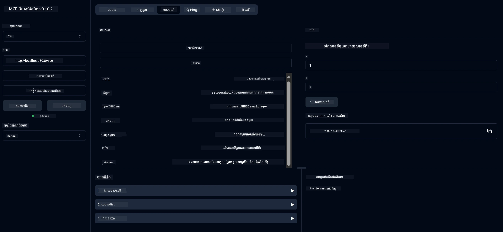

# សេវាកម្មគណនេយ្យមូលដ្ឋាន MCP

> [!NOTE]
> ឧទាហរណ៍នេះប្រើប្រាស់ការដឹកជញ្ជូន HTTP+SSE ចាស់ ហើយមានគោលដៅឱ្យឆបគ្នាជាមួយ SDK
> ដែលមាន MCP `2025-11-25`។ គេហទំព័រចម្ងាយថ្មីគួរតែប្រើសេវាកម្ម Streamable
> HTTP ជា `2026-07-28`។

សេវាកម្មនេះផ្តល់នូវប្រតិបត្តិការ គណនេយ្យមូលដ្ឋានតាមរយៈ Model Context Protocol (MCP) ដោយប្រើ Spring Boot ជាមួយការដឹកជញ្ជូន WebFlux។ វាត្រូវបានរចនាឡើងជាឧទាហរណ៍សាមញ្ញសម្រាប់អ្នកចាប់ផ្តើមដែលកំពុងរៀនអំពីការអនុវត្ត MCP។

សម្រាប់ព័ត៌មានលម្អិតបន្ថែម សូមមើលឯកសារយោង [MCP Server Boot Starter](https://docs.spring.io/spring-ai/reference/api/mcp/mcp-server-boot-starter-docs.html)។

## ទិដ្ឋភាពសង្ខេប

សេវាកម្មបង្ហាញពី៖
- គាំទ្រ SSE (Server-Sent Events)
- ការចុះបញ្ជីឧបករណ៍ស្វ័យប្រវត្តិដោយប្រើស្លាក `@Tool` របស់ Spring AI
- មុខងារគណនេយ្យមូលដ្ឋាន៖
  - ការបូក ស្រាយ គុណ ចែក
  - ការគណនាថាមពល និងឫសក្រឡា
  - ការគណនាអង្គភាពដែលនៅសល់ និងតម្លៃជាប់ជាបន្តគ្មានសញ្ញា
  - មុខងារជំនួយសម្រាប់ពិពណ៌នាការប្រតិបត្តិ

## គុណលក្ខណៈ

សេវាកម្មគណនេយ្យនេះផ្តល់នូវសមត្ថភាពដូចខាងក្រោម៖

1. **ប្រតិបត្តិការ​គណនាគ្រឹះ**៖
   - ការបូកលេខ​ពីរ
   - ការស្រាយលេខ​មួយ​ពី​លេខ​មួយ​ទៀត
   - ការគុណលេខ​ពីរ
   - ការចែកលេខ​មួយ​ដោយ​លេខ​មួយ​ទៀត (ពិនិត្យចែកសូន្យ)

2. **ប្រតិបត្តិការលំអិត**៖
   - ការគណនាថាមពល (ដាក់ទម្ងន់ទៅលើឧបករណ៍ក្រាស់)
   - ការគណនាឫសក្រឡា (ពិនិត្យលេខអវិជ្ជមាន)
   - ការគណនាអង្គភាពដែលនៅសល់
   - ការគណនាតម្លៃជាប់គ្មានសញ្ញា

3. **ប្រព័ន្ធជំនួយ**៖
   - មុខងារជំនួយនៅក្នុងស្រទាប់ដែលពន្យល់អំពីប្រតិបត្តិការទាំងអស់ដែលមាន

## ការប្រើប្រាស់សេវា

សេវាកម្មបង្ហាញចំណុច API ដូចខាងក្រោមតាមរយៈប្រព័ន្ធ MCP៖

- `add(a, b)`: បូកលេខពីរជាមួយគ្នា
- `subtract(a, b)`: ស្រាយលេខទីពីរពីលេខដំបូង
- `multiply(a, b)`: គុណលេខពីរ
- `divide(a, b)`: ចែកលេខដំបូងដោយលេខទីពីរ (ពិនិត្យសូន្យ)
- `power(base, exponent)`: គណនាថាមពលរបស់លេខមួយ
- `squareRoot(number)`: គណនាឫសក្រឡា (ពិនិត្យលេខអវិជ្ជមាន)
- `modulus(a, b)`: គណនាអង្គភាពសល់ពេលចែក
- `absolute(number)`: គណនាតម្លៃជាប់គ្មានសញ្ញា
- `help()`: ទទួលព័ត៌មានអំពីប្រតិបត្តិការអាចប្រើបាន

## គ្លាយ клиент

គ្លាយតេស្តសាមញ្ញត្រូវបានបញ្ចូលក្នុងកញ្ចប់ `com.microsoft.mcp.sample.client`។ ភាសា `SampleCalculatorClient` បង្ហាញពីប្រតិបត្តិការដែលមានរបស់សេវាកម្មគណនេយ្យ។

## ការប្រើប្រាស់ LangChain4j Client

គម្រោងនេះរួមបញ្ចូលគ្លាយឧទាហរណ៍ LangChain4j នៅក្នុង `com.microsoft.mcp.sample.client.LangChain4jClient` ដែលបង្ហាញពីរបៀបរួមបញ្ចូលសេវាកម្មគណនេយ្យជាមួយ LangChain4j និងម៉ូឌែល GitHub៖

### លក្ខខ័ណ្ឌជាមុន

1. **ការតំឡើងតូខិន GitHub**៖
   
   ដើម្បីប្រើម៉ូឌែល AI របស់ GitHub (ដូចជា phi-4), អ្នកត្រូវការតូខិនចូលប្រើផ្ទាល់ខ្លួន GitHub៖

   ក. ចូលទៅកាន់ការកំណត់គណនី GitHub របស់អ្នក៖ https://github.com/settings/tokens
   
   ខ. ចុច "Generate new token" → "Generate new token (classic)"
   
   គ. ផ្ដល់ឈ្មោះកំណត់សម្រាប់តូខិនរបស់អ្នក
   
   ង. ជ្រើសរើសផ្នែកសិទ្ធខាងក្រោម៖
      - `repo` (គ្រប់គ្រងពេញលេញលើឃ្លាំងឯកជន)
      - `read:org` (អានសមាជិកអង្គការនិងក្រុម, អានគម្រោងអង្គការ)
      - `gist` (បង្កើត gists)

      - `user:email` (ចូលដល់អាសយដ្ឋានអ៊ីមែលអ្នកប្រើប្រាស់ (អានបានតែ))
   
   e. ចុច "បង្កើតកូដ" ហើយចម្លងកូដថ្មីរបស់អ្នក
   
   f. កំណត់វាជាផលបរិបទបរិយាកាស៖
      
      លើ Windows:
      ```
      set GITHUB_TOKEN=your-github-token
      ```
      
      លើ macOS/Linux:
      ```bash
      export GITHUB_TOKEN=your-github-token
      ```

   g. សម្រាប់ការកំណត់ថេរ បន្ថែមវាទៅក្នុងផ្លាស់ប្តូរបរិយាកាសតាមរយៈការកំណត់ប្រព័ន្ធ

2. បន្ថែមផ្នែកផ្សំ LangChain4j GitHub ទៅក្នុងគម្រោងរបស់អ្នក (រួមបញ្ចូលរួចក្នុង pom.xml)៖
   ```xml
   <dependency>
       <groupId>dev.langchain4j</groupId>
       <artifactId>langchain4j-github</artifactId>
       <version>${langchain4j.version}</version>
   </dependency>
   ```

3. សូមប្រាកដថា​ ម៉ាស៊ីនបម្រើគណនាព័ត៌មានកំពុងដំណើរការលើ `localhost:8080`

### ការរត់អ្នកប្រើប្រាស់ LangChain4j

ឧទាហរណ៍នេះបង្ហាញពី៖
- ការតភ្ជាប់ទៅម៉ាស៊ីនបម្រើគណនាព័ត៌មាន MCP តាម​រយៈការដឹកជញ្ជូន SSE
- ការប្រើប្រាស់ LangChain4j ដើម្បីបង្កើតកម្មវិធីសេវាបន្ទាន់ដែលប្រើប្រតិបត្តិការគណនា
- ការរួមបញ្ចូលជាមួយគំរូបញ្ញាចក្រ GitHub (ឥឡូវកំពុងប្រើម៉ូដែល phi-4)

អ្នកប្រើប្រាស់ផ្ញើសំណួរគំរូដូចខាងក្រោមដើម្បីបង្ហាញមុខងារ៖
1. គណនាផលបូករបស់លេខពីរ
2. រកឫសការ៉េនៃលេខមួយ
3. ទទួលព័ត៌មានជំនួយអំពីប្រតិបត្តិការគណនាដែលអាចប្រើបាន

រត់ឧទាហរណ៍ និងពិនិត្យមើលលទ្ធផលនៅក្នុងកុងសូឡា ដើម្បីមើលថាម៉ូដែល AI ប្រើឧបករណ៍គណនាដើម្បីឆ្លើយតបសំណួរ

### ការកំណត់ម៉ូដែល GitHub

អ្នកប្រើប្រាស់ LangChain4j ត្រូវបានកំណត់ឲ្យប្រើម៉ូដែល phi-4 របស់ GitHub ជាមួយការកំណត់ដូចខាងក្រោម៖

```java
ChatLanguageModel model = GitHubChatModel.builder()
    .apiKey(System.getenv("GITHUB_TOKEN"))
    .timeout(Duration.ofSeconds(60))
    .modelName("phi-4")
    .logRequests(true)
    .logResponses(true)
    .build();
```

ដើម្បីប្រើម៉ូដែល GitHub ផ្សេងៗគ្នា ប្ដូរតម្លៃ `modelName` ទៅម៉ូដែលផ្សេងទៀតដែលគាំទ្រ (ឧ. "claude-3-haiku-20240307", "llama-3-70b-8192", ជាដើម)។

## ផ្នែកផ្សំ

គម្រោងត្រូវការផ្នែកផ្សំសំខាន់ៗដូចខាងក្រោម៖

```xml
<!-- For MCP Server -->
<dependency>
    <groupId>org.springframework.ai</groupId>
    <artifactId>spring-ai-starter-mcp-server-webflux</artifactId>
</dependency>

<!-- For LangChain4j integration -->
<dependency>
    <groupId>dev.langchain4j</groupId>
    <artifactId>langchain4j-mcp</artifactId>
    <version>${langchain4j.version}</version>
</dependency>

<!-- For GitHub models support -->
<dependency>
    <groupId>dev.langchain4j</groupId>
    <artifactId>langchain4j-github</artifactId>
    <version>${langchain4j.version}</version>
</dependency>
```

## ការសាងសង់គម្រោង

សាងសង់គម្រោងដោយប្រើ Maven៖
```bash
./mvnw clean install -DskipTests
```

## ការរត់ម៉ាស៊ីនបម្រើ

### ការប្រើប្រាស់ Java

```bash
java -jar target/calculator-server-0.0.1-SNAPSHOT.jar
```

### ការប្រើប្រាស់ MCP Inspector

MCP Inspector គឺជាឧបករណ៍ជាការជួយ ជាមួយការប្រតិបត្ដិការជាមួយសេវាកម្ម MCP។ ដើម្បីប្រើវាជាមួយសេវាកម្មគណនារបស់នេះ៖

1. **ដំឡើង និងរត់ MCP Inspector** ក្នុងវីនដូរថ្មី៖
   ```bash
   npx @modelcontextprotocol/inspector
   ```

2. **ចូលទៅកាន់ UI វេបសាយ** ដោយចុចលើ URL ដែលកម្មវិធីបង្ហាញ (ធម្មតា http://localhost:6274)

3. **កំណត់ការតភ្ជាប់**៖
   - កំណត់ប្រភេទដឹកជញ្ជូនទៅ "SSE"
   - កំណត់ URL ទៅគឺចំណុចចាប់ SSE របស់ម៉ាស៊ីនបម្រើដែលកំពុងដំណើរការ៖ `http://localhost:8080/sse`
   - ចុច "Connect"

4. **ប្រើឧបករណ៍**៖
   - ចុច "List Tools" ដើម្បីមើលប្រតិបត្តិការគណនាដែលអាចប្រើបាន
   - ជ្រើសឧបករណ៍ហើយចុច "Run Tool" ដើម្បីបំពេញមុខងារ



### ការប្រើប្រាស់ Docker

គម្រោងមានផ្ទាំង Dockerfile សម្រាប់ការចែកចាយតាមរយៈContainer៖

1. **សាងសង់រូបភាព Docker**៖
   ```bash
   docker build -t calculator-mcp-service .
   ```

2. **រត់ថាស Docker**៖
   ```bash
   docker run -p 8080:8080 calculator-mcp-service
   ```

នេះនឹង៖
- សាងសង់រូបភាព Docker ជាច្រើនជំហានជាមួយ Maven 3.9.9 និង Eclipse Temurin 24 JDK
- បង្កើតរូបភាព container ដែលបានបង់លើប្រសិទ្ធិភាព
- បង្ហាញសេវាកម្មលើផត 8080
- ចាប់ផ្តើមសេវាកម្មគណនាព័ត៌មាន MCP នៅក្នុង container

អ្នកអាចចូលដល់សេវាកម្មនៅ `http://localhost:8080` ពេលដែល container កំពុងដំណើរការ។

## ការដោះស្រាយបញ្ហា

### បញ្ហាទូទៅជាមួយតូកែន GitHub


1. **បញ្ហាសិទ្ធិ Token**: ប្រសិនបើអ្នកទទួលបានកំហុស 403 Forbidden សូមពិនិត្យថា token របស់អ្នកមានសិទ្ធិត្រឹមត្រូវដូចបានបញ្ជាក់ក្នុងលក្ខខណ្ឌជាមុន។

2. **រកមិនឃើញ Token**: ប្រសិនបើអ្នកទទួលបានកំហុស "No API key found" សូមធ្វើឱ្យប្រាកដថា environment variable GITHUB_TOKEN ត្រូវបានកំណត់យ៉ាងត្រឹមត្រូវ។

3. **ការដាក់កំណត់អត្រា**: GitHub API មានការកំណត់អត្រា។ ប្រសិនបើអ្នកប្រទះកំហុសកំណត់អត្រា (កូដស្ថានភាព 429) សូមរង់ចាំប៉ុន្មាននាទីមុនព្យាយាមម្តងទៀត។

4. **ការផុតកំណត់ Token**: Token GitHub អាចផុតកំណត់បាន។ ប្រសិនបើអ្នកទទួលបានកំហុសផ្ទៀងផ្ទាត់បន្ទាប់ពីរយៈពេលមួយ សូមបង្កើត token ថ្មី ហើយធ្វើបច្ចុប្បន្នភាព environment variable របស់អ្នក។

ប្រសិនបើអ្នកត្រូវការជំនួយបន្ថែម សូមពិនិត្យមើល [ឯកសាររបស់ LangChain4j](https://github.com/langchain4j/langchain4j) ឬ [ឯកសារអំពី GitHub API](https://docs.github.com/en/rest)។

---

<!-- CO-OP TRANSLATOR DISCLAIMER START -->
**ការបដិសេធ**:
ឯកសារនេះត្រូវបានបម្លែងភាសា ដោយប្រើសេវាបម្លែងភាសា AI [Co-op Translator](https://github.com/Azure/co-op-translator)។ ទោះយើងខ្ញុំមានក្តីប្រាថ្នាឱ្យបានច្បាស់លាស់ តែសូមយល់ដឹងថាការបម្លែងដោយស្វ័យប្រវត្តិក៏អាចមានកំហុសឬភាពមិនត្រឹមត្រូវ។ ឯកសារដើមជាភាសាទីតាំងគួរត្រូវបានគេប្រើជាប្រភពច្បាស់លាស់។ សម្រាប់ព័ត៌មានសំខាន់ៗ សូមណែនាំឱ្យប្រើប្រាស់ការប្រែដោយមនុស្សជំនាញ។ យើងខ្ញុំមិនទទួលខុសត្រូវចំពោះការយល់ច្រឡំ ឬការបកស្រាយខុសបន្ទាប់ពីការប្រើប្រាស់ការបម្លែងនេះនោះទេ។
<!-- CO-OP TRANSLATOR DISCLAIMER END -->