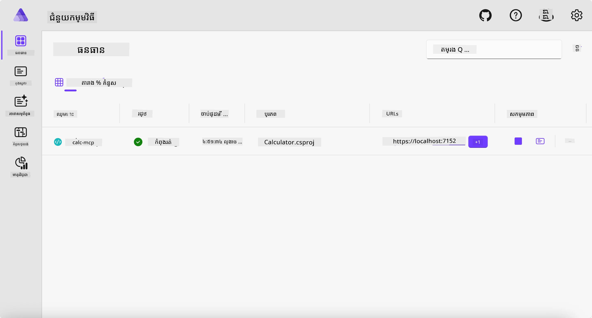
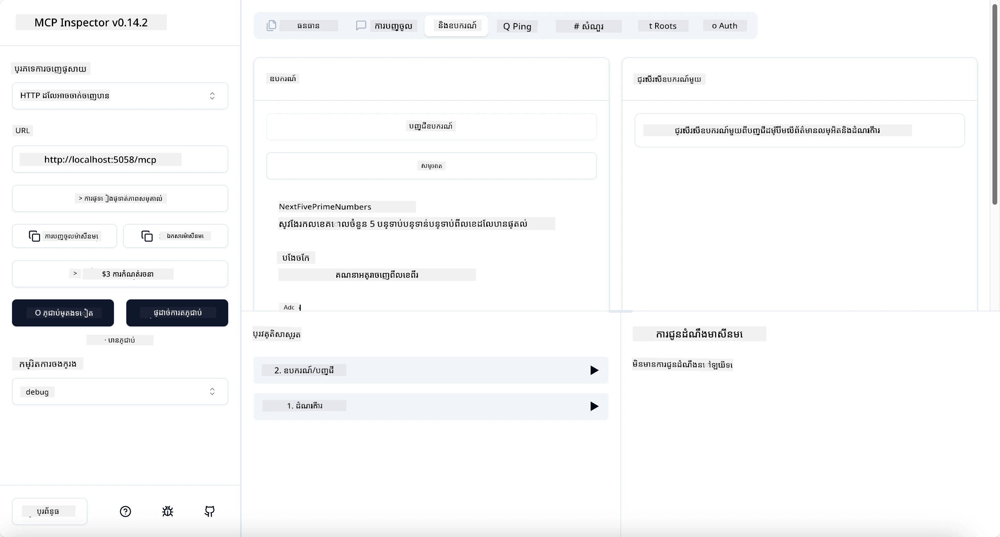
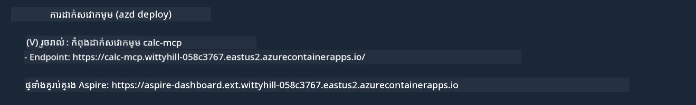

# គំរូ

ឧទាហរណ៍មុនបង្ហាញពីរបៀបប្រើប្រាស់គម្រោង .NET មូលដ្ឋានជាមួយប្រភេទ `stdio` ។ ហើយរបៀបដំណើរការកម្មវិធីម៉ាស៊ីនមេនៅក្នុងកុងតឺន័រ ។ នេះជាវិធីដំណោះស្រាយល្អក្នុងករណីជាច្រើន។ ទោះយ៉ាងណាក៏ដោយ វាអាចមានប្រយោជន៍ក្នុងការទទួលបានម៉ាស៊ីនមេដំណើរការពីចម្ងាយ ដូចនៅក្នុងបរិយាកាសពពក។ នេះជាកន្លែងដែលប្រភេទ `http` មកដល់។

ពិនិត្យមើលដំណោះស្រាយនៅក្នុងថត `04-PracticalImplementation` វាអាចមើលហាក់ដូចជាស្មុគស្មាញជាងមុន។ ប៉ុន្តែនៅក្នុងការពិត វាមិនដូចនោះទេ។ ប្រសិនបើអ្នកមើលជិតគម្រោង `src/Calculator` អ្នកនឹងឃើញថាវាជាកូដដូចគ្នាពីឧទាហរណ៍មុន។ ប្រែខុសគ្នាមានតែថាអ្នកកំពុងប្រើបណ្ណាល័យផ្សេង `ModelContextProtocol.AspNetCore` ដើម្បីដោះស្រាយសំណើ HTTP។ ហើយយើងប្ដូរឧបករណ៍ `IsPrime` ឲ្យក្លាយជាឯកជន ដើម្បីបង្ហាញថាអ្នកអាចមានវិធីផ្សេងៗឯកជនក្នុងកូដរបស់អ្នក។ កូដនៅសល់គឺដូចមុន។

គម្រោងផ្សេងទៀតគឺមកពី [Aspire](https://aspire.dev/get-started/what-is-aspire/)។ មាន Aspire ក្នុងដំណោះស្រាយនឹងបង្កើនបទពិសោធកម្មអ្នកអភិវឌ្ឍន៍នៅពេលដែលអភិវឌ្ឍន៍ និងសាកល្បង ហើយជួយផ្នែកមើលហើយឃើញ។ វាមិនចាំបាច់ដើម្បីដំណើរការម៉ាស៊ីនមេទេ ប៉ុន្តែវាជាប្រព័ន្ធល្អក្នុងដំណោះស្រាយរបស់អ្នក។

## ចាប់ផ្ដើមម៉ាស៊ីនមេនៅក្នុងផ្ទះ

1. ពី VS Code (ជាមួយផ្នែកបន្ថែម C# DevKit) ដើរទៅក្រោមថត `04-PracticalImplementation/samples/csharp`។
1. ប្រតិបត្តិការបញ្ជាទីនេះដើម្បីចាប់ផ្ដើមម៉ាស៊ីនមេ៖

   ```bash
    dotnet watch run --project ./src/AppHost
   ```

1. ពេលដែលកម្មវិធីរកមើលវេប Aspires បើកផ្ទាំងតារាងគ្រប់គ្រង សូមកត់សម្គាល់ URL `http`។ វាគួរតែផ្ទាល់ខ្លួនដូចជា `http://localhost:5058/`។

   

## សាកល្បង Streamable HTTP ជាមួយ MCP Inspector

ប្រសិនបើអ្នកមាន Node.js 22.7.5 ឬខ្ពស់ជាងនេះ អ្នកអាចប្រើ MCP Inspector ដើម្បីសាកល្បងម៉ាស៊ីនមេរបស់អ្នក។

ចាប់ផ្ដើមម៉ាស៊ីនមេ ហើយរត់បញ្ជា ខាងក្រោមនៅក្នុង Terminal៖

```bash
npx @modelcontextprotocol/inspector http://localhost:5058
```



- ជ្រើសរើស `Streamable HTTP` ជាប្រភេទផ្ទុកដឹកជញ្ជូន។
- លេខ URL, បញ្ចូល URL ម៉ាស៊ីនមេដែលត្រូវបានកត់សំគាល់ពីមុន ហើយបញ្ចូល `/mcp` ដើម្បីបន្ថែម។ វាគួរតែជារាង `http` (មិនមែន `https`) ដូចជា `http://localhost:5058/mcp`។
- ជ្រើសប៊ូតុង Connect។

រឿងល្អមួយអំពី Inspector គឺវាផ្តល់នូវទស្សនៈល្អលើអ្វីកំពុងកើតឡើង។

- សាកល្បងបញ្ជីឧបករណ៍ដែលមាន
- សាកល្បងប្រើឧបករណ៍មួយចំនួន វាគួរតែដំណើរការដូចមុន។

## សាកល្បងម៉ាស៊ីនមេ MCP ជាមួយ GitHub Copilot Chat នៅ VS Code

ដើម្បីប្រើ Streamable HTTP ជាមួយ GitHub Copilot Chat សូមផ្លាស់ប្តូរកំណត់រចនាសម្ព័ន្ធរបស់ម៉ាស៊ីនមេ `calc-mcp` ដែលបានបង្កើតមុនរួច ដើម្បីមើលដូចទៅនេះ៖

```jsonc
// .vscode/mcp.json
{
  "servers": {
    "calc-mcp": {
      "type": "http",
      "url": "http://localhost:5058/mcp"
    }
  }
}
```

សាកល្បងខ្លះៗ៖

- សូមសួរថា "លេខគោលបី(3) បន្ទាប់ពី 6780"។ ត្រួតពិនិត្យថា Copilot នឹងប្រើឧបករណ៍ថ្មី `NextFivePrimeNumbers` ហើយត្រឡប់តែលេខគោលបីដំបូង។
- សួរថា "លេខគោលប្រាំពីរ(7) បន្ទាប់ពី 111" ដើម្បីមើលថាអ្វីកើតឡើង។
- សួរថា "John មានស្ករគ្រុន 24 និងចង់ចែកអោយកូនចំនួន 3 នាក់របស់គាត់។ តើកូននីមួយៗមានប៉ុន្មាន?" ដើម្បីមើលថាអ្វីកើតឡើង។

## ផ្ដល់ម៉ាស៊ីនមេទៅ Azure

យើងទៅផ្ដល់ម៉ាស៊ីនមេទៅ Azure ដើម្បីឲ្យមនុស្សច្រើនអាចប្រើវា។

ពី Terminal ដើរទៅថត `04-PracticalImplementation/samples/csharp` ហើយដំណើរការបញ្ជាទីខាងក្រោម៖

```bash
azd up
```

បន្ទាប់ពីការផ្ដល់សម្រេច អ្នកគួរមើលឃើញសារដូចនេះ៖



ចាប់យក URL ហើយប្រើវាក្នុង MCP Inspector និង GitHub Copilot Chat។

```jsonc
// .vscode/mcp.json
{
  "servers": {
    "calc-mcp": {
      "type": "http",
      "url": "https://calc-mcp.gentleriver-3977fbcf.australiaeast.azurecontainerapps.io/mcp"
    }
  }
}
```

## តើអ្វីបន្ទាប់?

យើងសាកល្បងប្រភេទផ្ទុកដឹកជញ្ជូនផ្សេងៗ និងឧបករណ៍សាកល្បង។ យើងក៏ផ្ដល់ម៉ាស៊ីនមេ MCP របស់អ្នកទៅ Azure ផងដែរ។ ប៉ុន្តែបើម៉ាស៊ីនមេរបស់យើងត្រូវការចូលប្រើធនធានឯកជន? ឧទាហរណ៍ មូលដ្ឋានទិន្នន័យ ឬ API ឯកជន? នៅជំពូកបន្ទាប់ យើងនឹងមើលថាអ្នកអាចបង្កើនសុវត្ថិភាពម៉ាស៊ីនមេរបស់យើងដូចម្តេច។

---

<!-- CO-OP TRANSLATOR DISCLAIMER START -->
**ការបដិសេធ**:
ឯកសារនេះត្រូវបានបម្លែងភាសា ដោយប្រើសេវាបម្លែងភាសា AI [Co-op Translator](https://github.com/Azure/co-op-translator)។ ទោះយើងខ្ញុំមានក្តីប្រាថ្នាឱ្យបានច្បាស់លាស់ តែសូមយល់ដឹងថាការបម្លែងដោយស្វ័យប្រវត្តិក៏អាចមានកំហុសឬភាពមិនត្រឹមត្រូវ។ ឯកសារដើមជាភាសាទីតាំងគួរត្រូវបានគេប្រើជាប្រភពច្បាស់លាស់។ សម្រាប់ព័ត៌មានសំខាន់ៗ សូមណែនាំឱ្យប្រើប្រាស់ការប្រែដោយមនុស្សជំនាញ។ យើងខ្ញុំមិនទទួលខុសត្រូវចំពោះការយល់ច្រឡំ ឬការបកស្រាយខុសបន្ទាប់ពីការប្រើប្រាស់ការបម្លែងនេះនោះទេ។
<!-- CO-OP TRANSLATOR DISCLAIMER END -->